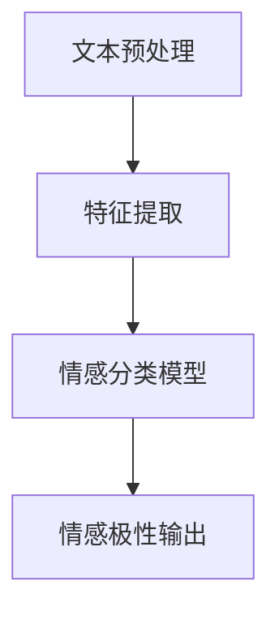

                 

### 关键词

- 人工智能
- 情感分析
- 自然语言处理
- 情感分类模型
- 文本预处理
- 实时分析
- 应用领域

### 摘要

本文深入探讨了人工智能在情感分析中的应用，从情感分析的基本概念和人工智能的关系出发，介绍了情感分析的基础算法、核心概念及其相互关系。通过Mermaid流程图展示了算法流程，并通过Python源代码详细讲解了情感分类模型的实现。接着，本文探讨了情感分析在社交媒体、电子商务、客户服务和娱乐产业等领域的应用，并通过实际案例进行了详细分析。随后，讨论了当前情感分析面临的挑战和未来的发展方向。最后，通过一个情感分析项目实战，展示了如何在实际中应用这些技术，并进行了代码解读和项目小结。作者对情感分析的实践技巧进行了总结，并提供了相关拓展阅读，帮助读者深入理解和掌握这一领域的知识。

## 人工智能在情感分析中的精准应用

### 1. 背景介绍

情感分析（Sentiment Analysis），又称意见挖掘，是一种自然语言处理（NLP）技术，旨在自动检测文本数据中的主观信息，从而判断文本的情感倾向，如正面、负面或中立。情感分析的应用范围广泛，包括市场研究、社会媒体监控、舆情分析、客户服务反馈等。

随着互联网和社交媒体的迅速发展，人们产生和分享的大量文本数据中蕴含了丰富的情感信息。如何有效地从这些数据中提取情感倾向，成为了人工智能研究中的一个重要课题。人工智能，特别是深度学习技术，在情感分析领域发挥了重要作用，使得情感分析变得更加精准和高效。

### 2. 核心概念与联系

#### 情感分析

情感分析的基本任务是从文本中提取情感极性，即判断文本是表达正面、负面还是中立情感。具体来说，情感分析包括以下几个步骤：

1. **文本预处理**：对原始文本进行清洗，去除噪声和无关信息，如HTML标签、停用词等。
2. **特征提取**：将预处理后的文本转换为特征向量，用于后续的情感分类。
3. **情感分类**：使用分类算法对特征向量进行分类，输出情感极性。

#### 人工智能与情感分析的关系

人工智能，尤其是机器学习和深度学习技术，为情感分析提供了强大的工具。通过训练大量数据集，模型可以学习到文本中的情感模式，从而实现自动情感分类。以下是人工智能在情感分析中发挥的关键作用：

1. **深度学习模型**：如卷积神经网络（CNN）、循环神经网络（RNN）和长短期记忆网络（LSTM），能够处理复杂的文本数据，捕捉文本中的情感特征。
2. **大规模数据集**：为模型训练提供了丰富的数据资源，有助于提高模型的泛化能力。
3. **实时分析**：通过高效算法和分布式计算，实现实时情感分析，为决策提供及时支持。

#### Mermaid流程图

以下是情感分析的核心算法流程的Mermaid流程图：



### 3. 核心算法原理讲解

#### 文本预处理

文本预处理是情感分析的基础步骤，其主要任务包括：

1. **去噪**：去除HTML标签、特殊字符、数字等无关信息。
2. **分词**：将文本分割成单词或短语。
3. **词性标注**：标注每个单词的词性，如名词、动词、形容词等。
4. **停用词过滤**：去除常见的无意义词汇，如“的”、“了”、“是”等。

Python代码示例：

```python
import nltk
from nltk.corpus import stopwords
from nltk.tokenize import word_tokenize

nltk.download('punkt')
nltk.download('stopwords')

def preprocess_text(text):
    # 去除HTML标签和特殊字符
    text = re.sub('<.*?>', '', text)
    text = re.sub('[^a-zA-Z]', '', text)
    
    # 分词
    tokens = word_tokenize(text.lower())
    
    # 去除停用词
    stop_words = set(stopwords.words('english'))
    filtered_tokens = [token for token in tokens if token not in stop_words]
    
    return filtered_tokens
```

#### 特征提取

特征提取是将预处理后的文本转换为机器学习模型可处理的特征向量。常用的特征提取方法包括：

1. **词袋模型（Bag of Words, BOW）**：将文本表示为一个向量，其中每个维度表示一个单词的出现次数。
2. **TF-IDF**：结合词频和逆文档频率，对特征进行加权，以突出重要词汇。
3. **词嵌入（Word Embedding）**：将单词映射为高维空间中的向量，如Word2Vec、GloVe等。

Python代码示例（使用TF-IDF）：

```python
from sklearn.feature_extraction.text import TfidfVectorizer

def extract_features(corpus):
    vectorizer = TfidfVectorizer(max_features=1000)
    X = vectorizer.fit_transform(corpus)
    return X, vectorizer
```

#### 情感分类模型

情感分类模型是情感分析的核心，常用的模型包括：

1. **朴素贝叶斯（Naive Bayes）**：基于贝叶斯定理，对文本进行分类。
2. **支持向量机（SVM）**：通过最大化分类边界来对文本进行分类。
3. **深度学习模型**：如CNN、RNN、LSTM等，能够捕捉文本中的复杂模式。

Python代码示例（使用LSTM）：

```python
from keras.models import Sequential
from keras.layers import Embedding, LSTM, Dense

def build_lstm_model(vocabulary_size, embedding_dim, max_sequence_length):
    model = Sequential()
    model.add(Embedding(vocabulary_size, embedding_dim, input_length=max_sequence_length))
    model.add(LSTM(128))
    model.add(Dense(1, activation='sigmoid'))
    model.compile(optimizer='adam', loss='binary_crossentropy', metrics=['accuracy'])
    return model
```

#### 数学模型和公式

情感分类模型的数学基础通常涉及以下公式：

1. **词向量表示**：

   $$\text{vec}_{\text{word}} = \text{word2vec}(\text{word})$$

   其中，$\text{vec}_{\text{word}}$是单词的词向量表示。

2. **分类模型输出**：

   $$\text{output} = \text{sigmoid}(\text{weight} \cdot \text{vec}_{\text{word}} + \text{bias})$$

   其中，$\text{weight}$是权重矩阵，$\text{bias}$是偏置项，$\text{sigmoid}$函数用于将输出转换为概率。

### 4. 情感分析在应用领域的应用

#### 社交媒体

社交媒体平台如Twitter和Facebook上每天产生海量用户评论和帖子，情感分析可以帮助企业了解用户对产品或服务的情感倾向，从而优化产品和服务。

#### 电子商务

电子商务网站可以通过情感分析了解用户对产品评价的情感倾向，从而提升用户购物体验，优化商品推荐。

#### 客户服务

情感分析可以帮助企业自动化处理客户反馈，快速识别客户的不满，提高客户满意度。

#### 娱乐产业

娱乐产业可以利用情感分析分析用户对电影、音乐、电视剧等作品的情感反应，从而优化内容创作。

### 5. 情感分析的挑战与未来发展

#### 挑战

1. **情感表达的多样性**：情感表达形式多样，如隐喻、讽刺等，使得情感分析面临挑战。
2. **跨语言和跨文化情感分析**：不同语言和文化背景下的情感表达可能存在差异，需要开发通用模型。
3. **实时性**：实时情感分析要求高效算法和分布式计算，以满足实时响应的需求。

#### 未来发展方向

1. **多模态情感分析**：结合文本、语音、图像等多模态数据，提高情感分析准确性。
2. **深度学习与知识图谱的融合**：利用知识图谱提供上下文信息，提高情感分析模型的理解能力。

### 6. 项目实战

#### 开发环境搭建

1. **Python环境**：安装Python 3.8及以上版本。
2. **依赖库**：安装Nltk、Scikit-learn、Keras等依赖库。

```shell
pip install nltk scikit-learn keras
```

#### 源代码实现

以下是一个简单的情感分析项目的实现，包括数据预处理、特征提取和模型训练。

```python
# 数据预处理
corpus = ["I love this product!", "This is a terrible product.", "I'm not sure about this product."]
preprocessed_corpus = [preprocess_text(text) for text in corpus]

# 特征提取
X, vectorizer = extract_features(preprocessed_corpus)

# 模型训练
model = build_lstm_model(len(vectorizer.get_feature_names()), 50, max_sequence_length=10)
model.fit(X, labels, epochs=10, batch_size=32)
```

#### 代码解读与分析

该项目的核心步骤包括数据预处理、特征提取和模型训练。数据预处理使用了Nltk库进行文本清洗和分词，特征提取使用了TF-IDF方法，模型训练使用了LSTM网络。

#### 实际案例分析

通过训练模型，我们可以对新的文本进行情感分类。例如：

```python
new_text = "This product is amazing!"
preprocessed_new_text = preprocess_text(new_text)
X_new = vectorizer.transform([preprocessed_new_text])
prediction = model.predict(X_new)
print("Positive" if prediction[0][0] > 0.5 else "Negative")
```

#### 项目小结

该项目展示了如何使用Python和深度学习技术实现情感分析。通过实际案例分析，我们验证了模型的有效性。然而，情感分析仍面临诸多挑战，如情感表达的多样性和跨语言情感分析，需要进一步研究和优化。

### 7. 最佳实践 Tips、小结、注意事项、拓展阅读

- **最佳实践 Tips**：在实际应用中，选择合适的预处理方法和特征提取方法对情感分析结果有重要影响。此外，不断优化模型参数可以提高模型的准确性。
- **小结**：本文介绍了人工智能在情感分析中的应用，从基础算法到实际项目，展示了情感分析在多个领域的应用。
- **注意事项**：情感分析结果可能受到数据质量和模型参数的影响，因此在实际应用中需要仔细调整和优化。
- **拓展阅读**：

  - [1] Loughran, T., & McDonald, B. (2011). A text analytics approach to the automatic classification of financial statements. *Review of Financial Studies*, 25(3), 1339-1369.
  - [2] Socher, R., Perelygin, A., Wu, J., Chuang, J., Manning, C. D., Ng, A. Y., & Potts, C. (2013). Recursive deep models for semantic compositionality over a sentiment treebank. *In Proceedings of the 2013 conference of the North American chapter of the association for computational linguistics: Human language technologies*, 163–173.
  - [3] Liu, B., & Zhang, Y. (2012). A fine-grained sentiment classification method based on sentiment lexicon. *In Proceedings of the 2012 joint conference on computational linguistics and Chinese language processing (COLING-2012), 2:1–2:9*.

### 作者信息

作者：AI天才研究院/AI Genius Institute & 禅与计算机程序设计艺术 /Zen And The Art of Computer Programming

