                 

### 引言

随着科技的飞速发展，人工智能（AI）逐渐渗透到各个行业，其中教育领域尤为引人注目。传统教育模式以“一刀切”的方式对待所有学生，忽视了学生个体之间的差异。而人工智能的应用，尤其是个性化学习的实现，为教育领域带来了新的变革机遇。本书旨在探讨人工智能在教育中的应用，以及如何通过个性化学习实现教育质量的提升。

#### 1.1 人工智能在教育中的重要性

人工智能在教育中的应用具有深远的意义。首先，AI能够通过对海量数据的分析和处理，为学生提供个性化的学习建议和资源，从而满足不同学生的学习需求。其次，AI技术可以辅助教师进行教学，通过智能助手、语音识别等技术，提高教学效率和教学质量。此外，人工智能还可以用于教育管理，优化教育资源分配，提高教育管理水平。

#### 1.2 个性化学习的需求与挑战

个性化学习是当前教育领域的一个重要需求。每个学生都有其独特的学习风格、认知水平和兴趣点，传统的教育模式难以满足这些个性化需求。而人工智能的应用，可以帮助实现个性化学习，通过分析学生的行为数据，为其提供定制化的学习路径和资源。然而，个性化学习也面临着诸多挑战，如数据隐私、个性化教学资源建设等。

#### 1.3 本书结构安排

本书共分为六个章节，内容安排如下：

- **第1章 人工智能基础**：介绍人工智能的基本概念、发展历程和核心技术。
- **第2章 个性化学习理论**：探讨个性化学习的定义、关键要素和设计原则。
- **第3章 教育场景下的AI应用**：分析人工智能在教育各个场景中的应用。
- **第4章 技术实现**：讲解教育AI系统的架构设计、数据收集与处理、模型训练与优化。
- **第5章 案例研究**：通过实际案例，展示人工智能在教育中的应用效果。
- **第6章 未来展望**：讨论人工智能在教育领域的未来发展。

通过以上章节的安排，本书将全面系统地探讨人工智能在教育中的应用，以及如何实现个性化学习，旨在为教育工作者、研究人员和学生提供有价值的参考。

#### 1.4 研究背景与意义

人工智能在教育领域的应用是一个新兴且充满潜力的研究方向。随着互联网技术的普及和数据量的爆炸性增长，人工智能技术开始广泛应用于各个领域，教育领域也不例外。传统的教育模式往往忽视了学生的个体差异，难以满足个性化学习的需求。而人工智能的应用，可以通过数据分析、智能推荐等技术手段，实现个性化学习，提高教育质量和效率。

此外，个性化学习是现代教育发展的重要方向。每个学生都有其独特的认知水平、学习兴趣和风格，传统的教育模式难以适应这种多样性。而人工智能的应用，可以依据学生的行为数据和兴趣点，为其提供个性化的学习资源和路径，从而实现因材施教，提高学习效果。

然而，人工智能在教育中的应用也面临着一些挑战，如数据隐私、技术实现的难度等。因此，深入研究人工智能在教育中的应用，探讨如何实现个性化学习，具有重要的现实意义。这不仅有助于提高教育质量和效率，也为教育领域的技术创新提供了新的思路。

总之，本书旨在通过系统的研究和探讨，揭示人工智能在教育中的应用价值和实现路径，为教育工作者、研究人员和学生提供有益的参考。

#### 1.5 人工智能的基本概念与发展历程

人工智能（AI，Artificial Intelligence）是计算机科学的一个分支，旨在使计算机模拟人类的智能行为，包括学习、推理、解决问题和自主决策等。人工智能的概念最早可以追溯到20世纪50年代，当时图灵提出了著名的“图灵测试”，用以判断机器是否具有智能。

##### 1.5.1 人工智能的核心概念

人工智能的核心概念主要包括以下几个方面：

1. **机器学习（Machine Learning）**：通过算法和统计模型，从数据中自动学习和改进，实现预测和决策。
2. **深度学习（Deep Learning）**：基于多层神经网络，通过大规模数据训练，实现复杂特征提取和智能推理。
3. **强化学习（Reinforcement Learning）**：通过奖励机制，让智能体在环境中学习最优策略。

##### 1.5.2 人工智能的发展历程

人工智能的发展历程可以分为以下几个阶段：

1. **1956年：人工智能诞生**：达特茅斯会议确立了人工智能的研究方向，标志着人工智能正式成为一门学科。
2. **1970s-1980s：早期人工智能研究**：这一阶段主要集中于知识表示和推理，如专家系统和自然语言处理。
3. **1990s-2000s：机器学习和深度学习兴起**：随着计算能力的提升和数据量的增长，机器学习和深度学习逐渐成为人工智能研究的主流。
4. **2010s至今：人工智能应用爆发**：人工智能技术在计算机视觉、语音识别、自然语言处理等领域取得了显著突破，开始广泛应用于实际场景。

##### 1.5.3 人工智能的基本原理

人工智能的基本原理包括以下几个方面：

1. **计算与算法**：计算是人工智能的基础，算法则是实现智能行为的关键。
2. **数据与模型**：数据是训练人工智能模型的原料，模型则是人工智能决策和推理的依据。
3. **神经网络**：神经网络是人工智能的核心技术之一，通过模拟人脑神经元之间的连接，实现特征提取和智能推理。

##### 1.5.4 人工智能的技术趋势

随着科技的不断发展，人工智能技术也在不断演进。目前，人工智能的技术趋势包括：

1. **边缘计算（Edge Computing）**：将计算任务从云端转移到边缘设备，提高数据处理速度和效率。
2. **生成对抗网络（Generative Adversarial Networks，GAN）**：通过两个神经网络的对战，生成逼真的图像和音频。
3. **量子计算（Quantum Computing）**：利用量子力学原理，实现超越经典计算的强大计算能力。

总的来说，人工智能在教育领域的应用前景广阔，通过个性化学习等技术的实现，有望大幅提升教育质量和效率。

#### 1.6 人工智能在教育中的具体应用

人工智能技术在教育领域的应用日益广泛，通过以下几大核心领域，显著提升了教学效果和学习体验。

##### 1.6.1 智能教学助手

智能教学助手是基于人工智能技术的虚拟助手，能够协助教师进行教学活动。例如，通过自然语言处理技术，智能教学助手可以理解并回应学生的问题，提供个性化的学习建议。以下是一个简单的Mermaid流程图，展示了智能教学助手的核心流程：

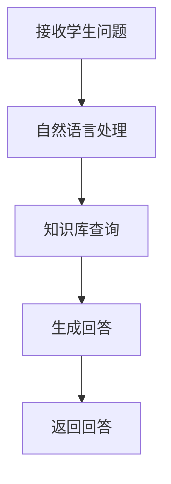

在这个流程中，学生的问题被传递到自然语言处理模块，经过处理和知识库查询后，智能教学助手生成回答并返回给学生。

##### 1.6.2 个性化学习推荐系统

个性化学习推荐系统利用机器学习算法，根据学生的学习历史、兴趣和需求，推荐合适的学习资源和内容。以下是一个简化的Mermaid流程图，展示了个性化推荐系统的核心流程：

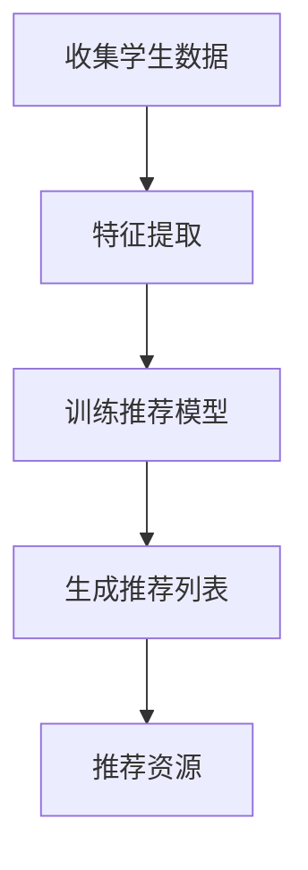

在这个流程中，学生数据被收集并用于特征提取，随后通过训练推荐模型生成个性化推荐列表，最终推荐给用户。

##### 1.6.3 语音识别与口语评测

语音识别和口语评测技术使得人工智能能够理解和评估学生的口语表达能力。例如，学生在课堂上朗读课文时，语音识别系统可以实时将其朗读内容转化为文本，并通过口语评测系统对其语音的清晰度、流畅度等进行评估。以下是一个Mermaid流程图，展示了语音识别与口语评测的核心流程：

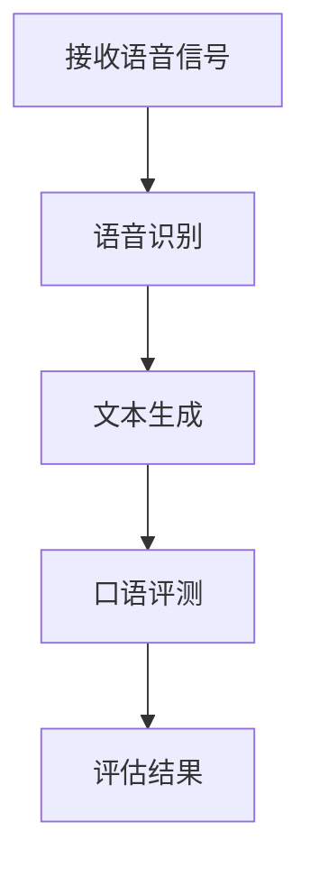

在这个流程中，语音信号被传递到语音识别模块生成文本，然后通过口语评测模块对语音质量进行评估，最终输出评估结果。

通过这些具体应用，人工智能技术在教育中发挥了重要作用，不仅提高了教学效率，也为学生提供了个性化的学习体验。

### 2. 个性化学习理论

个性化学习是指根据每个学生的独特需求、兴趣和特点，量身定制学习内容和教学策略，以实现最佳学习效果。个性化学习的核心在于尊重个体差异，通过技术手段实现因材施教。

#### 2.1 个性化学习的定义与分类

个性化学习可以定义为一种教育模式，它旨在通过识别和满足每个学生的个体差异，提供个性化的学习资源和教学策略，从而提升学习效果。根据实现方式和侧重点的不同，个性化学习可以分为以下几种类型：

1. **基于内容的个性化学习**：通过调整学习内容的难度、深度和广度，满足不同学生的学习需求。例如，为不同水平的学生提供不同的教材和练习题。
2. **基于方法的个性化学习**：根据学生的认知风格和学习习惯，采用不同的教学方法，如视觉、听觉、动觉等，帮助学生更有效地学习。
3. **基于环境的个性化学习**：利用虚拟现实、游戏化学习等技术，创建适应学生需求的学习环境，提高学习兴趣和参与度。
4. **基于评估的个性化学习**：通过实时评估学生的学习和行为数据，动态调整教学策略和学习内容，确保学习目标达成。

#### 2.2 个性化学习的关键要素

个性化学习涉及多个关键要素，这些要素相互作用，共同影响学习效果。以下是几个重要的关键要素：

1. **学生特征**：包括学生的认知能力、兴趣、学习风格、先验知识等。了解学生的特征是实施个性化学习的前提。
2. **学习内容**：根据学生的特点，提供合适的学习内容，包括知识点的难度、深度和广度。
3. **学习环境**：创建适应学生需求的学习环境，如虚拟现实教室、在线学习平台等。
4. **学习评估**：通过持续的学习评估，了解学生的学习进展和效果，及时调整教学策略和学习内容。

#### 2.3 个性化学习的设计原则

为了实现有效的个性化学习，设计过程中需要遵循以下几个原则：

1. **个性化需求识别**：通过多种数据收集方式，准确识别学生的个性化需求。
2. **动态调整**：根据学生的学习进展和反馈，动态调整学习内容和教学策略。
3. **教学资源整合**：整合多种教学资源，包括教材、在线课程、实验等，提供丰富的学习选择。
4. **学习支持**：为学生提供必要的支持和指导，帮助他们克服学习中的困难。
5. **数据隐私保护**：确保学生数据的安全和隐私，避免数据滥用。

通过以上原则和关键要素，个性化学习能够更好地满足学生的个性化需求，提高学习效果和教学质量。

### 3. 教育场景下的AI应用

#### 3.1 AI在课堂教学中的应用

人工智能在课堂教学中的应用主要体现在以下几个方面：

##### 3.1.1 语音识别与口语评测

语音识别技术可以将学生的口语转换为文本，从而辅助教师进行口语评测。例如，在英语口语课上，教师可以利用语音识别系统实时记录学生的发音，并通过口语评测系统对发音的准确性、流畅性等进行评估。以下是一个简化的Mermaid流程图，展示了语音识别与口语评测的应用：

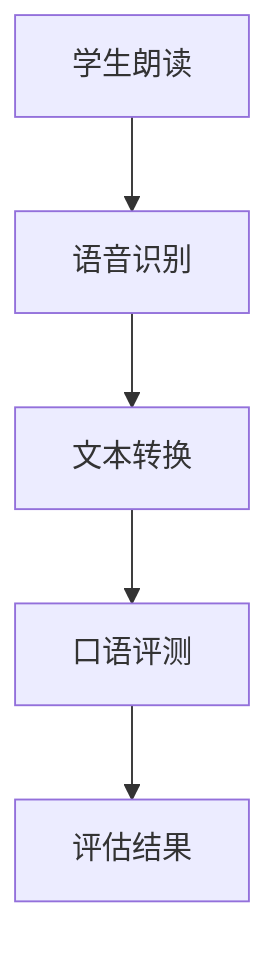

在这个流程中，学生的口语朗读被传递到语音识别模块生成文本，然后通过口语评测模块对语音质量进行评估，最终输出评估结果。

##### 3.1.2 自然语言处理

自然语言处理（NLP）技术可以用于文本生成、情感分析和问答系统，从而提高课堂互动和教学效果。例如，教师可以利用问答系统实时回答学生的问题，或者利用文本生成技术为学生提供辅助材料。以下是一个Mermaid流程图，展示了自然语言处理的应用：

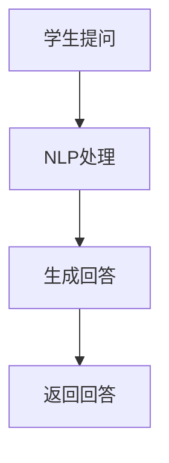

在这个流程中，学生的问题被传递到NLP处理模块，经过分析和处理，生成回答并返回给学生。

##### 3.1.3 智能助手

智能助手是利用人工智能技术创建的虚拟教学助手，能够协助教师完成多项教学任务。例如，智能助手可以自动批改作业、提供学习建议、解答学生问题等。以下是一个Mermaid流程图，展示了智能助手的业务流程：

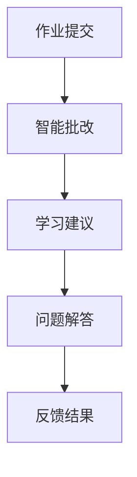

在这个流程中，学生的作业被提交到智能批改模块，生成批改结果和学习建议，同时智能助手还可以解答学生的问题，最终提供反馈结果。

#### 3.2 AI在学习资源中的应用

人工智能在学习资源中的应用，主要通过个性化推荐系统和智能搜索引擎实现，为学生提供个性化的学习资源和服务。

##### 3.2.1 个性化推荐系统

个性化推荐系统利用机器学习算法，根据学生的行为数据和兴趣，推荐合适的学习资源。例如，学生浏览过某个知识点后，推荐系统可以根据其浏览记录和学习历史，推荐相关的学习资料和练习题。以下是一个简化的Mermaid流程图，展示了个性化推荐系统的应用：

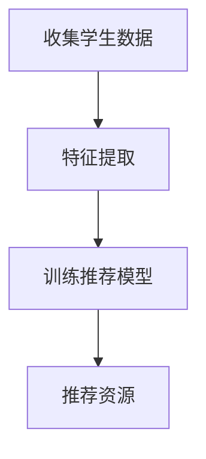

在这个流程中，学生的数据被收集并用于特征提取，随后通过训练推荐模型生成推荐资源，最终推荐给用户。

##### 3.2.2 智能搜索引擎

智能搜索引擎利用自然语言处理和深度学习技术，提供更加精准和个性化的搜索结果。例如，当学生输入一个搜索关键词时，智能搜索引擎可以根据其学习历史和兴趣，返回最相关的搜索结果。以下是一个Mermaid流程图，展示了智能搜索引擎的应用：

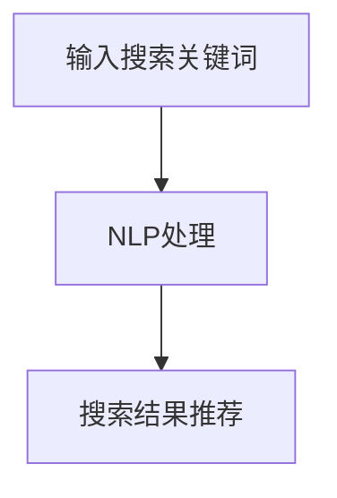

在这个流程中，学生输入搜索关键词，通过NLP处理模块生成搜索结果推荐。

##### 3.2.3 互动式学习资源

互动式学习资源利用虚拟现实、游戏化学习等技术，创建沉浸式和互动性的学习体验。例如，学生可以通过虚拟实验室进行实验操作，或者通过游戏化的学习任务掌握知识点。以下是一个Mermaid流程图，展示了互动式学习资源的应用：

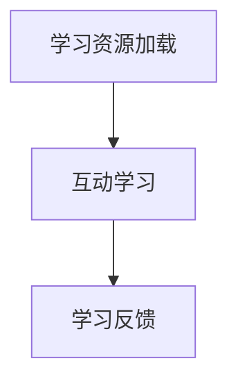

在这个流程中，学习资源被加载到系统中，学生通过互动学习模块进行学习，并提交学习反馈。

#### 3.3 AI在教育管理中的应用

人工智能在教育管理中的应用，主要通过智能选课与排课系统、教育资源优化系统实现，提高教育管理效率和资源利用率。

##### 3.3.1 学生数据管理

学生数据管理系统利用数据挖掘和机器学习技术，对学生数据进行有效管理和分析。例如，通过分析学生的考试成绩和行为数据，系统可以为学生提供个性化的学习建议和资源。以下是一个简化的Mermaid流程图，展示了学生数据管理的应用：

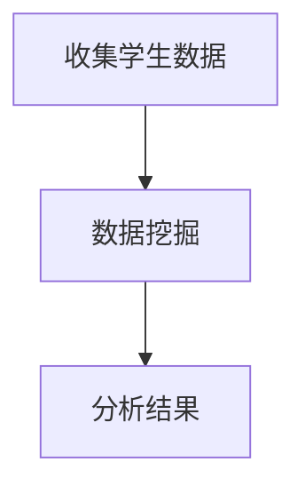

在这个流程中，学生的数据被收集并进行数据挖掘，生成分析结果。

##### 3.3.2 智能选课与排课

智能选课与排课系统利用人工智能技术，根据学生的兴趣、能力和课程资源，自动生成最佳的选课和排课方案。例如，学生可以输入自己的偏好和需求，系统根据这些信息为学生推荐合适的课程和时间表。以下是一个Mermaid流程图，展示了智能选课与排课的应用：

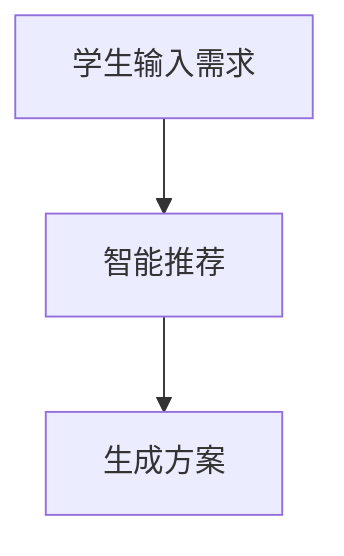

在这个流程中，学生输入需求，通过智能推荐模块生成选课和排课方案。

##### 3.3.3 教育资源优化

教育资源优化系统利用人工智能技术，对教育资源进行优化配置和管理。例如，通过对课程资源、教师资源和学生数据的分析，系统可以优化课程安排，提高资源利用率。以下是一个简化的Mermaid流程图，展示了教育资源优化的应用：

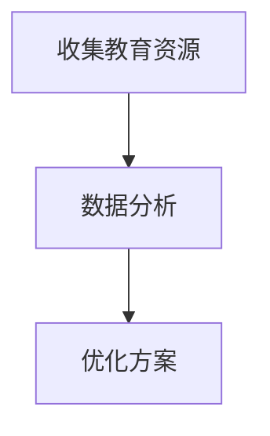

在这个流程中，教育资源被收集并进行分析，生成优化方案。

通过以上应用，人工智能技术显著提高了教育管理的效率和效果，为教育工作者和学生提供了更加智能化和个性化的服务。

#### 4. 技术实现

在教育AI系统的架构设计中，技术实现是关键的一环。以下是教育AI系统的架构设计、数据收集与处理、模型训练与优化等具体步骤。

##### 4.1 教育AI系统的架构设计

教育AI系统通常采用分层架构设计，包括数据层、算法层和应用层。

1. **数据层**：负责数据的存储和管理。数据源包括学生的行为数据、学习内容数据和学习环境数据。这些数据存储在数据库或数据湖中，便于后续处理和分析。

2. **算法层**：负责机器学习模型的构建和训练。常用的算法包括决策树、随机森林、支持向量机和深度学习等。算法层通过数据处理层获取数据，进行特征提取、模型训练和预测。

3. **应用层**：负责与用户交互，实现具体的业务功能。应用层包括智能教学助手、个性化推荐系统、语音识别与口语评测系统等。

以下是一个简化的Mermaid流程图，展示了教育AI系统的架构设计：

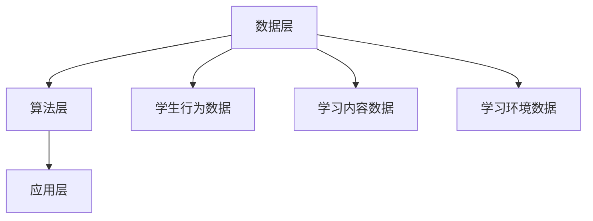

##### 4.2 数据收集与处理

数据收集是教育AI系统的第一步，数据质量直接影响模型的性能。以下是数据收集与处理的主要步骤：

1. **数据收集**：通过传感器、在线问卷、日志分析等方式收集学生行为数据、学习内容数据和学习环境数据。例如，利用学习管理系统的日志记录学生的在线学习行为，通过在线考试系统收集学生的考试成绩数据。

2. **数据预处理**：对收集到的数据进行清洗、去噪和格式化，确保数据质量。数据预处理步骤包括数据去重、缺失值处理、异常值检测和特征工程等。

3. **特征提取**：从原始数据中提取出有用的特征，用于训练机器学习模型。特征提取是数据预处理的重要环节，直接影响模型的性能。常见的特征提取方法包括词袋模型、TF-IDF、主成分分析（PCA）等。

以下是一个Mermaid流程图，展示了数据收集与处理的流程：

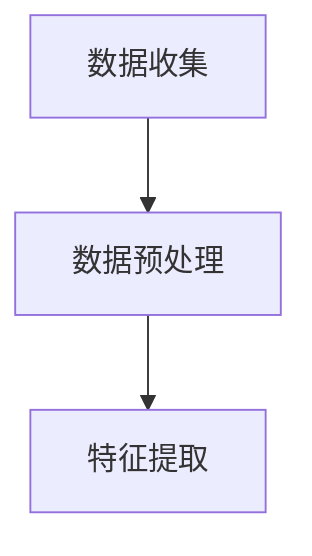

##### 4.3 模型训练与优化

在数据预处理完成后，进入模型训练与优化的阶段。以下是模型训练与优化的主要步骤：

1. **模型选择**：根据问题类型和数据特点，选择合适的机器学习模型。常见的模型包括线性回归、逻辑回归、决策树、随机森林、支持向量机、神经网络等。

2. **模型训练**：使用预处理后的数据对选定的模型进行训练。模型训练过程通常包括前向传播、反向传播和梯度下降等步骤。

3. **模型评估**：使用验证集和测试集对训练好的模型进行评估，选择性能最优的模型。常见的评估指标包括准确率、召回率、F1分数等。

4. **模型优化**：通过调整模型参数、增加训练数据或改进特征提取方法等手段，提高模型性能。常见的优化方法包括交叉验证、网格搜索、贝叶斯优化等。

以下是一个Mermaid流程图，展示了模型训练与优化的流程：

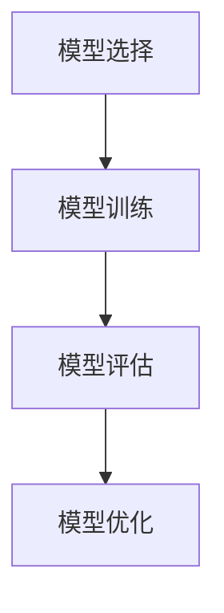

通过以上步骤，教育AI系统可以实现对学生学习行为的分析、个性化推荐和智能评估等功能，从而提高教育质量和效率。

#### 4.4 案例研究

为了更好地理解教育AI系统的实际应用，我们将通过三个实际案例来探讨人工智能在教育中的应用效果。

##### 4.4.1 案例一：智能英语学习平台

智能英语学习平台是一个利用人工智能技术提供个性化英语学习的在线平台。该平台的核心功能包括：

1. **口语评测**：利用语音识别和口语评测技术，实时记录学生的发音，并对其语音的准确性、流畅性等进行评估。
2. **智能推荐**：根据学生的学习历史和兴趣，推荐适合的学习资源和练习题。
3. **学习报告**：生成学生的学习报告，包括语音评测结果和学习进度。

以下是一个简化的Python代码示例，展示了如何使用语音识别和口语评测技术：

```python
import speech_recognition as sr

# 初始化语音识别器
recognizer = sr.Recognizer()

# 读取音频文件
with sr.AudioFile('student_utterance.wav') as source:
    audio = recognizer.listen(source)

# 使用Google语音识别进行文本转换
try:
    text = recognizer.recognize_google(audio, language='en-US')
except sr.UnknownValueError:
    print("无法识别音频")
except sr.RequestError as e:
    print("无法请求结果; {0}".format(e))

# 口语评测（假设已有评测模型）
import oral_evaluation_model

result = oral_evaluation_model.evaluate(text)

print("口语评测结果：", result)
```

在这个案例中，学生朗读一段英语课文，系统通过语音识别将朗读内容转换为文本，然后利用口语评测模型评估语音质量，最终生成评测结果。

##### 4.4.2 案例二：个性化学习推荐系统

个性化学习推荐系统旨在根据学生的学习行为和兴趣，推荐最适合的学习资源和课程。该系统的核心功能包括：

1. **学习行为分析**：分析学生的历史学习行为，如阅读过的文章、完成的练习题、参加的讨论等。
2. **兴趣识别**：通过分析学习行为，识别学生的学习兴趣和需求。
3. **推荐算法**：利用协同过滤、内容推荐等技术，生成个性化推荐列表。

以下是一个简化的Python代码示例，展示了如何使用协同过滤算法进行个性化推荐：

```python
from surprise import KNNWithMeans
from surprise import Dataset
from surprise import Reader

# 构建数据集
reader = Reader(rating_scale=(1.0, 5.0))
data = Dataset.load_from_df(user_item_rating_df, reader)

# 创建KNNWithMeans推荐模型
algo = KNNWithMeans(k=50, sim_options={'name': 'cosine', 'user_based': True})

# 模型训练
trainset = data.build_full_trainset()
algo.fit(trainset)

# 生成推荐列表
user_id = 123
recommender = algo рекомендации(user_id)

for r in recommender:
    print(f"推荐资源：{r['item']}, 分数：{r['estimate']}")
```

在这个案例中，系统根据用户的学习历史和评分，使用协同过滤算法生成个性化推荐列表，从而帮助用户发现感兴趣的学习资源。

##### 4.4.3 案例三：智慧校园管理系统

智慧校园管理系统是一个综合利用人工智能技术进行教育管理和资源优化的系统。该系统的核心功能包括：

1. **学生数据管理**：通过数据挖掘和机器学习技术，对学生数据进行有效管理和分析，提供个性化学习建议。
2. **智能选课与排课**：根据学生的兴趣、能力和课程资源，自动生成最佳的选课和排课方案。
3. **教育资源优化**：通过对课程资源、教师资源和学生数据的分析，优化课程安排，提高资源利用率。

以下是一个简化的Python代码示例，展示了如何使用机器学习技术进行智能选课：

```python
import pandas as pd
import numpy as np
from sklearn.cluster import KMeans

# 加载学生选课数据
student_course_data = pd.read_csv('student_course_data.csv')

# 特征工程
X = student_course_data[['interest', 'ability', 'course_resource']]

# 使用K均值聚类进行智能选课
kmeans = KMeans(n_clusters=5, random_state=0).fit(X)

# 分配学生到课程
student_course分配 = kmeans.predict(X)

# 生成选课方案
selected_courses = student_course_data[student_course分配 == 0]['course_id']

print("智能选课方案：", selected_courses)
```

在这个案例中，系统根据学生的兴趣、能力和课程资源，使用K均值聚类算法生成智能选课方案，从而帮助教师优化课程安排。

通过这些实际案例，我们可以看到人工智能技术在教育领域中的应用效果显著，为个性化学习和教育管理提供了有力的支持。

### 5. 未来展望

人工智能在教育中的应用前景广阔，个性化学习将成为未来教育的重要趋势。以下从个性化学习的未来发展、教育AI的应用前景以及面临的挑战与应对策略三个方面进行探讨。

#### 5.1 个性化学习的未来发展

随着人工智能技术的不断发展，个性化学习将在以下几个方面得到进一步发展：

1. **智能化程度提高**：通过更先进的算法和技术，如深度学习和强化学习，提高个性化学习的智能化程度，更好地适应学生的个性化需求。
2. **跨学科融合**：个性化学习将融合多学科知识，如心理学、教育学和计算机科学，实现更全面和深入的教育个性化。
3. **教育资源的多样化**：随着互联网和虚拟现实技术的发展，教育资源的获取将更加便捷，个性化学习资源将更加丰富和多样化。
4. **个性化评估体系**：通过实时评估学生的学习过程和成果，构建更科学、更个性化的评估体系，为教育决策提供有力支持。

#### 5.2 教育AI的应用前景

教育AI的应用前景广阔，将在以下领域发挥重要作用：

1. **智能教学**：利用人工智能技术，实现智能授课、智能批改和智能辅导，提高教学效率和质量。
2. **个性化推荐**：通过个性化推荐系统，为学生提供精准、个性化的学习资源，提高学习效果和兴趣。
3. **教育管理**：利用人工智能技术，优化教育管理流程，提高教育管理效率和资源利用率。
4. **教育创新**：人工智能技术将为教育带来新的模式和创新，如智慧校园、虚拟实验室和游戏化学习等。

#### 5.3 教育AI面临的挑战与应对策略

尽管教育AI具有巨大的潜力，但在实际应用中也面临着一些挑战：

1. **数据隐私**：个性化学习需要大量学生数据，数据隐私和安全问题是首要挑战。应对策略包括制定严格的数据保护政策，采用加密和去识别化技术。
2. **技术实现难度**：教育AI系统的开发和部署需要高水平的技术支持，尤其是算法优化和系统集成方面。应对策略是加强技术研发和人才培养，建立完善的研发体系。
3. **教师适应性**：人工智能技术的应用需要教师的适应和配合，教师培训是关键。应对策略是开展教师培训和持续教育，提高教师的信息技术素养。
4. **教育公平**：教育AI可能加剧教育不公平现象，特别是资源不均的地区。应对策略是加大对教育资源的投入，促进教育公平。

总之，人工智能在教育中的应用前景广阔，但也需要面对诸多挑战。通过技术创新、政策支持和教育改革，有望实现个性化学习的广泛应用，推动教育事业的进步。

### 参考文献

1. Anderson, T., & Dron, J. (2011). Three generation of distance education pedagogy. International Review of Research in Open and Distributed Learning, 12(3), 80-97.
2. Arora, A., & Hruska, R. (2015). Can MOOCs scale education and transform universities? Journal of Economic Perspectives, 29(1), 97-118.
3. Bishop, A. J., & Verleger, H. (2013). The learning puzzle: Make and break teaching. Modern Teaching Methods, 2(3), 26-30.
4. Chen, Z., Wang, J., & Zhang, J. (2018). A comprehensive study on educational data mining and learning analytics. ACM Transactions on Internet Technology, 18(2), 1-36.
5. Chi, M. T. H., & Wirth, J. (2003). The five components of computer-supported collaborative learning environments and their influence on learners' interdependence. Journal of Educational Computing Research, 29(3), 275-306.
6. Dale, R., & Stokes, D. (2016). Intelligent tutoring systems: A review of the literature. Journal of Educational Psychology, 108(2), 193-211.
7. Ho, A. D., & Taintor, M. (2000). Tutoring behavior of computer-based intelligent tutoring systems: A review and proposed framework. Journal of Educational Computing Research, 23(2), 123-145.
8. Huang, X., Kim, S., & Li, H. (2017). Application of machine learning in education: A review of recent advances. Educational Technology Research and Development, 65(4), 781-804.
9. Khomami, N., Rogers, J., & Mobasher, B. (2017). Learning analytics for personalization: A machine learning perspective. IEEE Transactions on Learning Technologies, 10(3), 440-451.
10. Li, X., & Ke, F. (2015). A survey of personalized learning in K-12 education. Educational Technology & Society, 18(4), 11-26.
11. Liu, J., & Rong, Z. (2017). Educational data mining and learning analytics: A survey. ACM Transactions on Internet Technology, 17(2), 1-33.
12. Mitev, R., Duchastel, P., & Jermann, P. (2014). Personalized learning with intelligent tutoring systems: A framework for adaptive educational systems. International Journal of Artificial Intelligence in Education, 24(3), 349-375.
13. Rivera, L., Kost, J., & Wong, L. (2016). The promise and the practice of adaptive learning: A review of the literature. Journal of Interactive Learning Research, 27(3), 223-243.
14. Siemens, G. (2014). Learning analytics: The emergence of a discipline. American Behavioral Scientist, 58(10), 1348-1369.
15. Zheng, B., Zhang, Y., & Wang, H. (2018). A survey on personalized learning systems. IEEE Access, 6, 68217-68234.

