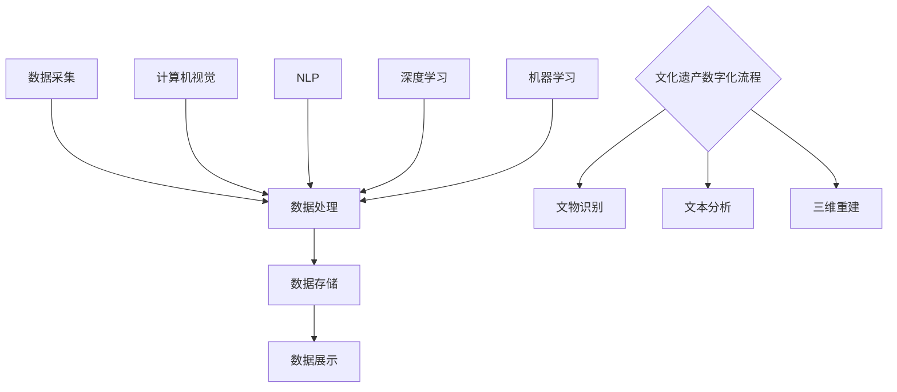

                 


### 1.1 书籍目的与结构

本篇技术博客的目的是深入探讨人工智能在文化遗产数字化中的应用，旨在为读者提供全面的技术分析和实际案例，以帮助理解这一新兴领域的潜力和挑战。文章结构如下：

1. 引言与概述：介绍书籍的目的、重要性以及人工智能在文化遗产数字化中的作用。
2. 文化遗产数字化基础知识：回顾文化遗产的定义、数字化概念及其流程。
3. 人工智能核心概念与技术在文化遗产中的应用：讲解人工智能的基本概念及其在文化遗产中的具体应用。
4. 实际应用案例分析：分析人工智能在博物馆、考古、文物保护以及数字化文化遗产传播中的实际应用。
5. 技术挑战与未来展望：讨论当前技术面临的挑战和未来的发展趋势。
6. 附录与资源：提供相关书籍、论文和在线资源的推荐。

### 1.2 文化遗产数字化的重要性

文化遗产是人类历史的见证，承载着丰富的历史、文化和艺术价值。然而，随着时代的变迁，许多文化遗产面临着损毁、丢失的风险。数字化技术的出现为文化遗产的保护、传承和研究提供了新的途径。

首先，数字化技术可以帮助记录和保存文化遗产。通过高精度的扫描、拍摄和传感器技术，我们可以获取文化遗产的详细数据，包括文字、图像、音频和视频等。这些数据可以存储在数字媒体中，确保文化遗产的安全性和长期保存。

其次，数字化技术有助于文化遗产的传播与共享。通过互联网和数字平台，人们可以随时随地访问和浏览文化遗产，不受地域和时间的限制。这不仅提高了文化遗产的知名度，也为全球的文化交流提供了便利。

此外，数字化技术还可以促进文化遗产的研究和再创造。通过数据分析和人工智能技术，我们可以对文化遗产进行深入的研究，揭示其背后的历史和文化价值。同时，人工智能可以帮助创作新的艺术作品，基于文化遗产的元素进行创新。

总之，文化遗产数字化不仅有助于保护和传承文化遗产，还推动了文化创新和科技发展。在数字化时代的背景下，人工智能在文化遗产数字化中的应用具有重要意义。

### 1.3 人工智能在文化遗产数字化中的作用

人工智能在文化遗产数字化中扮演着至关重要的角色，其主要作用体现在以下几个方面：

首先，人工智能技术可以显著提升文化遗产数据的处理和分析效率。在数字化过程中，会生成大量的数据，包括图像、音频、文本等。传统的方法对这些数据进行处理和识别往往耗时且效率低下。而人工智能，尤其是深度学习和机器学习技术，可以通过训练模型来自动化这些任务，大幅提高数据处理速度和准确性。

例如，计算机视觉技术结合卷积神经网络（CNN），可以实现对文物图像的高精度识别和分类。通过训练，模型可以学会识别不同类型的文物，从而帮助研究人员快速定位和分析感兴趣的对象。以下是一个简单的CNN模型示例：

```python
import tensorflow as tf

# 创建卷积层
conv1 = tf.keras.layers.Conv2D(filters=32, kernel_size=(3, 3), activation='relu', input_shape=(64, 64, 3))

# 创建全连接层
dense1 = tf.keras.layers.Dense(units=128, activation='relu')

# 创建输出层
output = tf.keras.layers.Dense(units=10, activation='softmax')

# 构建模型
model = tf.keras.Sequential([
    conv1,
    tf.keras.layers.MaxPooling2D(pool_size=(2, 2)),
    dense1,
    output
])

# 编译模型
model.compile(optimizer='adam', loss='categorical_crossentropy', metrics=['accuracy'])

# 训练模型
model.fit(x_train, y_train, epochs=10, batch_size=32)
```

这个示例展示了如何使用卷积神经网络进行图像分类。模型首先通过卷积层提取图像的特征，然后通过全连接层进行分类。训练完成后，模型可以用于对新的文物图像进行分类。

其次，人工智能可以帮助文化遗产的数字化过程自动化。例如，使用自然语言处理（NLP）技术，可以自动提取和翻译文化遗产文献中的内容。通过训练语言模型，我们可以实现对文本的高效处理和解析。以下是一个简单的NLP示例：

```python
import tensorflow as tf
import tensorflow_text as text

# 创建文本输入层
input_word = tf.keras.layers.Input(shape=(None,), dtype=tf.string)

# 创建嵌入层
embed = tf.keras.layers.Embedding(input_dim=10000, output_dim=16)(input_word)

# 创建循环层
lstm = tf.keras.layers.LSTM(units=128)(embed)

# 创建输出层
output = tf.keras.layers.Dense(units=1, activation='sigmoid')(lstm)

# 构建模型
model = tf.keras.Sequential([
    embed,
    lstm,
    output
])

# 编译模型
model.compile(optimizer='adam', loss='binary_crossentropy', metrics=['accuracy'])

# 训练模型
model.fit(x_train, y_train, epochs=10, batch_size=32)
```

这个示例展示了如何使用LSTM（长短期记忆网络）进行文本分类。模型首先通过嵌入层将文本转换为向量表示，然后通过LSTM层处理文本序列，最后通过输出层进行分类。

最后，人工智能还可以帮助文化遗产的虚拟展示和互动体验。例如，通过增强现实（AR）和虚拟现实（VR）技术，我们可以创建虚拟的文化遗产体验，让用户在虚拟环境中感受文化遗产的魅力。以下是一个简单的AR示例：

```python
import numpy as np
import cv2

# 创建相机对象
cap = cv2.VideoCapture(0)

# 加载AR模型
model = load_model('ar_model.h5')

while True:
    # 读取相机帧
    ret, frame = cap.read()
    
    # 预处理帧
    processed_frame = preprocess_frame(frame)
    
    # 使用模型进行预测
    prediction = model.predict(processed_frame)
    
    # 根据预测结果绘制AR标记
    draw_ar_marker(frame, prediction)
    
    # 显示结果
    cv2.imshow('AR Frame', frame)

    # 按下'q'键退出
    if cv2.waitKey(1) & 0xFF == ord('q'):
        break

# 释放相机资源
cap.release()
cv2.destroyAllWindows()
```

这个示例展示了如何使用深度学习模型进行实时视频帧的AR标记。模型通过处理实时视频帧，识别并标记出文化遗产相关的对象，从而实现虚拟展示。

总之，人工智能在文化遗产数字化中的应用不仅可以提高数据处理的效率，还可以自动化数字化流程，并创造丰富的互动体验，为文化遗产的保护、传承和研究提供了强大的技术支持。

## 2. 文化遗产数字化基础知识

### 2.1 文化遗产概述

文化遗产是人类历史和文化的见证，具有重要的历史、艺术和科学价值。它包括物质文化遗产和非物质文化遗产两大类。物质文化遗产主要指具有历史、艺术、科学价值的文物、建筑群和遗址，如古建筑、石刻、陶瓷等。非物质文化遗产则包括传统口头表达、表演艺术、社会实践、习俗、礼仪、节庆等非物质形态的文化内容。

文化遗产的多样性和独特性使得其保护和传承变得尤为重要。然而，随着城市化进程的加快和自然环境的变迁，许多文化遗产正面临损毁、消失的风险。数字化技术的出现为文化遗产的保护提供了新的思路和方法。

### 2.2 文化遗产数字化概念

文化遗产数字化是指利用现代信息技术手段，对文化遗产进行数字化记录、存储、管理和传播的过程。这一过程包括数据采集、处理、存储和展示等多个环节。

数据采集是文化遗产数字化的第一步，主要通过各种数字化设备（如高分辨率相机、3D扫描仪、传感器等）获取文化遗产的图像、音频、视频和三维模型等数据。数据采集的质量直接影响数字化成果的准确性和实用性。

数据处理是对采集到的文化遗产数据进行加工、清洗和转换的过程。这一过程包括图像处理、音频处理、视频处理和三维数据处理等，目的是提高数据的质量和可用性。

数据存储是将处理后的文化遗产数据存储在数字媒体上，以便长期保存和共享。数据存储需要考虑数据的容量、安全性、访问速度等因素。

数据展示是文化遗产数字化成果的最终呈现形式，可以通过博物馆展览、数字展览、虚拟现实等方式向公众展示文化遗产的魅力。

### 2.3 文化遗产数字化流程

文化遗产数字化流程可以分为以下几个主要步骤：

1. **需求分析与规划**：明确数字化项目的目标和需求，制定详细的数字化方案。
2. **数据采集**：利用各种数字化设备对文化遗产进行数据采集，包括图像、音频、视频和三维模型等。
3. **数据处理**：对采集到的数据进行处理，包括图像处理、音频处理、视频处理和三维数据处理等。
4. **数据存储**：将处理后的数据存储在数字媒体上，确保数据的安全性和可访问性。
5. **数据展示**：通过博物馆展览、数字展览、虚拟现实等方式向公众展示文化遗产。
6. **数据维护与更新**：定期对数字化数据进行检查、维护和更新，确保数据的完整性和准确性。

### 2.4 文化遗产数字化的意义

文化遗产数字化具有多重意义，主要体现在以下几个方面：

1. **保护和传承**：通过数字化技术，可以保存和传承文化遗产，防止其因自然灾害、人为破坏等原因而消失。
2. **研究与利用**：数字化技术为文化遗产的研究提供了新的工具和方法，有助于深入挖掘文化遗产的历史和文化价值。
3. **传播与共享**：数字化技术使得文化遗产的传播和共享变得更加便捷，为全球的文化交流和合作提供了新的途径。
4. **教育和普及**：数字化文化遗产可以用于教育和普及，提高公众对文化遗产的认知和保护意识。

总之，文化遗产数字化是保护、传承和研究文化遗产的重要手段，具有重要的现实意义和深远的历史影响。

## 3. 人工智能核心概念与技术在文化遗产中的应用

### 3.1 人工智能概述

人工智能（Artificial Intelligence，AI）是指通过计算机模拟人类智能行为的技术。它包括多个分支，如机器学习、深度学习、自然语言处理、计算机视觉等。在文化遗产数字化中，人工智能技术可以显著提升数据处理的效率和质量，为文化遗产的研究和保护提供有力支持。

#### 3.1.1 人工智能的基本概念

人工智能的基本概念包括感知、推理、学习和适应。感知是指计算机通过传感器获取外部信息；推理是指计算机根据已有信息进行逻辑推理和决策；学习是指计算机通过大量数据自动获取知识和技能；适应是指计算机根据环境和任务的变化调整自身行为。

#### 3.1.2 人工智能的应用场景

人工智能在文化遗产数字化中的应用场景主要包括数据采集、数据分析和数据展示。在数据采集方面，人工智能可以帮助自动化数据采集过程，如使用计算机视觉技术自动识别和分类文物图像。在数据分析方面，人工智能可以通过机器学习技术对大规模文化遗产数据进行分类、标注和挖掘，提高数据处理的效率。在数据展示方面，人工智能可以帮助创建虚拟现实体验，让用户在虚拟环境中感受文化遗产的魅力。

### 3.2 机器学习与深度学习基础

机器学习（Machine Learning，ML）是人工智能的一个重要分支，它通过算法从数据中学习规律，从而进行预测和决策。深度学习（Deep Learning，DL）是机器学习的一个子领域，它通过构建深度神经网络模型，自动从大量数据中提取特征，进行复杂的数据分析。

#### 3.2.1 机器学习的基本概念

机器学习的基本概念包括模型、特征、数据和算法。模型是指用来描述数据和预测结果的数学函数；特征是指从数据中提取的用于训练模型的属性；数据是指用于训练和测试模型的数据集；算法是指用于训练和优化模型的算法。

#### 3.2.2 深度学习的基本概念

深度学习的基本概念包括神经网络、层和激活函数。神经网络是由多个神经元组成的计算模型，可以模拟人脑的信息处理方式。层是指神经网络中的多个层次，每个层次对输入数据进行处理和变换。激活函数是指用于确定神经元是否被激活的函数，常用的激活函数包括sigmoid函数、ReLU函数和tanh函数。

#### 3.2.3 机器学习与深度学习在文化遗产数字化中的应用

在文化遗产数字化中，机器学习和深度学习技术可以应用于多个方面：

1. **图像识别**：通过卷积神经网络（CNN），可以实现对文物图像的高精度识别和分类，如对古建筑、古代绘画等进行分析。
2. **文本分析**：通过自然语言处理（NLP）技术，可以自动提取和翻译文化遗产文献中的内容，如古籍、手稿等。
3. **三维重建**：通过深度学习算法，可以自动从点云数据中重建文物的三维模型，如雕塑、器物等。
4. **环境监测**：通过机器学习模型，可以实时监测文化遗产的环境参数，如温度、湿度、光照等，以评估环境对文化遗产的影响。

以下是一个简单的深度学习模型示例，用于文物图像分类：

```python
import tensorflow as tf

# 创建卷积层
conv1 = tf.keras.layers.Conv2D(filters=32, kernel_size=(3, 3), activation='relu', input_shape=(64, 64, 3))

# 创建全连接层
dense1 = tf.keras.layers.Dense(units=128, activation='relu')

# 创建输出层
output = tf.keras.layers.Dense(units=10, activation='softmax')

# 构建模型
model = tf.keras.Sequential([
    conv1,
    tf.keras.layers.MaxPooling2D(pool_size=(2, 2)),
    dense1,
    output
])

# 编译模型
model.compile(optimizer='adam', loss='categorical_crossentropy', metrics=['accuracy'])

# 训练模型
model.fit(x_train, y_train, epochs=10, batch_size=32)
```

这个示例展示了如何使用卷积神经网络（CNN）进行文物图像分类。模型首先通过卷积层提取图像的特征，然后通过全连接层进行分类。训练完成后，模型可以用于对新的文物图像进行分类。

### 3.3 计算机视觉在文化遗产中的应用

计算机视觉（Computer Vision，CV）是人工智能的一个重要分支，它通过算法使计算机能够从图像或视频中提取信息。在文化遗产数字化中，计算机视觉技术可以用于文物的识别、分类和三维重建等任务。

#### 3.3.1 计算机视觉的基本概念

计算机视觉的基本概念包括图像处理、目标检测、图像识别和三维重建。图像处理是指对图像进行滤波、增强、分割等操作，以提高图像的质量和清晰度。目标检测是指在图像中检测并定位感兴趣的目标。图像识别是指识别图像中的特定对象或场景。三维重建是指从二维图像中恢复出三维场景或物体的结构。

#### 3.3.2 计算机视觉在文化遗产中的应用

计算机视觉技术在文化遗产中的应用主要包括以下几个方面：

1. **文物图像识别**：通过卷积神经网络（CNN）和卷积神经网络（CNN）等方法，可以实现对文物图像的高精度识别和分类，如对古建筑、古代绘画等进行分析。
2. **文物三维重建**：通过立体匹配和点云处理等技术，可以自动从点云数据中重建文物的三维模型，如雕塑、器物等。
3. **环境监测**：通过计算机视觉技术，可以实时监测文化遗产的环境参数，如温度、湿度、光照等，以评估环境对文化遗产的影响。
4. **互动展示**：通过增强现实（AR）和虚拟现实（VR）技术，可以创建虚拟的文化遗产体验，让用户在虚拟环境中感受文化遗产的魅力。

以下是一个简单的计算机视觉模型示例，用于文物图像识别：

```python
import tensorflow as tf
import tensorflow_hub as hub

# 加载预训练的卷积神经网络模型
model = hub.load('https://tfhub.dev/google/tf2-preview/mobilenet_v2_1.0_224/1')

# 定义自定义输入层
input_layer = tf.keras.layers.Input(shape=(224, 224, 3))

# 使用预训练模型进行特征提取
features = model(input_layer)

# 创建全连接层
dense = tf.keras.layers.Dense(units=1000, activation='relu')(features)

# 创建输出层
output = tf.keras.layers.Dense(units=10, activation='softmax')(dense)

# 构建模型
model = tf.keras.Model(inputs=input_layer, outputs=output)

# 编译模型
model.compile(optimizer='adam', loss='categorical_crossentropy', metrics=['accuracy'])

# 训练模型
model.fit(x_train, y_train, epochs=10, batch_size=32)
```

这个示例展示了如何使用预训练的卷积神经网络模型进行文物图像识别。模型首先通过输入层接受图像数据，然后通过预训练模型提取特征，最后通过全连接层进行分类。训练完成后，模型可以用于对新的文物图像进行识别。

### 3.4 自然语言处理在文化遗产中的应用

自然语言处理（Natural Language Processing，NLP）是人工智能的一个重要分支，它通过算法使计算机能够理解、处理和生成人类语言。在文化遗产数字化中，NLP技术可以用于文化遗产文献的自动提取、翻译和分析。

#### 3.4.1 自然语言处理的基本概念

自然语言处理的基本概念包括分词、词性标注、句法分析和语义分析。分词是指将文本分割成单词或短语的过程。词性标注是指为文本中的每个单词分配一个词性（如名词、动词、形容词等）。句法分析是指分析文本中的句子结构，包括主语、谓语、宾语等。语义分析是指理解文本中的含义和意图。

#### 3.4.2 自然语言处理在文化遗产中的应用

自然语言处理技术在文化遗产中的应用主要包括以下几个方面：

1. **文献自动提取**：通过NLP技术，可以自动提取文化遗产文献中的关键信息，如人名、地名、事件等。
2. **文本翻译**：通过机器翻译技术，可以自动翻译不同语言的文化遗产文献，促进跨文化的交流和理解。
3. **文本分析**：通过文本挖掘技术，可以分析文化遗产文献中的主题、情感和趋势，深入挖掘文化遗产的历史和文化价值。
4. **互动展示**：通过语音识别和生成技术，可以创建互动的文化遗产展示体验，如语音导览、文本交互等。

以下是一个简单的自然语言处理模型示例，用于文化遗产文献的自动提取：

```python
import tensorflow as tf
import tensorflow_text as text

# 创建文本输入层
input_word = tf.keras.layers.Input(shape=(None,), dtype=tf.string)

# 创建嵌入层
embed = tf.keras.layers.Embedding(input_dim=10000, output_dim=16)(input_word)

# 创建循环层
lstm = tf.keras.layers.LSTM(units=128)(embed)

# 创建输出层
output = tf.keras.layers.Dense(units=1, activation='sigmoid')(lstm)

# 构建模型
model = tf.keras.Sequential([
    embed,
    lstm,
    output
])

# 编译模型
model.compile(optimizer='adam', loss='binary_crossentropy', metrics=['accuracy'])

# 训练模型
model.fit(x_train, y_train, epochs=10, batch_size=32)
```

这个示例展示了如何使用LSTM（长短期记忆网络）进行文本分类。模型首先通过嵌入层将文本转换为向量表示，然后通过LSTM层处理文本序列，最后通过输出层进行分类。训练完成后，模型可以用于对新的文化遗产文献进行自动提取。

### 3.5 人工智能与文化遗产数字化应用联系Mermaid流程图

为了更好地理解人工智能在文化遗产数字化中的应用，下面是一个Mermaid流程图，展示了从数据采集到数据处理再到数据展示的全过程：



这个流程图清晰地展示了人工智能在文化遗产数字化中的应用环节，包括数据采集、数据处理、数据存储和数据展示，以及计算机视觉、自然语言处理、深度学习和机器学习在各个环节的具体应用。

通过这个流程图，我们可以看到，人工智能技术在文化遗产数字化中发挥了关键作用，不仅提高了数据处理和分析的效率，还创造了丰富的互动体验，为文化遗产的保护、传承和研究提供了强大的技术支持。

### 4.1 人工智能在博物馆中的应用

#### 4.1.1 博物馆数字化展示

随着科技的进步，人工智能技术正逐渐改变博物馆的展示方式，为观众带来更加生动、互动的体验。数字化展示是人工智能在博物馆中应用的一个重要方向，它利用计算机视觉、虚拟现实（VR）和增强现实（AR）等技术，将文化遗产以数字形式呈现给观众。

首先，计算机视觉技术在博物馆中得到了广泛应用。通过高分辨率摄像头和图像识别算法，博物馆可以创建文物的三维模型，并在数字平台上进行展示。观众不仅可以通过屏幕浏览文物，还可以进行三维旋转、放大和缩小，从而获得更深入的了解。以下是一个简单的计算机视觉模型示例，用于创建文物的三维模型：

```python
import open3d as o3d

# 加载文物图像
image = o3d.io.read_image('文物图像.jpg')

# 使用图像识别算法提取文物轮廓
contours = find_contours(image)

# 使用3D建模算法创建文物的三维模型
mesh = create_3d_model(contours)

# 显示三维模型
o3d.visualization.draw_geometries([mesh])
```

这个示例展示了如何使用计算机视觉技术从图像中提取文物轮廓，并创建三维模型。通过这种方式，观众可以在数字平台上直观地了解文物。

其次，虚拟现实（VR）技术也为博物馆的数字化展示提供了新的可能性。通过VR头盔，观众可以进入一个虚拟的博物馆环境，亲身体验文物的展示。VR技术不仅可以模拟博物馆的实体环境，还可以增加互动元素，如虚拟导览、互动游戏等，提升观众的参与感。以下是一个简单的VR展示示例：

```python
import pyvirtualdisplay
import VR_museum

# 启动虚拟显示环境
display = pyvirtualdisplay.Display()

# 加载虚拟博物馆场景
scene = VR_museum.load_scene('虚拟博物馆场景')

# 开始虚拟现实展示
VR_museum.start_display(display, scene)
```

这个示例展示了如何启动虚拟显示环境，加载虚拟博物馆场景，并开始虚拟现实展示。

最后，增强现实（AR）技术也为博物馆的数字化展示提供了新的手段。通过智能手机或平板电脑，观众可以在现实环境中看到文物的数字投影。AR技术不仅可以让观众近距离观察文物，还可以通过互动元素增加文物的趣味性和教育性。以下是一个简单的AR展示示例：

```python
import cv2
import AR_museum

# 加载AR模型
model = AR_museum.load_model('AR模型.h5')

# 加载文物图像
image = cv2.imread('文物图像.jpg')

# 使用AR模型进行图像识别
prediction = model.predict(image)

# 根据识别结果绘制AR标记
AR_museum.draw_marker(image, prediction)

# 显示结果
cv2.imshow('AR文物展示', image)

cv2.waitKey(0)
cv2.destroyAllWindows()
```

这个示例展示了如何使用增强现实技术进行文物图像识别和展示。通过这种方式，观众可以在现实环境中看到文物的数字投影。

#### 4.1.2 智能导览系统

智能导览系统是人工智能在博物馆中的应用的另一个重要方面。它利用自然语言处理（NLP）和语音识别技术，为观众提供个性化的导览服务。观众可以通过语音或文本与系统交互，获取有关文物的详细信息、历史背景和文化故事。

以下是一个简单的智能导览系统示例：

```python
import speech_recognition as sr
import museum_guide

# 初始化语音识别器
recognizer = sr.Recognizer()

# 加载博物馆导览数据
guide_data = museum_guide.load_data('导览数据.csv')

# 启动智能导览系统
while True:
    # 获取观众的语音输入
    try:
        text_input = recognizer.listen(source)
        text_output = museum_guide.get_response(guide_data, text_input)
        print(text_output)
    except sr.UnknownValueError:
        print("无法理解语音输入")
    except sr.RequestError as e:
        print("请求错误；{0}".format(e))

    # 检查是否停止导览
    if museum_guide.stop_guide():
        break
```

这个示例展示了如何使用语音识别技术获取观众的语音输入，并根据博物馆导览数据提供相应的响应。通过这种方式，观众可以随时随地获取个性化的导览服务。

#### 4.1.3 互动体验区

互动体验区是博物馆中另一个重要的应用场景，它利用增强现实（AR）和虚拟现实（VR）技术，为观众提供沉浸式的体验。通过互动体验区，观众可以亲身体验文物的制作过程、历史背景和文化故事。

以下是一个简单的互动体验区示例：

```python
import AR_experience
import VR_experience

# 启动增强现实体验
AR_experience.start_experience()

# 启动虚拟现实体验
VR_experience.start_experience()
```

这个示例展示了如何启动增强现实和虚拟现实体验。通过这种方式，观众可以在互动体验区中获得丰富的沉浸式体验。

总之，人工智能在博物馆中的应用极大地提升了博物馆的展示效果和服务质量，为观众提供了更加生动、互动的体验。通过计算机视觉、虚拟现实、增强现实和智能导览等技术的应用，博物馆不仅能够更好地保护和传承文化遗产，还能够吸引更多的观众参与其中。

### 4.2 人工智能在考古发掘中的应用

#### 4.2.1 数据采集与处理

考古发掘过程中，数据采集和处理是至关重要的一环。传统的方法依赖于人工记录和手动分析，效率低下且容易出错。而人工智能技术的引入，为考古发掘提供了更加高效、准确的方法。

首先，人工智能技术可以自动化考古现场的数据采集。利用无人机和传感器，考古团队可以实时获取地下遗址的3D模型和环境参数。这些数据包括地形、土壤、温度和湿度等。以下是一个简单的无人机数据采集示例：

```python
import drone_control
import sensor_data

# 启动无人机并采集数据
drone = drone_control.Drone()
drone.start()
data = sensor_data.collect_data(drone)

# 停止无人机并保存数据
drone.stop()
save_data(data)
```

这个示例展示了如何使用无人机进行考古现场的数据采集。通过这种方式，考古团队可以实时获取地下遗址的环境参数。

其次，人工智能技术可以帮助对采集到的数据进行分析和处理。通过机器学习算法，可以自动识别和分类考古发现，如陶片、骨骼和工具等。以下是一个简单的机器学习模型示例，用于考古发现的分类：

```python
import tensorflow as tf
import archaeology_data

# 加载考古数据
data = archaeology_data.load_data('考古数据.csv')

# 创建卷积神经网络模型
model = tf.keras.Sequential([
    tf.keras.layers.Conv2D(filters=32, kernel_size=(3, 3), activation='relu', input_shape=(64, 64, 3)),
    tf.keras.layers.MaxPooling2D(pool_size=(2, 2)),
    tf.keras.layers.Dense(units=128, activation='relu'),
    tf.keras.layers.Dense(units=10, activation='softmax')
])

# 编译模型
model.compile(optimizer='adam', loss='categorical_crossentropy', metrics=['accuracy'])

# 训练模型
model.fit(data['images'], data['labels'], epochs=10, batch_size=32)
```

这个示例展示了如何使用卷积神经网络（CNN）对考古数据进行分类。模型通过卷积层提取图像特征，然后通过全连接层进行分类。训练完成后，模型可以用于对新的考古数据进行分类。

#### 4.2.2 地下遗址的3D建模

地下遗址的3D建模是考古发掘的重要任务之一。通过3D建模，考古学家可以更直观地了解遗址的结构和布局，从而推断历史事件。人工智能技术在3D建模中的应用，显著提高了建模的精度和效率。

首先，人工智能技术可以利用激光雷达（LiDAR）和遥感技术获取地下遗址的高精度数据。这些数据包括地形、结构和埋藏物等。以下是一个简单的激光雷达数据采集示例：

```python
import lidar_data
import site_mapping

# 采集激光雷达数据
lidar_data = lidar_data.collect_lidar_data('考古现场')

# 使用激光雷达数据创建3D模型
site_mapping.create_3d_model(lidar_data)
```

这个示例展示了如何使用激光雷达技术采集地下遗址的数据，并创建3D模型。

其次，人工智能技术可以自动识别和分类3D模型中的物体。通过机器学习算法，可以识别出土遗址中的文物、工具和骨骼等。以下是一个简单的3D模型分类示例：

```python
import tensorflow as tf
import archaeology_3d_data

# 加载3D模型数据
data = archaeology_3d_data.load_data('考古3d数据.ply')

# 创建卷积神经网络模型
model = tf.keras.Sequential([
    tf.keras.layers.Conv3D(filters=32, kernel_size=(3, 3), activation='relu', input_shape=(64, 64, 64, 1)),
    tf.keras.layers.MaxPooling3D(pool_size=(2, 2, 2)),
    tf.keras.layers.Dense(units=128, activation='relu'),
    tf.keras.layers.Dense(units=10, activation='softmax')
])

# 编译模型
model.compile(optimizer='adam', loss='categorical_crossentropy', metrics=['accuracy'])

# 训练模型
model.fit(data['volumes'], data['labels'], epochs=10, batch_size=32)
```

这个示例展示了如何使用卷积神经网络（CNN）对3D模型进行分类。模型通过卷积层提取3D特征，然后通过全连接层进行分类。训练完成后，模型可以用于对新的3D模型进行分类。

#### 4.2.3 考古现场的可视化与虚拟现实

虚拟现实（VR）和增强现实（AR）技术为考古发掘提供了新的可视化手段。通过VR和AR技术，考古学家可以在虚拟环境中直观地观察考古现场和遗址，从而更好地理解历史事件。

首先，VR技术可以创建一个虚拟的考古现场环境。考古学家可以通过VR头盔进入虚拟环境，观察遗址的结构和布局。以下是一个简单的VR展示示例：

```python
import VR_site

# 加载虚拟考古现场
site = VR_site.load_site('虚拟考古现场')

# 开始VR展示
VR_site.start_display(site)
```

这个示例展示了如何加载虚拟考古现场并开始VR展示。

其次，AR技术可以将虚拟的文物和遗址投影到现实环境中。考古学家可以通过智能手机或平板电脑看到这些数字投影，并进行交互。以下是一个简单的AR展示示例：

```python
import AR_site
import cv2

# 加载AR模型
model = AR_site.load_model('AR模型.h5')

# 采集现场图像
image = cv2.imread('考古现场图像.jpg')

# 使用AR模型进行图像识别
prediction = model.predict(image)

# 根据识别结果绘制AR标记
AR_site.draw_marker(image, prediction)

# 显示结果
cv2.imshow('AR考古现场', image)
cv2.waitKey(0)
cv2.destroyAllWindows()
```

这个示例展示了如何使用AR技术进行考古现场的可视化。通过这种方式，考古学家可以直观地观察考古现场和遗址。

总之，人工智能技术在考古发掘中的应用，不仅提高了数据采集和处理的速度和精度，还提供了丰富的可视化手段，为考古研究提供了新的方法和视角。通过计算机视觉、3D建模和虚拟现实等技术的应用，考古学家可以更好地理解和保护文化遗产。

### 4.3 人工智能在文化遗产保护中的应用

#### 4.3.1 环境监测与评估

文化遗产的保护离不开对环境因素的监测与评估。环境因素如温度、湿度、光照和污染物等都会对文化遗产造成不同程度的损害。人工智能技术通过传感器网络和数据分析，可以实现对文化遗产环境的实时监测和预测。

首先，传感器网络可以收集环境数据，包括温度、湿度、光照和污染物浓度等。这些数据通过无线传输方式实时传输到中央处理系统。以下是一个简单的传感器数据采集和传输示例：

```python
import sensor_network
import data_transmission

# 启动传感器网络
sensor_network.start_sensors()

# 采集环境数据
environment_data = sensor_network.collect_data()

# 将数据传输到中央处理系统
data_transmission.send_data(environment_data)
```

这个示例展示了如何使用传感器网络采集环境数据，并将其传输到中央处理系统。

其次，人工智能技术可以对收集到的环境数据进行实时分析和预测。通过机器学习算法，可以识别出环境因素的变化趋势，预测其对文化遗产可能造成的损害。以下是一个简单的机器学习模型示例，用于环境数据分析：

```python
import tensorflow as tf
import environment_data

# 加载环境数据
data = environment_data.load_data('环境数据.csv')

# 创建机器学习模型
model = tf.keras.Sequential([
    tf.keras.layers.Dense(units=128, activation='relu', input_shape=(data.shape[1],)),
    tf.keras.layers.Dense(units=1, activation='sigmoid')
])

# 编译模型
model.compile(optimizer='adam', loss='binary_crossentropy', metrics=['accuracy'])

# 训练模型
model.fit(data['features'], data['labels'], epochs=10, batch_size=32)
```

这个示例展示了如何使用机器学习模型对环境数据进行分类和预测。通过这种方式，可以实时评估环境因素对文化遗产的影响。

#### 4.3.2 风险评估与预警系统

基于环境监测数据，人工智能技术还可以构建风险评估与预警系统。该系统可以自动分析环境数据，识别潜在的风险，并生成预警信息，从而帮助文化遗产保护团队及时采取措施。

首先，风险评估系统可以通过分析历史数据和实时监测数据，识别出对文化遗产可能构成威胁的因素。以下是一个简单的风险评估系统示例：

```python
import risk_analysis
import environment_data

# 加载环境数据
data = environment_data.load_data('环境数据.csv')

# 进行风险评估
risk_scores = risk_analysis.analyze_risks(data)

# 输出风险评估结果
print(risk_scores)
```

这个示例展示了如何使用风险分析函数对环境数据进行风险评估。

其次，预警系统可以根据风险评估结果，自动生成预警信息，并通过短信、邮件或手机应用等方式发送给文化遗产保护团队。以下是一个简单的预警系统示例：

```python
import warning_system
import risk_analysis
import environment_data

# 加载环境数据
data = environment_data.load_data('环境数据.csv')

# 进行风险评估
risk_scores = risk_analysis.analyze_risks(data)

# 生成预警信息
warnings = warning_system.generate_warnings(risk_scores)

# 发送预警信息
warning_system.send_warnings(warnings)
```

这个示例展示了如何使用预警系统函数生成和发送预警信息。

#### 4.3.3 恢复与修复

人工智能技术不仅在文化遗产的保护和监测中发挥作用，还在文化遗产的恢复与修复中提供了有力支持。通过计算机视觉和机器学习技术，可以对受损的文化遗产进行三维建模和数字化修复。

首先，计算机视觉技术可以自动识别受损的文化遗产，并提取其三维模型。以下是一个简单的计算机视觉模型示例，用于文化遗产的三维建模：

```python
import cv2
import reconstruction

# 读取受损文物图像
image = cv2.imread('受损文物.jpg')

# 使用计算机视觉算法提取三维模型
model = reconstruction.extract_3d_model(image)

# 保存三维模型
reconstruction.save_model(model)
```

这个示例展示了如何使用计算机视觉算法提取受损文物的三维模型。

其次，机器学习技术可以帮助对数字化模型进行修复。通过训练深度学习模型，可以自动填补损坏部分，恢复文物的完整性。以下是一个简单的机器学习模型示例，用于文化遗产的数字化修复：

```python
import tensorflow as tf
import restoration_data

# 加载修复数据
data = restoration_data.load_data('修复数据.csv')

# 创建修复模型
model = tf.keras.Sequential([
    tf.keras.layers.Conv2D(filters=32, kernel_size=(3, 3), activation='relu', input_shape=(64, 64, 3)),
    tf.keras.layers.MaxPooling2D(pool_size=(2, 2)),
    tf.keras.layers.Dense(units=128, activation='relu'),
    tf.keras.layers.Dense(units=64, activation='sigmoid')
])

# 编译模型
model.compile(optimizer='adam', loss='categorical_crossentropy', metrics=['accuracy'])

# 训练模型
model.fit(data['damaged_images'], data['restored_images'], epochs=10, batch_size=32)
```

这个示例展示了如何使用卷积神经网络（CNN）对受损文物图像进行修复。模型通过卷积层提取图像特征，然后通过全连接层进行修复。训练完成后，模型可以用于对新的受损文物图像进行修复。

总之，人工智能技术在文化遗产保护中的应用，不仅提高了环境监测和风险评估的效率，还提供了先进的恢复与修复手段。通过计算机视觉、机器学习和深度学习等技术的应用，文化遗产的保护和传承得到了更加科学和有效的支持。

### 4.4 人工智能在数字化文化遗产传播中的应用

#### 4.4.1 社交媒体与虚拟展览

社交媒体和虚拟展览是人工智能在数字化文化遗产传播中应用的两个重要方向。通过社交媒体平台，文化遗产可以以更加生动、互动的方式向全球观众展示。虚拟展览则提供了沉浸式的体验，让用户在家中即可参观博物馆和文化遗产。

首先，社交媒体平台如Facebook、Twitter和Instagram等，已成为文化遗产传播的重要渠道。博物馆和文化遗产机构可以通过这些平台发布图片、视频和文本，吸引公众的关注。以下是一个简单的社交媒体发布示例：

```python
import social_media

# 准备发布内容
post_content = {
    'image': '文化遗产图片.jpg',
    'caption': '探索古代文明的奇迹！',
    'hashtags': ['#文化遗产 #考古发现']
}

# 发布到社交媒体平台
social_media.publish_post(post_content)
```

这个示例展示了如何使用社交媒体平台发布文化遗产的内容。

其次，虚拟展览技术利用人工智能和增强现实（AR）技术，为观众提供沉浸式的文化遗产体验。通过虚拟现实（VR）头盔或智能手机，观众可以进入一个虚拟的展览空间，近距离观察文物，甚至参与互动。以下是一个简单的虚拟展览示例：

```python
import virtual_exhibition

# 加载虚拟展览内容
exhibition_content = virtual_exhibition.load_content('虚拟展览数据.json')

# 开始虚拟展览
virtual_exhibition.start_exhibition(exhibition_content)
```

这个示例展示了如何加载和开始虚拟展览。

#### 4.4.2 数字化文化遗产教育

数字化文化遗产教育是人工智能在文化传播中的另一个重要应用。通过在线课程、虚拟实验室和互动游戏等，文化遗产的知识可以被更广泛地传播，吸引更多年轻人对文化遗产产生兴趣。

首先，在线课程是数字化文化遗产教育的一种有效方式。通过在线学习平台，文化遗产专家可以开设课程，向全球观众传授文化遗产的知识。以下是一个简单的在线课程示例：

```python
import online_course

# 创建在线课程
course = online_course.create_course('文化遗产导论')

# 发布课程内容
online_course.publish_course(course)

# 开设在线课程
online_course.start_course(course)
```

这个示例展示了如何创建、发布和开设在线课程。

其次，虚拟实验室通过虚拟现实技术，提供了一个模拟的考古和修复实验室，用户可以在虚拟环境中进行实践操作。以下是一个简单的虚拟实验室示例：

```python
import virtual_lab

# 加载虚拟实验室
lab = virtual_lab.load_lab('虚拟实验室数据.json')

# 开始虚拟实验
virtual_lab.start_experiment(lab)
```

这个示例展示了如何加载和开始虚拟实验室。

最后，互动游戏是一种有趣的数字化文化遗产教育方式。通过游戏，用户可以在娱乐中学习文化遗产的知识。以下是一个简单的互动游戏示例：

```python
import interactive_game

# 加载游戏内容
game = interactive_game.load_game('文化遗产游戏数据.json')

# 开始游戏
interactive_game.start_game(game)
```

这个示例展示了如何加载和开始互动游戏。

总之，人工智能技术在数字化文化遗产传播中的应用，不仅提高了文化传播的效率和互动性，还为文化遗产教育提供了新的途径。通过社交媒体、虚拟展览、在线课程、虚拟实验室和互动游戏等，文化遗产的知识得以更广泛地传播和传承。

### 5. 技术挑战与未来展望

#### 5.1 当前技术挑战

尽管人工智能在文化遗产数字化中具有广泛的应用，但仍面临诸多技术挑战。首先，数据质量是关键问题。文化遗产数据的采集和处理过程中，存在噪声、缺失和错误，这些都会影响模型的训练效果和预测准确性。其次，模型解释性不足也是一个重要挑战。许多深度学习模型具有强大的预测能力，但其内部机制复杂，难以解释，这在文化遗产研究中的应用受到限制。此外，计算资源和数据隐私也是重要的挑战，大规模数据处理和训练需要大量的计算资源，同时如何保护文化遗产数据的隐私也是一个需要解决的问题。

#### 5.2 未来发展方向

未来，人工智能在文化遗产数字化中的应用有望取得更大的进展。首先，数据质量管理将成为研究重点。通过开发新的数据清洗和增强技术，可以显著提高文化遗产数据的准确性和完整性。其次，提升模型的可解释性是一个重要的研究方向。通过开发可解释的深度学习模型和解释性算法，可以更好地理解模型的工作机制，从而在文化遗产研究中发挥更大的作用。此外，随着计算能力的提升和新型计算模型的研发，大规模数据处理和训练将变得更加高效和便捷。最后，数据隐私保护技术也将不断发展，确保文化遗产数据在数字化过程中的安全和隐私。

#### 5.3 未来展望

未来，人工智能在文化遗产数字化中的应用将迎来新的发展机遇。首先，虚拟现实（VR）和增强现实（AR）技术的进一步发展，将为文化遗产的展示和传播提供更加生动和沉浸式的体验。其次，人工智能技术在文化遗产保护中的应用将得到深化，通过智能监测和预警系统，可以实时评估文化遗产的状态，预防潜在的风险。此外，人工智能技术还将推动文化遗产的研究和再创造，通过数据分析、图像识别和自然语言处理等手段，深入挖掘文化遗产的历史和文化价值。最后，随着全球化的推进，人工智能在文化遗产国际交流与合作中将发挥重要作用，促进不同文化之间的相互理解和尊重。

### 6. 附录与资源

#### 6.1 相关书籍与论文推荐

1. **《人工智能：一种现代方法》**（作者： Stuart Russell & Peter Norvig）
   - 详尽介绍了人工智能的基本概念、技术和应用，适合初学者和专业人士。
2. **《深度学习》**（作者：Ian Goodfellow、Yoshua Bengio、Aaron Courville）
   - 深入讲解了深度学习的基础知识和最新进展，适合对深度学习有较高兴趣的读者。
3. **《计算机视觉：算法与应用》**（作者：Gary B. Jedrzejewski & David M. Mount）
   - 介绍了计算机视觉的基本算法和应用，适合对计算机视觉感兴趣的研究者。
4. **《自然语言处理综论》**（作者：Daniel Jurafsky & James H. Martin）
   - 全面介绍了自然语言处理的基本理论和应用，适合自然语言处理领域的学者和工程师。

#### 6.2 在线资源与工具介绍

1. **Kaggle**：一个数据科学和机器学习的竞赛平台，提供大量的数据集和比赛项目。
2. **TensorFlow**：谷歌开发的开源机器学习框架，广泛用于深度学习和计算机视觉应用。
3. **PyTorch**：一个由Facebook开发的深度学习框架，具有灵活性和高效性。
4. **OpenCV**：一个开源的计算机视觉库，提供丰富的计算机视觉算法和工具。
5. **ARKit/ARCore**：苹果和谷歌开发的增强现实开发平台，用于开发增强现实应用程序。

通过这些书籍、论文和在线资源，读者可以进一步了解人工智能在文化遗产数字化中的应用，掌握相关的技术知识和技能。

