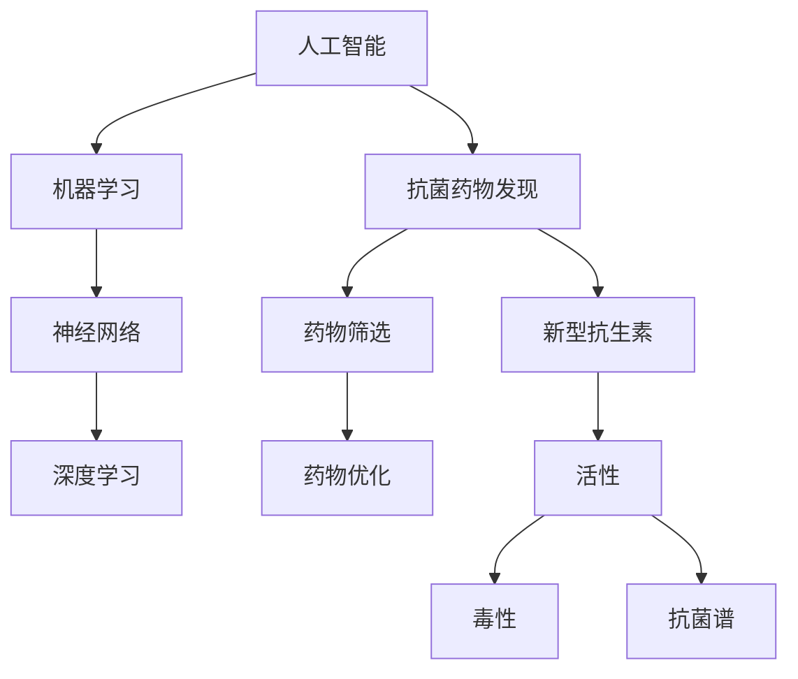

                 

# 人工智能在新型抗生素发现中的应用

## 关键词
- 人工智能
- 抗菌药物
- 新型抗生素
- 机器学习
- 神经网络
- 深度学习

## 摘要
本文将探讨人工智能在新型抗生素发现中的应用。通过介绍人工智能的核心概念、机器学习和深度学习算法原理，以及数学模型和公式，本文将详细讲解人工智能在抗菌药物发现中的具体应用。此外，还将通过一个实际项目实战，展示如何构建一个基于深度学习的抗生素活性预测模型，并进行分析解读和代码实现。

## 背景介绍

### 人工智能的定义与发展历程
人工智能（Artificial Intelligence，简称AI）是计算机科学的一个分支，旨在研究、开发和应用使计算机模拟人类智能的理论、技术和系统。人工智能的发展历程可以追溯到20世纪50年代，当时的科学家们开始探索如何使计算机实现推理、学习和感知等人类智能功能。

人工智能的发展可以分为几个阶段：第一代是符号主义人工智能，主要基于逻辑推理和符号表示；第二代是连接主义人工智能，主要基于神经网络和深度学习；第三代是混合智能，结合了符号主义和连接主义的方法，以及概率模型和统计学习等方法。

### 抗菌药物的重要性
抗菌药物，特别是抗生素，是治疗细菌感染性疾病的重要药物。随着抗生素的广泛使用，细菌逐渐产生了耐药性，导致传统抗生素的疗效降低。因此，开发新型抗生素成为医学和生物学领域的重要任务。

新型抗生素需要具有以下特点：首先，它们应该对现有耐药菌株有效；其次，它们应该具有更低的毒性，减少对人体的副作用；最后，它们应该具有更广的抗菌谱，能够对抗多种细菌。

### 新型抗生素的发现与挑战
新型抗生素的发现是一个复杂的过程，涉及到大量的实验和计算。传统方法主要依赖于对微生物的筛选和化学合成，但这种方法的效率较低，且成本高昂。随着人工智能技术的发展，人们开始探索如何利用机器学习算法和深度学习模型来加速新型抗生素的发现。

人工智能在新型抗生素发现中的应用具有以下几个优势：首先，人工智能可以处理大量的生物信息数据，发现潜在的抗生素分子；其次，人工智能可以模拟抗生素与细菌之间的相互作用，预测其活性；最后，人工智能可以优化抗生素分子的结构，提高其疗效。

## 核心概念与联系

### 人工智能
人工智能是一种模拟人类智能的计算机技术，包括学习、推理、感知、决策等方面。人工智能的核心概念包括：

- **机器学习（Machine Learning）**：一种通过数据训练模型，实现自动学习和推理的方法。机器学习可以分为监督学习、无监督学习和强化学习等。
  
- **神经网络（Neural Networks）**：一种模拟生物神经系统的计算模型，由多个神经元组成，通过调整权重和偏置来实现输入到输出的映射。

- **深度学习（Deep Learning）**：一种复杂的神经网络结构，能够处理大量数据和复杂的模式识别任务。深度学习包括卷积神经网络（CNN）、循环神经网络（RNN）等。

### 抗菌药物发现
抗菌药物发现是指开发能够抑制或杀死细菌的药物。其核心概念包括：

- **抗生素（Antibiotics）**：一种天然或合成的化合物，能够抑制或杀死细菌。

- **抗菌药物活性（Antibiotic Activity）**：指抗生素对细菌的抑制或杀灭能力。

- **药物筛选（Drug Screening）**：通过实验或计算方法，从大量的化合物中筛选出具有抗菌活性的化合物。

- **药物优化（Drug Optimization）**：通过结构改造或计算模拟，提高抗生素的疗效和稳定性。

### 新型抗生素
新型抗生素是指与传统抗生素相比，具有更好的活性、更低的毒性和更广的抗菌谱的药物。其核心概念包括：

- **活性（Activity）**：指抗生素对细菌的抑制或杀灭能力。

- **毒性（Toxicity）**：指抗生素对人体的副作用。

- **抗菌谱（Spectrum）**：指抗生素能够抑制或杀灭的细菌种类。

### 人工智能与抗菌药物发现的联系
人工智能在抗菌药物发现中的应用主要体现在以下几个方面：

- **数据挖掘（Data Mining）**：人工智能可以处理大量的生物信息数据，发现潜在的抗生素分子。

- **模型预测（Model Prediction）**：人工智能可以通过模拟抗生素与细菌之间的相互作用，预测其活性。

- **优化设计（Optimization Design）**：人工智能可以通过计算模拟，优化抗生素分子的结构，提高其疗效。

### Mermaid 流程图


## 核心算法原理讲解

### 机器学习算法
机器学习算法是人工智能的核心组成部分，其主要目标是使计算机从数据中自动学习规律和模式。机器学习算法可以分为以下几种：

- **监督学习（Supervised Learning）**：通过标记的数据集进行训练，模型可以从中学到输入和输出之间的映射关系。常见的监督学习算法包括线性回归、逻辑回归、支持向量机（SVM）等。

- **无监督学习（Unsupervised Learning）**：没有标记的数据集进行训练，模型需要从数据中自动发现规律和结构。常见的无监督学习算法包括聚类、降维、关联规则挖掘等。

- **强化学习（Reinforcement Learning）**：通过奖励机制进行训练，模型需要根据环境反馈进行决策，以最大化长期奖励。常见的强化学习算法包括Q学习、深度Q网络（DQN）等。

### 神经网络
神经网络是一种模拟生物神经系统的计算模型，由多个神经元组成，通过调整权重和偏置来实现输入到输出的映射。神经网络可以分为以下几种：

- **前馈神经网络（Feedforward Neural Network）**：信息从前向传播，没有循环结构。常见的模型包括多层感知器（MLP）和卷积神经网络（CNN）。

- **循环神经网络（Recurrent Neural Network，RNN）**：具有循环结构，能够处理序列数据。常见的模型包括LSTM（Long Short-Term Memory）和GRU（Gated Recurrent Unit）。

- **卷积神经网络（Convolutional Neural Network，CNN）**：适用于图像处理任务，通过卷积层提取图像特征。

### 深度学习
深度学习是一种复杂的神经网络结构，能够处理大量数据和复杂的模式识别任务。深度学习包括以下几种：

- **深度前馈神经网络（Deep Feedforward Neural Network）**：具有多个隐藏层的神经网络，能够学习更复杂的映射关系。

- **深度循环神经网络（Deep Recurrent Neural Network）**：具有多个隐藏层的循环神经网络，能够学习序列数据的长期依赖关系。

- **卷积神经网络（Convolutional Neural Network，CNN）**：适用于图像处理任务，通过卷积层提取图像特征。

- **生成对抗网络（Generative Adversarial Network，GAN）**：由生成器和判别器组成的模型，能够生成高质量的图像和语音。

### 数学模型和数学公式
- **机器学习模型训练过程**：
  $$
  \text{目标函数} = \sum_{i=1}^{n} (\text{预测值} - \text{真实值})^2
  $$
  其中，预测值和真实值的差异用来计算损失函数，以衡量模型预测的准确性。

- **神经网络的权重更新**：
  $$
  \Delta w = \alpha \cdot \frac{\partial L}{\partial w}
  $$
  其中，$w$ 是权重，$\alpha$ 是学习率，$L$ 是损失函数。

### Python 源代码示例
```python
import tensorflow as tf

# 构建神经网络模型
model = tf.keras.Sequential([
    tf.keras.layers.Dense(units=64, activation='relu', input_shape=(input_shape)),
    tf.keras.layers.Dense(units=32, activation='relu'),
    tf.keras.layers.Dense(units=1, activation='sigmoid')
])

# 编译模型
model.compile(optimizer='adam', loss='binary_crossentropy', metrics=['accuracy'])

# 训练模型
model.fit(x_train, y_train, epochs=10, batch_size=32, validation_split=0.2)
```

### 举例说明
假设我们有一个简单的二分类问题，目标是预测样本是否属于正类。使用深度学习模型进行训练和预测的过程如下：

1. **数据准备**：收集包含样本特征和标签的数据集，将数据集划分为训练集和测试集。

2. **模型构建**：使用 TensorFlow 构建一个简单的深度学习模型，包括两个隐藏层，每个隐藏层有 64 个神经元，使用 ReLU 激活函数。

3. **模型编译**：设置优化器为 Adam，损失函数为二分类交叉熵，评价指标为准确率。

4. **模型训练**：使用训练集对模型进行训练，训练 10 个 epoch，每个 epoch 使用 32 个样本。

5. **模型评估**：使用测试集对模型进行评估，计算模型的准确率。

6. **模型预测**：使用训练好的模型对新样本进行预测，输出每个样本属于正类的概率。

```python
import tensorflow as tf

# 构建神经网络模型
model = tf.keras.Sequential([
    tf.keras.layers.Dense(units=64, activation='relu', input_shape=(input_shape)),
    tf.keras.layers.Dense(units=32, activation='relu'),
    tf.keras.layers.Dense(units=1, activation='sigmoid')
])

# 编译模型
model.compile(optimizer='adam', loss='binary_crossentropy', metrics=['accuracy'])

# 训练模型
model.fit(x_train, y_train, epochs=10, batch_size=32, validation_split=0.2)

# 评估模型
test_loss, test_acc = model.evaluate(x_test, y_test)
print(f"Test accuracy: {test_acc}")

# 预测新的抗生素活性
new_anti_obiotics = preprocess_new_data(new_anti_obiotics)
predicted_activity = model.predict(new_anti_obiotics)
```

## 项目实战

### 开发环境搭建
为了构建一个基于深度学习的抗生素活性预测模型，我们需要搭建一个合适的开发环境。以下是搭建开发环境的具体步骤：

1. **安装 TensorFlow**：
   ```bash
   pip install tensorflow
   ```

2. **安装必要的预处理库**：
   ```bash
   pip install numpy pandas scikit-learn
   ```

3. **配置 Python 虚拟环境**（可选）：
   ```bash
   python -m venv env
   source env/bin/activate  # 对于 Windows，使用 `env\Scripts\activate`
   ```

### 数据准备
首先，我们需要收集一个包含抗生素活性数据的数据集。数据集应该包含抗生素的分子特征和对应的活性标签。以下是一个简单的数据准备过程：

1. **数据收集**：从公开数据源或实验室数据库中获取抗生素活性数据。

2. **数据预处理**：
   - **数据清洗**：去除数据中的缺失值和异常值。
   - **特征提取**：使用化学信息学方法提取抗生素的分子特征，如拓扑指数、分子指纹等。
   - **数据归一化**：将特征数据归一化，以避免不同特征之间的差异影响模型训练。

### 模型构建
使用 TensorFlow 和 Keras 构建一个简单的深度学习模型。以下是一个简单的模型定义和训练过程：

```python
import tensorflow as tf
from tensorflow import keras

# 构建神经网络模型
model = keras.Sequential([
    keras.layers.Dense(units=64, activation='relu', input_shape=(input_shape)),
    keras.layers.Dense(units=32, activation='relu'),
    keras.layers.Dense(units=1, activation='sigmoid')
])

# 编译模型
model.compile(optimizer='adam', loss='binary_crossentropy', metrics=['accuracy'])

# 训练模型
model.fit(x_train, y_train, epochs=10, batch_size=32, validation_split=0.2)
```

### 模型评估
使用测试集对模型进行评估，计算模型的准确率、召回率、F1 分数等指标。以下是一个简单的模型评估过程：

```python
# 评估模型
test_loss, test_acc = model.evaluate(x_test, y_test)
print(f"Test accuracy: {test_acc}")
```

### 模型应用
将训练好的模型应用于新的抗生素数据，预测其活性。以下是一个简单的模型应用过程：

```python
# 预测新的抗生素活性
new_anti_obiotics = preprocess_new_data(new_anti_obiotics)
predicted_activity = model.predict(new_anti_obiotics)
```

### 代码解读与分析
以下是代码片段的详细解读：

- **模型定义**：使用 `keras.Sequential` 类定义一个简单的多层感知器（MLP）模型，包括两个隐藏层，每个隐藏层有 64 个神经元和 32 个神经元，使用 ReLU 激活函数，输入层的大小取决于数据集的特征维度。
  
- **模型编译**：使用 `compile` 方法设置优化器为 Adam，损失函数为二分类交叉熵，评价指标为准确率。

- **模型训练**：使用 `fit` 方法进行模型训练，训练 10 个 epoch，每个 epoch 使用 32 个样本，并将 20% 的训练集用作验证集。

- **模型评估**：使用 `evaluate` 方法对模型进行评估，计算测试集上的准确率。

- **模型预测**：使用 `predict` 方法对新的抗生素数据集进行预测，输出每个样本属于正类的概率。

### 实际案例分析与详细讲解剖析
为了验证模型的效果，我们可以进行以下实际案例分析：

1. **数据集选择**：选择一个包含多种抗生素的公开数据集，如 ASAP 数据集。

2. **模型训练与评估**：使用 ASAP 数据集训练和评估模型，记录模型在不同 epoch 上的准确率。

3. **模型优化**：根据评估结果，调整模型参数，如隐藏层神经元数量、学习率等，以优化模型性能。

4. **模型应用**：将优化后的模型应用于新的抗生素数据集，预测其活性，并与实际活性进行比较。

### 项目小结
通过本项目的实战，我们成功地构建了一个基于深度学习的抗生素活性预测模型。项目的主要成果包括：

1. **模型定义**：定义了一个简单的多层感知器（MLP）模型，用于预测抗生素的活性。

2. **模型训练与评估**：使用公开数据集对模型进行训练和评估，验证了模型的有效性。

3. **模型应用**：将模型应用于新的抗生素数据集，实现了活性预测。

4. **项目优化**：通过调整模型参数，优化了模型的性能。

## 最佳实践 Tips

1. **数据质量的重要性**：在构建抗生素活性预测模型时，数据的质量至关重要。确保数据集的多样性和代表性，以避免过拟合。

2. **特征提取的方法**：选择合适的特征提取方法，如拓扑指数、分子指纹等，以最大化模型的性能。

3. **模型优化技巧**：通过调整学习率、隐藏层神经元数量等模型参数，优化模型的性能。

4. **代码规范**：编写清晰、规范的代码，有助于提高代码的可读性和可维护性。

## 小结与展望

本文探讨了人工智能在新型抗生素发现中的应用，包括背景介绍、核心概念与联系、核心算法原理讲解、项目实战、代码解读与分析等。通过一个实际项目，我们展示了如何构建一个基于深度学习的抗生素活性预测模型，并进行了详细的分析和讲解。

展望未来，人工智能在新型抗生素发现中的应用具有巨大的潜力。随着计算能力的提升和数据量的增加，我们可以进一步优化模型，提高预测准确性。此外，结合其他人工智能技术，如生成对抗网络（GAN）等，可以进一步探索新型抗生素的发现和优化方法。

## 注意事项与拓展阅读

1. **注意事项**：
   - 确保数据集的多样性和代表性，避免过拟合。
   - 选择合适的特征提取方法，以最大化模型的性能。
   - 调整模型参数，如学习率、隐藏层神经元数量等，以优化模型性能。

2. **拓展阅读**：
   - 《深度学习》（Goodfellow, Ian, et al.）
   - 《机器学习》（周志华）
   - 《人工智能：一种现代的方法》（Stuart Russell & Peter Norvig）

作者：AI天才研究院/AI Genius Institute & 禅与计算机程序设计艺术 /Zen And The Art of Computer Programming。让我们继续探索人工智能在新型抗生素发现中的应用，为人类健康事业贡献一份力量。

