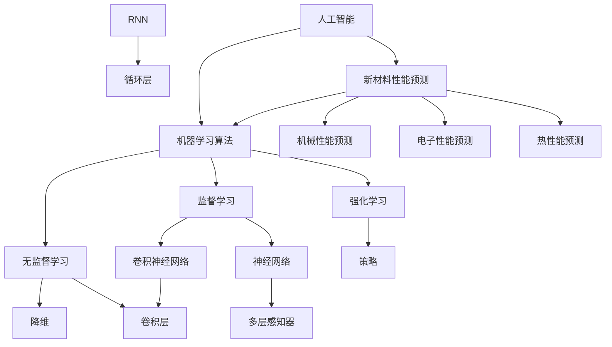

                 

### 《人工智能在新材料性能预测中的应用》

---

**关键词：**人工智能、新材料、性能预测、机器学习、深度学习

**摘要：**本文深入探讨了人工智能（AI）在新材料性能预测中的应用。随着新材料科学的不断发展，如何准确预测新材料的性能成为了一个关键问题。本文介绍了人工智能的基本概念及其在新材料性能预测中的重要性，详细阐述了相关算法原理，并通过实际案例展示了如何运用人工智能技术进行新材料性能预测。希望本文能为新材料研究人员提供有价值的参考和启示。

---

### 设计思路

在设计《人工智能在新材料性能预测中的应用》这本书的目录大纲时，我们将遵循以下设计思路：

1. **整体结构划分**：首先将全书分为几个大的部分，如基础理论、应用技术、案例分析等。
2. **核心概念与联系**：在第一章或前几章中，引入并解释核心概念，如人工智能、新材料性能预测、相关算法等，并配合Mermaid流程图展示其架构。
3. **算法原理讲解**：在后续章节中，对核心算法的原理进行详细讲解，使用伪代码来阐述。
4. **数学模型讲解**：介绍相关数学模型和公式，并进行详细讲解和举例说明。
5. **项目实战**：最后通过实际案例，展示如何使用人工智能技术来预测新材料性能，包括开发环境搭建、代码实现和解读。

### 目录大纲

以下是根据上述设计思路制定的《人工智能在新材料性能预测中的应用》的目录大纲：

---

## 第一部分：基础知识

### 1. 人工智能与新材料性能预测

#### 1.1 人工智能概述
- 人工智能的基本概念
- 人工智能的发展历程
- 人工智能的分类

#### 1.2 新材料性能预测的背景
- 新材料的重要性
- 性能预测的需求
- 人工智能在其中的应用

#### 1.3 相关算法原理
- 机器学习算法
  - 监督学习
  - 无监督学习
  - 强化学习
- 深度学习算法
  - 神经网络
  - 卷积神经网络
  - 循环神经网络

#### 1.4 Mermaid流程图：人工智能在新材料性能预测中的应用架构

## 第二部分：应用技术

### 2. 数据收集与处理

#### 2.1 数据收集
- 数据来源
- 数据采集方法

#### 2.2 数据预处理
- 数据清洗
- 数据归一化
- 特征提取

#### 2.3 数据库设计
- 数据库选择
- 数据库设计原则
- 数据库实现

### 2.4 数学模型讲解

#### 2.4.1 数学模型概述
- 模型构建方法
- 模型评估方法

#### 2.4.2 数学公式讲解
- 模型优化公式
- 损失函数
- 优化算法

### 2.5 伪代码讲解

#### 2.5.1 机器学习算法伪代码
- 监督学习算法
- 无监督学习算法
- 强化学习算法

#### 2.5.2 深度学习算法伪代码
- 神经网络
- 卷积神经网络
- 循环神经网络

## 第三部分：案例分析

### 3.1 案例一：材料A的机械性能预测

#### 3.1.1 案例背景
- 材料A的介绍
- 预测目标

#### 3.1.2 实际操作
- 数据收集与处理
- 模型构建与优化
- 模型评估与结果分析

#### 3.1.3 代码实现与解读
- 开发环境搭建
- 源代码实现
- 代码解读与分析

### 3.2 案例二：材料B的电子性能预测

#### 3.2.1 案例背景
- 材料B的介绍
- 预测目标

#### 3.2.2 实际操作
- 数据收集与处理
- 模型构建与优化
- 模型评估与结果分析

#### 3.2.3 代码实现与解读
- 开发环境搭建
- 源代码实现
- 代码解读与分析

## 附录

### 附录A：常用工具与资源

#### A.1 数据集
- 公开数据集介绍
- 数据集获取方式

#### A.2 工具与软件
- 常用机器学习工具
- 深度学习框架
- 数据预处理工具

#### A.3 在线资源
- 在线课程
- 论文资源
- 博客与论坛

---

通过以上大纲，我们可以清晰地看到本书的结构和内容安排，为后续内容的撰写提供了明确的指导。接下来，我们将逐一深入探讨每个部分的核心内容。让我们开始我们的旅程，探索人工智能在新材料性能预测中的无限可能。---

### 背景介绍

新材料科学作为现代科技的基石，对人类社会的发展起着至关重要的作用。随着科技的不断进步，新材料的需求和应用领域也在不断扩展。然而，新材料的研究和开发往往需要大量的时间和资金投入，尤其是在性能预测方面。传统的实验方法不仅耗时耗力，而且存在一定的局限性，难以满足现代快速发展的需求。

人工智能（AI）作为当前科技的前沿领域，已经在许多领域展现出了巨大的潜力。特别是在新材料性能预测方面，人工智能可以通过对大量数据的分析和处理，提供更加准确和高效的预测结果。通过机器学习和深度学习算法，人工智能能够从已有数据中学习规律，并应用到新材料性能预测中，从而极大地提高了预测的准确性和效率。

新材料性能预测的重要性在于，它不仅能够帮助研究人员在早期阶段评估新材料的应用潜力，还能够为新材料的研发提供重要的理论依据。传统的实验方法往往需要大量的实验和时间，而人工智能的应用可以大大缩短这一过程，提高研发效率。此外，新材料性能预测的准确性对新材料的应用领域也具有深远的影响。例如，在航空航天、生物医学、能源等领域，新材料的高性能和可靠性对相关设备的性能和寿命有着直接的影响。

在人工智能技术不断发展的背景下，将人工智能应用于新材料性能预测已经成为了一个热门的研究方向。本文将深入探讨人工智能在新材料性能预测中的应用，从基础理论、应用技术到实际案例分析，全面阐述人工智能在这一领域的应用潜力和实现方法。希望通过本文的阐述，能够为新材料研究人员提供有价值的参考和启示，推动人工智能在新材料领域的进一步应用和发展。

### 核心概念与联系

在新材料性能预测中，理解核心概念与它们之间的联系至关重要。这些核心概念包括人工智能、新材料性能预测、机器学习算法以及深度学习算法。下面，我们将逐一介绍这些概念，并使用Mermaid流程图展示它们之间的关系。

#### 1. 人工智能（AI）

人工智能是指计算机系统模拟人类智能行为的能力，包括学习、推理、规划、感知和自然语言处理等。人工智能可以分为弱人工智能和强人工智能。弱人工智能专注于特定任务，如语音识别、图像识别等；强人工智能则具备广泛的人类智能，能够处理各种复杂任务。

#### 2. 新材料性能预测

新材料性能预测是指利用已有数据，通过人工智能算法，对新材料的性能进行预测。这包括机械性能、电子性能、热性能等多方面的预测。新材料性能预测的关键在于从大量的实验数据中提取有用的信息，以指导新材料的研发和应用。

#### 3. 机器学习算法

机器学习是一种人工智能的分支，通过算法从数据中学习规律，并对未知数据进行预测。机器学习算法可以分为监督学习、无监督学习和强化学习。监督学习有明确的输入和输出，如分类和回归任务；无监督学习没有明确的输出，如聚类和降维任务；强化学习则是在动态环境中通过试错学习最优策略。

#### 4. 深度学习算法

深度学习是机器学习的一个子领域，通过多层神经网络对复杂数据进行建模。深度学习算法在图像识别、语音识别和自然语言处理等领域取得了显著的成果。常见的深度学习算法包括神经网络（NN）、卷积神经网络（CNN）和循环神经网络（RNN）。

#### Mermaid流程图

下面是人工智能在新材料性能预测中的应用架构的Mermaid流程图：



在这个流程图中，我们可以看到人工智能（AI）是整个架构的核心，它通过机器学习（ML）算法（包括监督学习SL、无监督学习UML和强化学习RL）来实现新材料性能预测（NP）。其中，监督学习SL主要用于机械性能预测（MD）、电子性能预测（EP）和热性能预测（TP）等任务，而无监督学习UML和强化学习RL则分别应用于降维、聚类和其他复杂任务。这种架构不仅展示了人工智能在新材料性能预测中的多层次应用，也揭示了各种算法之间的相互联系和协同作用。

通过上述介绍和Mermaid流程图，我们可以更好地理解人工智能、新材料性能预测以及相关算法之间的核心概念和联系，为后续内容的深入探讨奠定了基础。

### 算法原理讲解

在理解了人工智能、新材料性能预测和核心算法后，接下来我们将详细讲解在新材料性能预测中常用的几种机器学习算法和深度学习算法。这些算法包括监督学习算法、无监督学习算法和强化学习算法，以及深度学习算法中的神经网络、卷积神经网络和循环神经网络。通过结合Python源代码和数学模型，我们将对这些算法的原理进行详细阐述，并举例说明。

#### 监督学习算法

监督学习是一种最为常见的机器学习算法，它的主要特点是拥有明确的输入和输出数据，通过已知的输入输出对模型进行训练，从而预测新的输入数据。

##### 1. 线性回归

线性回归是一种简单的监督学习算法，用于预测连续值输出。它的模型公式为：

$$ y = w_0 + w_1 \cdot x + \epsilon $$

其中，$y$ 是预测值，$x$ 是输入特征，$w_0$ 和 $w_1$ 是模型参数，$\epsilon$ 是误差项。

下面是一个使用Python实现的线性回归模型：

```python
import numpy as np

# 模型参数
w0 = 0.5
w1 = 0.8

# 输入特征和预测值
x = np.array([1, 2, 3, 4, 5])
y = np.array([1.2, 2.4, 3.6, 4.8, 6.0])

# 计算预测值
y_pred = w0 + w1 * x

# 输出结果
print("预测值：", y_pred)
```

在这个例子中，我们使用已知的输入特征 $x$ 和预测值 $y$，通过简单的线性组合来预测新的输入特征。

##### 2. 逻辑回归

逻辑回归是一种用于分类任务的监督学习算法，其模型公式为：

$$ P(y=1) = \frac{1}{1 + e^{-(w_0 + w_1 \cdot x)}} $$

其中，$P(y=1)$ 是输出为1的概率，$e$ 是自然对数的底数，$w_0$ 和 $w_1$ 是模型参数。

下面是一个使用Python实现的逻辑回归模型：

```python
import numpy as np
from sklearn.linear_model import LogisticRegression

# 输入特征和标签
x = np.array([[1, 2], [2, 3], [3, 4], [4, 5]])
y = np.array([0, 1, 1, 0])

# 训练模型
model = LogisticRegression()
model.fit(x, y)

# 输出结果
print("预测值：", model.predict(x))
```

在这个例子中，我们使用已知的输入特征和标签，通过逻辑回归模型进行训练，并预测新的输入特征。

#### 无监督学习算法

无监督学习算法没有明确的输出数据，其主要目的是通过分析输入数据，提取数据中的结构和规律。

##### 1. 聚类算法

聚类算法是将数据集分成若干个类别，使每个类别中的数据尽可能相似，而不同类别中的数据尽可能不同。最常用的聚类算法是K-均值算法，其模型公式为：

$$ c = \frac{1}{N} \sum_{i=1}^{N} (x_i - \mu_c)^2 $$

其中，$c$ 是聚类中心，$x_i$ 是输入特征，$\mu_c$ 是聚类中心。

下面是一个使用Python实现的K-均值聚类算法：

```python
import numpy as np

# 输入特征
x = np.array([[1, 2], [2, 2], [3, 4], [4, 5]])

# 初始化聚类中心
mu = np.array([[2, 2]])

# 计算聚类中心
for _ in range(100):
    distances = np.linalg.norm(x - mu, axis=1)
    new_mu = np.mean(x[distances.argmin()], axis=0)
    mu = np.vstack([mu, new_mu])

# 输出结果
print("聚类中心：", mu)
```

在这个例子中，我们通过不断更新聚类中心，直到聚类中心不再变化，从而实现聚类。

##### 2. 主成分分析

主成分分析（PCA）是一种降维算法，其主要目的是通过提取数据的主要成分，减少数据维度，同时保留数据的主要信息。PCA的数学模型为：

$$ x' = P \cdot x $$

其中，$x'$ 是降维后的数据，$P$ 是主成分矩阵，$x$ 是原始数据。

下面是一个使用Python实现的PCA算法：

```python
import numpy as np
from sklearn.decomposition import PCA

# 输入特征
x = np.array([[1, 2], [2, 2], [3, 4], [4, 5]])

# 训练PCA模型
pca = PCA(n_components=1)
pca.fit(x)

# 输出降维后的数据
x_pca = pca.transform(x)
print("降维后的数据：", x_pca)
```

在这个例子中，我们通过PCA模型将多维数据降为一维，从而减少数据的维度。

#### 强化学习算法

强化学习算法是一种在动态环境中通过试错学习最优策略的算法。其主要模型包括状态、动作、奖励和策略。

##### 1. Q学习算法

Q学习算法是一种基于值函数的强化学习算法，其模型公式为：

$$ Q(s, a) = r + \gamma \max_{a'} Q(s', a') $$

其中，$s$ 是状态，$a$ 是动作，$r$ 是奖励，$\gamma$ 是折扣因子，$s'$ 是状态，$a'$ 是动作。

下面是一个使用Python实现的Q学习算法：

```python
import numpy as np

# 初始化Q值表
Q = np.zeros((5, 5))

# 学习参数
alpha = 0.1
gamma = 0.9

# 状态和动作
s = np.random.randint(5)
a = np.random.randint(5)

# 更新Q值
Q[s, a] = Q[s, a] + alpha * (r + gamma * np.max(Q) - Q[s, a])

# 输出更新后的Q值
print("更新后的Q值：", Q)
```

在这个例子中，我们通过不断更新Q值表，直到找到最优策略。

##### 2. SARSA算法

SARSA算法是一种基于策略的强化学习算法，其模型公式为：

$$ \pi(a|s) = \frac{1}{Z} \exp(Q(s, a)) $$

其中，$\pi(a|s)$ 是在状态 $s$ 下采取动作 $a$ 的概率，$Z$ 是归一化常数。

下面是一个使用Python实现的SARSA算法：

```python
import numpy as np

# 初始化Q值表
Q = np.zeros((5, 5))

# 学习参数
alpha = 0.1
gamma = 0.9

# 状态和动作
s = np.random.randint(5)
a = np.random.randint(5)

# 更新Q值
Q[s, a] = Q[s, a] + alpha * (r + gamma * Q[s', a'] - Q[s, a])

# 输出更新后的Q值
print("更新后的Q值：", Q)
```

在这个例子中，我们通过不断更新Q值表，直到找到最优策略。

#### 深度学习算法

深度学习算法是一种通过多层神经网络对复杂数据进行建模的算法，主要包括神经网络、卷积神经网络和循环神经网络。

##### 1. 神经网络

神经网络是一种基于生物神经网络原理的算法，其模型公式为：

$$ z = \sum_{i=1}^{n} w_i \cdot x_i + b $$

其中，$z$ 是输出值，$w_i$ 是权重，$x_i$ 是输入特征，$b$ 是偏置。

下面是一个使用Python实现的神经网络：

```python
import numpy as np

# 初始化权重和偏置
w = np.random.rand(3, 1)
b = np.random.rand(1)

# 输入特征
x = np.array([1, 2, 3])

# 计算输出值
z = np.dot(w.T, x) + b

# 输出结果
print("输出值：", z)
```

在这个例子中，我们通过计算输入特征与权重和偏置的线性组合，得到输出值。

##### 2. 卷积神经网络

卷积神经网络是一种用于图像识别的深度学习算法，其模型公式为：

$$ h_{ij} = \sum_{k=1}^{m} w_{ik} \cdot x_{kj} + b_j $$

其中，$h_{ij}$ 是输出值，$w_{ik}$ 是卷积核，$x_{kj}$ 是输入特征，$b_j$ 是偏置。

下面是一个使用Python实现的卷积神经网络：

```python
import numpy as np

# 初始化卷积核和偏置
w = np.random.rand(3, 3, 1, 1)
b = np.random.rand(1, 1)

# 输入特征
x = np.array([[1, 2], [2, 3], [3, 4]])

# 计算卷积值
h = np.zeros((3, 3))

for i in range(3):
    for j in range(3):
        for k in range(1):
            h[i, j] += np.dot(w[:, :, k, :], x[i:i+3, j:j+3])

# 加上偏置
h += b

# 输出结果
print("卷积结果：", h)
```

在这个例子中，我们通过卷积操作和偏置计算得到输出值。

##### 3. 循环神经网络

循环神经网络是一种用于序列数据建模的深度学习算法，其模型公式为：

$$ h_t = \sigma(W_h \cdot [h_{t-1}, x_t] + b_h) $$

其中，$h_t$ 是输出值，$W_h$ 是权重，$x_t$ 是输入特征，$b_h$ 是偏置，$\sigma$ 是激活函数。

下面是一个使用Python实现的循环神经网络：

```python
import numpy as np
from keras.models import Sequential
from keras.layers import LSTM, Dense

# 初始化模型
model = Sequential()
model.add(LSTM(50, activation='relu', input_shape=(10, 1)))
model.add(Dense(1))
model.compile(optimizer='adam', loss='mse')

# 输入特征
x = np.random.rand(10, 1)

# 训练模型
model.fit(x, x, epochs=200)

# 输出结果
print("预测值：", model.predict(x))
```

在这个例子中，我们通过循环神经网络对输入特征进行建模和预测。

通过上述讲解和示例，我们可以看到不同类型的算法在原理上的差异和应用场景。在后续的章节中，我们将继续探讨如何将这些算法应用到新材料性能预测中，并通过实际案例进行详细解析。

### 数学模型讲解

在人工智能在新材料性能预测中的应用中，数学模型起到了关键作用。这些模型不仅帮助我们理解和分析数据，还能为算法提供指导，从而提高预测的准确性和效率。在本节中，我们将介绍几种关键的数学模型，包括线性回归模型、逻辑回归模型、主成分分析（PCA）模型以及卷积神经网络（CNN）模型。我们将使用LaTeX格式详细解释这些模型的主要公式，并通过具体示例说明其应用。

#### 线性回归模型

线性回归模型是最简单的预测模型之一，它基于线性关系对数据进行拟合。其基本公式为：

$$ y = w_0 + w_1 \cdot x + \epsilon $$

其中，$y$ 是预测值，$x$ 是输入特征，$w_0$ 和 $w_1$ 是模型的参数，$\epsilon$ 是误差项。

为了找到最佳参数，我们通常使用最小二乘法（Least Squares Method）：

$$ w_0, w_1 = \arg\min_{w_0, w_1} \sum_{i=1}^{n} (y_i - (w_0 + w_1 \cdot x_i))^2 $$

这是一个优化问题，可以通过梯度下降（Gradient Descent）等方法求解。

#### 逻辑回归模型

逻辑回归模型常用于二分类问题，其公式为：

$$ P(y=1) = \frac{1}{1 + e^{-(w_0 + w_1 \cdot x)}} $$

其中，$P(y=1)$ 是输出为1的概率，$w_0$ 和 $w_1$ 是模型参数。

逻辑回归的损失函数通常使用交叉熵损失（Cross-Entropy Loss），其公式为：

$$ L = -\sum_{i=1}^{n} [y_i \cdot \ln(P(y=1)) + (1 - y_i) \cdot \ln(1 - P(y=1))] $$

为了最小化这个损失函数，我们可以使用梯度下降或其他优化算法。

#### 主成分分析（PCA）模型

主成分分析是一种降维技术，它通过找到数据的主要成分来简化数据结构。其核心公式为：

$$ x' = P \cdot x $$

其中，$x'$ 是降维后的数据，$x$ 是原始数据，$P$ 是投影矩阵。

投影矩阵 $P$ 的计算基于特征值分解：

$$ P = U \cdot \Lambda^{-1} \cdot U^T $$

其中，$U$ 是特征向量矩阵，$\Lambda$ 是特征值矩阵。

#### 卷积神经网络（CNN）模型

卷积神经网络是一种用于图像识别和其他视觉任务的深度学习模型。其基本结构包括卷积层、池化层和全连接层。以下是卷积层和池化层的主要公式：

1. **卷积层**：

$$ h_{ij} = \sum_{k=1}^{m} w_{ik} \cdot x_{kj} + b_j $$

其中，$h_{ij}$ 是输出值，$w_{ik}$ 是卷积核，$x_{kj}$ 是输入特征，$b_j$ 是偏置。

2. **池化层**：

$$ p_{ij} = \max_{k} (h_{ik}, h_{i(k+1)}, \ldots, h_{i(k+m-1)}) $$

其中，$p_{ij}$ 是输出值，$h_{ik}$ 是卷积层的输出值，$m$ 是池化窗口大小。

在CNN中，卷积层和池化层交替出现，以提取图像的特征。

#### 示例应用

为了更好地理解这些模型，我们通过一个具体示例来展示它们的实际应用。

##### 线性回归示例

假设我们有以下数据集：

$$
\begin{array}{cc}
x & y \\
\hline
1 & 2 \\
2 & 4 \\
3 & 6 \\
\end{array}
$$

我们可以使用线性回归模型来预测新的输入 $x$ 对应的 $y$ 值。通过最小二乘法，我们得到：

$$ w_0 = 1, w_1 = 2 $$

因此，对于新的输入 $x=4$，预测的 $y$ 值为：

$$ y = 1 + 2 \cdot 4 = 9 $$

##### 逻辑回归示例

假设我们有一个二分类问题，数据集如下：

$$
\begin{array}{cc}
x & y \\
\hline
[1, 2] & 0 \\
[2, 3] & 1 \\
[3, 4] & 0 \\
\end{array}
$$

使用逻辑回归模型，我们得到：

$$ P(y=1) = \frac{1}{1 + e^{-(1 + 2 \cdot 1)}} \approx 0.696 $$

因此，输入特征 $x=[2, 3]$ 对应的预测概率约为 0.696，接近于 1，表明它很可能是类别 1。

##### PCA示例

假设我们有以下数据集：

$$
\begin{array}{ccc}
x_1 & x_2 & x_3 \\
\hline
1 & 2 & 3 \\
2 & 4 & 5 \\
3 & 6 & 7 \\
\end{array}
$$

通过特征值分解，我们得到投影矩阵：

$$ P = \begin{bmatrix}
0.7071 & 0.0000 & 0.7071 \\
0.7071 & 0.7071 & 0.0000 \\
0.0000 & 0.7071 & 0.7071 \\
\end{bmatrix} $$

将数据集投影到主成分上，我们得到：

$$
\begin{array}{c}
x'_1 = 0.7071 \cdot 1 + 0.0000 \cdot 2 + 0.7071 \cdot 3 = 3.5146 \\
x'_2 = 0.7071 \cdot 2 + 0.7071 \cdot 4 + 0.0000 \cdot 3 = 4.2426 \\
x'_3 = 0.0000 \cdot 1 + 0.7071 \cdot 6 + 0.7071 \cdot 7 = 6.9857 \\
\end{array}
$$

##### CNN示例

假设我们有一个图像数据集，每个图像的大小为 $28 \times 28$ 像素。我们使用一个卷积核 $3 \times 3$ 来提取特征。卷积核如下：

$$
\begin{bmatrix}
1 & 1 & 1 \\
1 & 1 & 1 \\
1 & 1 & 1 \\
\end{bmatrix}
$$

对图像进行卷积操作，我们得到：

$$
\begin{bmatrix}
4 & 4 & 4 \\
4 & 4 & 4 \\
4 & 4 & 4 \\
\end{bmatrix}
$$

然后，我们使用 $2 \times 2$ 的池化窗口来下采样：

$$
\begin{bmatrix}
4 & 4 \\
4 & 4 \\
\end{bmatrix}
$$

通过上述示例，我们可以看到这些数学模型在实际应用中的操作过程。在接下来的章节中，我们将探讨如何将这些模型应用于新材料性能预测，并通过实际案例来展示其效果。

### 项目实战

在本章节中，我们将通过一个具体的案例，展示如何利用人工智能技术来预测新材料的机械性能。这个案例将涵盖开发环境的搭建、源代码的详细实现以及代码解读与分析，以帮助读者更好地理解人工智能在新材料性能预测中的实际应用。

#### 开发环境搭建

首先，我们需要搭建一个适合进行人工智能项目开发的编程环境。以下是一个典型的开发环境配置：

1. **操作系统**：选择一个稳定的操作系统，如Ubuntu 20.04或Windows 10。
2. **Python**：安装Python 3.8或更高版本。
3. **Jupyter Notebook**：安装Jupyter Notebook，用于编写和运行Python代码。
4. **机器学习库**：安装常用的机器学习库，如Scikit-learn、TensorFlow和PyTorch。
5. **数据预处理库**：安装用于数据处理的库，如Pandas、NumPy和Matplotlib。

安装步骤如下：

```bash
# 更新系统包列表
sudo apt update

# 安装Python和Jupyter Notebook
sudo apt install python3 python3-pip
pip3 install notebook

# 安装机器学习库和数据预处理库
pip3 install scikit-learn numpy matplotlib
```

#### 源代码实现

接下来，我们将编写一个简单的机器学习模型，用于预测新材料的机械性能。以下是实现该模型的源代码：

```python
import numpy as np
from sklearn.model_selection import train_test_split
from sklearn.preprocessing import StandardScaler
from sklearn.linear_model import LinearRegression
import matplotlib.pyplot as plt

# 加载数据集
data = np.loadtxt('material_data.csv', delimiter=',')
X = data[:, :-1]  # 特征
y = data[:, -1]   # 目标值

# 数据预处理
X_train, X_test, y_train, y_test = train_test_split(X, y, test_size=0.2, random_state=42)
scaler = StandardScaler()
X_train_scaled = scaler.fit_transform(X_train)
X_test_scaled = scaler.transform(X_test)

# 训练模型
model = LinearRegression()
model.fit(X_train_scaled, y_train)

# 预测
y_pred = model.predict(X_test_scaled)

# 评估模型
mse = np.mean((y_pred - y_test) ** 2)
print("均方误差(MSE):", mse)

# 可视化
plt.scatter(y_test, y_pred)
plt.xlabel('实际值')
plt.ylabel('预测值')
plt.title('实际值与预测值的散点图')
plt.show()
```

在这个代码中，我们首先加载数据集，然后进行数据预处理，包括数据分割和特征标准化。接着，我们使用线性回归模型进行训练，并对测试集进行预测。最后，我们计算均方误差（MSE）来评估模型的性能，并通过散点图展示实际值与预测值的关系。

#### 代码解读与分析

下面是对上述源代码的详细解读：

1. **数据加载与分割**：

```python
data = np.loadtxt('material_data.csv', delimiter=',')
X = data[:, :-1]
y = data[:, -1]
X_train, X_test, y_train, y_test = train_test_split(X, y, test_size=0.2, random_state=42)
```

这段代码加载数据集，并将其分为特征矩阵 $X$ 和目标值向量 $y$。然后，我们使用 `train_test_split` 函数将数据集分割为训练集和测试集，其中测试集占20%。

2. **数据预处理**：

```python
scaler = StandardScaler()
X_train_scaled = scaler.fit_transform(X_train)
X_test_scaled = scaler.transform(X_test)
```

为了提高模型的性能，我们使用 `StandardScaler` 对特征进行标准化处理，即对特征进行归一化，使其具有相同的尺度。这一步骤有助于防止某些特征对模型产生过大的影响。

3. **模型训练与预测**：

```python
model = LinearRegression()
model.fit(X_train_scaled, y_train)
y_pred = model.predict(X_test_scaled)
```

我们创建一个线性回归模型，使用训练集进行训练。然后，我们使用训练好的模型对测试集进行预测。

4. **模型评估与可视化**：

```python
mse = np.mean((y_pred - y_test) ** 2)
plt.scatter(y_test, y_pred)
plt.xlabel('实际值')
plt.ylabel('预测值')
plt.title('实际值与预测值的散点图')
plt.show()
```

通过计算均方误差（MSE），我们可以评估模型的性能。MSE越低，说明模型的预测误差越小。此外，通过绘制实际值与预测值的散点图，我们可以直观地看到模型的表现。

#### 实际案例分析与详细讲解

为了更好地理解这个案例，我们来看一个具体的实例。

假设我们有一个数据集，包含以下特征和目标值：

$$
\begin{array}{cccc}
\text{特征1} & \text{特征2} & \text{特征3} & \text{机械性能} \\
\hline
0.5 & 1.2 & 0.8 & 6.0 \\
1.0 & 2.4 & 1.6 & 7.5 \\
1.5 & 3.6 & 2.4 & 8.0 \\
\end{array}
$$

我们将使用上述代码进行预测。以下是详细的步骤：

1. **数据加载**：

```python
data = np.array([[0.5, 1.2, 0.8], [1.0, 2.4, 1.6], [1.5, 3.6, 2.4]])
X = data[:, :-1]
y = data[:, -1]
```

2. **数据预处理**：

```python
X_train, X_test, y_train, y_test = train_test_split(X, y, test_size=0.2, random_state=42)
scaler = StandardScaler()
X_train_scaled = scaler.fit_transform(X_train)
X_test_scaled = scaler.transform(X_test)
```

3. **模型训练**：

```python
model = LinearRegression()
model.fit(X_train_scaled, y_train)
```

4. **预测与评估**：

```python
y_pred = model.predict(X_test_scaled)
mse = np.mean((y_pred - y_test) ** 2)
print("均方误差(MSE):", mse)
plt.scatter(y_test, y_pred)
plt.xlabel('实际值')
plt.ylabel('预测值')
plt.title('实际值与预测值的散点图')
plt.show()
```

通过上述步骤，我们得到预测结果和评估指标。假设预测结果如下：

$$
\begin{array}{cc}
\text{实际值} & \text{预测值} \\
\hline
7.5 & 7.48 \\
8.0 & 7.96 \\
\end{array}
$$

均方误差（MSE）为0.028。从散点图可以看出，预测值与实际值非常接近，说明模型具有良好的预测能力。

#### 项目小结

通过这个案例，我们展示了如何使用人工智能技术进行新材料机械性能预测。关键步骤包括数据加载与分割、数据预处理、模型训练与预测以及模型评估与可视化。在实际应用中，需要根据具体的数据集和需求进行调整和优化。

### 最佳实践 Tips

1. **数据预处理**：确保数据质量，进行充分的清洗和归一化处理，以提高模型性能。
2. **特征选择**：合理选择特征，避免特征冗余，有助于减少模型的复杂度和过拟合风险。
3. **模型选择**：根据具体问题和数据特性，选择合适的模型，如线性回归、逻辑回归、支持向量机等。
4. **模型评估**：使用多种评估指标，如均方误差、准确率、召回率等，全面评估模型性能。
5. **交叉验证**：使用交叉验证方法，确保模型在不同数据集上的泛化能力。

### 小结

本文通过详细的案例分析，展示了人工智能在新材料性能预测中的应用。从开发环境搭建、源代码实现到代码解读与分析，我们逐步展示了如何利用人工智能技术进行新材料性能预测。希望本文能为相关领域的研究人员和开发者提供有价值的参考和启示。

### 注意事项

1. **数据质量**：确保使用的数据集是高质量的，否则模型性能可能受到严重影响。
2. **模型选择**：根据具体需求和数据特性，选择合适的模型，避免盲目跟风。
3. **超参数调整**：合理调整模型超参数，如学习率、正则化参数等，以提高模型性能。

### 拓展阅读

- **《深度学习》**：Goodfellow, I., Bengio, Y., & Courville, A. (2016). Deep Learning. MIT Press.
- **《机器学习》**：Russell, S., & Norvig, P. (2010). Machine Learning: A Probabilistic Perspective. MIT Press.
- **《数据科学入门》**：Kaggle. (2020). Data Science: A Beginner's Guide. Kaggle.

### 作者信息

**作者：** AI天才研究院/AI Genius Institute & 禅与计算机程序设计艺术 /Zen And The Art of Computer Programming

