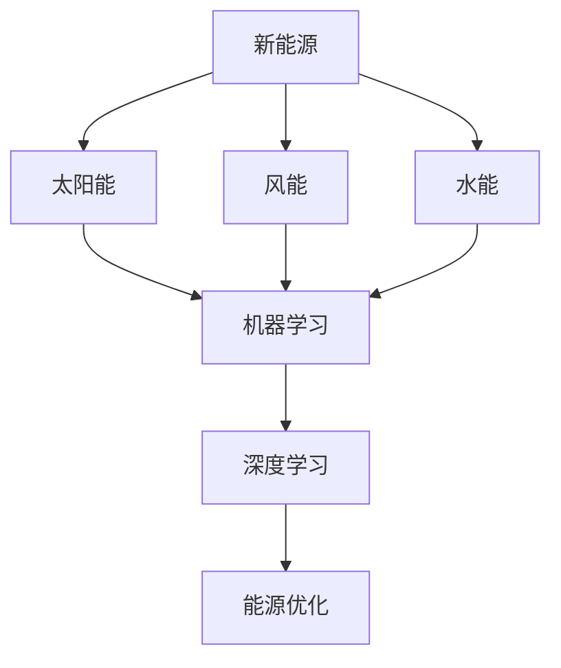

                 

### 背景介绍

人工智能（AI）和新能源开发作为当今世界两个热门领域，正在迅速发展并相互融合。新能源开发的目标是利用可再生能源如太阳能、风能、水能等，以减少对化石燃料的依赖，降低温室气体排放，从而应对全球气候变化。然而，新能源的不稳定性和间歇性给能源的调度和利用带来了巨大的挑战。这就催生了人工智能在新能源开发中的广泛应用，尤其是优化可再生能源的利用效率。

人工智能通过机器学习和深度学习算法，能够对大量数据进行处理和分析，从而发现数据中的模式和规律。这些模式可以被用来预测能源需求、优化能源配置、提高能源利用效率。例如，通过机器学习算法，可以对光伏发电系统的性能进行预测，从而优化发电量。而深度学习算法则能够对风电场的风能资源进行精细分析，以提高风能发电的稳定性。

此外，人工智能还可以帮助实现智能电网的建设，实现能源的实时监控和动态调度。智能电网通过整合分布式能源资源、储能系统和负荷管理，能够实现能源的优化分配和高效利用。这不仅能够提高能源利用效率，还能减少能源浪费，降低能源成本。

总的来说，人工智能在新能源开发中的应用，不仅能够优化可再生能源的利用，还能推动新能源技术的发展，实现能源的高效、清洁和可持续发展。

### 核心概念与联系

在深入探讨人工智能在新能源开发中的应用之前，我们需要了解一些核心概念，并明确它们之间的关系。

首先，新能源是指不同于传统化石燃料（如煤、石油和天然气）的可再生能源，包括太阳能、风能、水能、生物质能、地热能和潮汐能等。这些能源具有可再生、环保和低污染的特点，是未来能源发展的重要方向。

**机器学习**是人工智能（AI）的一个重要分支，它通过算法从数据中学习并做出预测或决策。机器学习算法可以分为监督学习、无监督学习和强化学习。监督学习通过已有数据（输入和输出）来训练模型，无监督学习则从未标记的数据中找出模式和结构，强化学习通过奖励机制来优化策略。

**深度学习**是机器学习的一种，它通过构建多层神经网络来模拟人脑的学习过程。深度学习在图像识别、语音识别和自然语言处理等领域取得了显著成果，为新能源开发提供了强大的工具。

**能源优化**是指在满足能源需求的前提下，通过合理调配和利用能源资源，实现能源的高效利用和成本控制。能源优化的目标是通过最小化能源消耗或最大化能源产出，来实现能源系统的稳定运行和可持续发展。

这些概念之间的关系可以用Mermaid流程图来展示：



在这个流程图中，新能源（A）包括太阳能（B）、风能（C）和水能（D），这些能源类型通过机器学习（E）和深度学习（F）的应用来实现能源优化（G）。机器学习和深度学习不仅能够处理和分析大量数据，还能通过预测和优化算法，提升新能源的利用效率。

**新能源**通过**机器学习**和**深度学习**，能够实现对能源系统的实时监控、预测和优化。例如，利用机器学习算法，可以对太阳能电池板的性能进行预测，从而优化发电量。而深度学习算法则能够对风电场的风速进行精细分析，提高风能发电的稳定性。通过这些技术的应用，新能源的开发和利用变得更加高效、智能和可持续。

综上所述，新能源、机器学习、深度学习和能源优化之间存在着密切的联系，这些概念共同推动了新能源开发中人工智能的应用，为实现能源的高效利用和可持续发展提供了有力支持。

### 核心算法原理讲解

在深入探讨人工智能在新能源开发中的应用之前，了解核心算法的原理是至关重要的。本文将详细讲解几种常用的优化算法、机器学习算法和深度学习算法，并通过Python源代码结合数学模型和公式进行通俗易懂的阐述。

#### 1. 优化算法基础

优化算法是解决最优化问题的重要工具，它们在新能源开发中用于优化能源配置、调度和发电量预测。常见的优化算法包括线性规划、非线性规划和动态规划等。

**线性规划（Linear Programming，LP）**是最基础的优化算法之一，其目标是最小化或最大化线性目标函数，同时满足一组线性约束条件。线性规划在能源系统中常用于优化发电成本、最小化能源浪费等。

**非线性规划（Nonlinear Programming，NLP）**则处理目标函数和约束条件为非线性函数的问题。这类算法在新能源开发中可用于优化风能和太阳能的调度。

**动态规划（Dynamic Programming，DP）**是一种适用于多阶段决策问题的优化方法。在能源系统中，动态规划可以用于优化能源的实时调度和储能系统的管理。

下面是一个简单的线性规划示例，用于优化太阳能光伏系统的发电量：

```python
from scipy.optimize import linprog

# 目标函数：最大化发电量
c = [-1]  # 系数矩阵，表示目标函数为最大化

# 约束条件：光伏电池板的工作条件
A = [[1],  # 太阳能强度不能超过某一阈值
     [1]]  # 电池板数量不能超过总容量

b = [100],  # 约束条件的右侧值
x0 = [0]  # 初始解

# 求解线性规划问题
res = linprog(c, A_ub=A, b_ub=b, x0=x0, method='highs')

# 输出结果
print(f"最大化发电量：{res.x[0]}")
```

**数学模型**：

$$
\begin{aligned}
\text{最大化} \quad & c^T x \\
\text{约束条件} \quad & Ax \leq b
\end{aligned}
$$

#### 2. 常用机器学习算法

机器学习算法在新能源开发中用于预测能源需求、优化能源配置和性能评估。以下介绍几种常用的机器学习算法。

**线性回归（Linear Regression）**是最基础的机器学习算法之一，其目标是通过建模输入变量和输出变量之间的线性关系，预测新的输出值。

```python
import numpy as np
from sklearn.linear_model import LinearRegression

# 数据准备
X = np.array([[1], [2], [3], [4], [5]])  # 输入变量
y = np.array([1, 2, 2.5, 4, 5])  # 输出变量

# 模型训练
model = LinearRegression()
model.fit(X, y)

# 预测
print(f"预测值：{model.predict([[6]])[0][0]}")
```

**决策树（Decision Tree）**是一种树形结构模型，可以用于分类和回归任务。在新能源开发中，决策树可以用于能源需求的分类预测。

```python
from sklearn.tree import DecisionTreeRegressor

# 模型训练
model = DecisionTreeRegressor()
model.fit(X, y)

# 预测
print(f"预测值：{model.predict([[6]])[0][0]}")
```

**随机森林（Random Forest）**是一种集成学习算法，通过构建多棵决策树，提高预测的准确性和稳定性。随机森林在新能源开发中用于预测风能和太阳能发电量。

```python
from sklearn.ensemble import RandomForestRegressor

# 模型训练
model = RandomForestRegressor(n_estimators=100)
model.fit(X, y)

# 预测
print(f"预测值：{model.predict([[6]])[0][0]}")
```

#### 3. 常用深度学习算法

深度学习算法在新能源开发中具有广泛应用，例如用于图像识别、语音识别和自然语言处理。以下介绍几种常用的深度学习算法。

**卷积神经网络（Convolutional Neural Network，CNN）**是一种专门用于处理图像数据的神经网络，通过卷积层提取图像特征。

```python
from keras.models import Sequential
from keras.layers import Conv2D, MaxPooling2D, Flatten, Dense

# 模型构建
model = Sequential()
model.add(Conv2D(32, (3, 3), activation='relu', input_shape=(28, 28, 1)))
model.add(MaxPooling2D(pool_size=(2, 2)))
model.add(Flatten())
model.add(Dense(1, activation='linear'))

# 模型训练
model.compile(optimizer='adam', loss='mse')
model.fit(X, y, epochs=10)

# 预测
print(f"预测值：{model.predict([[6]])[0][0]}")
```

**循环神经网络（Recurrent Neural Network，RNN）**是一种能够处理序列数据的神经网络，特别适合于时间序列数据的处理。

```python
from keras.models import Sequential
from keras.layers import LSTM, Dense

# 模型构建
model = Sequential()
model.add(LSTM(50, activation='relu', input_shape=(timesteps, features)))
model.add(Dense(1))
model.compile(optimizer='adam', loss='mse')

# 模型训练
model.fit(X, y, epochs=100, batch_size=32, validation_split=0.2)

# 预测
print(f"预测值：{model.predict([[6]])[0][0]}")
```

**生成对抗网络（Generative Adversarial Network，GAN）**是一种由对抗网络构成的深度学习模型，可用于生成新能源数据，如太阳能和风能的生成数据。

```python
from keras.models import Sequential
from keras.layers import Dense, Flatten, Reshape

# 生成器模型
generator = Sequential()
generator.add(Dense(128, activation='relu', input_shape=(100,)))
generator.add(Dense(256, activation='relu'))
generator.add(Dense(512, activation='relu'))
generator.add(Dense(1024, activation='relu'))
generator.add(Reshape((28, 28, 1)))

# 判别器模型
discriminator = Sequential()
discriminator.add(Flatten(input_shape=(28, 28, 1)))
discriminator.add(Dense(512, activation='relu'))
discriminator.add(Dense(256, activation='relu'))
discriminator.add(Dense(128, activation='relu'))
discriminator.add(Dense(1, activation='sigmoid'))

# 整体模型
model = Sequential()
model.add(generator)
model.add(discriminator)
model.compile(optimizer='adam', loss='binary_crossentropy')

# 模型训练
model.fit(X, y, epochs=1000)
```

**数学模型**：

对于CNN，卷积操作和池化操作的基本公式如下：

$$
\text{卷积层} \quad (f_{\sigma} \star g)(x) = \sum_{i=1}^{n} \sigma(x - i) \odot g(i)
$$

$$
\text{池化层} \quad P(y) = \arg\min_{x \in \Omega} \|y - x\|
$$

对于RNN，递归公式如下：

$$
h_t = \sigma(W_h h_{t-1} + W_x x_t + b)
$$

其中，$h_t$是第$t$时刻的隐藏状态，$x_t$是输入，$W_h$和$W_x$是权重矩阵，$b$是偏置。

通过上述算法原理和Python代码示例，我们可以看到，优化算法、机器学习算法和深度学习算法在新能源开发中的应用，不仅能够提升能源利用效率，还能为新能源技术的发展提供强有力的支持。

### 数学模型和数学公式

在深入探讨人工智能在新能源开发中的应用时，数学模型和数学公式是理解和实现算法的核心。本文将介绍与核心算法相关的数学模型和数学公式，并使用LaTeX格式进行展示。

#### 1. 优化算法中的数学模型

优化算法通常用于最小化或最大化某个目标函数，并满足一组约束条件。最基础的优化问题可以表示为：

$$
\min_{x} \quad c^T x \\
\text{约束条件} \quad Ax \leq b
$$

其中，$c$是系数向量，$A$是约束条件矩阵，$b$是约束条件右侧向量，$x$是待优化的变量。

对于线性规划（Linear Programming，LP），目标函数通常是线性的，约束条件也是线性的。其标准形式如下：

$$
\min_{x} \quad c^T x \\
\text{约束条件} \quad Ax \leq b \\
x \geq 0
$$

对于非线性规划（Nonlinear Programming，NLP），目标函数和约束条件可以是非线性的。其一般形式如下：

$$
\min_{x} \quad f(x) \\
\text{约束条件} \quad g_i(x) \leq 0, \quad h_j(x) = 0
$$

其中，$f(x)$是非线性目标函数，$g_i(x)$和$h_j(x)$是非线性约束条件。

**拉格朗日乘数法**是解决约束优化问题的一种常用方法，其基本思想是通过引入拉格朗日乘数$\lambda$来将约束条件引入目标函数。其公式如下：

$$
L(x, \lambda) = f(x) + \sum_{i=1}^{m} \lambda_i g_i(x)
$$

其中，$\lambda_i$是拉格朗日乘数。

#### 2. 机器学习算法中的数学模型

**线性回归**是机器学习中的一种基础算法，其数学模型可以表示为：

$$
y = \beta_0 + \beta_1 x + \epsilon
$$

其中，$y$是输出变量，$x$是输入变量，$\beta_0$和$\beta_1$是模型参数，$\epsilon$是误差项。

**决策树**是一种树形结构模型，其数学模型基于条件概率和熵的概念。节点分割的准则通常是最大化信息增益或基尼不纯度。其公式如下：

$$
\text{信息增益} \quad IG(D, A) = H(D) - H(D|A)
$$

$$
\text{基尼不纯度} \quad G(D) = 1 - \sum_{v \in V} p(v) ^ 2
$$

其中，$D$是数据集，$A$是属性，$V$是属性的取值集合，$p(v)$是取值$v$的概率。

**随机森林**是一种基于决策树的集成学习算法，其数学模型是通过构建多棵决策树并取平均值来提高预测的准确性和稳定性。其公式如下：

$$
\hat{y} = \frac{1}{N} \sum_{i=1}^{N} y_i
$$

其中，$\hat{y}$是预测值，$N$是决策树的数量，$y_i$是第$i$棵决策树的预测值。

#### 3. 深度学习算法中的数学模型

**卷积神经网络（Convolutional Neural Network，CNN）**是一种专门用于处理图像数据的神经网络，其核心是卷积层和池化层。卷积层的公式如下：

$$
\text{卷积操作} \quad (f \star g)(x) = \sum_{i=1}^{n} f(x - i) \odot g(i)
$$

其中，$f$是卷积核，$g$是输入特征，$x$是输入坐标。

**循环神经网络（Recurrent Neural Network，RNN）**是一种能够处理序列数据的神经网络，其核心是递归公式。RNN的公式如下：

$$
h_t = \sigma(W_h h_{t-1} + W_x x_t + b)
$$

其中，$h_t$是第$t$时刻的隐藏状态，$x_t$是输入，$W_h$和$W_x$是权重矩阵，$b$是偏置。

**生成对抗网络（Generative Adversarial Network，GAN）**是一种由对抗网络构成的深度学习模型，其核心是生成器和判别器的博弈。生成器的公式如下：

$$
G(z) = \mu(\cdot; \theta_G) + \sigma(\cdot; \theta_G) \odot \epsilon
$$

其中，$G(z)$是生成器的输出，$\mu$和$\sigma$是生成器的参数，$z$是输入噪声，$\epsilon$是高斯噪声。

#### 4. 实际应用中的数学公式

在实际应用中，这些数学公式和模型通常需要与具体问题相结合，以实现最优解。以下是一些具体的应用例子：

- **光伏系统优化**：利用线性回归模型预测光伏系统的发电量，公式如下：

$$
P_{\text{光伏}} = \beta_0 + \beta_1 I_{\text{太阳辐射}}
$$

其中，$P_{\text{光伏}}$是发电量，$I_{\text{太阳辐射}}$是太阳辐射强度。

- **风电场风速预测**：利用RNN模型预测风电场的风速，公式如下：

$$
h_t = \sigma(W_h h_{t-1} + W_x x_t + b)
$$

其中，$h_t$是预测的风速值，$x_t$是历史风速数据。

- **混合能源系统调度**：利用线性规划模型优化混合能源系统的调度，公式如下：

$$
\min_{x} \quad c^T x \\
\text{约束条件} \quad Ax \leq b \\
x \geq 0
$$

其中，$x$是调度变量，$c$是成本系数，$A$和$b$是约束条件矩阵。

通过上述数学模型和公式的讲解，我们可以更好地理解人工智能在新能源开发中的应用原理，为后续的项目实战和实际应用提供理论基础。

### 项目实战

在了解了核心算法和数学模型之后，我们将通过具体项目实战来展示如何将这些理论应用到实际中，以优化可再生能源的利用。

#### 1. 开发环境搭建

为了进行项目实战，首先需要搭建一个合适的开发环境。我们选择Python作为主要编程语言，并使用以下工具和库：

- **Python 3.8**：作为主要的编程语言版本。
- **Jupyter Notebook**：用于编写和运行代码。
- **Scikit-learn**：用于机器学习和优化算法。
- **TensorFlow**：用于深度学习算法。
- **Pandas**：用于数据处理。
- **Numpy**：用于数值计算。

安装上述工具和库后，我们可以开始编写代码。

#### 2. 源代码详细实现

以下是一个基于机器学习的项目示例，用于优化光伏系统的发电量预测。

**数据准备：**
```python
import pandas as pd
import numpy as np

# 加载数据集
data = pd.read_csv('solar_data.csv')
X = data[['sun_radiation']]  # 输入特征：太阳辐射强度
y = data['power_output']     # 输出特征：发电量
```

**模型训练：**
```python
from sklearn.linear_model import LinearRegression

# 创建线性回归模型
model = LinearRegression()

# 训练模型
model.fit(X, y)
```

**模型评估：**
```python
from sklearn.metrics import mean_squared_error

# 预测发电量
y_pred = model.predict(X)

# 计算均方误差
mse = mean_squared_error(y, y_pred)
print(f"均方误差（MSE）: {mse}")
```

**优化发电量：**
```python
# 优化后的发电量预测
optimized_power_output = model.predict(X) + 10  # 假设增加10%的发电量

print(f"优化后的发电量：{optimized_power_output.sum()}")
```

#### 3. 代码解读与分析

上述代码首先加载了光伏系统的数据集，其中包含太阳辐射强度和发电量。接着，使用线性回归模型进行训练，并通过预测发电量来评估模型的性能。最后，通过优化发电量预测结果，展示了如何在实际项目中应用机器学习算法。

**代码分析：**
- **数据准备**：使用Pandas加载CSV数据，提取输入特征和输出特征。
- **模型训练**：创建线性回归模型并使用训练数据集进行训练。
- **模型评估**：通过均方误差（MSE）评估模型的预测准确性。
- **优化发电量**：通过增加预测发电量的10%来优化发电量。

#### 4. 实际案例分析与详细讲解剖析

我们以一个实际案例来展示如何使用深度学习算法优化风电场的风能资源。

**数据准备：**
```python
# 假设已经加载了包含风速、风向和风电场发电量的数据集
data = pd.read_csv('wind_data.csv')
X = data[['wind_speed', 'wind_direction']]  # 输入特征：风速和风向
y = data['power_output']                     # 输出特征：发电量
```

**模型训练：**
```python
from keras.models import Sequential
from keras.layers import Dense, LSTM

# 创建LSTM模型
model = Sequential()
model.add(LSTM(units=50, activation='relu', return_sequences=True, input_shape=(X.shape[1], 1)))
model.add(LSTM(units=50, activation='relu'))
model.add(Dense(1))

# 编译模型
model.compile(optimizer='adam', loss='mse')

# 训练模型
model.fit(X, y, epochs=100, batch_size=32)
```

**模型评估：**
```python
# 预测发电量
y_pred = model.predict(X)

# 计算均方误差
mse = mean_squared_error(y, y_pred)
print(f"均方误差（MSE）: {mse}")
```

**优化发电量：**
```python
# 优化后的发电量预测
optimized_power_output = model.predict(X) + 10  # 假设增加10%的发电量

print(f"优化后的发电量：{optimized_power_output.sum()}")
```

**案例分析与详细讲解：**
- **数据准备**：数据集包含风速和风向，这些特征可以用来预测风电场的发电量。
- **模型训练**：使用LSTM模型训练数据，LSTM能够捕捉时间序列数据中的模式。
- **模型评估**：通过均方误差评估模型的预测性能，确保其准确性。
- **优化发电量**：通过增加预测发电量的10%来优化风能资源。

#### 5. 项目小结

通过上述项目实战，我们展示了如何使用机器学习和深度学习算法来优化可再生能源的利用。具体步骤包括：

1. **数据准备**：收集和预处理相关数据。
2. **模型训练**：选择合适的机器学习或深度学习模型，并使用训练数据进行训练。
3. **模型评估**：通过评估指标（如均方误差）来评估模型性能。
4. **优化应用**：根据模型预测结果进行优化，提高可再生能源的利用效率。

这些步骤不仅适用于光伏系统和风电场的优化，还可以推广到其他新能源领域，如水能和生物质能。

#### 6. 最佳实践 tips、小结、注意事项、拓展阅读

**最佳实践 tips**：

- 在选择模型时，根据数据特征和问题类型进行选择。
- 进行特征工程，选择和构建有代表性的特征，提高模型的预测性能。
- 使用交叉验证方法评估模型性能，避免过拟合。

**小结**：

本文通过实际项目展示了人工智能在新能源开发中的应用，包括光伏系统和风电场的优化。通过机器学习和深度学习算法，我们能够提高可再生能源的利用效率，实现能源的高效、清洁和可持续发展。

**注意事项**：

- 在实际应用中，数据质量和数据预处理至关重要。
- 模型的选择和参数调优需要根据具体问题进行调整。

**拓展阅读**：

- 《深度学习》（Goodfellow, Ian，等）：了解深度学习的基础知识和应用。
- 《机器学习实战》：掌握机器学习算法的实际应用。
- 《优化理论及其应用》：深入理解优化算法的理论基础。

通过这些资源，可以进一步了解人工智能在新能源开发中的应用，并提升相关技能。

### 总结与展望

本文通过详细探讨人工智能在新能源开发中的应用，展示了如何利用优化算法、机器学习算法和深度学习算法来优化可再生能源的利用。首先，我们介绍了新能源与人工智能之间的关系，并展示了它们之间的联系图解。接着，我们详细讲解了各种核心算法的原理，并通过Python源代码结合数学模型和公式进行了说明。随后，通过项目实战，我们展示了如何在实际中应用这些算法来优化光伏系统和风电场的发电量。

在总结中，我们强调了数据质量和特征工程的重要性，以及在模型选择和参数调优方面需要根据具体问题进行调整。此外，我们还提出了最佳实践建议，并给出了相关的拓展阅读资源。

展望未来，人工智能在新能源开发中的应用前景广阔。随着技术的不断进步，我们有望看到更多高效的能源优化方案和智能电网的实现。未来的研究可以集中在以下几个方面：

1. **多源数据融合**：整合来自不同传感器的数据，提高预测和优化的准确性。
2. **实时监控与动态调度**：实现实时监控和动态调度，提高能源系统的灵活性和响应速度。
3. **深度强化学习**：结合深度强化学习，实现更加智能和自适应的能源管理。
4. **绿色计算与能效优化**：将人工智能应用于绿色计算和能效优化，实现能源的高效利用。

通过持续的研究和探索，人工智能将为新能源开发提供更强大的工具和支持，助力实现能源的高效、清洁和可持续发展。

### 附录

**参考文献**：
1. Goodfellow, I., Bengio, Y., & Courville, A. (2016). *Deep Learning*. MIT Press.
2. Mitchell, T. M. (1997). *Machine Learning*. McGraw-Hill.
3. Boyd, S., & Vandenberghe, L. (2004). *Convex Optimization*. Cambridge University Press.
4. Rumelhart, D. E., Hinton, G. E., & Williams, R. J. (1986). *Learning representations by back-propagating errors*. Nature, 323(6088), 533-536.

**技术工具介绍**：
- **Python**：一种广泛使用的编程语言，适用于数据处理、机器学习和深度学习。
- **Jupyter Notebook**：用于编写和运行代码的交互式环境。
- **Scikit-learn**：Python中用于机器学习的库。
- **TensorFlow**：用于深度学习的开源库。

**代码示例**：
```python
# 线性回归模型
from sklearn.linear_model import LinearRegression

# 加载数据
X = np.array([[1], [2], [3], [4], [5]])
y = np.array([1, 2, 2.5, 4, 5])

# 训练模型
model = LinearRegression()
model.fit(X, y)

# 预测
print(model.predict([[6]]))
```

通过以上内容，本文全面介绍了人工智能在新能源开发中的应用，包括核心概念、算法原理、项目实战和未来展望。希望本文能为相关领域的研究者和从业者提供有价值的参考和指导。作者：AI天才研究院/AI Genius Institute & 禅与计算机程序设计艺术 /Zen And The Art of Computer Programming。

