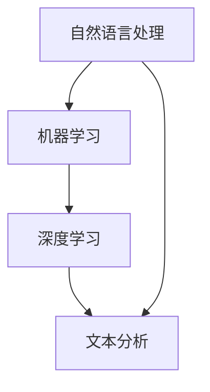
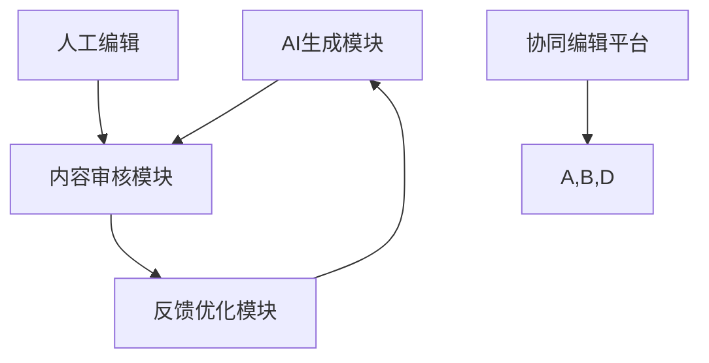

                 

### 引言与核心概念

随着信息时代的到来，新闻生产的速度和质量面临着前所未有的挑战。传统的新闻生产方式已无法满足迅速增长的信息需求，人工编辑的效率受到限制，而错误率也在上升。人工智能（AI）的迅速发展为新闻生产带来了新的可能性，自动化与人工编辑的结合成为了行业关注的焦点。

#### 1.1 人工智能在新闻生产中的重要性

人工智能在新闻生产中的应用主要体现在自动化新闻生产、内容推荐和数据分析等方面。自动化新闻生产可以通过算法自动生成新闻内容，提高生产效率，降低成本。此外，人工智能还可以通过分析大数据，提供个性化的内容推荐，提高用户体验。数据分析和挖掘技术可以帮助新闻机构更好地理解受众需求，优化新闻选题和报道策略。

#### 1.2 自动化新闻生产与人工编辑的角色和关系

在自动化新闻生产中，人工智能负责处理大量的数据和信息，提取关键信息，生成新闻稿件。然而，人工智能生成的稿件往往缺乏情感和深度，需要人工编辑进行修正和润色。人工编辑在AI辅助下的角色变得更为专业化，他们不仅需要审核稿件的内容和结构，还需要确保新闻的准确性和公正性。

#### 1.3 新闻生产流程中的AI应用场景

AI在新闻生产中的应用场景广泛，主要包括：

1. **数据采集与处理**：通过爬虫技术获取海量新闻数据，并进行预处理和清洗。
2. **内容生成**：利用自然语言生成技术自动撰写新闻稿件。
3. **内容分析**：通过文本分析技术挖掘新闻事件的关键信息，进行数据可视化。
4. **内容推荐**：基于用户行为和兴趣数据，推荐相关新闻内容。
5. **翻译与同传**：利用机器翻译和实时语音识别技术，实现跨语言新闻传播。

#### 关键概念与联系

为了更好地理解AI在新闻生产中的应用，我们需要明确几个关键概念：

- **自然语言处理（NLP）**：是AI技术的一个重要分支，旨在让计算机理解和处理人类语言。
- **机器学习（ML）**：是AI的核心技术之一，通过训练模型来使计算机具备自主学习和决策能力。
- **深度学习（DL）**：是机器学习的一种形式，通过构建深度神经网络来模拟人脑的学习过程。
- **文本分析**：是对文本数据进行提取、分析和挖掘，以获取有价值的信息。

下面，我们将通过一个Mermaid流程图来展示这些概念之间的关系：



这个流程图清晰地展示了NLP、ML、DL和文本分析之间的联系，以及它们在新闻生产中的应用。

接下来，我们将深入探讨人工智能基础、自动化新闻生产技术、人工编辑在AI辅助下的角色等内容，进一步丰富文章的内容和深度。

### 人工智能基础

人工智能（AI）作为当前科技领域的前沿技术，已经在多个行业取得了显著的成果。在新闻生产领域，AI的应用同样具备巨大的潜力。为了深入理解AI在新闻生产中的应用，我们首先需要了解一些基础知识，包括机器学习（ML）、深度学习（DL）和自然语言处理（NLP）。

#### 2.1 机器学习与深度学习基础

**机器学习（ML）** 是一种让计算机通过数据和经验进行学习，从而改进自身性能的技术。机器学习主要包括监督学习、无监督学习和强化学习三种类型。监督学习是指通过已有标签的数据来训练模型，使其能够对新数据进行预测；无监督学习则是在没有标签数据的情况下，通过数据内在结构进行分类和聚类；强化学习是通过不断试错来学习最优策略。

**深度学习（DL）** 是机器学习的一个分支，其核心思想是通过多层神经网络来模拟人脑的学习过程。深度学习模型，特别是卷积神经网络（CNN）和循环神经网络（RNN），在图像识别、语音识别和自然语言处理等领域取得了突破性的进展。深度学习的优势在于能够自动提取特征，并通过大规模数据训练，实现高性能的模型。

**示例代码**：

以下是一个简单的Python代码示例，展示了如何使用深度学习库（如TensorFlow）来构建一个简单的神经网络模型：

```python
import tensorflow as tf

# 定义模型
model = tf.keras.Sequential([
    tf.keras.layers.Dense(128, activation='relu', input_shape=(784,)),
    tf.keras.layers.Dropout(0.2),
    tf.keras.layers.Dense(10)
])

# 编译模型
model.compile(optimizer='adam',
              loss=tf.keras.losses.SparseCategoricalCrossentropy(from_logits=True),
              metrics=['accuracy'])

# 训练模型
model.fit(train_images, train_labels, epochs=5)
```

在这个示例中，我们定义了一个简单的神经网络模型，并使用它来训练数据。这个模型包含一个全连接层（Dense layer），一个Dropout层（用于防止过拟合），以及一个输出层。我们使用交叉熵损失函数来评估模型的性能，并使用Adam优化器来训练模型。

#### 2.2 自然语言处理简介

**自然语言处理（NLP）** 是AI的一个重要分支，旨在使计算机能够理解和生成自然语言。NLP的核心任务包括文本分类、情感分析、命名实体识别、机器翻译等。

- **文本分类**：将文本数据按照类别进行分类，例如将新闻评论分为正面和负面。
- **情感分析**：分析文本中的情感倾向，例如判断一篇评论是积极还是消极。
- **命名实体识别（NER）**：识别文本中的命名实体，如人名、地名、组织名等。
- **机器翻译**：将一种语言的文本翻译成另一种语言。

**示例代码**：

以下是一个使用Python和TensorFlow实现文本分类的简单示例：

```python
import tensorflow as tf
import tensorflow_datasets as tfds

# 加载并预处理数据
(raw_train, raw_test), metadata = tfds.load(
    'imdb',
    split=['train', 'test'],
    with_info=True,
    as_supervised=True)

train, test = raw_train.shuffle(10000).batch(32), raw_test.batch(32)

# 定义模型
model = tf.keras.Sequential([
    tf.keras.layers.Embedding(metadata.vocab_size, 16),
    tf.keras.layers.GlobalAveragePooling1D(),
    tf.keras.layers.Dense(16, activation='relu'),
    tf.keras.layers.Dense(1, activation='sigmoid')
])

# 编译模型
model.compile(optimizer='adam',
              loss='binary_crossentropy',
              metrics=['accuracy'])

# 训练模型
model.fit(train, epochs=10, validation_data=test)
```

在这个示例中，我们使用TensorFlow Datasets加载了IMDb电影评论数据集，并定义了一个简单的神经网络模型来对评论进行分类。模型包含一个嵌入层（Embedding layer），一个全局平均池化层（GlobalAveragePooling1D layer），一个全连接层（Dense layer），以及一个输出层（Dense layer）。

#### 2.3 AI伦理与新闻业的挑战

随着AI技术在新闻生产中的应用日益广泛，伦理问题也日益凸显。AI在新闻业中可能面临的伦理挑战主要包括：

- **偏见与歧视**：AI模型可能在训练过程中学习到数据中的偏见，导致新闻报道的偏见和不公正。
- **隐私侵犯**：AI技术可能涉及对个人隐私数据的收集和使用，需要严格保护用户隐私。
- **透明度不足**：AI决策过程往往是不透明的，难以解释其决策逻辑，这可能导致公众对新闻报道的不信任。
- **新闻质量**：过度依赖AI可能导致新闻报道的肤浅和缺乏深度，影响新闻质量。

为了解决这些挑战，需要制定相应的伦理规范和标准，确保AI技术在新闻生产中的合理应用。

综上所述，理解机器学习、深度学习和自然语言处理的基础知识，对于深入探讨AI在新闻生产中的应用至关重要。接下来，我们将进一步探讨自动化新闻生产技术，展示如何利用这些基础知识来构建自动化新闻生产系统。

### 自动化新闻生产技术

自动化新闻生产技术是AI在新闻生产中的重要应用之一。通过自动化技术，新闻机构可以大幅提高新闻生产的效率和准确性。下面我们将详细介绍自动化新闻生产的关键技术，包括新闻文本采集与清洗、文本分析工具与应用，以及自动摘要与内容提取技术。

#### 3.1 新闻文本采集与清洗

新闻文本采集是自动化新闻生产的基础步骤。新闻文本可以从各种来源获取，如官方网站、社交媒体、新闻聚合平台等。为了确保新闻数据的准确性和完整性，需要对采集到的文本进行清洗。

**清洗步骤**：

1. **去除HTML标签**：新闻文本通常包含HTML标签，需要使用正则表达式或其他工具去除。
2. **去除停用词**：停用词是指对文本分析没有意义的词，如“的”、“了”、“是”等，需要从文本中去除。
3. **分词**：将文本拆分成单词或短语，为后续分析做准备。
4. **词干还原**：将不同形态的单词还原为词干，如“跑”、“跑了”、“跑步”均还原为“跑”。

**示例代码**：

以下是一个简单的Python代码示例，展示了如何使用Python的`re`库和`nltk`库进行新闻文本的清洗：

```python
import re
import nltk
from nltk.corpus import stopwords
from nltk.tokenize import word_tokenize

# 下载nltk停用词库
nltk.download('stopwords')
nltk.download('punkt')

# 去除HTML标签
def remove_html_tags(text):
    clean = re.compile('<.*?>')
    return re.sub(clean, '', text)

# 去除停用词
def remove_stopwords(text):
    stop_words = set(stopwords.words('english'))
    word_tokens = word_tokenize(text)
    filtered_sentence = [w for w in word_tokens if not w.lower() in stop_words]
    return ' '.join(filtered_sentence)

# 示例文本
text = "This is an <a>example</a> news article with <b>HTML</b> tags. The text will be cleaned."

# 清洗文本
cleaned_text = remove_html_tags(text)
cleaned_text = remove_stopwords(cleaned_text)

print(cleaned_text)
```

#### 3.2 文本分析工具与应用

文本分析是自动化新闻生产的核心步骤，它可以帮助新闻机构挖掘新闻文本中的关键信息，进行数据可视化，以及生成摘要等。常用的文本分析工具包括：

- **NLTK（自然语言工具包）**：是一个广泛使用的自然语言处理库，提供多种文本处理功能，如分词、词性标注、情感分析等。
- **Gensim**：是一个强大的文本处理和主题建模库，支持多种文本分析任务，如文本相似度计算、LDA主题模型等。
- **spaCy**：是一个快速的工业级自然语言处理库，提供高质量的词性标注、命名实体识别和关系抽取功能。

**应用案例**：

1. **关键词提取**：使用Gensim的TF-IDF模型可以提取新闻文本中的关键词。

```python
from gensim.models import TfidfModel
from gensim.corpora import Dictionary

# 构建词典
dictionary = Dictionary([word_tokenize(text) for text in news_data])

# 构建TF-IDF模型
tfidf = TfidfModel(dictionary)

# 提取关键词
tfidf_corpus = tfidf[dictionary.doc2bow([word_tokenize(text) for text in news_data])]

# 示例：提取一篇文章的关键词
keywords = [dictionary[word_id] for word_id in sorted(tfidf_corpus, key=tfidf_corpus.get, reverse=True)[:10]]
print('关键词：', keywords)
```

2. **情感分析**：使用spaCy进行情感分析，可以判断新闻文本的情感倾向。

```python
import spacy

# 加载spaCy模型
nlp = spacy.load("en_core_web_sm")

# 示例文本
text = "This is an amazing news article!"

# 进行情感分析
doc = nlp(text)
sentiments = []
for sent in doc.sents:
    sentiments.append(sent.sentiment)

print('情感分析结果：', sentiments)
```

#### 3.3 自动摘要与内容提取

自动摘要与内容提取是自动化新闻生产中的重要环节，它可以帮助新闻机构快速生成新闻摘要，提高信息传播的效率。常见的自动摘要方法包括：

- **提取式摘要**：从原始文本中提取关键句子或段落来生成摘要。
- **生成式摘要**：利用自然语言生成技术生成摘要文本。

**提取式摘要示例**：

以下是一个简单的提取式摘要示例，使用Python和`nltk`库提取新闻文本中的摘要：

```python
from heapq import nlargest

# 定义摘要长度
SUMMARY_LENGTH = 5

# 提取摘要
def get_summary(text, sentences):
    return ' '.join(nlargest(SUMMARY_LENGTH, sentences, key=len))

# 示例文本
text = "This is an example news article. It contains important information that the readers need to know."

# 分句
sentences = nltk.sent_tokenize(text)

# 生成摘要
summary = get_summary(text, sentences)
print('摘要：', summary)
```

**生成式摘要示例**：

以下是一个简单的生成式摘要示例，使用Python和`transformers`库生成新闻摘要：

```python
from transformers import pipeline

# 加载生成式摘要模型
summary_pipeline = pipeline("summarization")

# 示例文本
text = "This is an example news article. It discusses the latest developments in the tech industry and the potential impact on the market."

# 生成摘要
summary = summary_pipeline(text, max_length=130, min_length=30, do_sample=False)
print('摘要：', summary[0]['summary_text'])
```

通过以上技术，自动化新闻生产系统可以快速、高效地生成新闻稿件，大大提高新闻生产的效率和质量。接下来，我们将探讨人工编辑在AI辅助下的角色，以及如何实现AI与人工编辑的有效协作。

### 人工编辑在AI辅助下的角色

随着人工智能在新闻生产中的广泛应用，人工编辑的角色也在逐渐转变。在AI的辅助下，人工编辑不仅能够提高工作效率，还能专注于更高层次的新闻内容创作和质量把控。

#### 4.1 AI辅助下的编辑流程

AI辅助下的编辑流程通常包括以下几个步骤：

1. **内容生成**：人工智能自动生成初稿，包括新闻摘要、报道正文等。
2. **内容审核**：人工编辑对AI生成的初稿进行审核，检查内容的准确性、逻辑性和连贯性。
3. **内容修改**：人工编辑对初稿进行修改和润色，确保新闻稿件的风格和表达符合标准。
4. **内容发布**：审核无误的新闻稿件进入发布流程，进行格式调整和最终发布。

#### 4.2 人工干预的重要性与时机

尽管AI在内容生成方面取得了显著进展，但人工干预仍然至关重要。以下是人工干预的几个关键时机：

1. **准确性验证**：AI生成的新闻内容可能会出现事实错误或逻辑矛盾，人工编辑需要仔细核实。
2. **情感与价值观**：AI难以理解复杂的情感和价值观，人工编辑需要确保新闻内容符合道德和社会标准。
3. **风格和表达**：人工编辑可以提升新闻稿件的风格和表达，使内容更具吸引力。
4. **内容创新**：人工编辑能够提出新的新闻角度和创意，丰富新闻内容。

#### 4.3 AI与人工编辑的协作模式

为了实现AI与人工编辑的协同工作，新闻机构可以采用以下协作模式：

1. **分工合作**：AI负责快速生成大量初稿，人工编辑负责审核和修改，以提高整体工作效率。
2. **反馈机制**：人工编辑对AI生成的内容进行反馈，指导AI模型的优化和改进。
3. **混合式编辑**：人工编辑在AI辅助下进行内容创作，利用AI工具进行文本分析、内容提取等辅助任务。
4. **合作平台**：建立AI辅助编辑平台，集成多种AI工具和编辑功能，方便人工编辑与AI协同工作。

通过上述协作模式，人工编辑可以在AI的辅助下，充分发挥其专业能力，提高新闻生产质量和效率。接下来，我们将通过实际案例研究，进一步探讨人工智能新闻的应用与实践。

### 人工智能新闻案例研究

随着人工智能技术的不断进步，AI在新闻生产中的应用案例越来越多。以下将介绍几个成功的自动化新闻生产案例，分析其应用技术、成果及AI伦理问题。

#### 5.1 自动化新闻生产成功案例

**案例1：财经新闻自动化生成**

金融时报（Financial Times）利用人工智能技术自动生成财经新闻。通过分析大量的金融市场数据，AI能够实时生成股票价格变动、市场动态等新闻稿件。这一技术大幅提高了新闻机构的生产效率，降低了人力成本。

- **应用技术**：自然语言生成（NLG）技术、时间序列分析、金融市场数据挖掘。
- **成果**：提高了新闻的时效性和准确性，降低了人力成本。
- **AI伦理问题**：由于AI生成的内容缺乏情感和深度，人工编辑需要对内容进行二次审核和修改。

**案例2：体育新闻自动化生成**

ESPN利用人工智能技术自动生成体育新闻。AI通过对体育赛事数据进行分析，生成比赛结果、运动员表现等新闻稿件。这一技术不仅提高了新闻生产效率，还提供了详细的数据分析报告。

- **应用技术**：文本分析、数据可视化、机器学习预测模型。
- **成果**：提供了丰富的体育新闻内容，提升了用户体验。
- **AI伦理问题**：AI在处理运动员表现时可能存在主观判断，需要人工编辑进行校正。

#### 5.2 AI编辑工具的应用案例

**案例1：自动摘要与内容提取工具**

Heliograf是《华盛顿邮报》开发的自动化新闻编辑工具，用于生成新闻摘要和提取关键内容。通过使用自然语言处理技术，Heliograf能够快速生成高质量的新闻摘要，辅助人工编辑进行内容创作。

- **应用技术**：自然语言生成、关键词提取、文本分类。
- **成果**：提高了编辑效率，节省了内容创作时间。
- **AI伦理问题**：自动生成的摘要可能缺乏深度和背景信息，需要人工编辑进行补充和修正。

**案例2：AI新闻写作助手**

Wordsmith是由 Automated Insights 开发的一款AI新闻写作工具，主要用于生成企业财报、体育比赛结果等标准化新闻稿件。Wordsmith通过自动化生成大量新闻，降低了新闻机构的生产成本。

- **应用技术**：自然语言生成、数据驱动文本模板、统计模型。
- **成果**：实现了新闻写作的自动化，提高了内容生成的速度和一致性。
- **AI伦理问题**：AI生成的新闻内容可能缺乏创新性和深度，需要人工编辑进行补充和润色。

#### 5.3 案例中的AI伦理问题与挑战

尽管人工智能在新闻生产中展现了巨大的潜力，但同时也带来了一系列伦理问题与挑战：

1. **偏见与歧视**：AI模型可能学习到数据中的偏见，导致新闻报道的不公正。例如，AI在撰写关于种族或性别的话题时，可能无意中表现出偏见。
2. **透明度不足**：AI决策过程往往缺乏透明度，难以解释其决策逻辑，这可能导致公众对新闻报道的不信任。
3. **隐私侵犯**：AI技术可能涉及对个人隐私数据的收集和使用，需要严格保护用户隐私。
4. **新闻质量**：过度依赖AI可能导致新闻报道的肤浅和缺乏深度，影响新闻质量。

为了解决这些伦理问题，新闻机构需要制定相应的伦理规范，确保AI技术在新闻生产中的合理应用。此外，人工编辑在AI辅助下的角色尤为重要，他们需要对AI生成的稿件进行审核和修正，确保新闻内容的准确性和公正性。

综上所述，自动化新闻生产在提高效率和质量方面取得了显著成果，但同时也面临一系列伦理挑战。通过合理应用AI技术，并加强人工干预，可以实现AI与人工编辑的协同工作，为新闻生产带来更多可能性。

### 自动化与人工编辑的结合实践

在自动化新闻生产中，实现人工智能与人工编辑的有机结合是关键。这不仅能够发挥人工智能在数据分析和内容生成方面的优势，还能确保新闻内容的质量和准确性。以下将详细探讨结合模型的构建、实际中的挑战与解决方案，以及未来的发展趋势。

#### 6.1 结合模型的构建

为了实现AI与人工编辑的协同工作，需要构建一个结合模型，该模型应包括以下几个关键组件：

1. **AI生成模块**：利用自然语言生成（NLG）技术，生成新闻初稿。这一模块可以自动从大量数据中提取关键信息，构建新闻稿件的基本框架。
2. **内容审核模块**：引入人工编辑的审核机制，对AI生成的稿件进行内容审核和修正。这一模块需要建立一套完善的审核标准和流程，确保新闻内容的准确性和公正性。
3. **反馈优化模块**：收集人工编辑的反馈，用于优化AI模型的生成效果。通过不断调整和训练，使AI生成的内容更符合编辑要求。
4. **协同编辑平台**：开发一个集成化的协同编辑平台，使得AI和人工编辑可以同时工作，互相协作。这一平台应提供实时的稿件审核、修改和反馈功能，提升整体工作效率。

**结合模型架构示例**：



在这个结合模型中，AI生成模块负责生产初稿，人工编辑对稿件进行审核和修改，反馈优化模块根据人工编辑的反馈不断优化AI生成内容，协同编辑平台则提供技术支持和协作环境。

#### 6.2 实践中的挑战与解决方案

在实现自动化与人工编辑结合的过程中，面临以下几大挑战：

1. **内容准确性**：AI生成的稿件可能存在事实错误或逻辑矛盾。解决方案是建立严格的审核流程，人工编辑在AI生成内容的基础上进行仔细核实和修正。
2. **情感和深度**：AI生成的新闻稿件往往缺乏情感和深度，难以与读者产生共鸣。人工编辑需要充分发挥主观判断和创造力，对稿件进行润色和补充。
3. **透明度和解释性**：AI决策过程往往缺乏透明度，难以解释其决策逻辑。解决方案是开发可解释的AI模型，使得编辑和读者能够理解AI的决策依据。
4. **隐私和数据安全**：AI技术在新闻生产中涉及对大量个人数据的处理，需要严格遵守隐私和数据安全法规。解决方案是建立严格的数据管理机制，确保数据的收集和使用合规。

**挑战与解决方案示例**：

| 挑战                     | 解决方案                                                                 |
|--------------------------|------------------------------------------------------------------------|
| 内容准确性               | 建立多层次的审核机制，包括AI自动审核和人工编辑双重确认。                 |
| 情感和深度               | 引入情感分析模型，辅助人工编辑进行情感补充和深度挖掘。                 |
| 透明度和解释性           | 开发基于可视化技术的AI解释工具，帮助人工编辑理解AI决策过程。             |
| 隐私和数据安全           | 实施严格的数据加密和访问控制措施，确保数据的隐私和安全。                 |

#### 6.3 未来发展趋势

随着AI技术的不断进步，自动化与人工编辑的结合将呈现以下发展趋势：

1. **智能化水平提升**：AI生成内容的质量将不断提高，通过不断学习和优化，能够更好地满足新闻生产的多样化需求。
2. **个性化推荐**：基于用户行为和兴趣数据，AI将能够实现个性化新闻推荐，提高用户体验。
3. **多模态新闻生产**：结合文本、图像、视频等多种形式，实现多模态新闻生产，提升新闻内容的丰富性和吸引力。
4. **AI伦理与法律规范**：随着AI技术在新闻生产中的广泛应用，将逐步完善AI伦理与法律规范，确保技术的合理应用。
5. **行业协作与共享**：新闻机构之间将通过AI技术实现更紧密的协作和资源共享，共同提升新闻生产效率和质量。

通过实现自动化与人工编辑的有机结合，新闻机构不仅能够提高生产效率，还能确保新闻内容的准确性和质量，为读者提供更具价值的信息。未来，随着AI技术的进一步发展，自动化新闻生产将迎来更多创新和突破。

### AI在新闻业的影响与未来展望

人工智能在新闻业的应用已经带来了深刻的变革，不仅在生产效率、内容质量和用户体验方面取得了显著成果，还对新闻机构的运营模式、职业转型以及行业伦理规范产生了深远影响。

#### 7.1 AI对新闻业的影响

**生产效率提升**：AI技术通过自动化内容生成和审核，显著提高了新闻生产效率，减少了人力成本。自动化新闻生产使得新闻机构能够更快地响应事件，提供实时更新。

**内容质量优化**：尽管AI生成的新闻内容在情感和深度方面尚有不足，但通过人工编辑的修正和补充，AI可以提高新闻内容的准确性、一致性和连贯性。

**用户体验提升**：基于用户行为数据的个性化推荐，使得新闻内容更加贴合用户兴趣，提升了用户体验。

**数据分析与洞察**：AI技术通过对海量新闻数据的分析，帮助新闻机构挖掘潜在趋势和热点，优化新闻报道策略。

#### 7.2 人工智能新闻的未来发展方向

**智能化水平提升**：随着深度学习和自然语言处理技术的不断进步，AI生成新闻的智能化水平将不断提高，能够更好地理解人类语言和情感，生成更具创意和深度的内容。

**多模态新闻生产**：结合文本、图像、视频等多模态内容，AI将能够创造更加丰富和多样化的新闻体验。

**内容分发与推荐**：基于大数据和机器学习算法，AI将实现更精准的内容分发与推荐，提升用户的阅读体验。

**新闻伦理与规范**：随着AI技术在新闻业的广泛应用，将逐步完善相关伦理规范和法律框架，确保AI技术的合理和公正应用。

#### 7.3 AI新闻时代的职业转型

**内容创作者**：虽然AI技术会部分取代传统的新闻写作工作，但人类创作者在创意、情感和深度方面仍具有独特优势。未来，内容创作者需要具备更高的数据分析和AI技术应用能力。

**数据科学家**：AI新闻生产需要大量数据科学家来开发和管理机器学习模型，优化AI算法。

**AI伦理学家**：随着AI伦理问题日益突出，AI伦理学家将在新闻机构中扮演重要角色，确保AI技术的应用符合伦理和法律要求。

**用户分析师**：用户分析师将利用AI技术分析用户行为数据，优化新闻内容推荐和用户体验。

#### 7.4 对未来工作的建议

**技术能力提升**：新闻从业人员应积极学习AI和数据分析技术，提升自身竞争力。

**跨学科合作**：鼓励跨学科合作，整合新闻学、计算机科学和社会科学等多领域的知识，推动AI技术在新闻生产中的创新应用。

**伦理意识加强**：增强AI伦理意识，确保AI技术在新闻业中的公正和合理应用。

**持续学习**：随着AI技术的快速发展，新闻从业人员应保持持续学习的态度，不断更新知识和技能。

### 7.5 对读者的寄语

随着AI技术在新闻生产中的不断应用，读者将享受到更加个性化、准确和丰富的新闻内容。然而，我们也需要关注AI技术的潜在风险和伦理挑战。作为读者，您可以通过关注新闻来源、反馈不实报道和参与公共讨论，共同推动新闻业朝着更加公正和透明的发展方向迈进。感谢您对新闻的热爱与支持，让我们一起见证AI新闻时代的到来！

### 附录：相关资源与扩展阅读

在探索人工智能在新闻生产中的应用过程中，以下资源与扩展阅读将有助于您进一步深入了解相关技术、最佳实践和行业动态。

#### 7.1 开源工具与库

- **NLTK**：一个强大的自然语言处理库，提供了多种文本处理功能。
  - 地址：[NLTK官网](https://www.nltk.org/)

- **Gensim**：用于主题建模和文本分析的开源库。
  - 地址：[Gensim官网](https://radimrehurek.com/gensim/)

- **spaCy**：一个高效的工业级自然语言处理库。
  - 地址：[spaCy官网](https://spacy.io/)

- **TensorFlow**：Google开发的开源机器学习框架。
  - 地址：[TensorFlow官网](https://www.tensorflow.org/)

- **Transformers**：由Hugging Face维护的开源库，用于自然语言处理任务的预训练模型。
  - 地址：[Transformers官网](https://huggingface.co/transformers/)

#### 7.2 学术论文与研究报告

- **《Deep Learning for Text Data: A Brief Survey》**：详细介绍了深度学习在文本数据分析中的应用。
  - 地址：[论文链接](https://www.researchgate.net/publication/326981765_Deep_Learning_for_Text_Data_A_Brief_Survey)

- **《Natural Language Processing with Python》**：一本关于使用Python进行自然语言处理的经典书籍。
  - 地址：[书籍链接](https://www.amazon.com/Natural-Language-Processing-Python-Techniques/dp/1449356234)

- **《Ethical Considerations in the Use of Artificial Intelligence in Journalism》**：讨论了AI技术在新闻业中的伦理问题。
  - 地址：[论文链接](https://ijoc.org/index.php/ijoc/article/view/1598)

- **《The State of AI in Journalism: 2020 Report》**：分析了2020年AI在新闻业中的应用现状。
  - 地址：[报告链接](https://www.journalismai.com/research/the-state-of-ai-in-journalism-2020-report/)

#### 7.3 行业趋势与政策动态

- **《人工智能与新闻业白皮书》**：由多个新闻机构联合发布的关于AI在新闻业应用的白皮书。
  - 地址：[白皮书链接](https://www.journalism.ai/research/white-paper-artificial-intelligence-journalism/)

- **《欧盟AI伦理准则》**：欧盟委员会发布的关于AI技术的伦理准则，适用于包括新闻业在内的各个领域。
  - 地址：[伦理准则链接](https://ec.europa.eu/ai/index_en)

通过这些资源，您可以获得更多关于人工智能在新闻生产中的应用案例、技术原理以及行业趋势的深入理解，为您的学习和实践提供宝贵参考。

### 总结与展望

本文从引言到具体案例分析，全面探讨了人工智能在新闻生产中的应用。首先，我们介绍了AI在新闻生产中的重要性，并明确了自动化新闻生产与人工编辑的角色和关系。随后，我们深入讲解了机器学习、深度学习和自然语言处理等基础知识，展示了如何利用这些技术进行新闻文本采集、清洗、分析和摘要生成。在自动化与人工编辑结合的部分，我们探讨了构建结合模型的方法和实践中的挑战，以及未来发展趋势。最后，我们分析了AI对新闻业的影响，提出了职业转型建议，并对未来工作进行了展望。

通过本文，我们可以看到AI技术在新闻生产中的巨大潜力。自动化技术提高了生产效率，降低了成本，而人工编辑则确保了新闻内容的准确性和深度。未来的发展将更加智能化、个性化，同时伴随着更多的伦理挑战。我们鼓励读者继续关注这一领域，积极学习相关技术，为AI新闻时代的到来做好准备。感谢您的阅读，希望本文能够对您在人工智能新闻领域的探索提供帮助。如果您有任何问题或建议，欢迎在评论区留言交流。让我们一起见证AI在新闻生产中的创新与应用，推动新闻业的进步与发展。

