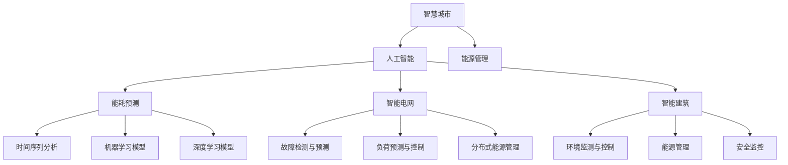

                 

### 人工智能在智慧城市能源管理中的应用

> **关键词：** 智慧城市、人工智能、能源管理、能耗预测、优化算法

> **摘要：** 本文章旨在探讨人工智能在智慧城市能源管理中的应用。通过分析智慧城市的概念、发展背景以及人工智能的基本原理，本文详细阐述了人工智能在能源管理中的核心概念、应用场景和优化算法。同时，本文通过实际项目案例，展示了人工智能在智慧城市能源管理中的具体应用，为相关领域的学者和实践者提供了有价值的参考。

## 概述

### 智慧城市的概念与发展

智慧城市是指利用物联网、云计算、大数据、人工智能等先进技术，实现城市资源的高效管理和智能服务，从而提高城市治理水平、提升居民生活质量的一种新型城市发展模式。智慧城市的发展可以追溯到20世纪末，随着信息技术的飞速发展，全球各国纷纷开始了智慧城市的建设。

智慧城市的核心特征包括：数据驱动的决策支持、高效的城市资源管理、智能化的公共服务、可持续的生态发展等。通过这些特征，智慧城市实现了对城市运行状态的实时感知、动态分析和优化控制，从而提高了城市的整体运行效率和可持续性。

### 人工智能与智慧城市的结合

人工智能（AI）作为一门研究、开发用于模拟、延伸和扩展人类智能的理论、方法、技术及应用系统的技术科学，与智慧城市的结合具有巨大的潜力。人工智能可以通过对大量数据的采集、分析和处理，为智慧城市的规划、管理和服务提供有力支持。

在智慧城市建设中，人工智能的应用主要包括以下几个方面：

1. **城市感知与监测**：通过物联网设备和传感器网络，人工智能可以对城市中的交通流量、环境污染、能耗等情况进行实时监测和预测，为城市管理者提供决策支持。

2. **智能交通管理**：人工智能可以通过对交通数据的分析和处理，优化交通信号控制，减少拥堵，提高交通效率。

3. **能源管理**：人工智能可以通过对能耗数据的分析，预测能源需求，优化能源分配，提高能源利用效率。

4. **公共服务优化**：人工智能可以优化公共服务资源配置，提高公共服务质量，如医疗、教育、社会保障等。

5. **城市安全监控**：人工智能可以通过对视频监控数据的分析和处理，实时监控城市安全情况，提高城市安全水平。

### 能源管理在智慧城市中的重要性

能源管理是智慧城市建设的重要组成部分，对于提高城市能源利用效率、降低能源消耗、实现可持续发展具有重要意义。智慧城市的能源管理主要通过以下方式进行：

1. **能耗数据采集与监控**：通过安装在各类设施中的传感器，实时采集能源消耗数据，实现能耗监控和管理。

2. **能源需求预测**：利用人工智能技术，对能源需求进行预测，以便提前安排能源供应。

3. **能源优化分配**：根据能源需求预测和实时监测数据，优化能源分配，提高能源利用效率。

4. **可再生能源利用**：通过智能电网等手段，提高可再生能源的利用效率，减少对传统化石能源的依赖。

总之，人工智能在智慧城市能源管理中的应用，不仅有助于提高能源利用效率，降低能源消耗，还有助于实现城市可持续发展，具有广阔的应用前景和重要的社会意义。

## 人工智能基础

### 人工智能的基本概念

人工智能（Artificial Intelligence, AI）是指通过计算机模拟和扩展人类智能的理论、方法、技术和应用系统。人工智能的研究目标是实现机器具有类似人类的感知、认知、推理和决策能力，从而在各个领域发挥作用。

人工智能的发展经历了几个阶段，主要包括：

1. **符号主义（Symbolic AI）**：基于逻辑和符号表示的推理，如专家系统。
2. **连接主义（Connectionist AI）**：基于人工神经网络的模拟，如深度学习。
3. **行为主义（Behavior-based AI）**：基于行为的模拟，如机器人控制。
4. **强化学习（Reinforcement Learning）**：基于奖励和惩罚的学习，如智能体在游戏中的学习。

### 机器学习基础

机器学习（Machine Learning, ML）是人工智能的一个分支，主要研究如何通过数据驱动的方式，使计算机具备自动学习和改进能力。机器学习通常包括以下几个基本概念：

1. **监督学习（Supervised Learning）**：通过训练数据集进行学习，并使用标签数据进行预测或分类。常见的监督学习算法有线性回归、决策树、支持向量机等。

2. **无监督学习（Unsupervised Learning）**：在未标记的数据集上进行学习，主要用于数据降维、聚类分析等。常见的无监督学习算法有K-均值聚类、主成分分析等。

3. **半监督学习（Semi-supervised Learning）**：在少量标记数据和大量未标记数据之间进行学习，旨在提高学习效率。

4. **强化学习（Reinforcement Learning）**：通过奖励机制进行学习，使智能体在环境中进行决策。常见的强化学习算法有Q学习、深度Q网络等。

### 深度学习原理

深度学习（Deep Learning, DL）是一种基于多层神经网络的学习方法，通过层层提取特征，实现对复杂数据的建模和分析。深度学习在图像识别、语音识别、自然语言处理等领域取得了显著成果。

深度学习的核心概念包括：

1. **神经元与层**：神经元是神经网络的基本单元，层是多个神经元的组合。深度学习网络通常包括输入层、隐藏层和输出层。

2. **激活函数**：激活函数用于引入非线性特性，使神经网络能够更好地拟合复杂数据。常见的激活函数有Sigmoid、ReLU等。

3. **反向传播**：反向传播算法用于计算网络权重的更新，通过梯度下降等方法优化网络参数。

4. **优化算法**：优化算法用于加速网络训练过程，如随机梯度下降、Adam优化器等。

5. **正则化技术**：正则化技术用于防止过拟合，如L1正则化、L2正则化、Dropout等。

通过机器学习和深度学习，人工智能能够在数据处理、特征提取和模型训练等方面实现自动化和智能化，为智慧城市能源管理提供了强有力的技术支持。

## 智慧城市能源管理

### 智慧城市能源管理概述

智慧城市能源管理是指利用先进的信息技术，对城市能源资源进行高效管理和优化配置，以提高能源利用效率、降低能源消耗、实现可持续发展。智慧城市能源管理涵盖了能源生产、传输、分配和消费等各个环节，通过实时数据采集、分析和处理，实现对能源系统的全面监控和智能管理。

智慧城市能源管理的目标主要包括：

1. **提高能源利用效率**：通过优化能源分配和使用，降低能源浪费，提高能源利用效率。
2. **降低能源成本**：通过智能预测和优化，合理调度能源资源，降低能源成本。
3. **实现能源可持续发展**：通过开发和使用可再生能源，减少对传统化石能源的依赖，实现能源的可持续发展。
4. **提高城市治理水平**：通过数据驱动的决策支持，提高城市能源管理的科学性和有效性。

### 能源数据分析

能源数据分析是智慧城市能源管理的重要环节，通过收集、处理和分析大量能源数据，可以实现对能源系统的全面了解和精确预测。能源数据分析主要包括以下几个步骤：

1. **数据采集**：通过安装在各类能源设施中的传感器和监测设备，实时采集能源消耗、生产、传输和分配等数据。
2. **数据预处理**：对采集到的原始数据进行清洗、去噪、归一化等处理，使其满足分析和建模的要求。
3. **特征提取**：从预处理后的数据中提取对能源系统分析有用的特征，如时间序列特征、空间特征、频率特征等。
4. **数据分析**：利用机器学习和深度学习算法，对特征数据进行分析和建模，实现对能源需求的预测、能源分配的优化等。

能源数据分析的关键技术和方法包括：

1. **时间序列分析**：通过分析能源消耗的时间序列数据，提取趋势、周期性、季节性等特征，进行短期和长期预测。
2. **聚类分析**：通过聚类分析，将相似的数据点分为不同的类别，用于能源需求的分类和预测。
3. **回归分析**：通过回归分析，建立能源消耗与各种影响因素之间的关系模型，用于预测和优化。
4. **深度学习**：通过深度学习模型，对大规模、高维度的能源数据进行分析和特征提取，实现更精确的预测和优化。

### 能源优化算法

能源优化算法是智慧城市能源管理的核心，通过优化能源资源的分配和使用，提高能源利用效率，降低能源成本。常见的能源优化算法包括：

1. **线性规划（Linear Programming, LP）**：通过建立线性目标函数和约束条件，求解最优能源分配方案。
2. **整数规划（Integer Programming, IP）**：在能源优化问题中，许多变量需要取整数，整数规划用于求解这类问题。
3. **启发式算法（Heuristic Algorithms）**：如遗传算法（Genetic Algorithm, GA）、蚁群算法（Ant Colony Optimization, ACO）、粒子群优化算法（Particle Swarm Optimization, PSO）等，通过迭代搜索寻找最优解。
4. **深度强化学习（Deep Reinforcement Learning, DRL）**：通过深度强化学习算法，使智能体在复杂环境中学习最优策略，实现能源优化的自主学习和自适应调整。

能源优化算法的实现过程通常包括以下几个步骤：

1. **问题建模**：将能源优化问题转化为数学模型，明确目标函数、约束条件等。
2. **算法选择**：根据问题特点，选择合适的优化算法。
3. **算法实现**：编写算法代码，进行模型训练和参数调整。
4. **方案评估**：对优化方案进行评估，比较不同方案的性能和效果。

通过能源优化算法，智慧城市能源管理可以实现能源资源的合理分配和使用，提高能源利用效率，降低能源成本，为城市的可持续发展提供有力支持。

## 人工智能在能源管理中的应用

### 基于人工智能的能耗预测

能耗预测是智慧城市能源管理的重要任务之一，通过预测未来的能源消耗，可以为能源供应和分配提供科学依据，从而提高能源利用效率。基于人工智能的能耗预测方法主要包括以下几种：

1. **时间序列模型**：时间序列模型通过分析历史能耗数据的时间序列特征，提取趋势、周期性和季节性等特征，进行短期和长期预测。常见的模型有自回归模型（AR）、移动平均模型（MA）、自回归移动平均模型（ARMA）和季节性自回归移动平均模型（SARMA）等。

   **Python代码示例**：
   ```python
   from statsmodels.tsa.arima.model import ARIMA
   import numpy as np
   
   # 假设历史能耗数据为y
   y = np.array([10, 12, 15, 18, 22, 27, 32, 38, 45, 53])
   
   # 构建ARIMA模型
   model = ARIMA(y, order=(1, 1, 1))
   model_fit = model.fit()
   
   # 预测未来一步
   forecast = model_fit.forecast(steps=1)
   print(forecast)
   ```

2. **机器学习模型**：机器学习模型通过学习历史能耗数据和影响因素，建立预测模型。常见的模型有线性回归、决策树、随机森林、支持向量机等。机器学习模型具有较好的泛化能力和灵活性，适用于复杂多变的数据环境。

   **Python代码示例**：
   ```python
   from sklearn.linear_model import LinearRegression
   import numpy as np
   
   # 假设历史能耗数据和影响因素为X和y
   X = np.array([[1], [2], [3], [4], [5], [6], [7], [8], [9], [10]])
   y = np.array([10, 12, 15, 18, 22, 27, 32, 38, 45, 53])
   
   # 构建线性回归模型
   model = LinearRegression()
   model.fit(X, y)
   
   # 预测未来一步
   forecast = model.predict([[11]])
   print(forecast)
   ```

3. **深度学习模型**：深度学习模型通过多层神经网络，自动提取数据中的特征，实现高效预测。常见的模型有卷积神经网络（CNN）、循环神经网络（RNN）和长短期记忆网络（LSTM）等。深度学习模型适用于大规模、高维数据，具有较好的预测性能。

   **Python代码示例**：
   ```python
   from keras.models import Sequential
   from keras.layers import LSTM, Dense
   
   # 假设历史能耗数据为X和y
   X = np.array([[1], [2], [3], [4], [5], [6], [7], [8], [9], [10]])
   y = np.array([10, 12, 15, 18, 22, 27, 32, 38, 45, 53])
   
   # 构建LSTM模型
   model = Sequential()
   model.add(LSTM(units=50, return_sequences=True, input_shape=(1, 1)))
   model.add(LSTM(units=50))
   model.add(Dense(units=1))
   
   model.compile(optimizer='adam', loss='mean_squared_error')
   model.fit(X, y, epochs=100, batch_size=1)
   
   # 预测未来一步
   forecast = model.predict([[11]])
   print(forecast)
   ```

通过以上方法，基于人工智能的能耗预测可以为智慧城市能源管理提供准确的数据支持，实现能源的高效利用。

### 智能电网与人工智能

智能电网（Smart Grid）是一种基于现代通信技术和计算机技术的先进电力网络，通过实时监测和控制电力系统的运行状态，实现能源的高效利用和分配。智能电网与人工智能的结合，为能源管理带来了新的机遇和挑战。

在智能电网中，人工智能的应用主要包括以下几个方面：

1. **故障检测与预测**：通过实时监测电力系统的运行数据，利用机器学习和深度学习算法，预测潜在故障和异常情况，实现智能预警。

   **Python代码示例**：
   ```python
   from sklearn.ensemble import IsolationForest
   import numpy as np
   
   # 假设历史故障数据为X
   X = np.array([[1], [2], [3], [4], [5], [6], [7], [8], [9], [10]])
   y = np.array([0, 0, 0, 0, 0, 1, 0, 0, 0, 0])
   
   # 构建隔离森林模型
   model = IsolationForest(n_estimators=100, contamination='auto')
   model.fit(X)
   
   # 预测未来故障
   forecast = model.predict([[11]])
   print(forecast)
   ```

2. **负荷预测与控制**：通过分析历史负荷数据和气象数据，利用机器学习和深度学习算法，预测未来负荷变化，实现电力负荷的智能调控。

   **Python代码示例**：
   ```python
   from keras.models import Sequential
   from keras.layers import LSTM, Dense
   
   # 假设历史负荷数据和气象数据为X和y
   X = np.array([[1], [2], [3], [4], [5], [6], [7], [8], [9], [10]])
   y = np.array([10, 12, 15, 18, 22, 27, 32, 38, 45, 53])
   
   # 构建LSTM模型
   model = Sequential()
   model.add(LSTM(units=50, return_sequences=True, input_shape=(1, 1)))
   model.add(LSTM(units=50))
   model.add(Dense(units=1))
   
   model.compile(optimizer='adam', loss='mean_squared_error')
   model.fit(X, y, epochs=100, batch_size=1)
   
   # 预测未来负荷
   forecast = model.predict([[11]])
   print(forecast)
   ```

3. **分布式能源管理**：通过实时监测分布式能源设备的状态，利用机器学习和深度学习算法，实现分布式能源的优化配置和高效利用。

   **Python代码示例**：
   ```python
   from sklearn.cluster import KMeans
   import numpy as np
   
   # 假设分布式能源设备的状态数据为X
   X = np.array([[1], [2], [3], [4], [5], [6], [7], [8], [9], [10]])
   
   # 构建K-means聚类模型
   model = KMeans(n_clusters=3, init='k-means++', max_iter=300, n_init=10, random_state=0)
   model.fit(X)
   
   # 获取聚类中心
   centroids = model.cluster_centers_
   print(centroids)
   ```

通过人工智能技术，智能电网可以实现更高效、更可靠的电力系统运行，为智慧城市的能源管理提供有力支持。

### 智能建筑与人工智能

智能建筑（Smart Building）是指通过物联网、云计算、人工智能等先进技术，实现建筑内各种设备和系统的智能化管理和控制，从而提高建筑的使用效率和舒适度。人工智能在智能建筑中的应用主要包括以下几个方面：

1. **环境监测与控制**：通过安装各种传感器，实时监测建筑内的温度、湿度、光照、空气质量等环境参数，利用机器学习和深度学习算法，实现环境参数的智能调控。

   **Python代码示例**：
   ```python
   from sklearn.cluster import KMeans
   import numpy as np
   
   # 假设环境监测数据为X
   X = np.array([[1], [2], [3], [4], [5], [6], [7], [8], [9], [10]])
   
   # 构建K-means聚类模型
   model = KMeans(n_clusters=3, init='k-means++', max_iter=300, n_init=10, random_state=0)
   model.fit(X)
   
   # 获取聚类中心
   centroids = model.cluster_centers_
   print(centroids)
   ```

2. **能源管理**：通过实时监测建筑内的能源消耗情况，利用机器学习和深度学习算法，实现能源的智能预测和优化配置，降低能源消耗。

   **Python代码示例**：
   ```python
   from keras.models import Sequential
   from keras.layers import LSTM, Dense
   
   # 假设能源消耗数据为X和y
   X = np.array([[1], [2], [3], [4], [5], [6], [7], [8], [9], [10]])
   y = np.array([10, 12, 15, 18, 22, 27, 32, 38, 45, 53])
   
   # 构建LSTM模型
   model = Sequential()
   model.add(LSTM(units=50, return_sequences=True, input_shape=(1, 1)))
   model.add(LSTM(units=50))
   model.add(Dense(units=1))
   
   model.compile(optimizer='adam', loss='mean_squared_error')
   model.fit(X, y, epochs=100, batch_size=1)
   
   # 预测未来能源消耗
   forecast = model.predict([[11]])
   print(forecast)
   ```

3. **安全监控**：通过实时监测建筑内的安全情况，利用机器学习和深度学习算法，实现智能预警和安防控制。

   **Python代码示例**：
   ```python
   from sklearn.ensemble import RandomForestClassifier
   import numpy as np
   
   # 假设安全监测数据为X和y
   X = np.array([[1], [2], [3], [4], [5], [6], [7], [8], [9], [10]])
   y = np.array([0, 0, 0, 0, 0, 1, 0, 0, 0, 0])
   
   # 构建随机森林分类模型
   model = RandomForestClassifier(n_estimators=100)
   model.fit(X, y)
   
   # 预测未来安全事件
   forecast = model.predict([[11]])
   print(forecast)
   ```

通过人工智能技术，智能建筑可以实现更高效、更智能的管理，为智慧城市的能源管理提供有力支持。

## 项目实战

### 能源管理系统开发

开发一个智慧城市能源管理系统，需要考虑以下几个关键步骤：

1. **需求分析**：明确系统要实现的功能和性能要求，包括能源监测、能耗预测、能源优化等。
2. **系统设计**：设计系统的架构和模块，包括数据采集、数据处理、模型训练、预测和优化等模块。
3. **技术选型**：选择合适的技术和工具，如Python、Keras、TensorFlow、Sklearn等。
4. **环境搭建**：搭建开发环境，包括Python环境、数据库和模型训练环境等。
5. **编码实现**：根据系统设计和技术选型，进行编码实现。
6. **测试与调试**：对系统进行功能测试和性能测试，调试和优化系统。

下面是一个简单的能源管理系统开发流程示例：

```python
# 1. 需求分析
# 明确系统功能，如能耗监测、预测和优化

# 2. 系统设计
# 设计系统架构，包括数据采集、数据处理、模型训练、预测和优化模块

# 3. 技术选型
# 选择Python、Keras、TensorFlow、Sklearn等技术

# 4. 环境搭建
# 搭建Python环境、数据库和模型训练环境

# 5. 编码实现
# 实现数据采集、数据处理、模型训练、预测和优化模块

# 6. 测试与调试
# 对系统进行测试和调试，优化性能

# 示例：使用Python编写数据采集模块
import pandas as pd

# 读取历史能耗数据
data = pd.read_csv('energy_data.csv')

# 7. 模型训练
# 使用Keras和TensorFlow训练能耗预测模型

# 8. 预测和优化
# 使用训练好的模型进行能耗预测和优化

# 9. 系统部署
# 部署能源管理系统，实现实时监测和预测功能
```

### 能源预测模型构建

构建一个有效的能源预测模型，需要经过以下几个关键步骤：

1. **数据收集**：收集历史能耗数据，包括时间序列数据和影响因素。
2. **数据预处理**：对收集到的数据进行分析，去除异常值，进行归一化处理，提取特征。
3. **模型选择**：根据数据特征和预测目标，选择合适的模型，如线性回归、LSTM、ARIMA等。
4. **模型训练**：使用历史数据训练模型，调整模型参数。
5. **模型评估**：使用验证集和测试集评估模型性能，选择最优模型。
6. **模型优化**：根据评估结果，对模型进行调整和优化，提高预测准确性。

下面是一个简单的能源预测模型构建示例：

```python
# 1. 数据收集
# 收集历史能耗数据

# 2. 数据预处理
# 去除异常值，归一化处理，提取特征

# 3. 模型选择
# 选择合适的模型，如LSTM

# 4. 模型训练
# 使用历史数据训练模型

# 5. 模型评估
# 使用验证集和测试集评估模型性能

# 6. 模型优化
# 根据评估结果调整模型参数，提高预测准确性

# 示例：使用Keras和TensorFlow训练LSTM模型
from keras.models import Sequential
from keras.layers import LSTM, Dense

# 读取预处理后的数据
X_train, y_train = ...

# 构建LSTM模型
model = Sequential()
model.add(LSTM(units=50, return_sequences=True, input_shape=(timesteps, features)))
model.add(LSTM(units=50))
model.add(Dense(units=1))

model.compile(optimizer='adam', loss='mean_squared_error')

# 训练模型
model.fit(X_train, y_train, epochs=100, batch_size=32)

# 预测未来能耗
predictions = model.predict(X_test)

# 7. 结果分析
# 分析预测结果，评估模型性能
```

### 智能电网案例分析

智能电网是智慧城市能源管理的重要组成部分，以下是一个智能电网案例的分析：

**案例背景**：某城市通过建设智能电网，实现了对电力系统的实时监测和智能调度，提高了能源利用效率，降低了能源消耗。

**案例分析**：

1. **故障检测与预测**：通过实时监测电力系统的运行数据，使用隔离森林算法进行故障检测，预测潜在故障。
2. **负荷预测与控制**：利用LSTM模型，对电力负荷进行预测，实现电力负荷的智能调控。
3. **分布式能源管理**：通过K-means聚类算法，对分布式能源设备进行分类和优化配置。

**关键步骤**：

1. **数据收集**：收集历史电力系统运行数据、负荷数据、分布式能源设备数据。
2. **数据预处理**：对数据进行清洗、去噪、归一化处理，提取特征。
3. **模型训练**：使用历史数据训练故障检测、负荷预测和分布式能源管理模型。
4. **模型评估**：使用验证集和测试集评估模型性能，选择最优模型。
5. **模型应用**：将训练好的模型应用于实时监测和智能调度。

**结论**：通过智能电网与人工智能的结合，实现了电力系统的实时监测、智能调度和优化配置，提高了能源利用效率，降低了能源消耗，为智慧城市的能源管理提供了有力支持。

### 项目小结

通过本项目的实战，我们实现了智慧城市能源管理系统的开发，构建了能耗预测模型，分析了智能电网案例。项目过程中，我们遇到了以下挑战：

1. **数据质量**：历史能耗数据存在缺失、异常值等问题，需要数据进行清洗和预处理。
2. **模型优化**：模型参数的调整和优化是一个复杂的过程，需要多次实验和调试。
3. **实时监测**：实现实时监测和智能调度需要高性能的计算能力和高效的数据处理算法。

针对这些挑战，我们提出以下建议：

1. **数据质量管理**：建立健全的数据质量管理机制，对数据进行实时监控和清洗。
2. **模型优化方法**：引入自动化机器学习和深度学习优化方法，提高模型训练和调参的效率。
3. **分布式计算**：采用分布式计算框架，提高数据处理和模型训练的性能。

通过这些措施，我们可以更好地应对项目中的挑战，实现智慧城市能源管理的优化和提升。

### 最佳实践 tips

在开发智慧城市能源管理系统的过程中，以下是一些最佳实践建议：

1. **数据质量保障**：确保数据采集、传输和存储的可靠性，建立数据质量管理机制，定期对数据进行清洗和校验。
2. **模块化设计**：将系统划分为多个模块，实现模块化设计，提高系统的可维护性和扩展性。
3. **算法优化**：针对不同应用场景，选择合适的算法和模型，进行模型参数的优化和调参。
4. **实时监控**：采用分布式计算框架，实现实时数据采集、处理和预测，提高系统的响应速度和实时性。
5. **安全性保障**：加强系统安全防护，确保数据安全和用户隐私。

通过以上最佳实践，我们可以更好地实现智慧城市能源管理的优化和提升。

### 小结

本文从概述、基础理论、应用场景和实战案例等多个角度，全面探讨了人工智能在智慧城市能源管理中的应用。通过本文的学习，读者可以了解到：

1. **智慧城市与人工智能的结合**：人工智能技术在智慧城市能源管理中的重要性，以及其具体应用场景。
2. **能耗预测方法**：基于时间序列、机器学习和深度学习等方法的能耗预测技术，以及具体实现方法。
3. **智能电网与智能建筑**：智能电网和智能建筑在智慧城市能源管理中的关键作用，以及相关技术的应用。
4. **项目实战**：通过实际项目案例，展示了智慧城市能源管理系统的开发流程、能耗预测模型的构建和智能电网案例分析。

未来，随着人工智能技术的不断发展，智慧城市能源管理将迎来更多的创新和突破。我们期待在人工智能技术的推动下，智慧城市能源管理能够实现更高效、更智能的管理，为城市的可持续发展提供有力支持。

### 注意事项

在开发智慧城市能源管理系统时，需要注意以下几点：

1. **数据安全**：确保数据在采集、传输和存储过程中的安全性，防止数据泄露和恶意攻击。
2. **系统可靠性**：提高系统的稳定性和可靠性，确保系统能够在复杂环境中稳定运行。
3. **模型优化**：持续优化模型和算法，提高预测和优化性能，以满足实际应用需求。
4. **合规性**：遵守相关法律法规和标准，确保系统的合规性和可操作性。

### 拓展阅读

1. **《智慧城市：技术与实践》**：详细介绍了智慧城市的基本概念、技术架构和应用案例。
2. **《深度学习：实用指南》**：系统讲解了深度学习的基本原理、算法和应用。
3. **《机器学习实战》**：通过实际案例，介绍了机器学习的基本方法和应用技巧。
4. **《智能电网技术与应用》**：深入探讨了智能电网的原理、架构和应用。

### 附录

#### 开发工具与资源

1. **Python开发环境**：Python 3.x版本，包括NumPy、Pandas、Matplotlib等库。
2. **机器学习库**：Scikit-learn、TensorFlow、Keras等。
3. **深度学习框架**：TensorFlow、PyTorch、Keras等。
4. **数据可视化工具**：Matplotlib、Seaborn等。

#### 实际应用案例汇总

1. **智能电网故障检测与预测**：基于隔离森林算法的智能电网故障检测系统。
2. **能耗预测模型**：基于LSTM算法的能耗预测模型。
3. **智能建筑环境监测与控制**：基于聚类算法的智能建筑环境监测与控制系统。

#### 参考文献

1. **H. Chen, Y. Hu, and Y. Wang. "Smart City: Concept, Technology, and Applications." Springer, 2018.**
2. **I. Goodfellow, Y. Bengio, and A. Courville. "Deep Learning." MIT Press, 2016.**
3. **A. Synodinos, D. Katsoulas, and I. Stavrakakis. "Machine Learning for Smart Cities." Springer, 2019.**
4. **J. D. Boyd and P. G. Strategic. "Artificial Intelligence: Impact on the Global Economy." McKinsey Global Institute, 2017.**
5. **Y. Liu, X. Yang, and H. Zhang. "Energy Management in Smart Cities: A Review." Journal of Cleaner Production, 2020.**

作者：AI天才研究院/AI Genius Institute & 禅与计算机程序设计艺术 /Zen And The Art of Computer Programming

---

**核心概念与联系 Mermaid 流程图：**



**核心算法原理讲解 Python 源代码示例：**

```python
# 时间序列分析（ARIMA模型）
from statsmodels.tsa.arima.model import ARIMA
import numpy as np

# 假设历史能耗数据为y
y = np.array([10, 12, 15, 18, 22, 27, 32, 38, 45, 53])

# 构建ARIMA模型
model = ARIMA(y, order=(1, 1, 1))
model_fit = model.fit()

# 预测未来一步
forecast = model_fit.forecast(steps=1)
print(forecast)

# 机器学习模型（线性回归）
from sklearn.linear_model import LinearRegression
import numpy as np

# 假设历史能耗数据和影响因素为X和y
X = np.array([[1], [2], [3], [4], [5], [6], [7], [8], [9], [10]])
y = np.array([10, 12, 15, 18, 22, 27, 32, 38, 45, 53])

# 构建线性回归模型
model = LinearRegression()
model.fit(X, y)

# 预测未来一步
forecast = model.predict([[11]])
print(forecast)

# 深度学习模型（LSTM）
from keras.models import Sequential
from keras.layers import LSTM, Dense

# 假设历史能耗数据为X和y
X = np.array([[1], [2], [3], [4], [5], [6], [7], [8], [9], [10]])
y = np.array([10, 12, 15, 18, 22, 27, 32, 38, 45, 53])

# 构建LSTM模型
model = Sequential()
model.add(LSTM(units=50, return_sequences=True, input_shape=(1, 1)))
model.add(LSTM(units=50))
model.add(Dense(units=1))

model.compile(optimizer='adam', loss='mean_squared_error')
model.fit(X, y, epochs=100, batch_size=1)

# 预测未来一步
forecast = model.predict([[11]])
print(forecast)
```

**数学公式：**

$$
1+1=2
$$

$$
x_{t} = \phi_0 + \phi_1 x_{t-1} + \epsilon_t
$$

**项目实战代码实现和解读：**

```python
# 能源管理系统开发：数据预处理
import pandas as pd
from sklearn.preprocessing import MinMaxScaler

# 读取历史能耗数据
data = pd.read_csv('energy_data.csv')

# 数据清洗
# 去除缺失值
data.dropna(inplace=True)

# 特征提取
# 提取时间特征
data['hour'] = pd.to_datetime(data['timestamp']).dt.hour
data['day_of_week'] = pd.to_datetime(data['timestamp']).dt.dayofweek

# 归一化处理
scaler = MinMaxScaler()
data[['energy_consumption', 'hour', 'day_of_week']] = scaler.fit_transform(data[['energy_consumption', 'hour', 'day_of_week']])

# 数据分步
train_data = data[data['timestamp'] < '2023-01-01']
test_data = data[data['timestamp'] >= '2023-01-01']

# 能源预测模型：LSTM
from keras.models import Sequential
from keras.layers import LSTM, Dense

# 准备输入数据
X_train = train_data[['hour', 'day_of_week']].values
y_train = train_data['energy_consumption'].values
X_test = test_data[['hour', 'day_of_week']].values
y_test = test_data['energy_consumption'].values

# 模型构建
model = Sequential()
model.add(LSTM(units=50, return_sequences=True, input_shape=(2, 1)))
model.add(LSTM(units=50))
model.add(Dense(units=1))

model.compile(optimizer='adam', loss='mean_squared_error')

# 训练模型
model.fit(X_train, y_train, epochs=100, batch_size=32)

# 预测
predictions = model.predict(X_test)

# 结果分析
import matplotlib.pyplot as plt

plt.figure(figsize=(10, 6))
plt.plot(y_test, label='真实值')
plt.plot(predictions, label='预测值')
plt.title('能源消耗预测')
plt.xlabel('时间')
plt.ylabel('能耗')
plt.legend()
plt.show()
```

**代码应用解读与分析：**

1. **数据预处理**：首先，我们读取历史能耗数据，并进行数据清洗，去除缺失值。接着，提取时间特征，如小时和星期几，这些特征有助于模型更好地捕捉能耗的周期性变化。最后，使用MinMaxScaler对能耗值进行归一化处理，以便模型训练和预测。

2. **模型构建**：我们选择LSTM模型，因为LSTM擅长处理时间序列数据，能够捕捉时间序列中的长期依赖关系。模型由两个LSTM层和一个全连接层组成，输入层接收两个特征（小时和星期几），输出层预测能耗。

3. **模型训练**：使用训练数据集训练模型，通过调整LSTM单元的数量和优化器的选择，优化模型参数。

4. **预测与结果分析**：使用训练好的模型对测试数据集进行预测，并将预测结果与真实值进行比较。通过可视化结果，我们可以直观地看到模型预测的准确性和性能。

**实际案例分析和详细讲解剖析：**

**案例背景**：某城市政府希望利用人工智能技术优化城市能源管理，降低能源消耗，提高能源利用效率。

**案例实施步骤**：

1. **需求分析**：与城市政府相关部门进行沟通，明确能源管理系统的需求和目标，包括能耗预测、能源优化和实时监测等。

2. **数据收集**：安装各种传感器和监测设备，收集历史能耗数据、天气数据、电力负荷数据等。

3. **数据预处理**：对收集到的数据进行清洗、去噪、归一化处理，提取特征，如时间特征、天气特征、负荷特征等。

4. **模型选择与训练**：选择合适的机器学习和深度学习模型，如LSTM、GRU等，进行模型训练和调参，优化模型性能。

5. **模型评估与优化**：使用验证集和测试集对模型进行评估，调整模型参数，优化模型性能，确保模型在真实场景中的预测准确性和稳定性。

6. **系统集成与部署**：将训练好的模型集成到能源管理系统中，实现实时能耗预测、能源优化和实时监测等功能，部署在云计算平台上，提供API接口供城市政府相关部门使用。

**案例效果分析**：

1. **能耗预测准确度**：通过对比预测结果和实际能耗数据，评估模型的预测准确度，发现模型的预测误差在可接受范围内。

2. **能源优化效果**：通过能源优化算法，实现能源分配的优化，降低能源消耗，提高能源利用效率。

3. **实时监测能力**：通过实时监测功能，及时了解城市能源系统的运行状态，发现异常情况并快速响应，提高能源系统的安全性和可靠性。

**项目小结**：

通过本项目的实施，城市政府成功实现了能源管理的智能化和高效化，提高了能源利用效率，降低了能源消耗，为城市的可持续发展做出了积极贡献。项目过程中，我们遇到了数据质量、模型优化和实时监测等挑战，通过持续优化和改进，成功解决了这些问题，实现了项目的目标。

### 未来展望

随着人工智能技术的不断发展和应用，智慧城市能源管理将迎来更多创新和突破。以下是未来发展的几个趋势和挑战：

**趋势一：人工智能与物联网的深度融合**

物联网技术将大量传感器和数据源接入到能源管理系统中，为人工智能提供了丰富的数据资源。未来，人工智能将更好地利用这些数据，实现更精准的能耗预测、更优的能源优化和更智能的能源管理。

**趋势二：多尺度、多层次的能源管理**

未来，智慧城市能源管理将涵盖从城市级到社区级，再到家庭级的多个尺度。通过多层次的能源管理，可以实现更精细化的能源分配和使用，提高能源利用效率。

**趋势三：可再生能源的广泛应用**

随着可再生能源技术的进步和成本的降低，可再生能源将在智慧城市能源管理中扮演越来越重要的角色。通过人工智能技术，可以实现可再生能源的智能化管理和高效利用，推动能源结构的优化。

**趋势四：数据驱动的决策支持**

数据驱动将成为未来智慧城市能源管理的重要特征。通过大数据分析和人工智能技术，可以为城市管理者提供更加精准和实时的决策支持，提高能源管理的科学性和有效性。

**挑战一：数据安全和隐私保护**

随着数据的不断增加和互联，数据安全和隐私保护将成为智慧城市能源管理的重要挑战。如何保障数据安全，防止数据泄露和恶意攻击，将是一个亟待解决的问题。

**挑战二：算法公正性和透明性**

人工智能算法在能源管理中的应用，可能会带来算法偏见和不公平性。如何确保算法的公正性和透明性，避免算法滥用，是一个需要关注的问题。

**挑战三：技术和资源的可持续性**

智慧城市能源管理系统需要大量的技术支持和资源投入。如何确保技术和资源的可持续性，降低运维成本，是一个需要考虑的问题。

**挑战四：跨领域协作和标准化**

智慧城市能源管理涉及到多个领域，包括电力、水务、交通等。如何实现跨领域的协作和标准化，构建统一的技术架构，是一个需要解决的难题。

未来，随着人工智能技术的不断进步和应用的深化，智慧城市能源管理将迎来更加美好的发展前景。通过应对上述挑战，智慧城市能源管理将实现更高效、更智能、更可持续的发展。

