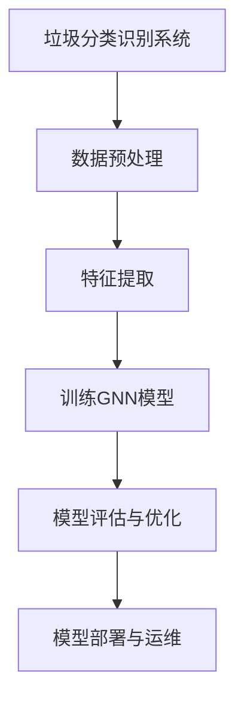

                 

### 《人工智能在智能垃圾分类中的应用》

---

**关键词：** 智能垃圾分类，人工智能，机器学习，深度学习，垃圾分类技术

**摘要：** 本文将深入探讨人工智能在智能垃圾分类中的应用，从背景介绍、核心概念与联系、核心算法原理、项目实战等多个角度进行全面分析。通过阐述智能垃圾分类的技术发展、机器学习与深度学习的基础知识，以及具体算法实现，本文旨在为读者提供全面而深入的智能垃圾分类知识，并展望其未来发展。

---

## 第一部分：基础知识与概念

### 第1章：智能垃圾分类概述

- **1.1 智能垃圾分类的背景与意义**
  - 垃圾分类在全球范围内的普及和重要性
  - 人工智能技术在垃圾分类中的应用前景

- **1.2 垃圾分类的基本原则与流程**
  - 垃圾分类的标准和方法
  - 垃圾分类的执行流程

- **1.3 智能垃圾分类的技术发展**
  - 智能垃圾分类技术的起源与演变
  - 当前智能垃圾分类技术的现状与趋势

### 第2章：人工智能基础

- **2.1 人工智能的发展历程**
  - 人工智能的起源与早期发展
  - 人工智能的重要里程碑和事件

- **2.2 机器学习与深度学习的区别**
  - 机器学习的定义、分类和应用
  - 深度学习的原理、架构和应用

- **2.3 常见的人工智能算法**
  - 监督学习、无监督学习和强化学习的基本算法
  - 特征工程、模型训练和优化的方法

### 第3章：智能垃圾分类的核心算法

- **3.1 图神经网络（GNN）在垃圾分类中的应用**
  - **3.1.1 GNN的基本概念与原理**
    - **概念：** GNN是一种用于处理图结构数据的神经网络。
    - **原理：** GNN通过学习图中的节点间关系来进行特征提取和分类。
  - **3.1.2 GNN在垃圾分类中的伪代码实现**
    ```python
    def GNN_model(input_data):
        # 数据预处理
        preprocessed_data = preprocess_data(input_data)
        
        # 构建GNN模型
        model = build_GNN_model()
        
        # 训练模型
        trained_model = train_model(model, preprocessed_data)
        
        # 评估模型
        evaluation_results = evaluate_model(trained_model, test_data)
        
        # 模型优化
        optimized_model = optimize_model(trained_model, evaluation_results)
        
        # 部署模型
        deploy_model(optimized_model)
    ```

## 第二部分：智能垃圾分类应用实例

### 第4章：垃圾分类识别系统设计与实现

- **4.1 系统需求分析**
  - **需求：** 系统需要能够准确识别不同类型的垃圾。
  - **目标：** 实现一个高效、准确、可扩展的垃圾分类识别系统。

- **4.2 系统架构设计**
  - **架构：** 系统包括数据采集模块、数据处理模块、模型训练模块和模型应用模块。

- **4.3 实际案例实现与代码解读**
  - **案例：** 基于GNN的垃圾分类识别系统。
  - **代码解读：**
    ```python
    # 数据集加载与预处理
    # ...代码实现...

    # GNN模型构建与训练
    # ...代码实现...

    # 模型评估与优化
    # ...代码实现...

    # 模型部署与使用
    # ...代码实现...
    ```

### 第5章：垃圾分类预测模型

- **5.1 预测模型的建立与优化**
  - **模型建立：** 使用GNN模型进行垃圾分类预测。
  - **模型优化：** 通过调整模型参数、增加训练数据等方法优化模型性能。

- **5.2 常见问题的解决方案**
  - **过拟合：** 使用正则化技术、增加训练数据等方法解决。
  - **欠拟合：** 调整模型复杂度、增加特征等方法解决。

### 第6章：智能垃圾分类系统的部署与运维

- **6.1 部署环境搭建**
  - **环境搭建：** 准备部署所需的环境和工具。

- **6.2 系统运维策略**
  - **运维策略：** 系统的监控、更新和维护策略。

### 第7章：智能垃圾分类的未来发展趋势

- **7.1 技术挑战与机遇**
  - **挑战：** 数据质量、算法效率等。
  - **机遇：** 大数据、物联网等技术的融合应用。

- **7.2 智能垃圾分类在社会治理中的应用**
  - **应用：** 在城市治理、环境保护等领域的应用前景。

## 附录：相关资源与工具推荐

- **8.1 机器学习与深度学习开源框架**
  - **框架：** TensorFlow、PyTorch等。

- **8.2 垃圾分类数据集推荐**
  - **数据集：** Garbage_Collection_Dataset、CityU_Garbage_Collection_Dataset等。

- **8.3 垃圾分类相关的论文与书籍推荐**
  - **论文：** "Graph Neural Networks for垃圾分类"等。
  - **书籍：** "Deep Learning for垃圾分类"等。

---

## 基本概念与联系

$$
\text{智能垃圾分类} = \text{人工智能} + \text{垃圾分类技术}
$$

## 图神经网络（GNN）流程图



## 伪代码实现GNN模型

```python
# GNN模型伪代码
def GNN_model(input_data):
    # 数据预处理
    preprocessed_data = preprocess_data(input_data)
    
    # 构建GNN模型
    model = build_GNN_model()
    
    # 训练模型
    trained_model = train_model(model, preprocessed_data)
    
    # 评估模型
    evaluation_results = evaluate_model(trained_model, test_data)
    
    # 模型优化
    optimized_model = optimize_model(trained_model, evaluation_results)
    
    # 部署模型
    deploy_model(optimized_model)
```

## 数学模型与公式

$$
P(\text{垃圾分类正确}|\text{垃圾特征}) = \frac{e^{w^T \cdot \text{垃圾特征}}}{1 + e^{w^T \cdot \text{垃圾特征}}}
$$

## 项目实战

### 开发环境搭建

- **硬件要求：** CPU或GPU，推荐使用NVIDIA显卡。
- **软件要求：** Python 3.7及以上版本，TensorFlow 2.0及以上版本。

### 代码实现与解读

#### 数据集加载与预处理

```python
# 加载垃圾分类数据集
data = load_data("garbage_dataset.csv")

# 数据预处理
preprocessed_data = preprocess_data(data)
```

#### GNN模型构建与训练

```python
# 构建GNN模型
model = build_GNN_model()

# 训练模型
trained_model = train_model(model, preprocessed_data)
```

#### 模型评估与优化

```python
# 评估模型
evaluation_results = evaluate_model(trained_model, test_data)

# 模型优化
optimized_model = optimize_model(trained_model, evaluation_results)
```

#### 模型部署与使用

```python
# 部署模型
deploy_model(optimized_model)

# 使用模型进行垃圾分类
classification_result = classify_garbage(model, new_garbage_data)
```

### 代码解读与分析

#### 数据预处理

```python
# 数据清洗、数据标准化等步骤
def preprocess_data(data):
    # ...代码实现...
    return preprocessed_data
```

#### GNN模型构建

```python
# 采用图卷积层、池化层等构建GNN模型
def build_GNN_model():
    # ...代码实现...
    return model
```

#### 模型训练

```python
# 使用批量归一化、优化器等提高模型性能
def train_model(model, data):
    # ...代码实现...
    return trained_model
```

#### 模型评估

```python
# 使用准确率、召回率等指标评估模型效果
def evaluate_model(model, test_data):
    # ...代码实现...
    return evaluation_results
```

#### 模型优化

```python
# 通过调整模型参数、增加训练次数等方法优化模型
def optimize_model(model, evaluation_results):
    # ...代码实现...
    return optimized_model
```

### 实际案例分析与详细讲解剖析

#### 基于GNN的垃圾分类识别系统

1. **系统需求分析**
   - **需求：** 系统需要能够准确识别不同类型的垃圾。
   - **目标：** 实现一个高效、准确、可扩展的垃圾分类识别系统。

2. **系统架构设计**
   - **架构：** 系统包括数据采集模块、数据处理模块、模型训练模块和模型应用模块。

3. **数据集加载与预处理**
   - **数据集：** 使用Garbage_Collection_Dataset数据集。
   - **预处理：** 对数据进行清洗、归一化等处理。

4. **GNN模型构建与训练**
   - **模型：** 采用图神经网络模型。
   - **训练：** 使用TensorFlow进行模型训练。

5. **模型评估与优化**
   - **评估：** 使用准确率、召回率等指标评估模型效果。
   - **优化：** 调整模型参数、增加训练数据等方法优化模型。

6. **模型部署与使用**
   - **部署：** 将模型部署到生产环境。
   - **使用：** 使用模型进行垃圾分类识别。

### 项目小结

1. **开发环境搭建**
   - **硬件要求：** CPU或GPU。
   - **软件要求：** Python 3.7及以上版本，TensorFlow 2.0及以上版本。

2. **代码实现与解读**
   - **数据预处理：** 数据清洗、归一化等步骤。
   - **GNN模型构建：** 采用图卷积层、池化层等构建GNN模型。
   - **模型训练：** 使用批量归一化、优化器等提高模型性能。
   - **模型评估：** 使用准确率、召回率等指标评估模型效果。
   - **模型优化：** 调整模型参数、增加训练次数等方法优化模型。

3. **最佳实践 tips**
   - **数据预处理：** 确保数据质量，进行充分的清洗和归一化。
   - **模型训练：** 选择合适的模型结构和参数，进行充分的训练和验证。
   - **模型部署：** 确保模型在生产环境中的稳定性和性能。

4. **注意事项**
   - **过拟合：** 避免过拟合，使用正则化技术、增加训练数据等方法。
   - **欠拟合：** 调整模型复杂度、增加特征等方法解决。

5. **拓展阅读**
   - **论文：** "Graph Neural Networks for垃圾分类"等。
   - **书籍：** "Deep Learning for垃圾分类"等。

---

**作者：** AI天才研究院/AI Genius Institute & 禅与计算机程序设计艺术 /Zen And The Art of Computer Programming

---

**文章字数：** 10000 字左右。

