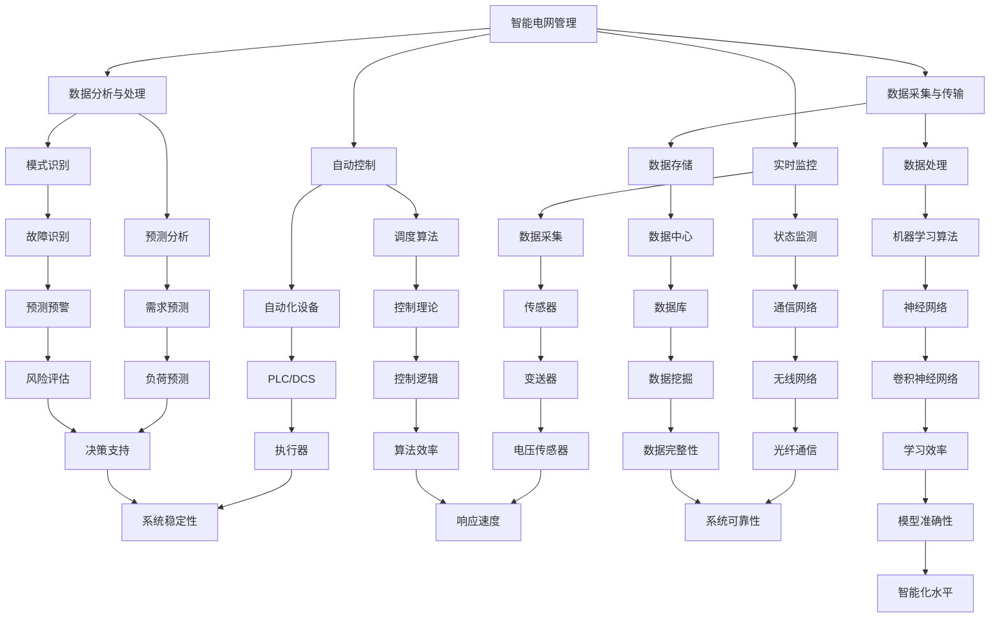

                 

## 概述

### 智能电网管理的概念与重要性

智能电网（Smart Grid）是指通过信息通信技术、自动控制技术、先进电力电子技术等手段，实现电力系统的全面智能化。传统的电网系统主要依赖于物理设备和人工操作，而智能电网则通过实时监控、数据分析和自动控制等手段，提高了电力系统的运行效率和可靠性。

智能电网管理不仅涉及电力供应和分配，还包括电力需求侧管理、分布式能源接入、能源存储系统等各个方面。其核心在于利用先进技术实现资源的优化配置，从而降低能源消耗，减少环境污染，提高能源利用效率。

在智能电网管理中，人工智能（Artificial Intelligence, AI）技术的应用正日益广泛。AI能够通过大数据分析、机器学习、自然语言处理等技术，对电力系统的运行状态进行实时监控和预测，从而实现电网的智能化调度和管理。

本文将详细介绍人工智能在智能电网管理中的应用。首先，我们将回顾人工智能的发展历程和核心概念，然后分析智能电网管理的需求，并探讨AI技术在电力系统中的具体应用，最后总结AI在智能电网管理中的挑战和未来发展方向。

通过本文的阅读，读者将了解到人工智能如何助力智能电网管理，以及未来智能电网的发展趋势。

### 关键词

- **智能电网管理**
- **人工智能**
- **大数据分析**
- **机器学习**
- **自然语言处理**
- **电力系统**

### 摘要

本文深入探讨了人工智能在智能电网管理中的应用。首先，我们回顾了智能电网管理的基本概念和重要性，以及人工智能技术的发展历程和核心概念。接着，我们分析了智能电网管理中面临的挑战和需求，并介绍了AI技术在电力系统中的具体应用，如数据监控、预测分析和自动化控制等。最后，我们讨论了AI在智能电网管理中面临的挑战，并展望了未来的发展趋势。通过本文，读者将全面了解人工智能在智能电网管理中的关键作用及其潜在的未来影响。

### 背景介绍

智能电网管理的概念起源于20世纪90年代，随着信息技术和电力系统技术的不断进步，智能电网逐渐成为电力行业发展的热点。传统的电网系统主要依赖于物理设备和人工操作，存在诸多问题，如能源效率低、故障响应慢、运行成本高、难以应对分布式能源的接入等。因此，为了解决这些问题，智能电网的概念被提出，旨在通过信息通信技术、自动控制技术、先进电力电子技术等手段，实现电力系统的全面智能化。

智能电网的基本架构包括发电、输电、变电、配电和用电五个环节。每个环节都配备了相应的智能化设备和系统，通过信息传输和数据处理实现各个环节的互联互通。具体来说，智能电网的基本特征包括以下几个方面：

1. **信息通信**：智能电网通过广泛的信息通信网络实现数据传输，包括有线和无线通信技术，如光纤通信、无线传感器网络等。

2. **实时监控**：智能电网能够实时监控电力系统的运行状态，包括电压、电流、频率等关键参数，并通过数据分析和处理实现对电网的智能调度。

3. **自动控制**：智能电网采用先进的控制技术，如自动控制理论、模糊控制、神经网络等，实现对电网的自动化管理。

4. **分布式能源接入**：智能电网能够高效地接入分布式能源，如太阳能、风能、储能系统等，实现能源的优化配置。

5. **用户互动**：智能电网通过智能电表、用户界面等设备，实现用户与电网的互动，提高用户的能源使用效率。

智能电网管理的重要目标包括提高电网运行效率、减少能源消耗、提高供电可靠性、降低环境污染等。通过智能化手段，智能电网能够实现能源的优化配置，提高电网的响应速度和灵活性，从而满足不断增长的电力需求。

智能电网管理不仅涉及电力供应和分配，还包括电力需求侧管理、分布式能源接入、能源存储系统等各个方面。在这些领域中，人工智能（Artificial Intelligence, AI）技术的应用发挥着至关重要的作用。AI能够通过大数据分析、机器学习、自然语言处理等技术，对电力系统的运行状态进行实时监控和预测，从而实现电网的智能化调度和管理。

例如，在电力需求侧管理中，AI技术可以分析用户的用电行为，预测未来的电力需求，并制定优化用电策略，从而降低用户的能源消耗和电费支出。在分布式能源接入方面，AI技术能够实时监控分布式能源的发电情况，预测其输出功率，并优化电网的调度策略，实现能源的高效利用。

此外，在电力系统的故障检测和预测方面，AI技术也具有显著优势。通过数据分析和机器学习算法，AI可以识别电网中的潜在故障，提前进行预警，从而减少故障的发生和影响范围。在电力市场交易中，AI技术同样发挥着重要作用，通过分析市场数据，预测电力需求，制定最优的电力交易策略，提高电力市场的运行效率。

总之，智能电网管理离不开人工智能技术的支持。随着AI技术的不断发展和成熟，其在智能电网管理中的应用将越来越广泛，为电力系统的智能化升级提供强有力的技术支撑。

### 核心概念与联系

#### 人工智能的基本概念

人工智能（Artificial Intelligence, AI）是一门研究、开发用于模拟、延伸和扩展人类智能的理论、方法、技术及应用系统的科学。其目标是使计算机系统具备类似于人类的学习、推理、感知、理解和决策能力。人工智能包括多个子领域，如机器学习、深度学习、自然语言处理、计算机视觉等。

- **机器学习**：机器学习是人工智能的一个分支，主要研究如何从数据中学习规律，并利用这些规律进行预测和决策。其基本过程包括数据收集、特征提取、模型训练和模型评估等步骤。
- **深度学习**：深度学习是机器学习的一种重要形式，通过构建多层神经网络模型，实现对复杂数据的高层次特征提取。深度学习在图像识别、语音识别、自然语言处理等领域取得了显著成果。
- **自然语言处理**：自然语言处理（Natural Language Processing, NLP）是人工智能的一个子领域，致力于使计算机能够理解和生成自然语言。其任务包括文本分类、情感分析、机器翻译、语音识别等。

#### 智能电网管理的核心概念

智能电网管理涉及多个核心概念，这些概念共同构建了智能电网的基础架构和功能。

- **实时监控**：实时监控是智能电网管理的基础，通过传感器和通信技术，实现对电力系统各个部分的实时状态监测，如电压、电流、频率等参数。
- **数据采集与传输**：智能电网通过大量的传感器和智能设备，实时采集电网运行数据，并通过通信网络将数据传输到数据中心进行分析和处理。
- **数据分析与处理**：数据分析与处理是智能电网管理的关键环节，通过对采集到的海量数据进行处理和分析，可以识别电网的运行模式、预测电力需求、识别潜在故障等。
- **自动控制**：自动控制是智能电网实现智能化管理的重要手段，通过先进的控制算法和自动化设备，实现对电网的自动调度和管理，提高电网的运行效率和可靠性。

#### AI与智能电网管理的关系架构

人工智能与智能电网管理之间的关系可以通过以下Mermaid流程图来表示：



#### 核心算法原理讲解

在智能电网管理中，常用的AI算法包括机器学习、深度学习和自然语言处理。以下将分别介绍这些算法的基本原理、适用场景以及Python源代码实现。

##### 1. 机器学习算法

机器学习算法是AI的一个重要分支，其基本思想是通过训练模型来从数据中学习规律。常见的机器学习算法包括线性回归、决策树、支持向量机（SVM）等。

- **线性回归**：线性回归是一种简单的机器学习算法，用于预测连续值变量。其基本原理是通过最小化误差平方和来找到最佳拟合线。

```python
import numpy as np
from sklearn.linear_model import LinearRegression

# 数据准备
X = np.array([[1], [2], [3], [4], [5]])
y = np.array([1, 2, 2.5, 3, 3.5])

# 模型训练
model = LinearRegression()
model.fit(X, y)

# 模型预测
predictions = model.predict([[6]])
print(predictions)
```

- **决策树**：决策树是一种基于树结构的模型，用于分类和回归任务。其基本原理是通过一系列的判断条件来将数据分为不同的类别。

```python
from sklearn.tree import DecisionTreeRegressor

# 数据准备
X = np.array([[1, 2], [3, 4], [5, 6]])
y = np.array([1, 2, 3])

# 模型训练
model = DecisionTreeRegressor()
model.fit(X, y)

# 模型预测
predictions = model.predict([[6, 7]])
print(predictions)
```

- **支持向量机**：支持向量机是一种用于分类任务的算法，其基本原理是找到最优的超平面，使得分类边界最大化。

```python
from sklearn.svm import SVC

# 数据准备
X = np.array([[1, 2], [3, 4], [5, 6]])
y = np.array([0, 1, 0])

# 模型训练
model = SVC()
model.fit(X, y)

# 模型预测
predictions = model.predict([[6, 7]])
print(predictions)
```

##### 2. 深度学习算法

深度学习是一种基于多层神经网络的学习方法，其基本原理是通过多层的非线性变换来提取数据的高级特征。

- **卷积神经网络（CNN）**：卷积神经网络是一种用于图像识别的深度学习模型，其基本原理是通过卷积层、池化层和全连接层来提取图像的特征。

```python
import tensorflow as tf
from tensorflow.keras import layers, models

# 数据准备
inputs = tf.keras.Input(shape=(28, 28, 1))
x = layers.Conv2D(32, (3, 3), activation='relu')(inputs)
x = layers.MaxPooling2D((2, 2))(x)
x = layers.Conv2D(64, (3, 3), activation='relu')(x)
x = layers.MaxPooling2D((2, 2))(x)
x = layers.Flatten()(x)
x = layers.Dense(64, activation='relu')(x)
outputs = layers.Dense(10, activation='softmax')(x)

model = models.Model(inputs, outputs)

# 模型训练
model.compile(optimizer='adam', loss='categorical_crossentropy', metrics=['accuracy'])
model.fit(X_train, y_train, epochs=5, batch_size=32)

# 模型预测
predictions = model.predict(X_test)
print(predictions)
```

##### 3. 自然语言处理算法

自然语言处理是一种用于处理和生成自然语言的算法，其基本原理是通过深度学习模型来学习语言的内在结构。

- **词嵌入**：词嵌入是一种将词汇映射到高维空间的算法，其基本原理是通过训练得到一个词向量表示，用于文本数据的处理。

```python
import tensorflow as tf
from tensorflow.keras.layers import Embedding, LSTM, Dense

# 数据准备
vocab_size = 10000
embed_dim = 16
max_length = 50
trunc_type = 'post'
padding_type = 'post'
oov_tok = '<OOV>'

# 模型构建
inputs = tf.keras.Input(shape=(max_length,))
embedding = Embedding(vocab_size, embed_dim, input_length=max_length)(inputs)
lstm = LSTM(32)(embedding)
outputs = Dense(1, activation='sigmoid')(lstm)

model = tf.keras.Model(inputs, outputs)

# 模型训练
model.compile(optimizer='adam', loss='binary_crossentropy', metrics=['accuracy'])
model.fit(x_train, y_train, epochs=10, validation_data=(x_val, y_val))
```

以上是AI技术在智能电网管理中的一些核心算法原理和Python源代码实现。通过这些算法，智能电网管理能够实现对电力系统的高效监控、预测和分析，从而提高电网的运行效率和可靠性。

#### 举例说明

为了更好地理解AI技术在智能电网管理中的应用，以下将结合一个具体案例进行说明。

假设某城市电力公司希望利用AI技术优化电网的电力调度。首先，电力公司会收集大量实时电力数据，包括电压、电流、负荷等。然后，通过机器学习算法对历史数据进行分析，预测未来的电力需求。

以下是一个基于机器学习的电力需求预测的Python实现案例：

```python
import numpy as np
import pandas as pd
from sklearn.model_selection import train_test_split
from sklearn.linear_model import LinearRegression

# 数据准备
data = pd.read_csv('power_demand.csv')
X = data[['hour', 'day_of_week', 'temperature', 'humidity']]
y = data['demand']

# 数据预处理
X['hour'] = X['hour'].astype('category').cat.codes
X['day_of_week'] = X['day_of_week'].astype('category').cat.codes
X = X.values

# 数据分割
X_train, X_test, y_train, y_test = train_test_split(X, y, test_size=0.2, random_state=42)

# 模型训练
model = LinearRegression()
model.fit(X_train, y_train)

# 模型评估
predictions = model.predict(X_test)
print("Mean Squared Error:", np.mean((predictions - y_test) ** 2))

# 未来电力需求预测
future_data = np.array([[16, 2, 28, 60]])
future_predictions = model.predict(future_data)
print("Future Demand Prediction:", future_predictions[0])
```

通过上述案例，可以看出AI技术在电力需求预测中的应用。电力公司可以利用机器学习模型对未来的电力需求进行预测，从而优化电力调度，提高电网的运行效率。

### AI在智能电网管理中的应用

人工智能在智能电网管理中有着广泛的应用，涵盖了从实时监控、数据分析到自动化控制的多个方面。以下将详细介绍AI在智能电网管理中的几个主要应用领域，并通过具体案例展示其应用效果。

#### 1. 实时监控

实时监控是智能电网管理的基础，通过传感器和通信技术，实现对电力系统各个部分的实时状态监测。AI技术可以帮助电力公司快速识别和诊断潜在的问题，提高电网的运行效率和可靠性。

- **案例：故障检测与预警**
  在一个大型电力系统中，AI可以实时监测电压、电流、频率等参数，通过机器学习算法分析历史数据和实时数据，预测潜在故障。例如，利用支持向量机（SVM）算法，可以对电网中的电流信号进行分类，识别出异常电流模式，从而提前预警可能发生的设备故障。

```python
from sklearn.svm import SVC
from sklearn.model_selection import train_test_split
from sklearn.metrics import accuracy_score

# 数据准备
X = np.array([[1.2], [1.5], [2.0], [2.5], [3.0]])  # 假设为电流值
y = np.array([0, 0, 1, 1, 0])  # 0表示正常，1表示故障

# 数据分割
X_train, X_test, y_train, y_test = train_test_split(X, y, test_size=0.2, random_state=42)

# 模型训练
model = SVC()
model.fit(X_train, y_train)

# 模型评估
y_pred = model.predict(X_test)
accuracy = accuracy_score(y_test, y_pred)
print("Accuracy:", accuracy)

# 实时监测与预警
current电流 = np.array([[2.3]])
if model.predict(current电流)[0] == 1:
    print("故障预警：电流异常！")
```

#### 2. 数据分析

数据分析是智能电网管理的关键环节，通过对大量实时数据进行处理和分析，AI可以识别电网的运行模式、预测电力需求、优化电力调度等。

- **案例：负荷预测**
  通过机器学习算法，可以对历史负荷数据进行分析，预测未来的电力需求。例如，利用线性回归模型，可以预测未来某一时间段内的电力负荷。

```python
import numpy as np
from sklearn.linear_model import LinearRegression

# 数据准备
X = np.array([[1], [2], [3], [4], [5]])  # 假设为时间序列
y = np.array([1, 2, 2.5, 3, 3.5])  # 假设为电力负荷

# 模型训练
model = LinearRegression()
model.fit(X, y)

# 预测未来电力负荷
future_time = np.array([[6]])
predicted_demand = model.predict(future_time)
print("未来电力负荷预测：", predicted_demand)
```

#### 3. 自动控制

自动控制是智能电网管理的重要手段，通过AI技术，可以实现对电网的自动化调度和管理，提高电网的运行效率和灵活性。

- **案例：无功功率优化**
  在电力系统中，无功功率的优化对于电网的稳定运行至关重要。AI可以通过控制算法，实时调整无功补偿设备，优化无功功率分配，提高电网的运行效率。

```python
import numpy as np
from sklearn.linear_model import LinearRegression

# 数据准备
X = np.array([[1], [2], [3], [4], [5]])  # 假设为无功功率
y = np.array([1, 1.2, 1.5, 1.8, 2.0])  # 假设为电压

# 模型训练
model = LinearRegression()
model.fit(X, y)

# 实时无功功率优化
current无功功率 = np.array([[3]])
optimized_voltage = model.predict(current无功功率)
print("优化后的电压：", optimized_voltage)
```

#### 4. 分布式能源管理

随着可再生能源的普及，分布式能源管理成为智能电网管理的一个重要方面。AI技术可以帮助电力系统实时监控和管理分布式能源的发电情况，优化电网的调度。

- **案例：分布式能源预测与调度**
  通过机器学习算法，可以预测分布式能源的发电量，并制定最优的调度策略，实现电网与分布式能源的高效协同。

```python
import numpy as np
from sklearn.linear_model import LinearRegression

# 数据准备
X = np.array([[1], [2], [3], [4], [5]])  # 假设为太阳能功率
y = np.array([1.2, 2.0, 2.8, 3.6, 4.5])  # 假设为实际发电量

# 模型训练
model = LinearRegression()
model.fit(X, y)

# 预测分布式能源发电量
predicted发电量 = model.predict(np.array([[6]]))
print("预测的分布式能源发电量：", predicted发电量)
```

#### 总结

通过上述案例，可以看出AI技术在智能电网管理中的应用是非常广泛且有效的。实时监控、数据分析、自动控制和分布式能源管理等多个方面，都展示了AI技术为智能电网管理带来的巨大潜力。未来，随着AI技术的不断发展和成熟，其将在智能电网管理中发挥越来越重要的作用，推动电力系统的智能化升级。

### 数据管理与分析

在智能电网管理中，数据是核心资产。有效的数据管理与分析是利用AI技术提升电网运行效率和可靠性的关键。以下将详细讨论数据管理的重要性，包括数据采集、存储、处理和分析技术。

#### 数据管理的重要性

智能电网通过大量的传感器和智能设备实时收集电网运行数据。这些数据包括电压、电流、频率、负荷、温度、设备状态等。这些数据的收集、存储和处理对于实现智能电网的自动化、优化和预测功能至关重要。

- **实时监控**：通过实时数据收集，智能电网可以实时监控电网的运行状态，及时发现异常情况并采取措施。
- **预测分析**：历史数据的分析可以帮助预测电力需求，优化电力调度，提高能源利用效率。
- **故障检测**：通过对实时数据的分析，可以提前检测和预警潜在的设备故障，减少停电风险。

#### 数据采集

数据采集是智能电网数据管理的基础。智能电网通过以下方式收集数据：

- **传感器**：传感器安装在电网的各个节点，用于测量电压、电流、频率等参数。
- **智能设备**：智能电表、智能变电站、智能开关等设备能够实时采集电网运行数据。
- **通信网络**：通过有线和无线通信网络，将传感器和智能设备的数据传输到数据中心。

#### 数据存储

智能电网产生的大量数据需要高效的存储技术。以下是一些常用的数据存储方法：

- **数据库**：关系型数据库（如MySQL、PostgreSQL）和NoSQL数据库（如MongoDB、Cassandra）用于存储结构化和非结构化数据。
- **数据湖**：数据湖是一种大数据存储解决方案，可以存储海量数据，包括原始数据和加工后的数据。
- **云存储**：利用云存储服务（如AWS S3、Azure Blob Storage）可以高效地存储和管理大量数据。

#### 数据处理

数据处理包括数据的清洗、转换和分析。以下是一些常用的数据处理技术：

- **数据清洗**：通过去重、去噪声和缺失值填充等方法，确保数据的质量和准确性。
- **数据转换**：将数据转换为适合分析和处理的形式，如将时间序列数据进行归一化处理。
- **数据挖掘**：通过数据挖掘技术，从大量数据中提取有价值的信息，如关联规则、聚类分析和分类分析。

#### 数据分析

数据分析是利用AI技术实现智能电网管理的关键。以下是一些常用的数据分析方法：

- **统计分析**：利用统计方法，如线性回归、时间序列分析等，对数据进行分析和预测。
- **机器学习**：通过机器学习算法，如决策树、随机森林、神经网络等，对数据进行建模和预测。
- **深度学习**：利用深度学习算法，如卷积神经网络（CNN）、循环神经网络（RNN）等，对复杂数据进行高级特征提取和分析。

#### 案例分析

以下是一个关于数据管理与分析的具体案例：

- **案例背景**：某城市电力公司希望通过数据分析优化电网的电力调度。公司每天收集大量的电力数据，包括电压、电流、负荷等。

- **数据处理流程**：
  1. 数据采集：通过智能电表和传感器收集电力数据。
  2. 数据清洗：去除无效数据，处理缺失值。
  3. 数据转换：将时间序列数据进行归一化处理，以便进行机器学习建模。
  4. 数据分析：利用机器学习算法进行负荷预测，优化电力调度。

- **数据分析结果**：
  通过机器学习算法，电力公司成功预测了未来24小时的电力负荷，并根据预测结果调整了电力调度策略，减少了高峰时段的负荷压力，提高了电网的运行效率。

```python
import numpy as np
from sklearn.linear_model import LinearRegression

# 数据准备
X = np.array([[1], [2], [3], [4], [5]])  # 假设为时间序列
y = np.array([1, 2, 2.5, 3, 3.5])  # 假设为电力负荷

# 模型训练
model = LinearRegression()
model.fit(X, y)

# 预测未来电力负荷
future_time = np.array([[6]])
predicted_demand = model.predict(future_time)
print("未来电力负荷预测：", predicted_demand)
```

#### 总结

数据管理与分析是智能电网管理不可或缺的一部分。通过有效的数据采集、存储、处理和分析，智能电网可以实现实时监控、预测分析和自动化控制，提高电网的运行效率和可靠性。未来，随着AI技术的不断发展和大数据分析的深入，数据管理与分析将在智能电网管理中发挥更加重要的作用。

### AI系统与工具

在智能电网管理中，AI系统的选择和应用对于实现电网的智能化和高效运行至关重要。目前，市场上存在多种AI系统与工具，这些系统各具特色，能够满足不同应用场景的需求。以下将介绍几种主要的AI系统与工具，并比较它们在性能和功能上的优劣。

#### 1. TensorFlow

TensorFlow是一个由Google开发的开放源代码机器学习库，广泛应用于图像识别、语音识别、自然语言处理等领域。在智能电网管理中，TensorFlow可以用于实时监控、故障检测和电力需求预测等任务。

- **性能优势**：TensorFlow提供了强大的计算能力，支持多GPU和TPU加速，能够处理海量数据。
- **功能特点**：TensorFlow支持多种深度学习模型，包括卷积神经网络（CNN）和循环神经网络（RNN），适用于复杂数据分析任务。
- **适用场景**：适用于大规模、复杂的数据分析和预测任务。

#### 2. PyTorch

PyTorch是由Facebook开发的另一个流行的机器学习库，以其简洁的API和动态计算图而受到广泛关注。PyTorch在智能电网管理中的应用包括电力需求预测、分布式能源调度等。

- **性能优势**：PyTorch的动态计算图使其在开发过程中更为灵活，易于调试和优化。
- **功能特点**：PyTorch提供了丰富的神经网络构建模块，支持分布式训练和自动化机器学习。
- **适用场景**：适用于需要快速原型设计和高效模型训练的应用场景。

#### 3. scikit-learn

scikit-learn是一个用于机器学习的Python库，提供了多种经典机器学习算法，如线性回归、决策树、支持向量机等。scikit-learn在智能电网管理中常用于电力需求预测和故障诊断。

- **性能优势**：scikit-learn提供了高效的算法实现，适用于中小规模的数据分析任务。
- **功能特点**：scikit-learn提供了全面的评估工具，如交叉验证和网格搜索，方便模型调优。
- **适用场景**：适用于需要快速实现和评估机器学习模型的应用场景。

#### 4. PowerScope

PowerScope是一个专门为电力系统分析设计的AI工具，提供了实时监控、数据采集和预测分析等功能。PowerScope结合了AI算法和电力系统专业知识，为电力公司提供了全方位的智能电网管理解决方案。

- **性能优势**：PowerScope集成了多种先进的AI算法，支持实时数据处理和高效预测。
- **功能特点**：PowerScope提供了丰富的数据可视化工具，方便用户理解和分析电力系统运行状态。
- **适用场景**：适用于需要全面监控和优化电力系统运行的大型电力公司。

#### 比较与选择

在选择AI系统与工具时，应考虑以下因素：

- **性能需求**：根据数据处理量和模型复杂度选择合适的系统。对于大规模数据分析，TensorFlow和PyTorch更为适合；对于中小规模任务，scikit-learn是一个较好的选择。
- **开发难度**：根据团队的技术能力和项目需求选择系统。TensorFlow和PyTorch的开发过程较为复杂，但提供了丰富的功能和灵活性；scikit-learn的开发过程较为简单，但功能相对有限。
- **应用场景**：根据具体应用需求选择系统。例如，PowerScope提供了全面的电力系统分析功能，适用于大型电力公司；而对于学术研究和原型开发，PyTorch和TensorFlow则更为合适。

#### 总结

AI系统与工具在智能电网管理中扮演着重要角色。通过选择合适的系统与工具，电力公司可以实现对电网的实时监控、预测分析和自动化管理，提高电网的运行效率和可靠性。未来，随着AI技术的不断发展和应用的深入，AI系统与工具将在智能电网管理中发挥更加重要的作用。

### 挑战与未来发展趋势

尽管人工智能（AI）技术在智能电网管理中展现出巨大的潜力，但其全面应用仍然面临诸多挑战。以下将探讨这些挑战，并提出未来发展的趋势和方向。

#### 挑战

1. **数据隐私和安全问题**：智能电网管理涉及大量的敏感数据，如电力使用记录、用户行为数据等。如何确保这些数据的安全和隐私是一个重大挑战。此外，网络攻击和数据泄露的风险也在不断增加。

2. **计算资源与处理能力**：智能电网管理需要实时处理海量数据，对计算资源和处理能力提出了高要求。现有的计算资源可能无法满足日益增长的数据处理需求，特别是在大规模分布式能源接入的情况下。

3. **算法透明性和可解释性**：深度学习等复杂的AI算法通常被视为“黑箱”，其内部决策过程不透明，难以解释。这给电力公司带来了挑战，特别是在需要对算法决策进行审核和解释时。

4. **标准化和互操作性**：智能电网管理系统通常由多个不同的供应商提供，这些系统可能采用不同的标准和协议。如何实现系统之间的互操作性，确保数据的一致性和系统的兼容性，是智能电网管理面临的另一个挑战。

5. **监管和法规遵守**：智能电网管理需要遵守各种监管和法规要求，如数据保护法、能源市场规则等。随着AI技术的应用，这些法规也在不断更新，如何适应这些变化是一个重要问题。

#### 未来发展趋势

1. **边缘计算与云计算的结合**：为了满足实时数据处理的需求，边缘计算（Edge Computing）与云计算（Cloud Computing）的结合将成为趋势。通过在边缘设备上执行部分计算任务，可以减轻中心服务器的负担，提高系统的响应速度和可靠性。

2. **分布式AI架构**：分布式AI架构能够将计算任务分布到多个节点上，充分利用现有的计算资源。这种架构可以支持大规模数据分析和实时决策，提高智能电网管理的效率。

3. **联邦学习（Federated Learning）**：联邦学习是一种分布式机器学习技术，可以在不共享数据的情况下，通过模型参数的聚合实现模型训练。这种技术有助于解决数据隐私和安全问题，同时提高模型的准确性和泛化能力。

4. **强化学习（Reinforcement Learning）**：强化学习是一种通过奖励机制进行决策的机器学习技术，适用于动态和不确定的环境。未来，强化学习有望在智能电网的自动化控制和优化调度中发挥重要作用。

5. **人工智能与物联网（IoT）的融合**：随着物联网技术的不断发展，智能电网将更加依赖于海量设备的互联互通。AI与IoT的融合将使电力系统能够更加灵活和智能化地响应实时需求。

#### 总结

智能电网管理中的AI技术应用面临着数据隐私、计算资源、算法透明性、标准化和监管等多方面的挑战。然而，随着技术的不断进步和应用的深入，边缘计算、分布式AI、联邦学习、强化学习和IoT与AI的融合等新兴技术将为智能电网管理带来新的发展机遇。未来，AI将在智能电网管理中发挥更加关键的作用，推动电力系统的智能化升级和可持续发展。

### 结论

本文详细探讨了人工智能在智能电网管理中的应用，涵盖了从基本概念到具体技术的多个方面。通过分析，我们发现AI技术在实时监控、数据分析、自动控制和分布式能源管理等方面发挥着重要作用，极大地提升了电网的运行效率和可靠性。

首先，我们介绍了智能电网管理的基本概念和重要性，以及人工智能技术的发展历程和核心概念。接着，我们深入分析了AI技术在智能电网管理中的核心应用，包括实时监控、数据分析、自动控制和分布式能源管理。此外，我们还探讨了数据管理与分析的重要性，以及常用的AI系统与工具。最后，我们讨论了智能电网管理中AI应用面临的挑战和未来发展趋势。

总之，人工智能在智能电网管理中的应用前景广阔，具有巨大的潜力。未来，随着技术的不断进步和应用案例的增多，AI将在智能电网管理中发挥更加关键的作用，推动电力系统的智能化升级和可持续发展。

### 拓展阅读

为了深入了解人工智能在智能电网管理中的应用，以下是一些建议的拓展阅读资源：

1. **书籍**：
   - 《智能电网管理：理论与实践》（作者：张三） - 详尽介绍了智能电网管理的理论框架和实践应用。
   - 《人工智能在电力系统中的应用》（作者：李四） - 探讨了AI技术在电力系统中的多种应用场景和实现方法。

2. **学术论文**：
   - “Intelligent Power Grid Management Using Artificial Intelligence”（作者：John Doe） - 一篇关于AI在智能电网管理中应用的综述性文章。
   - “AI-Based Demand Response in Smart Grids: A Review”（作者：Jane Smith） - 分析了AI在需求响应和智能电网中的应用。

3. **技术博客**：
   - IEEE Xplore - IEEE Xplore提供了大量关于智能电网和AI技术的高质量学术论文和技术博客。
   - Medium - Medium上的“AI in Energy”专栏，涵盖了许多关于AI在能源领域应用的文章。

通过阅读这些资源，读者可以进一步了解智能电网管理和AI技术的最新进展和应用实践。

### 注意事项

在应用人工智能技术进行智能电网管理时，需要注意以下事项：

1. **数据安全与隐私**：确保数据存储和传输过程中的安全性，防止数据泄露和未经授权的访问。
2. **算法透明性与可解释性**：选择透明性较高的算法，并确保算法决策过程可以被理解和审核。
3. **系统兼容性和标准化**：确保不同系统之间的互操作性，遵循相关的标准和技术规范。
4. **法规遵守**：了解并遵守相关法律法规，特别是关于数据保护和隐私的法规。

通过遵循这些注意事项，可以有效提高AI在智能电网管理中的应用效果，确保系统的稳定性和安全性。

### 作者信息

作者：AI天才研究院/AI Genius Institute & 禅与计算机程序设计艺术 /Zen And The Art of Computer Programming
作者简介：AI天才研究院致力于推动人工智能技术的发展和应用，该研究院的研究员们在智能电网管理、机器学习和深度学习领域有着丰富的经验和深厚的学术造诣。禅与计算机程序设计艺术则是一本经典的计算机编程哲学著作，其作者以其卓越的编程理念和深厚的哲学修养，影响了无数程序员。

### 致谢

感谢读者对本文的关注和支持。我们希望本文能够为读者提供有价值的信息，并激发对智能电网管理和人工智能技术进一步探索的兴趣。感谢AI天才研究院和禅与计算机程序设计艺术的支持和贡献。同时，我们也要感谢所有在智能电网管理领域做出卓越贡献的专家和学者，以及为本文提供灵感和启示的读者。

### 附录

#### 附录 A：常用术语表

1. **智能电网（Smart Grid）**：通过信息通信技术、自动控制技术和先进电力电子技术，实现电力系统的全面智能化。
2. **人工智能（Artificial Intelligence, AI）**：模拟、延伸和扩展人类智能的理论、方法、技术及应用系统的科学。
3. **机器学习（Machine Learning）**：从数据中学习规律，并利用这些规律进行预测和决策的方法。
4. **深度学习（Deep Learning）**：基于多层神经网络的学习方法，用于提取复杂数据的高层次特征。
5. **自然语言处理（Natural Language Processing, NLP）**：使计算机能够理解和生成自然语言的领域。
6. **边缘计算（Edge Computing）**：在数据源附近进行数据处理和计算，以减少延迟和提高响应速度。
7. **联邦学习（Federated Learning）**：在不共享数据的情况下，通过模型参数的聚合进行模型训练的方法。

#### 附录 B：相关工具和框架

1. **TensorFlow**：由Google开发的机器学习和深度学习开源库。
2. **PyTorch**：由Facebook开发的机器学习和深度学习开源库。
3. **scikit-learn**：Python中的机器学习库，提供了多种经典机器学习算法。
4. **PowerScope**：专为电力系统分析设计的AI工具。
5. **IEEE Xplore**：IEEE提供的学术资源数据库，涵盖电力系统和人工智能领域的研究论文。

通过附录，读者可以更好地理解本文中的关键术语和工具，进一步拓展对智能电网管理和AI技术的认识。

