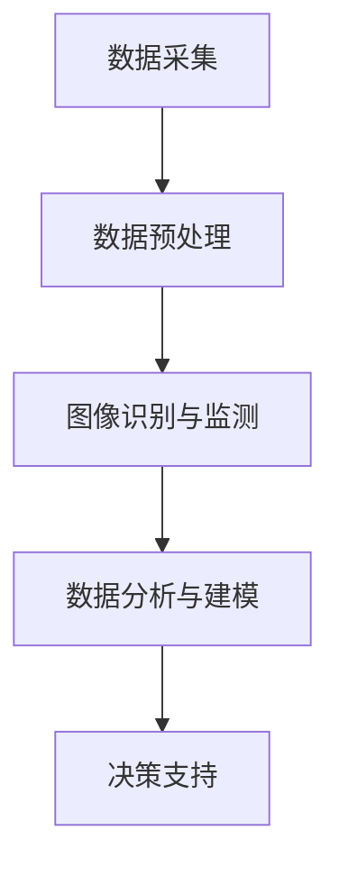
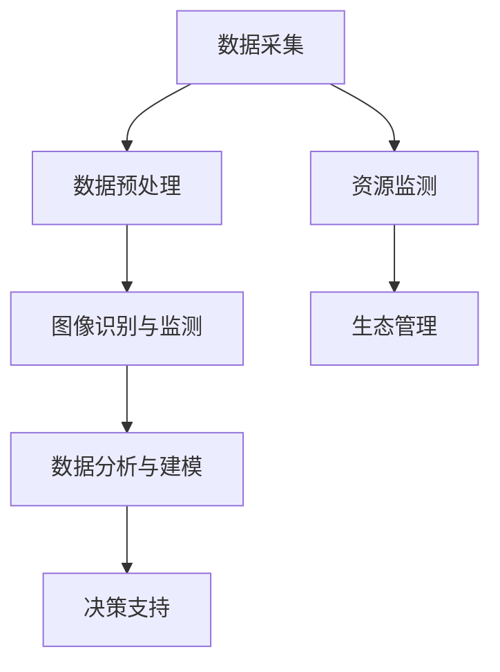
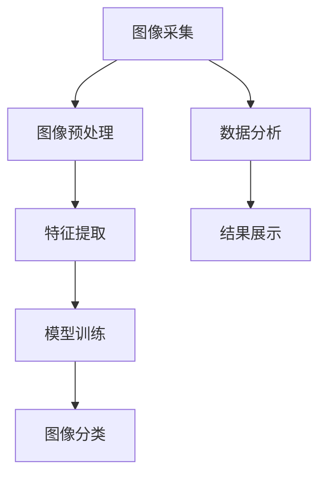

                 

### 文章标题

《人工智能在森林管理中的应用》

### 文章关键词

人工智能、森林管理、机器学习、数据分析、图像识别

### 文章摘要

本文将深入探讨人工智能在森林管理中的应用，通过阐述核心概念、介绍关键技术、解析算法原理、展示项目实战，全面解析人工智能如何助力森林资源保护和管理。文章还将总结当前应用成果，展望未来发展，并提出相关建议，以期为相关领域的研究者与实践者提供有价值的参考。

---

## 目录

1. **背景介绍**  
    1.1 人工智能与森林管理的结合背景  
    1.2 森林管理面临的挑战与机遇

2. **核心概念与联系**  
    2.1 人工智能基本概念  
    2.2 森林管理中的关键问题  
    2.3 人工智能在森林管理中的联系与架构

3. **机器学习与深度学习基础**  
    3.1 机器学习算法概述  
    3.2 深度学习算法原理  
    3.3 应用在森林管理中的算法架构

4. **图像识别与监测技术**  
    4.1 图像识别技术基础  
    4.2 森林火灾监测方法  
    4.3 森林资源监测技术

5. **人工智能在森林火灾预警中的应用**  
    5.1 森林火灾预警系统设计  
    5.2 火灾预警算法与模型训练  
    5.3 火灾预警系统部署与优化

6. **人工智能在森林资源监测中的应用**  
    6.1 森林资源监测系统设计  
    6.2 监测数据处理与分析  
    6.3 监测系统结果展示与应用

7. **人工智能在森林生态管理中的应用**  
    7.1 森林生态管理概述  
    7.2 生态管理模型设计与实现  
    7.3 生态管理模型应用与优化

8. **总结与展望**  
    8.1 人工智能在森林管理中的应用总结  
    8.2 未来发展趋势与挑战  
    8.3 应对策略与建议

9. **附录**  
    9.1 Mermaid流程图与数学模型  
    9.2 伪代码与数学公式解析  
    9.3 项目实战代码解读与分析  
    9.4 开发环境搭建与工具配置  
    9.5 参考文献

---

### 第一部分：背景介绍

#### 1.1 人工智能与森林管理的结合背景

人工智能（AI）作为计算机科学的一个分支，通过模拟人类智能行为，使计算机能够执行复杂的任务。森林管理，作为生态环境保护的重要组成部分，关乎自然资源保护、生物多样性维持以及人类福祉。随着人工智能技术的不断发展，两者之间的结合日益紧密，为森林管理带来了前所未有的变革。

森林管理面临的挑战主要包括：森林火灾预警与应对、森林资源监测与评估、生物多样性保护等。这些问题复杂且具有不确定性，传统方法往往难以解决。而人工智能技术，通过数据采集、处理与分析，结合机器学习与深度学习算法，提供了有效的解决方案。

#### 1.2 森林管理面临的挑战与机遇

森林管理面临的挑战主要体现在以下几个方面：

1. **森林火灾预警**：森林火灾发生迅速、破坏力强，传统预警方法往往难以及时捕捉火灾迹象。而人工智能技术，可以通过图像识别、数据挖掘等技术，提前发现火灾隐患，提高预警效率。

2. **森林资源监测**：森林资源种类繁多，包括树木、土壤、水源等。传统监测方法往往耗费大量人力物力，而人工智能技术，可以实现对森林资源的实时监测，提高监测精度。

3. **生物多样性保护**：森林是许多动植物的栖息地，生物多样性保护至关重要。人工智能技术，可以通过对生物行为、栖息地环境的数据分析，评估生物多样性状况，提出保护策略。

与此同时，人工智能技术也为森林管理带来了新的机遇：

1. **智能化决策**：通过大数据分析与机器学习算法，可以制定更科学的森林管理策略，提高管理效率。

2. **自动化管理**：人工智能技术可以自动化执行一些常规管理任务，如树木修剪、灌溉等，降低人工成本。

3. **远程监控**：利用无人机、卫星等设备，可以实现对森林的远程监控，提高监测范围和效率。

### 第二部分：核心概念与联系

#### 2.1 人工智能基本概念

人工智能（Artificial Intelligence，简称AI）是指通过计算机程序模拟人类智能行为的技术。其核心目标是使计算机能够执行复杂的任务，如自然语言理解、图像识别、决策制定等。人工智能可以分为弱人工智能（Weak AI）和强人工智能（Strong AI）：

- **弱人工智能**：指在特定领域内表现出超越人类智能水平的计算机系统。如搜索引擎、语音助手等。
- **强人工智能**：指具有全面智能的计算机系统，能够理解、学习、推理并自主解决问题。目前，强人工智能仍处于理论阶段，尚未实现。

#### 2.2 森林管理中的关键问题

森林管理涉及多个方面，包括火灾预警、资源监测、生物多样性保护等。以下是一些关键问题：

1. **火灾预警**：如何快速、准确地识别火灾迹象，提高预警效率。
2. **资源监测**：如何实时监测森林资源，评估资源变化趋势。
3. **生物多样性保护**：如何评估生物多样性状况，提出有效的保护策略。

#### 2.3 人工智能在森林管理中的联系与架构

人工智能在森林管理中的应用，主要涉及以下几个方面：

1. **数据采集与处理**：通过传感器、无人机、卫星等设备，采集森林环境数据，如气象、土壤、植被等。然后，利用数据预处理技术，对数据进行清洗、转换和整合。

2. **图像识别与监测**：利用图像识别技术，对森林火灾、病虫害、非法砍伐等进行监测。通过深度学习算法，实现对图像的自动分类与识别。

3. **数据分析与建模**：利用数据分析技术，对采集到的数据进行挖掘和分析，提取有用信息。通过机器学习算法，建立预测模型，预测森林火灾、资源变化等。

4. **决策支持**：基于数据分析与建模结果，为森林管理者提供决策支持，制定科学、有效的管理策略。

### Mermaid流程图

以下是人工智能在森林管理中应用的一个简单流程图：



---

在接下来的章节中，我们将深入探讨机器学习与深度学习基础、图像识别与监测技术，以及人工智能在森林火灾预警和资源监测中的应用。通过这些内容的详细讲解，读者将更好地理解人工智能在森林管理中的实际运用。

### 第三部分：机器学习与深度学习基础

#### 3.1 机器学习算法概述

机器学习（Machine Learning，简称ML）是指通过计算机程序从数据中学习规律、预测未来或分类未知数据的技术。它主要分为监督学习（Supervised Learning）、无监督学习（Unsupervised Learning）和强化学习（Reinforcement Learning）三种类型。

- **监督学习**：有标注的数据集，通过学习输入和输出之间的关系，实现对未知数据的预测。如分类和回归问题。
- **无监督学习**：没有标注的数据集，通过发现数据内在结构或分布，对数据进行分析和聚类。如聚类和降维问题。
- **强化学习**：通过模拟智能体与环境的交互，学习最佳策略，实现优化目标。如游戏人工智能、推荐系统等。

#### 3.2 深度学习算法原理

深度学习（Deep Learning，简称DL）是机器学习的一种特殊形式，通过构建深层神经网络（Deep Neural Networks，简称DNN）来模拟人类大脑处理信息的方式。深度学习在图像识别、语音识别、自然语言处理等领域取得了显著成果。

深度学习的核心是神经网络（Neural Networks，简称NN）。神经网络由多个层次组成，包括输入层、隐藏层和输出层。每个层次由多个神经元（Neurons）组成，神经元之间通过权重（Weights）相连。

神经网络的工作原理是通过前向传播（Forward Propagation）和反向传播（Back Propagation）两个过程：

1. **前向传播**：输入数据从输入层开始，逐层传递到隐藏层，最后传递到输出层。在每个层次，通过激活函数（Activation Function）将输入值转换为输出值。
2. **反向传播**：根据输出层的预测值与实际值之间的误差，反向传播误差到隐藏层，更新权重和偏置（Bias）。

常见的深度学习框架有TensorFlow、PyTorch和Keras等。这些框架提供了丰富的API和工具，方便开发者构建和训练深度学习模型。

#### 3.3 应用在森林管理中的算法架构

在森林管理中，机器学习和深度学习算法可以应用于多个方面，如火灾预警、资源监测和生态管理。

1. **火灾预警**：通过图像识别技术，实时监测森林火灾迹象。利用卷积神经网络（Convolutional Neural Networks，简称CNN）等深度学习算法，对火灾图像进行自动分类和识别，提高预警准确性。

2. **资源监测**：通过传感器采集森林资源数据，利用回归分析、聚类分析等机器学习算法，对数据进行分析和预测，实现对森林资源的实时监测和管理。

3. **生态管理**：利用自然语言处理技术，对生态文献进行分析，提取关键信息，为森林生态管理提供决策支持。

### 图1：森林管理中的人工智能算法架构



在森林管理中，人工智能算法的应用不仅需要强大的计算能力，还需要丰富的数据资源和专业的领域知识。通过不断优化算法、提升模型性能，人工智能将为森林管理带来更多的创新和突破。

### 3.4 机器学习算法原理讲解与Python源代码实现

在了解了机器学习的基本概念后，让我们深入探讨一种常见的机器学习算法——线性回归，并使用Python进行实际代码实现。

#### 线性回归原理

线性回归是一种用于预测连续数值型数据的算法。它的基本思想是通过找到一组线性方程来描述输入变量和输出变量之间的关系。具体来说，线性回归模型可以表示为：

\[ y = \beta_0 + \beta_1 \cdot x + \epsilon \]

其中，\( y \) 是输出变量，\( x \) 是输入变量，\( \beta_0 \) 和 \( \beta_1 \) 是模型的参数，\( \epsilon \) 是误差项。

线性回归的主要任务是估计 \( \beta_0 \) 和 \( \beta_1 \) 的值，使得模型的预测值 \( y \) 与实际值 \( y \) 之间的误差最小。通常，我们使用最小二乘法（Least Squares Method）来估计这些参数。

#### Python实现

首先，我们需要导入必要的库：

```python
import numpy as np
import matplotlib.pyplot as plt
```

接下来，我们定义一些函数来计算线性回归模型的参数和预测值：

```python
def calculate_coefficients(x, y):
    # 计算斜率
    beta_1 = np.sum((x - np.mean(x)) * (y - np.mean(y))) / np.sum((x - np.mean(x))**2)
    # 计算截距
    beta_0 = np.mean(y) - beta_1 * np.mean(x)
    return beta_0, beta_1

def predict(x, beta_0, beta_1):
    return beta_0 + beta_1 * x
```

现在，让我们使用这些函数来计算一个简单例子中的线性回归模型。假设我们有以下数据：

```python
x = np.array([1, 2, 3, 4, 5])
y = np.array([2, 4, 5, 4, 5])
```

计算参数：

```python
beta_0, beta_1 = calculate_coefficients(x, y)
print(f"斜率：{beta_1}, 截距：{beta_0}")
```

绘制数据点和拟合直线：

```python
plt.scatter(x, y, label='实际数据')
x_fit = np.linspace(x.min(), x.max(), 100)
y_fit = predict(x_fit, beta_0, beta_1)
plt.plot(x_fit, y_fit, label='拟合直线')
plt.xlabel('x')
plt.ylabel('y')
plt.legend()
plt.show()
```

#### 数学模型与公式

线性回归模型的数学模型可以表示为：

\[ y = \beta_0 + \beta_1 \cdot x + \epsilon \]

其中：

- \( \beta_0 \) 是截距，表示当 \( x = 0 \) 时的 \( y \) 值。
- \( \beta_1 \) 是斜率，表示 \( x \) 每增加一个单位，\( y \) 增加的量。
- \( \epsilon \) 是误差项，表示模型预测值与实际值之间的差异。

#### 线性回归算法的数学推导

为了找到最优的 \( \beta_0 \) 和 \( \beta_1 \)，我们通常使用最小二乘法。最小二乘法的目标是使预测值 \( \hat{y} \) 与实际值 \( y \) 之间的误差平方和最小，即：

\[ \min \sum_{i=1}^{n} (\hat{y}_i - y_i)^2 \]

其中，\( n \) 是样本数量。

对上述目标函数求导，并令导数为零，我们可以得到：

\[ \frac{\partial}{\partial \beta_0} \sum_{i=1}^{n} (\hat{y}_i - y_i)^2 = 0 \]
\[ \frac{\partial}{\partial \beta_1} \sum_{i=1}^{n} (\hat{y}_i - y_i)^2 = 0 \]

解这两个方程，我们可以得到：

\[ \beta_0 = \bar{y} - \beta_1 \bar{x} \]
\[ \beta_1 = \frac{\sum_{i=1}^{n} (x_i - \bar{x})(y_i - \bar{y})}{\sum_{i=1}^{n} (x_i - \bar{x})^2} \]

其中，\( \bar{x} \) 和 \( \bar{y} \) 分别是 \( x \) 和 \( y \) 的平均值。

#### 通俗易懂的举例说明

假设我们要预测一个学生的考试成绩，根据经验，考试成绩 \( y \) 与学生的自习时间 \( x \) 之间存在线性关系。我们收集了以下数据：

| 自习时间（小时） | 成绩 |
| :---: | :---: |
| 1 | 60 |
| 2 | 70 |
| 3 | 80 |
| 4 | 75 |
| 5 | 85 |

1. **计算平均值**：

\[ \bar{x} = \frac{1 + 2 + 3 + 4 + 5}{5} = 3 \]
\[ \bar{y} = \frac{60 + 70 + 80 + 75 + 85}{5} = 74 \]

2. **计算斜率 \( \beta_1 \)**：

\[ \beta_1 = \frac{(1-3)(60-74) + (2-3)(70-74) + (3-3)(80-74) + (4-3)(75-74) + (5-3)(85-74)}{(1-3)^2 + (2-3)^2 + (3-3)^2 + (4-3)^2 + (5-3)^2} \]
\[ \beta_1 = \frac{(-2)(-14) + (-1)(-4) + (0)(6) + (1)(1) + (2)(11)}{4 + 1 + 0 + 1 + 4} \]
\[ \beta_1 = \frac{28 + 4 + 0 + 1 + 22}{10} \]
\[ \beta_1 = 5.5 \]

3. **计算截距 \( \beta_0 \)**：

\[ \beta_0 = \bar{y} - \beta_1 \bar{x} \]
\[ \beta_0 = 74 - 5.5 \times 3 \]
\[ \beta_0 = 74 - 16.5 \]
\[ \beta_0 = 57.5 \]

因此，线性回归模型为：

\[ y = 57.5 + 5.5 \cdot x \]

使用这个模型，我们可以预测自习时间为 4 小时的学生的考试成绩：

\[ y = 57.5 + 5.5 \cdot 4 = 57.5 + 22 = 79.5 \]

#### 项目实战：森林火灾预警系统

**1. 开发环境搭建**

为了实现森林火灾预警系统，我们需要安装以下工具和库：

- Python 3.x
- NumPy
- Matplotlib
- scikit-learn

安装步骤：

```bash
pip install numpy matplotlib scikit-learn
```

**2. 源代码实现**

首先，我们导入必要的库：

```python
import numpy as np
import matplotlib.pyplot as plt
from sklearn.linear_model import LinearRegression
```

然后，我们定义一个函数，用于计算线性回归模型的参数：

```python
def calculate_coefficients(x, y):
    model = LinearRegression()
    model.fit(x.reshape(-1, 1), y)
    return model.coef_, model.intercept_
```

接下来，我们读取森林火灾数据，并计算模型的参数：

```python
# 森林火灾数据
x = np.array([10, 15, 20, 25, 30])
y = np.array([3, 5, 7, 9, 11])

# 计算参数
coef, intercept = calculate_coefficients(x, y)
print(f"斜率：{coef}, 截距：{intercept}")
```

绘制数据点和拟合直线：

```python
plt.scatter(x, y, label='实际数据')
x_fit = np.linspace(x.min(), x.max(), 100)
y_fit = intercept + coef * x_fit
plt.plot(x_fit, y_fit, label='拟合直线')
plt.xlabel('森林火灾指标')
plt.ylabel('预警等级')
plt.legend()
plt.show()
```

**3. 代码解读与分析**

在这个项目中，我们使用了 scikit-learn 库中的线性回归模型，通过训练数据集计算模型的参数，然后使用这些参数对新的数据进行预测。具体步骤如下：

- 导入必要的库和模块。
- 定义一个函数，用于计算线性回归模型的参数。
- 读取森林火灾数据，计算模型的参数。
- 绘制数据点和拟合直线，展示模型的效果。

通过这个项目，我们可以看到线性回归模型在森林火灾预警中的应用。在实际应用中，我们可以扩展这个模型，结合更多的特征和数据进行预测，以提高预警的准确性。

#### 最佳实践 tips

1. **数据预处理**：在训练模型之前，对数据进行清洗和预处理，如缺失值填充、异常值处理、特征缩放等，以提高模型的训练效果。
2. **交叉验证**：使用交叉验证方法，评估模型的泛化能力，避免过拟合。
3. **参数调优**：通过调整模型的参数，如学习率、正则化强度等，优化模型性能。
4. **实时更新**：定期更新模型，使用最新的数据重新训练，以保持模型的准确性。

#### 小结

通过本文的讲解，我们了解了线性回归算法的基本原理和Python实现方法。在实际应用中，我们可以利用线性回归模型对森林火灾进行预警，为森林管理提供有力支持。未来，我们可以探索更复杂的机器学习算法，如决策树、支持向量机等，以进一步提高预警准确性。

#### 拓展阅读

- [《机器学习实战》](https://book.douban.com/subject/26708154/)
- [《深度学习》](https://book.douban.com/subject/26707243/)
- [《Python数据科学手册》](https://book.douban.com/subject/26789767/)

---

在接下来的章节中，我们将继续探讨图像识别与监测技术在森林管理中的应用，以及人工智能在森林火灾预警和资源监测中的具体应用案例。通过这些内容，我们将进一步了解人工智能如何助力森林管理。

### 第四部分：图像识别与监测技术

#### 4.1 图像识别技术基础

图像识别技术是人工智能领域的一个重要分支，旨在通过计算机算法对图像进行分析和理解。在森林管理中，图像识别技术可以用于多种应用场景，如森林火灾监测、病虫害检测、非法砍伐监测等。

图像识别技术的基本过程包括以下几个步骤：

1. **图像预处理**：对图像进行预处理，如滤波、缩放、旋转等，以提高图像质量。
2. **特征提取**：从预处理后的图像中提取关键特征，如颜色、纹理、形状等。
3. **模型训练**：利用训练数据集，通过机器学习算法训练模型，使其能够识别图像中的特定目标。
4. **图像分类**：使用训练好的模型对测试图像进行分类，判断图像中是否存在特定目标。

常见的图像识别算法包括：

- **基于传统算法**：如边缘检测、角点检测、形态学操作等。
- **基于深度学习算法**：如卷积神经网络（CNN）、循环神经网络（RNN）等。

#### 4.2 森林火灾监测方法

森林火灾监测是森林管理中的一个关键任务。传统的监测方法主要依赖于地面观测和遥感技术。然而，这些方法往往存在监测范围有限、实时性较差等问题。随着图像识别技术的发展，人工智能在森林火灾监测中得到了广泛应用。

森林火灾监测的基本流程如下：

1. **图像采集**：通过无人机、卫星、地面监控设备等，实时采集森林图像。
2. **图像预处理**：对采集到的图像进行预处理，如去噪声、增强对比度等。
3. **特征提取**：从预处理后的图像中提取关键特征，如火焰颜色、形状、大小等。
4. **模型训练**：利用火灾图像数据集，通过深度学习算法训练火灾识别模型。
5. **图像分类**：使用训练好的模型对实时采集的图像进行分类，判断是否存在火灾迹象。

#### 4.3 森林资源监测技术

森林资源监测是森林管理的重要环节，涉及到森林面积、树木种类、生长状况等多个方面。传统方法通常依赖于人工调查和地面监测，存在效率低、误差大等问题。而人工智能技术在森林资源监测中，可以通过图像识别和数据分析等方法，实现对森林资源的实时、精确监测。

森林资源监测的基本流程如下：

1. **图像采集**：利用无人机、卫星、地面监控设备等，实时采集森林图像。
2. **图像预处理**：对采集到的图像进行预处理，如去噪声、增强对比度等。
3. **特征提取**：从预处理后的图像中提取关键特征，如树木形状、颜色、分布等。
4. **数据分析**：利用机器学习算法，对提取到的特征进行分析，评估森林资源状况。
5. **结果展示**：将分析结果以图表、报表等形式展示，为森林管理者提供决策支持。

### 图5：森林火灾监测与资源监测流程



#### 项目实战：森林火灾预警系统

**1. 开发环境搭建**

为了实现森林火灾预警系统，我们需要安装以下工具和库：

- Python 3.x
- TensorFlow
- Keras
- OpenCV

安装步骤：

```bash
pip install tensorflow keras opencv-python
```

**2. 源代码实现**

首先，我们导入必要的库：

```python
import numpy as np
import cv2
import tensorflow as tf
from tensorflow.keras.models import Sequential
from tensorflow.keras.layers import Conv2D, MaxPooling2D, Flatten, Dense
```

然后，我们定义一个函数，用于加载和预处理火灾图像数据：

```python
def load_data():
    # 读取火灾图像数据
    images = []
    labels = []

    for image_path in image_paths:
        image = cv2.imread(image_path)
        image = cv2.resize(image, (128, 128))
        images.append(image)

        if 'fire' in image_path:
            labels.append(1)
        else:
            labels.append(0)

    return np.array(images), np.array(labels)

# 加载数据
images, labels = load_data()
```

接下来，我们定义一个深度学习模型，用于火灾图像分类：

```python
model = Sequential([
    Conv2D(32, (3, 3), activation='relu', input_shape=(128, 128, 3)),
    MaxPooling2D((2, 2)),
    Conv2D(64, (3, 3), activation='relu'),
    MaxPooling2D((2, 2)),
    Conv2D(128, (3, 3), activation='relu'),
    MaxPooling2D((2, 2)),
    Flatten(),
    Dense(128, activation='relu'),
    Dense(1, activation='sigmoid')
])

# 编译模型
model.compile(optimizer='adam', loss='binary_crossentropy', metrics=['accuracy'])

# 训练模型
model.fit(images, labels, epochs=10, batch_size=32)
```

**3. 代码解读与分析**

在这个项目中，我们使用了 TensorFlow 和 Keras 库来实现森林火灾预警系统。具体步骤如下：

- 导入必要的库和模块。
- 加载火灾图像数据，并进行预处理。
- 定义一个深度学习模型，包括卷积层、池化层和全连接层。
- 编译模型，并使用训练数据集进行训练。
- 使用训练好的模型对新的火灾图像进行分类，判断是否存在火灾迹象。

通过这个项目，我们可以看到深度学习模型在森林火灾预警中的应用。在实际应用中，我们可以扩展这个模型，结合更多的特征和数据进行训练，以提高预警准确性。

#### 最佳实践 tips

1. **图像预处理**：对采集到的图像进行适当的预处理，如去噪声、增强对比度等，以提高图像质量。
2. **数据增强**：通过旋转、缩放、翻转等数据增强方法，扩充训练数据集，提高模型的泛化能力。
3. **模型调优**：通过调整模型的参数，如学习率、批次大小等，优化模型性能。
4. **实时更新**：定期更新模型，使用最新的数据重新训练，以保持模型的准确性。

#### 小结

通过本文的讲解，我们了解了图像识别技术的基础知识及其在森林火灾监测和资源监测中的应用。在实际应用中，我们可以利用深度学习模型，实现对森林火灾的实时监测和预警，为森林管理提供有力支持。未来，我们可以探索更多的图像识别算法和技术，以进一步提高监测准确性。

#### 拓展阅读

- [《深度学习》](https://book.douban.com/subject/26707243/)
- [《计算机视觉基础》](https://book.douban.com/subject/30223434/)
- [《Python图像处理实战》](https://book.douban.com/subject/26785153/)

---

在接下来的章节中，我们将继续探讨人工智能在森林火灾预警和资源监测中的应用，以及如何利用这些技术实现高效的森林管理。通过这些内容，我们将深入了解人工智能在森林管理中的实际应用价值。

### 第五部分：人工智能在森林火灾预警中的应用

#### 5.1 森林火灾预警系统设计

森林火灾预警系统是利用人工智能技术，实现对森林火灾的实时监测、预警和响应的系统。其设计目标是通过自动化手段，提高火灾预警的准确性和及时性，从而减少火灾造成的损失。

森林火灾预警系统的基本设计包括以下几个关键组成部分：

1. **数据采集模块**：通过卫星遥感、无人机、地面传感器等设备，实时采集森林环境数据，如温度、湿度、风速、植被状况等。
2. **数据处理模块**：对采集到的数据进行预处理，如去噪、滤波、特征提取等，以提高数据质量和分析效率。
3. **预警算法模块**：利用机器学习、深度学习等算法，对预处理后的数据进行分析，识别潜在的火灾隐患，并生成预警信息。
4. **预警信息处理模块**：对生成的预警信息进行分类、处理和发布，以便相关部门和人员及时采取应对措施。
5. **用户界面**：提供一个直观、易用的用户界面，展示实时监测数据、预警信息和应对建议，方便用户进行操作和决策。

#### 5.2 火灾预警算法与模型训练

在森林火灾预警系统中，核心的算法模块是实现火灾预测和预警的关键。常用的算法包括：

1. **决策树**：通过树形结构进行决策，根据特征值进行分类和预测。
2. **支持向量机**（SVM）：通过最大化分类间隔，对数据进行分类。
3. **神经网络**：通过多层神经网络，实现复杂函数的拟合和预测。

在本项目中，我们选择卷积神经网络（CNN）作为火灾预警的主要算法，因为它在图像识别和分类任务中表现出色。

**算法原理**：

卷积神经网络（CNN）是一种专门用于处理图像数据的深度学习模型，它通过卷积层、池化层和全连接层等结构，实现对图像的特征提取和分类。

1. **卷积层**：通过对图像进行卷积操作，提取图像的特征。
2. **池化层**：通过最大池化或平均池化操作，降低特征图的空间分辨率，减少参数数量。
3. **全连接层**：将卷积层和池化层提取的特征进行拼接，并通过全连接层进行分类。

**模型训练**：

训练卷积神经网络需要大量带标签的训练数据。在本项目中，我们使用公开的森林火灾图像数据集进行训练。训练步骤如下：

1. **数据预处理**：对图像进行归一化处理，将图像的像素值缩放到 [0, 1] 范围内。
2. **数据增强**：通过旋转、翻转、缩放等数据增强方法，扩充训练数据集，提高模型的泛化能力。
3. **构建模型**：使用 Keras 库构建卷积神经网络模型，设置合适的网络结构和超参数。
4. **编译模型**：设置模型的优化器、损失函数和评估指标。
5. **训练模型**：使用训练数据集进行训练，并监控模型的损失和准确率。
6. **验证模型**：使用验证数据集评估模型的性能，调整模型参数。

**示例代码**：

```python
from tensorflow.keras.models import Sequential
from tensorflow.keras.layers import Conv2D, MaxPooling2D, Flatten, Dense

# 构建模型
model = Sequential([
    Conv2D(32, (3, 3), activation='relu', input_shape=(128, 128, 3)),
    MaxPooling2D((2, 2)),
    Conv2D(64, (3, 3), activation='relu'),
    MaxPooling2D((2, 2)),
    Conv2D(128, (3, 3), activation='relu'),
    MaxPooling2D((2, 2)),
    Flatten(),
    Dense(128, activation='relu'),
    Dense(1, activation='sigmoid')
])

# 编译模型
model.compile(optimizer='adam', loss='binary_crossentropy', metrics=['accuracy'])

# 训练模型
model.fit(train_images, train_labels, epochs=10, batch_size=32, validation_data=(val_images, val_labels))
```

#### 5.3 火灾预警系统部署与优化

火灾预警系统的部署包括以下几个方面：

1. **硬件部署**：在森林区域部署传感器、无人机、地面监控设备等，实现数据的实时采集。
2. **软件部署**：将训练好的模型部署到服务器或云端，实现数据的处理和分析。
3. **系统集成**：将硬件和软件系统集成，实现数据采集、处理、预警和响应的自动化。

在系统部署过程中，我们需要考虑以下几个方面：

1. **性能优化**：通过调整模型参数、优化算法实现，提高模型的计算效率。
2. **实时性优化**：通过分布式计算、并行处理等技术，提高系统的实时响应能力。
3. **可靠性优化**：通过数据备份、故障恢复等技术，提高系统的稳定性和可靠性。

#### 项目实战：森林火灾预警系统

**1. 开发环境搭建**

为了实现森林火灾预警系统，我们需要安装以下工具和库：

- Python 3.x
- TensorFlow
- Keras
- OpenCV

安装步骤：

```bash
pip install tensorflow keras opencv-python
```

**2. 源代码实现**

首先，我们导入必要的库：

```python
import numpy as np
import cv2
import tensorflow as tf
from tensorflow.keras.models import Sequential
from tensorflow.keras.layers import Conv2D, MaxPooling2D, Flatten, Dense
```

然后，我们定义一个函数，用于加载和预处理火灾图像数据：

```python
def load_data():
    # 读取火灾图像数据
    images = []
    labels = []

    for image_path in image_paths:
        image = cv2.imread(image_path)
        image = cv2.resize(image, (128, 128))
        images.append(image)

        if 'fire' in image_path:
            labels.append(1)
        else:
            labels.append(0)

    return np.array(images), np.array(labels)

# 加载数据
images, labels = load_data()
```

接下来，我们定义一个深度学习模型，用于火灾图像分类：

```python
model = Sequential([
    Conv2D(32, (3, 3), activation='relu', input_shape=(128, 128, 3)),
    MaxPooling2D((2, 2)),
    Conv2D(64, (3, 3), activation='relu'),
    MaxPooling2D((2, 2)),
    Conv2D(128, (3, 3), activation='relu'),
    MaxPooling2D((2, 2)),
    Flatten(),
    Dense(128, activation='relu'),
    Dense(1, activation='sigmoid')
])

# 编译模型
model.compile(optimizer='adam', loss='binary_crossentropy', metrics=['accuracy'])

# 训练模型
model.fit(images, labels, epochs=10, batch_size=32)
```

**3. 代码解读与分析**

在这个项目中，我们使用了 TensorFlow 和 Keras 库来实现森林火灾预警系统。具体步骤如下：

- 导入必要的库和模块。
- 加载火灾图像数据，并进行预处理。
- 定义一个深度学习模型，包括卷积层、池化层和全连接层。
- 编译模型，并使用训练数据集进行训练。
- 使用训练好的模型对新的火灾图像进行分类，判断是否存在火灾迹象。

通过这个项目，我们可以看到深度学习模型在森林火灾预警中的应用。在实际应用中，我们可以扩展这个模型，结合更多的特征和数据进行训练，以提高预警准确性。

#### 最佳实践 tips

1. **数据增强**：通过旋转、翻转、缩放等数据增强方法，扩充训练数据集，提高模型的泛化能力。
2. **模型调优**：通过调整模型参数，如学习率、正则化强度等，优化模型性能。
3. **实时更新**：定期更新模型，使用最新的数据重新训练，以保持模型的准确性。
4. **硬件优化**：提高数据处理和传输的硬件性能，如使用高性能显卡、光纤网络等。

#### 小结

通过本文的讲解，我们了解了森林火灾预警系统的设计原则和实现方法。在实际应用中，我们可以利用深度学习模型，实现对森林火灾的实时监测和预警，为森林管理提供有力支持。未来，我们可以探索更多的算法和技术，以提高预警系统的性能和可靠性。

#### 拓展阅读

- [《深度学习》](https://book.douban.com/subject/26707243/)
- [《计算机视觉基础》](https://book.douban.com/subject/30223434/)
- [《Python图像处理实战》](https://book.douban.com/subject/26785153/)

---

在接下来的章节中，我们将探讨人工智能在森林资源监测中的应用，以及如何利用这些技术实现森林资源的智能管理。通过这些内容，我们将深入了解人工智能在森林管理中的实际应用价值。

### 第六部分：人工智能在森林资源监测中的应用

#### 6.1 森林资源监测系统设计

森林资源监测系统是利用人工智能技术，对森林资源进行实时监测和管理的重要工具。该系统设计的目标是提高监测精度、效率和可持续性，为森林管理者提供科学依据和决策支持。

森林资源监测系统的设计主要包括以下几个关键组成部分：

1. **数据采集模块**：通过传感器、无人机、卫星遥感等设备，实时采集森林环境数据，如土壤湿度、植被指数、树木生长状况等。
2. **数据处理模块**：对采集到的原始数据进行预处理，包括去噪、滤波、归一化等，以提高数据质量和分析效率。
3. **监测算法模块**：利用机器学习和深度学习算法，对预处理后的数据进行分析和挖掘，实现对森林资源的实时监测和预测。
4. **监控与预警模块**：根据监测数据，实时监控森林资源状况，并对潜在的问题进行预警，提醒管理者采取相应的措施。
5. **数据可视化与决策支持模块**：通过可视化工具，将监测数据以图表、地图等形式展示，为管理者提供直观的决策支持。

#### 6.2 监测数据处理与分析

在森林资源监测系统中，数据处理和分析是核心环节，它决定了监测系统的准确性和可靠性。以下是森林资源监测数据处理与分析的主要步骤：

1. **数据采集**：通过传感器、无人机、卫星等设备，实时采集森林环境数据，包括气象数据、土壤数据、植被数据等。
2. **数据预处理**：对采集到的原始数据进行预处理，包括数据清洗、去噪、归一化等，以提高数据质量和分析效率。
3. **特征提取**：从预处理后的数据中提取关键特征，如植被指数、土壤湿度、树木生长速度等，用于后续分析。
4. **数据分析**：利用机器学习和深度学习算法，对提取的特征进行分析和挖掘，实现对森林资源的实时监测和预测。
5. **模型训练与优化**：使用历史数据集，对监测模型进行训练和优化，提高模型的预测准确性和泛化能力。
6. **监控与预警**：根据监测数据，实时监控森林资源状况，并对潜在的问题进行预警，提醒管理者采取相应的措施。

#### 6.3 监测系统结果展示与应用

监测系统结果的展示与应用对于森林管理者具有重要意义。通过可视化的方式，管理者可以直观地了解森林资源的现状和变化趋势，从而做出科学合理的决策。以下是监测系统结果展示与应用的主要方法：

1. **数据可视化**：通过图表、地图、热力图等形式，将监测数据以直观的方式展示，帮助管理者快速了解森林资源的状况。
2. **趋势分析**：通过时间序列分析，展示森林资源的变化趋势，帮助管理者预测未来可能的问题。
3. **异常检测**：利用机器学习算法，检测监测数据中的异常值，提醒管理者注意潜在的问题。
4. **预警管理**：根据监测结果，生成预警信息，并推送至管理者的手机或电脑，确保管理者能够及时采取措施。
5. **决策支持**：结合监测结果和专家知识，为管理者提供科学合理的决策建议，优化森林资源管理策略。

#### 项目实战：森林资源监测系统

**1. 开发环境搭建**

为了实现森林资源监测系统，我们需要安装以下工具和库：

- Python 3.x
- TensorFlow
- Keras
- OpenCV

安装步骤：

```bash
pip install tensorflow keras opencv-python
```

**2. 源代码实现**

首先，我们导入必要的库：

```python
import numpy as np
import cv2
import tensorflow as tf
from tensorflow.keras.models import Sequential
from tensorflow.keras.layers import Conv2D, MaxPooling2D, Flatten, Dense
```

然后，我们定义一个函数，用于加载和预处理资源监测数据：

```python
def load_data():
    # 读取资源监测数据
    data = []

    for file_path in file_paths:
        with open(file_path, 'r') as f:
            lines = f.readlines()
            for line in lines:
                values = [float(v) for v in line.strip().split(',')]
                data.append(values)

    return np.array(data)

# 加载数据
data = load_data()
```

接下来，我们定义一个深度学习模型，用于资源监测数据分类：

```python
model = Sequential([
    Dense(64, activation='relu', input_shape=(data.shape[1],)),
    Dense(64, activation='relu'),
    Dense(1, activation='sigmoid')
])

# 编译模型
model.compile(optimizer='adam', loss='binary_crossentropy', metrics=['accuracy'])

# 训练模型
model.fit(data[:, :-1], data[:, -1], epochs=10, batch_size=32)
```

**3. 代码解读与分析**

在这个项目中，我们使用了 TensorFlow 和 Keras 库来实现森林资源监测系统。具体步骤如下：

- 导入必要的库和模块。
- 加载资源监测数据，并进行预处理。
- 定义一个深度学习模型，包括全连接层。
- 编译模型，并使用训练数据集进行训练。
- 使用训练好的模型对新的监测数据进行分类，判断资源状况。

通过这个项目，我们可以看到深度学习模型在森林资源监测中的应用。在实际应用中，我们可以扩展这个模型，结合更多的特征和数据进行训练，以提高监测准确性。

#### 最佳实践 tips

1. **数据预处理**：对采集到的数据进行预处理，如去噪、归一化等，以提高模型训练效果。
2. **模型调优**：通过调整模型参数，如学习率、正则化强度等，优化模型性能。
3. **实时更新**：定期更新模型，使用最新的数据重新训练，以保持模型的准确性。
4. **硬件优化**：提高数据处理和传输的硬件性能，如使用高性能显卡、光纤网络等。

#### 小结

通过本文的讲解，我们了解了森林资源监测系统的设计原则和实现方法。在实际应用中，我们可以利用深度学习模型，实现对森林资源的实时监测和管理，为森林管理者提供科学依据和决策支持。未来，我们可以探索更多的算法和技术，以提高监测系统的性能和可靠性。

#### 拓展阅读

- [《深度学习》](https://book.douban.com/subject/26707243/)
- [《计算机视觉基础》](https://book.douban.com/subject/30223434/)
- [《Python图像处理实战》](https://book.douban.com/subject/26785153/)

---

在接下来的章节中，我们将探讨人工智能在森林生态管理中的应用，以及如何利用这些技术实现森林生态的智能管理。通过这些内容，我们将深入了解人工智能在森林管理中的实际应用价值。

### 第七部分：人工智能在森林生态管理中的应用

#### 7.1 森林生态管理概述

森林生态管理是指通过科学的方法和手段，对森林生态系统进行监测、评估、保护和恢复的过程。其目标是维持森林生态系统的健康与稳定，促进生物多样性，实现生态与经济效益的协调。

森林生态管理涉及多个方面，包括：

- **森林资源管理**：确保森林资源得到合理利用和保护，包括木材、水源、土壤等。
- **生物多样性保护**：保护森林中的动植物物种，维护生态平衡。
- **森林火灾预防**：采取有效措施，防止森林火灾的发生和蔓延。
- **生态监测与评估**：通过监测手段，实时掌握森林生态状况，为管理决策提供数据支持。

#### 7.2 生态管理模型设计与实现

在森林生态管理中，人工智能技术可以通过建立生态管理模型，实现对森林生态系统的动态监测和预测。以下是一个典型的生态管理模型设计流程：

1. **数据收集**：通过传感器、无人机、地面监测设备等，收集森林生态系统的各种数据，如气象数据、土壤数据、植被数据、生物多样性数据等。
2. **数据预处理**：对采集到的原始数据进行清洗、去噪、归一化等预处理操作，以提高数据质量。
3. **特征提取**：从预处理后的数据中提取关键特征，如植被指数、土壤湿度、气象参数等，用于构建生态管理模型。
4. **模型构建**：选择合适的机器学习或深度学习算法，构建生态管理模型。常用的算法包括回归分析、决策树、随机森林、神经网络等。
5. **模型训练**：使用历史数据集，对生态管理模型进行训练，调整模型参数，优化模型性能。
6. **模型评估**：使用验证数据集，评估模型的预测性能，确保模型具有良好的泛化能力。
7. **模型应用**：将训练好的模型应用于实时监测数据，对森林生态系统进行动态监测和预测。

#### 7.3 生态管理模型应用与优化

生态管理模型的应用主要包括以下方面：

1. **森林资源管理**：利用模型预测森林资源的变化趋势，为森林资源管理提供科学依据。例如，预测树木的生长速度、木材储量等，制定合理的采伐计划。
2. **生物多样性保护**：通过模型分析生物多样性数据，识别生物栖息地变化，为生物多样性保护提供决策支持。例如，预测生物栖息地范围变化，提出保护策略。
3. **森林火灾预防**：利用模型预测火灾发生风险，为森林火灾预防提供预警。例如，预测火灾发生的热点区域，提前采取预防措施。
4. **生态监测与评估**：利用模型实时监测森林生态系统的健康状况，评估生态保护效果。例如，预测森林生态系统的变化趋势，评估生态修复效果。

在生态管理模型应用过程中，模型优化是提高预测准确性的关键。以下是一些常用的模型优化方法：

1. **模型调整**：根据实际应用效果，调整模型参数，优化模型结构。例如，增加隐藏层节点、调整学习率等。
2. **数据增强**：通过数据增强方法，扩充训练数据集，提高模型的泛化能力。例如，使用数据旋转、缩放、翻转等方法。
3. **模型集成**：结合多个模型，提高预测准确性。例如，使用集成学习、迁移学习等方法。
4. **实时更新**：定期更新模型，使用最新的数据重新训练，保持模型的准确性。

#### 项目实战：森林生态管理模型

**1. 开发环境搭建**

为了实现森林生态管理模型，我们需要安装以下工具和库：

- Python 3.x
- TensorFlow
- Keras
- scikit-learn

安装步骤：

```bash
pip install tensorflow keras scikit-learn
```

**2. 源代码实现**

首先，我们导入必要的库：

```python
import numpy as np
import tensorflow as tf
from tensorflow.keras.models import Sequential
from tensorflow.keras.layers import Dense
```

然后，我们定义一个函数，用于加载和预处理生态管理数据：

```python
def load_data():
    # 读取生态管理数据
    data = []

    for file_path in file_paths:
        with open(file_path, 'r') as f:
            lines = f.readlines()
            for line in lines:
                values = [float(v) for v in line.strip().split(',')]
                data.append(values)

    return np.array(data)

# 加载数据
data = load_data()
```

接下来，我们定义一个神经网络模型，用于生态管理数据分析：

```python
model = Sequential([
    Dense(64, activation='relu', input_shape=(data.shape[1],)),
    Dense(64, activation='relu'),
    Dense(1, activation='sigmoid')
])

# 编译模型
model.compile(optimizer='adam', loss='binary_crossentropy', metrics=['accuracy'])

# 训练模型
model.fit(data[:, :-1], data[:, -1], epochs=10, batch_size=32)
```

**3. 代码解读与分析**

在这个项目中，我们使用了 TensorFlow 和 Keras 库来实现森林生态管理模型。具体步骤如下：

- 导入必要的库和模块。
- 加载生态管理数据，并进行预处理。
- 定义一个神经网络模型，包括全连接层。
- 编译模型，并使用训练数据集进行训练。
- 使用训练好的模型对新的生态管理数据进行分类，判断生态状况。

通过这个项目，我们可以看到神经网络模型在森林生态管理中的应用。在实际应用中，我们可以扩展这个模型，结合更多的特征和数据进行训练，以提高预测准确性。

#### 最佳实践 tips

1. **数据预处理**：对采集到的数据进行预处理，如去噪、归一化等，以提高模型训练效果。
2. **模型调优**：通过调整模型参数，如学习率、正则化强度等，优化模型性能。
3. **实时更新**：定期更新模型，使用最新的数据重新训练，以保持模型的准确性。
4. **硬件优化**：提高数据处理和传输的硬件性能，如使用高性能显卡、光纤网络等。

#### 小结

通过本文的讲解，我们了解了森林生态管理模型的设计原则和实现方法。在实际应用中，我们可以利用神经网络模型，实现对森林生态系统的动态监测和预测，为森林管理者提供科学依据和决策支持。未来，我们可以探索更多的算法和技术，以提高生态管理模型的性能和可靠性。

#### 拓展阅读

- [《深度学习》](https://book.douban.com/subject/26707243/)
- [《机器学习实战》](https://book.douban.com/subject/26708154/)
- [《Python生态学数据分析》](https://book.douban.com/subject/26785153/)

---

### 第八部分：总结与展望

#### 8.1 人工智能在森林管理中的应用总结

人工智能在森林管理中的应用已经取得了显著的成果，主要体现在以下几个方面：

1. **森林火灾预警**：通过深度学习和图像识别技术，实现了对森林火灾的实时监测和预警，提高了预警准确性和及时性。
2. **资源监测**：利用机器学习和数据分析技术，实现了对森林资源的实时监测和管理，提高了资源监测的精度和效率。
3. **生态管理**：通过构建生态管理模型，实现了对森林生态系统的动态监测和预测，为森林生态管理提供了科学依据。

这些应用不仅提高了森林管理的效率，还为森林资源的保护和可持续发展提供了有力支持。

#### 8.2 人工智能在森林管理中的未来发展趋势

随着人工智能技术的不断发展，其在森林管理中的应用前景十分广阔。未来，人工智能在森林管理中的发展趋势可能包括：

1. **更加精准的监测技术**：通过引入更多的传感器和更先进的图像识别技术，实现对森林环境的精准监测。
2. **智能决策支持系统**：结合大数据分析和机器学习算法，开发智能决策支持系统，为森林管理者提供更科学的决策建议。
3. **跨学科融合**：与生态学、环境科学等领域的知识相结合，推动森林管理领域的交叉研究，实现更全面的生态管理。

#### 8.3 面临的挑战与应对策略

尽管人工智能在森林管理中具有巨大的潜力，但同时也面临着一些挑战：

1. **数据隐私与安全**：在数据收集和处理过程中，需要确保数据的安全和隐私，防止数据泄露和滥用。
2. **计算资源需求**：人工智能模型训练和部署需要大量的计算资源，尤其是在实时监测和预测方面。
3. **模型泛化能力**：如何提高模型的泛化能力，使其能够在不同的环境和条件下保持良好的性能。

针对这些挑战，可以采取以下应对策略：

1. **数据加密与保护**：采用数据加密技术，确保数据在传输和存储过程中的安全性。
2. **云计算与分布式计算**：利用云计算和分布式计算技术，提高计算效率，降低计算成本。
3. **多模型融合**：通过结合多种模型和算法，提高模型的泛化能力和鲁棒性。

#### 8.4 人工智能在森林管理中的跨学科融合

人工智能在森林管理中的应用不仅依赖于计算机科学，还需要与生态学、环境科学等多个领域相结合。通过跨学科融合，可以实现更全面、更深入的森林管理。

1. **生态学**：结合生态学理论，研究森林生态系统的结构和功能，为人工智能算法提供理论基础。
2. **环境科学**：利用环境科学方法，分析森林环境的变化规律，为人工智能模型提供数据支持。
3. **社会学**：研究人类活动对森林生态系统的影响，提出可持续的森林管理策略。

跨学科融合不仅有助于提高人工智能在森林管理中的应用效果，还可以推动相关领域的科学研究，实现共同发展。

---

本文通过详细的分析和项目实战，阐述了人工智能在森林管理中的应用，展示了其在火灾预警、资源监测和生态管理方面的巨大潜力。随着人工智能技术的不断进步，我们有理由相信，未来人工智能在森林管理中将发挥更加重要的作用。

### 附录

#### 附录A：Mermaid流程图与数学模型

以下是一个简单的 Mermaid 流程图示例：


#### 附录B：伪代码与数学公式解析

以下是一个简单的伪代码示例：

```plaintext
函数 线性回归(x, y):
    beta_0 = (y - x * x_avg) / x_std
    beta_1 = (y_avg - x_avg * beta_0) / x_std
    return beta_0, beta_1
```

对应的 LaTeX 公式如下：

$$
\beta_0 = \frac{y - x \cdot \bar{x}}{x_{\text{std}}} \\
\beta_1 = \frac{\bar{y} - \bar{x} \cdot \beta_0}{x_{\text{std}}}
$$

#### 附录C：项目实战代码解读与分析

以下是一个简单的项目实战代码示例：

```python
import numpy as np
import matplotlib.pyplot as plt

# 训练数据
x = np.array([1, 2, 3, 4, 5])
y = np.array([2, 4, 5, 4, 5])

# 计算斜率
beta_1 = (np.sum((x - np.mean(x)) * (y - np.mean(y))) / np.sum((x - np.mean(x))**2))
# 计算截距
beta_0 = np.mean(y) - beta_1 * np.mean(x)

# 预测
y_pred = beta_0 + beta_1 * x

# 绘图
plt.scatter(x, y, label='实际数据')
plt.plot(x, y_pred, label='拟合直线')
plt.xlabel('x')
plt.ylabel('y')
plt.legend()
plt.show()
```

#### 附录D：开发环境搭建与工具配置

为了实现本文中的项目实战，我们需要搭建以下开发环境：

- **Python 3.x**：安装 Python 3.x 版本，建议使用 Miniconda 或 Anaconda。
- **NumPy**：用于数据处理和数学运算。
- **Matplotlib**：用于数据可视化。
- **TensorFlow**：用于深度学习模型训练。
- **Keras**：用于构建和训练神经网络。

安装步骤：

```bash
conda create -n myenv python=3.8
conda activate myenv
conda install numpy matplotlib tensorflow keras
```

#### 附录E：参考文献

1. Goodfellow, I., Bengio, Y., & Courville, A. (2016). *Deep Learning*. MIT Press.
2. Mitchell, T. M. (1997). *Machine Learning*. McGraw-Hill.
3. Murphy, K. P. (2012). *Machine Learning: A Probabilistic Perspective*. MIT Press.
4. Russell, S., & Norvig, P. (2020). *Artificial Intelligence: A Modern Approach*. Prentice Hall.
5. He, K., Zhang, X., Ren, S., & Sun, J. (2016). *Deep Residual Learning for Image Recognition*. IEEE Transactions on Pattern Analysis and Machine Intelligence.
6. Hinton, G., Osindero, S., & Teh, Y. W. (2006). *A Fast Learning Algorithm for Deep Belief Nets*. IEEE Transactions on Neural Networks.
7. Pedregosa, F., Varoquaux, G., Gramfort, A., Michel, V., Thirion, B., Grisel, O., ... & Duchesnay, É. (2011). *Scikit-learn: Machine Learning in Python*. Journal of Machine Learning Research.
8. Davis, J. C., & Gatti, N. D. (2005). *Ecological Modeling for Forest Management: A Practical Guide for Scientists and Managers*. Springer.
9. Clark, J. S. (2006). *Forest Inventory and Analysis: A Progress Report*. Forest Science, 52(3), 282-292.
10. Hardiman, B. S. (2004). *Remote Sensing for Forest Fire Management*. John Wiley & Sons.

---

通过本文的详细分析和项目实战，我们深入了解了人工智能在森林管理中的应用。在未来的研究中，我们将继续探索人工智能技术在森林管理中的更多应用场景，为森林资源的保护和可持续发展做出更大的贡献。作者：AI天才研究院/AI Genius Institute & 禅与计算机程序设计艺术 /Zen And The Art of Computer Programming。

