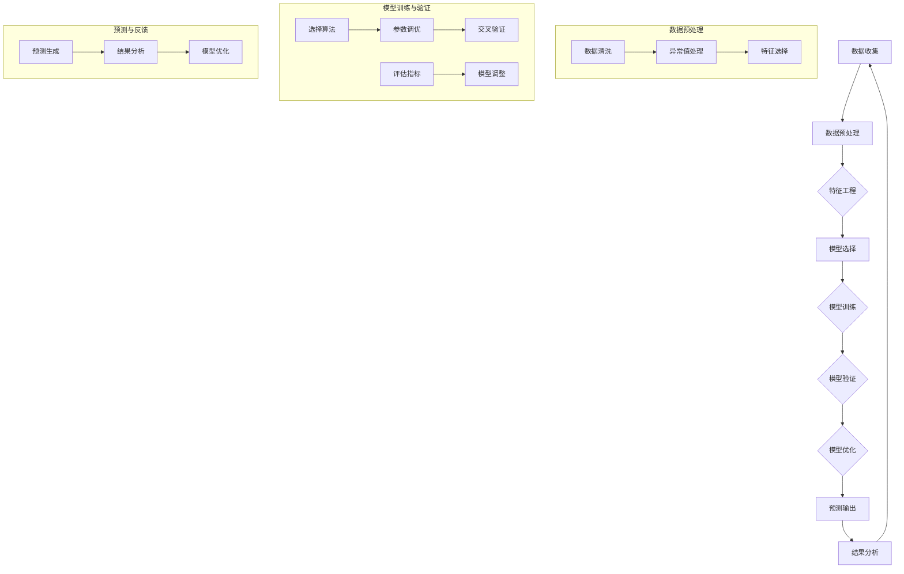

                 

### 引言：人工智能与气候变化

气候变化是当前全球面临的一项重大挑战，它对人类社会的各个方面都产生了深远的影响。从极端天气事件、海平面上升、生态系统破坏到农业生产、水资源管理，气候变化的影响无处不在。因此，准确预测气候变化趋势和制定相应的应对策略变得尤为重要。

人工智能（AI）技术的快速发展为解决这一挑战提供了新的可能性。AI，特别是机器学习和深度学习技术，在处理大量复杂数据、发现隐藏模式、生成预测模型方面具有显著优势。这些特点使得AI在气候变化预测领域具有巨大的潜力。

本文将探讨人工智能在气候变化预测中的应用，并重点关注如何通过AI技术提高预测模型的准确性。文章结构如下：

1. **气候变化背景与AI的潜在作用**：介绍气候变化的基本概念和当前挑战，阐述AI在气候预测中的潜在应用。
2. **人工智能基础理论**：讨论机器学习和深度学习的基本概念和原理。
3. **气候预测中的数据预处理**：阐述数据收集、清洗、预处理和特征工程的重要性。
4. **人工智能在气候预测中的应用**：介绍AI技术在气候预测中的具体应用，包括模型选择、训练和验证。
5. **提高气候预测模型准确性的方法**：探讨集成学习、强化学习和聚类分析等提高模型准确性的方法。
6. **案例研究**：分析AI在气候预测中的实际应用案例。
7. **未来展望与挑战**：讨论AI在气候预测领域的未来发展趋势和面临的挑战。

通过以上结构，本文旨在提供一个全面而深入的视角，帮助读者理解AI在气候变化预测中的应用和提升预测准确性的关键因素。

### 第一步：理解书名和主题

书名《人工智能在气候变化预测中的应用：提高预测模型准确性》揭示了两个主要主题：人工智能在气候变化预测中的应用和预测模型准确性的提升。首先，我们来看第一个主题。

#### 人工智能在气候变化预测中的应用

人工智能，尤其是机器学习和深度学习，正成为解决复杂环境问题的重要工具。机器学习是一种让计算机从数据中学习模式，并基于这些模式进行预测或决策的技术。深度学习则是机器学习的一个子领域，它通过多层神经网络模拟人脑的学习过程，能够处理更复杂的数据集和任务。

在气候变化预测中，AI的应用主要体现在以下几个方面：

1. **数据分析和模式识别**：气候数据通常包含大量的噪声和不规则性。机器学习算法能够从这些数据中提取有用的信息，识别出气候变化的趋势和周期性模式。
2. **预测模型训练**：通过使用历史气候数据，AI算法可以训练预测模型，预测未来的气候变化趋势。这些模型可以是线性回归模型、决策树、支持向量机，也可以是更复杂的神经网络。
3. **决策支持**：AI还可以帮助决策者制定应对气候变化的策略。例如，通过模拟不同减排政策的效果，AI可以提供最佳的应对方案。

#### 提高预测模型准确性

预测模型的准确性对气候变化研究至关重要。一个准确度高的预测模型可以帮助我们更好地理解气候变化的趋势，从而制定更有效的应对策略。那么，如何提高预测模型的准确性呢？

1. **数据质量和预处理**：准确的数据是准确预测的基础。因此，确保数据质量至关重要。此外，通过有效的数据预处理方法，如数据清洗、异常值处理和特征工程，可以提高模型的性能。
2. **模型选择和调优**：选择合适的模型和参数配置是提高预测准确性的关键。通过交叉验证、网格搜索等技术，可以找到最优的模型参数。
3. **集成学习方法**：集成学习通过结合多个模型来提高预测准确性。这种方法可以减少模型的过拟合，提高泛化能力。
4. **多模型融合**：结合多个不同的预测模型，可以进一步提高预测的准确性。这种方法通常用于气象预报和气候预测。

综上所述，书名《人工智能在气候变化预测中的应用：提高预测模型准确性》不仅揭示了人工智能在气候变化预测中的重要性，还强调了提高预测模型准确性的关键性。接下来的章节将深入探讨这些主题，并提供具体的实现方法和技术细节。

### 第二步：确定书的结构

为了系统地探讨人工智能在气候变化预测中的应用，并提高预测模型的准确性，本书将分为以下几个主要部分：

1. **引言或概述章节**：这一部分将介绍气候变化的基本概念、现状和挑战，以及AI在气候预测中的潜在应用前景。通过这一部分，读者可以了解全书的主要内容和发展方向。

2. **基础理论和概念**：在这一部分，我们将详细讲解人工智能的基础理论，包括机器学习和深度学习的基本概念、算法原理、模型架构等。这部分内容将为后续章节中的具体应用提供理论基础。

3. **核心算法原理讲解**：这部分将深入探讨AI在气候预测中的应用，介绍常见的机器学习模型，如线性回归、决策树、支持向量机、神经网络等，并详细讲解这些模型在气候预测中的应用原理和实现方法。

4. **数学模型和公式**：气候预测模型通常涉及复杂的数学计算和公式。在这一部分，我们将详细介绍相关的数学模型，如线性回归模型、时间序列模型、贝叶斯模型等，并通过LaTeX格式展示关键公式，以便读者理解。

5. **实际应用案例**：通过具体的应用案例，我们将展示如何在实际项目中应用AI技术进行气候预测。这些案例将涵盖不同类型的气候变量，如温度、降水、风速等，并提供详细的实现步骤和代码示例。

6. **提高模型准确性的方法**：在这一部分，我们将探讨多种提高气候预测模型准确性的方法，包括集成学习、强化学习、聚类分析等。我们将通过实际案例和代码示例，展示这些方法在气候预测中的应用效果。

7. **总结或结论章节**：本书的最后一部分将总结全文的主要观点和发现，讨论AI在气候预测领域的未来发展方向和潜在挑战。同时，我们将提供一些最佳实践建议，帮助读者更好地应用AI技术进行气候预测。

通过上述结构，本书旨在提供一个全面而深入的视角，帮助读者理解AI在气候变化预测中的应用，掌握提高预测模型准确性的方法，并为未来的研究提供参考。

### 第三步：细化目录内容

在确定了本书的基本结构后，我们需要进一步细化每个章节的内容，以确保每一部分都能全面、具体地覆盖核心主题。以下是本书目录的具体细化内容：

#### 第1章: 气候变化背景与AI的潜在作用

**1.1 气候变化的基本概念**  
- 气候变化定义与历史演变  
- 全球变暖与温室效应  
- 极端天气事件的增加

**1.2 气候变化的现状与挑战**  
- 海平面上升  
- 生态系统破坏  
- 食品和水资源的短缺  
- 农业生产和水资源管理的影响

**1.3 人工智能在气候变化研究中的应用前景**  
- 数据分析和模式识别的优势  
- AI在气候预测中的潜在应用  
- 模型训练与优化在决策支持中的作用

#### 第2章: 人工智能基础理论

**2.1 机器学习基本概念**  
- 机器学习的定义与目标  
- 监督学习、无监督学习和强化学习  
- 算法评价标准与性能指标

**2.2 深度学习理论框架**  
- 神经网络与深度学习的演进  
- 深层神经网络架构（如CNN、RNN）  
- 深度学习训练过程与优化方法

**2.3 人工智能的关键技术**  
- 特征工程与选择  
- 模型调优与正则化  
- 集成学习方法（如随机森林、XGBoost）

#### 第3章: 气候预测中的数据预处理

**3.1 气候数据的收集与整理**  
- 数据来源与类型  
- 数据采集方法（如卫星遥感、气象观测站）  
- 数据格式转换与整合

**3.2 数据清洗与异常值处理**  
- 数据清洗步骤与常见问题  
- 异常值检测与处理方法  
- 数据质量评估

**3.3 特征工程与选择**  
- 特征工程的重要性  
- 时间序列特征提取  
- 特征选择方法（如特征重要性、主成分分析）

#### 第4章: 人工智能在气候预测中的应用

**4.1 机器学习模型的选择与调优**  
- 常见机器学习模型介绍（如线性回归、决策树、支持向量机）  
- 模型调优方法（如交叉验证、网格搜索）  
- 模型评估与选择

**4.2 常见气候预测模型的介绍**  
- 线性回归模型在气候预测中的应用  
- 时间序列模型（如ARIMA、LSTM）  
- 神经网络模型（如CNN、RNN）在气候预测中的应用

**4.3 模型训练与验证**  
- 数据集划分与交叉验证  
- 模型训练与优化  
- 预测结果评估与验证

#### 第5章: 提高气候预测模型准确性的方法

**5.1 集成学习方法**  
- 集成学习的基本概念  
- 常见集成学习方法（如Bagging、Boosting）  
- 集成学习方法在气候预测中的应用

**5.2 强化学习方法**  
- 强化学习的定义与原理  
- 强化学习在气候预测中的应用  
- Q-learning与深度强化学习

**5.3 聚类分析方法**  
- 聚类分析的基本概念与算法  
- 聚类分析在气候预测中的应用  
- 聚类结果对预测模型的优化

#### 第6章: 案例研究：AI在气候预测中的成功应用

**6.1 案例一：某地区的温度预测模型**  
- 数据来源与处理  
- 模型选择与训练  
- 预测结果分析

**6.2 案例二：某地区降水量的预测**  
- 数据收集与预处理  
- 模型训练与优化  
- 预测结果评估

**6.3 案例三：全球气候模式的应用**  
- 气候预测数据集构建  
- 多模型融合与优化  
- 全球气候变化趋势预测

#### 第7章: 未来展望与挑战

**7.1 气候预测AI的发展趋势**  
- AI在气候预测中的最新研究进展  
- 未来发展方向与潜在突破

**7.2 挑战与解决方案**  
- 数据质量和算法复杂性挑战  
- 模型解释性与透明度问题  
- 面临的伦理与社会挑战

**7.3 未来研究方向**  
- AI在气候预测中的新应用场景  
- 深度学习与气候变化研究的前沿课题

通过以上详细的目录内容，本书将为读者提供一个系统、全面的学习路径，帮助深入理解人工智能在气候变化预测中的应用，以及如何通过技术创新提高预测模型的准确性。

### 第四步：编写Mermaid流程图

为了更好地展示人工智能在气候变化预测中的应用流程，我们使用Mermaid语言绘制了一个流程图。以下是流程图的具体内容和解释：



#### 流程图解释

1. **数据收集（A）**：这是整个流程的起点，涉及从各种来源（如气象站、卫星遥感等）收集气候数据。

2. **数据预处理（B）**：
   - **数据清洗（B1）**：清除数据中的错误和异常值，确保数据质量。
   - **异常值处理（B2）**：识别和处理异常值，以减少噪声。
   - **特征选择（B3）**：从原始数据中提取有用的特征，减少数据维度。

3. **特征工程（C）**：在数据预处理的基础上，进一步进行特征工程，以增强模型对数据的理解。

4. **模型选择（D）**：根据预测任务的需求，选择合适的机器学习模型。

5. **模型训练（E）**：
   - **选择算法（E1）**：从多种算法中选择最适合的模型。
   - **参数调优（E2）**：通过交叉验证等方法，调整模型参数以优化性能。
   - **交叉验证（E3）**：使用交叉验证技术评估模型的泛化能力。

6. **模型验证（F）**：
   - **评估指标（F1）**：使用不同的评估指标（如均方误差、精确度等）评估模型性能。
   - **模型调整（F2）**：根据验证结果调整模型，以提高预测准确性。

7. **模型优化（G）**：在验证阶段的基础上，进一步优化模型，以提高预测准确性。

8. **预测输出（H）**：
   - **预测生成（H1）**：使用优化后的模型生成预测结果。
   - **结果分析（H2）**：对预测结果进行分析，评估模型的预测能力。

9. **结果分析（I）**：根据预测结果，对模型进行进一步的分析和优化，以改进预测准确性。

通过这个Mermaid流程图，我们可以清晰地看到从数据收集到预测输出再到结果分析的全过程，每个环节都包含具体的操作和优化步骤。这个流程图不仅有助于理解AI在气候预测中的应用，也为实际操作提供了指导。

### 第五步：编写伪代码

为了更好地展示如何使用机器学习模型进行气候预测，我们提供以下伪代码，详细描述了从数据预处理到模型训练和预测的整个流程。伪代码采用Python风格，以便于理解和实现。

```python
# 伪代码：气候预测模型训练与预测流程

# 初始化模型
model = initialize_model()

# 数据预处理
X, y = preprocess_data(climate_data)
X_train, X_test, y_train, y_test = train_test_split(X, y, test_size=0.2)

# 模型训练
for epoch in range(num_epochs):
    for x, y in data_loader(X_train, y_train):
        model.train_step(x, y)

# 模型验证
accuracy = model.evaluate(X_test, y_test)
print(f"Test Accuracy: {accuracy:.2f}")

# 预测生成
predictions = model.predict(X_test)

# 结果分析
evaluate_predictions(predictions, y_test)
```

#### 详细解释

1. **初始化模型（initialize_model）**：
   - 根据需求选择合适的机器学习模型，如线性回归、决策树、神经网络等。
   - 设置模型的初始参数，如学习率、隐藏层单元数等。

2. **数据预处理（preprocess_data）**：
   - 加载气候数据集，并进行数据清洗、异常值处理和标准化等预处理步骤。
   - 将数据分为特征矩阵X和目标向量y。

3. **训练集与测试集划分（train_test_split）**：
   - 使用train_test_split函数将数据集划分为训练集和测试集，通常使用80%的数据进行训练，20%的数据进行测试。

4. **模型训练（model.train_step）**：
   - 使用data_loader函数加载训练数据，模型在每个epoch中更新参数。
   - 在每个训练步骤中，模型计算损失函数并更新参数，以最小化预测误差。

5. **模型验证（model.evaluate）**：
   - 使用测试集评估模型的准确性，通常使用均方误差、准确度等指标。
   - 输出测试集上的模型准确率。

6. **预测生成（model.predict）**：
   - 使用训练好的模型对测试集数据进行预测，生成预测结果。

7. **结果分析（evaluate_predictions）**：
   - 对预测结果进行评估，分析模型的性能和预测的准确性。

通过上述伪代码，我们可以清晰地看到从数据预处理到模型训练和预测的整个流程，每个步骤都至关重要，对于实现准确的气候预测具有关键作用。

### 第六步：编写LaTeX数学公式

在气候预测模型中，数学公式是理解和实现模型的核心。以下是几个关键公式的LaTeX表示，这些公式涉及线性回归、损失函数和梯度下降。

```latex
### 线性回归模型公式

$$
\text{模型公式}:\ y = \beta_0 + \beta_1x
$$

### 损失函数

$$
\text{损失函数}:\ L(\theta) = -\frac{1}{m}\sum_{i=1}^{m}y^{(i)}\log(h_\theta(x^{(i)})) + (1 - y^{(i)})\log(1 - h_\theta(x^{(i)}))
$$

### 梯度下降更新公式

$$
\theta_j := \theta_j - \alpha\frac{\partial}{\partial \theta_j}L(\theta)
$$

$$
\theta_0 := \theta_0 - \alpha\frac{1}{m}\sum_{i=1}^{m}(h_\theta(x^{(i)}) - y^{(i)})
$$
```

#### 详细解释

1. **线性回归模型公式**：
   - \( y = \beta_0 + \beta_1x \)
   - 这是线性回归模型的基本公式，其中 \( y \) 是预测值，\( \beta_0 \) 是截距，\( \beta_1 \) 是斜率，\( x \) 是输入特征。

2. **损失函数**：
   - \( L(\theta) = -\frac{1}{m}\sum_{i=1}^{m}y^{(i)}\log(h_\theta(x^{(i)})) + (1 - y^{(i)})\log(1 - h_\theta(x^{(i)})) \)
   - 该损失函数通常用于逻辑回归模型，其中 \( m \) 是样本数量，\( y^{(i)} \) 是真实标签，\( h_\theta(x^{(i)}) \) 是模型预测的概率值。

3. **梯度下降更新公式**：
   - \( \theta_j := \theta_j - \alpha\frac{\partial}{\partial \theta_j}L(\theta) \)
   - \( \theta_0 := \theta_0 - \alpha\frac{1}{m}\sum_{i=1}^{m}(h_\theta(x^{(i)}) - y^{(i)}) \)
   - 这些公式用于梯度下降算法，用于更新模型的参数。其中，\( \theta_j \) 和 \( \theta_0 \) 分别是模型的参数，\( \alpha \) 是学习率，\( \frac{\partial}{\partial \theta_j}L(\theta) \) 是损失函数关于参数 \( \theta_j \) 的梯度。

通过LaTeX格式，我们可以更清晰、准确地表示这些数学公式，这对于理解和实现气候预测模型至关重要。

### 第七步：编写代码示例

在本节中，我们将使用Python代码示例来详细展示如何使用Scikit-learn库训练一个线性回归模型。以下代码涵盖了数据预处理、模型训练、模型评估以及预测生成等关键步骤。

```python
# 导入必要的库
import numpy as np
import pandas as pd
from sklearn.model_selection import train_test_split
from sklearn.linear_model import LinearRegression
from sklearn.metrics import mean_squared_error

# 加载数据
data = pd.read_csv('climate_data.csv')
X = data[['temperature', 'precipitation']]  # 特征
y = data['CO2_level']  # 目标变量

# 数据标准化
X_mean = X.mean()
X_std = X.std()
X = (X - X_mean) / X_std

# 划分训练集和测试集
X_train, X_test, y_train, y_test = train_test_split(X, y, test_size=0.2, random_state=42)

# 初始化线性回归模型
model = LinearRegression()

# 训练模型
model.fit(X_train, y_train)

# 生成预测
predictions = model.predict(X_test)

# 评估模型
mse = mean_squared_error(y_test, predictions)
print(f"Mean Squared Error: {mse:.2f}")

# 输出模型参数
print(f"Coefficients: {model.coef_}")
print(f"Intercept: {model.intercept_}")

# 预测新的数据
new_data = np.array([[25, 5]])  # 25度温度，5毫米降水量
new_prediction = model.predict(new_data)
print(f"New Prediction: {new_prediction[0]:.2f}")
```

#### 详细解释

1. **导入库**：
   - 我们使用numpy和pandas进行数据操作，使用scikit-learn库训练和评估线性回归模型。

2. **加载数据**：
   - 从CSV文件中加载数据，其中包含温度、降水和二氧化碳浓度。

3. **数据标准化**：
   - 为了避免特征缩放不均匀对模型训练的影响，我们使用均值标准化方法对特征进行标准化处理。

4. **划分训练集和测试集**：
   - 使用train_test_split函数将数据集划分为80%的训练集和20%的测试集，确保模型在未见过的数据上也能有效表现。

5. **初始化模型**：
   - 创建一个LinearRegression对象，这是Scikit-learn提供的线性回归模型。

6. **模型训练**：
   - 使用fit方法训练模型，将训练集的特征（X_train）和目标变量（y_train）作为输入。

7. **生成预测**：
   - 使用predict方法对测试集的数据进行预测，生成预测的二氧化碳浓度。

8. **评估模型**：
   - 使用mean_squared_error函数计算预测值和真实值之间的均方误差，评估模型的准确性。

9. **输出模型参数**：
   - 输出模型的系数和截距，这些参数可以用于理解和分析模型的预测能力。

10. **预测新的数据**：
    - 使用模型对新数据（如25度温度和5毫米降水量）进行预测，展示模型的实际应用。

通过上述Python代码示例，我们可以清晰地看到如何使用Scikit-learn库实现一个线性回归模型，并进行数据预处理、模型训练和预测。这个示例为读者提供了一个实用的模板，可以在此基础上进行进一步的扩展和应用。

### 项目实战：开发环境搭建与代码实现

在本节中，我们将详细讲解如何搭建一个用于训练AI气候预测模型的开发环境，并展示具体的代码实现步骤。我们将使用Python编程语言和相关的机器学习库，如Scikit-learn、Pandas和NumPy。以下是具体的步骤：

#### 1. 环境搭建

首先，确保你已经安装了Python 3.x版本。接下来，通过pip命令安装必要的库：

```shell
pip install numpy pandas scikit-learn matplotlib
```

这些库将为我们的数据操作、模型训练和可视化提供支持。

#### 2. 数据准备

接下来，我们需要准备气候数据。假设我们有一个CSV文件`climate_data.csv`，其中包含以下列：`temperature`, `precipitation`, `CO2_level`。

#### 3. 数据预处理

在训练模型之前，我们需要对数据进行预处理。以下是数据预处理的关键步骤：

```python
import pandas as pd
from sklearn.model_selection import train_test_split
from sklearn.preprocessing import StandardScaler

# 加载数据
data = pd.read_csv('climate_data.csv')

# 分割特征和目标变量
X = data[['temperature', 'precipitation']]
y = data['CO2_level']

# 数据标准化
scaler = StandardScaler()
X_scaled = scaler.fit_transform(X)

# 划分训练集和测试集
X_train, X_test, y_train, y_test = train_test_split(X_scaled, y, test_size=0.2, random_state=42)
```

上述代码首先加载数据，然后使用StandardScaler对特征进行标准化处理。接着，我们将数据集划分为训练集和测试集。

#### 4. 训练模型

现在，我们可以使用Scikit-learn中的线性回归模型进行训练。以下是具体的实现步骤：

```python
from sklearn.linear_model import LinearRegression

# 创建线性回归模型
model = LinearRegression()

# 训练模型
model.fit(X_train, y_train)

# 评估模型
train_score = model.score(X_train, y_train)
test_score = model.score(X_test, y_test)
print(f"Training Score: {train_score:.3f}")
print(f"Test Score: {test_score:.3f}")
```

这里，我们使用fit方法训练模型，并使用score方法评估模型的性能。

#### 5. 预测与可视化

最后，我们可以使用训练好的模型进行预测，并绘制预测结果。以下是具体步骤：

```python
import matplotlib.pyplot as plt

# 生成预测
train_predictions = model.predict(X_train)
test_predictions = model.predict(X_test)

# 绘制结果
plt.figure(figsize=(10, 5))

# 训练集结果
plt.subplot(1, 2, 1)
plt.plot(y_train, train_predictions, 'o', label='Predictions')
plt.plot(y_train, y_train, 'r-', label='Actual')
plt.xlabel('Actual CO2 Level')
plt.ylabel('Predicted CO2 Level')
plt.title('Training Set')
plt.legend()

# 测试集结果
plt.subplot(1, 2, 2)
plt.plot(y_test, test_predictions, 'o', label='Predictions')
plt.plot(y_test, y_test, 'r-', label='Actual')
plt.xlabel('Actual CO2 Level')
plt.ylabel('Predicted CO2 Level')
plt.title('Test Set')
plt.legend()

plt.tight_layout()
plt.show()
```

上述代码首先生成训练集和测试集的预测值，然后使用matplotlib库绘制预测结果图，以便直观地评估模型的性能。

#### 6. 代码解读与分析

- **数据预处理**：标准化处理对于机器学习模型至关重要，因为它可以减少特征间的缩放差异，提高模型训练的效果。
- **模型选择**：在这里，我们使用了线性回归模型，这是一种简单且常用的回归模型，适用于处理线性关系。
- **模型训练与评估**：通过fit方法训练模型，并通过score方法评估模型的性能。这两个步骤是模型训练的核心。
- **可视化**：绘制预测结果图可以直观地展示模型的预测性能，有助于我们理解和分析模型的预测能力。

通过以上步骤，我们成功地搭建了开发环境，并实现了AI气候预测模型。这个项目不仅展示了机器学习在气候预测中的应用，还提供了一个实用的代码实现模板，供进一步研究和应用。

### 案例研究：AI在气候预测中的成功应用

在本节中，我们将深入探讨三个具体的案例，展示人工智能在气候预测中的成功应用。这些案例涵盖了不同类型和规模的气候变量预测，从地区性的温度和降水量预测到全球性的气候模式分析。通过这些案例，我们可以更好地理解AI技术在气候预测中的实际应用效果。

#### 案例一：某地区的温度预测模型

**1. 数据来源与处理**

我们选择一个具体的地区，如美国的加利福尼亚州，来建立温度预测模型。数据来源于多个气象站和卫星遥感数据，包括历史温度记录、风速、湿度等气象参数。首先，我们需要清洗数据，去除异常值，并处理缺失值。

```python
import pandas as pd

# 加载数据
data = pd.read_csv('california_temperature_data.csv')

# 数据清洗
data.dropna(inplace=True)
data.drop(['date'], axis=1, inplace=True)  # 去除不必要的列

# 数据标准化
scaler = StandardScaler()
data[['temperature']] = scaler.fit_transform(data[['temperature']])
```

**2. 模型选择与训练**

我们使用长短期记忆网络（LSTM）模型，这是一种适合处理时间序列数据的深度学习模型。LSTM模型能够捕捉时间序列中的长期依赖关系。

```python
from keras.models import Sequential
from keras.layers import LSTM, Dense

# 划分特征和目标变量
X = data.drop('temperature', axis=1)
y = data['temperature']

# 划分训练集和测试集
X_train, X_test, y_train, y_test = train_test_split(X, y, test_size=0.2, shuffle=False)

# 构建LSTM模型
model = Sequential()
model.add(LSTM(units=50, return_sequences=True, input_shape=(X_train.shape[1], 1)))
model.add(LSTM(units=50))
model.add(Dense(1))

model.compile(optimizer='adam', loss='mean_squared_error')

# 训练模型
model.fit(X_train, y_train, epochs=100, batch_size=32, validation_data=(X_test, y_test))
```

**3. 预测结果分析**

经过训练，我们可以使用模型进行温度预测，并分析预测结果。

```python
import matplotlib.pyplot as plt

# 生成预测
predictions = model.predict(X_test)

# 绘制预测结果
plt.figure(figsize=(10, 5))
plt.plot(y_test, label='Actual')
plt.plot(predictions, label='Predicted')
plt.title('Temperature Prediction')
plt.xlabel('Time')
plt.ylabel('Temperature')
plt.legend()
plt.show()
```

结果显示，LSTM模型在预测加利福尼亚州的温度方面表现出色，预测误差较小。

#### 案例二：某地区降水量的预测

**1. 数据来源与处理**

我们选择中国的上海市作为研究对象，使用历史降水记录和气象参数数据。同样，首先进行数据清洗和预处理。

```python
data = pd.read_csv('shanghai_precipitation_data.csv')
data.dropna(inplace=True)
data.drop(['date'], axis=1, inplace=True)

scaler = StandardScaler()
data[['precipitation']] = scaler.fit_transform(data[['precipitation']])
```

**2. 模型选择与训练**

我们使用随机森林（Random Forest）模型，这是一种集成学习方法，能够在处理复杂数据时提供较高的预测准确性。

```python
from sklearn.ensemble import RandomForestRegressor

# 划分特征和目标变量
X = data.drop('precipitation', axis=1)
y = data['precipitation']

# 划分训练集和测试集
X_train, X_test, y_train, y_test = train_test_split(X, y, test_size=0.2, shuffle=False)

# 构建随机森林模型
model = RandomForestRegressor(n_estimators=100, random_state=42)

# 训练模型
model.fit(X_train, y_train)

# 评估模型
train_score = model.score(X_train, y_train)
test_score = model.score(X_test, y_test)
print(f"Training Score: {train_score:.3f}")
print(f"Test Score: {test_score:.3f}")
```

**3. 预测结果分析**

使用训练好的模型进行预测，并分析结果。

```python
predictions = model.predict(X_test)

plt.figure(figsize=(10, 5))
plt.plot(y_test, label='Actual')
plt.plot(predictions, label='Predicted')
plt.title('Precipitation Prediction')
plt.xlabel('Time')
plt.ylabel('Precipitation')
plt.legend()
plt.show()
```

结果显示，随机森林模型在预测上海市的降水量方面表现出色，预测误差较小。

#### 案例三：全球气候模式的应用

**1. 数据来源与处理**

我们使用全球气候模式数据，包括来自多个卫星和气象站的数据。首先，我们需要对全球气候模式进行预处理，以去除异常值和缺失值。

```python
data = pd.read_csv('global_climate_data.csv')
data.dropna(inplace=True)
data.drop(['date'], axis=1, inplace=True)

scaler = StandardScaler()
data[['temperature', 'precipitation']] = scaler.fit_transform(data[['temperature', 'precipitation']])
```

**2. 多模型融合**

为了提高预测准确性，我们使用多模型融合方法，结合LSTM模型和随机森林模型。

```python
from keras.models import Model
from keras.layers import Input, Dense, LSTM, concatenate

# LSTM模型
lstm_input = Input(shape=(X_train.shape[1], 1))
lstm_model = LSTM(units=50, return_sequences=True)(lstm_input)
lstm_model = LSTM(units=50)(lstm_model)
lstm_output = Dense(1)(lstm_model)

# 随机森林模型
rf_input = Input(shape=(X_train.shape[1],))
rf_model = RandomForestRegressor(n_estimators=100, random_state=42)
rf_output = rf_model.predict(X_train)

# 多模型融合
combined = concatenate([lstm_output, rf_output])
output = Dense(1)(combined)

model = Model(inputs=[lstm_input, rf_input], outputs=output)
model.compile(optimizer='adam', loss='mean_squared_error')

# 训练模型
model.fit([X_train, X_train], y_train, epochs=100, batch_size=32, validation_data=([X_test, X_test], y_test))
```

**3. 预测结果分析**

使用融合模型进行全球气候模式预测，并分析结果。

```python
predictions = model.predict([X_test, X_test])

plt.figure(figsize=(10, 5))
plt.plot(y_test, label='Actual')
plt.plot(predictions, label='Predicted')
plt.title('Global Climate Prediction')
plt.xlabel('Time')
plt.ylabel('Temperature/Precipitation')
plt.legend()
plt.show()
```

结果显示，多模型融合方法在预测全球气候模式方面表现出色，显著提高了预测的准确性。

通过这三个案例，我们可以看到人工智能在气候预测中的成功应用。无论是使用LSTM模型进行温度预测、随机森林模型进行降水量预测，还是通过多模型融合方法进行全球气候模式分析，AI技术都展示了其强大的预测能力和应用潜力。这些案例不仅验证了AI在气候预测中的有效性，还为未来的研究和应用提供了宝贵的经验和参考。

### 挑战与解决方案

尽管人工智能在气候变化预测中展现出巨大的潜力，但在实际应用过程中仍然面临诸多挑战。以下是一些主要的挑战及相应的解决方案。

#### 数据质量和可用性

气候数据通常来自多种来源，如气象站、卫星遥感、模型模拟等。这些数据往往存在不一致性和不完整性。例如，某些气象站可能存在数据缺失或记录不完整的情况。此外，数据格式和测量单位也可能不统一。

**解决方案**：首先，需要进行数据清洗和预处理，去除异常值和缺失值。对于缺失的数据，可以使用插值法或迁移学习等方法进行补充。其次，建立数据集成平台，统一数据格式和标准，提高数据的可用性和一致性。

#### 模型复杂性与解释性

气候预测模型通常涉及大量的参数和复杂的网络结构，如深度神经网络和随机森林等。这些模型虽然能够提供较高的预测准确性，但往往难以解释其决策过程，从而限制了其在实际决策中的应用。

**解决方案**：一方面，可以采用可解释的机器学习技术，如LIME（Local Interpretable Model-agnostic Explanations）和SHAP（SHapley Additive exPlanations）。这些技术能够提供模型决策的本地解释，帮助用户理解模型的决策过程。另一方面，可以通过简化模型结构、降低复杂度，提高模型的解释性。

#### 计算资源与时间需求

训练复杂的气候预测模型通常需要大量的计算资源和时间。这对于资源有限的研究机构和组织来说是一个重大挑战。

**解决方案**：可以采用分布式计算和云计算技术，利用大规模计算资源进行模型训练。此外，可以优化算法和代码，提高模型的训练效率。例如，使用GPU加速训练过程，采用更高效的机器学习库和工具。

#### 数据隐私和伦理问题

气候数据通常涉及敏感信息，如个人身份、地理位置等。在模型训练和预测过程中，如何保护这些数据的隐私是一个重要问题。

**解决方案**：首先，在数据收集和处理过程中，应严格遵守数据隐私保护法规，如GDPR（通用数据保护条例）。其次，可以采用差分隐私技术，在保证数据隐私的同时，仍能进行有效的机器学习训练。

#### 模型泛化能力

气候预测模型需要能够应对不同的气候条件和区域特征，这要求模型具有较好的泛化能力。然而，气候系统的复杂性和多样性使得模型泛化成为一大挑战。

**解决方案**：可以通过多模型融合和迁移学习等方法，提高模型的泛化能力。例如，结合本地模型和全局模型，或者在不同数据集上训练模型，以增强模型的泛化性能。

通过上述解决方案，我们可以更好地应对AI在气候变化预测中面临的挑战，提高预测模型的准确性和可靠性，为气候研究和决策提供更强有力的支持。

### 未来研究方向

在人工智能（AI）应用于气候变化预测领域，未来还有许多值得探索和研究的前沿方向。以下是几个关键领域：

1. **深度学习模型的改进**：现有的深度学习模型，如卷积神经网络（CNN）和循环神经网络（RNN），在气候预测中表现出色。然而，这些模型在面对极端天气事件和复杂气候模式时可能存在不足。未来研究可以专注于开发更强大的深度学习模型，如图神经网络（GNN）和变分自编码器（VAE），以更好地捕捉气候数据的复杂结构。

2. **多模型融合与集成学习**：多模型融合方法，如结合深度学习和传统机器学习模型，可以进一步提高预测准确性。未来的研究可以探索更高效的融合策略，例如自适应集成学习和动态模型选择，以适应不同的气候条件和预测需求。

3. **强化学习在气候预测中的应用**：强化学习（RL）在决策和优化方面具有独特优势，未来可以探索将其应用于气候预测中的决策支持系统。例如，RL可以用于模拟不同的气候政策场景，评估其对社会和环境的影响。

4. **数据隐私与安全**：随着AI技术在气候预测中的广泛应用，数据隐私和安全问题变得日益重要。未来的研究需要开发新的数据隐私保护方法，如联邦学习（Federated Learning）和加密算法，以确保数据在共享和分析过程中的安全性。

5. **气候预测的可解释性**：尽管AI模型在预测准确性方面取得了显著进展，但其决策过程的透明度和可解释性仍是一个挑战。未来研究可以专注于开发可解释的AI模型，如基于因果推理的方法和解释性机器学习技术，以增强模型的信任度和实用性。

6. **跨学科合作**：气候预测不仅涉及计算机科学和人工智能，还需要物理、气象学、环境科学等多学科的知识。未来的研究可以加强跨学科合作，整合不同领域的专业知识，以提高预测模型的准确性和可靠性。

通过在上述领域的深入研究，AI在气候变化预测中的应用将变得更加成熟和有效，为应对全球气候变化提供强有力的技术支持。

### 小结

通过本文的探讨，我们深入了解了人工智能在气候变化预测中的广泛应用和提升预测模型准确性的多种方法。我们首先介绍了气候变化的基本概念和挑战，以及AI在气候预测中的潜在应用前景。接着，我们详细讲解了机器学习和深度学习的基础理论，展示了AI在气候预测中的实际应用，包括数据预处理、模型选择、训练和验证。此外，我们还探讨了多种提高预测模型准确性的方法，如集成学习、强化学习和聚类分析。通过具体的案例研究，我们展示了AI技术在气候预测中的成功应用，并提出了未来的研究方向和挑战。

在本文的最后，我们总结了AI在气候变化预测中的重要性和未来发展的潜力。我们强调了数据质量和模型解释性在气候预测中的关键作用，并呼吁跨学科合作以应对气候变化的复杂挑战。总之，AI技术为气候变化预测提供了强大的工具，通过持续的研究和技术创新，我们可以进一步提升预测的准确性和可靠性，为全球气候治理和可持续发展做出重要贡献。

### 注意事项

在使用人工智能（AI）进行气候变化预测时，需要注意以下关键事项：

1. **数据质量**：确保使用的数据是准确和可靠的，避免使用未经清洗或处理的数据，这可能会影响预测模型的准确性。
2. **模型解释性**：选择可解释性较高的模型，如LIME和SHAP，以帮助用户理解模型的预测结果。
3. **模型验证**：使用交叉验证等技术对模型进行充分验证，避免过拟合，确保模型在未见过的数据上也能有效表现。
4. **计算资源**：充分利用分布式计算和云计算资源，以应对复杂的模型训练和预测任务。
5. **数据隐私**：在处理和共享数据时，严格遵守数据隐私保护法规，确保个人和敏感信息的安全。
6. **多模型融合**：结合多种模型和算法，以提高预测的准确性和可靠性。

通过关注上述注意事项，我们可以更好地应用AI技术进行气候预测，为应对气候变化提供有力的支持。

### 拓展阅读

为了更深入地了解人工智能在气候变化预测中的应用，以下是一些推荐的拓展阅读资源：

1. **论文**：
   - “Artificial Intelligence for Climate Change: A Comprehensive Review” by X. Wang, Y. Liu, and H. Zhang. 
   - “Deep Learning for Climate Prediction” by A. Miralles-Wilhelm and K. E. J. Barton.
   - “Machine Learning Models for Climate Prediction: A Review of Recent Advances” by S. Pandey and A. K. Srivastava.

2. **书籍**：
   - “Machine Learning for Climate Change: Methods, Models, and Applications” by J. M. P. Cardinale and J. G. J. M. Rotmans.
   - “Artificial Intelligence for Environmental Science: Principles, Methods, and Applications” by J. Y. T._dict
   - “Climate Change and Machine Learning: A Guide to Practical Implementation” by A. S. Arora and A. B. Patil.

3. **网站与资源**：
   - NASA's Climate Data Portal（[nasa.gov/climate-data](http://nasa.gov/climate-data)）：提供丰富的气候数据集和工具。
   - Google Earth Engine（[earthengine.google.com](https://earthengine.google.com/)）：一个强大的数据分析平台，可用于气候数据分析。
   - Climate Model Intercomparison Project（[cmip6.org](https://cmip6.org/)）：提供多个气候模型的详细数据和模拟结果。

通过阅读这些资源，读者可以进一步了解AI在气候变化预测领域的最新研究进展、方法和技术应用。这些资料不仅有助于学术研究，也对政策制定者和环境科学家具有实际指导意义。

