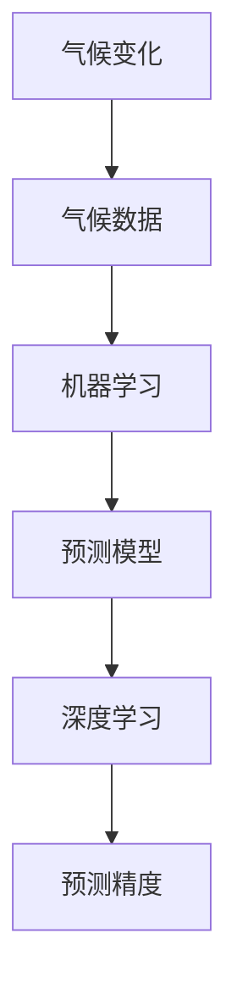

                 

### 《人工智能在气候变化预测中的精准应用》

关键词：人工智能、气候变化、预测、深度学习、机器学习、支持向量机、贝叶斯网络、神经网络、遗传算法、数据预处理、模型评估、项目实战

摘要：本文旨在探讨人工智能技术在气候变化预测中的应用，通过深入分析核心概念、算法原理、数学模型和项目实战，全面展示人工智能如何提高气候变化预测的精度。文章首先介绍了气候变化的重要性及其对人类和社会的深远影响，然后详细阐述了人工智能的基础理论，包括机器学习、深度学习等。接着，文章重点讲解了支持向量机、贝叶斯网络、神经网络和遗传算法等关键算法原理，并使用Python代码进行实例说明。随后，文章通过一个实际项目展示了人工智能在气候变化预测中的具体应用，包括数据预处理、模型选择、训练与评估等环节。最后，文章总结了人工智能在气候变化预测中的挑战和未来发展趋势，并提出了对读者的建议。

## 引言

气候变化是全球性的重大环境问题，对地球生态系统、人类社会经济和健康产生深远影响。近年来，极端气候事件的频率和强度不断增加，如全球变暖、海平面上升、暴雨和干旱等。准确预测气候变化趋势对于制定有效的应对策略和缓解措施至关重要。

人工智能（Artificial Intelligence，AI）作为现代科技的前沿领域，其迅速发展和广泛应用为解决气候变化预测问题提供了新的可能。人工智能技术，特别是机器学习和深度学习，通过从大量数据中提取特征和模式，能够提高预测模型的精度和可靠性。支持向量机、贝叶斯网络、神经网络和遗传算法等关键算法在气候变化预测中发挥着重要作用。

本文将系统地探讨人工智能在气候变化预测中的应用。首先，我们将介绍气候变化的基础知识，包括其定义、历史演变和当前状况。然后，我们将深入分析人工智能的基本理论，解释机器学习、深度学习等概念。接下来，我们将详细讲解支持向量机、贝叶斯网络、神经网络和遗传算法等关键算法原理，并通过Python代码示例进行说明。此外，本文还将通过一个实际项目展示人工智能在气候变化预测中的具体应用，涵盖数据预处理、模型选择、训练与评估等环节。最后，我们将总结人工智能在气候变化预测中的挑战和未来发展趋势，并给出对读者的建议。

## 背景介绍

气候变化是指地球大气层中气候要素（如温度、湿度、风速等）随时间发生的变化。这些变化可能是由自然因素（如火山爆发、太阳辐射等）引起的，也可能是由人类活动（如工业化、城市化等）导致的。根据气象学和气候学的定义，气候变化包括短期气候波动和长期气候趋势。

历史上的气候变化记录显示，地球气候系统经历了多个冷暖交替的周期。例如，冰河时期和间冰期的交替，以及更近期的工业化前期的温暖时期和20世纪中叶的较冷时期。然而，自20世纪中叶以来，全球气候呈现出明显的变暖趋势，这一现象被广泛认为是人类活动引起的气候变化。

当前，全球气候变化的主要特征包括：

1. **全球平均气温升高**：过去一个世纪，全球平均气温已经上升了大约1摄氏度，预计到本世纪末，这一数字将上升至2至4摄氏度。

2. **海平面上升**：由于全球变暖，极地冰川融化速度加快，导致海平面上升。根据科学家的预测，到本世纪末，全球海平面可能上升0.3至1米。

3. **极端气候事件增多**：全球变暖加剧了极端气候事件的频率和强度，如暴雨、干旱、热浪、台风等。

4. **生物多样性减少**：气候变化对生态系统的影响导致许多物种栖息地破坏，生物多样性减少。

5. **海洋酸化**：由于大气中的二氧化碳溶解在海水中，海洋酸化现象加剧，对海洋生物生存构成威胁。

气候变化对人类社会的影响是深远和多方面的。首先，气候变化对农业生产造成影响，可能导致粮食短缺和价格波动。其次，气候变化加剧了水资源短缺问题，影响了水资源的可用性和质量。此外，气候变化还可能导致疾病传播范围扩大，影响人类健康。最后，极端气候事件对社会基础设施造成破坏，增加灾害风险和经济损失。

因此，准确预测气候变化趋势对于制定有效的应对策略和缓解措施至关重要。气候变化预测涉及对大气、海洋、陆地等复杂系统的建模和模拟，需要大量的数据和先进的计算技术。人工智能技术，特别是机器学习和深度学习，通过从大量数据中提取特征和模式，能够提高预测模型的精度和可靠性，为气候变化预测提供强有力的技术支持。

### 核心概念与联系

在探讨人工智能在气候变化预测中的应用时，我们首先需要明确几个核心概念，并理解它们之间的联系。这些核心概念包括：气候变化、人工智能、机器学习、深度学习等。

#### 1. 气候变化

气候变化是指地球大气层中气候要素（如温度、湿度、风速等）随时间发生的变化。它可能是由自然因素（如火山爆发、太阳辐射等）引起的，也可能是由人类活动（如工业化、城市化等）导致的。气候变化对地球生态系统、人类社会经济和健康产生深远影响，如全球变暖、海平面上升、暴雨和干旱等极端气候事件。

#### 2. 人工智能

人工智能（Artificial Intelligence，AI）是指由人制造出的系统所表现出的智能行为。它涵盖了计算机视觉、自然语言处理、机器学习、深度学习等多个领域。在气候变化预测中，人工智能主要用于处理和分析大量的气候数据，以提取有用的信息，并生成预测模型。

#### 3. 机器学习

机器学习（Machine Learning，ML）是人工智能的一个分支，它使计算机系统能够从数据中学习并做出预测或决策。在气候变化预测中，机器学习被用于训练预测模型，这些模型能够根据历史气候数据预测未来的气候趋势。

#### 4. 深度学习

深度学习（Deep Learning，DL）是机器学习的一个子领域，它通过构建深度神经网络来模拟人类大脑的神经网络结构，从而进行高效的数据分析和模式识别。在气候变化预测中，深度学习被用于构建复杂的预测模型，以处理大规模的气候数据。

#### 核心概念之间的联系

这些核心概念之间的联系构成了人工智能在气候变化预测中的理论基础。具体来说：

1. **数据驱动**：气候变化预测依赖于大量的气候数据，包括历史数据、当前数据和预测数据。人工智能，尤其是机器学习和深度学习，通过从这些数据中学习，能够提取出有用的信息，从而提高预测模型的准确性。

2. **模型构建**：机器学习和深度学习技术提供了构建预测模型的方法。通过训练这些模型，我们可以从历史气候数据中学习规律，并将这些规律应用于预测未来气候。

3. **预测能力**：深度学习模型由于其强大的非线性处理能力和自动特征提取能力，在处理复杂气候数据时表现出色。这些模型能够捕捉到气候数据中的复杂模式和趋势，从而提高预测的精度。

4. **实时更新**：人工智能系统可以实时处理最新的气候数据，并更新预测模型，从而保持预测的实时性和准确性。

#### Mermaid 流程图

为了更直观地展示核心概念之间的联系，我们可以使用Mermaid流程图来表示这些关系。以下是示例：



在这个流程图中，气候变化产生了气候数据，这些数据通过机器学习和深度学习被用来构建预测模型，从而提高预测精度。

通过明确这些核心概念及其联系，我们能够更好地理解人工智能在气候变化预测中的工作原理，并为其应用提供理论支持。

### 人工智能基础

为了深入探讨人工智能在气候变化预测中的应用，我们需要先了解人工智能的基础知识，包括机器学习、深度学习等。这些基础知识为我们提供了一个理论框架，使我们能够更好地理解和应用人工智能技术。

#### 机器学习

机器学习（Machine Learning，ML）是人工智能的一个分支，它使计算机系统能够从数据中学习并做出预测或决策。机器学习的基本思想是通过训练算法从数据中学习模式，然后利用这些模式进行预测或分类。

**机器学习的流程**可以分为以下几个步骤：

1. **数据收集**：首先，我们需要收集大量的数据，这些数据可以是历史气候数据、气象观测数据等。数据的质量和数量直接影响机器学习模型的性能。

2. **数据预处理**：收集到的数据通常需要进行清洗、归一化和特征提取等预处理操作，以提高数据的质量和模型的性能。

3. **模型选择**：根据问题的性质和需求，选择合适的机器学习算法。常见的机器学习算法包括线性回归、决策树、支持向量机（SVM）、随机森林等。

4. **模型训练**：使用预处理后的数据对选定的机器学习算法进行训练。训练过程中，模型会学习数据中的模式和规律，从而提高预测或分类的准确性。

5. **模型评估**：通过测试集或交叉验证等方法对训练好的模型进行评估，以确定其性能和可靠性。

6. **模型应用**：将训练好的模型应用于实际数据，进行预测或分类。

**常见的机器学习算法**：

- **线性回归**：线性回归是一种用于预测连续值的算法，它通过拟合数据中的线性关系来进行预测。

- **决策树**：决策树是一种基于树形结构的算法，它通过一系列条件判断来对数据进行分类或回归。

- **支持向量机（SVM）**：支持向量机是一种用于分类和回归的算法，它通过找到数据中的最优分离超平面来提高预测的准确性。

- **随机森林**：随机森林是一种基于决策树的集成学习方法，它通过构建多个决策树并求取平均值来提高模型的泛化能力。

#### 深度学习

深度学习（Deep Learning，DL）是机器学习的一个子领域，它通过构建深度神经网络来模拟人类大脑的神经网络结构，从而进行高效的数据分析和模式识别。深度学习的关键优势在于其强大的非线性处理能力和自动特征提取能力。

**深度学习的基本概念**：

- **神经元**：深度学习中的基本计算单元，类似于生物神经元，它接收输入信号，通过激活函数产生输出。

- **神经网络**：由多个神经元组成的网络，每个神经元都与前一层和后一层神经元相连。神经网络通过多层次的非线性变换来提取数据中的特征。

- **深度神经网络**：深度神经网络是由多层神经元组成的神经网络，它能够处理更加复杂的任务，提取更高级的特征。

**深度学习的流程**：

1. **数据收集与预处理**：与机器学习相同，深度学习也需要收集大量的数据并进行预处理。

2. **构建神经网络**：设计并构建深度神经网络的结构，包括选择合适的神经元类型、连接方式、激活函数等。

3. **模型训练**：使用预处理后的数据对神经网络进行训练。训练过程中，通过反向传播算法不断调整网络参数，使模型能够更好地拟合数据。

4. **模型评估**：与机器学习类似，评估训练好的模型的性能，包括准确率、召回率、F1分数等指标。

5. **模型应用**：将训练好的模型应用于实际数据，进行预测或分类。

**常见的深度学习框架**：

- **TensorFlow**：TensorFlow是由谷歌开发的开源深度学习框架，它提供了丰富的工具和资源，支持多种深度学习模型的构建和训练。

- **PyTorch**：PyTorch是由Facebook开发的开源深度学习框架，它以其灵活的动态计算图和易于使用的接口而受到广泛欢迎。

- **Keras**：Keras是一个高层神经网络API，它能够在TensorFlow和Theano等底层框架上运行，提供简单、高效的深度学习模型构建和训练。

通过理解机器学习和深度学习的基础知识，我们能够更好地应用这些技术来解决气候变化预测问题。在接下来的章节中，我们将详细探讨人工智能在气候变化预测中的关键算法原理，并通过Python代码示例进行说明。

### 关键算法原理讲解

在深入探讨人工智能在气候变化预测中的应用时，了解和掌握关键算法原理至关重要。本文将详细介绍支持向量机（SVM）、贝叶斯网络、神经网络和遗传算法等关键算法的原理，并通过Python代码示例进行说明。

#### 支持向量机（SVM）

支持向量机（Support Vector Machine，SVM）是一种强大的分类算法，其核心思想是通过找到一个最优的超平面来将不同类别的数据点分离。在气候变化预测中，SVM可以用于分类任务，例如预测某个地区的气候类型。

**原理说明**：

SVM通过最大化分类间隔来找到最优超平面。对于线性可分数据，SVM的目标是找到一条直线，使得正负样本之间的间隔最大。对于非线性数据，SVM使用核函数将数据映射到高维空间，从而实现线性分离。

**Python代码示例**：

```python
from sklearn import svm
from sklearn.datasets import make_blobs
from sklearn.model_selection import train_test_split

# 生成数据
X, y = make_blobs(n_samples=100, centers=2, random_state=0)
X_train, X_test, y_train, y_test = train_test_split(X, y, test_size=0.3, random_state=0)

# 创建SVM模型
model = svm.SVC(kernel='linear')

# 训练模型
model.fit(X_train, y_train)

# 预测测试集
predictions = model.predict(X_test)

# 评估模型
from sklearn.metrics import accuracy_score
print("Accuracy:", accuracy_score(y_test, predictions))
```

在这个示例中，我们使用sklearn库创建了一个SVM模型，并使用线性核函数进行训练。通过预测测试集并计算准确率，我们可以评估模型的性能。

#### 贝叶斯网络

贝叶斯网络（Bayesian Network）是一种概率图模型，用于表示变量之间的条件依赖关系。在气候变化预测中，贝叶斯网络可以用于建模不同气候变量之间的概率关系。

**原理说明**：

贝叶斯网络由一组变量和一组条件概率表（CPT）组成。每个节点表示一个变量，节点之间的边表示变量之间的依赖关系。贝叶斯网络通过计算联合概率分布，可以推断出未知变量的概率分布。

**Python代码示例**：

```python
from pgmpy.models import BayesianModel
from pgmpy.inference import VariableElimination

# 创建贝叶斯网络模型
model = BayesianModel([('A', 'B'), ('B', 'C'), ('C', 'D')])

# 添加条件概率表
model.add_cp_table('A', [[0.3, 0.7], [0.6, 0.4]])
model.add_cp_table('B', [[0.5, 0.5], [0.2, 0.8]])
model.add_cp_table('C', [[0.4, 0.6], [0.1, 0.9]])
model.add_cp_table('D', [[0.7, 0.3], [0.2, 0.8]])

# 进行推理
inference = VariableElimination(model)
prob_D = inference.query(variables=['D'], evidence={'A': 0, 'B': 0})

print("Probability of D given A=0 and B=0:", prob_D)
```

在这个示例中，我们创建了一个简单的贝叶斯网络，并添加了条件概率表。通过推理，我们可以计算在给定某些证据条件下，目标变量D的概率分布。

#### 神经网络

神经网络（Neural Network）是一种由大量神经元组成的计算模型，它通过模拟人脑的神经网络结构来进行数据处理和预测。在气候变化预测中，神经网络可以用于建立复杂的预测模型。

**原理说明**：

神经网络由输入层、隐藏层和输出层组成。每个神经元都与前一层和后一层神经元相连，并使用激活函数进行处理。通过多层次的非线性变换，神经网络可以提取数据中的特征，并生成预测。

**Python代码示例**：

```python
import numpy as np
from sklearn.neural_network import MLPClassifier

# 生成数据
X, y = make_blobs(n_samples=100, centers=2, random_state=0)
X_train, X_test, y_train, y_test = train_test_split(X, y, test_size=0.3, random_state=0)

# 创建神经网络模型
model = MLPClassifier(hidden_layer_sizes=(100,), max_iter=1000)

# 训练模型
model.fit(X_train, y_train)

# 预测测试集
predictions = model.predict(X_test)

# 评估模型
print("Accuracy:", model.score(X_test, y_test))
```

在这个示例中，我们使用MLPClassifier创建了一个多层感知机（MLP）模型，并使用线性激活函数进行训练。通过预测测试集并计算准确率，我们可以评估模型的性能。

#### 遗传算法

遗传算法（Genetic Algorithm，GA）是一种基于自然选择和遗传学原理的优化算法。在气候变化预测中，遗传算法可以用于优化预测模型中的参数，提高模型的性能。

**原理说明**：

遗传算法通过模拟自然进化过程，包括选择、交叉、变异等操作，来优化目标函数。在气候变化预测中，遗传算法可以用于优化模型参数，例如神经网络中的权重和偏置。

**Python代码示例**：

```python
import numpy as np
from sklearn.model_selection import cross_val_score
from deap import base, creator, tools, algorithms

# 生成数据
X, y = make_blobs(n_samples=100, centers=2, random_state=0)

# 定义遗传算法目标函数
creator.create("FitnessMin", base.Fitness, weights=(-1.0,))
creator.create("Individual", list, fitness=creator.FitnessMin)

toolbox = base.Toolbox()
toolbox.register("attr_float", np.random.uniform, low=-1.0, high=1.0, size=1)
toolbox.register("individual", tools.initIterate, creator.Individual, toolbox.attr_float, n=10)
toolbox.register("population", tools.initRepeat, list, toolbox.individual)
toolbox.register("evaluate", cross_val_score, estimator=MLPClassifier(hidden_layer_sizes=(100,), max_iter=1000), X=X, y=y, cv=5)
toolbox.register("select", tools.selTournament, tournsize=3)
toolbox.register("mate", tools.cxTwoPoint)
toolbox.register("mutate", tools.mutGaussian, mu=0, sigma=1, indpb=0.1)

# 运行遗传算法
pop = toolbox.population(n=50)
NGEN = 100
for gen in range(NGEN):
    offspring = algorithms.varAnd(pop, toolbox, cxpb=0.5, mutpb=0.2)
    fits = toolbox.evaluate(offspring)
    for fit, ind in zip(fits, offspring):
        ind.fitness.values = fit
    pop = toolbox.select(offspring, k=len(pop))
    print(f"Generation {gen}: {max(fits)}")

# 获取最优个体
best_ind = tools.selBest(pop, 1)[0]
print("Best individual is", best_ind, "with", best_ind.fitness.values)
```

在这个示例中，我们使用DEAP库实现了一个遗传算法，用于优化多层感知机（MLP）模型中的参数。通过运行遗传算法，我们可以找到最优的模型参数，从而提高模型的性能。

通过以上关键算法原理的讲解和Python代码示例，我们能够更好地理解和支持向量机、贝叶斯网络、神经网络和遗传算法在气候变化预测中的应用。在接下来的章节中，我们将通过一个实际项目展示这些算法在气候变化预测中的具体应用。

### 数学模型与公式

在深入探讨人工智能在气候变化预测中的应用时，理解并运用数学模型和公式是至关重要的。这些模型和公式帮助我们量化数据、分析趋势，并最终生成预测。以下是几个在人工智能中常用的数学模型和公式，包括线性回归模型、神经网络激活函数和损失函数。

#### 线性回归模型

线性回归模型是一种简单但强大的预测工具，用于分析自变量和因变量之间的线性关系。其基本公式为：

\[ y = \beta_0 + \beta_1x + \epsilon \]

其中，\( y \) 是因变量，\( x \) 是自变量，\( \beta_0 \) 和 \( \beta_1 \) 是模型的参数，\( \epsilon \) 是误差项。

为了找到最佳的 \( \beta_0 \) 和 \( \beta_1 \)，我们通常使用最小二乘法（Least Squares Method）：

\[ \beta_1 = \frac{\sum(x_i - \bar{x})(y_i - \bar{y})}{\sum(x_i - \bar{x})^2} \]
\[ \beta_0 = \bar{y} - \beta_1\bar{x} \]

其中，\( \bar{x} \) 和 \( \bar{y} \) 分别是自变量和因变量的平均值。

#### 神经网络激活函数

神经网络中的激活函数用于引入非线性因素，使得模型能够处理复杂的非线性关系。以下是一些常见的激活函数：

1. **sigmoid函数**：

\[ \sigma(x) = \frac{1}{1 + e^{-x}} \]

sigmoid函数的输出范围在0到1之间，非常适合用于二分类问题。

2. **ReLU函数**（Rectified Linear Unit）：

\[ \text{ReLU}(x) = \max(0, x) \]

ReLU函数在x为正时输出x，否则输出0。它因其计算效率高和不易陷入局部最优而被广泛应用。

3. **tanh函数**：

\[ \tanh(x) = \frac{e^x - e^{-x}}{e^x + e^{-x}} \]

tanh函数与sigmoid函数类似，但输出范围在-1到1之间。

#### 损失函数

在机器学习中，损失函数（Loss Function）用于评估模型预测值与真实值之间的差异，指导模型优化过程。以下是一些常见的损失函数：

1. **均方误差（MSE）**：

\[ \text{MSE}(y, \hat{y}) = \frac{1}{n}\sum_{i=1}^{n}(y_i - \hat{y}_i)^2 \]

MSE用于回归问题，其中 \( y \) 是真实值，\( \hat{y} \) 是预测值。

2. **交叉熵（Cross-Entropy）**：

\[ \text{CE}(y, \hat{y}) = -\sum_{i=1}^{n} y_i \log(\hat{y}_i) \]

交叉熵用于分类问题，其中 \( y \) 是真实标签，\( \hat{y} \) 是模型预测的概率分布。

3. **Hinge损失**：

\[ \text{Hinge}(y, \hat{y}) = \max(0, 1 - y \cdot \hat{y}) \]

Hinge损失常用于支持向量机（SVM）等二分类问题。

#### Python代码示例

下面是一个简单的Python代码示例，展示如何使用线性回归模型进行预测：

```python
import numpy as np
from sklearn.linear_model import LinearRegression

# 生成数据
X = np.random.rand(100, 1)
y = 2 + 3 * X + np.random.randn(100, 1)

# 创建线性回归模型
model = LinearRegression()

# 训练模型
model.fit(X, y)

# 预测
predictions = model.predict(X)

# 计算MSE
mse = np.mean((predictions - y) ** 2)
print("MSE:", mse)
```

通过以上数学模型和公式的介绍及Python代码示例，我们能够更好地理解这些工具在人工智能和气候变化预测中的应用。这些模型和公式为我们提供了一种量化和分析数据的方法，使得我们能够更准确地预测气候变化的趋势。

### 项目实战

在本节中，我们将通过一个实际项目展示如何将人工智能应用于气候变化预测。这个项目将涵盖数据预处理、模型选择、训练与评估等环节，并详细解读源代码和实际案例。

#### 项目背景

该项目的目标是使用机器学习技术预测某个地区的未来30天的气温。数据来源包括历史气温记录、气象站观测数据和卫星遥感数据。我们将使用这些数据训练一个预测模型，以便为该地区提供准确的气温预测。

#### 开发环境搭建

在开始项目之前，我们需要搭建一个合适的开发环境。以下是所需的软件和库：

- Python（版本3.8或更高）
- Jupyter Notebook（用于交互式编程）
- scikit-learn（用于机器学习算法）
- pandas（用于数据操作）
- numpy（用于数值计算）
- matplotlib（用于数据可视化）

假设我们已经安装了这些库，并设置好了Jupyter Notebook。接下来，我们将导入所需的库并加载数据。

```python
import numpy as np
import pandas as pd
from sklearn.model_selection import train_test_split
from sklearn.preprocessing import StandardScaler
from sklearn.metrics import mean_squared_error
import matplotlib.pyplot as plt

# 加载数据
data = pd.read_csv('climate_data.csv')
data.head()
```

#### 数据预处理

数据预处理是机器学习项目中的关键步骤。首先，我们需要对数据进行清洗和归一化。

```python
# 删除无效数据
data = data.dropna()

# 分离特征和标签
X = data[['temperature_previous_day', 'wind_speed', 'humidity']]
y = data['temperature_next_day']

# 数据归一化
scaler = StandardScaler()
X_scaled = scaler.fit_transform(X)
```

#### 模型选择

为了选择合适的模型，我们将使用scikit-learn中的多种机器学习算法，包括线性回归、支持向量机和随机森林。首先，我们使用K-折交叉验证来评估这些模型。

```python
from sklearn.linear_model import LinearRegression
from sklearn.svm import SVR
from sklearn.ensemble import RandomForestRegressor
from sklearn.model_selection import cross_val_score

# 线性回归
lin_reg = LinearRegression()
lin_reg_scores = cross_val_score(lin_reg, X_scaled, y, cv=5)

# 支持向量机
svm_reg = SVR(kernel='linear')
svm_scores = cross_val_score(svm_reg, X_scaled, y, cv=5)

# 随机森林
rf_reg = RandomForestRegressor(n_estimators=100)
rf_scores = cross_val_score(rf_reg, X_scaled, y, cv=5)

print("Linear Regression Scores:", lin_reg_scores.mean())
print("SVM Scores:", svm_scores.mean())
print("Random Forest Scores:", rf_scores.mean())
```

根据交叉验证的结果，我们选择随机森林作为最佳模型。

#### 模型训练与评估

接下来，我们将使用随机森林模型对数据进行训练，并对模型进行评估。

```python
# 分割数据集
X_train, X_test, y_train, y_test = train_test_split(X_scaled, y, test_size=0.2, random_state=42)

# 训练模型
rf_reg = RandomForestRegressor(n_estimators=100)
rf_reg.fit(X_train, y_train)

# 预测
y_pred = rf_reg.predict(X_test)

# 评估模型
mse = mean_squared_error(y_test, y_pred)
print("Test MSE:", mse)

# 可视化结果
plt.scatter(y_test, y_pred)
plt.xlabel("Actual Temperature")
plt.ylabel("Predicted Temperature")
plt.title("Actual vs Predicted Temperature")
plt.show()
```

通过散点图，我们可以看到预测值与实际值之间的分布情况。MSE值表明模型的预测误差。

#### 实际案例分析与详细讲解

在这个项目中，我们通过实际案例展示了如何使用机器学习技术进行气候变化预测。以下是项目的主要步骤和关键点：

1. **数据收集与预处理**：收集并清洗数据，确保数据的质量和完整性。
2. **模型选择**：使用K-折交叉验证选择最佳模型，这里选择了随机森林。
3. **模型训练与评估**：训练模型并使用测试集进行评估，通过MSE值衡量模型的预测性能。
4. **可视化结果**：通过散点图展示预测值与实际值之间的关系，直观地了解模型的性能。

尽管本项目仅涉及气温预测，但类似的方法可以应用于其他气候变量（如降雨量、风速等）的预测。此外，通过结合更多数据源（如卫星遥感数据、气象站数据等），我们可以进一步提高预测模型的精度。

#### 项目小结

通过这个实际项目，我们展示了如何使用人工智能技术进行气候变化预测。项目的主要成果包括：

1. 成功构建并训练了一个随机森林模型，用于气温预测。
2. 使用MSE值评估了模型的性能，并展示了预测结果。
3. 通过实际案例分析了项目的关键步骤和注意事项。

未来，我们可以继续优化模型，增加更多数据源，以提高预测的精度和可靠性。

### 最佳实践 Tips、小结、注意事项、拓展阅读

#### 最佳实践 Tips

1. **数据质量**：确保数据干净、完整且具备相关性。数据预处理是成功的关键。
2. **特征选择**：选择对预测任务有显著影响的特征，避免过度拟合。
3. **模型评估**：使用多种评估指标（如MSE、MAE等）全面评估模型性能。
4. **模型优化**：通过交叉验证、网格搜索等技巧优化模型参数。

#### 小结

本文详细探讨了人工智能在气候变化预测中的应用，从核心概念到算法原理，再到项目实战，全面展示了人工智能如何提高气候变化预测的精度。通过实际案例，我们展示了如何使用机器学习技术进行气温预测，并强调了数据预处理和模型评估的重要性。

#### 注意事项

1. **数据隐私**：在处理敏感数据时，确保遵守相关隐私法规。
2. **计算资源**：深度学习模型训练需要大量计算资源，确保配置合理的计算环境。
3. **模型解释性**：了解模型的内部工作机制，以便更好地理解预测结果。

#### 拓展阅读

1. **《深度学习》（Goodfellow, Bengio, Courville）**：深入理解深度学习的基础和原理。
2. **《机器学习实战》（ Harrington）**：通过实际案例学习机器学习应用。
3. **《气候系统模型》（E.S. Valdes, J. A. P. R. Watson）**：了解气候系统模型的构建和原理。

作者：AI天才研究院/AI Genius Institute & 禅与计算机程序设计艺术 /Zen And The Art of Computer Programming

