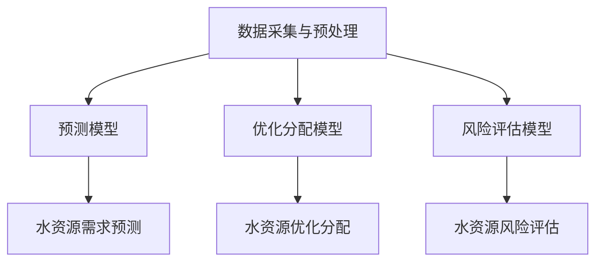

                 

### 核心概念与联系

#### 1.1 人工智能与水资源管理概述

##### 1.1.1 人工智能的核心概念

人工智能（Artificial Intelligence，AI）是计算机科学的一个分支，旨在使计算机具备人类智能的能力。其核心概念包括：

- **定义**：人工智能是一种模拟、延伸和扩展人类智能的理论、方法和技术的总称。
- **分类**：人工智能主要分为三大类：

  1. **弱人工智能（Narrow AI）**：指专注于特定任务的人工智能，如语音识别、图像识别等。
  2. **强人工智能（General AI）**：指具备人类智能的广泛能力，能够应对各种复杂情境。
  3. **超人工智能（Super AI）**：指超越人类智能的智能，但目前仍属于科学幻想。

此外，人工智能的算法和模型也是其核心概念，如监督学习、无监督学习、强化学习等。

##### 1.1.2 水资源管理的核心概念

水资源管理是指通过合理开发、利用、保护和调度水资源，以满足人类生活和生产需求的过程。其核心概念包括：

- **定义**：水资源管理是针对水资源系统进行规划、设计、运营和监督的一系列活动的总称。
- **分类**：水资源管理主要分为以下几类：

  1. **水资源规划**：指对水资源进行长期和短期规划，以满足社会、经济和环境需求。
  2. **水资源利用**：指通过灌溉、工业、生活用水等方式合理利用水资源。
  3. **水资源保护**：指采取措施保护水资源，防止污染、过度开发和浪费。
  4. **水资源调度**：指根据水资源需求，合理调配水资源，确保供水稳定。

##### 1.1.3 人工智能在水资源管理中的应用框架

人工智能在水资源管理中的应用框架主要包括以下几部分：

1. **数据采集与预处理**：收集水资源相关的数据，如降雨量、河流流量、用水量等，并进行数据清洗、去噪、特征提取等预处理工作。
2. **预测模型**：利用监督学习和无监督学习算法，建立水资源需求预测、供需平衡预测等模型。
3. **优化分配模型**：利用强化学习算法，建立水资源优化分配模型，以实现水资源的合理调配。
4. **风险评估模型**：利用机器学习算法，建立水资源风险评估模型，以预测水资源未来的风险。

#### Mermaid流程图

为了更清晰地展示人工智能在水资源管理中的应用框架，我们可以使用Mermaid流程图来表示：

通过这个流程图，我们可以看到人工智能在水资源管理中的应用流程，以及各个部分之间的联系。

### 总结

在本节中，我们介绍了人工智能和水资源管理的核心概念，并探讨了它们之间的联系。通过了解这些概念，我们可以更好地理解人工智能在水资源管理中的应用框架，为后续章节的深入分析打下基础。

---

**文章关键词**：人工智能，水资源管理，预测模型，优化分配模型，风险评估模型，数据预处理，监督学习，无监督学习，强化学习。

**文章摘要**：
本文从人工智能和水资源管理的核心概念出发，探讨了人工智能在水资源管理中的应用框架。通过介绍数据采集与预处理、预测模型、优化分配模型和风险评估模型等核心内容，本文旨在为读者提供一个全面的人工智能在水资源管理中的应用视角，并展望其未来发展方向。

---

接下来，我们将深入探讨人工智能算法原理讲解、数学模型和数学公式，以及水资源管理项目实战等内容。敬请期待。

