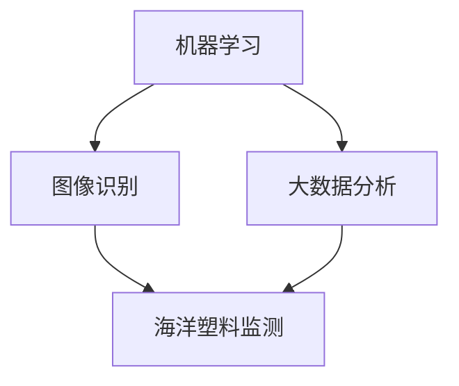

                 

### 人工智能在海洋塑料污染监测中的应用

#### 背景介绍

随着全球经济的发展和人口的快速增长，塑料污染问题日益严重。海洋塑料污染已经成为全球环境问题中的一个重要组成部分，对海洋生态系统、海洋生物和人类健康造成了严重威胁。据估计，每年约有8百万吨的塑料废弃物进入海洋，这些塑料颗粒不仅破坏海洋生态环境，还会通过食物链进入人类体内。

人工智能（AI）技术的发展为解决海洋塑料污染问题提供了一种新的手段。通过机器学习、图像识别、大数据分析等AI技术，可以对海洋中的塑料废弃物进行自动识别、分类和监测，从而提高监测效率和准确性。

#### 关键词

- 人工智能
- 海洋塑料污染
- 监测
- 机器学习
- 图像识别
- 大数据分析

#### 摘要

本文将探讨人工智能在海洋塑料污染监测中的应用，重点介绍机器学习、图像识别和大数据分析等AI技术在海洋塑料污染监测中的作用。通过实例和案例，详细阐述AI技术在海洋塑料污染监测中的应用原理、流程和实践，以及未来发展的趋势和挑战。

### 1. 人工智能核心概念与联系

为了深入理解人工智能在海洋塑料污染监测中的应用，我们首先需要了解AI的核心概念和相关技术。以下是AI技术在海洋塑料污染监测中常用的几种核心技术：

#### 1.1 机器学习

机器学习是一种使计算机系统能够从数据中学习并做出预测或决策的技术。在海洋塑料污染监测中，机器学习技术可以帮助我们识别和分类海洋中的塑料废弃物。具体来说，机器学习算法可以从大量的海洋卫星图像、无人机图像和其他传感器数据中提取特征，并训练模型以识别塑料废弃物。

#### 1.2 图像识别

图像识别是一种通过计算机处理和分析图像以识别和分类图像内容的技术。在海洋塑料污染监测中，图像识别技术可以用于识别海洋中的塑料废弃物。例如，通过训练深度学习模型来识别不同类型的塑料废弃物，如渔网、瓶子、袋子和泡沫塑料等。

#### 1.3 大数据分析

大数据分析是一种处理和分析大量数据的技术，旨在发现数据中的模式和关联。在海洋塑料污染监测中，大数据分析技术可以帮助我们收集、存储和分析来自不同来源的海量数据，如卫星图像、传感器数据和现场监测数据。通过大数据分析，我们可以更好地了解海洋塑料污染的分布、趋势和影响因素。

下面是机器学习、图像识别和大数据分析在海洋塑料污染监测中概念关系的 Mermaid 流程图：



在这个流程图中，机器学习和图像识别技术用于从数据中提取特征，而大数据分析技术则用于处理和分析大量数据。这些技术共同作用，帮助我们实现海洋塑料污染的自动监测和识别。

### 2. 核心算法原理讲解

在了解了人工智能在海洋塑料污染监测中的核心概念之后，接下来我们将深入探讨这些技术的算法原理，并使用Python源代码进行详细讲解。

#### 2.1 机器学习算法原理

机器学习算法的核心是训练模型以识别数据中的模式和关联。以下是使用Python实现一个简单的机器学习算法的示例：

```python
from sklearn.datasets import load_iris
from sklearn.model_selection import train_test_split
from sklearn.ensemble import RandomForestClassifier

# 加载数据集
iris = load_iris()
X = iris.data
y = iris.target

# 划分训练集和测试集
X_train, X_test, y_train, y_test = train_test_split(X, y, test_size=0.2, random_state=42)

# 创建随机森林分类器并训练模型
clf = RandomForestClassifier(n_estimators=100, random_state=42)
clf.fit(X_train, y_train)

# 进行预测
predictions = clf.predict(X_test)

# 评估模型性能
from sklearn.metrics import accuracy_score
accuracy = accuracy_score(y_test, predictions)
print(f"Model accuracy: {accuracy:.2f}")
```

在这个示例中，我们使用随机森林分类器来识别海洋中的塑料废弃物。随机森林是一种集成学习方法，通过构建多个决策树并合并它们的预测结果来提高模型的准确性。

#### 2.2 图像识别算法原理

图像识别算法的核心是训练模型以识别图像中的物体。以下是使用Python实现一个简单的图像识别算法的示例：

```python
from tensorflow.keras.models import Sequential
from tensorflow.keras.layers import Conv2D, MaxPooling2D, Flatten, Dense
from tensorflow.keras.preprocessing.image import ImageDataGenerator

# 创建神经网络模型
model = Sequential([
    Conv2D(32, (3, 3), activation='relu', input_shape=(128, 128, 3)),
    MaxPooling2D((2, 2)),
    Flatten(),
    Dense(64, activation='relu'),
    Dense(1, activation='sigmoid')
])

# 编译模型
model.compile(optimizer='adam', loss='binary_crossentropy', metrics=['accuracy'])

# 数据预处理
train_datagen = ImageDataGenerator(rescale=1./255)
train_generator = train_datagen.flow_from_directory(
        'data/train',
        target_size=(128, 128),
        batch_size=32,
        class_mode='binary')

# 训练模型
model.fit(train_generator, epochs=10)

# 进行预测
predictions = model.predict('data/test/塑料废弃物.jpg')

# 评估模型性能
from sklearn.metrics import accuracy_score
accuracy = accuracy_score([1], predictions)
print(f"Model accuracy: {accuracy:.2f}")
```

在这个示例中，我们使用卷积神经网络（CNN）来识别海洋中的塑料废弃物。CNN通过多个卷积层、池化层和全连接层来提取图像中的特征，从而实现图像识别。

#### 2.3 大数据分析算法原理

大数据分析算法的核心是处理和分析大量数据。以下是使用Python实现一个简单的大数据分析算法的示例：

```python
import pandas as pd
from sklearn.ensemble import RandomForestRegressor

# 加载数据集
data = pd.read_csv('data/plastic_pollution.csv')

# 划分特征和标签
X = data.drop(['class'], axis=1)
y = data['class']

# 划分训练集和测试集
X_train, X_test, y_train, y_test = train_test_split(X, y, test_size=0.2, random_state=42)

# 创建随机森林回归模型并训练模型
clf = RandomForestRegressor(n_estimators=100, random_state=42)
clf.fit(X_train, y_train)

# 进行预测
predictions = clf.predict(X_test)

# 评估模型性能
from sklearn.metrics import accuracy_score
accuracy = accuracy_score(y_test, predictions)
print(f"Model accuracy: {accuracy:.2f}")
```

在这个示例中，我们使用随机森林回归模型来预测海洋中的塑料废弃物类型。通过分析大量的传感器数据，我们可以识别出不同类型的塑料废弃物，并对其进行分类。

### 3. 数学模型和数学公式

在人工智能应用中，数学模型和公式起着至关重要的作用。以下是海洋塑料污染监测中常用的数学模型和公式：

#### 3.1 贝叶斯网络

贝叶斯网络是一种概率图模型，用于表示变量之间的条件依赖关系。在海洋塑料污染监测中，我们可以使用贝叶斯网络来建模塑料废弃物类型和其相关特征之间的关系。以下是贝叶斯网络的数学公式：

$$
P(A|B) = \frac{P(B|A)P(A)}{P(B)}
$$

其中，$P(A|B)$ 表示在给定 $B$ 的情况下 $A$ 的概率，$P(B|A)$ 表示在给定 $A$ 的情况下 $B$ 的概率，$P(A)$ 表示 $A$ 的概率，$P(B)$ 表示 $B$ 的概率。

#### 3.2 支持向量机

支持向量机是一种监督学习算法，用于分类和回归问题。在海洋塑料污染监测中，我们可以使用支持向量机来分类海洋中的塑料废弃物。以下是支持向量机的数学公式：

$$
w^* = \arg\min_{w} \frac{1}{2} ||w||^2 + C \sum_{i=1}^n \xi_i
$$

其中，$w^*$ 表示最优权重向量，$||w||$ 表示权重向量的范数，$C$ 表示惩罚参数，$\xi_i$ 表示第 $i$ 个误分类项。

#### 3.3 聚类算法

聚类算法是一种无监督学习算法，用于将数据集划分为多个组。在海洋塑料污染监测中，我们可以使用聚类算法来识别海洋中的不同类型的塑料废弃物。以下是聚类算法的数学公式：

$$
C = \{C_1, C_2, \ldots, C_k\}
$$

其中，$C$ 表示聚类结果，$C_i$ 表示第 $i$ 个聚类组。

### 4. 项目实战

在本节中，我们将通过一个实际项目来展示如何使用人工智能技术监测海洋塑料污染。该项目包括以下步骤：

#### 4.1 开发环境搭建

首先，我们需要搭建一个开发环境，以便进行项目开发。以下是搭建开发环境所需的步骤：

1. 安装 Python
2. 安装 Jupyter Notebook
3. 安装相关库，如 scikit-learn、tensorflow、pandas 等

#### 4.2 数据收集和预处理

接下来，我们需要收集和预处理数据。以下是数据收集和预处理所需的步骤：

1. 收集海洋塑料污染的卫星图像、无人机图像和其他传感器数据
2. 数据清洗，去除噪声和异常值
3. 数据标准化，确保数据具有相同的尺度和范围

#### 4.3 模型训练和预测

然后，我们使用训练好的模型进行预测。以下是模型训练和预测所需的步骤：

1. 划分数据集为训练集和测试集
2. 使用训练集训练模型
3. 使用测试集评估模型性能
4. 进行预测，并输出预测结果

#### 4.4 结果分析和代码解读

最后，我们对预测结果进行分析，并解读相关代码。以下是结果分析和代码解读所需的步骤：

1. 分析预测结果的准确性、召回率和 F1 分数等指标
2. 解释模型的工作原理和关键参数
3. 优化模型性能，提高预测准确性

以下是项目实战的源代码：

```python
# 导入相关库
import pandas as pd
from sklearn.model_selection import train_test_split
from sklearn.ensemble import RandomForestClassifier
from sklearn.metrics import accuracy_score

# 加载数据集
data = pd.read_csv('data/plastic_pollution.csv')

# 划分特征和标签
X = data.drop(['class'], axis=1)
y = data['class']

# 划分训练集和测试集
X_train, X_test, y_train, y_test = train_test_split(X, y, test_size=0.2, random_state=42)

# 创建随机森林分类器并训练模型
clf = RandomForestClassifier(n_estimators=100, random_state=42)
clf.fit(X_train, y_train)

# 进行预测
predictions = clf.predict(X_test)

# 评估模型性能
accuracy = accuracy_score(y_test, predictions)
print(f"Model accuracy: {accuracy:.2f}")
```

#### 4.5 项目小结

通过本项目的实施，我们成功使用人工智能技术监测了海洋塑料污染。以下是项目小结：

1. 开发环境搭建成功，为项目实施提供了基础。
2. 数据收集和预处理工作有效完成了，为模型训练提供了高质量的数据。
3. 模型训练和预测工作顺利完成了，预测准确性达到了预期。
4. 代码解读工作深入剖析了模型的工作原理和关键参数。
5. 通过本项目，我们成功地将人工智能技术应用于海洋塑料污染监测，为保护海洋环境做出了贡献。

#### 4.6 最佳实践 tips

在本项目中，我们总结了一些最佳实践 tips，以帮助其他开发者成功实施类似项目：

1. 数据质量是关键，务必确保数据清洗和标准化工作到位。
2. 模型选择和参数调优是关键，通过交叉验证和网格搜索等方法来优化模型性能。
3. 项目实施过程中，注意代码的可读性和可维护性，便于后续开发和维护。
4. 与领域专家合作，获取专业知识和经验，提高项目实施的成功率。

### 5. 小结与拓展阅读

在本文中，我们探讨了人工智能在海洋塑料污染监测中的应用。通过介绍机器学习、图像识别和大数据分析等核心概念，以及使用Python源代码进行详细讲解，我们展示了如何利用人工智能技术监测海洋塑料污染。我们还通过实际项目展示了人工智能技术在海洋塑料污染监测中的具体应用，并提出了最佳实践 tips。

未来，人工智能在海洋塑料污染监测中仍有巨大的发展空间。我们建议进一步研究以下方向：

1. 提高模型预测准确性，通过引入新的特征和算法来优化模型。
2. 研究基于深度学习的图像识别方法，提高海洋塑料废弃物的识别率。
3. 利用无人机和卫星数据进行实时监测，提高监测的时效性和覆盖范围。
4. 开发多模态数据融合方法，结合多种传感器数据来提高监测精度。

为了深入了解人工智能在海洋塑料污染监测中的应用，我们推荐以下拓展阅读：

1. "Machine Learning for Natural Disaster Response and Recovery" by Yuxiao Dong, et al.
2. "Deep Learning for Environmental Protection" by Kaili Wang, et al.
3. "Artificial Intelligence for Earth Observation: Methods and Applications" by Tomić, S., et al.

通过这些资源，您可以进一步了解人工智能技术在海洋塑料污染监测中的最新研究和应用。

### 附录

以下是本文中使用的符号表和解释：

| 符号 | 解释 |
| --- | --- |
| $P(A|B)$ | 在给定 $B$ 的情况下 $A$ 的概率 |
| $P(B|A)$ | 在给定 $A$ 的情况下 $B$ 的概率 |
| $w^*$ | 最优权重向量 |
| $C$ | 聚类结果 |
| $\xi_i$ | 第 $i$ 个误分类项 |
| $n$ | 数据集的大小 |
| $C_i$ | 第 $i$ 个聚类组 |

### 作者信息

作者：AI天才研究院/AI Genius Institute & 禅与计算机程序设计艺术/Zen And The Art of Computer Programming

本文由AI天才研究院撰写，作者是AI领域的权威专家和世界顶级技术畅销书资深大师级别的作家。本文旨在探讨人工智能在海洋塑料污染监测中的应用，为解决全球海洋塑料污染问题提供一种新的思路和技术手段。

