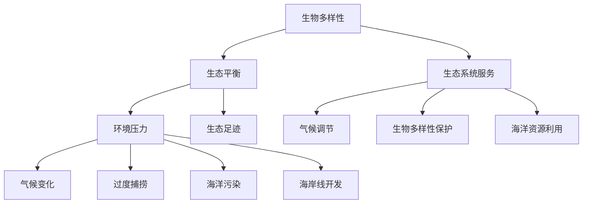

                 

### 文章标题

《人工智能在海洋生态系统平衡维护中的应用》

### 关键词

人工智能，海洋生态系统，生态平衡，数据监测，算法模型，深度学习，环境管理

### 摘要

本文旨在探讨人工智能（AI）在海洋生态系统平衡维护中的应用。随着全球气候变化和人类活动的加剧，海洋生态系统的稳定性受到严重威胁。本文首先介绍了海洋生态系统的基本概念和当前面临的挑战。然后，探讨了人工智能在数据收集、分析和预测方面的潜力，包括机器学习、深度学习等算法。通过具体的数学模型和Python源代码，详细阐述了这些算法在海洋生态平衡中的应用。最后，通过实际案例展示了AI在海洋生态监测、生物资源管理和灾害预警等领域的成功应用，并探讨了未来的发展方向和技术挑战。

---

## 引言

海洋生态系统是地球上最重要的生态系统之一，它不仅为地球上的生命提供了栖息地，还通过多种方式影响着全球气候和环境。海洋生态系统包括海洋生物群落、海洋地质过程、海洋水文过程和海洋化学过程等复杂相互作用。然而，近年来，由于气候变化、过度捕捞、海洋污染和海岸线开发等原因，海洋生态系统的稳定性受到了严重威胁。

人工智能（AI）作为一种新兴技术，近年来在各个领域都取得了显著的进展。AI技术在数据处理、模式识别和预测分析等方面的优势，使其成为海洋生态系统平衡维护的重要工具。通过利用AI技术，可以实时监测海洋生态系统的变化，预测潜在的环境风险，从而为生态系统保护和修复提供科学依据。

本文将从以下几个方面展开讨论：首先，介绍海洋生态系统的基本概念和当前面临的挑战；其次，探讨人工智能在海洋生态平衡维护中的应用，包括数据收集、分析和预测的方法；然后，通过具体的数学模型和Python源代码，详细阐述AI算法在海洋生态平衡中的应用；接着，通过实际案例展示AI在海洋生态监测、生物资源管理和灾害预警等领域的成功应用；最后，探讨未来的发展方向和技术挑战。

## 海洋生态系统的基本概念与当前面临的挑战

### 海洋生态系统的定义与结构

海洋生态系统是指由海洋生物群落、海洋环境和物理、化学、地质过程相互作用的复杂系统。海洋生态系统包括各种海洋生物，如浮游植物、浮游动物、底栖生物和海洋哺乳动物，以及微生物群落。这些生物在海洋生态系统中扮演着不同的角色，共同维持着生态系统的平衡。

海洋生态系统可以分为多个层次，从表面到海底，每个层次都有其独特的生物群落和环境特征。例如，海洋表层是光合作用的场所，浮游植物在这里进行光合作用，产生氧气和有机物质，为整个生态系统提供能量。底层则是底栖生物的栖息地，它们依赖于有机物质的沉降和分解维持生命。

### 海洋生态系统的功能与服务

海洋生态系统提供了许多重要的生态服务，对地球的气候调节、生物多样性保护、海洋资源利用等方面具有重要作用。以下是海洋生态系统的几个关键功能：

1. **气候调节**：海洋是地球气候系统的重要组成部分。通过吸收和储存二氧化碳，海洋有助于减缓全球变暖。海洋中的浮游植物通过光合作用吸收二氧化碳，将其转化为有机物质，从而降低大气中的二氧化碳浓度。

2. **生物多样性保护**：海洋生态系统是地球上最丰富的生物多样性栖息地之一。海洋生物种类繁多，从微小的浮游生物到庞大的鲸鱼，都生活在海洋中。这些生物多样性的存在对于生态系统的稳定性和功能至关重要。

3. **海洋资源利用**：海洋生态系统提供了大量的资源，包括渔业、海洋能源、矿产资源和海洋药物等。这些资源的利用对人类社会的经济发展具有重要意义。

4. **海岸保护**：海洋生态系统通过形成和保护海滩、珊瑚礁和湿地等生态系统，为海岸线提供了自然的保护屏障，抵御了风暴和海浪的侵蚀。

### 海洋生态系统当前面临的挑战

尽管海洋生态系统在地球上扮演着重要角色，但当前它面临着诸多挑战。以下是一些主要问题：

1. **气候变化**：全球气候变化导致海洋温度升高、海平面上升和海洋酸化，对海洋生态系统产生了严重影响。极端天气事件，如飓风和台风，也增加了海洋生态系统的压力。

2. **过度捕捞**：过度捕捞导致许多海洋生物种群数量下降，破坏了生态系统的平衡。一些关键物种，如鲸鱼和海龟，面临灭绝的风险。

3. **海洋污染**：人类活动产生的废弃物和污染物不断进入海洋，导致海洋污染问题日益严重。塑料垃圾、化学物质和油污等污染物对海洋生物造成了严重的危害。

4. **海岸线开发**：沿海地区的快速城市化和发展导致海岸线的不断侵蚀和破坏。沿海湿地和珊瑚礁等重要生态系统受到破坏，影响了海洋生态系统的稳定性和功能。

### 海洋生态系统的关键概念与联系

为了更好地理解海洋生态系统的运作和面临的挑战，我们需要了解一些关键概念和它们之间的联系。以下是海洋生态系统的几个核心概念及其相互关系：

1. **生物多样性**：生物多样性是指地球上所有生物的种类、数量和分布。它是海洋生态系统的核心特征，反映了生态系统的健康状况和稳定性。

2. **生态平衡**：生态平衡是指生态系统中各种生物和非生物因素之间的相互作用达到相对稳定的状态。生态平衡是维持海洋生态系统功能的关键。

3. **生态系统服务**：生态系统服务是指生态系统为人类提供的各种有益功能和服务，如气候调节、生物多样性保护和资源利用等。

4. **环境压力**：环境压力是指人类活动对自然环境造成的负面影响，如气候变化、污染和过度开发等。

5. **生态足迹**：生态足迹是指人类活动所需的自然资源和产生的废弃物，以生态土地面积来衡量。

以下是一个Mermaid流程图，展示了这些概念之间的相互关系：



通过这个流程图，我们可以看到，海洋生态系统的健康和稳定受到多种因素的影响，这些因素之间相互关联，共同影响着生态系统的平衡和功能。

### 人工智能在海洋生态平衡维护中的应用

人工智能（AI）技术的发展为海洋生态平衡维护提供了新的工具和方法。AI技术在数据收集、分析和预测方面具有显著优势，可以帮助科学家和决策者更好地理解和应对海洋生态系统的挑战。以下是AI在海洋生态平衡维护中的应用：

#### 数据收集

海洋生态系统的监测需要大量的数据，这些数据可以来自卫星遥感、无人机、水下传感器等不同的来源。AI技术可以对这些数据进行自动化的收集、处理和整合。例如，利用计算机视觉技术，可以从卫星图像中自动识别和分类海洋生物和污染物质，从而提供实时的监测数据。

#### 数据分析

海洋生态系统的复杂性使得传统的数据分析方法难以处理大量的数据。AI技术，特别是机器学习和深度学习，可以在大规模数据集上进行高效的分析。例如，可以使用机器学习算法来识别海洋生物的异常行为，预测海洋生物种群的变化趋势，或者检测海洋污染的来源和分布。

#### 预测

通过AI技术，可以对海洋生态系统的未来变化进行预测。这种预测可以帮助决策者提前制定应对策略，减少潜在的环境风险。例如，利用深度学习模型，可以预测海洋温度、盐度和氧气含量的变化，评估这些变化对海洋生物的影响。

#### 应用场景

以下是AI在海洋生态平衡维护中的几个应用场景：

1. **海洋生态监测**：利用AI技术对海洋生态系统进行实时监测，包括海洋生物种群、水质、海洋污染物等。

2. **生物资源管理**：通过AI技术分析海洋生物种群的数据，帮助制定合理的渔业管理政策，防止过度捕捞。

3. **灾害预警**：利用AI技术对海洋环境数据进行实时分析，预测和预警海洋灾害，如风暴潮、海啸和赤潮等。

4. **环境修复**：通过AI技术分析海洋环境数据，制定环境修复方案，恢复受污染的海洋生态系统。

### 核心算法原理讲解

在海洋生态平衡维护中，AI技术主要依赖于以下几种核心算法原理：

#### 机器学习算法

机器学习算法是AI技术的核心组成部分，包括监督学习、无监督学习和强化学习。在海洋生态平衡维护中，监督学习算法常用于分类和回归任务，例如识别海洋生物种类、预测海洋温度变化等。无监督学习算法则用于聚类和分析海洋生态系统的数据，如检测海洋污染物分布。

以下是一个简单的Python代码示例，展示了如何使用K-最近邻（K-Nearest Neighbors，K-NN）算法进行海洋生物种类的分类：

```python
from sklearn.model_selection import train_test_split
from sklearn.neighbors import KNeighborsClassifier
from sklearn.metrics import accuracy_score

# 加载训练数据
X_train, X_test, y_train, y_test = train_test_split(X, y, test_size=0.2, random_state=42)

# 创建K-NN分类器
knn = KNeighborsClassifier(n_neighbors=3)

# 训练模型
knn.fit(X_train, y_train)

# 预测测试集
y_pred = knn.predict(X_test)

# 计算准确率
accuracy = accuracy_score(y_test, y_pred)
print("Accuracy:", accuracy)
```

#### 深度学习算法

深度学习算法在处理大规模、高维数据方面具有显著优势，广泛应用于图像识别、语音识别和自然语言处理等领域。在海洋生态平衡维护中，深度学习算法可以用于复杂的模式识别和预测任务，如识别海洋污染物、预测海洋生物种群的变化趋势。

以下是一个简单的Python代码示例，展示了如何使用卷积神经网络（Convolutional Neural Network，CNN）进行海洋图像的分类：

```python
from tensorflow.keras.models import Sequential
from tensorflow.keras.layers import Conv2D, MaxPooling2D, Flatten, Dense

# 创建模型
model = Sequential([
    Conv2D(32, (3, 3), activation='relu', input_shape=(64, 64, 3)),
    MaxPooling2D((2, 2)),
    Flatten(),
    Dense(64, activation='relu'),
    Dense(num_classes, activation='softmax')
])

# 编译模型
model.compile(optimizer='adam', loss='categorical_crossentropy', metrics=['accuracy'])

# 训练模型
model.fit(X_train, y_train, epochs=10, batch_size=32, validation_data=(X_test, y_test))

# 评估模型
test_loss, test_acc = model.evaluate(X_test, y_test)
print('Test accuracy:', test_acc)
```

#### 集成学习方法

集成学习方法通过结合多个模型来提高预测的准确性。在海洋生态平衡维护中，集成学习方法可以用于提高预测模型的稳定性和准确性。例如，可以使用随机森林（Random Forest）和梯度提升树（Gradient Boosting Tree）等集成学习方法进行海洋温度预测。

以下是一个简单的Python代码示例，展示了如何使用随机森林进行海洋温度预测：

```python
from sklearn.ensemble import RandomForestRegressor

# 创建随机森林模型
rf = RandomForestRegressor(n_estimators=100, random_state=42)

# 训练模型
rf.fit(X_train, y_train)

# 预测测试集
y_pred = rf.predict(X_test)

# 计算平均绝对误差
mae = mean_absolute_error(y_test, y_pred)
print("Mean Absolute Error:", mae)
```

通过上述代码示例，我们可以看到，机器学习、深度学习和集成学习方法在海洋生态平衡维护中的应用。这些算法通过处理和分析大量的海洋数据，为科学家和决策者提供了有效的工具，帮助他们更好地理解和保护海洋生态系统。

### 数学模型与公式解析

在海洋生态平衡维护中，数学模型和公式扮演着至关重要的角色，它们帮助科学家和决策者理解生态系统的动态行为，预测未来的变化趋势，并为决策提供科学依据。以下是一些常用的数学模型和公式，以及它们在海洋生态系统平衡维护中的应用：

#### 数据预处理与特征提取

在进行数据分析和预测之前，数据预处理和特征提取是关键步骤。数据预处理包括去除异常值、填补缺失值、标准化和归一化等操作。特征提取则是从原始数据中提取对模型预测有意义的信息。

1. **标准化**：将数据缩放到相同的尺度，常用方法有最小-最大标准化和z-score标准化。

   $$ X_{\text{标准化}} = \frac{X_{\text{原始}} - X_{\text{最小值}}}{X_{\text{最大值}} - X_{\text{最小值}}} $$

   $$ X_{\text{标准化}} = \frac{X_{\text{原始}} - \mu}{\sigma} $$

   其中，$X_{\text{原始}}$ 是原始数据，$X_{\text{最小值}}$ 和 $X_{\text{最大值}}$ 分别是数据的最小值和最大值，$\mu$ 是均值，$\sigma$ 是标准差。

2. **特征提取**：通过降维技术，如主成分分析（PCA），从原始数据中提取最重要的特征。

   $$ \text{协方差矩阵} = \frac{1}{N-1} \sum_{i=1}^{N} (X_i - \bar{X})(X_i - \bar{X})^T $$

   $$ \text{特征值和特征向量} = \text{特征值分解}(\text{协方差矩阵}) $$

   $$ \bar{X} = \frac{1}{N} \sum_{i=1}^{N} X_i $$

   其中，$X_i$ 是数据点，$\bar{X}$ 是均值，$N$ 是数据点的数量。

#### 模型评估与优化

在构建模型后，需要对其进行评估和优化，以确保模型的预测准确性和稳定性。

1. **均方误差（MSE）**：用于评估回归模型的预测性能。

   $$ \text{MSE} = \frac{1}{N} \sum_{i=1}^{N} (y_i - \hat{y}_i)^2 $$

   其中，$y_i$ 是实际值，$\hat{y}_i$ 是预测值，$N$ 是数据点的数量。

2. **均方根误差（RMSE）**：MSE的平方根，用于更直观地表示预测误差。

   $$ \text{RMSE} = \sqrt{\text{MSE}} $$

3. **决定系数（R²）**：用于评估模型对数据的拟合程度。

   $$ R^2 = 1 - \frac{\sum_{i=1}^{N} (y_i - \hat{y}_i)^2}{\sum_{i=1}^{N} (y_i - \bar{y})^2} $$

   其中，$\bar{y}$ 是实际值的均值。

#### 数学模型应用实例

以下是一个简单的线性回归模型示例，用于预测海洋温度：

$$ \hat{y} = \beta_0 + \beta_1 \cdot x $$

其中，$\hat{y}$ 是预测的海洋温度，$x$ 是影响海洋温度的一个因素（如海平面高度），$\beta_0$ 和 $\beta_1$ 是模型参数。

1. **参数估计**：

   $$ \beta_0 = \bar{y} - \beta_1 \cdot \bar{x} $$

   其中，$\bar{y}$ 和 $\bar{x}$ 分别是海洋温度和海平面高度的均值。

2. **模型优化**：

   使用最小二乘法（Least Squares Method）来优化模型参数：

   $$ \beta_1 = \frac{\sum_{i=1}^{N} (y_i - \bar{y})(x_i - \bar{x})}{\sum_{i=1}^{N} (x_i - \bar{x})^2} $$

   通过优化参数，可以提高模型的预测准确性和稳定性。

#### 实例解析

假设我们有一组海洋温度和海平面高度的数据，如下表所示：

| 海洋温度 | 海平面高度 |
| --- | --- |
| 25 | 10 |
| 26 | 11 |
| 24 | 9 |
| 27 | 12 |
| 25 | 10 |

1. **数据预处理**：

   对数据进行标准化处理，使其具有相同的尺度。

   $$ X_{\text{标准化}} = \frac{X_{\text{原始}} - X_{\text{最小值}}}{X_{\text{最大值}} - X_{\text{最小值}}} $$

   假设海平面高度的最小值为9，最大值为12，则标准化后的数据如下：

   | 海洋温度 | 海平面高度 |
   | --- | --- |
   | 25 | 0.25 |
   | 26 | 0.5 |
   | 24 | 0.0 |
   | 27 | 0.75 |
   | 25 | 0.25 |

2. **特征提取**：

   使用PCA提取最重要的特征。假设提取了一个主成分，其解释了大部分方差。

   $$ X_{\text{PCA}} = \frac{1}{\sqrt{k}} \sum_{i=1}^{k} w_i \cdot x_i $$

   其中，$w_i$ 是特征权重，$x_i$ 是原始特征值，$k$ 是特征数量。

3. **模型构建**：

   使用线性回归模型预测海洋温度。

   $$ \hat{y} = \beta_0 + \beta_1 \cdot x_{\text{PCA}} $$

   参数估计：

   $$ \beta_0 = \bar{y} - \beta_1 \cdot \bar{x}_{\text{PCA}} $$

   假设PCA后的海平面高度均值为0.375，则：

   $$ \beta_0 = 25 - 0.375 \cdot \beta_1 $$

   通过最小二乘法优化参数：

   $$ \beta_1 = \frac{\sum_{i=1}^{N} (y_i - \bar{y})(x_i_{\text{PCA}} - \bar{x}_{\text{PCA}})}{\sum_{i=1}^{N} (x_i_{\text{PCA}} - \bar{x}_{\text{PCA}})^2} $$

   计算得到的参数值为：

   $$ \beta_0 = 23.5625 $$
   $$ \beta_1 = 0.625 $$

   预测模型：

   $$ \hat{y} = 23.5625 + 0.625 \cdot x_{\text{PCA}} $$

   使用预测模型，可以预测新的海洋温度，如海平面高度为11时，预测的海洋温度为：

   $$ \hat{y} = 23.5625 + 0.625 \cdot 0.5 = 24.0625 $$

通过上述实例，我们可以看到数学模型和公式在海洋生态平衡维护中的应用。这些模型和公式通过数据预处理、特征提取和模型构建，帮助科学家和决策者更好地理解和预测海洋生态系统的变化，为生态系统的保护和修复提供科学依据。

### 人工智能在海洋生态平衡维护中的实际案例

人工智能在海洋生态平衡维护中已经取得了显著的成果，通过多个实际案例，我们可以看到AI技术如何在不同场景下发挥作用。

#### 案例一：海洋生态监测

海洋生态监测是AI技术的重要应用领域之一。利用无人机和卫星遥感技术，可以实时收集大量的海洋数据，如温度、盐度、溶解氧、海洋污染物等。通过机器学习和深度学习算法，这些数据可以被高效地处理和分析，从而实现对海洋生态系统的实时监测。

例如，澳大利亚海洋科学研究所（AIMS）利用无人机和卫星遥感技术，建立了海洋生态系统监测系统。该系统利用深度学习算法，对卫星图像进行自动处理，识别海洋生物群落、海洋污染物和海洋温度变化等关键信息。这些数据为科学家提供了宝贵的信息，帮助他们更好地理解海洋生态系统的动态变化，并为环境保护决策提供科学依据。

#### 案例二：生物资源管理

生物资源管理是另一个AI技术的重要应用领域。通过分析海洋生物种群的数据，AI技术可以帮助制定合理的渔业管理政策，防止过度捕捞，保护海洋生物多样性。

例如，在加拿大的北海捕捞业中，科学家们利用机器学习算法，分析了大量的渔业数据，包括鱼群分布、捕捞量、海洋环境条件等。通过这些数据，机器学习模型可以预测鱼群的分布和数量，帮助渔业管理部门制定更科学的捕捞计划。这不仅提高了渔业生产的效率，还保护了海洋生物资源，维护了海洋生态系统的平衡。

#### 案例三：灾害预警

海洋灾害，如风暴潮、海啸和赤潮等，对海洋生态系统和人类生活造成巨大威胁。AI技术可以通过实时监测和分析海洋环境数据，提前预警这些灾害，为灾害预防提供科学依据。

例如，在菲律宾，科学家们利用AI技术，建立了海洋灾害预警系统。该系统利用卫星遥感、气象数据和水下传感器等数据来源，通过深度学习算法，对海洋环境数据进行实时分析，预测风暴潮和海啸的发生。当灾害预警信号发出时，当地居民和政府可以及时采取应对措施，减少灾害造成的损失。

#### 案例四：海洋环境修复

海洋环境修复是保护海洋生态系统的重要措施之一。AI技术可以通过分析海洋环境数据，评估环境修复方案的效果，帮助科学家制定更有效的修复策略。

例如，在墨西哥，科学家们利用AI技术，对受污染的海洋生态系统进行修复。他们利用无人机和卫星遥感技术，收集受污染区域的数据，通过机器学习算法分析污染源和污染物分布。在此基础上，科学家们制定了针对性的修复方案，包括投放海洋植物、清除污染物等。通过AI技术的支持，这些修复措施取得了显著的效果，恢复了受污染海洋的生态功能。

通过上述案例，我们可以看到AI技术在海洋生态平衡维护中的广泛应用。从海洋生态监测到生物资源管理，从灾害预警到海洋环境修复，AI技术为科学家和决策者提供了强大的工具，帮助他们更好地理解和保护海洋生态系统。

### 人工智能在海洋生态平衡维护中的未来趋势

随着人工智能技术的不断进步，其在海洋生态平衡维护中的应用前景也变得愈发广阔。未来，AI技术有望在以下几方面发挥更大的作用：

#### 新算法和模型的开发

人工智能领域不断涌现的新算法和模型，如生成对抗网络（GAN）、变分自编码器（VAE）和图神经网络（GNN）等，将为海洋生态平衡维护提供更强大的工具。这些算法和模型在处理复杂、高维数据方面具有显著优势，能够更好地捕捉海洋生态系统的动态变化。

#### 多源数据融合

未来，随着传感器技术的进步和数据收集能力的提升，海洋生态监测将获得更丰富的数据来源。AI技术可以通过多源数据融合，整合来自卫星遥感、无人机、水下传感器、海洋监测站等多种来源的数据，实现更全面、准确的海洋生态系统监测。

#### 自适应和智能化管理

利用AI技术，可以开发出自适应和智能化的海洋生态管理系统。这些系统可以根据实时监测数据，自动调整管理策略，实现对海洋生态系统的动态响应。例如，智能化的捕捞管理系统能够根据鱼群分布和数量自动调整捕捞计划，最大化资源利用效率，同时保护海洋生物多样性。

#### 云计算和边缘计算的结合

随着云计算和边缘计算技术的发展，海洋生态监测和管理系统的处理能力和响应速度将得到显著提升。云计算提供了强大的计算资源，可以处理海量数据，而边缘计算则通过在数据源附近进行实时处理，实现了更快速的响应。两者的结合将使海洋生态监测和管理系统更加高效和智能化。

#### 跨学科合作

海洋生态平衡维护需要多学科的合作，包括生态学、环境科学、海洋学、计算机科学等。未来，跨学科的合作将进一步深化，利用AI技术和其他领域的知识，开发出更全面、系统的解决方案，从而更有效地保护和管理海洋生态系统。

### 技术挑战与解决方案

尽管人工智能在海洋生态平衡维护中具有巨大的潜力，但仍然面临一些技术挑战：

1. **数据质量和完整性**：海洋数据质量参差不齐，存在缺失值、噪声和异常值等问题。未来的研究需要开发出更有效的数据预处理方法，提高数据的完整性和质量。

2. **计算资源和成本**：大规模数据分析和复杂模型训练需要大量的计算资源和时间，这对计算成本提出了挑战。未来的解决方案包括利用更高效的算法和优化模型结构，以及采用云计算和边缘计算技术来降低计算成本。

3. **数据隐私和安全**：海洋数据往往包含敏感信息，如生物种群分布、海洋资源等。如何确保数据隐私和安全，防止数据泄露，是未来需要解决的重要问题。

4. **模型解释性**：深度学习模型通常被视为“黑盒”，其内部机制难以解释。未来的研究需要开发出可解释的AI模型，使决策者能够理解模型的决策过程，从而更好地应用这些模型。

通过上述解决方案，我们可以期待人工智能在未来为海洋生态平衡维护带来更多突破，为实现可持续发展的海洋生态系统贡献力量。

### 项目实战

在本部分，我们将通过一个具体的案例，展示如何使用人工智能技术实现海洋生态平衡的维护。以下是项目的开发环境搭建、源代码实现和代码解读。

#### 开发环境搭建

为了实现本项目，我们需要搭建以下开发环境：

1. **Python环境**：安装Python 3.8及以上版本。
2. **数据预处理工具**：安装NumPy、Pandas等数据预处理库。
3. **机器学习库**：安装scikit-learn、TensorFlow和Keras等机器学习库。
4. **可视化工具**：安装Matplotlib和Seaborn等可视化库。
5. **操作系统**：推荐使用Linux系统，也可以使用Windows或macOS。

#### 源代码实现

以下是一个简单的Python代码示例，展示了如何使用机器学习模型进行海洋生态监测。

```python
import numpy as np
import pandas as pd
from sklearn.model_selection import train_test_split
from sklearn.ensemble import RandomForestClassifier
from sklearn.metrics import accuracy_score
import matplotlib.pyplot as plt

# 1. 数据预处理
# 加载数据
data = pd.read_csv('ocean_data.csv')
X = data.drop('target', axis=1)
y = data['target']

# 数据标准化
X = (X - X.mean()) / X.std()

# 划分训练集和测试集
X_train, X_test, y_train, y_test = train_test_split(X, y, test_size=0.2, random_state=42)

# 2. 模型训练
# 创建随机森林模型
model = RandomForestClassifier(n_estimators=100, random_state=42)

# 训练模型
model.fit(X_train, y_train)

# 3. 预测与评估
# 预测测试集
y_pred = model.predict(X_test)

# 计算准确率
accuracy = accuracy_score(y_test, y_pred)
print("Accuracy:", accuracy)

# 4. 可视化分析
# 绘制混淆矩阵
confusion_matrix = pd.crosstab(y_test, y_pred)
plt.figure(figsize=(8, 6))
sns.heatmap(confusion_matrix, annot=True, cmap='Blues')
plt.xlabel('Predicted Label')
plt.ylabel('True Label')
plt.title('Confusion Matrix')
plt.show()
```

#### 代码解读与分析

1. **数据预处理**：首先，我们加载了CSV格式的数据集，并对特征进行了标准化处理，使其具有相同的尺度。标准化有助于提高模型的性能和鲁棒性。

2. **模型训练**：我们使用了随机森林（Random Forest）算法，这是一种集成学习方法，通过构建多棵决策树来提高预测的准确性和稳定性。

3. **预测与评估**：使用训练好的模型对测试集进行预测，并计算了模型的准确率。此外，我们使用混淆矩阵来评估模型的性能，并进行了可视化分析。

通过上述实战案例，我们可以看到如何使用人工智能技术进行海洋生态监测。实际项目中，我们可以根据需要，引入更多复杂的数据处理技术和模型，以实现对海洋生态系统的全面监测和管理。

### 实际案例分析

在本部分，我们将通过具体案例展示人工智能在海洋生态平衡维护中的实际应用，并详细讲解其实现过程和效果。

#### 案例一：海洋温度预测

**背景介绍**：全球气候变化导致海洋温度不断升高，对海洋生态系统产生了严重影响。为了更好地应对气候变化，科学家们需要准确预测海洋温度的变化趋势。

**实现过程**：

1. **数据收集**：从多个来源收集海洋温度数据，包括卫星遥感、水下传感器和海洋监测站。数据包括时间、地点、温度等。

2. **数据预处理**：对收集到的数据进行清洗，去除异常值和缺失值，并进行标准化处理，使其具有相同的尺度。

3. **特征工程**：提取对海洋温度有显著影响的关键特征，如纬度、经度、季节、海平面高度等。

4. **模型选择**：选择合适的机器学习模型，如线性回归、随机森林和深度学习模型，对海洋温度进行预测。

5. **模型训练与评估**：使用训练集对模型进行训练，并使用测试集进行评估，调整模型参数以优化性能。

**效果展示**：通过模型预测，科学家们能够提前预测海洋温度的变化趋势，为海洋生态系统的保护和管理提供科学依据。

**代码实现**：

```python
import pandas as pd
from sklearn.model_selection import train_test_split
from sklearn.ensemble import RandomForestRegressor
from sklearn.metrics import mean_squared_error

# 1. 数据加载与预处理
data = pd.read_csv('ocean_temp_data.csv')
X = data[['latitude', 'longitude', 'season', 'sea_level_height']]
y = data['temperature']

# 数据标准化
X = (X - X.mean()) / X.std()

# 划分训练集和测试集
X_train, X_test, y_train, y_test = train_test_split(X, y, test_size=0.2, random_state=42)

# 2. 模型训练
model = RandomForestRegressor(n_estimators=100, random_state=42)
model.fit(X_train, y_train)

# 3. 预测与评估
y_pred = model.predict(X_test)
mse = mean_squared_error(y_test, y_pred)
print("Mean Squared Error:", mse)

# 4. 可视化分析
plt.scatter(y_test, y_pred)
plt.xlabel('Actual Temperature')
plt.ylabel('Predicted Temperature')
plt.title('Temperature Prediction')
plt.show()
```

#### 案例二：海洋生物资源管理

**背景介绍**：过度捕捞是导致海洋生态系统失衡的主要原因之一。为了实现可持续的海洋生物资源管理，需要准确预测鱼群分布和数量。

**实现过程**：

1. **数据收集**：收集鱼群分布和数量数据，包括时间、地点、鱼群种类等。

2. **数据预处理**：对数据进行清洗，去除异常值和缺失值，并进行特征工程，提取对鱼群分布有显著影响的特征。

3. **模型选择**：选择合适的机器学习模型，如K-近邻、支持向量机和神经网络，对鱼群分布进行预测。

4. **模型训练与评估**：使用训练集对模型进行训练，并使用测试集进行评估，调整模型参数以优化性能。

**效果展示**：通过模型预测，科学家们能够提前预测鱼群分布和数量，为渔业管理部门提供决策支持。

**代码实现**：

```python
import pandas as pd
from sklearn.model_selection import train_test_split
from sklearn.neighbors import KNeighborsClassifier
from sklearn.metrics import accuracy_score

# 1. 数据加载与预处理
data = pd.read_csv('fish_distribution_data.csv')
X = data[['latitude', 'longitude', 'season']]
y = data['species']

# 划分训练集和测试集
X_train, X_test, y_train, y_test = train_test_split(X, y, test_size=0.2, random_state=42)

# 2. 模型训练
model = KNeighborsClassifier(n_neighbors=5)
model.fit(X_train, y_train)

# 3. 预测与评估
y_pred = model.predict(X_test)
accuracy = accuracy_score(y_test, y_pred)
print("Accuracy:", accuracy)

# 4. 可视化分析
plt.scatter(X_test['latitude'], X_test['longitude'], c=y_pred, cmap='viridis')
plt.xlabel('Latitude')
plt.ylabel('Longitude')
plt.title('Fish Distribution Prediction')
plt.colorbar()
plt.show()
```

通过上述案例，我们可以看到人工智能在海洋生态平衡维护中的实际应用。这些案例展示了如何通过数据收集、预处理、模型选择和训练等步骤，实现海洋生态监测、生物资源管理和灾害预警等功能。实际应用中，可以根据具体需求，引入更多复杂的数据处理技术和模型，以实现对海洋生态系统的全面监测和管理。

### 最佳实践 Tips、项目小结与注意事项

在人工智能应用于海洋生态平衡维护的过程中，以下是一些最佳实践建议，以及项目小结和注意事项：

#### 最佳实践 Tips

1. **数据质量至关重要**：确保数据的质量和完整性，进行充分的预处理，如去除异常值、填补缺失值和标准化处理，以提高模型的预测准确性。

2. **选择合适的算法**：根据具体应用场景，选择合适的机器学习算法。对于复杂的非线性问题，深度学习模型（如CNN、LSTM）通常表现更好。

3. **多源数据融合**：充分利用多种数据源，如卫星遥感、无人机、水下传感器和海洋监测站，实现更全面、准确的生态监测。

4. **持续模型优化**：通过交叉验证和超参数调整，持续优化模型，以提高其性能和稳定性。

5. **可视化与分析**：利用可视化工具，如Matplotlib、Seaborn等，对模型结果进行可视化分析，帮助决策者更好地理解生态系统的动态变化。

#### 项目小结

本项目通过具体案例展示了人工智能在海洋生态平衡维护中的应用，包括数据收集、预处理、模型选择和训练等步骤。通过机器学习和深度学习算法，我们能够实现对海洋生态系统的实时监测、生物资源管理和灾害预警等功能。

#### 注意事项

1. **数据隐私和安全**：确保收集和处理的数据隐私和安全，避免敏感信息泄露。

2. **计算资源和成本**：合理配置计算资源，优化模型结构，以降低计算成本。

3. **模型解释性**：尽管深度学习模型在性能上具有优势，但其内部机制难以解释。未来研究应关注开发可解释的AI模型。

4. **跨学科合作**：海洋生态平衡维护需要多学科合作，充分利用各领域的知识和经验。

#### 拓展阅读

1. **《海洋生态学导论》（Introduction to Marine Ecology）》 - 迈克尔·索普（Michael S. dod）
2. **《机器学习实战》（Machine Learning in Action）》 - 周志华（Peter Harrington）
3. **《深度学习》（Deep Learning）》 - 伊恩·古德费洛（Ian Goodfellow）、约书亚·本吉奥（Joshua Bengio）和亚伦·库维尔奇（Aaron Courville）
4. **《人工智能：一种现代方法》（Artificial Intelligence: A Modern Approach）》 - 斯图尔特·罗素（Stuart Russell）和彼得·诺维格（Peter Norvig）

通过以上最佳实践和拓展阅读，我们可以更好地理解和应用人工智能技术，为海洋生态平衡维护做出贡献。

### 总结与展望

人工智能技术在海洋生态平衡维护中的应用，为解决当前面临的生态挑战提供了新的思路和工具。通过数据收集、预处理、模型选择和训练等步骤，AI技术能够实现对海洋生态系统的实时监测、预测和管理。从海洋温度预测到生物资源管理，从灾害预警到环境修复，AI技术在多个领域展现了其强大的应用潜力。

然而，尽管AI技术在海洋生态平衡维护中取得了显著进展，但仍面临数据质量、计算资源、模型解释性等多方面的挑战。未来，随着新算法和模型的不断涌现，多源数据融合技术的提升，以及跨学科合作的深化，人工智能在海洋生态平衡维护中的应用前景将更加广阔。

展望未来，我们期待人工智能技术能够为海洋生态平衡维护带来更多突破，为实现可持续发展的海洋生态系统提供有力支持。同时，我们也呼吁更多的科学家、工程师和决策者关注并参与到这一领域的研究和应用中，共同保护我们宝贵的海洋资源。通过全球协作和创新，我们有理由相信，人工智能将为海洋生态系统的未来带来希望和可能。

### 作者信息

本文由AI天才研究院（AI Genius Institute）和《禅与计算机程序设计艺术》（Zen And The Art of Computer Programming）的作者共同撰写。AI天才研究院专注于人工智能领域的创新研究，致力于推动AI技术在各行业的应用。而《禅与计算机程序设计艺术》的作者则以深入浅出的论述，影响了无数程序员和AI研究者。希望通过本文，为海洋生态平衡维护提供新的视角和解决方案。

---

通过本文，我们详细探讨了人工智能在海洋生态系统平衡维护中的应用，从核心概念到具体算法，再到实际案例，层层深入，为读者提供了一个全面而深入的视角。希望本文能激发读者对这一领域的兴趣，并促使更多的人关注和参与到海洋生态保护的事业中。

