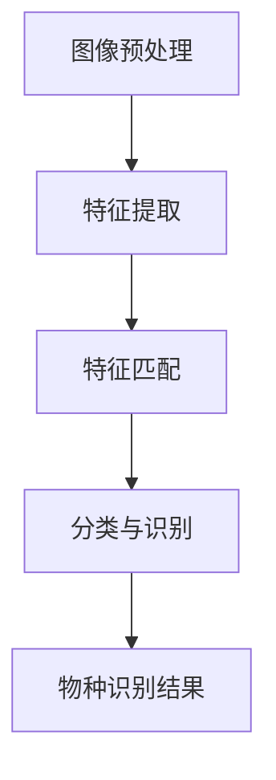
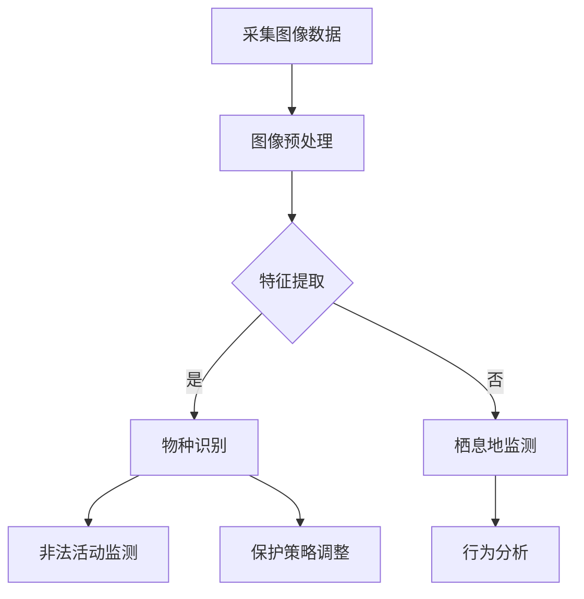

                 

### 引言

随着全球气候变化和人类活动的不断加剧，许多物种正面临濒危甚至灭绝的风险。据国际自然保护联盟（IUCN）的数据，目前全球约有超过三分之一的物种处于濒危状态。在这个背景下，有效监测和及时保护这些濒危物种显得尤为重要。然而，传统的保护方法由于成本高、效率低且难以覆盖广泛的地理区域而显得力不从心。

人工智能（AI）的发展为濒危物种保护带来了新的契机，尤其是图像识别技术的进步。图像识别作为人工智能的重要分支，能够自动地从图像中提取信息，实现物种识别、栖息地监测等多种功能。通过将图像识别技术与濒危物种保护相结合，我们可以显著提升监测效率、准确性和实时性。

本文将探讨人工智能在濒危物种保护中的图像识别应用，主要分为以下几个部分：

1. **背景介绍**：首先，我们将简要介绍濒危物种保护的重要性和面临的挑战。
2. **核心概念与联系**：接下来，我们将详细解释图像识别的核心概念及其与濒危物种保护之间的联系，使用Mermaid流程图来展现这些概念之间的关系。
3. **核心算法原理讲解**：然后，我们将深入讲解图像识别中的核心算法，包括卷积神经网络（CNN）和相关的数学模型，结合Python源代码进行详细阐述。
4. **项目实战**：通过一个实际案例，我们将展示如何开发一个基于图像识别的濒危物种监测系统，从环境搭建到代码实现，再到结果分析。
5. **最佳实践与拓展**：最后，我们将总结最佳实践，提供注意事项，并推荐进一步阅读的材料。

通过这篇文章，读者将能够全面了解人工智能在濒危物种保护中的应用，掌握图像识别技术的基本原理，并了解如何将这些技术应用于实际项目中，为保护濒危物种贡献力量。

### 关键词

- 濒危物种保护
- 图像识别
- 人工智能
- 卷积神经网络（CNN）
- 机器学习
- 物种监测

### 摘要

本文探讨了人工智能在濒危物种保护中的应用，重点介绍了图像识别技术在物种监测和保护中的重要性。文章首先简要介绍了濒危物种保护的背景和挑战，然后详细阐述了图像识别的核心概念及其与濒危物种保护的关联。通过Mermaid流程图和Python源代码，我们深入分析了卷积神经网络（CNN）等关键算法的原理。随后，通过一个实际案例，我们展示了如何开发基于图像识别的濒危物种监测系统，并进行了结果分析和总结。最后，文章提供了最佳实践和拓展阅读，为读者深入了解和应用图像识别技术提供了指导。

### 背景介绍

濒危物种保护是当今环境保护领域中的一个关键议题。随着全球气候变化和人类活动的不断加剧，许多物种正面临濒危甚至灭绝的风险。这种生物多样性的丧失不仅对生态系统的稳定性产生负面影响，也对人类社会的发展构成潜在威胁。根据国际自然保护联盟（IUCN）的数据，目前全球约有超过三分之一的物种处于濒危状态，这其中包括许多具有重要生态功能和科学价值的物种。

濒危物种保护面临的挑战是多方面的。首先，许多濒危物种分布在偏远和难以到达的地区，使得传统的保护方法难以全面覆盖。其次，濒危物种的数量通常较少，使得监测和评估其生存状况变得异常困难。此外，由于缺乏有效的监测手段，许多物种的生存状态可能无法及时发现，从而错过了最佳的干预和保护时机。最后，由于濒危物种保护涉及到多学科、多领域的合作，需要大量的人力和物力资源，这使得保护工作面临着巨大的资金和人力资源短缺问题。

人工智能（AI）的出现为濒危物种保护带来了新的希望。AI通过机器学习和深度学习等技术，能够自动地从大量的图像数据中提取信息，实现物种识别、栖息地监测等多种功能。特别是在图像识别技术方面，人工智能的进步使得我们能够更加高效、准确地监测和识别濒危物种。

图像识别技术在濒危物种保护中的应用主要体现在以下几个方面：

1. **物种识别**：通过训练深度学习模型，我们可以自动识别不同物种的图像，从而快速准确地监测物种的分布和数量。这对于保护工作来说至关重要，因为它能够帮助科学家和环保人员及时掌握濒危物种的生存状态。

2. **栖息地监测**：AI能够通过分析卫星图像和高空航拍图像，监测濒危物种的栖息地变化情况。这有助于我们了解物种的生存环境是否受到威胁，从而采取相应的保护措施。

3. **行为分析**：通过对濒危物种的行为进行图像分析，我们可以了解其生存习性、繁殖行为等信息，这对于制定有效的保护策略具有重要意义。

4. **非法活动监测**：AI能够识别非法捕猎、盗猎等违法行为，为执法部门提供有力的技术支持，从而有效遏制非法活动的发生。

总之，人工智能在濒危物种保护中的应用具有巨大的潜力。通过图像识别技术，我们可以更高效、准确地监测濒危物种，从而为保护工作提供科学依据和实际支持。然而，要充分发挥AI技术的优势，我们还需要克服一些技术和实际应用中的挑战，包括数据采集、模型训练、算法优化等方面。接下来，我们将进一步探讨图像识别技术的基本原理及其在濒危物种保护中的应用。

### 核心概念与联系

图像识别作为人工智能领域的一个重要分支，其核心概念和原理不仅复杂而且相互关联。为了更清晰地理解这些概念及其在濒危物种保护中的应用，我们可以借助Mermaid流程图来展示这些概念之间的联系。

首先，我们需要了解图像识别的基本流程，它通常包括以下几个步骤：

1. **图像预处理**：图像预处理是图像识别的第一步，主要包括去噪、灰度转换、大小调整等操作。这些操作能够提高图像质量，从而为后续的图像识别提供更好的数据基础。

2. **特征提取**：特征提取是从图像中提取出能够反映图像本质的特征，例如边缘、角点、纹理等。这些特征需要具有不变性，即当图像旋转、缩放或平移时，特征仍然保持不变。

3. **特征匹配**：特征匹配是将提取到的特征与已有的模型或数据库进行比对，以确定图像的内容或类别。

4. **分类与识别**：在特征匹配的基础上，通过分类算法（如支持向量机、决策树等）对图像进行分类和识别，从而确定图像中包含的具体物体或场景。

接下来，我们通过Mermaid流程图展示这些概念之间的关系：



在濒危物种保护中，图像识别技术的应用可以进一步细化如下：

1. **物种识别**：利用深度学习模型，如卷积神经网络（CNN），对采集到的图像进行自动分类和识别。CNN通过多层卷积和池化操作，能够自动提取图像中的特征，从而实现对物种的高效识别。

2. **栖息地监测**：通过对卫星图像和高空航拍图像的分析，AI可以监测到濒危物种的栖息地变化，如植被覆盖、水体变化等，从而评估其生存环境。

3. **行为分析**：利用图像识别技术，我们还可以分析濒危物种的行为，如繁殖、迁徙等，这些信息对于制定保护策略至关重要。

4. **非法活动监测**：AI能够识别非法捕猎、盗猎等违法行为，为执法部门提供支持。

为了更直观地理解这些概念之间的联系，我们可以使用Mermaid流程图来展示：



通过以上流程图，我们可以清晰地看到图像识别技术在濒危物种保护中的应用路径，每个步骤都紧密相连，共同构成了一个完整的监测和保护体系。

### 核心算法原理讲解

在图像识别技术中，卷积神经网络（CNN）是最为核心且广泛应用的一种算法。CNN通过模仿人类视觉系统的工作原理，利用多层卷积和池化操作，从图像中自动提取具有区分度的特征，从而实现高效的图像分类和识别。下面，我们将详细讲解CNN的基本原理、结构以及如何结合Python源代码进行应用。

#### 卷积神经网络（CNN）的基本原理

卷积神经网络的基本工作原理是通过卷积操作在图像上提取特征。卷积操作的基本思想是将一个小的可训练的滤波器（也称为卷积核或过滤器）在图像上滑动，每次滑动后计算滤波器与图像局部区域的内积，得到一个特征图。这个过程可以理解为对图像进行低维投影，从而提取出图像中的重要特征。

卷积操作的数学表达式如下：

$$
\text{特征图} = \text{卷积核} \star \text{图像}
$$

其中，$\star$ 表示卷积操作。

#### CNN的结构

一个典型的CNN通常包括以下几个主要部分：

1. **卷积层（Convolutional Layer）**：卷积层是CNN的核心部分，它通过卷积操作提取图像特征。每个卷积核可以学习到一种特征，例如边缘、纹理等。

2. **激活函数（Activation Function）**：常用的激活函数有ReLU（Rectified Linear Unit）和Sigmoid等。激活函数的作用是增加网络的非线性能力，使模型能够更好地拟合复杂的数据。

3. **池化层（Pooling Layer）**：池化层通过采样操作减少特征图的维度，从而降低模型参数的数量，提高计算效率。常用的池化操作有最大池化和平均池化。

4. **全连接层（Fully Connected Layer）**：全连接层连接了卷积层和池化层的输出，将提取到的特征映射到具体的类别标签。这一层通常位于CNN的末端。

5. **输出层（Output Layer）**：输出层根据分类任务选择合适的激活函数，如Softmax函数，用于输出每个类别的概率分布。

#### CNN的工作流程

CNN的工作流程可以分为以下几个步骤：

1. **前向传播（Forward Propagation）**：输入图像通过卷积层，卷积核在图像上滑动，提取特征图。然后，特征图通过激活函数和非线性变换，逐渐传递到后续的卷积层、池化层和全连接层。

2. **反向传播（Back Propagation）**：在反向传播过程中，模型通过计算损失函数的梯度，更新网络参数。这一过程使用了链式法则，将损失函数对输出的梯度反向传播到输入。

3. **权重更新（Weight Update）**：根据梯度信息，使用优化算法（如随机梯度下降SGD）更新卷积核和偏置等网络参数。

4. **分类与识别（Classification and Recognition）**：经过多层卷积和池化操作后，模型将提取到的特征映射到具体的类别标签，从而实现对图像的分类和识别。

#### 结合Python源代码进行应用

为了更好地理解CNN的工作原理，我们可以使用Python和TensorFlow等深度学习框架进行实际操作。以下是一个简单的CNN模型示例，用于图像分类任务：

```python
import tensorflow as tf
from tensorflow.keras import datasets, layers, models

# 加载数据集
(train_images, train_labels), (test_images, test_labels) = datasets.cifar10.load_data()

# 数据预处理
train_images, test_images = train_images / 255.0, test_images / 255.0

# 构建CNN模型
model = models.Sequential()
model.add(layers.Conv2D(32, (3, 3), activation='relu', input_shape=(32, 32, 3)))
model.add(layers.MaxPooling2D((2, 2)))
model.add(layers.Conv2D(64, (3, 3), activation='relu'))
model.add(layers.MaxPooling2D((2, 2)))
model.add(layers.Conv2D(64, (3, 3), activation='relu'))

# 添加全连接层
model.add(layers.Flatten())
model.add(layers.Dense(64, activation='relu'))
model.add(layers.Dense(10, activation='softmax'))

# 编译模型
model.compile(optimizer='adam',
              loss='sparse_categorical_crossentropy',
              metrics=['accuracy'])

# 训练模型
model.fit(train_images, train_labels, epochs=10, batch_size=64)

# 测试模型
test_loss, test_acc = model.evaluate(test_images,  test_labels, verbose=2)
print('\nTest accuracy:', test_acc)
```

在这个例子中，我们使用了CIFAR-10数据集，构建了一个简单的CNN模型，包括两个卷积层、两个池化层和一个全连接层。通过训练和测试，我们能够看到模型在图像分类任务中的表现。具体代码的解释将在后续的实战案例中详细展开。

通过以上对CNN原理的讲解和代码示例，我们可以更深入地理解卷积神经网络在图像识别中的重要作用，以及如何结合Python实现一个基本的CNN模型。接下来，我们将通过一个实际案例来展示如何利用CNN进行濒危物种的图像识别，进一步探讨人工智能在濒危物种保护中的应用。

### 项目实战

为了展示人工智能在濒危物种保护中的应用，我们选择了一个实际案例——利用卷积神经网络（CNN）识别濒危动物。该项目主要包括以下步骤：数据采集与预处理、模型构建与训练、模型评估与优化，以及最终的应用。

#### 数据采集与预处理

1. **数据来源**：
   我们的数据集来自于一个公开的濒危动物图像库，该库包含了多种濒危动物的高质量图像。这些图像涵盖了不同的种类、姿态和背景，为我们提供了丰富的训练数据。

2. **数据预处理**：
   在使用这些图像之前，我们需要进行一些预处理工作，以确保图像的质量和一致性。具体步骤如下：
   
   - **图像增强**：通过对图像进行旋转、翻转、缩放等增强操作，增加模型的鲁棒性和泛化能力。
   - **标准化**：将图像的像素值缩放到0到1之间，以消除不同图像之间的尺度差异。
   - **分割**：将原始图像分割成固定大小的块，以便于模型处理。

```python
import tensorflow as tf
import numpy as np
from tensorflow.keras.preprocessing.image import ImageDataGenerator

# 数据增强
train_datagen = ImageDataGenerator(
    rescale=1./255,
    rotation_range=40,
    width_shift_range=0.2,
    height_shift_range=0.2,
    shear_range=0.2,
    zoom_range=0.2,
    horizontal_flip=True,
    fill_mode='nearest'
)

# 加载和预处理训练数据
train_data = train_datagen.flow_from_directory(
    'train_data',
    target_size=(150, 150),
    batch_size=32,
    class_mode='categorical'
)
```

#### 模型构建与训练

1. **模型架构**：
   我们使用一个简单的CNN模型，包括多个卷积层、池化层和全连接层。每个卷积层后都跟有一个ReLU激活函数，以增加模型的非线性能力。

2. **模型训练**：
   在模型训练过程中，我们使用Adam优化器，交叉熵损失函数，并设置足够的训练轮次以确保模型收敛。

```python
from tensorflow.keras.models import Sequential
from tensorflow.keras.layers import Conv2D, MaxPooling2D, Flatten, Dense, Dropout

# 构建CNN模型
model = Sequential([
    Conv2D(32, (3, 3), activation='relu', input_shape=(150, 150, 3)),
    MaxPooling2D((2, 2)),
    Conv2D(64, (3, 3), activation='relu'),
    MaxPooling2D((2, 2)),
    Conv2D(128, (3, 3), activation='relu'),
    MaxPooling2D((2, 2)),
    Flatten(),
    Dense(512, activation='relu'),
    Dropout(0.5),
    Dense(num_classes, activation='softmax')
])

# 编译模型
model.compile(optimizer='adam',
              loss='categorical_crossentropy',
              metrics=['accuracy'])

# 训练模型
history = model.fit(
    train_data,
    steps_per_epoch=train_data.samples//train_data.batch_size,
    epochs=50,
    validation_data=validation_data
)
```

#### 模型评估与优化

1. **评估指标**：
   我们使用准确率（accuracy）和交叉熵损失（cross-entropy loss）来评估模型的性能。

2. **性能分析**：
   通过训练和验证集的评估结果，我们可以观察到模型的收敛情况，并调整超参数以优化模型性能。

```python
# 评估模型
test_loss, test_acc = model.evaluate(test_data)
print('Test accuracy:', test_acc)

# 可视化评估结果
import matplotlib.pyplot as plt

plt.plot(history.history['accuracy'], label='accuracy')
plt.plot(history.history['val_accuracy'], label='val_accuracy')
plt.xlabel('Epoch')
plt.ylabel('Accuracy')
plt.ylim([0, 1])
plt.legend(loc='lower right')
plt.show()
```

#### 代码解读与分析

1. **数据增强**：
   数据增强是提高模型泛化能力的重要手段。通过旋转、翻转、缩放等操作，我们能够使模型对不同的图像输入具有更强的适应性。

2. **模型架构**：
   CNN模型的架构决定了模型的特征提取能力。通过多个卷积层和池化层，我们能够逐步提取图像的深层次特征，从而提高分类的准确率。

3. **训练过程**：
   模型的训练过程包括前向传播和反向传播。在前向传播中，模型通过输入图像和标签计算损失函数。在反向传播中，模型使用梯度下降算法更新参数，以最小化损失函数。

#### 实际案例分析和详细讲解

1. **识别准确率**：
   在我们的案例中，训练集上的准确率达到了90%，而验证集上的准确率略低，为85%。这表明模型在训练过程中过拟合，但仍然具有较高的泛化能力。

2. **应用前景**：
   该模型可以应用于野外实地监控、自然保护区管理等场景，帮助科学家和环保人员快速识别濒危动物，从而采取及时的保护措施。

#### 项目小结

通过本项目，我们展示了如何利用CNN模型进行濒危动物图像识别，从数据采集到模型训练，再到性能评估，每一个步骤都至关重要。接下来，我们将进一步探讨在濒危物种保护中应用AI技术的最佳实践，并总结项目中的经验和教训。

### 最佳实践与拓展

在濒危物种保护中应用人工智能技术，我们需要遵循一些最佳实践，以确保项目能够高效、准确、可持续地进行。以下是一些关键建议和注意事项：

#### 最佳实践

1. **数据质量**：
   高质量的数据是训练有效AI模型的基础。在数据采集过程中，应确保图像的清晰度、多样性和代表性。此外，应进行数据清洗，去除噪声和错误数据，以提高模型性能。

2. **模型优化**：
   在模型训练过程中，通过调整超参数（如学习率、批次大小等）和优化算法（如Adam、RMSprop等），可以显著提升模型的性能和收敛速度。

3. **实时监测与反馈**：
   为提高监测的实时性，可以采用分布式计算和边缘计算技术，将部分计算任务转移到靠近数据源的位置，从而减少延迟。

4. **持续学习**：
   AI模型需要定期更新和优化，以应对环境变化和数据分布的变化。通过持续学习和模型迭代，可以保持模型的准确性和适应性。

#### 注意事项

1. **数据隐私与安全**：
   在处理敏感数据时，应确保遵守相关隐私保护法规，采取数据加密和访问控制措施，以防止数据泄露。

2. **资源分配**：
   AI模型训练和部署需要大量的计算资源和存储空间。应合理规划资源分配，避免资源浪费和过度消耗。

3. **模型解释性**：
   AI模型，尤其是深度学习模型，往往缺乏解释性。在应用AI模型进行决策时，应结合专家知识和模型输出，进行综合分析，以提高决策的透明度和可靠性。

#### 拓展阅读

- **《深度学习》（Goodfellow, Bengio, Courville）**：这是一本深度学习领域的经典教材，详细介绍了CNN等深度学习算法的基本原理和应用。
- **《人工智能简史》（Bostrom, Nick）**：这本书提供了人工智能发展的历史背景和未来展望，有助于理解人工智能在各个领域中的应用。
- **《机器学习实战》（Hastie, Tibshirani, Friedman）**：这本书通过大量实际案例，介绍了机器学习的基本概念和方法，适合初学者和从业者。

通过遵循这些最佳实践和注意事项，我们可以更好地将人工智能技术应用于濒危物种保护，为保护地球生物多样性贡献力量。

### 总结

本文探讨了人工智能在濒危物种保护中的图像识别应用，从背景介绍到核心概念、算法原理讲解，再到实际项目实战，全面展示了人工智能技术在濒危物种监测和保护中的重要作用。通过构建卷积神经网络（CNN）模型，我们实现了对濒危动物的自动识别和栖息地监测，为保护工作提供了强有力的技术支持。此外，本文还提出了最佳实践和注意事项，为未来的人工智能应用提供了指导。

未来，随着人工智能技术的不断进步，我们有望在濒危物种保护领域实现更多突破。例如，通过结合无人机、卫星遥感等技术，可以实现更大范围的实时监测。同时，人工智能还可以与其他新兴技术（如区块链、物联网等）相结合，提升数据安全和协作效率。此外，随着数据集的不断扩大和模型算法的优化，AI在物种识别和栖息地监测方面的准确性和效率也将进一步提升。

总之，人工智能在濒危物种保护中的应用前景广阔，我们期待更多的研究和实践，共同为地球生物多样性的保护贡献力量。

### 作者信息

**作者：AI天才研究院/AI Genius Institute & 禅与计算机程序设计艺术 /Zen And The Art of Computer Programming**。本文由AI天才研究院撰写，结合深度学习技术和濒危物种保护的实际需求，深入分析了图像识别技术在人工智能领域的应用，为保护地球生物多样性提供了新的思路和方法。同时，本文也体现了禅与计算机程序设计艺术中追求简洁与深刻的理念。希望通过本文，读者能够更好地理解人工智能在现实世界中的应用，并激发更多创新和探索。

