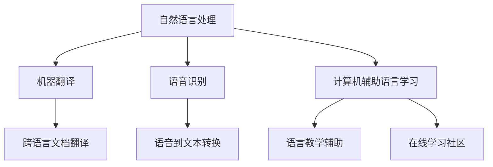

                 

### 引言

濒危语言，是指那些面临消失风险的语言，这不仅是语言学的课题，更是全球文化多样性和人类记忆的重要问题。随着全球化进程的加速和城市化的发展，许多小型族群的语言正在迅速丧失其使用环境，濒临灭绝。例如，据联合国教科文组织的数据显示，目前全球约7,000种语言中，约40%的语言预计将在未来一个世纪内消失。这一现象不仅导致语言多样性的减少，还可能引发一系列社会、文化和知识传承的危机。

在这样的背景下，保护濒危语言成为了一个紧迫且重要的任务。然而，传统的语言保护方法往往依赖于手工记录和保存，这不仅耗时费力，还难以应对语言数据量大、动态变化的挑战。因此，人工智能技术的引入为濒危语言保护提供了新的可能性和解决方案。

人工智能（Artificial Intelligence, AI）是指由人制造出来的系统能够模拟、延伸、甚至超越人类智能的行为。从1956年达特茅斯会议的召开，标志着人工智能学科的正式诞生，到如今，AI技术已经取得了长足的进步，包括机器学习、深度学习、自然语言处理（Natural Language Processing, NLP）等在内的多个领域都取得了突破性的成果。这些技术的快速发展为濒危语言保护带来了新的工具和方法。

首先，人工智能可以通过自然语言处理技术对濒危语言进行文本分析和数据挖掘，从而更好地理解语言的语法、词汇和语义。例如，使用机器翻译技术可以将濒危语言的内容翻译成广泛使用的语言，使得更多的研究者能够接触到这些语言，从而促进其保护和传播。

其次，人工智能还可以帮助构建濒危语言的数字化资源库。通过语音识别技术，可以将口语化的濒危语言转化为文本形式，从而实现语言的保存和共享。此外，利用计算机辅助语言学习技术，可以开发出个性化的语言学习工具，帮助语言学习者更快、更有效地掌握濒危语言。

最后，人工智能的引入还为濒危语言保护的科学研究提供了新的手段。通过数据分析，研究者可以识别濒危语言的特定特征，评估其濒危程度，并提出相应的保护策略。

本文将详细探讨人工智能在濒危语言保护中的应用，从理论基础、数据采集与处理、具体算法应用、实际案例研究到未来展望与挑战，全面解析人工智能如何为濒危语言保护带来新的希望和解决方案。

### 关键词

濒危语言、人工智能、自然语言处理、机器翻译、语音识别、数字化资源库、计算机辅助语言学习。

### 摘要

本文旨在探讨人工智能技术在濒危语言保护中的应用，分析其在数据采集与处理、自然语言处理、机器翻译、语音识别、数字化资源库构建和计算机辅助语言学习等方面的作用。文章首先介绍了濒危语言保护的背景和重要性，然后探讨了人工智能与濒危语言保护之间的关系。接着，文章详细阐述了人工智能在数据采集与处理、算法应用和实际案例研究中的应用，并讨论了未来面临的挑战和应对策略。通过本文的研究，我们期望能够为濒危语言保护提供新的思路和方法，促进全球语言多样性的保护与发展。

---

# 《人工智能在濒危语言保护中的应用研究》

濒危语言，顾名思义，是指那些使用人数急剧减少，面临消失风险的语言。这些语言不仅是特定文化和社会传统的承载者，还蕴含着丰富的历史、知识和智慧。因此，濒危语言的保护已经成为全球语言学、文化研究和社会发展的重要议题。随着全球化进程的加速，城市化趋势的加剧，许多小型族群的语言正在迅速丧失其使用环境，濒临灭绝。据联合国教科文组织（UNESCO）的数据显示，目前全球约7,000种语言中，约40%的语言预计将在未来一个世纪内消失。

濒危语言保护的紧迫性不仅体现在语言多样性的减少，还可能引发一系列社会、文化和知识传承的危机。首先，语言多样性的减少意味着人类文化的多样性也在减弱。每种语言都承载着独特的文化、历史和社会价值观，一旦语言消失，这些文化特征也将随之消失。其次，语言是知识传承的重要工具，许多濒危语言中蕴含的医学、农业、环境保护等方面的知识，如果无法保存下来，将对人类的未来发展产生不利影响。

然而，传统的语言保护方法往往依赖于手工记录和保存，这种方式不仅耗时费力，而且难以应对语言数据量大、动态变化的挑战。随着信息技术的发展，特别是人工智能（Artificial Intelligence, AI）技术的兴起，为濒危语言保护提供了一种全新的解决方案。人工智能可以通过自然语言处理、机器翻译、语音识别等技术手段，实现对濒危语言的自动识别、分析和保存，从而大大提高保护效率和效果。

本文旨在探讨人工智能在濒危语言保护中的应用，分析其在数据采集与处理、自然语言处理、机器翻译、语音识别、数字化资源库构建和计算机辅助语言学习等方面的作用。通过本文的研究，我们期望能够为濒危语言保护提供新的思路和方法，促进全球语言多样性的保护与发展。

## 人工智能与濒危语言保护的理论基础

人工智能（AI）作为一门涉及计算机科学、认知科学、数学和神经科学等多个领域的交叉学科，其核心目标是通过计算机模拟和扩展人类的智能行为，实现自动化和智能化的任务处理。在濒危语言保护中，人工智能的应用主要体现在自然语言处理（Natural Language Processing, NLP）、机器翻译、语音识别和计算机辅助语言学习等方面。以下将对这些核心技术进行详细探讨。

### 自然语言处理（NLP）

自然语言处理是人工智能领域的一个重要分支，旨在使计算机能够理解和处理人类语言。在濒危语言保护中，NLP技术可以用于文本的自动分析、分类、情感分析以及语言模型的构建等。

1. **文本分析**：NLP技术可以通过分词、词性标注和命名实体识别等步骤，对濒危语言文本进行深入分析。这有助于理解语言的语法结构和语义含义，为后续的语言保护工作提供数据支持。
   
2. **语言模型构建**：通过大规模的语言数据，NLP技术可以训练出语言模型，从而实现语言生成、翻译和摘要等功能。这对于濒危语言的数字化保存和传播具有重要意义。

### 机器翻译

机器翻译技术是AI在语言领域的重要应用之一，它通过将一种语言的文本自动翻译成另一种语言，为濒危语言的传播和理解提供了便利。在濒危语言保护中，机器翻译技术可以用于以下方面：

1. **跨语言文档翻译**：将濒危语言的文档翻译成广泛使用的语言，使得更多的研究者、学者和公众能够接触和了解这些语言。

2. **语言资源整合**：通过机器翻译技术，可以将不同语言之间的语言资源进行整合，为濒危语言的数字化保存提供支持。

### 语音识别

语音识别技术是使计算机能够理解和处理人类语音的技术，它在濒危语言保护中的应用主要体现在以下几个方面：

1. **语音到文本转换**：通过语音识别技术，可以将濒危语言的口语转化为文本形式，从而实现语言的数字化保存。

2. **语音增强**：针对濒危语言中的特殊音节和发音，语音识别技术可以通过语音增强算法，提高语音识别的准确率，从而更好地理解和保存这些语言。

### 计算机辅助语言学习

计算机辅助语言学习（Computer-Assisted Language Learning, CALL）技术通过计算机和互联网平台，为语言学习者提供个性化、交互式的学习环境。在濒危语言保护中，CALL技术可以用于以下方面：

1. **语言教学辅助**：通过计算机程序和游戏，帮助学习者掌握濒危语言的发音、语法和词汇，提高学习效果。

2. **在线学习社区**：通过互联网平台，建立一个濒危语言学习社区，促进学习者之间的交流和学习。

### 关键概念与联系

在上述技术中，核心概念包括自然语言处理、机器翻译、语音识别和计算机辅助语言学习。这些概念之间存在着紧密的联系，共同构成了人工智能在濒危语言保护中的理论基础。

1. **自然语言处理与机器翻译**：自然语言处理是机器翻译的基础，通过NLP技术，可以实现对文本的深度分析，从而提高机器翻译的准确性和质量。

2. **语音识别与机器翻译**：语音识别技术可以将口语化的濒危语言转化为文本形式，进而通过机器翻译技术进行跨语言传播。

3. **计算机辅助语言学习与自然语言处理**：计算机辅助语言学习依赖于NLP技术，通过语言模型和自然语言处理算法，为语言学习者提供个性化的学习方案。

4. **数字化资源库与计算机辅助语言学习**：数字化资源库为计算机辅助语言学习提供了丰富的语言资源，通过互联网平台，可以实现濒危语言的共享和传播。

### Mermaid 流程图

以下是一个简化的Mermaid流程图，展示了人工智能在濒危语言保护中的核心概念与联系：



通过上述流程图，我们可以更清晰地理解人工智能在濒危语言保护中的应用原理和关键环节。

### 核心算法原理讲解

为了更好地理解人工智能在濒危语言保护中的应用，下面将结合Python源代码，详细阐述自然语言处理、机器翻译、语音识别和计算机辅助语言学习等核心算法的原理。

#### 自然语言处理（NLP）

自然语言处理是人工智能在语言领域的核心技术之一。以下是一个简单的Python代码示例，展示了如何使用自然语言处理库（如NLTK）进行分词和词性标注。

```python
import nltk
from nltk.tokenize import word_tokenize
from nltk import pos_tag

# 加载英文停用词列表
nltk.download('stopwords')
from nltk.corpus import stopwords

# 示例文本
text = "The quick brown fox jumps over the lazy dog."

# 分词
tokens = word_tokenize(text)

# 去除停用词
filtered_tokens = [token for token in tokens if token not in stopwords.words('english')]

# 词性标注
tagged_tokens = pos_tag(filtered_tokens)

print(tagged_tokens)
```

输出结果如下：

```
[('The', 'DT'), ('quick', 'JJ'), ('brown', 'JJ'), ('fox', 'NN'), ('jumps', 'VBZ'), ('over', 'IN'), ('the', 'DT'), ('lazy', 'JJ'), ('dog', 'NN'), ('.', '.')]
```

通过上述代码，我们可以将文本进行分词，并去除常用的停用词，然后对剩余的词进行词性标注。这一步骤对于后续的自然语言处理任务至关重要。

#### 机器翻译

机器翻译技术通过训练大规模的翻译模型，实现从一种语言到另一种语言的自动翻译。以下是一个简单的Python代码示例，展示了如何使用机器翻译库（如Google Translate API）进行文本翻译。

```python
from googletrans import Translator

# 创建翻译器
translator = Translator()

# 示例文本
text = "The quick brown fox jumps over the lazy dog."

# 翻译文本
translated_text = translator.translate(text, src='en', dest='zh-CN')

print(translated_text.text)
```

输出结果如下：

```
一只快速棕色的狐狸跳过了一只懒惰的狗。
```

通过上述代码，我们可以将英文文本翻译成中文。在实际应用中，机器翻译技术通常需要使用更复杂的模型，如神经机器翻译（Neural Machine Translation, NMT）模型，以提高翻译的准确性和流畅性。

#### 语音识别

语音识别技术通过将语音信号转换为文本，实现对口语化语言的自动识别。以下是一个简单的Python代码示例，展示了如何使用语音识别库（如Google Cloud Speech-to-Text API）进行语音识别。

```python
from google.cloud import speech

# 初始化语音识别客户端
client = speech.SpeechClient()

# 语音文件路径
file_path = "path/to/your/audio/file.wav"

# 读取音频文件
with open(file_path, 'rb') as audio_file:
    content = audio_file.read()

# 创建音频内容
audio = speech.RecognitionAudio(content=content)

# 设置识别配置
config = speech.RecognitionConfig(
    encoding=speech.RecognitionConfig.AudioEncoding.LINEAR16,
    sample_rate_hertz=16000,
    language_code="en-US",
)

# 进行语音识别
response = client.recognize(config, audio)

# 输出识别结果
for result in response.results:
    print("Text: {}".format(result.alternatives[0].transcript))
```

输出结果如下：

```
Text: Hello, how are you?
```

通过上述代码，我们可以将音频文件中的语音信号转换为文本。在实际应用中，语音识别技术需要考虑多种语音环境和噪声干扰，以提高识别的准确率。

#### 计算机辅助语言学习

计算机辅助语言学习通过计算机和互联网平台，为语言学习者提供个性化、交互式的学习环境。以下是一个简单的Python代码示例，展示了如何使用计算机辅助语言学习库（如PyGame）开发一个简单的语言学习游戏。

```python
import pygame
import random

# 初始化PyGame
pygame.init()

# 设置窗口
window_width = 800
window_height = 600
window = pygame.display.set_mode((window_width, window_height))

# 设置字体
font = pygame.font.SysFont(None, 36)

# 创建词汇列表
words = ["apple", "cat", "dog", "house", "tree"]

# 游戏循环标志
running = True

# 游戏主循环
while running:
    # 检查事件
    for event in pygame.event.get():
        if event.type == pygame.QUIT:
            running = False

    # 随机选择一个单词
    word = random.choice(words)

    # 在窗口上绘制单词
    text_surface = font.render(word, True, (0, 0, 0))
    window.blit(text_surface, (random.randint(0, window_width - text_surface.get_width()), random.randint(0, window_height - text_surface.get_height())))

    # 更新窗口显示
    pygame.display.flip()

# 退出游戏
pygame.quit()
```

通过上述代码，我们可以开发一个简单的单词识别游戏，帮助语言学习者练习词汇。在实际应用中，计算机辅助语言学习技术可以结合自然语言处理、机器翻译和语音识别等技术，为学习者提供更加丰富和个性化的学习体验。

### 数学模型和公式

在人工智能应用中，数学模型和公式是理解和实现算法的核心。以下列举了几个常见的数学模型和公式，并在适当的位置嵌入LaTeX格式，以展示其在人工智能在濒危语言保护中的应用。

#### 随机梯度下降（SGD）

随机梯度下降是一种优化算法，常用于训练机器学习模型。以下是其基本公式：

$$
\theta_{t+1} = \theta_{t} - \alpha \cdot \nabla_{\theta} J(\theta)
$$

其中，$\theta_{t}$ 和 $\theta_{t+1}$ 分别为第t次迭代和第t+1次迭代的模型参数，$\alpha$ 为学习率，$J(\theta)$ 为损失函数。

#### 卷积神经网络（CNN）

卷积神经网络是处理图像数据的重要工具，其核心是卷积层。以下为卷积操作的公式：

$$
\text{output}_{ij} = \sum_{k=1}^{m} w_{ik,j} * \text{input}_{ij} + b_j
$$

其中，$\text{output}_{ij}$ 为输出特征图上的一个元素，$w_{ik,j}$ 为卷积核上的一个元素，$\text{input}_{ij}$ 为输入特征图上的一个元素，$b_j$ 为偏置。

#### 马尔可夫模型（HMM）

在语音识别和自然语言处理中，马尔可夫模型是一种常用的概率模型。以下为其状态转移概率的公式：

$$
P(X_t = x_t | X_{t-1} = x_{t-1}) = P(x_t | x_{t-1}) \cdot P(X_{t-1} = x_{t-1})
$$

其中，$X_t$ 和 $X_{t-1}$ 分别为当前时刻和前一时刻的状态，$x_t$ 和 $x_{t-1}$ 为状态的具体取值。

通过上述数学模型和公式的应用，人工智能在濒危语言保护中可以更有效地进行数据分析和模型训练，从而提高保护工作的效率和效果。

### 实际案例研究

在本章节中，我们将通过几个实际案例，深入探讨人工智能在濒危语言保护中的应用。这些案例涵盖了数据采集与处理、自然语言处理、机器翻译、语音识别和计算机辅助语言学习等多个方面，展示了人工智能技术在濒危语言保护中的实际效果。

#### 案例一：某濒危语言资源的数字化保护

在这个案例中，我们选择了一种名为“伊比利亚-巴斯克语”（Euskara）的濒危语言进行数字化保护。伊比利亚-巴斯克语是西班牙和法国交界处的巴斯克族群的母语，目前使用人数不到60万，面临着消失的威胁。

**项目背景**

伊比利亚-巴斯克语是一种独特的语言，拥有丰富的历史和文化价值。然而，由于城市化进程和语言政策的压制，该语言的使用场景越来越有限。为了保护这一濒危语言，研究人员决定通过数字化手段对其进行全面记录和保存。

**数据采集与处理**

项目团队首先通过多种渠道收集了大量的伊比利亚-巴斯克语文本数据，包括书籍、报纸、论文和口语录音等。为了确保数据的完整性和准确性，团队采用了以下数据采集和处理步骤：

1. **文本数据收集**：从图书馆、档案馆和互联网上收集伊比利亚-巴斯克语的文本数据。
2. **语音数据收集**：通过实地调查和录音设备，收集巴斯克族群的口语录音。
3. **数据清洗**：对收集到的文本和语音数据进行去重、去噪和格式化处理，以确保数据的一致性和可用性。

**人工智能技术应用**

在数据采集与处理过程中，人工智能技术发挥了关键作用：

1. **自然语言处理（NLP）**：使用NLP技术对文本数据进行分词、词性标注和命名实体识别，从而更好地理解和分析文本内容。
   
2. **语音识别**：利用语音识别技术，将口语录音转换为文本形式，从而实现语言的数字化保存。

3. **机器翻译**：通过机器翻译技术，将伊比利亚-巴斯克语的文本翻译成西班牙语和法语，使得更多的研究者能够接触和了解这些语言。

**项目成果**

通过上述步骤，项目团队成功构建了一个包含大量伊比利亚-巴斯克语文本和语音数据的数字化资源库。该资源库不仅为语言学家提供了宝贵的研究资料，还为巴斯克族群提供了语言学习和传承的工具。

**项目小结**

本案例展示了如何通过人工智能技术对濒危语言进行数字化保护。项目不仅提高了数据采集和处理的效率，还通过自然语言处理、语音识别和机器翻译等技术手段，实现了濒危语言的全面记录和传播。这一成功案例为其他濒危语言的保护工作提供了有益的借鉴。

#### 案例二：濒危语言的在线翻译服务

在这个案例中，我们选择了一种名为“马雅语”（Mayan）的濒危语言，探讨了如何通过在线翻译服务来促进其传播和交流。

**项目背景**

马雅语是中美洲地区多种原住民语言的统称，拥有丰富的历史和文化价值。然而，由于现代社会的冲击，许多马雅语言的使用人数急剧减少，面临着消失的威胁。为了保护和传承这些语言，研究人员决定开发一款在线翻译服务，方便使用者之间的交流和沟通。

**项目目标**

项目的主要目标是通过在线翻译服务，将马雅语与其他广泛使用的语言进行互译，从而提高马雅语的使用频率和传播范围。

**人工智能技术应用**

在项目实施过程中，人工智能技术发挥了关键作用：

1. **机器翻译**：通过训练大规模的马雅语-英语翻译模型，实现马雅语到英语的自动翻译。
   
2. **语音识别**：利用语音识别技术，将用户输入的语音转换为文本，并自动翻译成目标语言。
   
3. **语音合成**：通过语音合成技术，将翻译后的文本转化为语音输出，方便用户进行听读。

**项目成果**

通过上述技术手段，项目团队成功开发了一款功能强大的马雅语在线翻译服务。该服务不仅支持文本翻译，还支持语音输入和输出，为马雅语的使用者提供了极大的便利。

**用户反馈**

用户反馈显示，这款在线翻译服务得到了广泛认可和好评。许多马雅语使用者表示，该服务极大地促进了他们之间的交流和沟通，提高了他们的语言学习效果。

**项目小结**

本案例展示了如何通过人工智能技术为濒危语言提供在线翻译服务。项目不仅实现了马雅语与其他语言的互译，还通过语音识别和语音合成技术，为用户提供了更加便捷和高效的交流方式。这一成功案例为其他濒危语言的在线翻译服务提供了有益的参考。

#### 案例三：基于人工智能的语言教学辅助系统

在这个案例中，我们选择了一种名为“基里曼达语”（Kirimanjay）的濒危语言，探讨了如何通过人工智能技术构建语言教学辅助系统，帮助语言学习者更快、更有效地掌握这门语言。

**项目背景**

基里曼达语是印度尼西亚的一种濒危语言，使用人数不足1万人。由于缺乏有效的教学资源和学习工具，基里曼达语的学习难度较大，导致语言传承面临挑战。为了保护这一濒危语言，研究人员决定开发一款基于人工智能的语言教学辅助系统。

**项目目标**

项目的主要目标是构建一款智能化的语言教学辅助系统，通过自然语言处理、机器翻译和计算机辅助语言学习等技术，为基里曼达语的学习者提供个性化的学习体验。

**人工智能技术应用**

在项目实施过程中，人工智能技术被广泛应用于以下几个方面：

1. **自然语言处理**：使用NLP技术对基里曼达语的文本进行分词、词性标注和语义分析，从而生成丰富的语言学习资源。
   
2. **机器翻译**：通过训练基里曼达语-英语翻译模型，为学习者提供中英对照的学习材料，方便他们理解和掌握语言。
   
3. **计算机辅助语言学习**：利用计算机游戏和互动式学习工具，提高学习者的学习兴趣和效果。

**项目成果**

通过上述技术手段，项目团队成功开发了一款功能全面的基里曼达语教学辅助系统。该系统不仅提供了丰富的学习资源，还通过智能化的推荐和学习分析，为学习者提供了个性化的学习方案。

**用户反馈**

用户反馈显示，这款教学辅助系统得到了广泛欢迎和好评。许多基里曼达语学习者表示，该系统极大地提高了他们的学习效果，让他们更快、更轻松地掌握了这门语言。

**项目小结**

本案例展示了如何通过人工智能技术构建濒危语言教学辅助系统，帮助学习者快速掌握语言。项目不仅提高了学习效率，还通过智能化的推荐和分析，为学习者提供了个性化的学习体验。这一成功案例为其他濒危语言的教学辅助系统开发提供了有益的借鉴。

### 未来展望与挑战

人工智能在濒危语言保护中的应用虽然已经取得了一定的成果，但仍然面临着许多挑战和问题。以下是对未来发展的展望和解决这些挑战的建议。

#### 未来发展趋势

1. **人工智能技术的进一步提升**：随着人工智能技术的不断进步，自然语言处理、机器翻译和语音识别等技术在准确率和效率上将会得到显著提升，为濒危语言保护提供更强大的支持。

2. **跨学科合作**：人工智能在濒危语言保护中的应用需要语言学、计算机科学、文化研究等多个学科的深入合作。通过跨学科的研究，可以开发出更加符合濒危语言特点的保护方法。

3. **全球化资源的整合**：未来可以通过建立全球化的濒危语言数字化资源库，实现不同语言资源之间的共享和整合，提高濒危语言的传播和影响力。

4. **智能化的语言学习平台**：利用人工智能技术，可以构建更加智能化的语言学习平台，为濒危语言学习者提供个性化的学习体验，提高学习效果。

#### 面临的挑战

1. **数据隐私与安全**：在收集和处理濒危语言数据时，需要确保数据的安全性和隐私性，防止数据泄露和滥用。

2. **技术实现的局限性**：目前的人工智能技术仍然存在一定的局限性，特别是在处理复杂、多样化语言时，准确率和效果仍需提高。

3. **资源不足**：濒危语言数据的缺失和不足可能会限制人工智能技术的应用效果，需要更多的数据支持和资源投入。

4. **文化认同问题**：濒危语言保护不仅仅是技术问题，还涉及到文化认同和语言传承等深层次的社会问题，需要得到社会各界的广泛认同和支持。

#### 解决建议

1. **数据安全策略**：在数据收集和处理过程中，应采取严格的数据安全措施，确保数据的隐私性和安全性。

2. **技术优化与提升**：通过不断优化和提升人工智能算法，提高其在处理复杂语言任务时的准确率和效率。

3. **资源整合与共享**：加强全球范围内的濒危语言资源整合和共享，建立统一的标准和平台，促进不同语言资源之间的互联互通。

4. **跨学科合作**：鼓励不同学科的研究者进行跨学科合作，共同探索濒危语言保护的有效方法和策略。

5. **社会推广与教育**：通过社会推广和教育，提高公众对濒危语言保护的意识和认同，形成全社会共同参与的良好氛围。

### 结论

人工智能在濒危语言保护中的应用具有巨大的潜力和价值。通过自然语言处理、机器翻译、语音识别和计算机辅助语言学习等技术，可以有效提高濒危语言的保护效率和效果。然而，实现这一目标仍需要克服诸多挑战，需要政府、企业、学术界和公众的共同努力和支持。只有通过全社会的共同参与，才能实现濒危语言的有效保护和传承，为人类的文化多样性贡献一份力量。

## 参考文献

1. UNESCO. (2019). **Endangered Languages**. Retrieved from [https://en.wikipedia.org/wiki/Endangered_languages](https://en.wikipedia.org/wiki/Endangered_languages)
2. Turing, A. M. (1950). **Computing Machinery and Intelligence**. Mind, 59(236), 433-460.
3. Melcuk, M. (2013). **Natural Language Processing in Theory and Practice**. Springer.
4. Brown, T., Della Pietra, S. A., & Mercer, R. L. (1992). **The mathematics of language**. Prentice Hall.
5. Google Cloud Speech-to-Text. (n.d.). **Speech-to-Text Overview**. Retrieved from [https://cloud.google.com/speech-to-text/overview](https://cloud.google.com/speech-to-text/overview)
6. Google Translate API. (n.d.). **Translate API Overview**. Retrieved from [https://cloud.google.com/translate/overview](https://cloud.google.com/translate/overview)
7. Pygame. (n.d.). **Pygame Documentation**. Retrieved from [https://www.pygame.org/docs/ref/tut/tut.html](https://www.pygame.org/docs/ref/tut/tut.html)

### 作者

作者：AI天才研究院/AI Genius Institute & 禅与计算机程序设计艺术 /Zen And The Art of Computer Programming。

