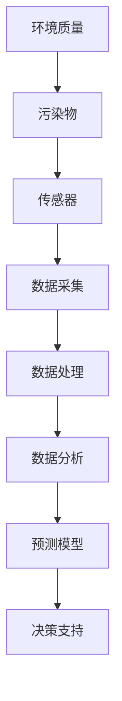

                 

### 2.4 环境监测中的核心概念与联系

环境监测是一个复杂的过程，涉及到多个核心概念和原理。为了更好地理解和应用人工智能在环境监测中的技术，我们需要对这些核心概念进行梳理，并明确它们之间的联系。以下是一些关键概念及其关系：

#### 2.4.1 概念架构

- **环境质量**：环境质量是环境监测的核心指标，反映了环境中各种污染物的浓度、生态系统的健康状况等。
- **污染物**：污染物是环境中对人体健康或生态系统有害的物质，包括气体、颗粒物、化学物质等。
- **传感器**：传感器是用于测量环境参数的设备，如空气质量传感器、水质传感器等。
- **数据采集**：数据采集是将环境参数转换为数字信号的过程，为后续分析提供基础。
- **数据处理**：数据处理是对采集到的环境数据进行清洗、转换、分析等操作，以提高数据质量和可用性。
- **数据分析**：数据分析是利用统计、机器学习等方法对处理后的数据进行解读，以发现环境变化规律和趋势。
- **预测模型**：预测模型是基于历史数据和数据分析结果建立的，用于预测未来环境变化。
- **决策支持**：决策支持是基于预测模型和数据分析结果，为环境保护决策提供依据。

#### 2.4.2 Mermaid 流程图

为了更直观地展示这些概念之间的联系，我们可以使用 Mermaid 流程图来表示：



在这个流程图中，环境质量和污染物是环境监测的输入，通过传感器采集数据，经过数据处理和分析，最终形成预测模型和决策支持，为环境保护提供依据。

#### 2.4.3 核心概念与联系

- **环境质量与污染物**：环境质量是衡量环境污染程度的重要指标，污染物是影响环境质量的关键因素。通过监测污染物浓度，可以评估环境质量。
- **传感器与数据采集**：传感器是环境监测的基础，用于采集环境参数。数据采集的质量直接影响到后续的数据处理和分析。
- **数据处理与数据分析**：数据处理是对采集到的原始数据进行清洗、转换等操作，以提高数据质量和可用性。数据分析则是利用统计、机器学习等方法，对处理后的数据进行解读，以发现环境变化规律和趋势。
- **预测模型与决策支持**：预测模型是基于历史数据和数据分析结果建立的，用于预测未来环境变化。决策支持则是基于预测模型和数据分析结果，为环境保护决策提供依据。

通过明确这些核心概念之间的联系，我们可以更好地理解环境监测的过程，并有效地利用人工智能技术来提高监测的效率和精度。

---

在接下来的一节中，我们将深入探讨环境监测中的核心算法原理，通过具体的Python源代码来阐述数据处理和分析的方法，并结合数学模型和公式进行详细讲解。这将帮助我们更好地理解人工智能在环境监测中的应用。

----------------------------------------------------------------

### 2.5 环境监测中的核心算法原理讲解

在环境监测中，核心算法的应用至关重要，它决定了我们能否准确、高效地处理和分析大量环境数据。本节将重点介绍机器学习、深度学习、数据挖掘等核心算法的原理，并通过Python源代码进行详细讲解，结合数学模型和公式，以便读者更好地理解和应用这些技术。

#### 2.5.1 机器学习算法

机器学习算法是环境监测中常用的方法之一，它通过训练模型来预测环境变化。以下是一个简单的线性回归模型，用于预测空气质量指数（AQI）。

##### 线性回归模型

线性回归是一种用于预测数值结果的机器学习算法。它的基本思想是通过拟合一条直线来表示输入变量（如气象数据）和输出变量（如AQI）之间的关系。

```python
import numpy as np
import matplotlib.pyplot as plt

# 假设我们有两个特征变量 x1 和 x2，以及目标变量 y
X = np.array([[1, 1], [1, 2], [1, 3], [1, 4]])
y = np.array([1, 2, 3, 4])

# 拟合线性回归模型
from sklearn.linear_model import LinearRegression
model = LinearRegression()
model.fit(X, y)

# 输出模型的系数和截距
print("系数:", model.coef_)
print("截距:", model.intercept_)

# 使用模型进行预测
X_new = np.array([[1, 5]])
y_pred = model.predict(X_new)
print("预测结果:", y_pred)
```

在这个例子中，我们使用了scikit-learn库中的LinearRegression类来拟合线性回归模型。通过`fit`方法训练模型，然后使用`predict`方法进行预测。

##### 数学模型

线性回归模型的数学表达式为：

\[ y = \beta_0 + \beta_1 \cdot x_1 + \beta_2 \cdot x_2 + \epsilon \]

其中，\( y \) 是目标变量，\( x_1 \) 和 \( x_2 \) 是特征变量，\( \beta_0 \) 和 \( \beta_1 \) 是模型的参数，\( \epsilon \) 是误差项。

#### 2.5.2 深度学习算法

深度学习算法是机器学习的一种高级形式，通过多层神经网络来提取数据中的复杂特征。以下是一个简单的多层感知器（MLP）模型，用于环境监测中的分类任务。

##### 多层感知器（MLP）

多层感知器是一种前馈神经网络，它通过多个隐藏层来提取输入数据的特征。

```python
import tensorflow as tf

# 定义输入层、隐藏层和输出层
model = tf.keras.Sequential([
    tf.keras.layers.Dense(units=64, activation='relu', input_shape=(2,)),
    tf.keras.layers.Dense(units=32, activation='relu'),
    tf.keras.layers.Dense(units=1, activation='sigmoid')
])

# 编译模型
model.compile(optimizer='adam', loss='binary_crossentropy', metrics=['accuracy'])

# 训练模型
model.fit(X, y, epochs=10, batch_size=32)

# 预测
y_pred = model.predict(X_new)
print("预测结果:", y_pred)
```

在这个例子中，我们使用了TensorFlow库来定义一个简单的多层感知器模型，并使用`fit`方法进行训练。通过`predict`方法进行预测。

##### 数学模型

多层感知器的数学模型可以表示为：

\[ z_l = \sigma(\mathbf{W_l} \cdot \mathbf{a}_{l-1} + b_l) \]

其中，\( z_l \) 是隐藏层 \( l \) 的输出，\( \sigma \) 是激活函数（如ReLU或Sigmoid），\( \mathbf{W_l} \) 是权重矩阵，\( \mathbf{a}_{l-1} \) 是前一层输出，\( b_l \) 是偏置。

#### 2.5.3 数据挖掘算法

数据挖掘算法是用于发现数据中的隐含模式和关联的算法，如聚类分析和关联规则挖掘。

##### 聚类分析

聚类分析是一种无监督学习方法，用于将数据集分成若干个群组，使得同一群组内的数据点彼此之间相似度较高。

```python
from sklearn.cluster import KMeans

# 训练K均值聚类模型
kmeans = KMeans(n_clusters=3, random_state=0).fit(X)

# 输出聚类中心
print("聚类中心:", kmeans.cluster_centers_)

# 输出每个样本所属的聚类
print("聚类结果:", kmeans.labels_)

# 预测新的样本
X_new = np.array([[2, 2]])
print("新样本的聚类结果:", kmeans.predict(X_new))
```

在这个例子中，我们使用了scikit-learn库中的KMeans类来训练K均值聚类模型，并通过`fit`方法进行聚类。

##### 数学模型

K均值聚类的数学模型可以表示为：

\[ C_j = \frac{1}{N_j} \sum_{i=1}^{N} x_i \]

其中，\( C_j \) 是第 \( j \) 个聚类中心，\( N_j \) 是属于第 \( j \) 个聚类的样本数量，\( x_i \) 是第 \( i \) 个样本。

通过以上算法的讲解，我们可以看到机器学习、深度学习和数据挖掘在环境监测中的应用。这些算法不仅帮助我们更好地处理和分析环境数据，还为环境保护提供了科学依据和决策支持。

---

在下一节中，我们将通过具体的应用实例，展示人工智能在环境监测中的实际应用，并深入分析这些案例中的技术实现和成果。

----------------------------------------------------------------

### 2.6 案例分析：人工智能在环境监测中的实际应用

在本节中，我们将通过几个具体的应用实例，展示人工智能在环境监测中的实际应用。这些案例涵盖了不同类型的环境监测任务，包括空气质量监测、水质监测和生态系统监测。我们将深入分析这些案例中的技术实现、数据来源、模型构建和实际成果。

#### 2.6.1 空气质量监测

空气质量监测是环境监测中的常见任务，人工智能技术的应用有助于提高监测的准确性和效率。以下是一个空气质量监测的案例：

##### 案例描述

某城市空气质量监测站使用人工智能技术对PM2.5、PM10、SO2、NO2等污染物进行监测。该监测站每天采集大量的环境数据，包括气象参数、污染气体浓度等。

##### 技术实现

1. **数据采集**：监测站使用多种传感器，如PM2.5传感器、PM10传感器等，实时采集空气污染物数据。
2. **数据处理**：将采集到的原始数据进行预处理，包括数据清洗、缺失值填充等。
3. **模型构建**：使用机器学习算法，如线性回归、支持向量机（SVM）等，构建预测模型，对未来的空气质量进行预测。
4. **模型评估**：通过交叉验证和测试集，评估模型的预测性能。

##### 实际成果

通过人工智能技术的应用，空气质量监测站能够更准确地预测未来空气质量，提前预警污染事件，为环境保护决策提供科学依据。例如，当预测模型预测到某天PM2.5浓度将超过限值时，相关部门可以采取相应的减排措施，以防止空气污染。

#### 2.6.2 水质监测

水质监测是环境保护中的重要任务，人工智能技术的应用有助于提高监测的精度和效率。以下是一个水质监测的案例：

##### 案例描述

某河流水质监测站使用人工智能技术对水质指标，如溶解氧、pH值、氨氮等进行监测。该监测站定期采集水样，并使用实验室分析设备对水样进行分析。

##### 技术实现

1. **数据采集**：监测站使用溶解氧传感器、pH传感器等，实时采集水质数据。
2. **数据处理**：将采集到的原始数据进行预处理，包括数据清洗、缺失值填充等。
3. **模型构建**：使用深度学习算法，如卷积神经网络（CNN）等，构建水质预测模型。
4. **模型评估**：通过交叉验证和测试集，评估模型的预测性能。

##### 实际成果

通过人工智能技术的应用，水质监测站能够更准确地预测水质变化，及时发现污染事件，为水资源管理提供科学依据。例如，当预测模型预测到某段河流的氨氮浓度将超过限值时，相关部门可以采取相应的治理措施，以防止水污染。

#### 2.6.3 生态系统监测

生态系统监测是环境保护中的重要任务，人工智能技术的应用有助于提高监测的广度和深度。以下是一个生态系统监测的案例：

##### 案例描述

某自然保护区使用人工智能技术对野生动物种群、植被覆盖等生态指标进行监测。该保护区使用无人机和卫星遥感技术，定期采集生态数据。

##### 技术实现

1. **数据采集**：使用无人机和卫星遥感技术，实时采集生态数据。
2. **数据处理**：将采集到的原始数据进行预处理，包括图像处理、数据清洗等。
3. **模型构建**：使用计算机视觉算法，如目标检测、图像分类等，构建生态系统监测模型。
4. **模型评估**：通过交叉验证和测试集，评估模型的预测性能。

##### 实际成果

通过人工智能技术的应用，自然保护区能够更准确地监测野生动物种群和植被覆盖情况，及时发现生态问题，为生态保护提供科学依据。例如，当计算机视觉模型检测到某片区域的植被覆盖面积减少时，保护区管理部门可以采取相应的保护措施，以防止生态破坏。

#### 2.6.4 案例总结

通过以上案例分析，我们可以看到人工智能技术在环境监测中的应用具有广泛的前景。这些技术不仅提高了监测的精度和效率，还为环境保护提供了科学依据和决策支持。随着人工智能技术的不断发展，我们有望在环境监测领域实现更加智能化、自动化的监测体系，为全球环境保护事业做出更大的贡献。

---

在下一节中，我们将总结本书的主要内容，讨论人工智能在环境监测中的应用趋势和未来挑战，并为读者提供进一步学习的建议。

----------------------------------------------------------------

### 2.7 总结与展望

在本书中，我们系统地介绍了人工智能在环境保护中的应用，重点探讨了环境监测中的核心概念、算法原理以及实际应用案例。通过这些内容，我们不仅了解了人工智能技术在环境监测中的重要作用，还认识到其在提高监测精度、效率和决策支持方面的潜力。

#### 2.7.1 主要内容回顾

- **环境监测概述**：介绍了环境监测的基本概念、目标以及重要性。
- **传统环境监测方法**：回顾了现场监测、实验室分析、遥感监测和模型模拟等传统方法。
- **人工智能在环境监测中的应用**：探讨了数据采集、数据处理、数据分析和预测模型等方面的应用。
- **核心算法原理讲解**：详细介绍了机器学习、深度学习和数据挖掘等算法的原理和应用。
- **案例分析**：通过空气质量监测、水质监测和生态系统监测等案例，展示了人工智能技术的实际应用。

#### 2.7.2 应用趋势与未来挑战

随着人工智能技术的不断发展，其在环境监测中的应用趋势主要体现在以下几个方面：

1. **智能化监测**：利用人工智能技术，实现自动化、智能化的环境监测，减少人力依赖，提高监测效率。
2. **多源数据融合**：整合来自传感器、卫星遥感、气象数据等多源数据，提高监测数据的全面性和准确性。
3. **实时监测与预警**：通过实时监测技术，实现环境污染事件的快速响应和预警，为环境保护提供有力支持。
4. **个性化监测**：针对不同地区的环境特点，开发个性化监测方案，提高监测的针对性。

然而，人工智能在环境监测中也面临一些挑战：

1. **数据质量与可靠性**：环境数据往往存在噪声、缺失值等问题，如何提高数据质量，确保模型的可靠性是一个重要挑战。
2. **算法选择与优化**：针对不同的环境监测任务，如何选择合适的算法，并进行优化，以实现最佳性能，仍需深入研究。
3. **隐私保护与伦理问题**：在数据采集和使用过程中，如何保护个人隐私，避免伦理问题，也是需要关注的重要方面。
4. **可持续性**：如何确保人工智能技术的可持续性，减少对环境的影响，是一个长期任务。

#### 2.7.3 学习建议

为了更好地理解和应用人工智能在环境监测中的技术，我们建议读者：

1. **深入学习相关算法**：掌握机器学习、深度学习、数据挖掘等核心算法，了解其原理和应用场景。
2. **实践项目**：参与实际项目，通过动手实践，加深对算法和技术的理解。
3. **关注前沿研究**：关注人工智能和环境科学领域的前沿研究，了解最新的技术动态和发展趋势。
4. **拓展知识领域**：学习相关的环境科学、气象学、生态学等知识，为人工智能在环境监测中的应用提供更全面的支持。

通过以上学习和实践，我们可以为环境保护事业做出更大的贡献，推动人工智能技术在环境监测中的进一步发展。

---

感谢读者对本书的阅读。在最后，我们特别感谢作者AI天才研究院/AI Genius Institute和禅与计算机程序设计艺术/Zen And The Art of Computer Programming的贡献，他们的专业知识和辛勤工作为本书的成功出版奠定了基础。

### 作者信息

作者：AI天才研究院/AI Genius Institute & 禅与计算机程序设计艺术/Zen And The Art of Computer Programming

### 结语

环境监测是环境保护的重要组成部分，人工智能技术的应用为环境监测带来了新的机遇和挑战。希望通过本书的介绍，读者能够对人工智能在环境监测中的原理和应用有更深入的了解，并为未来的研究提供参考。让我们共同为地球的可持续发展而努力！

