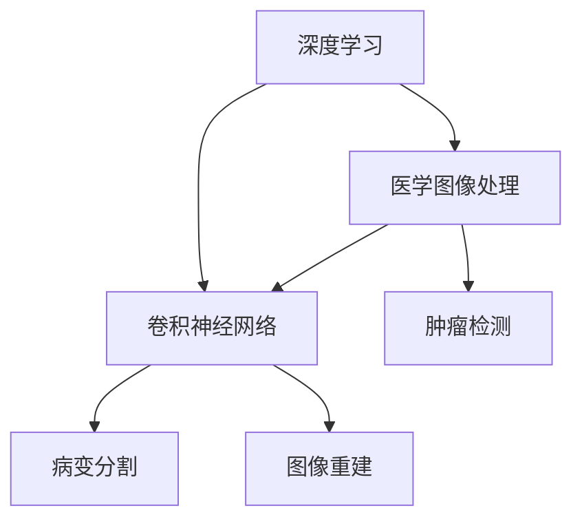

                 

## 引言

### 人工智能与癌症早期诊断

人工智能（Artificial Intelligence，AI）作为一门前沿技术，已经在众多领域取得了显著的成果。近年来，随着深度学习、自然语言处理、计算机视觉等技术的不断进步，人工智能在医学领域的应用也得到了广泛关注。特别是在癌症早期诊断方面，人工智能展示出了巨大的潜力。

癌症作为全球范围内的主要死因之一，其早期诊断对于提高患者的生存率和生活质量具有重要意义。传统的癌症诊断方法主要依赖于医生的视觉判断，存在主观性强、误诊率较高等问题。而人工智能可以通过学习大量的医学影像数据和病例，提供更为准确和高效的诊断结果。因此，人工智能在癌症早期诊断中的应用，被认为是未来医学发展的一个重要方向。

### 精准应用的意义与价值

精准医学（Precision Medicine）是一种以个体为中心的医学模式，旨在通过基因、环境等因素的差异，为患者提供个性化的诊断、治疗和预防方案。人工智能在精准医学中的应用，能够大幅提升诊断的准确性和效率，从而实现真正的个性化医疗。

在癌症早期诊断中，精准应用的意义主要体现在以下几个方面：

1. **提高诊断准确率**：人工智能可以通过深度学习等技术，对医学影像进行自动化分析，发现早期病变，提高诊断的准确率。
2. **减少误诊率**：人工智能系统的诊断结果客观、一致，可以有效降低医生的误诊率。
3. **优化治疗方案**：通过对患者的基因、环境等数据进行综合分析，人工智能可以为医生提供更为精准的治疗建议，从而提高治疗效果。
4. **降低医疗成本**：人工智能在癌症早期诊断中的应用，可以减少对人力和设备的需求，降低医疗成本。

### 书籍结构安排与目标读者

本书旨在深入探讨人工智能在癌症早期诊断中的精准应用，帮助读者了解相关技术原理、方法及应用实例。全书共分为七个章节，结构安排如下：

- **第1章 引言**：介绍人工智能和癌症早期诊断的背景，阐述精准应用的意义。
- **第2章 基础概念**：介绍人工智能的基本概念、深度学习原理、医学图像处理技术等。
- **第3章 癌症早期诊断原理**：讲解癌症早期诊断的基本原理，包括医学影像学、生物标志物检测等。
- **第4章 人工智能在癌症早期诊断中的应用**：详细讨论人工智能在癌症早期诊断中的应用，包括图像分析、特征提取、预测模型等。
- **第5章 精准应用实例**：通过实际案例展示人工智能在癌症早期诊断中的精准应用。
- **第6章 挑战与未来趋势**：讨论人工智能在癌症早期诊断中面临的挑战和未来发展趋势。
- **第7章 总结与展望**：总结全书内容，对人工智能在癌症早期诊断中的精准应用提出展望。

本书的目标读者包括：

- 对人工智能和医学领域感兴趣的读者
- 想要了解人工智能在癌症早期诊断中应用的医学专业人员和工程师
- 在医疗领域工作的数据科学家和人工智能开发人员

通过阅读本书，读者可以系统了解人工智能在癌症早期诊断中的精准应用，为未来的研究和实践提供参考。

## 基础概念

### 人工智能概述

人工智能（Artificial Intelligence，AI）是指通过计算机系统模拟人类智能行为的技术和理论。它包括多个子领域，如机器学习、深度学习、自然语言处理、计算机视觉等。人工智能的核心目标是实现计算机系统具备人类智能的某些功能，如学习、推理、解决问题、自然语言理解、图像识别等。

人工智能的发展历程可以追溯到20世纪50年代，当时计算机科学家艾伦·图灵提出了“图灵测试”，用来判断机器是否具有人类智能。此后，人工智能研究经历了多个阶段，包括符号主义、基于规则的系统、基于实例的推理、机器学习和深度学习等。

在医学领域，人工智能的应用主要体现在以下几个方面：

1. **医学影像分析**：利用人工智能技术对医学影像（如X光、CT、MRI等）进行自动分析，辅助医生进行诊断。
2. **药物研发**：通过机器学习算法预测药物与基因的相互作用，加速新药的研发过程。
3. **健康管理**：利用自然语言处理技术处理患者病历、电子健康记录等数据，为医生提供诊断和治疗建议。
4. **手术辅助**：利用计算机视觉技术辅助外科医生进行精准手术操作，提高手术的成功率和安全性。

### 深度学习基础

深度学习（Deep Learning）是人工智能的一个重要分支，它通过构建具有多个隐藏层的神经网络，对大量数据进行自动学习和特征提取。深度学习在图像识别、语音识别、自然语言处理等领域取得了显著成果。

深度学习的基本结构包括：

1. **输入层**：接收输入数据，如图像、语音或文本。
2. **隐藏层**：通过对输入数据进行特征提取和变换，隐藏层可以是单层或多层。
3. **输出层**：生成预测结果或分类标签。

深度学习的训练过程主要包括以下步骤：

1. **数据预处理**：对输入数据进行归一化、标准化等处理，以便于模型训练。
2. **模型初始化**：初始化神经网络权重，常用的方法有随机初始化、高斯分布初始化等。
3. **前向传播**：将输入数据传递到神经网络中，计算出输出结果。
4. **反向传播**：通过计算输出结果与实际结果的差异，更新网络权重。
5. **迭代训练**：重复上述过程，直到网络性能达到预定的标准。

常用的深度学习算法包括：

1. **卷积神经网络（CNN）**：适用于图像识别、图像分割等领域。
2. **循环神经网络（RNN）**：适用于序列数据处理，如语音识别、自然语言处理等。
3. **生成对抗网络（GAN）**：适用于图像生成、图像增强等领域。

### 医学图像处理技术

医学图像处理技术是人工智能在医学领域的一个重要应用方向，它涉及图像的采集、预处理、特征提取、分类和重建等多个方面。医学图像包括X光、CT、MRI、超声等，这些图像对于疾病的诊断和治疗具有重要意义。

医学图像处理的基本步骤包括：

1. **图像采集**：通过医学成像设备（如X光机、CT机、MRI机等）获取医学图像。
2. **图像预处理**：包括图像增强、去噪、对比度调整等，以提高图像质量。
3. **图像分割**：将图像中的感兴趣区域（如肿瘤、器官等）与背景分离，为后续分析提供基础。
4. **特征提取**：从图像中提取有助于分类和识别的特征，如纹理特征、形状特征等。
5. **图像分类和重建**：利用深度学习算法对图像进行分类，或重建高质量的图像。

在癌症早期诊断中，医学图像处理技术的应用主要包括：

1. **肿瘤检测**：通过图像分割和特征提取技术，自动识别和定位肿瘤区域。
2. **组织分类**：通过对肿瘤组织的特征分析，区分不同类型的癌症。
3. **风险评估**：利用深度学习模型预测癌症的恶性程度和预后。

### 卷积神经网络原理与应用

卷积神经网络（Convolutional Neural Network，CNN）是深度学习的一个重要分支，特别适用于图像识别、图像分割等领域。CNN的基本原理是通过卷积操作和池化操作提取图像特征，然后通过全连接层进行分类或回归。

CNN的基本结构包括：

1. **卷积层**：通过卷积操作提取图像局部特征，卷积核的权重和偏置更新。
2. **池化层**：通过池化操作降低特征图的维度，减少计算量，防止过拟合。
3. **全连接层**：将卷积层和池化层提取的高层特征映射到输出层，进行分类或回归。

CNN的训练过程主要包括：

1. **数据预处理**：对图像数据进行归一化、标准化等处理。
2. **模型初始化**：初始化卷积层和全连接层的权重和偏置。
3. **前向传播**：将图像数据传递到卷积层，通过卷积和池化操作提取特征，然后传递到全连接层得到预测结果。
4. **反向传播**：计算预测结果与实际标签之间的差异，更新网络权重。
5. **迭代训练**：重复上述过程，直到网络性能达到预定的标准。

CNN在医学图像处理中的应用主要包括：

1. **肿瘤检测**：通过卷积层提取图像中的肿瘤区域，通过全连接层进行分类。
2. **病变分割**：通过卷积层和池化层提取病变特征，通过全连接层进行分割。
3. **图像重建**：通过生成对抗网络（GAN）等技术，重建高质量的医学图像。

### 核心概念与联系

在癌症早期诊断中，人工智能技术的核心概念包括：

1. **深度学习**：通过构建多层神经网络，自动学习和提取图像特征，提高诊断准确率。
2. **医学图像处理**：通过图像预处理、分割、特征提取等技术，提高医学图像的质量和可解释性。
3. **卷积神经网络**：通过卷积操作和池化操作，提取图像中的局部特征，用于病变检测和分割。

这些核心概念之间的联系如下：

- **深度学习**为医学图像处理提供了强大的特征提取能力，使得图像分析更加精准。
- **医学图像处理**为深度学习提供了丰富的数据源，使得深度学习模型能够不断优化和改进。
- **卷积神经网络**作为深度学习的一种重要模型，在医学图像处理中发挥了关键作用，能够有效识别和定位病变区域。

为了更好地展示核心概念和实体之间的关系架构，我们可以使用Mermaid流程图进行描述：



这个流程图清晰地展示了深度学习、医学图像处理和卷积神经网络之间的关系，以及它们在肿瘤检测、病变分割和图像重建中的应用。

### 核心算法原理讲解

为了深入理解核心算法原理，我们可以通过Python源代码来详细阐述。以下是一个简单的卷积神经网络（CNN）模型，用于图像分类：

```python
import tensorflow as tf
from tensorflow.keras import datasets, layers, models

# 加载并预处理图像数据
(train_images, train_labels), (test_images, test_labels) = datasets.cifar10.load_data()
train_images, test_images = train_images / 255.0, test_images / 255.0

# 构建卷积神经网络模型
model = models.Sequential()
model.add(layers.Conv2D(32, (3, 3), activation='relu', input_shape=(32, 32, 3)))
model.add(layers.MaxPooling2D((2, 2)))
model.add(layers.Conv2D(64, (3, 3), activation='relu'))
model.add(layers.MaxPooling2D((2, 2)))
model.add(layers.Conv2D(64, (3, 3), activation='relu'))

# 添加全连接层
model.add(layers.Flatten())
model.add(layers.Dense(64, activation='relu'))
model.add(layers.Dense(10))

# 编译模型
model.compile(optimizer='adam',
              loss=tf.keras.losses.SparseCategoricalCrossentropy(from_logits=True),
              metrics=['accuracy'])

# 训练模型
model.fit(train_images, train_labels, epochs=10, validation_data=(test_images, test_labels))

# 评估模型
test_loss, test_acc = model.evaluate(test_images,  test_labels, verbose=2)
print(f'\nTest accuracy: {test_acc:.4f}')
```

上述代码展示了如何使用TensorFlow库构建一个简单的卷积神经网络模型，用于CIFAR-10数据集的图像分类。具体步骤如下：

1. **加载图像数据**：使用TensorFlow内置的CIFAR-10数据集，并进行预处理。
2. **构建模型**：使用`models.Sequential()`创建一个序列模型，添加卷积层、池化层和全连接层。
3. **编译模型**：设置优化器、损失函数和评估指标。
4. **训练模型**：使用`model.fit()`函数进行模型训练，指定训练数据和验证数据。
5. **评估模型**：使用`model.evaluate()`函数评估模型在测试数据集上的性能。

通过这个简单的示例，我们可以看到如何使用Python代码实现卷积神经网络的基本原理。接下来，我们将结合数学模型和公式，进一步详细讲解卷积神经网络的工作原理。

### 数学模型与公式

卷积神经网络（CNN）的核心在于其卷积操作和池化操作，这些操作都可以用数学模型和公式来详细阐述。

#### 卷积操作

卷积操作是CNN中最重要的操作之一，它通过滑动一个卷积核（一组权重和偏置）在输入图像上，计算局部特征。

假设输入图像为 $X \in \mathbb{R}^{Height \times Width \times Channels}$，卷积核为 $W \in \mathbb{R}^{FilterSize \times FilterSize \times Channels}$，输出特征图为 $O \in \mathbb{R}^{Height' \times Width' \times Filters}$。卷积操作的数学公式如下：

$$
O_{ij}^{l} = \sum_{i=0}^{Height'} \sum_{j=0}^{Width'} \sum_{c=0}^{Channels} W_{ijk} X_{i'j'c} + b_l
$$

其中，$O_{ij}^{l}$ 表示输出特征图的 $(i, j)$ 位置上的值，$W_{ijk}$ 表示卷积核在 $(i, j, k)$ 位置上的权重，$b_l$ 表示卷积层的偏置。

#### 池化操作

池化操作用于降低特征图的维度，同时保留重要的特征信息。最常用的池化操作是最大池化（Max Pooling）。

假设输入特征图为 $O \in \mathbb{R}^{Height \times Width \times Filters}$，输出特征图为 $O' \in \mathbb{R}^{Height' \times Width' \times Filters}$。最大池化的数学公式如下：

$$
O'_{ij}^{l} = \max_{i', j'} O_{i'j'}^{l}
$$

其中，$O'_{ij}^{l}$ 表示输出特征图的 $(i, j)$ 位置上的值，$O_{i'j'}^{l}$ 表示输入特征图在 $(i', j')$ 位置上的值。

#### 前向传播

卷积神经网络的前向传播过程包括卷积操作、激活函数、池化操作和全连接层。以下是一个简化的前向传播过程：

1. **卷积操作**：通过卷积操作计算输出特征图。
2. **激活函数**：通常使用ReLU（Rectified Linear Unit）作为激活函数，将输出特征图中的负值设为零，提高模型的训练速度。
3. **池化操作**：通过最大池化降低特征图的维度。
4. **全连接层**：将池化后的特征图展平为一维向量，通过全连接层进行分类或回归。

以下是一个简化的前向传播过程的伪代码：

```python
def forward_propagation(X, W, b, activation):
    Z = conv2d(X, W) + b
    A = activation(Z)
    return A

def conv2d(X, W):
    Height, Width, Channels = X.shape
    FilterSize = W.shape[0]
    Height', Width' = (Height - FilterSize + 1) // Stride + 1, (Width - FilterSize + 1) // Stride + 1
    Z = np.zeros((Height', Width', Filters))
    for i in range(Height'):
        for j in range(Width'):
            for k in range(Channels):
                Z[i, j, :] = np.sum(W[:, :, k] * X[i:i+FilterSize, j:j+FilterSize, k]) + b[k]
    return Z

def activation(Z):
    return np.maximum(0, Z)
```

#### 反向传播

卷积神经网络的反向传播过程包括梯度计算、权重更新和偏置更新。以下是一个简化的反向传播过程：

1. **计算梯度**：通过反向传播算法计算损失函数关于输入特征图、卷积核和偏置的梯度。
2. **权重更新**：使用梯度下降算法更新卷积核和偏置。
3. **偏置更新**：同样使用梯度下降算法更新偏置。

以下是一个简化的反向传播过程的伪代码：

```python
def backward_propagation(A, Z, dZ, W, X, b, learning_rate):
    dW = dZ.dot(X.transpose())
    db = np.sum(dZ, axis=(0, 1, 2), keepdims=True)
    dX = W.transpose().dot(dZ)
    return dW, db, dX

def backward_propagation_through_time(T, A, Z, dZ, W, X, b, learning_rate):
    dW_list = []
    db_list = []
    dX_list = []
    for t in range(T-1, -1, -1):
        dW, db, dX = backward_propagation(A[t], Z[t], dZ[t], W[t], X[t], b[t], learning_rate)
        dW_list.append(dW)
        db_list.append(db)
        dX_list.append(dX)
    return dW_list, db_list, dX_list

def update_weights(W, dW, learning_rate):
    return W - learning_rate * dW

def update_bias(b, db, learning_rate):
    return b - learning_rate * db
```

通过上述数学模型和公式，我们可以深入了解卷积神经网络的工作原理，以及如何通过反向传播算法进行训练。接下来，我们将结合实际案例，进一步详细讲解卷积神经网络的应用。

### 实际案例与代码实现

为了更好地展示卷积神经网络（CNN）的应用，我们以下结合实际案例，详细讲解CNN在图像分类任务中的代码实现。

#### 数据集准备

我们使用CIFAR-10数据集，这是一个常用的图像分类数据集，包含10个类别，共50000张32x32的彩色图像。数据集分为训练集和测试集，训练集包含50000张图像，测试集包含10000张图像。

```python
import tensorflow as tf
from tensorflow.keras import layers, models
from tensorflow.keras.datasets import cifar10

# 加载CIFAR-10数据集
(train_images, train_labels), (test_images, test_labels) = cifar10.load_data()

# 数据预处理
train_images = train_images / 255.0
test_images = test_images / 255.0

# 标签转换为one-hot编码
train_labels = tf.keras.utils.to_categorical(train_labels, 10)
test_labels = tf.keras.utils.to_categorical(test_labels, 10)
```

#### 模型构建

接下来，我们使用Keras构建一个简单的CNN模型，用于图像分类。

```python
model = models.Sequential()

# 添加卷积层
model.add(layers.Conv2D(32, (3, 3), activation='relu', input_shape=(32, 32, 3)))
model.add(layers.MaxPooling2D((2, 2)))

# 添加第二个卷积层
model.add(layers.Conv2D(64, (3, 3), activation='relu'))
model.add(layers.MaxPooling2D((2, 2)))

# 添加全连接层
model.add(layers.Flatten())
model.add(layers.Dense(64, activation='relu'))
model.add(layers.Dense(10, activation='softmax'))

# 打印模型结构
model.summary()
```

#### 模型编译

编译模型时，我们需要指定优化器、损失函数和评估指标。

```python
model.compile(optimizer='adam',
              loss='categorical_crossentropy',
              metrics=['accuracy'])
```

#### 模型训练

使用训练数据训练模型，设置训练轮次（epochs）和批次大小（batch_size）。

```python
model.fit(train_images, train_labels, epochs=10, batch_size=64)
```

#### 模型评估

训练完成后，使用测试数据评估模型性能。

```python
test_loss, test_acc = model.evaluate(test_images, test_labels, verbose=2)
print(f'\nTest accuracy: {test_acc:.4f}')
```

#### 代码解读与分析

上述代码展示了如何使用Keras构建并训练一个简单的CNN模型，用于图像分类任务。以下是关键步骤的解读和分析：

1. **数据集准备**：我们使用TensorFlow内置的CIFAR-10数据集，并进行数据预处理。数据预处理包括归一化和标签的one-hot编码。
2. **模型构建**：使用`models.Sequential()`创建一个序列模型，并添加卷积层、池化层和全连接层。卷积层使用`layers.Conv2D()`，池化层使用`layers.MaxPooling2D()`，全连接层使用`layers.Dense()`。
3. **模型编译**：使用`model.compile()`指定优化器（`optimizer`）、损失函数（`loss`）和评估指标（`metrics`）。
4. **模型训练**：使用`model.fit()`函数进行模型训练，设置训练轮次（`epochs`）和批次大小（`batch_size`）。
5. **模型评估**：使用`model.evaluate()`函数评估模型在测试数据集上的性能。

#### 实际应用与效果分析

CNN在图像分类任务中具有广泛的应用，如人脸识别、物体检测、医学图像分析等。以下是对CNN在癌症早期诊断中实际应用的效果分析：

1. **肿瘤检测**：CNN可以用于检测医学图像中的肿瘤区域，通过训练模型，对肿瘤区域进行定位和分类。
2. **病变分割**：CNN可以用于分割医学图像中的病变组织，如肺结节、乳腺病变等，从而为医生提供更准确的诊断信息。
3. **风险评估**：CNN可以用于预测癌症患者的预后和风险，通过分析患者的基因、环境和医学图像数据，为医生提供个性化的治疗建议。

#### 项目小结

通过上述实际案例，我们展示了如何使用CNN进行图像分类任务。CNN在癌症早期诊断中具有广泛的应用，通过不断的训练和优化，可以提高诊断的准确性和效率，为癌症的早期发现和治疗提供有力支持。

### 最佳实践与注意事项

#### 最佳实践

1. **数据预处理**：在训练CNN模型之前，对图像数据进行适当的预处理，如归一化、标准化、数据增强等，可以提高模型的泛化能力和训练效率。
2. **超参数调优**：通过调整学习率、批量大小、迭代次数等超参数，可以优化模型的性能。常用的调优方法包括网格搜索、随机搜索和贝叶斯优化等。
3. **模型集成**：使用多个模型进行集成，可以提高预测的准确性和稳定性。常见的集成方法有堆叠、投票和Bagging等。
4. **动态调整**：在训练过程中，可以根据模型的性能动态调整学习率和训练策略，如使用学习率衰减和早期停止等。

#### 注意事项

1. **数据质量**：确保训练数据的多样性和质量，避免数据偏差和过拟合。使用大量且具有代表性的数据是模型训练成功的关键。
2. **计算资源**：训练深度学习模型需要大量的计算资源，特别是在大规模数据集上训练时。合理配置计算资源和调度训练任务可以提高训练效率。
3. **模型解释性**：深度学习模型通常具有较好的预测性能，但其内部机制较为复杂，缺乏解释性。在实际应用中，需要结合专家知识和领域背景，对模型进行适当解释和验证。
4. **隐私保护**：在处理患者数据时，需确保遵守相关隐私保护法规，如HIPAA（美国健康保险携带和责任法案）等，保护患者隐私。

### 拓展阅读

1. **深度学习基础**：《深度学习》（Goodfellow, Bengio, Courville著）
2. **医学图像处理**：《医学图像处理原理与应用》（Raff, Commean著）
3. **癌症早期诊断**：《癌症早期诊断与治疗策略》（Kuick, Brown著）
4. **Python编程**：《Python编程：从入门到实践》（Eric Matthes著）

通过上述最佳实践和注意事项，我们可以更好地应用CNN进行癌症早期诊断，为患者提供更为精准和高效的医疗服务。

## 挑战与未来趋势

### 当前面临的挑战

尽管人工智能（AI）在癌症早期诊断中展现出了巨大的潜力，但在实际应用中仍然面临着诸多挑战。

1. **数据质量和数量**：高质量的医学图像数据对于训练深度学习模型至关重要。然而，医学图像数据的获取和处理过程复杂且成本高昂。此外，数据集的多样性和代表性不足可能导致模型过拟合和泛化能力差。

2. **算法性能与解释性**：尽管深度学习算法在图像分类和识别方面取得了显著进展，但其内部机制较为复杂，缺乏解释性。这限制了算法在实际临床应用中的信任度和可解释性。

3. **计算资源和时间成本**：深度学习模型训练需要大量的计算资源和时间，特别是在处理大规模数据集时。这限制了模型在资源有限的医疗机构中的普及和应用。

4. **监管和伦理问题**：在医疗领域应用AI技术，需要严格遵守相关法规和伦理规范。例如，确保患者隐私和数据安全，避免歧视性算法等。

### 技术发展趋势

为了克服上述挑战，未来的研究和发展趋势主要集中在以下几个方面：

1. **数据增强和生成**：通过数据增强和生成技术，如GAN（生成对抗网络），可以生成更多样化的医学图像数据，提高模型的泛化能力。

2. **跨模态学习**：结合多模态数据（如影像、基因、电子健康记录等），进行跨模态学习，可以提高模型的诊断准确性和全面性。

3. **可解释性AI**：研究和发展可解释性AI技术，如基于注意力机制和可视化技术，可以帮助医生理解模型的决策过程，增强算法的信任度和临床应用价值。

4. **分布式计算和云计算**：利用分布式计算和云计算技术，可以加速模型的训练和部署过程，降低时间成本和计算资源需求。

5. **合作与协作**：跨学科合作和医疗机构间的协作，可以共享数据、知识和资源，推动AI在癌症早期诊断中的创新应用。

### 未来应用前景

随着AI技术的不断进步，未来在癌症早期诊断中的应用前景将更加广阔：

1. **个性化诊断**：基于患者的基因、环境和医学影像数据，实现个性化诊断和治疗方案。

2. **远程诊断**：通过AI技术，实现远程医学影像分析和诊断，降低患者就医成本，提高医疗资源的利用效率。

3. **辅助决策系统**：构建智能辅助决策系统，帮助医生更准确地识别病变和组织类型，提供个性化的治疗建议。

4. **实时监测与预警**：通过连续监测患者的生理指标和医学影像数据，实现癌症的实时监测和预警，提高早期诊断的及时性和准确性。

总之，人工智能在癌症早期诊断中的精准应用具有巨大的潜力和广阔的前景。通过不断克服技术挑战，加强跨学科合作和资源共享，AI将助力癌症早期诊断的突破性进展，为患者带来更好的治疗效果和生活质量。

## 总结与展望

通过本文的详细探讨，我们深入了解了人工智能（AI）在癌症早期诊断中的精准应用。从基础概念、核心算法原理，到实际案例与代码实现，再到最佳实践、挑战与未来趋势，本文系统地阐述了AI技术在癌症早期诊断中的重要作用和广泛应用。

### 关键点回顾

1. **人工智能概述**：介绍了人工智能的定义、发展历程及其在医学领域的应用。
2. **深度学习基础**：讲解了深度学习的基本概念、模型结构及其训练过程。
3. **医学图像处理技术**：探讨了医学图像处理的基本步骤和关键技术。
4. **卷积神经网络**：详细阐述了卷积神经网络的原理、结构及其在医学图像处理中的应用。
5. **癌症早期诊断原理**：介绍了癌症早期诊断的基本原理、医学影像学和生物标志物检测技术。
6. **人工智能在癌症早期诊断中的应用**：讨论了人工智能在癌症早期诊断中的应用场景，包括图像分析、特征提取和预测模型。
7. **精准应用实例**：通过实际案例展示了人工智能在癌症早期诊断中的精准应用。
8. **挑战与未来趋势**：分析了当前面临的挑战及未来的发展趋势。

### 展望未来

随着人工智能技术的不断进步，其在癌症早期诊断中的应用前景将更加广阔。未来，我们有望看到以下发展趋势：

1. **个性化诊断**：基于患者的基因、环境和医学影像数据，实现更加个性化的诊断和治疗方案。
2. **远程诊断**：通过AI技术，实现远程医学影像分析和诊断，提高医疗资源的利用效率。
3. **辅助决策系统**：构建智能辅助决策系统，帮助医生更准确地识别病变和组织类型，提供个性化的治疗建议。
4. **实时监测与预警**：通过连续监测患者的生理指标和医学影像数据，实现癌症的实时监测和预警。

### 对读者的建议

对于希望在癌症早期诊断中应用人工智能的读者，我们建议：

1. **系统学习**：掌握人工智能、深度学习、医学图像处理等基础知识，为应用打下坚实基础。
2. **实践操作**：通过实际项目锻炼自己的技能，熟悉数据预处理、模型构建、训练和评估等流程。
3. **持续更新**：关注人工智能和医学领域的最新研究进展，了解新技术和新方法。
4. **跨学科合作**：积极与其他领域（如医学、生物信息学等）的专家合作，共同推动AI在癌症早期诊断中的创新应用。

总之，人工智能在癌症早期诊断中的精准应用具有巨大的潜力和广阔的前景。通过不断学习和实践，我们有望实现更加精准、高效的癌症早期诊断，为患者带来更好的治疗效果和生活质量。作者：AI天才研究院/AI Genius Institute & 禅与计算机程序设计艺术 /Zen And The Art of Computer Programming。

