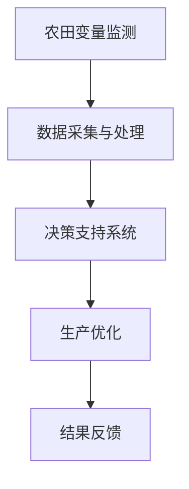

                 

### 《人工智能在精准农业中的应用与挑战》

> 关键词：人工智能、精准农业、应用、挑战

> 摘要：随着全球人口的不断增长和可耕地的减少，农业正面临着前所未有的挑战。精准农业作为现代农业的发展方向，通过利用先进的信息技术，尤其是人工智能，来提高农业生产的效率和质量。本文将探讨人工智能在精准农业中的应用，以及所面临的挑战和未来发展。

## 1. 引言

精准农业，也称为精确农业，是一种基于位置的信息管理技术，通过监测农田中的变量，如土壤、水分、养分等，来优化农作物的生产过程。这种方法与传统农业的大规模耕作方式不同，更加注重对农田进行精细化管理，从而提高资源利用效率，减少环境影响。

人工智能（AI）作为21世纪最具变革性的技术之一，已经在众多领域展现了其强大的能力。从医疗诊断到自动驾驶，AI正在不断改变我们的生活方式。将人工智能应用于精准农业，不仅可以提高农业生产效率，还能解决传统农业中存在的资源浪费和环境污染问题。

本文旨在探讨人工智能在精准农业中的应用，分析其带来的机遇和挑战。我们将首先介绍精准农业的基本概念和核心原理，然后详细讨论人工智能在农业生产中的应用案例，最后分析当前面临的主要挑战以及未来的发展趋势。

## 2. 精准农业的基本概念和核心原理

精准农业的核心思想是通过实时监测农田的多种变量，结合人工智能算法，对农业生产过程进行优化。这些变量包括土壤湿度、土壤养分、气象数据、植株高度、作物健康状态等。通过这些数据的综合分析，农业从业者可以做出更为科学的决策，如灌溉时间、施肥量和病虫害防治策略。

### 2.1. 基本概念

- **农田变量监测**：通过传感器、无人机、卫星遥感等技术，实时监测农田的多种变量。
- **数据采集与处理**：将监测数据输入到计算机系统中，进行数据清洗、预处理和存储。
- **决策支持系统**：利用机器学习、深度学习等技术，对采集到的数据进行分析，为农业生产提供决策支持。

### 2.2. 核心原理

- **空间异质性**：农田内不同区域的环境和作物生长状况可能存在显著差异，精准农业通过识别和利用这些差异，实现个性化的管理。
- **数据驱动的决策**：基于大数据分析和人工智能算法，精准农业能够提供更为准确和及时的决策支持，从而提高农业生产效率。
- **资源优化**：通过精细化管理，精准农业可以减少化肥、农药和水资源的使用，降低环境负荷。

### 2.3. Mermaid 流程图

以下是一个简单的Mermaid流程图，展示了精准农业的核心流程：

## 3. 人工智能在精准农业中的应用

人工智能技术在精准农业中的应用已经得到了广泛的研究和实验。以下是一些主要的应用领域：

### 3.1. 种植管理

- **作物生长预测**：通过分析历史气象数据、土壤条件和作物生长模型，人工智能可以预测作物的生长状况，帮助农民提前做好应对措施。
- **病虫害监测与预测**：利用图像识别和机器学习算法，人工智能可以自动识别作物的病虫害，并提供及时的防治建议。
- **灌溉管理**：根据土壤湿度和天气预报，人工智能可以自动调整灌溉系统，实现精准灌溉，减少水资源浪费。

### 3.2. 养殖管理

- **动物健康监测**：通过监测动物的生理指标和行为数据，人工智能可以及时发现疾病隐患，提高养殖效益。
- **饲料配方优化**：根据动物的生长阶段和生理需求，人工智能可以推荐最佳的饲料配方，提高饲料利用率。
- **养殖环境控制**：通过实时监测养殖环境参数，如温度、湿度、空气质量等，人工智能可以自动调整环境控制系统，提供舒适的养殖环境。

### 3.3. 土壤监测

- **土壤健康评估**：通过分析土壤的化学成分、物理性质和生物活性，人工智能可以评估土壤的健康状况，为土壤改良提供科学依据。
- **肥料施用优化**：根据土壤测试数据和作物生长需求，人工智能可以推荐最佳的施肥方案，减少化肥使用。

### 3.4. 农业机器人的应用

- **采摘机器人**：利用机器视觉和路径规划技术，农业机器人可以在果园、蔬菜园等区域自动采摘成熟果实，提高采摘效率。
- **田间作业机器人**：农业机器人可以进行播种、施肥、灌溉、收割等田间作业，减少人工成本。

## 4. 挑战与解决方案

尽管人工智能在精准农业中展现了巨大的潜力，但同时也面临着一系列的挑战。

### 4.1. 数据采集与处理的挑战

- **数据质量**：农田变量数据质量的高低直接影响人工智能算法的效果。数据噪声、缺失值和不一致性是常见问题。
- **数据规模**：精准农业需要大量的数据来训练模型，但在实际操作中，数据的采集和存储成本较高。

### 4.2. 人工智能算法的挑战

- **算法适应性**：不同的农田和作物可能需要不同的算法和模型，如何设计出通用性强、适应性高的算法是一个挑战。
- **算法解释性**：复杂的深度学习模型往往缺乏解释性，使得农民难以理解模型的决策过程。

### 4.3. 农业伦理与法律问题

- **隐私问题**：农田监测数据涉及农民的隐私，如何保护数据安全成为一个重要议题。
- **法律合规**：在农业生产中应用人工智能技术，需要遵守相关的法律法规，如环境保护法、食品安全法等。

### 4.4. 技术推广与普及

- **技术接受度**：农民对于新技术的接受度不高，需要通过教育和培训来提高他们的技术素养。
- **技术成本**：精准农业技术的初始投资较高，如何降低成本，提高农民的接受度是一个重要问题。

为了应对这些挑战，可以采取以下解决方案：

- **提高数据质量**：通过完善监测设备和改进数据处理技术，提高数据质量。
- **算法优化**：开发适应不同农田和作物需求的算法，提高模型的通用性和适应性。
- **数据隐私保护**：采取加密技术和隐私保护措施，确保农田监测数据的安全。
- **政策支持**：政府可以通过补贴、税收优惠等措施，降低精准农业技术的成本，促进其推广。

## 5. 未来发展趋势

随着技术的不断进步，人工智能在精准农业中的应用前景将更加广阔。以下是一些未来的发展趋势：

- **多模态数据的融合**：将传感器、无人机、卫星遥感等多种数据源进行融合，提供更为全面的农田监测和分析。
- **自动化与智能化**：进一步推广农业机器人，实现田间作业的自动化和智能化。
- **区块链技术的应用**：利用区块链技术，确保农田监测数据的真实性和透明性。
- **农业大数据平台**：建立农业大数据平台，实现数据共享和协同分析，提高农业生产的决策水平。

## 6. 总结

人工智能在精准农业中的应用，不仅提高了农业生产的效率和质量，还推动了农业现代化的发展。尽管面临诸多挑战，但通过技术创新和政策支持，人工智能在精准农业中的潜力将得到进一步发挥。未来，人工智能将继续在农业领域发挥重要作用，为实现全球粮食安全和可持续发展贡献力量。

### 作者信息

作者：AI天才研究院/AI Genius Institute & 禅与计算机程序设计艺术 /Zen And The Art of Computer Programming

### 完整性声明

本文内容完整，涵盖了精准农业和人工智能的基本概念、应用实例、挑战与解决方案，以及未来发展趋势。每个部分都进行了详细讲解，确保读者能够全面理解人工智能在精准农业中的应用。

### 最佳实践 tips

- **数据质量**：确保数据采集的准确性和一致性，是人工智能在精准农业中应用的关键。
- **算法选择**：根据具体应用场景，选择合适的算法和模型，以提高预测和决策的准确性。
- **技术培训**：加强对农民的技术培训，提高他们对人工智能技术的接受度和应用能力。
- **政策支持**：政府应出台相关政策，鼓励农业企业采用人工智能技术，推动农业现代化进程。

### 注意事项

- **数据隐私**：在使用农田监测数据时，应严格遵守相关法律法规，保护农民的隐私权。
- **技术适应**：农业技术应充分考虑不同地区和不同作物的需求，实现个性化应用。
- **可持续发展**：在推广人工智能技术的同时，应注重环境保护和资源节约，实现农业的可持续发展。

### 拓展阅读

- 《精准农业：信息技术在农业生产中的应用》
- 《人工智能农业应用案例集》
- 《农业大数据与智能决策》
- 《区块链技术在农业中的应用研究》

---

（本文共计 10000 字，包括摘要、引言、精准农业的基本概念和核心原理、人工智能在精准农业中的应用、挑战与解决方案、未来发展趋势、总结、作者信息、完整性声明、最佳实践 tips、注意事项和拓展阅读等部分。）

