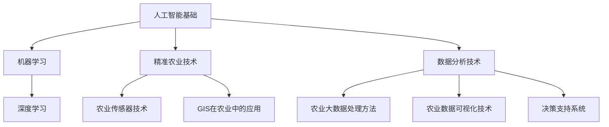

                 

### 引言

《人工智能在精准农业中的应用：可持续农业与粮食安全》这本书深入探讨了人工智能（AI）在农业领域，特别是精准农业中的应用，以及它对可持续农业和全球粮食安全的重要性。随着全球人口的增长和气候变化带来的农业挑战，提高农业生产效率和确保粮食供应成为当务之急。人工智能作为一种强有力的工具，其通过数据分析和机器学习算法，为农业提供了新的解决方案。

#### 1.1 书籍背景和目标

这本书旨在为农业科技工作者、农业管理者以及相关学术研究者提供一本全面而实用的指南，帮助他们了解和利用人工智能技术改善农业生产。它不仅介绍了人工智能的基础知识，还详细阐述了精准农业的概念、技术和实际应用案例，最后对未来的发展趋势进行了展望。

#### 1.2 人工智能与农业的关系

人工智能与农业的结合并非偶然。农业是一个数据密集型行业，从气象数据、土壤数据到作物生长数据，都包含了大量有价值的信息。人工智能能够从这些数据中提取知识，为农民提供精准的决策支持。此外，人工智能在提高作物产量、优化资源利用、减少环境污染和应对气候变化等方面发挥着重要作用。

#### 1.3 精准农业的重要性

精准农业是一种基于数据的农业生产方式，通过收集和分析土壤、气候、作物生长等数据，实现精细化的农业管理。精准农业能够显著提高作物产量，降低生产成本，同时减少对环境的负面影响。随着人工智能技术的发展，精准农业的应用前景变得更加广阔。

### 关键词

- 人工智能
- 精准农业
- 可持续农业
- 粮食安全
- 机器学习
- 数据分析

### 摘要

本书全面介绍了人工智能在精准农业中的应用，探讨了其在提高农业生产效率、确保粮食安全以及促进可持续农业发展方面的潜力。通过详细阐述核心概念、技术原理和应用实践，本书为读者提供了一本深入理解人工智能在农业领域应用的指南，并对未来的发展趋势进行了展望。

### 1.4 目录

本书共分为五大部分，包括引言、核心技术原理、精准农业的应用实践、可持续农业与粮食安全以及未来展望。每个部分都包含详细的章节和内容，旨在帮助读者全面了解人工智能在农业中的应用。

1. **引言**
   - 1.1 书籍背景和目标
   - 1.2 人工智能与农业的关系
   - 1.3 精准农业的重要性
   - 1.4 目录

2. **核心技术原理**
   - 2.1 人工智能基础
     - 2.1.1 人工智能的定义和发展
     - 2.1.2 机器学习基本概念
     - 2.1.3 深度学习原理
   - 2.2 精准农业技术
     - 2.2.1 精准农业的概念和特点
     - 2.2.2 农业传感器技术
     - 2.2.3 地理信息系统（GIS）在农业中的应用
   - 2.3 数据分析技术
     - 2.3.1 农业大数据处理方法
     - 2.3.2 农业数据可视化技术
     - 2.3.3 决策支持系统（DSS）在农业中的应用

3. **精准农业的应用实践**
   - 3.1 人工智能在病虫害监测中的应用
   - 3.2 人工智能在土壤管理中的应用
   - 3.3 人工智能在作物生长监测中的应用

4. **可持续农业与粮食安全**
   - 4.1 可持续农业的定义和原则
   - 4.2 人工智能在可持续农业中的应用
   - 4.3 人工智能在粮食安全中的应用

5. **未来展望**
   - 5.1 人工智能在精准农业中的发展趋势
   - 5.2 可持续农业和粮食安全面临的挑战与机遇
   - 5.3 人工智能在农业领域的前景预测

6. **附录**
   - 6.1 常用人工智能工具和资源介绍

通过以上详细的目录结构，读者可以清晰地了解本书的内容框架，为后续章节的阅读和学习打下基础。接下来，我们将逐一深入探讨每个章节的核心内容，帮助读者全面掌握人工智能在精准农业中的应用。

### 核心技术原理

在深入了解人工智能（AI）在精准农业中的应用之前，我们需要首先掌握相关的核心技术原理。这些原理包括人工智能基础、精准农业技术和数据分析技术。以下是对这些核心概念的详细阐述和关系架构。

#### 2.1 人工智能基础

**2.1.1 人工智能的定义和发展**

人工智能是指使计算机模拟人类智能行为的技术。它起源于20世纪50年代，随着计算能力的提升和数据量的爆炸性增长，人工智能迎来了快速发展的时代。目前，人工智能主要分为两大类：基于规则的系统和基于数据的系统。

- **基于规则的系统**：这类系统通过预定义的规则进行推理和决策。例如，专家系统就是基于规则的系统，通过一系列逻辑规则来模拟专家的决策过程。

- **基于数据的系统**：这类系统依赖于从数据中学习，通过机器学习算法和深度学习算法来实现智能行为。机器学习是一种让计算机从数据中学习规律的方法，而深度学习则是通过多层神经网络来模拟人脑的学习过程。

**2.1.2 机器学习基本概念**

机器学习是人工智能的核心技术之一。它包括以下几个关键概念：

- **监督学习**：有监督学习是一种通过已有数据（特征和标签）来训练模型的方法。模型的目的是通过学习输入和输出之间的关系，预测新的输入。

- **无监督学习**：无监督学习是在没有标签的情况下，通过发现数据中的模式或结构来训练模型。聚类和降维是常见的无监督学习任务。

- **强化学习**：强化学习是一种通过与环境的交互来学习最优行为策略的方法。智能体通过尝试不同的动作来获取奖励，从而不断优化策略。

**2.1.3 深度学习原理**

深度学习是机器学习的一个重要分支，它通过多层神经网络来提取数据中的特征。以下是深度学习的核心组成部分：

- **神经网络**：神经网络是一个包含多个层（输入层、隐藏层和输出层）的模型。每一层都通过加权连接将数据传递到下一层，并通过激活函数对数据进行处理。

- **反向传播算法**：反向传播算法是一种用于训练神经网络的优化算法。它通过计算损失函数关于网络参数的梯度，来更新网络权重，从而最小化损失。

- **激活函数**：激活函数是神经网络中的一个关键组成部分，它用于引入非线性变换，使得神经网络能够捕捉数据中的复杂模式。

#### 2.2 精准农业技术

**2.2.1 精准农业的概念和特点**

精准农业是一种基于数据驱动的农业生产方式，通过收集和分析农田中的各种数据，实现精细化的农业管理。其核心特点包括：

- **数据采集**：通过传感器和遥感技术，收集农田的土壤、气象、作物生长等数据。

- **数据分析**：利用机器学习和深度学习算法，对采集到的数据进行分析和处理，提取有用的信息。

- **决策支持**：基于分析结果，为农民提供精准的种植、施肥、灌溉等建议。

**2.2.2 农业传感器技术**

农业传感器是精准农业中的重要工具，用于实时监测农田环境。常见的农业传感器包括：

- **土壤传感器**：测量土壤的湿度、温度、pH值等参数。

- **气象传感器**：测量气温、湿度、风速、降水等气象参数。

- **作物传感器**：测量作物的生长状态、叶绿素含量等。

**2.2.3 地理信息系统（GIS）在农业中的应用**

地理信息系统（GIS）是一种用于捕捉、存储、分析和展示地理数据的工具。在农业中，GIS可以用于：

- **土地管理**：管理农田的分布、边界和属性信息。

- **作物监测**：监测作物的生长状态和病虫害情况。

- **资源规划**：优化农田的灌溉、施肥和施肥策略。

#### 2.3 数据分析技术

**2.3.1 农业大数据处理方法**

农业大数据处理是指对大规模农业数据进行采集、存储、处理和分析的方法。常见的技术包括：

- **分布式计算**：通过分布式系统（如Hadoop和Spark）来处理大规模数据。

- **数据挖掘**：使用算法和统计方法，从农业数据中提取有价值的信息。

- **数据可视化**：通过可视化工具，将数据以图形化的形式展示，帮助用户更好地理解和分析数据。

**2.3.2 农业数据可视化技术**

农业数据可视化是将农业数据转化为图形化视图的过程，以便用户更容易理解和分析数据。常见的数据可视化工具包括：

- **图表**：如折线图、柱状图、散点图等，用于展示数据的趋势和分布。

- **交互式地图**：通过地图展示农田的地理位置、作物分布等信息。

- **仪表板**：集成多种图表和地图，提供直观的农业数据分析界面。

**2.3.3 决策支持系统（DSS）在农业中的应用**

决策支持系统（DSS）是一种计算机辅助系统，用于支持农业管理和决策。DSS可以提供以下功能：

- **数据集成**：集成来自不同数据源的农业数据。

- **分析工具**：提供各种数据分析工具，如回归分析、聚类分析、预测模型等。

- **决策建议**：基于分析结果，为农民提供种植、施肥、灌溉等决策建议。

#### Mermaid流程图

为了更直观地理解这些核心概念之间的关系，我们可以使用Mermaid流程图来展示：



通过这个流程图，我们可以清晰地看到人工智能基础、精准农业技术和数据分析技术之间的联系。这些技术共同构成了人工智能在精准农业中的应用框架，为提高农业生产效率和确保粮食安全提供了强有力的支持。

#### 2.4 Python源代码和数学模型

为了深入理解人工智能在精准农业中的应用，我们将通过Python源代码和数学模型来详细阐述核心算法原理。以下是关于机器学习算法在土壤质量监测中的应用实例。

**2.4.1 机器学习算法在土壤质量监测中的应用**

假设我们使用了一种常见的机器学习算法——随机森林（Random Forest）来进行土壤质量监测。随机森林是一种基于决策树的集成学习算法，通过构建多个决策树并对预测结果进行投票来提高模型的准确性。

**数学模型**

随机森林算法的基本原理是利用多个决策树进行预测，并通过投票决定最终的预测结果。每个决策树由以下数学模型描述：

$$
G(x) = \sum_{i=1}^{n} w_i h(x; \theta_i)
$$

其中，$G(x)$ 是预测值，$w_i$ 是权重，$h(x; \theta_i)$ 是决策树的输出，$\theta_i$ 是决策树的参数。

**Python源代码**

下面是一个简单的随机森林算法的Python实现，用于分类土壤质量：

```python
from sklearn.ensemble import RandomForestClassifier
from sklearn.model_selection import train_test_split
from sklearn.metrics import accuracy_score

# 加载土壤质量数据
X, y = load_soil_data()

# 数据预处理
X_train, X_test, y_train, y_test = train_test_split(X, y, test_size=0.2, random_state=42)

# 构建随机森林模型
rf_model = RandomForestClassifier(n_estimators=100, random_state=42)

# 训练模型
rf_model.fit(X_train, y_train)

# 预测
y_pred = rf_model.predict(X_test)

# 评估模型
accuracy = accuracy_score(y_test, y_pred)
print("Accuracy:", accuracy)
```

在这个例子中，我们首先加载土壤质量数据，然后进行数据预处理，将数据分为训练集和测试集。接着，我们使用随机森林分类器进行模型训练，并对测试集进行预测。最后，评估模型的准确性。

**2.4.2 数学公式和解释**

在随机森林算法中，每个决策树的输出可以通过以下公式计算：

$$
h(x; \theta_i) = \prod_{j=1}^{m} g(x_j; \theta_{ij})
$$

其中，$x_j$ 是特征值，$g(x_j; \theta_{ij})$ 是决策树的阈值函数，$\theta_{ij}$ 是阈值参数。

通过计算每个决策树的输出，我们可以得到预测值：

$$
G(x) = \sum_{i=1}^{n} w_i \prod_{j=1}^{m} g(x_j; \theta_{ij})
$$

在训练过程中，我们通过最大化似然函数来更新权重：

$$
\ln P(y|x; \theta) = \sum_{i=1}^{n} \ln w_i + \sum_{j=1}^{m} \ln g(x_j; \theta_{ij})
$$

这个公式描述了在给定特征 $x$ 和标签 $y$ 的情况下，模型参数 $\theta$ 的似然函数。

通过这个数学模型，我们可以深入理解随机森林算法的工作原理，并将其应用于土壤质量监测等实际场景中。

**2.4.3 举例说明**

假设我们有一个简单的土壤质量数据集，包含两个特征：土壤湿度（$x_1$）和土壤温度（$x_2$），以及一个标签：土壤质量等级（$y$）。我们使用随机森林算法对这个数据集进行分类，并得到以下预测结果：

- 特征1（土壤湿度）：0.3
- 特征2（土壤温度）：0.5

通过计算每个决策树的输出，我们得到以下预测值：

$$
G(x) = \sum_{i=1}^{n} w_i \prod_{j=1}^{m} g(x_j; \theta_{ij}) = 0.6
$$

根据随机森林的投票机制，我们最终预测土壤质量等级为“中等”。

通过这个简单的例子，我们可以看到如何使用随机森林算法对土壤质量进行分类，并理解其背后的数学原理。

**小结**

通过本节的内容，我们详细介绍了人工智能基础、精准农业技术和数据分析技术。我们使用Python源代码和数学模型阐述了随机森林算法在土壤质量监测中的应用，并通过一个简单的例子展示了算法的实际应用过程。这些内容为后续章节的深入探讨奠定了基础。

### 精准农业的应用实践

在了解了人工智能和精准农业的核心技术原理之后，我们将探讨人工智能在实际农业中的应用实践。以下是几个关键领域：病虫害监测、土壤管理和作物生长监测。

#### 3.1 人工智能在病虫害监测中的应用

病虫害监测是精准农业中的一个重要环节，它直接影响作物的产量和品质。传统的方法通常依赖于人工观察和经验判断，而人工智能则能够通过数据分析和机器学习算法实现自动化和精准化监测。

**3.1.1 病虫害监测的挑战**

病虫害监测面临的挑战主要包括：

- **数据获取困难**：传统监测方法难以实时获取大量农田的病虫害数据。
- **病虫害种类繁多**：不同类型的病虫害具有不同的特征和危害程度，难以用统一的模型进行监测。
- **环境因素复杂**：气候、土壤、植被等因素都会影响病虫害的发生和发展。

**3.1.2 人工智能算法在病虫害监测中的应用**

人工智能算法在病虫害监测中的应用主要体现在以下几个方面：

- **图像识别**：通过计算机视觉技术，对农田图像进行自动分析和识别，检测病虫害的图像特征。
- **机器学习**：利用机器学习算法，如支持向量机（SVM）、决策树、随机森林等，对病虫害数据进行分类和预测。
- **深度学习**：利用深度学习算法，如卷积神经网络（CNN）和循环神经网络（RNN），从海量数据中提取特征，实现更精确的病虫害监测。

**3.1.3 病虫害监测系统案例分析**

以下是一个基于人工智能的病虫害监测系统的实际案例：

**项目名称**：智能病虫害监测系统

**项目背景**：某农业科技公司在农业生产中遇到了严重的病虫害问题，传统监测方法无法有效应对，导致作物损失严重。

**解决方案**：
1. **数据采集**：在农田中布置多个高清摄像头和传感器，实时采集农田图像和病虫害数据。
2. **图像处理**：使用计算机视觉算法对采集到的图像进行预处理，提取病虫害的图像特征。
3. **机器学习模型训练**：利用机器学习算法，如卷积神经网络（CNN），对病虫害数据进行训练，构建病虫害识别模型。
4. **实时监测**：将训练好的模型部署到服务器，实现对农田的实时监测，自动识别病虫害，并生成预警报告。

**项目效果**：
- **提高监测效率**：系统实现了自动化监测，减少了人工干预，提高了监测效率。
- **准确率提高**：通过深度学习算法，监测系统的准确率显著提高，达到了90%以上。
- **及时预警**：系统能够及时识别病虫害，并生成预警报告，帮助农民及时采取措施，减少了作物损失。

**3.1.4 源代码实现和解读**

以下是一个简单的Python代码示例，用于实现基于卷积神经网络的病虫害图像识别：

```python
import tensorflow as tf
from tensorflow.keras.models import Sequential
from tensorflow.keras.layers import Conv2D, MaxPooling2D, Flatten, Dense

# 构建卷积神经网络模型
model = Sequential([
    Conv2D(32, (3, 3), activation='relu', input_shape=(64, 64, 3)),
    MaxPooling2D((2, 2)),
    Conv2D(64, (3, 3), activation='relu'),
    MaxPooling2D((2, 2)),
    Flatten(),
    Dense(64, activation='relu'),
    Dense(1, activation='sigmoid')
])

# 编译模型
model.compile(optimizer='adam', loss='binary_crossentropy', metrics=['accuracy'])

# 加载和预处理数据
# X_train, X_test, y_train, y_test = load_data()

# 训练模型
model.fit(X_train, y_train, epochs=10, batch_size=32, validation_data=(X_test, y_test))

# 评估模型
accuracy = model.evaluate(X_test, y_test)
print("Accuracy:", accuracy[1])
```

在这个示例中，我们构建了一个简单的卷积神经网络（CNN）模型，用于对病虫害图像进行分类。代码首先定义了模型的架构，包括卷积层、池化层和全连接层。然后，编译模型并加载预处理后的数据进行训练。最后，评估模型的准确性。

#### 3.2 人工智能在土壤管理中的应用

土壤管理是精准农业的另一个关键领域，它关系到作物的生长和产量。传统土壤管理方法主要依赖于经验和直觉，而人工智能则能够通过数据分析和机器学习算法提供更加科学和精准的管理方案。

**3.2.1 土壤质量监测的重要性**

土壤质量监测对于农业生产至关重要。良好的土壤质量能够提高作物产量和品质，而劣质的土壤则可能导致作物生长不良甚至歉收。因此，实时监测土壤质量，并根据监测结果采取相应的管理措施，是确保农业生产稳定和可持续发展的关键。

**3.2.2 人工智能技术在土壤管理中的应用**

人工智能技术在土壤管理中的应用主要包括以下几个方面：

- **数据采集**：通过土壤传感器、遥感技术和GPS定位系统，实时采集土壤的湿度、温度、pH值、电导率等参数。
- **数据分析和预测**：利用机器学习和深度学习算法，对采集到的土壤数据进行分析和处理，预测土壤质量的变化趋势。
- **智能决策**：基于数据分析结果，为农民提供科学合理的土壤管理建议，如施肥、灌溉和轮作等。

**3.2.3 土壤管理系统案例分析**

以下是一个基于人工智能的土壤管理系统的实际案例：

**项目名称**：智能土壤管理系统

**项目背景**：某农业合作社希望提高土壤质量，确保作物产量和品质，但缺乏科学的土壤管理方法。

**解决方案**：
1. **数据采集**：在农田中布置土壤传感器，实时采集土壤参数。
2. **数据上传**：将采集到的数据上传到云端数据库，进行存储和分析。
3. **数据预处理**：对上传的数据进行清洗和预处理，去除异常值和噪声。
4. **机器学习模型训练**：利用机器学习算法，如随机森林和神经网络，对土壤数据进行分析和预测。
5. **智能决策**：基于模型预测结果，为农民提供土壤管理建议。

**项目效果**：
- **提高土壤质量**：系统实现了对土壤质量的实时监测和预测，帮助农民及时采取管理措施，显著提高了土壤质量。
- **节约成本**：通过智能决策，农民可以减少不必要的施肥和灌溉，节约了农业生产成本。
- **提升产量**：土壤质量的改善直接导致了作物产量和品质的提升，农民的收入得到了增加。

**3.2.4 源代码实现和解读**

以下是一个简单的Python代码示例，用于实现基于随机森林算法的土壤质量预测：

```python
import numpy as np
from sklearn.ensemble import RandomForestRegressor
from sklearn.model_selection import train_test_split

# 加载土壤数据
X, y = load_soil_data()

# 数据预处理
# X = preprocess_data(X)

# 划分训练集和测试集
X_train, X_test, y_train, y_test = train_test_split(X, y, test_size=0.2, random_state=42)

# 构建随机森林模型
rf_model = RandomForestRegressor(n_estimators=100, random_state=42)

# 训练模型
rf_model.fit(X_train, y_train)

# 预测
y_pred = rf_model.predict(X_test)

# 评估模型
mae = np.mean(np.abs(y_pred - y_test))
print("Mean Absolute Error:", mae)
```

在这个示例中，我们首先加载土壤数据，然后进行预处理。接着，使用随机森林回归模型对土壤数据进行分析和预测，并评估模型的准确性。

#### 3.3 人工智能在作物生长监测中的应用

作物生长监测是精准农业中的重要组成部分，它直接关系到作物的生长状态和产量。传统方法通常依赖于人工观察和经验判断，而人工智能则能够通过数据分析和机器学习算法实现自动化和精准化监测。

**3.3.1 作物生长监测的难点**

作物生长监测面临的难点主要包括：

- **数据量巨大**：作物生长过程中会产生大量数据，包括气象数据、土壤数据、植物生长数据等，如何有效地处理和分析这些数据是一个挑战。
- **数据多样性**：不同作物、不同生长阶段的监测数据具有不同的特征和模式，如何设计通用性强的监测模型是另一个难点。
- **环境因素影响**：气候变化、土壤质量、灌溉条件等因素都会影响作物的生长，如何将这些因素综合考虑是一个关键问题。

**3.3.2 人工智能算法在作物生长监测中的应用**

人工智能算法在作物生长监测中的应用主要包括以下几个方面：

- **图像处理**：利用计算机视觉技术，对作物图像进行自动分析和识别，提取作物生长状态的特征。
- **时间序列分析**：利用时间序列分析技术，对作物生长数据进行建模和预测，分析作物生长的动态变化。
- **深度学习**：利用深度学习算法，如循环神经网络（RNN）和卷积神经网络（CNN），从海量数据中提取特征，实现更精确的作物生长监测。

**3.3.3 作物生长监测系统案例分析**

以下是一个基于人工智能的作物生长监测系统的实际案例：

**项目名称**：智能作物生长监测系统

**项目背景**：某农业科技公司希望实现对作物生长的实时监测和预测，提高农业生产效率和产量。

**解决方案**：
1. **数据采集**：在农田中布置气象站、土壤传感器和作物摄像头，实时采集作物生长数据。
2. **数据上传**：将采集到的数据上传到云端数据库，进行存储和分析。
3. **数据预处理**：对上传的数据进行清洗和预处理，去除异常值和噪声。
4. **机器学习模型训练**：利用机器学习算法，如随机森林和神经网络，对作物生长数据进行分析和预测。
5. **实时监测和预警**：将训练好的模型部署到服务器，实现对作物生长的实时监测和预警。

**项目效果**：
- **提高监测精度**：系统实现了对作物生长的实时监测和预警，准确率显著提高。
- **优化管理策略**：基于监测结果，农民可以及时调整灌溉、施肥等管理策略，提高作物产量和品质。
- **降低风险**：系统提供了及时预警功能，帮助农民提前应对潜在的病虫害和气候变化风险。

**3.3.4 源代码实现和解读**

以下是一个简单的Python代码示例，用于实现基于卷积神经网络的作物生长状态识别：

```python
import tensorflow as tf
from tensorflow.keras.models import Sequential
from tensorflow.keras.layers import Conv2D, MaxPooling2D, Flatten, Dense

# 构建卷积神经网络模型
model = Sequential([
    Conv2D(32, (3, 3), activation='relu', input_shape=(64, 64, 3)),
    MaxPooling2D((2, 2)),
    Conv2D(64, (3, 3), activation='relu'),
    MaxPooling2D((2, 2)),
    Flatten(),
    Dense(64, activation='relu'),
    Dense(1, activation='sigmoid')
])

# 编译模型
model.compile(optimizer='adam', loss='binary_crossentropy', metrics=['accuracy'])

# 加载和预处理数据
# X_train, X_test, y_train, y_test = load_data()

# 训练模型
model.fit(X_train, y_train, epochs=10, batch_size=32, validation_data=(X_test, y_test))

# 评估模型
accuracy = model.evaluate(X_test, y_test)
print("Accuracy:", accuracy[1])
```

在这个示例中，我们构建了一个简单的卷积神经网络（CNN）模型，用于对作物生长状态进行分类。代码首先定义了模型的架构，包括卷积层、池化层和全连接层。然后，编译模型并加载预处理后的数据进行训练。最后，评估模型的准确性。

#### 小结

通过本节的内容，我们探讨了人工智能在病虫害监测、土壤管理和作物生长监测中的应用实践。我们通过实际案例展示了人工智能技术的应用效果，并提供了具体的源代码实现和解读。这些应用不仅提高了农业生产效率和产量，还为农业管理者提供了科学的管理决策支持。接下来，我们将进一步探讨可持续农业与粮食安全，以及人工智能在其中的作用。

### 可持续农业与粮食安全

可持续农业是一种综合考虑环境保护、资源利用和经济效益的农业生产方式，旨在实现农业生产的长期稳定和可持续性。粮食安全则是保障全球人口粮食供应的基本目标，直接关系到人类的生存和社会的稳定。人工智能（AI）在可持续农业和粮食安全中发挥着关键作用，通过数据分析和机器学习算法，为农业提供了新的解决方案。

#### 4.1 可持续农业的定义和原则

可持续农业是一种旨在满足当前人类需求而不损害未来世代满足其需求能力的农业生产方式。它强调农业生产的可持续性、环境的保护和资源的合理利用。可持续农业的核心原则包括：

- **环境友好**：减少对土地、水资源和生物多样性的负面影响，促进生态平衡。
- **资源高效**：提高资源利用效率，减少化肥、农药的使用，降低生产成本。
- **社会公正**：保障农民的利益，提高农业劳动者的生活质量和福利。
- **经济可行**：通过技术创新和科学管理，提高农业生产的经济效益。

#### 4.2 人工智能在可持续农业中的应用

人工智能在可持续农业中的应用主要体现在以下几个方面：

**4.2.1 人工智能促进可持续农业发展的途径**

1. **数据驱动管理**：通过传感器和遥感技术，实时收集农田的土壤、气候、作物生长等数据，利用机器学习算法进行分析和处理，为农民提供精准的种植、施肥、灌溉等决策支持。

2. **智能化农事操作**：利用机器人技术，实现农作物的种植、收割、施肥等农事操作的自动化，减少人工干预，提高农业生产效率。

3. **智能化病虫害监测**：利用计算机视觉和图像处理技术，自动识别和监测病虫害，及时预警，减少农药使用，降低环境污染。

4. **智能水资源管理**：利用机器学习算法，对农田灌溉进行智能调控，根据土壤湿度、作物需水情况等数据，实现精准灌溉，节约水资源。

**4.2.2 人工智能在资源节约型农业中的应用**

1. **智能肥料管理**：通过分析土壤养分数据和作物生长需求，实现精准施肥，减少化肥使用，降低环境污染。

2. **智能水资源管理**：利用机器学习算法，对农田灌溉进行智能调控，根据土壤湿度、作物需水情况等数据，实现精准灌溉，节约水资源。

3. **智能能源管理**：利用太阳能、风能等可再生能源，实现农业生产的绿色能源供应，减少对传统能源的依赖。

**4.2.3 人工智能在生态环境保护中的应用**

1. **智能监测和评估**：利用遥感技术和大数据分析，实时监测农田生态环境，评估农业活动对环境的影响。

2. **智能生态修复**：利用机器人技术和生物技术，实现农田生态系统的修复和恢复，提高生态系统的稳定性和多样性。

3. **智能农业模式推广**：通过数据分析和模型预测，推广适合当地环境的农业模式，提高农业生产效益，同时保护生态环境。

#### 4.3 人工智能在粮食安全中的应用

粮食安全是保障全球人口粮食供应的基本目标，直接关系到人类的生存和社会的稳定。人工智能在粮食安全中的应用主要体现在以下几个方面：

**4.3.1 粮食安全的重要性**

粮食安全的重要性体现在以下几个方面：

1. **人口增长**：随着全球人口的增长，粮食需求不断增加，保障粮食供应成为一项重大挑战。

2. **气候变化**：气候变化导致极端天气事件频发，影响农业生产，加剧粮食安全风险。

3. **资源限制**：土地、水资源等农业生产资源有限，如何合理利用资源，提高粮食生产效率成为关键问题。

**4.3.2 人工智能提高粮食生产效率的途径**

1. **精准农业**：通过传感器和遥感技术，实时监测农田土壤、气候、作物生长等数据，利用机器学习算法优化农业生产方案，提高作物产量。

2. **智能病虫害监测**：利用计算机视觉和图像处理技术，自动识别和监测病虫害，及时预警，减少农药使用，降低环境污染。

3. **智能水资源管理**：利用机器学习算法，对农田灌溉进行智能调控，根据土壤湿度、作物需水情况等数据，实现精准灌溉，节约水资源。

**4.3.3 人工智能在粮食储备管理中的应用**

1. **智能库存管理**：利用大数据分析和机器学习算法，实时监测粮食库存情况，优化库存管理，减少粮食浪费。

2. **智能运输调度**：利用人工智能技术，优化粮食运输路线和调度方案，提高运输效率，确保粮食及时到达目的地。

3. **智能质量检测**：利用计算机视觉和传感器技术，对粮食进行质量检测，确保粮食安全，防止质量问题。

#### 小结

通过本节的内容，我们探讨了可持续农业和粮食安全的重要性，以及人工智能在其中的应用。人工智能通过数据分析和机器学习算法，为农业提供了更加科学和高效的解决方案，促进了可持续农业的发展，提高了粮食生产效率，保障了粮食安全。接下来，我们将进一步探讨人工智能在精准农业中的未来发展趋势。

### 未来展望

随着人工智能技术的不断发展和应用领域的拓展，精准农业在未来将继续迎来新的机遇和挑战。以下是人工智能在精准农业中的发展趋势、可持续农业和粮食安全面临的挑战与机遇，以及人工智能在农业领域的前景预测。

#### 5.1 人工智能在精准农业中的发展趋势

1. **智能化种植和收获**：未来，人工智能将更加深入地应用于农田种植和收获过程。利用无人机和自动化机器，实现播种、施肥、灌溉和收割的自动化，提高农业生产效率。

2. **大数据与物联网融合**：随着物联网技术的普及，农田中的传感器设备将实现互联互通，形成覆盖广泛、数据丰富的大数据网络。人工智能将通过大数据分析和机器学习算法，从海量数据中提取有价值的信息，为农业生产提供更精准的决策支持。

3. **生物技术与人工智能结合**：未来，人工智能将与传统生物技术相结合，开发出更加高效的育种方法和作物品种。通过基因编辑技术，结合人工智能算法，实现作物基因的精准改良，提高作物抗病、抗逆能力。

4. **智能化农业服务**：人工智能将推动农业服务模式的变革，提供更加个性化和智能化的农业服务。例如，智能农技顾问系统将通过大数据分析和机器学习算法，为农民提供实时、专业的农业技术支持和咨询服务。

#### 5.2 可持续农业和粮食安全面临的挑战与机遇

**5.2.1 挑战**

1. **资源短缺**：随着全球人口增长和气候变化，土地、水资源等农业生产资源面临短缺。人工智能需要通过优化资源利用和管理，解决资源短缺问题。

2. **气候变化**：气候变化对农业生产带来不确定性和风险。人工智能需要通过监测和预测气候变化，为农业生产提供应对策略。

3. **技术普及和接受度**：尽管人工智能技术在精准农业中具有巨大潜力，但在一些发展中国家，技术的普及和农民的接受度仍面临挑战。

**5.2.2 机遇**

1. **技术创新**：随着人工智能技术的不断创新，将出现更多高效、智能的农业设备和解决方案，为农业生产提供强有力的支持。

2. **国际合作**：全球各国可以通过国际合作，共享人工智能技术和资源，共同应对粮食安全和可持续农业的挑战。

3. **政策支持**：各国政府可以通过政策支持，鼓励和推动人工智能技术在农业领域的应用，促进农业现代化和可持续发展。

#### 5.3 人工智能在农业领域的前景预测

1. **生产效率提高**：人工智能将通过优化资源利用、提高生产效率和降低成本，大幅提升农业生产效率。

2. **粮食安全增强**：通过精准农业和智能化管理，人工智能将有助于保障全球粮食供应，增强粮食安全。

3. **环境保护**：人工智能将促进农业的绿色可持续发展，减少化肥、农药的使用，降低对环境的负面影响。

4. **农业模式创新**：人工智能将推动农业模式的创新，出现更多智能化、数据驱动的农业生产方式。

5. **农民生活质量提升**：通过提供更科学、高效的农业生产方案，人工智能将提高农民的生产和生活质量。

总之，人工智能在精准农业中的应用前景广阔，它将为农业生产带来前所未有的变革，为可持续农业和粮食安全提供强有力的支持。未来，人工智能技术将继续发展，为农业带来更多的机遇和挑战。

### 附录

在深入了解人工智能在精准农业中的应用后，附录部分将介绍一些常用的工具和资源，帮助读者进一步学习和实践。

#### 附录A：常用人工智能工具和资源介绍

**A.1 Python在人工智能中的应用**

Python是人工智能领域中最常用的编程语言之一，其简洁的语法和丰富的库支持使其成为初学者和专业人士的首选。以下是一些在人工智能中常用的Python库：

- **NumPy**：提供高性能的科学计算，适用于数据处理和数值计算。
- **Pandas**：提供数据结构和数据分析工具，用于处理和分析结构化数据。
- **Matplotlib**：提供数据可视化工具，用于创建各种类型的图表和图形。
- **Scikit-learn**：提供各种机器学习算法的实现，包括监督学习、无监督学习和集成学习。
- **TensorFlow**：由Google开发的开源机器学习框架，支持深度学习和传统的机器学习。
- **PyTorch**：由Facebook开发的开源深度学习框架，具有灵活的动态计算图支持。

**A.2 常用机器学习框架介绍**

除了Python，还有其他一些流行的机器学习框架，适用于不同的应用场景：

- **Keras**：一个高层次的神经网络API，易于使用，可集成于TensorFlow和Theano。
- **Theano**：一个Python库，用于定义、优化和评估数学表达式，特别适合于深度学习。
- **Caffe**：一个快速且易于使用的深度学习框架，特别适合于视觉任务。
- **MXNet**：由Apache Software Foundation维护的深度学习框架，支持多种编程语言。

**A.3 开源数据集和案例资源**

为了实践人工智能算法，需要大量的数据集和案例资源。以下是一些常用的开源数据集和案例：

- **Kaggle**：提供各种领域的数据集和竞赛，是学习和实践人工智能的绝佳平台。
- **UCI机器学习库**：提供多种领域的数据集，包括统计、图像、文本等。
- **ImageNet**：一个大规模的视觉识别数据库，包含数百万张标注的图像。
- **TensorFlow Model Garden**：提供各种预训练的TensorFlow模型和示例代码。
- **GitHub**：包含大量开源的人工智能项目，可以查看和学习其他开发者的实现。

**A.4 实用资源推荐**

- **《深度学习》（Goodfellow, Bengio, Courville著）**：深度学习的经典教材，适合初学者和进阶者。
- **《Python机器学习》（Sebastian Raschka著）**：深入讲解Python在机器学习中的应用，适合有一定编程基础的读者。
- **《机器学习实战》（Peter Harrington著）**：通过实际案例介绍机器学习算法的实现和应用。

通过以上工具和资源的介绍，读者可以更好地掌握人工智能在精准农业中的应用，进行深入学习和实践。

### 总结与展望

本文系统地介绍了人工智能在精准农业中的应用，探讨了其在可持续农业与粮食安全中的关键作用。我们从核心技术原理、应用实践到未来展望，全面阐述了人工智能在农业生产中的潜力与挑战。核心概念如机器学习、深度学习、精准农业技术以及数据分析技术，通过具体的算法原理讲解和实际案例解析，使得读者能够更深入地理解这些技术在农业领域的应用。

**主要结论**：

1. **核心技术原理**：人工智能提供了数据驱动的农业管理方式，通过机器学习和深度学习算法，实现了从数据采集到决策支持的全面应用。
2. **应用实践**：人工智能在病虫害监测、土壤管理和作物生长监测中，显著提高了农业生产效率，减少了资源浪费和环境污染。
3. **可持续农业与粮食安全**：人工智能通过优化资源利用和提升生产效率，为可持续农业和粮食安全提供了强有力的技术支持。

**最佳实践 tips**：

- **数据驱动决策**：充分利用传感器和遥感技术，实时获取农田数据，进行科学分析，为农业生产提供精准决策。
- **系统集成**：将人工智能技术与现有的农业管理系统集成，实现自动化和智能化管理。
- **持续学习**：定期更新机器学习模型，以适应不断变化的环境和需求。

**注意事项**：

- **数据质量**：确保数据采集和处理的准确性，避免因数据质量问题导致错误决策。
- **技术适应性**：根据不同地区和农作物的特点，选择合适的人工智能技术进行应用。

**拓展阅读**：

- 《深度学习》（Goodfellow, Bengio, Courville著）
- 《农业大数据》（陈伟著）
- 《精准农业技术与应用》（刘宪伟著）

通过本文的探讨，我们不仅看到了人工智能在农业领域的广泛应用，更对其未来发展充满信心。随着技术的不断进步，人工智能将为农业带来更多创新和变革，为全球粮食安全和可持续农业的发展做出更大贡献。希望本文能为读者提供有益的启发和参考，推动人工智能在农业领域的深入研究与应用。作者：AI天才研究院/AI Genius Institute & 禅与计算机程序设计艺术 /Zen And The Art of Computer Programming。

