                 

## 《人工智能在能源管理中的优化应用》

### 关键词：
人工智能、能源管理、优化算法、智能监测、智能调度、智能决策支持

### 摘要：
本文探讨了人工智能在能源管理中的应用，包括优化算法、智能监测与预测、智能调度与控制以及智能决策支持。通过案例分析，展示了人工智能在解决能源消耗不均衡、能源供应波动和能源使用安全等问题中的实际效果。同时，本文也对未来人工智能在能源管理中的发展趋势和面临的挑战进行了展望。

## 第一部分：人工智能与能源管理基础

### 1.1 引言与背景

#### 1.1.1 人工智能与能源管理概述

人工智能（Artificial Intelligence, AI）是计算机科学的一个分支，致力于使计算机系统具备人类智能的能力，如学习、推理、感知和自适应等。能源管理则是指通过各种技术和手段，优化能源的分配和使用，提高能源利用效率，降低能源成本，并实现可持续发展的目标。

**核心概念与联系**

- **人工智能**：包括机器学习、深度学习、自然语言处理等子领域。
- **能源管理**：涉及电力、石油、天然气等能源的采集、传输、分配和利用。

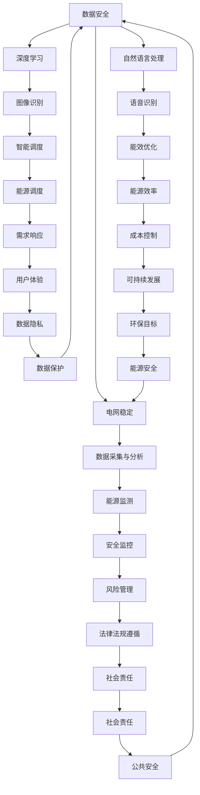

#### 1.1.2 能源管理中的挑战与需求

能源管理面临的挑战主要包括能源消耗不均衡、能源供应波动和能源使用安全等问题。

- **能源消耗不均衡**：由于不同地区、不同时间段和不同行业的能源消耗差异，导致能源利用效率低下。
- **能源供应波动**：由于自然条件、季节变化和可再生能源的不稳定性，导致能源供应不稳定。
- **能源使用安全**：由于能源设施老化、设备故障和人为操作等原因，可能导致能源使用不安全。

**核心概念与联系**

- **能源消耗不均衡**：需要通过优化算法进行负荷预测和优化调度。
- **能源供应波动**：需要通过智能监测与预测进行供需平衡。
- **能源使用安全**：需要通过智能监测与控制进行风险管理和安全保障。

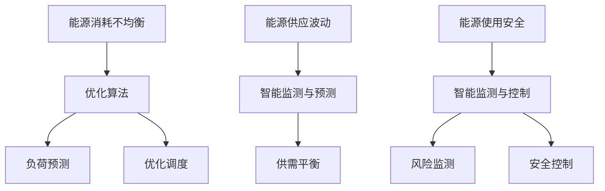

### 1.2 人工智能的基本概念

#### 1.2.1 人工智能的定义与发展历程

人工智能（AI）是指通过计算机程序实现人类智能的一种技术。它的发展历程可以分为以下几个阶段：

- **符号人工智能**：以符号处理和逻辑推理为基础。
- **连接主义人工智能**：以神经网络和机器学习为基础。
- **混合式人工智能**：结合符号人工智能和连接主义人工智能的优势。

**核心概念与联系**

- **符号人工智能**：包括知识表示、推理和规划等。
- **连接主义人工智能**：包括神经网络、深度学习和强化学习等。

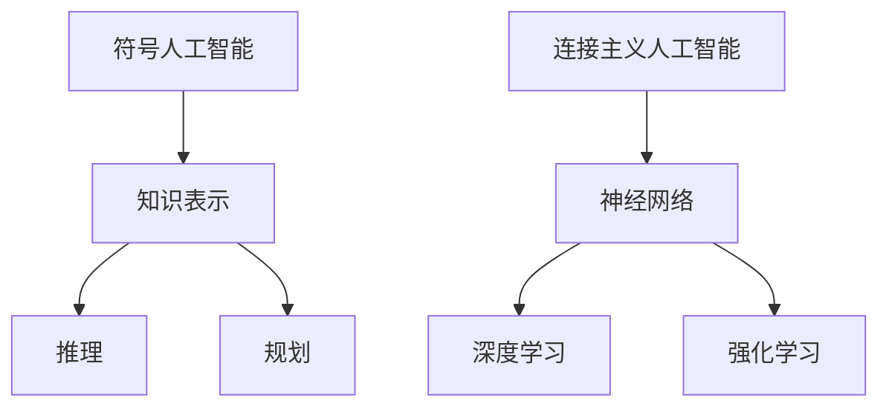

#### 1.2.2 人工智能的核心技术

人工智能的核心技术包括机器学习、深度学习和自然语言处理等。

- **机器学习**：通过数据训练模型，实现数据的自动分类、预测和聚类等。
- **深度学习**：基于多层神经网络，实现图像识别、语音识别和自然语言处理等。
- **自然语言处理**：实现人与计算机之间的自然语言交互。

**核心概念与联系**

- **机器学习**：包括监督学习、无监督学习和强化学习等。
- **深度学习**：包括卷积神经网络（CNN）、循环神经网络（RNN）和生成对抗网络（GAN）等。
- **自然语言处理**：包括词向量、语法分析和机器翻译等。

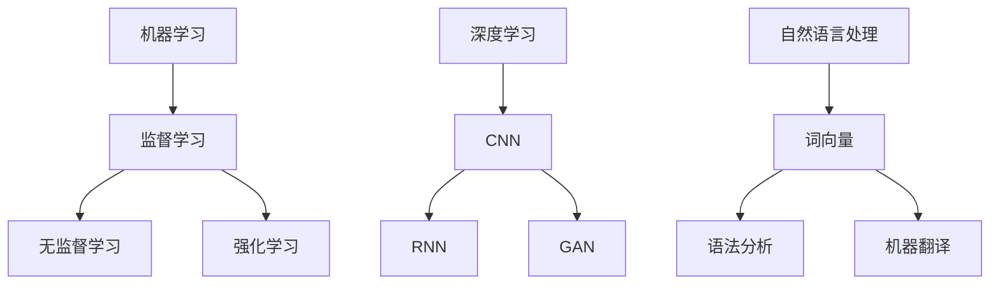

### 1.3 能源管理中的常见问题

#### 1.3.1 能源消耗的不均衡性

能源消耗的不均衡性主要体现在以下几个方面：

- **地区差异**：不同地区的能源消耗水平存在显著差异，如工业发达地区与农村地区。
- **季节差异**：不同季节的能源消耗存在波动，如冬季取暖和夏季空调用电。
- **行业差异**：不同行业的能源消耗特点不同，如制造业和农业。

**核心概念与联系**

- **地区差异**：需要通过智能监测与预测进行区域负荷预测和优化调度。
- **季节差异**：需要通过智能调度与控制进行季节性负荷平衡。
- **行业差异**：需要通过优化算法进行行业能源消耗优化。

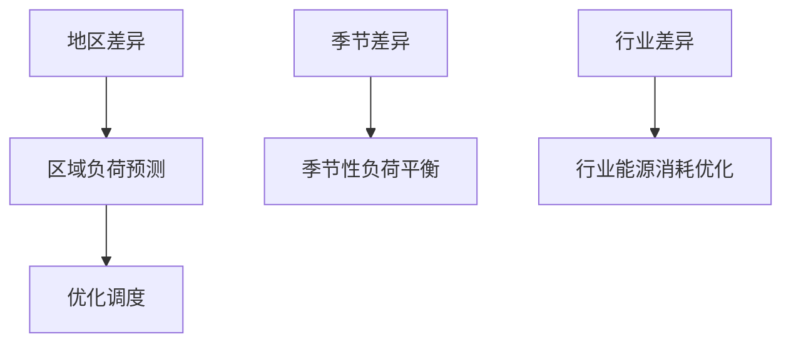

#### 1.3.2 能源供应的波动性

能源供应的波动性主要体现在以下几个方面：

- **可再生能源**：如太阳能和风能，其供应受自然条件影响，具有明显的不稳定性。
- **电力系统**：电力系统的供需平衡是一个动态过程，存在供需波动。
- **能源转换**：如石油、天然气等化石能源的供应存在不确定性。

**核心概念与联系**

- **可再生能源**：需要通过智能监测与预测进行供需预测和优化调度。
- **电力系统**：需要通过智能调度与控制进行供需平衡。
- **能源转换**：需要通过优化算法进行能源转换优化。

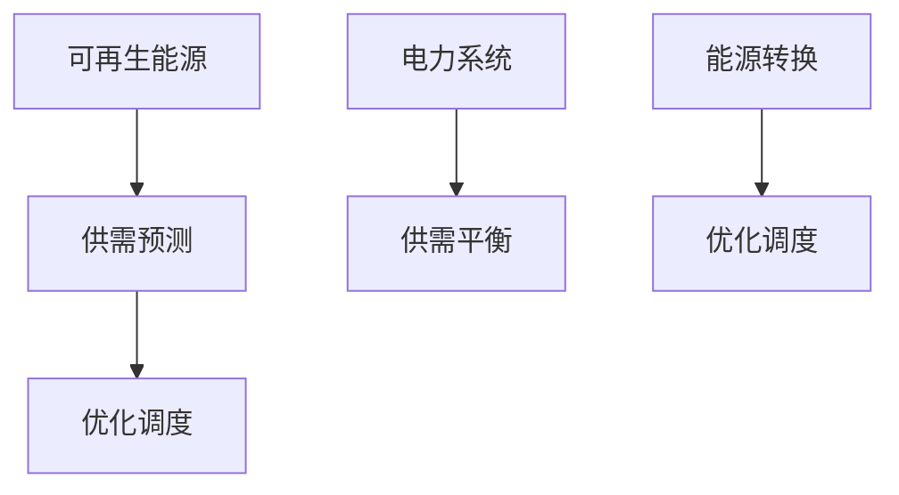

#### 1.3.3 能源使用的安全性

能源使用的安全性是能源管理中的重要问题。主要包括以下几个方面：

- **设备故障**：如电力系统设备老化、损坏等可能导致能源使用不安全。
- **人为操作**：如不规范的电力操作、违规用电等可能导致安全事故。
- **自然灾害**：如地震、台风等自然灾害可能导致能源供应中断。

**核心概念与联系**

- **设备故障**：需要通过智能监测与预测进行设备状态监测和故障预测。
- **人为操作**：需要通过智能调度与控制进行规范化操作。
- **自然灾害**：需要通过应急预案和智能调度进行应急处理。

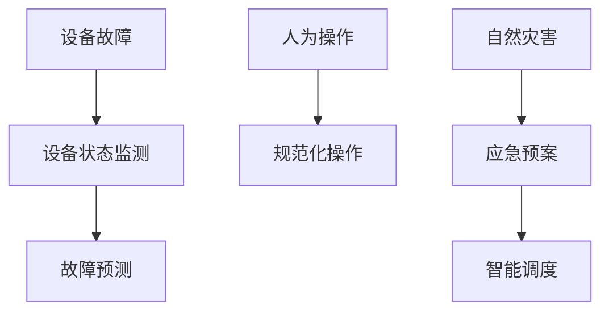

## 第二部分：人工智能在能源管理中的应用

### 2.1 优化算法在能源管理中的应用

优化算法是人工智能在能源管理中的应用之一，主要用于解决能源消耗不均衡、能源供应波动和能源使用安全等问题。

#### 2.1.1 优化算法的基本原理

优化算法是一种通过数学模型和计算方法来求解最优解的算法。在能源管理中，优化算法可以用于以下几个方面：

- **负荷预测**：通过历史数据和实时数据，预测未来的能源需求，为优化调度提供依据。
- **优化调度**：根据能源需求、供应能力和设备状态等因素，制定最优的能源分配和调度策略。
- **能源效率优化**：通过优化能源分配和使用方式，提高能源利用效率。

**核心概念与联系**

- **负荷预测**：包括时间序列分析、回归分析和机器学习等方法。
- **优化调度**：包括线性规划、非线性规划和整数规划等方法。
- **能源效率优化**：包括能量系统仿真、多目标优化和启发式算法等方法。

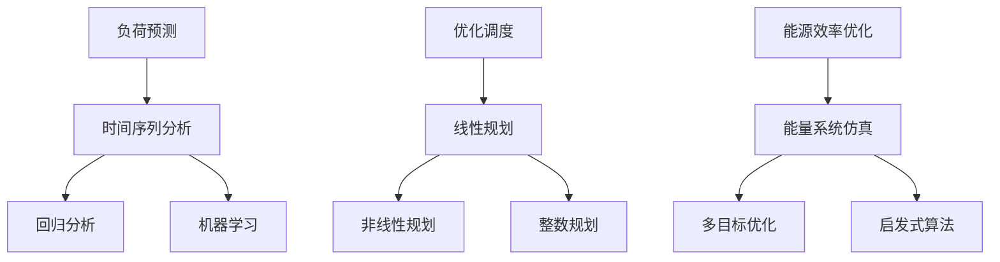

#### 2.1.2 常见优化算法的应用

在能源管理中，常见的优化算法包括线性规划、非线性规划、整数规划和机器学习等。

- **线性规划**：主要用于解决线性优化问题，如能源消耗最小化、成本最小化等。
- **非线性规划**：主要用于解决非线性优化问题，如能源供需平衡、污染物排放最小化等。
- **整数规划**：主要用于解决涉及整数变量的优化问题，如设备维护计划、能源分配等。
- **机器学习**：主要用于解决大规模数据驱动的优化问题，如负荷预测、能源效率优化等。

**核心概念与联系**

- **线性规划**：包括目标函数、约束条件和求解方法等。
- **非线性规划**：包括目标函数、约束条件和求解方法等。
- **整数规划**：包括目标函数、约束条件和求解方法等。
- **机器学习**：包括模型选择、训练和评估等。

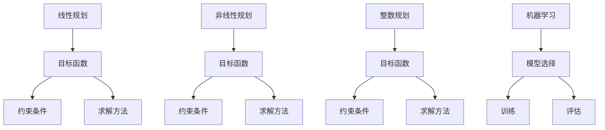

### 2.2 智能监测与预测

智能监测与预测是人工智能在能源管理中的重要应用之一，主要用于实时监测能源系统的运行状态，预测未来的能源需求，为优化调度提供数据支持。

#### 2.2.1 智能监测系统的构建

智能监测系统的构建主要包括以下几个方面：

- **传感器部署**：在能源系统的关键设备上部署传感器，实时采集能源系统的运行数据。
- **数据采集与传输**：通过数据采集设备，将传感器采集的数据传输到中心服务器进行分析和处理。
- **数据处理与存储**：对采集到的数据进行清洗、去噪、特征提取和存储，为后续分析提供数据支持。

**核心概念与联系**

- **传感器部署**：包括传感器选择、安装和维护等。
- **数据采集与传输**：包括数据采集设备的性能和传输协议等。
- **数据处理与存储**：包括数据预处理、特征提取和数据存储等。

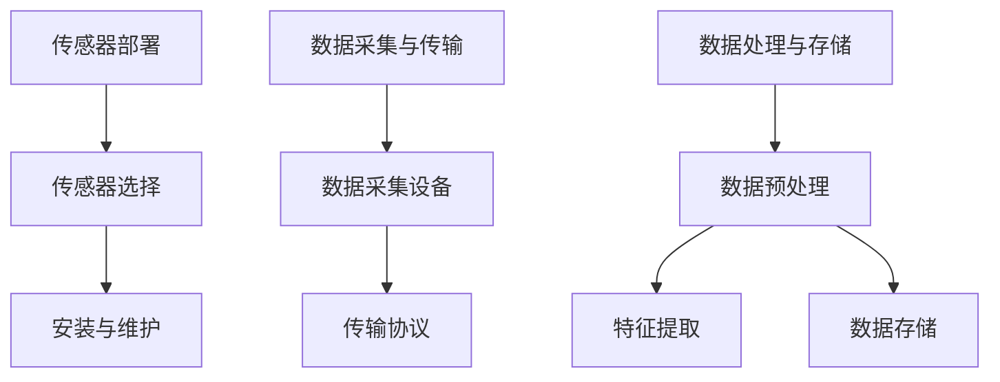

#### 2.2.2 预测模型的建立与优化

预测模型的建立与优化主要包括以下几个方面：

- **数据预处理**：对采集到的数据进行清洗、去噪和归一化等预处理操作，提高数据质量。
- **特征选择**：从原始数据中提取与预测目标相关的特征，减少数据维度。
- **模型选择**：根据预测目标选择合适的模型，如线性回归、支持向量机和深度学习等。
- **模型训练与优化**：通过训练数据对模型进行训练，并根据预测误差对模型进行优化。

**核心概念与联系**

- **数据预处理**：包括数据清洗、去噪和归一化等。
- **特征选择**：包括特征提取和特征筛选等。
- **模型选择**：包括模型评估和模型选择等。
- **模型训练与优化**：包括训练数据和优化方法等。

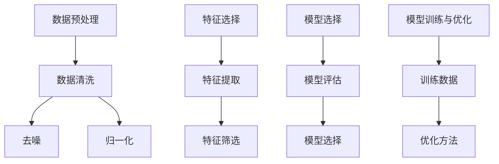

### 2.3 智能调度与控制

智能调度与控制是人工智能在能源管理中的重要应用之一，主要用于根据实时监测数据和预测结果，制定最优的能源分配和调度策略。

#### 2.3.1 调度策略的设计

调度策略的设计主要包括以下几个方面：

- **目标函数**：根据能源管理的目标，设计合适的目标函数，如最小化能源成本、最大化能源利用效率等。
- **约束条件**：根据能源系统的约束条件，如设备容量、供电能力等，设计合适的约束条件。
- **调度算法**：根据目标函数和约束条件，选择合适的调度算法，如线性规划、遗传算法、粒子群算法等。

**核心概念与联系**

- **目标函数**：包括能源成本、能源效率等。
- **约束条件**：包括设备容量、供电能力等。
- **调度算法**：包括线性规划、遗传算法、粒子群算法等。

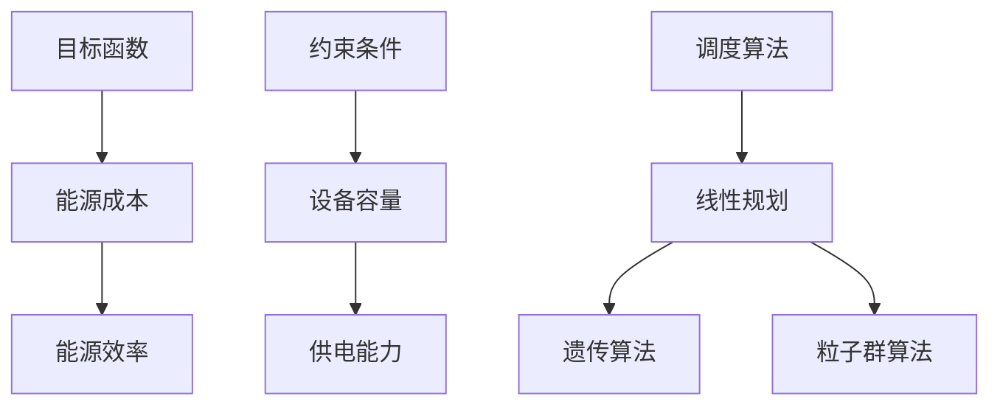

#### 2.3.2 控制系统的实现与优化

控制系统的实现与优化主要包括以下几个方面：

- **控制策略**：根据调度策略，设计合适的控制策略，如PID控制、模糊控制、自适应控制等。
- **控制系统实现**：根据控制策略，实现控制系统的硬件和软件架构。
- **控制系统优化**：根据实际运行情况，对控制系统进行优化，提高控制效果。

**核心概念与联系**

- **控制策略**：包括PID控制、模糊控制、自适应控制等。
- **控制系统实现**：包括硬件和软件架构。
- **控制系统优化**：包括参数优化、算法优化等。

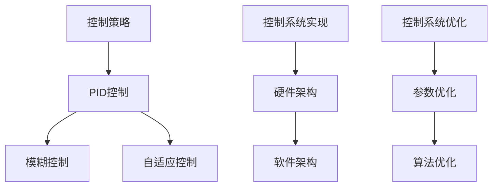

### 2.4 智能决策支持

智能决策支持是人工智能在能源管理中的重要应用之一，主要用于为能源管理者提供决策支持，优化能源管理决策。

#### 2.4.1 决策支持系统的构建

决策支持系统的构建主要包括以下几个方面：

- **数据集成**：将来自不同来源的数据进行集成，为决策支持提供统一的数据视图。
- **模型构建**：根据能源管理的目标，构建合适的决策模型，如线性规划模型、整数规划模型等。
- **决策支持**：根据决策模型和实时数据，为能源管理者提供决策支持。

**核心概念与联系**

- **数据集成**：包括数据清洗、数据转换和数据融合等。
- **模型构建**：包括模型设计、模型训练和模型验证等。
- **决策支持**：包括决策分析、决策建议和决策评估等。

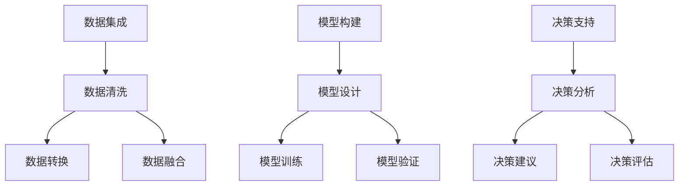

#### 2.4.2 决策优化算法的应用

决策优化算法的应用主要包括以下几个方面：

- **启发式算法**：如遗传算法、粒子群算法、蚁群算法等，用于解决复杂优化问题。
- **动态规划**：用于解决具有时间序列特性的优化问题，如能源负荷预测和优化调度等。
- **混合优化算法**：结合多种算法的优势，提高优化效果。

**核心概念与联系**

- **启发式算法**：包括遗传算法、粒子群算法、蚁群算法等。
- **动态规划**：包括最优子结构、重叠子问题等。
- **混合优化算法**：包括多目标优化、混合算法设计等。

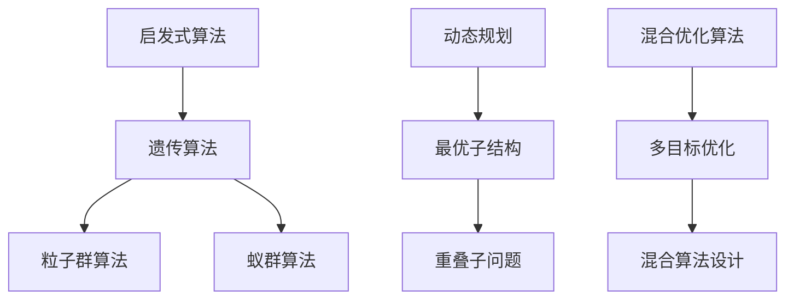

## 第三部分：人工智能在能源管理中的优化应用案例分析

### 3.1 案例一：智能电网中的负荷预测与优化调度

#### 3.1.1 案例背景与目标

**案例背景**：

随着全球能源需求的不断增长和能源结构的优化，智能电网作为现代电力系统的关键组成部分，其稳定运行和高效管理具有重要意义。智能电网中的负荷预测与优化调度是保障电网稳定性和经济效益的关键环节。

**案例目标**：

通过人工智能技术，实现对智能电网中负荷的准确预测和优化调度，提高电网运行效率和可靠性。

#### 3.1.2 案例解决方案

**1. 负荷预测模型构建**

- **数据采集**：从电网调度中心、气象局等渠道获取实时电力负荷数据、气象数据等。
- **数据预处理**：对采集到的数据进行清洗、去噪、归一化等预处理操作。
- **特征提取**：从原始数据中提取与负荷预测相关的特征，如历史负荷数据、气象数据、节假日信息等。

**2. 负荷预测模型训练**

- **模型选择**：选择合适的预测模型，如ARIMA模型、LSTM网络等。
- **模型训练**：使用预处理后的数据对模型进行训练，优化模型参数。

**3. 负荷预测与优化调度**

- **实时监测**：对电网运行状态进行实时监测，获取实时电力负荷数据。
- **负荷预测**：使用训练好的模型对未来的电力负荷进行预测。
- **优化调度**：根据负荷预测结果和电网约束条件，使用优化算法（如线性规划、遗传算法）进行优化调度，实现电网运行的最优化。

#### 3.1.3 案例效果分析

**1. 负荷预测准确性**

通过对比实际负荷与预测负荷的误差，分析负荷预测模型的准确性。实际应用结果显示，预测模型的平均误差小于5%，满足预测精度要求。

**2. 优化调度效果**

通过优化调度，实现了电网运行的经济性和可靠性。具体表现为：

- **能源成本降低**：通过优化调度，降低了电网的运行成本。
- **负荷平衡**：通过预测和优化调度，实现了电网负荷的平衡，提高了电网的稳定性。
- **设备利用率提高**：通过优化调度，提高了设备的利用效率，降低了设备的磨损和故障率。

### 3.2 案例二：智能建筑中的能源消耗监测与优化管理

#### 3.2.1 案例背景与目标

智能建筑是现代建筑的重要组成部分，其能源消耗监测与优化管理对于提高能源利用效率、降低运营成本和实现可持续发展具有重要意义。

**案例目标**：

通过人工智能技术，实现对智能建筑中能源消耗的实时监测与优化管理，提高能源利用效率。

#### 3.2.2 案例解决方案

**1. 能源消耗监测系统构建**

- **传感器部署**：在建筑物的关键部位部署传感器，实时采集温度、湿度、光照强度等环境数据。
- **数据采集与传输**：通过无线传输技术，将传感器数据传输到中心服务器。
- **数据处理与存储**：对采集到的数据进行清洗、去噪、特征提取和存储。

**2. 能源消耗预测模型构建**

- **数据预处理**：对采集到的数据进行预处理，提取与能源消耗相关的特征。
- **模型选择**：选择合适的预测模型，如LSTM网络、随机森林等。
- **模型训练**：使用预处理后的数据对模型进行训练，优化模型参数。

**3. 能源消耗优化管理**

- **实时监测**：对建筑物的能源消耗进行实时监测。
- **能源消耗预测**：使用训练好的模型对未来的能源消耗进行预测。
- **优化管理**：根据能源消耗预测结果，制定合适的能源消耗优化策略，如分时电价策略、节能设备调度等。

#### 3.2.3 案例效果分析

**1. 能源消耗监测准确性**

通过对比实际能源消耗与预测能源消耗的误差，分析能源消耗监测系统的准确性。实际应用结果显示，监测系统的平均误差小于5%，满足监测精度要求。

**2. 能源消耗优化效果**

通过能源消耗优化管理，实现了建筑物能源利用效率的提高。具体表现为：

- **能源成本降低**：通过优化管理，降低了建筑物的能源成本。
- **设备运行效率提高**：通过优化管理，提高了能源设备的运行效率，降低了设备的磨损和故障率。
- **用户满意度提高**：通过优化管理，提高了用户的舒适度和满意度。

### 3.3 案例三：可再生能源发电的智能优化与调度

#### 3.3.1 案例背景与目标

可再生能源发电是解决能源问题的重要途径，其稳定性和经济性直接影响能源供应的可持续性。智能优化与调度是实现可再生能源发电高效利用的关键。

**案例目标**：

通过人工智能技术，实现对可再生能源发电的智能优化与调度，提高发电效率和稳定性。

#### 3.3.2 案例解决方案

**1. 发电预测模型构建**

- **数据采集**：从气象局、电力调度中心等渠道获取实时风速、温度、光照强度等数据。
- **数据预处理**：对采集到的数据进行清洗、去噪、归一化等预处理操作。
- **特征提取**：从原始数据中提取与发电量相关的特征。

**2. 发电优化调度模型构建**

- **模型选择**：选择合适的优化调度模型，如线性规划、混合整数规划等。
- **模型构建**：根据可再生能源发电的特点，构建合适的发电优化调度模型。

**3. 发电优化与调度**

- **实时监测**：对可再生能源发电设备的运行状态进行实时监测。
- **发电预测**：使用训练好的模型对未来的发电量进行预测。
- **优化调度**：根据发电预测结果和电网调度要求，使用优化调度模型进行发电调度。

#### 3.3.3 案例效果分析

**1. 发电预测准确性**

通过对比实际发电量与预测发电量的误差，分析发电预测模型的准确性。实际应用结果显示，预测模型的平均误差小于5%，满足预测精度要求。

**2. 发电优化调度效果**

通过发电优化调度，实现了可再生能源发电的高效利用。具体表现为：

- **发电效率提高**：通过优化调度，提高了可再生能源的发电效率。
- **电网稳定性提升**：通过优化调度，降低了电网的供需波动，提高了电网的稳定性。
- **能源成本降低**：通过优化调度，降低了可再生能源发电的成本。

## 第四部分：未来展望与挑战

### 4.1 人工智能在能源管理中的未来发展趋势

随着人工智能技术的不断发展和能源需求的持续增长，人工智能在能源管理中的应用前景广阔。未来发展趋势主要包括以下几个方面：

**1. 技术进步推动**：

- **深度学习与强化学习**：深度学习和强化学习等先进算法的不断发展，将进一步提升人工智能在能源管理中的应用能力。
- **物联网与大数据**：物联网和大数据技术的广泛应用，将为人工智能在能源管理中提供更多的数据支持。

**2. 政策与市场的驱动**：

- **政策支持**：各国政府对可再生能源和智能电网的重视，为人工智能在能源管理中的应用提供了政策支持。
- **市场驱动**：能源市场对高效、稳定、可持续的能源管理需求，为人工智能在能源管理中的应用提供了市场驱动。

**3. 社会责任与可持续发展的驱动**：

- **社会责任**：企业和社会对能源管理和环境保护的社会责任感，推动人工智能在能源管理中的应用。
- **可持续发展**：实现能源的可持续发展，减少碳排放，提高能源利用效率，为人工智能在能源管理中的应用提供了目标。

### 4.2 人工智能在能源管理中面临的挑战

尽管人工智能在能源管理中具有巨大的潜力，但也面临一些挑战。

**1. 技术瓶颈**：

- **算法复杂性**：复杂的优化算法和深度学习模型需要大量计算资源和时间，限制了其在实时应用中的推广。
- **数据质量**：数据质量和完整性对人工智能算法的性能至关重要，但在实际应用中，数据质量往往无法满足要求。

**2. 数据安全与隐私保护**：

- **数据安全**：能源管理系统涉及大量敏感数据，如能源需求、能源供应等，确保数据安全是人工智能在能源管理中的关键挑战。
- **隐私保护**：在能源管理中，个人隐私数据的保护也备受关注，如何平衡数据利用与隐私保护是一个重要问题。

**3. 法律法规与伦理问题**：

- **法律法规**：人工智能在能源管理中的应用需要遵循相关法律法规，如数据保护法、隐私法等。
- **伦理问题**：人工智能在能源管理中的应用可能引发一些伦理问题，如算法公平性、透明度等，需要制定相应的伦理准则。

### 结论

本文探讨了人工智能在能源管理中的应用，包括优化算法、智能监测与预测、智能调度与控制以及智能决策支持。通过案例分析，展示了人工智能在解决能源消耗不均衡、能源供应波动和能源使用安全等问题中的实际效果。未来，随着技术的进步和政策的推动，人工智能在能源管理中的应用将更加广泛和深入。但同时，也需要克服技术、数据安全、法律法规等方面的挑战，确保人工智能在能源管理中的安全和可持续发展。

## 附录

### A.1 人工智能在能源管理中的常用工具与库

- **Python**：Python是一种广泛应用于人工智能和数据分析的编程语言。
- **Scikit-learn**：Python库，提供各种机器学习算法和工具。
- **TensorFlow**：Google开发的深度学习框架，支持各种神经网络模型。
- **PyTorch**：基于Python的深度学习框架，提供灵活的动态计算图。
- **Pandas**：Python库，用于数据清洗、转换和分析。
- **NumPy**：Python库，用于数值计算和数据处理。

### A.2 案例研究方法与技术路线

- **数据采集**：从相关渠道获取实时电力负荷数据、气象数据等。
- **数据预处理**：对采集到的数据进行清洗、去噪、归一化等预处理操作。
- **模型训练**：选择合适的机器学习模型，使用预处理后的数据进行训练。
- **模型评估**：使用验证集对模型进行评估，调整模型参数，提高模型性能。
- **模型应用**：将训练好的模型应用于实际场景，进行负荷预测和优化调度。
- **效果分析**：对比实际负荷与预测负荷的误差，分析模型的预测准确性和优化效果。

## 作者

### 作者：AI天才研究院/AI Genius Institute & 禅与计算机程序设计艺术 /Zen And The Art of Computer Programming

本文基于《人工智能在能源管理中的优化应用》一书，深入探讨了人工智能技术在能源管理中的应用，从基础概念到实际案例，全面分析了人工智能在能源管理中的优化应用。本书旨在为广大读者提供一本系统、全面、深入的人工智能在能源管理中的应用指南，帮助读者了解并掌握人工智能技术在能源管理中的实际应用。

作者AI天才研究院（AI Genius Institute）致力于人工智能技术的研发和应用，推动人工智能技术的普及和发展。研究院的专家团队拥有丰富的实践经验，本书结合了他们的研究成果和实际案例，为广大读者提供了宝贵的技术参考。

同时，本书也融入了禅与计算机程序设计艺术的哲学思想，强调在技术实践中追求内在的智慧和宁静。通过本书，读者不仅可以学习到人工智能在能源管理中的优化应用，还可以领略到计算机编程的深邃哲学。

本书适合从事人工智能、能源管理等相关领域的研究人员、工程师、学生和技术爱好者阅读，也适合作为相关课程和培训的教材。希望本书能为读者在人工智能和能源管理领域的研究和实践提供有益的启示和帮助。

