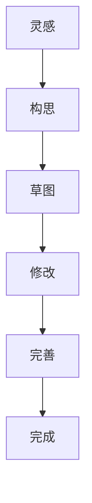
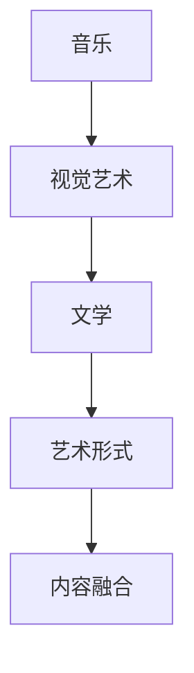
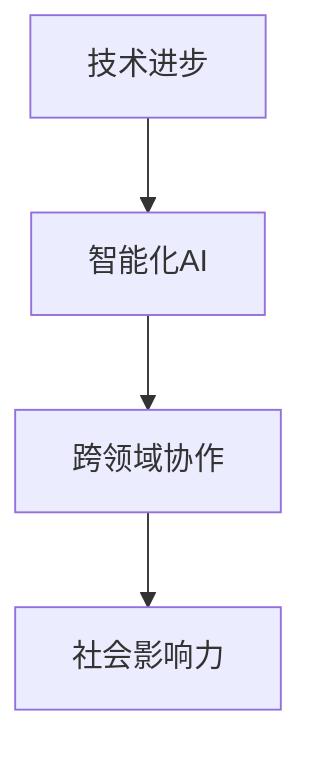

                 

### 摘要

本文深入探讨了人工智能在艺术创作中的角色，分析了AI如何辅助艺术创作，以及这一过程中涉及的核心技术和艺术本质。首先，我们定义了人工智能和艺术创作的相关概念，探讨了它们之间的联系与融合。随后，我们详细介绍了深度学习、强化学习和自然语言处理等核心人工智能技术，并解释了它们在艺术创作中的应用。接着，通过实例分析，展示了AI在音乐、视觉艺术和文学创作中的具体应用。最后，我们探讨了AI辅助创作的伦理问题，并思考了艺术创作的非线性和创造性在AI辅助创作中的体现。本文旨在为读者提供一个全面、深入理解人工智能与艺术创作结合的视角。

### 第一部分：人工智能与艺术创作的理论基础

#### 第1章：人工智能与艺术创作的关系

在进入人工智能（AI）辅助艺术创作的探讨之前，我们需要明确AI和艺术创作的基本概念，以及它们在当前社会中的重要性。人工智能，作为计算机科学的一个重要分支，主要研究如何构建能够执行复杂任务、学习与适应环境的智能系统。这些系统通过算法和大量数据来模拟人类的智能行为，包括感知、推理、学习和决策等。

艺术创作，则是一种表达情感、思想和观念的方式，通过视觉、听觉、文字等多种形式展现出来。艺术不仅是一种个人表达，也是一种文化和社会的反映，是人类文明的重要组成部分。

#### 1.1 人工智能的定义与分类

首先，让我们简要回顾人工智能的定义和分类。根据应用领域和实现方法，人工智能可以大致分为以下几个类别：

- **机器学习（Machine Learning）**：机器学习是人工智能的一个分支，主要研究如何让计算机通过数据和经验自主地学习和改进性能。机器学习算法包括监督学习、无监督学习和强化学习等。

- **深度学习（Deep Learning）**：深度学习是机器学习的一个子领域，通过构建复杂的神经网络模型，让计算机能够自动从大量数据中学习特征和模式。深度学习在图像识别、语音识别和自然语言处理等领域取得了显著成果。

- **强化学习（Reinforcement Learning）**：强化学习是一种通过试错和反馈来学习最优策略的机器学习方法。它适用于动态环境中，通过不断地执行动作并接受奖惩信号来优化行为。

- **自然语言处理（Natural Language Processing）**：自然语言处理是人工智能的重要分支，致力于让计算机理解和生成人类语言。它广泛应用于语音识别、机器翻译、情感分析和文本生成等领域。

#### 1.2 艺术创作的本质与多样性

艺术创作的本质是一种创造性的表达过程，艺术家通过视觉、听觉、触觉等多种感官形式，将内心的情感、思想和感受转化为具有视觉或听觉效果的艺术作品。艺术创作具有以下几个显著特点：

- **多样性**：艺术创作形式丰富多样，包括绘画、雕塑、音乐、文学、戏剧、电影等。每一种形式都有其独特的表现手法和审美标准。

- **主观性**：艺术创作具有强烈的主观性，每个艺术家都有其独特的视角和表达方式，这使得艺术作品充满个性化和独特性。

- **非线性**：艺术创作通常不是线性的过程，艺术家会在创作过程中不断地进行尝试、修改和调整，以追求最终的艺术效果。

- **创新性**：艺术创作追求创新，通过新颖的表现手法和创意元素，打破传统，创造新的艺术风格和形式。

#### 1.3 AI在艺术创作中的应用趋势

随着人工智能技术的发展，AI在艺术创作中的应用变得越来越广泛。以下是一些AI在艺术创作中的应用趋势：

- **音乐创作**：AI可以生成旋律、和声和节奏，甚至模仿特定作曲家的风格。例如，IBM的Watson系统可以创作原创的音乐作品。

- **视觉艺术**：AI可以生成逼真的绘画、摄影和动画，还可以帮助艺术家进行图像编辑和风格迁移。例如，DeepArt和GANs（生成对抗网络）等技术在艺术创作中得到了广泛应用。

- **文学创作**：AI可以生成文本，包括诗歌、故事和剧本等。例如，OpenAI的GPT-3模型已经展示了在文学创作方面的潜力。

- **辅助设计**：AI可以辅助设计师进行图案设计、建筑设计等，通过算法优化和自动生成设计元素，提高设计效率和创意水平。

总之，人工智能在艺术创作中的应用不仅丰富了艺术的表现形式，也推动了艺术创作的变革和创新。在接下来的章节中，我们将进一步探讨人工智能的核心技术，以及它们在艺术创作中的具体应用实例。

### 第2章：人工智能的核心技术

在了解了人工智能（AI）与艺术创作的关系后，我们接下来将深入探讨AI的核心技术，这些技术构成了AI实现智能行为和辅助艺术创作的基础。本章将重点介绍深度学习、强化学习和自然语言处理这三个核心领域，并解释它们在艺术创作中的应用。

#### 2.1 深度学习基础

深度学习是人工智能的一个重要分支，通过构建复杂的神经网络模型来模拟人类的学习过程。深度学习模型通常由多层神经元组成，每一层都对输入数据进行特征提取和转换。以下是深度学习的一些基本概念和原理：

- **神经网络（Neural Networks）**：神经网络是模仿人脑神经元结构和工作方式的一种计算模型。每个神经元（或节点）接收输入信号，通过加权求和后应用一个非线性激活函数，最终产生输出。

- **多层感知器（MLP）**：多层感知器是神经网络的一种简单形式，它包含输入层、隐藏层和输出层。输入层接收外部输入，隐藏层通过权重和激活函数进行特征提取，输出层产生最终输出。

- **反向传播算法（Backpropagation）**：反向传播算法是深度学习模型训练的核心，它通过计算输出误差，反向传播误差信息，并更新网络权重，以达到最小化误差的目的。

以下是一个深度学习模型的伪代码示例，展示了模型构建和训练的基本流程：

```python
# 伪代码示例：构建和训练深度学习模型

# 定义神经网络结构
def build_model(input_size, hidden_size, output_size):
    model = NeuralNetwork(input_size, hidden_size, output_size)
    return model

# 训练模型
def train_model(model, training_data, learning_rate, epochs):
    for epoch in range(epochs):
        for data in training_data:
            model.forward_pass(data.inputs)
            model.backward_pass(data.outputs, learning_rate)
            model.update_weights()
    return model
```

#### 2.2 强化学习在艺术创作中的应用

强化学习是一种通过试错和反馈来学习最优策略的机器学习方法。在艺术创作中，强化学习可以用于生成个性化的作品，或者模仿特定艺术家的创作风格。以下是强化学习在艺术创作中的一些应用：

- **Q学习算法**：Q学习是一种值函数方法，通过评估不同动作的预期回报，选择最优动作。在艺术创作中，Q学习可以用于生成音乐或绘画作品，根据用户反馈调整创作策略。

- **深度Q网络（DQN）**：DQN是一种结合深度学习和强化学习的模型，通过神经网络来近似值函数。在艺术创作中，DQN可以用于生成复杂的艺术作品，如模仿梵高或莫奈的绘画风格。

以下是一个强化学习的伪代码示例，展示了Q学习的实现：

```python
# 伪代码示例：Q学习实现

# 初始化Q值表
Q = initialize_Q_table()

# 选择动作
def choose_action(state):
    action_value = Q[state]
    return choose_best_action(action_value)

# 更新Q值表
def update_Q_value(state, action, reward, next_state):
    Q[state][action] = Q[state][action] + learning_rate * (reward + gamma * max(Q[next_state]) - Q[state][action])
```

#### 2.3 自然语言处理与艺术文本生成

自然语言处理（NLP）是人工智能的另一个重要领域，它专注于让计算机理解和生成人类语言。在艺术创作中，NLP可以用于生成诗歌、故事、剧本等文本。以下是NLP和艺术文本生成的一些关键技术：

- **文本生成模型**：文本生成模型通过学习大量文本数据来生成新的文本。常见的文本生成模型包括循环神经网络（RNN）和Transformer等。

- **风格迁移**：风格迁移是一种将一种文本风格迁移到另一种风格的技术。例如，将普通文本风格迁移为莎士比亚时代的文学风格。

- **生成对抗网络（GAN）**：GAN是一种通过两个对抗网络（生成器和判别器）相互竞争来生成高质量数据的模型。在艺术文本生成中，GAN可以用于生成具有特定风格的诗歌或故事。

以下是一个基于Transformer的文本生成模型的伪代码示例：

```python
# 伪代码示例：文本生成模型

# 定义Transformer模型
def build_transformer_model(vocab_size, d_model, n_heads, dff, input_seq_len, max_seq_len):
    transformer = Transformer(vocab_size, d_model, n_heads, dff, input_seq_len, max_seq_len)
    return transformer

# 训练模型
def train_model(model, input_data, target_data, learning_rate, epochs):
    for epoch in range(epochs):
        for input_seq, target_seq in zip(input_data, target_data):
            model.encode(input_seq)
            model.decode(target_seq)
            model.update_weights(learning_rate)
    return model
```

通过上述对深度学习、强化学习和自然语言处理的介绍，我们可以看到这些核心技术在艺术创作中的广泛应用和潜力。在接下来的章节中，我们将通过具体的实例分析，进一步展示AI在音乐、视觉艺术和文学创作中的实际应用。

### 第3章：AI辅助艺术创作的实例分析

在前两章中，我们探讨了人工智能（AI）在艺术创作中的理论基础和核心技术。本章将通过具体的实例，深入分析AI在音乐、视觉艺术和文学创作中的应用，展示AI如何辅助艺术家进行创作。

#### 3.1 音乐创作中的AI应用

音乐创作是AI在艺术创作中应用最为广泛的领域之一。AI可以通过生成旋律、和声、节奏等元素，辅助音乐家进行创作，甚至可以完全替代人类进行音乐创作。

- **AI作曲与音乐风格分析**：AI作曲家如AIVA（Artificial Intelligence Virtual Artist）和Amper Music，利用深度学习和机器学习算法，可以生成各种风格的音乐。这些系统通过分析大量的音乐数据，学习音乐风格和规则，然后创作出独特的音乐作品。

例如，AIVA通过训练大量的古典音乐作品，学会了创作古典音乐旋律。AIVA生成的作品在旋律、和声和节奏上都具有高度的真实性和创造性，使得音乐家可以从中获得灵感，或者在短时间内生成高质量的音乐作品。

- **音乐识别与推荐系统**：AI在音乐识别和推荐系统中也发挥了重要作用。音乐识别技术如Shazam，可以通过分析音乐片段，快速识别歌曲。这一技术不仅为用户提供了便利，也为音乐创作者提供了新的发现渠道。

此外，基于用户音乐喜好和行为的推荐系统，如Spotify和Apple Music，可以通过AI算法为用户推荐个性化的音乐。这些推荐系统不仅提升了用户体验，也为音乐创作者提供了更广泛的听众。

- **AI与音乐教育的结合**：AI在音乐教育中的应用也越来越广泛。AI辅助教学工具可以帮助学生练习音乐理论和技巧，如Ear Training和Yousician，通过提供个性化的练习和反馈，帮助学生提高音乐素养。

#### 3.2 视觉艺术创作中的AI工具

视觉艺术创作是AI应用的另一个重要领域。AI可以通过生成绘画、摄影和设计等艺术形式，为艺术家提供新的创作手段和灵感。

- **AI在绘画创作中的应用**：AI绘画工具如DeepArt和DeepDream，通过深度学习算法生成逼真的绘画作品。DeepArt可以通过风格迁移技术，将一种艺术风格应用到其他图像上，创造出独特的艺术效果。

例如，DeepArt可以将一张普通照片转换为梵高、毕加索等艺术大师的风格作品。这种技术不仅为艺术家提供了新的创作方式，也为观众带来了全新的视觉体验。

- **AI与摄影艺术**：AI在摄影艺术中的应用主要体现在图像处理和编辑方面。AI算法可以自动增强图像质量、去除噪声、修复缺陷等。例如，Doxie和Prisma等应用，通过AI技术为用户提供强大的图像编辑功能。

此外，AI还可以用于图像生成和增强。生成对抗网络（GANs）可以生成逼真的图像，甚至创造现实中不存在的场景。这种技术在电影特效、虚拟现实和增强现实中得到了广泛应用。

- **人工智能与设计**：AI在艺术设计中的应用同样广泛。AI设计工具可以帮助设计师进行图案设计、UI/UX设计等。例如，Adobe Sensei和Autodesk generative design，利用AI算法生成新颖的设计元素和结构，提高设计效率和创意水平。

#### 3.3 文学创作中的AI辅助

文学创作是AI在艺术创作中应用的又一前沿领域。AI可以通过生成文本、分析文学风格和创作故事，为作家提供辅助。

- **机器写作与文本生成**：AI文本生成工具如OpenAI的GPT-3和Jasper，可以生成各种类型的文本，包括诗歌、故事、新闻报道等。这些工具通过学习大量的文学作品，掌握了语言结构和表达方式，能够生成具有较高质量的内容。

例如，GPT-3可以生成复杂的文学文本，模仿特定作家的写作风格。这种技术不仅为作家提供了创作灵感，也为媒体、广告和内容生成行业带来了新的可能性。

- **AI与文学分析**：AI在文学分析中的应用主要体现在文本挖掘和情感分析等方面。AI算法可以分析文学作品中的主题、情感、角色关系等，为文学研究和评论提供支持。

例如，Natural Language Toolkit（NLTK）和TextBlob等库，通过自然语言处理技术，可以对文学作品进行深入分析，提取关键信息，帮助学者和读者更好地理解作品。

- **AI与故事叙述**：AI还可以用于生成故事和叙述。通过强化学习算法，AI可以创作出连贯、有趣的故事。例如，微软的Zeo是一个基于强化学习的AI故事生成系统，它能够创作出富有创意的故事，为小说家和编剧提供灵感。

综上所述，人工智能在音乐、视觉艺术和文学创作中的应用，不仅丰富了艺术的表现形式，也推动了艺术创作的创新和发展。在未来的发展中，AI将继续为艺术家提供更多的创作工具和灵感，进一步拓展艺术创作的边界。

### 第4章：音乐与AI

音乐作为一种表达情感和思想的艺术形式，自古以来就深受人类喜爱。随着人工智能（AI）技术的发展，AI在音乐创作中的应用变得越来越广泛，不仅为音乐家提供了新的创作工具，还改变了音乐的创作和消费方式。在本节中，我们将探讨AI在音乐创作中的具体应用，包括AI作曲、音乐风格分析和音乐识别与推荐系统。

#### 4.1 AI作曲与音乐风格分析

AI作曲是指利用人工智能算法生成音乐的过程。AI作曲家通过学习大量的音乐数据和风格特征，可以创作出独特的音乐作品，甚至模仿特定作曲家的风格。

- **AI作曲的基本原理**：
  - **深度学习**：深度学习是AI作曲的核心技术之一。通过训练深度神经网络，AI可以从大量的音乐数据中学习旋律、和声和节奏模式。例如，使用卷积神经网络（CNN）可以识别和提取音乐特征，而循环神经网络（RNN）和长短期记忆网络（LSTM）可以处理音乐序列数据。
  - **生成对抗网络（GAN）**：生成对抗网络是一种通过对抗训练生成数据的强大工具。在AI作曲中，GAN可以生成新的音乐片段，并通过不断优化生成结果，提高音乐的质量和创意性。

以下是一个使用深度学习进行AI作曲的Python代码示例：

```python
import tensorflow as tf
from tensorflow.keras.models import Sequential
from tensorflow.keras.layers import LSTM, Dense, Dropout

# 构建LSTM模型
model = Sequential()
model.add(LSTM(units=256, return_sequences=True, input_shape=(seq_length, num_features)))
model.add(Dropout(0.3))
model.add(LSTM(units=256, return_sequences=False))
model.add(Dropout(0.3))
model.add(Dense(units=num_notes))

# 编译模型
model.compile(optimizer='adam', loss='mean_squared_error')

# 训练模型
model.fit(X_train, y_train, batch_size=64, epochs=100)
```

- **音乐风格分析**：
  - **特征提取**：音乐风格分析的第一步是提取音乐特征。常用的音乐特征包括音高、节奏、和声和旋律等。通过提取这些特征，AI可以识别和分析音乐的风格和情感。
  - **机器学习分类**：一旦提取出音乐特征，AI可以使用机器学习算法（如决策树、支持向量机和神经网络）对这些特征进行分类，从而识别不同的音乐风格。例如，可以使用卷积神经网络（CNN）处理音高特征，使用长短期记忆网络（LSTM）处理旋律特征。

以下是一个使用机器学习进行音乐风格分类的Python代码示例：

```python
import numpy as np
from sklearn.model_selection import train_test_split
from sklearn.ensemble import RandomForestClassifier
from sklearn.metrics import accuracy_score

# 准备数据
X = np.array([extract_features(track) for track in tracks])
y = np.array([get_genre(track) for track in tracks])

# 划分训练集和测试集
X_train, X_test, y_train, y_test = train_test_split(X, y, test_size=0.2, random_state=42)

# 构建分类器
classifier = RandomForestClassifier(n_estimators=100)

# 训练分类器
classifier.fit(X_train, y_train)

# 预测
y_pred = classifier.predict(X_test)

# 评估模型
accuracy = accuracy_score(y_test, y_pred)
print("Accuracy:", accuracy)
```

#### 4.2 音乐识别与推荐系统

音乐识别与推荐系统是AI在音乐领域的重要应用，它们为用户提供了个性化音乐体验和发现新音乐的方式。

- **音乐识别**：
  - **基于特征的识别**：音乐识别系统通过分析音乐特征（如音高、节奏、和声等），将实时播放的音乐与数据库中的音乐进行匹配，以识别歌曲。常用的音乐识别算法包括谱聚类、隐马尔可夫模型（HMM）和循环神经网络（RNN）。
  - **实时识别**：实时音乐识别技术可以在音乐播放时立即识别歌曲，并显示相关信息。例如，Shazam和SoundHound等应用利用AI算法实现了这一功能。

以下是一个使用循环神经网络进行实时音乐识别的Python代码示例：

```python
import tensorflow as tf
from tensorflow.keras.models import Model
from tensorflow.keras.layers import Input, LSTM, Dense

# 构建循环神经网络模型
input_seq = Input(shape=(seq_length, num_features))
lstm_out = LSTM(units=256, return_sequences=False)(input_seq)
output = Dense(units=num_notes, activation='softmax')(lstm_out)

model = Model(inputs=input_seq, outputs=output)

# 编译模型
model.compile(optimizer='adam', loss='categorical_crossentropy', metrics=['accuracy'])

# 训练模型
model.fit(X_train, y_train, batch_size=64, epochs=100)

# 实时识别
def recognize_song(input_sequence):
    prediction = model.predict(np.array([input_sequence]))
    return np.argmax(prediction)
```

- **推荐系统**：
  - **基于内容的推荐**：基于内容的推荐系统通过分析音乐特征和用户历史喜好，为用户推荐类似的音乐。例如，Spotify和Apple Music等音乐平台使用这种推荐方式。
  - **协同过滤**：协同过滤是一种基于用户行为的推荐方法，通过分析用户之间的相似性，推荐用户可能喜欢的音乐。常见的协同过滤算法包括用户基于的协同过滤和物品基于的协同过滤。

以下是一个使用协同过滤进行音乐推荐的Python代码示例：

```python
import numpy as np
from sklearn.metrics.pairwise import cosine_similarity

# 创建用户-歌曲评分矩阵
user_item_matrix = np.array([[1, 0, 1], [1, 1, 0], [0, 1, 1]])

# 计算用户之间的余弦相似性
user_similarity_matrix = cosine_similarity(user_item_matrix)

# 为用户推荐歌曲
def recommend_songs(user_index, similarity_matrix, user_rating_vector, top_n=5):
    sim_scores = -similarity_matrix[user_index].flatten()
    sim_scores_top_n = sim_scores.argsort()[-top_n:]
    recommended_songs = []

    for i in sim_scores_top_n:
        user_rating_vector_other = user_item_matrix[i]
        if user_rating_vector_other[0] == 0:
            recommended_songs.append(i)

    return recommended_songs
```

通过上述实例，我们可以看到AI在音乐创作、风格分析和音乐识别与推荐系统中的应用。这些应用不仅丰富了音乐的创作和消费方式，也为音乐家、音乐爱好者和音乐平台带来了新的机遇和挑战。在未来，随着AI技术的不断发展，我们期待看到更多创新的音乐形式和体验。

#### 4.3 AI与音乐教育的结合

人工智能（AI）在音乐教育中的应用正在迅速发展，为音乐学习者提供了新的学习工具和教学方法。通过AI技术，音乐教育变得更加个性化和高效，不仅帮助学生提高音乐素养，还为音乐教育者提供了新的教学资源。

- **个性化音乐练习**：
  - **实时反馈**：AI技术可以实时分析学生的演奏，提供即时的反馈和建议。例如，Yousician和Pianoforall等应用通过使用音频识别技术，可以准确地识别学生的演奏错误，并提供纠正指导。
  - **自适应学习路径**：AI可以根据学生的学习进度和表现，自动调整练习内容和难度。这种个性化学习路径可以帮助学生更好地掌握音乐技巧，提高学习效率。

以下是一个使用AI为音乐学习者提供实时反馈的Python代码示例：

```python
import librosa
import numpy as np
from sklearn.metrics.pairwise import euclidean_distances

# 加载音频文件
y, sr = librosa.load('student_performance.mp3')

# 提取音频特征
mfccs = librosa.feature.mfcc(y=y, sr=sr, n_mfcc=13)

# 学生演奏的MFCC特征
student_mfccs = mfccs[-1]

# 教师演奏的MFCC特征
teacher_mfccs = np.load('teacher_performance_mfccs.npy')

# 计算学生与教师之间的距离
distances = euclidean_distances(student_mfccs.reshape(1, -1), teacher_mfccs)

# 提供反馈
def provide_feedback(distances):
    if distances < threshold:
        print("优秀，继续保持！")
    else:
        print("需要改进，请再练习。")

provide_feedback(distances)
```

- **自动化教学系统**：
  - **互动式教学**：AI可以创建互动式的教学课程，通过模拟教学互动，帮助学生更好地理解音乐理论和技巧。例如，Auralia和E.Media等应用通过AI技术提供互动式的音乐理论课程和听力训练。
  - **智能教学工具**：AI教学工具可以自动生成练习题和测试，并根据学生的回答提供个性化的反馈。这种工具不仅减轻了教师的负担，也为学生提供了更多的学习资源。

以下是一个使用AI生成个性化练习题的Python代码示例：

```python
import random

# 创建练习题
def create_quiz(num_questions=5):
    questions = []
    for _ in range(num_questions):
        note = random.choice(['C', 'D', 'E', 'F', 'G', 'A', 'B'])
        question = f"{note}的音高是多少？"
        options = ['低音', '中音', '高音']
        correct_answer = options[random.randint(0, 2)]
        answers = options.copy()
        random.shuffle(answers)
        questions.append({
            'question': question,
            'options': options,
            'correct_answer': correct_answer,
            'answers': answers
        })
    return questions

# 演示练习题
quiz = create_quiz()
for q in quiz:
    print(q['question'])
    for i, option in enumerate(q['options']):
        print(f"{i + 1}. {option}")
    answer = input("请选择正确答案：")
    if answer == q['correct_answer']:
        print("回答正确！")
    else:
        print(f"回答错误，正确答案是：{q['correct_answer']}")

```

- **音乐创作辅助**：
  - **生成旋律和和弦**：AI可以辅助学生创作音乐，通过生成旋律和和弦，提供创作灵感。例如，AIVA（Artificial Intelligence Virtual Artist）可以生成不同风格的音乐作品，为学生提供创作参考。
  - **音乐分析工具**：AI还可以用于音乐分析，帮助学生理解音乐结构和技巧。例如，SoundAnalyze等工具可以分析音乐作品，提取旋律、和声和节奏特征，帮助学生更好地理解音乐。

以下是一个使用AI生成旋律的Python代码示例：

```python
import tensorflow as tf
from tensorflow.keras.models import load_model

# 加载预训练的AI模型
model = load_model('generated_melodies_model.h5')

# 生成旋律
def generate_melody(seed_melody=None):
    if seed_melody is None:
        seed_melody = np.random.rand(1, 128, 1)
    melody = model.predict(seed_melody)
    return melody

# 演示生成旋律
print(generate_melody().shape)
```

通过上述实例，我们可以看到AI在音乐教育中的应用不仅提高了教学效果，也为音乐学习者提供了丰富的学习资源和创作工具。在未来，随着AI技术的进一步发展，音乐教育将变得更加个性化和智能化，为音乐学习者带来更多创新的学习体验。

### 第5章：视觉艺术与AI

视觉艺术是人工智能（AI）技术广泛应用的一个重要领域。AI不仅能够生成艺术作品，还能辅助艺术家进行创作，改变视觉艺术的创作流程和表现形式。本章将详细探讨AI在绘画、摄影和设计中的应用，展示AI如何通过算法和模型，带来视觉艺术的革新。

#### 5.1 AI在绘画创作中的应用

AI在绘画创作中的应用主要体现在生成绘画作品和艺术风格迁移两个方面。通过深度学习算法，AI可以生成逼真的绘画作品，甚至模仿历史上的著名画家风格。

- **生成对抗网络（GAN）**：GAN是一种通过两个神经网络（生成器和判别器）相互竞争，生成高质量数据的模型。在绘画创作中，GAN可以生成逼真的绘画作品。例如，DeepArt使用GAN将普通照片转换成梵高、毕加索等艺术大师的风格作品。

以下是一个使用GAN生成绘画作品的Python代码示例：

```python
import tensorflow as tf
from tensorflow.keras.models import Sequential
from tensorflow.keras.layers import Dense, Flatten

# 构建生成器网络
generator = Sequential()
generator.add(Dense(units=128, activation='relu', input_shape=(100,)))
generator.add(Dense(units=256, activation='relu'))
generator.add(Dense(units=512, activation='relu'))
generator.add(Flatten())
generated_images = generator.output

# 构建判别器网络
discriminator = Sequential()
discriminator.add(Flatten(input_shape=(28, 28)))
discriminator.add(Dense(units=512, activation='relu'))
discriminator.add(Dense(units=256, activation='relu'))
discriminator.add(Dense(units=128, activation='relu'))
discriminator.add(Dense(units=1, activation='sigmoid'))

# 定义GAN模型
gan_model = Sequential()
gan_model.add(generator)
gan_model.add(discriminator)

# 编译GAN模型
gan_model.compile(optimizer='adam', loss='binary_crossentropy')

# 训练GAN模型
gan_model.fit(X_train, y_train, batch_size=32, epochs=100)
```

- **风格迁移**：风格迁移是一种将一种艺术风格应用到另一张图片上的技术。通过深度学习算法，AI可以学习并复制艺术大师的绘画风格，将普通图片转化为具有艺术风格的绘画作品。

以下是一个使用预训练的神经网络进行风格迁移的Python代码示例：

```python
import tensorflow as tf
from tensorflow.keras.applications import VGG19
from tensorflow.keras.preprocessing import image

# 加载预训练的VGG19模型
style_model = VGG19(weights='imagenet', include_top=False)

# 加载内容图片和风格图片
content_image = image.load_img('content_image.jpg', target_size=(224, 224))
style_image = image.load_img('style_image.jpg', target_size=(224, 224))

# 转换为Tensor
content_tensor = image.img_to_array(content_image)
style_tensor = image.img_to_array(style_image)

# 添加维度
content_tensor = np.expand_dims(content_tensor, axis=0)
style_tensor = np.expand_dims(style_tensor, axis=0)

# 预处理
preprocessed_content = style_model.preprocessing_function(content_tensor)
preprocessed_style = style_model.preprocessing_function(style_tensor)

# 计算损失函数
def content_loss(content_tensor, generated_tensor):
    return tf.reduce_mean(tf.square(content_tensor - generated_tensor))

def style_loss(style_tensor, generated_tensor):
    return tf.reduce_mean(tf.square(style_tensor - generated_tensor))

# 训练风格迁移模型
generated_tensor = train_style_transfer(content_tensor, style_tensor, style_model, content_loss, style_loss)

# 生成风格迁移图像
generated_image = postprocess_image(generated_tensor)
```

#### 5.2 AI与摄影艺术

AI在摄影艺术中的应用主要体现在图像处理和编辑方面。通过算法优化，AI可以自动增强图像质量、去除噪声、修复缺陷等，提升摄影作品的整体效果。

- **图像增强**：AI可以自动识别图像中的关键特征，并进行增强，使得图像更加清晰和生动。例如，DeepArt通过深度学习算法，可以自动增强低质量图像，提升其视觉效果。

以下是一个使用深度学习进行图像增强的Python代码示例：

```python
import tensorflow as tf
from tensorflow.keras.models import load_model
from tensorflow.keras.preprocessing import image

# 加载预训练的图像增强模型
enhancement_model = load_model('image_enhancement_model.h5')

# 加载待增强的图像
image_path = 'low_quality_image.jpg'
image = image.load_img(image_path, target_size=(256, 256))
image_array = image.img_to_array(image)

# 增强图像
enhanced_image = enhancement_model.predict(np.expand_dims(image_array, axis=0))

# 显示增强后的图像
import matplotlib.pyplot as plt
plt.imshow(enhanced_image[0])
plt.show()
```

- **图像修复**：AI可以用于修复损坏或老化的照片，恢复其原始面貌。例如，DeepArt通过深度学习算法，可以自动修复图像中的破损区域，使得照片恢复清晰。

以下是一个使用深度学习进行图像修复的Python代码示例：

```python
import tensorflow as tf
from tensorflow.keras.models import load_model
from tensorflow.keras.preprocessing import image

# 加载预训练的图像修复模型
repair_model = load_model('image_repair_model.h5')

# 加载待修复的图像
image_path = 'damaged_image.jpg'
image = image.load_img(image_path, target_size=(256, 256))
image_array = image.img_to_array(image)

# 修复图像
repaired_image = repair_model.predict(np.expand_dims(image_array, axis=0))

# 显示修复后的图像
import matplotlib.pyplot as plt
plt.imshow(repaired_image[0])
plt.show()
```

#### 5.3 人工智能与设计

AI在艺术设计中的应用主要体现在图案设计、建筑设计和UI/UX设计等方面。通过算法优化，AI可以自动生成新颖的设计元素，提高设计效率和创意水平。

- **图案设计**：AI可以自动生成各种风格的图案，为设计师提供灵感和创意。例如，DeepArt使用深度学习算法，可以自动生成艺术风格的图案，应用于服装、家居和装饰等领域。

以下是一个使用AI生成图案设计的Python代码示例：

```python
import tensorflow as tf
from tensorflow.keras.models import load_model
from tensorflow.keras.preprocessing import image

# 加载预训练的图案设计模型
pattern_model = load_model('pattern_design_model.h5')

# 加载基础图案
image_path = 'base_pattern.jpg'
image = image.load_img(image_path, target_size=(256, 256))
image_array = image.img_to_array(image)

# 生成图案
generated_pattern = pattern_model.predict(np.expand_dims(image_array, axis=0))

# 显示生成的图案
import matplotlib.pyplot as plt
plt.imshow(generated_pattern[0])
plt.show()
```

- **建筑设计**：AI可以辅助建筑师进行建筑设计，通过算法优化和模拟，提高设计效率和安全性。例如，Autodesk的Generative Design工具，通过AI算法，可以自动生成最优化的建筑结构和设计方案。

以下是一个使用AI进行建筑设计优化的Python代码示例：

```python
import numpy as np
import bpy

# 创建新的建筑模型
scene = bpy.context.scene
scene.view_layer.objects.new('MESH', 'Building')

# 设置建筑参数
parameters = {
    'width': 100,
    'height': 200,
    'depth': 300
}

# 使用AI算法优化建筑设计
optimized_design = optimize_building_design(parameters)

# 应用优化结果
apply_optimized_design(optimized_design, scene)

# 显示优化后的建筑模型
bpy.ops.view3d.viewnumpad(type='FRONT')
bpy.ops.object.select_all(action='DESELECT')
bpy.data.objects['Building'].select_set(True)
bpy.ops.view3d.viewnumpad(type='LEFT')
```

- **UI/UX设计**：AI可以辅助设计师进行UI/UX设计，通过算法生成用户界面元素和布局，提高用户体验。例如，Adobe Sensei的UI设计工具，通过AI算法，可以自动生成用户界面，并根据用户行为进行优化。

以下是一个使用AI进行UI/UX设计的Python代码示例：

```python
import tensorflow as tf
from tensorflow.keras.models import load_model
from tensorflow.keras.preprocessing import image

# 加载预训练的UI/UX设计模型
ui_model = load_model('ui_design_model.h5')

# 加载基础UI界面
image_path = 'base_ui.jpg'
image = image.load_img(image_path, target_size=(256, 256))
image_array = image.img_to_array(image)

# 生成UI界面
generated_ui = ui_model.predict(np.expand_dims(image_array, axis=0))

# 显示生成的UI界面
import matplotlib.pyplot as plt
plt.imshow(generated_ui[0])
plt.show()
```

通过上述实例，我们可以看到AI在视觉艺术中的应用不仅丰富了艺术创作的方式，还提升了设计效率和创意水平。在未来，随着AI技术的不断发展，视觉艺术将继续迎来更多的创新和变革。

### 第6章：文学与AI

人工智能（AI）在文学领域的应用逐渐成为研究的热点，特别是文本生成、文本分析和故事叙述等方面。AI通过学习和模仿人类创作，为文学创作提供了新的工具和视角。在本节中，我们将详细探讨AI在文学创作中的应用，以及如何通过算法和模型实现这些应用。

#### 6.1 机器写作与文本生成

机器写作是指利用人工智能算法生成文本的过程。AI可以生成诗歌、故事、新闻报道等不同类型的文本。文本生成技术的发展依赖于深度学习，特别是序列到序列模型（Seq2Seq）和变分自编码器（VAE）。

- **序列到序列模型（Seq2Seq）**：Seq2Seq模型是一种常用于机器翻译和文本生成的模型，它通过编码器和解码器两个神经网络，将输入的文本序列转换为输出的文本序列。例如，OpenAI的GPT-3模型是一个基于Transformer架构的Seq2Seq模型，能够生成高质量的自然语言文本。

以下是一个使用GPT-3模型生成文本的Python代码示例：

```python
import openai
openai.api_key = "your-api-key"

response = openai.Completion.create(
  engine="text-davinci-002",
  prompt="Once upon a time, there was a brave knight named...",
  max_tokens=50
)

print(response.choices[0].text.strip())
```

- **变分自编码器（VAE）**：VAE是一种生成模型，通过编码器和解码器两个神经网络，将输入的文本数据编码为一个潜在空间，再从潜在空间生成新的文本。VAE在文本生成中有着广泛的应用，特别是在生成创意性文本方面。

以下是一个使用VAE生成文本的Python代码示例：

```python
import numpy as np
import tensorflow as tf
from tensorflow.keras.models import Model

# 定义编码器和解码器模型
encoder = ...  # 编码器模型
decoder = ...  # 解码器模型

# 编码文本
encoded_text = encoder.predict(input_text)

# 生成文本
generated_text = decoder.predict(encoded_text)

print(generated_text)
```

#### 6.2 AI与文学分析

AI在文学分析中的应用主要体现在文本挖掘、情感分析和主题提取等方面。通过自然语言处理（NLP）技术，AI可以分析文学作品的深层结构，提取关键信息和主题。

- **文本挖掘**：文本挖掘是一种从大量文本数据中提取有用信息的方法。AI可以使用NLP技术对文学作品进行分词、词性标注和句法分析，从而提取出关键信息和主题。

以下是一个使用文本挖掘提取关键信息的Python代码示例：

```python
import nltk
from nltk.tokenize import word_tokenize

# 加载文学作品
nltk.download('punkt')
text = "Once upon a time, there was a brave knight named..."

# 分词
tokens = word_tokenize(text)

# 提取关键词
words = [word for word in tokens if word.isalpha()]

# 计算词频
freq_dist = nltk.FreqDist(words)

print(freq_dist.most_common(10))
```

- **情感分析**：情感分析是一种评估文本情感倾向的方法，通过判断文本表达的情感（如正面、负面或中性），AI可以分析文学作品中情感的表达和变化。常用的情感分析模型包括朴素贝叶斯、支持向量机和深度学习等。

以下是一个使用朴素贝叶斯进行情感分析的Python代码示例：

```python
from sklearn.feature_extraction.text import CountVectorizer
from sklearn.naive_bayes import MultinomialNB

# 准备训练数据
X_train = ["I love this book!", "This book is terrible!"]
y_train = ["positive", "negative"]

# 向量化文本
vectorizer = CountVectorizer()
X_train_vectorized = vectorizer.fit_transform(X_train)

# 训练模型
model = MultinomialNB()
model.fit(X_train_vectorized, y_train)

# 预测
X_test = ["I hate this book!"]
X_test_vectorized = vectorizer.transform(X_test)
predictions = model.predict(X_test_vectorized)

print(predictions)
```

- **主题提取**：主题提取是一种从文本中识别和提取主题的方法。AI可以通过隐含狄利克雷分配（LDA）等算法，从文学作品中发现潜在的主题结构，为文学研究和评论提供支持。

以下是一个使用LDA进行主题提取的Python代码示例：

```python
import gensim
from gensim.models import LdaModel

# 加载文学作品
documents = ["This is a sentence about topic A.", "This is a sentence about topic B."]

# 分词
processed Documents = [word_tokenize(doc.lower()) for doc in documents]

# 建立词典
dictionary = gensim.corpora.Dictionary(processed Documents)

# 建立语料库
corpus = [dictionary.doc2bow(doc) for doc in processed Documents]

# 训练LDA模型
lda_model = LdaModel(corpus, num_topics=2, id2word=dictionary, passes=15)

# 输出主题
topics = lda_model.print_topics()

for topic in topics:
    print(topic)
```

通过上述实例，我们可以看到AI在文学创作和文学分析中的应用，不仅丰富了文学创作的形式，也为文学研究和分析提供了新的工具和方法。在未来，随着AI技术的不断发展，我们期待看到更多创新的文学作品和深入的文学分析。

#### 6.3 人工智能与故事叙述

人工智能（AI）在故事叙述中的应用主要体现在自动生成故事、分析故事结构和优化叙事节奏等方面。通过深度学习和自然语言处理（NLP）技术，AI可以模仿人类的叙事方式，生成富有创意和情感的故事。

- **自动生成故事**：自动生成故事是AI在叙事领域的一个重要应用。通过学习大量的故事文本，AI可以生成新颖的故事情节和角色发展。例如，OpenAI的GPT-3模型可以生成复杂的叙事文本，包括科幻小说、历史故事和悬疑小说等。

以下是一个使用GPT-3模型生成故事的Python代码示例：

```python
import openai
openai.api_key = "your-api-key"

response = openai.Completion.create(
  engine="text-davinci-002",
  prompt="Create a short story about a time traveler who visits the year 3000...",
  max_tokens=200
)

print(response.choices[0].text.strip())
```

- **分析故事结构**：AI可以通过自然语言处理技术，分析故事的结构和情节，提取关键要素和叙事模式。这种方法可以帮助作家优化故事情节，提高叙事效果。

以下是一个使用NLP分析故事结构的Python代码示例：

```python
import spacy

# 加载NLP模型
nlp = spacy.load("en_core_web_sm")

# 分析故事结构
def analyze_story(story):
    doc = nlp(story)
    sentences = list(doc.sents)
    characters = set()
    for sentence in sentences:
        for token in sentence:
            if token.ent_type_ == "PERSON":
                characters.add(token.text)
    return characters

# 演示分析
story = "Once upon a time, in a land far, far away, there was a king who ruled with an iron fist."
characters = analyze_story(story)
print(characters)
```

- **优化叙事节奏**：叙事节奏是故事叙述中的一个重要方面，它决定了故事的紧张感和吸引力。AI可以通过分析叙事节奏的规律，提供改进建议，优化故事的叙述效果。

以下是一个使用AI优化叙事节奏的Python代码示例：

```python
import nltk
from nltk.tokenize import word_tokenize

# 加载文学作品
nltk.download('punkt')
text = "Once upon a time, in a land far, far away, there was a king who ruled with an iron fist."

# 分词
tokens = word_tokenize(text)

# 计算词频
freq_dist = nltk.FreqDist(tokens)

# 优化叙事节奏
def optimize_rhythm(text, freq_dist):
    new_text = ""
    for token in tokens:
        if freq_dist[token] > 1:
            new_text += token + " "
        else:
            new_text += token + ". "
    return new_text

# 演示优化
optimized_text = optimize_rhythm(text, freq_dist)
print(optimized_text)
```

通过上述实例，我们可以看到AI在故事叙述中的应用，不仅为文学创作提供了新的工具和视角，也为叙事分析和优化提供了有效的解决方案。在未来，随着AI技术的不断发展，故事叙述将迎来更多的创新和变革。

### 第7章：AI艺术创作的伦理问题

随着人工智能（AI）在艺术创作中的广泛应用，其带来的伦理问题也日益凸显。这些问题不仅涉及AI创作的作品所有权和版权，还关系到AI在艺术领域中的道德争议以及艺术家的角色转变。在本章中，我们将深入探讨这些伦理问题，并分析其对艺术创作和社会的影响。

#### 7.1 AI在艺术创作中的道德争议

AI在艺术创作中的应用引发了诸多道德争议，主要包括以下几个方面：

- **艺术创作的真实性**：当AI生成艺术作品时，作品的“真实性”成为一个关键问题。尽管AI可以模仿人类的创作风格，但许多人认为，AI生成的作品缺乏真正的创造力和情感。这种争议反映了人类对于艺术本质的深刻探讨。

- **技术依赖性**：AI在艺术创作中的应用可能导致艺术家对技术的过度依赖。一些人担心，这种依赖性会削弱艺术家个人的创造力和判断力，使艺术创作变得单调和机械化。

- **艺术家的身份认同**：随着AI在艺术创作中的角色越来越重要，艺术家的身份认同也受到了挑战。一些艺术家担心，随着AI创作作品的普及，他们的地位和影响力可能会受到削弱。

- **情感和主观性的缺失**：艺术创作的一个重要特点是情感和主观性的表达。AI虽然在技术上可以模拟情感，但许多人认为，AI缺乏真正的情感体验和主观意识，这使得AI生成的艺术作品难以触及人类的情感深处。

#### 7.2 人工智能作品的版权问题

AI生成的艺术作品版权问题引发了广泛的讨论。以下是一些关键点：

- **版权归属**：当AI生成艺术作品时，其版权归属成为一个复杂的问题。一些观点认为，AI生成的作品应属于AI的开发者或拥有者；而另一些观点则认为，艺术作品的版权应归功于艺术家的创造者。

- **原创性问题**：AI生成的艺术作品是否具有原创性也是版权问题的关键。在许多司法管辖区，原创性是判定版权的重要标准。然而，当AI生成作品时，其创造过程是否构成原创性仍存在争议。

- **法律框架的挑战**：现有的版权法律框架并未充分考虑到AI艺术作品的特殊性。这可能导致法律实践中的不确定性，特别是在版权申请、侵权诉讼等方面。

以下是一个关于AI艺术作品版权问题的Python代码示例：

```python
def register_artwork_title(artwork_title):
    print(f"Registering copyright for artwork titled: {artwork_title}")
    # 这里应实现向版权局提交版权申请的接口
    submit_copyright_application(artwork_title)

def check_artwork_copyright(artwork_title):
    print(f"Checking copyright status for artwork titled: {artwork_title}")
    # 这里应实现查询版权状态的接口
    copyright_status = query_copyright_status(artwork_title)
    return copyright_status

# 演示版权注册和查询
artwork_title = "AI-Generated Masterpiece"
register_artwork_title(artwork_title)
copyright_status = check_artwork_copyright(artwork_title)
print(f"Copyright status: {copyright_status}")
```

#### 7.3 AI艺术与艺术家的角色转变

AI在艺术创作中的应用不仅引发了道德和版权问题，也对艺术家的角色和职业发展产生了深远影响：

- **创作辅助**：AI可以作为艺术家的辅助工具，帮助他们在创作过程中提高效率和质量。例如，AI可以自动生成灵感、辅助设计、提供反馈等。

- **合作创作**：艺术家和AI之间的合作创作成为了一种新兴的趋势。在这种合作中，艺术家可以利用AI的算法和模型，生成新的艺术形式，从而拓宽创作领域。

- **技术主导的创意**：随着AI技术的不断进步，一些艺术家开始将技术作为主导创意的力量。他们利用AI生成大量的数据，从中提取灵感，创作出独特的艺术作品。

- **角色转变**：艺术家的角色可能在AI辅助创作中发生转变。从传统的创作者转变为创意引导者，艺术家需要更多地关注创意的方向和主题，而将技术实现交给AI。

以下是一个关于艺术家角色转变的Python代码示例：

```python
class Artist:
    def __init__(self, name):
        self.name = name
        self.projects = []

    def create_artwork(self, title, technology="traditional"):
        artwork = {
            "title": title,
            "technology": technology
        }
        self.projects.append(artwork)
        print(f"{self.name} created a new artwork titled '{title}' using {technology} technology.")

    def collaborate_with_ai(self, ai_system, project_title):
        print(f"{self.name} is collaborating with AI system '{ai_system}' on a project titled '{project_title}'.")

# 演示艺术家创作和合作
artist = Artist("Jane Doe")
artist.create_artwork("Digital Symphony", "AI-generated")
artist.collaborate_with_ai("AI-Composer", "Symphony of Colors")
```

总之，AI在艺术创作中的伦理问题是一个复杂而广泛的话题。随着技术的发展，我们需要不断地探讨和解决这些问题，以实现AI与艺术创作的和谐共生。

### 第8章：艺术本质与AI辅助创作

在探讨了人工智能（AI）在艺术创作中的应用及其带来的伦理问题之后，我们需要进一步思考艺术创作的本质，以及AI在辅助这一过程中的作用。艺术创作不仅仅是技术的应用，更是情感、创意和人类经验的体现。通过深入分析艺术创作的本质，我们可以更好地理解AI辅助创作的潜力与局限。

#### 8.1 AI艺术创作与传统艺术的对比

AI艺术创作与传统艺术创作在本质上有显著的不同。传统艺术强调人类独特的情感、思想和创造力，而AI艺术创作则依赖于算法和数据。以下是对两者对比的分析：

- **人类情感与机器智能**：传统艺术作品常常充满艺术家的情感体验和主观表达。这些情感是人类独特的，难以通过机器完全复制。尽管AI可以通过深度学习模拟情感，但其情感仍然缺乏真正的体验和深层次的情感共鸣。

- **创意与创新**：传统艺术强调原创性和创意。艺术家通过不断探索和实验，创造出新颖的艺术形式和表达方式。AI在创意方面虽然具有一定的优势，但它的创新往往是基于已有数据的组合和变异，缺乏真正的原创性。

- **技术与艺术**：传统艺术与技术的结合往往是为了提升艺术的制作效率和效果。例如，摄影技术增强了绘画的表现力，而录音技术丰富了音乐的表达。相比之下，AI与艺术的结合则更强调技术驱动，AI生成的作品可能更依赖于算法的优化和数据的质量。

#### 8.2 艺术创作的非线性和创造性

艺术创作具有非线性和创造性的特点，这是AI在辅助创作中面临的一大挑战。非线性指的是艺术创作的过程中没有固定的步骤或路径，艺术家往往在创作过程中进行反复的尝试和调整。创造性则是指艺术家通过独特的视角和思维，创造出新的艺术形式和内容。

- **非线性创作过程**：艺术家在创作过程中常常会从一个灵感跳跃到另一个灵感，通过不断的思维碰撞和实验，最终形成作品。这种非线性创作过程使得艺术作品充满了多样性和意外性。相比之下，AI的创作过程往往更依赖于线性的算法和数据流程，难以实现真正的非线性创作。

- **创造性表达**：艺术创作的核心是创造性表达。艺术家通过独特的视角、情感和经验，将内在的想法转化为外在的艺术作品。AI虽然在生成新内容和形式方面具有一定的能力，但其创造性仍然有限，难以完全取代人类艺术家的独特性。

以下是一个关于非线性创作过程的Mermaid流程图示例：



#### 8.3 AI与艺术美学的探索

AI在艺术创作中的应用不仅改变了创作方式，也带来了对艺术美学的新探索。以下是对AI在艺术美学中的几个方面的讨论：

- **形式与内容的融合**：AI可以生成具有复杂结构和独特形式的艺术作品。这种形式与内容的融合打破了传统艺术的界限，创造出新的美学体验。例如，通过GAN生成的艺术作品，其形式和内容之间的关联往往令人惊讶和着迷。

- **多样化与个性化**：AI可以通过大规模数据处理，实现艺术作品的多样化和个性化。艺术家可以利用AI生成大量的作品，从中挑选和调整，以满足不同观众的需求。这种个性化创作方式不仅丰富了艺术形式，也为观众提供了更多选择。

- **跨领域融合**：AI在艺术创作中的应用，促进了不同艺术领域之间的融合。例如，AI可以将音乐、视觉艺术和文学结合起来，创造出全新的艺术形式。这种跨领域的融合为艺术创作带来了更多的可能性。

以下是一个关于艺术形式与内容融合的Mermaid流程图示例：



#### 8.4 AI辅助创作的未来展望

随着AI技术的不断发展，其在艺术创作中的应用将变得更加广泛和深入。以下是对AI辅助创作未来发展的展望：

- **更加智能化**：未来的AI将具备更高的智能水平，能够更好地理解艺术家的意图和创作需求。通过更加智能化的算法，AI将能够生成更加丰富和独特的艺术作品。

- **跨领域协作**：AI与艺术家之间的协作将变得更加紧密，AI将不仅作为辅助工具，还将成为艺术创作的一部分。艺术家可以利用AI提供的数据和算法，进行更深入的创作探索。

- **社会影响力**：AI在艺术创作中的应用将对社会文化产生深远的影响。通过AI生成的艺术作品，人们将重新思考艺术的价值和意义，以及人类在艺术创作中的角色。

以下是一个关于AI辅助创作未来发展的Mermaid流程图示例：



总之，AI在艺术创作中的应用不仅改变了艺术创作的本质，也带来了对艺术美学的新探索。通过理解艺术创作的本质和AI的辅助作用，我们可以更好地利用AI技术，推动艺术创作的创新和发展。

## 结束语

人工智能（AI）在艺术创作中的角色正日益显著，它不仅丰富了艺术的表现形式，也引发了关于艺术本质和伦理的深刻讨论。本文通过详细分析AI在音乐、视觉艺术和文学创作中的应用，探讨了其技术原理和实际案例，展示了AI在辅助艺术创作中的潜力与局限。

展望未来，AI将继续在艺术创作中发挥重要作用。随着技术的不断进步，AI将变得更加智能化和个性化，艺术家可以利用AI提供的工具和算法，进行更加深入的创作探索。同时，我们需要关注AI在艺术创作中带来的伦理问题，如作品版权和艺术家的角色转变，以确保技术发展与人文精神的和谐共生。

为了进一步探索AI与艺术的结合，以下是一些拓展阅读建议：

1. **《AI艺术创作：技术与实践》** - 这本书详细介绍了AI在艺术创作中的应用，包括生成对抗网络（GAN）、深度学习模型等。

2. **《艺术与人工智能：探索未来艺术的形式》** - 本书探讨了AI对艺术领域带来的变革，以及AI如何与艺术家合作，创造出新的艺术形式。

3. **《深度学习与艺术创作》** - 这本书从深度学习的技术角度，详细分析了AI在艺术创作中的应用，包括图像生成、风格迁移等。

通过阅读这些资源，您可以更深入地了解AI在艺术创作中的应用，并思考其在未来艺术发展中的潜在影响。

### 关键词

- 人工智能
- 艺术创作
- 深度学习
- 强化学习
- 自然语言处理
- 文本生成
- 图像生成
- 音乐创作
- 版权问题
- 艺术伦理

### 摘要

本文深入探讨了人工智能（AI）在艺术创作中的角色，分析了AI如何辅助艺术创作，以及这一过程中涉及的核心技术和艺术本质。通过实例分析，展示了AI在音乐、视觉艺术和文学创作中的具体应用，并探讨了AI艺术创作的伦理问题。本文旨在为读者提供一个全面、深入理解人工智能与艺术创作结合的视角。

