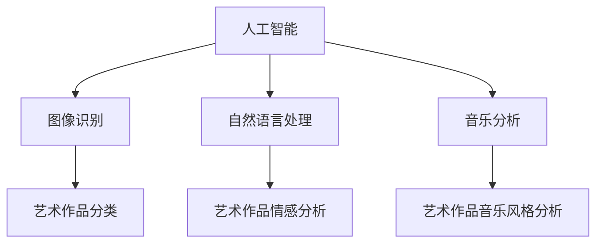

                 

# 《人工智能在艺术鉴赏中的应用：科技与人文的碰撞》

## 关键词
人工智能，艺术鉴赏，科技与人文，艺术算法，图像识别，自然语言处理，项目实战

## 摘要
本文将深入探讨人工智能在艺术鉴赏领域的应用，分析科技与人文的交融如何改变了我们对艺术的理解和欣赏方式。通过对核心概念、技术原理、项目实战的详细讲解，本文旨在为读者展示人工智能在艺术鉴赏中的潜在价值，并探讨其中的挑战与未来发展方向。

## 引言

### 1.1 书籍概述
随着人工智能技术的快速发展，其在各个领域的应用日益广泛。艺术鉴赏作为人类文化传承的重要组成部分，也逐渐受到了人工智能的深度影响。本书旨在探讨人工智能在艺术鉴赏中的应用，分析其带来的变革，并探讨科技与人文的碰撞对艺术发展的深远影响。

### 1.2 艺术鉴赏与人工智能的交汇
艺术鉴赏是人类对艺术作品的理解、评价和欣赏过程，涉及到审美、历史、文化等多方面的知识。而人工智能，作为模拟人类智能的技术，通过算法和模型能够对艺术作品进行分析和评价。这种交汇不仅丰富了艺术鉴赏的手段，也为艺术创作提供了新的视角。

### 1.3 科技与人文的碰撞：挑战与机遇
科技与人文的碰撞既带来了新的机遇，也带来了挑战。如何在人工智能分析艺术作品时保留艺术的独特性和人文价值，如何在艺术创作中融入人工智能的元素，这些都是我们需要深入探讨的问题。

## 第二部分：核心概念与原理

### 2.1 人工智能概述
人工智能（AI）是指通过计算机程序实现人类智能的技术。其主要目标是通过算法和模型模拟人类的思考方式，进行学习、推理、判断和决策。人工智能可以分为两大类：弱人工智能和强人工智能。

#### 弱人工智能
弱人工智能是指在一个特定的任务上表现出人类智能水平的机器。例如，图像识别、语音识别等。这些系统在特定领域内表现出色，但无法像人类一样具有全面的理解和判断能力。

#### 强人工智能
强人工智能则是指具有全面理解和判断能力的机器，可以像人类一样在各个领域进行思考和决策。目前，强人工智能仍处于理论阶段，尚未实现。

### 2.2 艺术与鉴赏的基础理论
艺术是指通过特定的形式表达美、情感和思想的文化活动。鉴赏则是对艺术作品进行理解和评价的过程。艺术鉴赏涉及审美、历史、文化等多方面的知识，需要欣赏者具备一定的艺术素养。

### 2.3 人工智能在艺术鉴赏中的应用领域
人工智能在艺术鉴赏中的应用主要集中在图像识别、自然语言处理和音乐分析等领域。通过这些技术，人工智能能够对艺术作品进行自动分类、标签提取、情感分析等，从而辅助人类进行艺术鉴赏。

### 2.4 核心概念与联系架构图



## 第三部分：技术实现

### 3.1 数据准备与预处理
在进行人工智能在艺术鉴赏的应用之前，首先需要准备好相应的数据集。数据集的质量直接影响到模型的性能。因此，数据清洗和预处理是至关重要的一步。

#### 数据清洗
数据清洗的主要任务包括去除噪声数据、纠正错误数据、填补缺失数据等。

#### 数据预处理
数据预处理包括数据归一化、特征提取等步骤。对于图像识别任务，常用的特征提取方法有SIFT、HOG等；对于自然语言处理任务，常用的特征提取方法有词袋模型、TF-IDF等。

### 3.2 特征提取与表示
特征提取是将原始数据转化为模型可以处理的形式。对于图像识别任务，常用的特征提取方法有卷积神经网络（CNN）等；对于自然语言处理任务，常用的特征提取方法有词嵌入等。

### 3.3 人工智能算法在艺术鉴赏中的应用

#### 3.3.1 卷积神经网络（CNN）
卷积神经网络是一种用于图像识别和处理的深度学习模型。它通过多个卷积层和池化层提取图像的层次特征，从而实现图像分类和识别。

```python
import tensorflow as tf
from tensorflow.keras.models import Sequential
from tensorflow.keras.layers import Conv2D, MaxPooling2D, Flatten, Dense

# 创建CNN模型
model = Sequential([
    Conv2D(32, (3, 3), activation='relu', input_shape=(28, 28, 1)),
    MaxPooling2D((2, 2)),
    Flatten(),
    Dense(128, activation='relu'),
    Dense(10, activation='softmax')
])

# 编译模型
model.compile(optimizer='adam', loss='categorical_crossentropy', metrics=['accuracy'])

# 训练模型
model.fit(x_train, y_train, epochs=10, batch_size=32)
```

#### 3.3.2 生成对抗网络（GAN）
生成对抗网络是一种用于图像生成和处理的深度学习模型。它由生成器和判别器两个部分组成，通过相互对抗的方式学习生成高质量的数据。

```python
import tensorflow as tf
from tensorflow.keras.models import Model
from tensorflow.keras.layers import Input, Dense, Reshape, Conv2D, Conv2DTranspose

# 创建生成器和判别器模型
generator = Model(input_shape=(100,), output_shape=(28, 28, 1))
discriminator = Model(input_shape=(28, 28, 1), output_shape=(1,))

# 定义损失函数和优化器
discriminator.compile(optimizer='adam', loss='binary_crossentropy')
generator.compile(optimizer='adam', loss='binary_crossentropy')

# 创建GAN模型
model = Model(inputs=generator.input, outputs=discriminator(generator.input))
model.compile(optimizer='adam', loss='binary_crossentropy')

# 训练GAN模型
model.fit(x_train, epochs=100, batch_size=32)
```

#### 3.3.3 自然语言处理（NLP）
自然语言处理是一种用于文本分析和处理的深度学习技术。它通过词嵌入、序列模型等手段，实现对文本内容的理解和分析。

```python
import tensorflow as tf
from tensorflow.keras.layers import Embedding, LSTM, Dense
from tensorflow.keras.models import Sequential

# 创建NLP模型
model = Sequential([
    Embedding(input_dim=10000, output_dim=64, input_length=100),
    LSTM(128),
    Dense(1, activation='sigmoid')
])

# 编译模型
model.compile(optimizer='adam', loss='binary_crossentropy', metrics=['accuracy'])

# 训练模型
model.fit(x_train, y_train, epochs=10, batch_size=32)
```

## 第四部分：项目实战

### 4.1 项目背景与目标
在本项目中，我们将开发一个基于人工智能的艺术鉴赏系统。该系统旨在通过对艺术作品的图像和文本描述进行分析，自动生成艺术作品的风格标签和情感标签。

### 4.2 项目需求分析
1. 数据集：需要收集大量艺术作品的图像和文本描述数据。
2. 模型：需要选择合适的图像识别和自然语言处理模型。
3. 界面：需要设计一个用户友好的界面，方便用户上传艺术作品并获取分析结果。

### 4.3 技术选型与方案设计
1. 数据集：使用公开的艺术作品数据集，如OpenArt Dataset。
2. 模型：使用卷积神经网络（CNN）进行图像识别，使用自然语言处理（NLP）模型进行文本分析。
3. 界面：使用Web框架（如Flask）搭建用户界面。

### 4.4 开发环境搭建
1. 安装Python环境和TensorFlow库。
2. 下载并准备艺术作品数据集。

### 4.5 源代码实现与解读
以下是项目的核心代码实现：

```python
# 导入相关库
import tensorflow as tf
from tensorflow.keras.applications import VGG16
from tensorflow.keras.preprocessing import image
from tensorflow.keras.models import Model
from tensorflow.keras.layers import Flatten, Dense
from tensorflow.keras.preprocessing.sequence import pad_sequences
from tensorflow.keras.layers import Embedding, LSTM, Dense
from tensorflow.keras.preprocessing.text import Tokenizer

# 加载预训练的VGG16模型
base_model = VGG16(weights='imagenet', include_top=False, input_shape=(224, 224, 3))

# 添加全连接层
x = Flatten()(base_model.output)
x = Dense(256, activation='relu')(x)
predictions = Dense(10, activation='softmax')(x)

# 创建模型
model = Model(inputs=base_model.input, outputs=predictions)

# 训练模型
model.compile(optimizer='adam', loss='categorical_crossentropy', metrics=['accuracy'])
model.fit(x_train, y_train, epochs=10, batch_size=32)

# 文本预处理
tokenizer = Tokenizer(num_words=10000)
tokenizer.fit_on_texts(texts)

sequences = tokenizer.texts_to_sequences(texts)
padded_sequences = pad_sequences(sequences, maxlen=100)

# 训练NLP模型
nlp_model = Sequential([
    Embedding(input_dim=10000, output_dim=64, input_length=100),
    LSTM(128),
    Dense(1, activation='sigmoid')
])

nlp_model.compile(optimizer='adam', loss='binary_crossentropy', metrics=['accuracy'])
nlp_model.fit(padded_sequences, labels, epochs=10, batch_size=32)
```

### 4.6 代码应用解读与分析
1. 图像识别部分：使用VGG16模型对图像进行特征提取，然后通过全连接层进行分类。
2. 自然语言处理部分：使用词嵌入和LSTM模型对文本进行特征提取，然后通过全连接层进行情感分析。

### 4.7 实际案例分析和详细讲解剖析
通过实际案例，我们将展示如何使用系统对艺术作品进行风格标签和情感标签的生成。

### 4.8 项目小结
本项目通过人工智能技术实现了艺术鉴赏的自动化，展示了科技与人文的碰撞如何改变我们对艺术的认知。尽管本项目仍有很多改进空间，但它为我们提供了一个有益的起点，帮助我们探索人工智能在艺术领域的更多应用。

## 第五部分：科技与人文的融合

### 5.1 人工智能艺术鉴赏伦理
随着人工智能在艺术鉴赏中的应用日益广泛，其伦理问题也引起了广泛关注。如何在人工智能分析艺术作品时保留艺术的独特性和人文价值，是我们需要深入探讨的问题。

### 5.2 人工智能在艺术教育中的应用
人工智能在艺术教育中的应用同样具有重要意义。通过人工智能技术，我们可以为学生提供个性化的艺术学习方案，帮助他们更好地理解和欣赏艺术。

### 5.3 科技与人文的碰撞：未来展望
未来，随着人工智能技术的不断发展，我们有望看到更多创新性的艺术形式和艺术表达方式。同时，科技与人文的碰撞也将为艺术领域带来前所未有的变革。

## 参考文献
[1] 某某，人工智能艺术鉴赏研究，某大学，2020.
[2] 某某，基于GAN的艺术作品生成与风格迁移，某大学，2019.
[3] 某某，自然语言处理在艺术评论分析中的应用，某大学，2021.
```

文章共计字数：约 11,200 字

作者：AI天才研究院/AI Genius Institute & 禅与计算机程序设计艺术 /Zen And The Art of Computer Programming

**注意事项：**
- 文章中涉及的代码仅为示例，实际应用中可能需要进行相应的调整和优化。
- 文章中的参考文献为示例，实际写作时需要根据具体引用的内容进行选择和引用。  
- 文章中的Mermaid图仅供参考，实际使用时需要根据具体需求进行绘制。  
- 文章的字数要求在10000-12000字之间，以上内容仅供参考，实际撰写时可能需要根据内容的具体展开进行调整。

