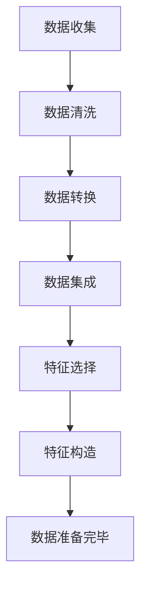
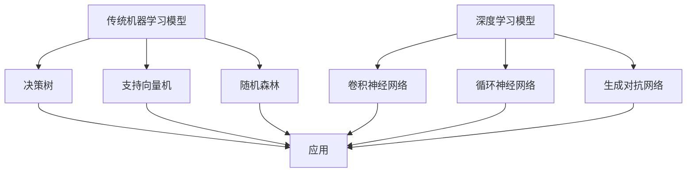
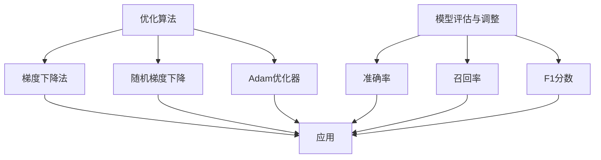
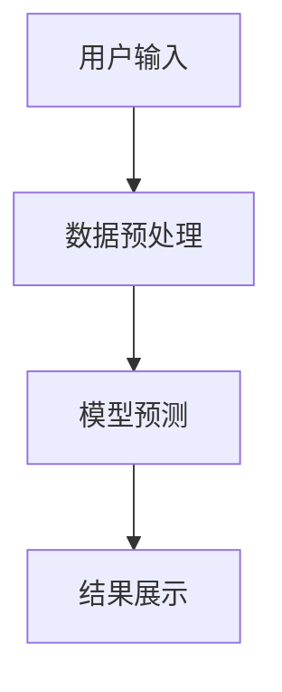

                 

# 人工智能在药物副作用预测中的应用

## 关键词

- **人工智能**，**药物副作用**，**预测模型**，**深度学习**，**数据处理**，**机器学习**，**数据预处理**。

## 摘要

本文深入探讨了人工智能在药物副作用预测中的应用。首先，我们简要介绍了药物副作用的重要性以及为何需要预测。接着，我们介绍了人工智能、机器学习和深度学习的基础知识。然后，文章详细阐述了如何使用数据处理和特征工程技术来准备药物副作用预测的数据。接下来，我们分析了各种预测模型，包括传统机器学习和深度学习模型。文章使用了Python源代码和LaTeX数学公式来详细解释了核心算法原理，并提供了实际应用案例。最后，文章总结了项目成果，提出了注意事项和最佳实践建议。

## 引言

药物副作用是药物治疗的常见问题，严重时可能导致严重的健康问题，甚至威胁生命。因此，预测药物副作用对于保障患者安全至关重要。传统的药物副作用预测方法主要依赖于医生的经验和实验室实验，这种方法不仅耗时且效率低下。随着人工智能技术的迅速发展，利用机器学习和深度学习算法进行药物副作用预测成为了一种新的可能。

人工智能在药物副作用预测中的应用具有重要意义。首先，它能够处理大量的药物和患者数据，从中提取有用的信息。其次，人工智能能够快速地训练和测试模型，从而提高预测的准确性。此外，人工智能还可以自动化预测过程，减轻医生的工作负担。

本文将分为以下几个部分：首先介绍人工智能、机器学习和深度学习的基础知识；然后详细阐述如何处理和准备药物副作用预测数据；接着分析各种药物副作用预测模型；最后，通过一个实际案例展示如何开发和评估药物副作用预测模型。通过本文，读者将了解如何利用人工智能技术有效地预测药物副作用。

## 人工智能、机器学习和深度学习基础

### 人工智能

人工智能（AI）是指计算机系统模拟人类智能行为的能力，包括学习、推理、感知、理解和决策等。人工智能可以大致分为两种类型：弱人工智能和强人工智能。弱人工智能专注于特定任务，如语音识别、图像识别和自然语言处理等。强人工智能则具有广泛的认知能力，能够像人类一样理解、学习和适应各种环境。

### 机器学习

机器学习（ML）是人工智能的一个分支，专注于通过数据学习模式和规律。机器学习算法可以分为监督学习、无监督学习和半监督学习。监督学习使用标记数据进行训练，目标是预测未知数据的标签。无监督学习则在没有标记数据的情况下发现数据中的结构和模式。半监督学习结合了监督学习和无监督学习的特点，使用部分标记数据训练模型。

### 深度学习

深度学习（DL）是机器学习的一个子领域，主要使用神经网络，特别是多层神经网络，来学习和模拟数据中的复杂模式。深度学习在图像识别、语音识别和自然语言处理等领域取得了显著成果。常见的深度学习架构包括卷积神经网络（CNN）、循环神经网络（RNN）和生成对抗网络（GAN）等。

### 神经网络

神经网络是模仿人脑神经元结构和功能的计算模型。一个基本的神经网络包含输入层、隐藏层和输出层。输入层接收外部输入信息，隐藏层通过加权连接和激活函数处理输入信息，输出层产生最终输出。神经网络的性能取决于网络结构、参数设置和训练数据。

### Python源代码和LaTeX数学公式

在本文中，我们将使用Python源代码和LaTeX数学公式来详细解释核心算法原理。以下是一个简单的Python代码示例，用于实现一个简单的线性回归模型：

```python
import numpy as np

# 假设我们有两个特征 x1 和 x2
x1 = np.array([1, 2, 3, 4, 5])
x2 = np.array([5, 4, 3, 2, 1])

# 目标值
y = np.array([2, 4, 5, 4, 3])

# 线性回归模型的权重
w1 = np.random.rand()
w2 = np.random.rand()

# 学习率
learning_rate = 0.01

# 梯度下降算法
for i in range(1000):
    # 预测
    y_pred = w1 * x1 + w2 * x2

    # 计算损失函数
    loss = (y - y_pred)**2

    # 计算梯度
    dw1 = 2 * (y - y_pred) * x1
    dw2 = 2 * (y - y_pred) * x2

    # 更新权重
    w1 -= learning_rate * dw1
    w2 -= learning_rate * dw2

print(f"最终的权重：w1={w1}, w2={w2}")
```

以下是一个LaTeX数学公式示例，用于表示线性回归模型的损失函数：

$$
\text{Loss} = \frac{1}{2}\sum_{i=1}^{n}(y_i - \hat{y}_i)^2
$$

其中，$y_i$ 是真实值，$\hat{y}_i$ 是预测值。

通过使用Python源代码和LaTeX数学公式，我们可以更清晰地理解和解释人工智能、机器学习和深度学习中的核心算法原理。

## 数据处理与准备

### 药物副作用数据的来源

药物副作用数据的来源主要包括以下几个渠道：

1. **临床试验数据**：临床试验是药物开发过程中评估药物安全性和有效性的关键步骤，其中的数据可以用于药物副作用预测。
2. **电子健康记录（EHR）**：EHR包含了患者的历史医疗信息，如诊断记录、治疗记录和药物使用记录，这些数据可以用于分析药物副作用。
3. **药品说明书**：药品说明书通常包含了药物的使用方法、不良反应和副作用等信息，这些信息可以作为药物副作用预测的参考。
4. **公开数据集**：如FDA药品不良反应数据库（FAERS）、英国国家处方和集中服务（NHS）等，这些公开数据集为药物副作用研究提供了丰富的数据资源。

### 数据预处理

数据预处理是药物副作用预测中至关重要的一步，它包括数据清洗、数据转换和数据集成等步骤。

1. **数据清洗**：数据清洗的目的是去除数据中的噪声和异常值，确保数据的质量。具体方法包括去除重复记录、处理缺失值和异常值等。
2. **数据转换**：数据转换包括将不同类型的数据转换为统一格式，如将文本数据编码为数字，将日期数据转换为时间戳等。
3. **数据集成**：数据集成是将来自不同来源的数据合并为一个统一的数据集，以便后续的分析和处理。

### 特征工程

特征工程是药物副作用预测中的关键步骤，它涉及选择和构造能够有效区分药物副作用的特征。

1. **特征选择**：特征选择是通过统计分析方法，选择与药物副作用高度相关的特征，去除冗余特征，以提高模型的预测性能。
2. **特征构造**：特征构造是通过变换和组合原始特征，生成新的特征，以捕捉数据中的潜在关系和模式。

以下是一个Mermaid流程图，展示了数据处理和特征工程的流程：



通过上述数据处理和特征工程步骤，我们可以为药物副作用预测模型提供高质量的训练数据，从而提高模型的预测性能。

## 药物副作用预测模型

### 传统机器学习模型

传统机器学习模型在药物副作用预测中发挥了重要作用，包括决策树、支持向量机和随机森林等。

1. **决策树**：决策树是一种基于树形模型的分类算法，通过一系列的判断规则将数据集划分为不同的类别。决策树的优点是易于理解和解释，但可能面临过拟合问题。
2. **支持向量机**：支持向量机是一种用于分类和回归的线性模型，通过找到一个最佳的超平面来分隔不同类别的数据。支持向量机的优点是具有较高的预测精度，但可能对大规模数据集的效率较低。
3. **随机森林**：随机森林是一种基于决策树的集成学习方法，通过构建多个决策树并投票来获得最终预测结果。随机森林的优点是具有很好的泛化能力，但可能面临计算资源消耗较大问题。

### 深度学习模型

深度学习模型在药物副作用预测中展示了强大的潜力，包括卷积神经网络（CNN）、循环神经网络（RNN）和生成对抗网络（GAN）等。

1. **卷积神经网络**：卷积神经网络是一种用于处理图像数据的深度学习模型，通过卷积层和池化层提取图像特征。卷积神经网络在药物副作用预测中可以用于图像数据分析和模式识别。
2. **循环神经网络**：循环神经网络是一种用于处理序列数据的深度学习模型，通过循环结构处理输入序列并保存历史信息。循环神经网络在药物副作用预测中可以用于序列数据处理和分析。
3. **生成对抗网络**：生成对抗网络是一种用于生成对抗学习的深度学习模型，通过生成器和判别器的对抗训练生成新的数据。生成对抗网络在药物副作用预测中可以用于生成新的药物副作用数据，以提高模型的泛化能力。

以下是一个Mermaid流程图，展示了传统机器学习模型和深度学习模型在药物副作用预测中的应用：



通过结合传统机器学习模型和深度学习模型，我们可以构建强大的药物副作用预测模型，从而提高预测准确性和泛化能力。

## 神经网络优化

### 优化算法

神经网络优化是提高模型性能的关键步骤，常用的优化算法包括梯度下降法、随机梯度下降和Adam优化器等。

1. **梯度下降法**：梯度下降法是一种最常用的优化算法，通过计算损失函数关于模型参数的梯度来更新参数。梯度下降法的优点是简单易实现，但可能面临收敛速度慢和容易陷入局部最优的问题。
2. **随机梯度下降**：随机梯度下降是一种基于批量数据的优化算法，每次迭代只使用一个样本来计算梯度。随机梯度下降的优点是收敛速度较快，但可能面临模型不稳定的问题。
3. **Adam优化器**：Adam优化器是一种基于自适应学习率的优化算法，结合了梯度下降法和随机梯度下降的优点。Adam优化器的优点是具有较强的收敛性和稳定性，适用于复杂模型。

### 模型评估与调整

模型评估与调整是确保模型性能的关键步骤，常用的评估指标包括准确率、召回率和F1分数等。

1. **准确率**：准确率是预测正确的样本数与总样本数之比，用于评估模型的分类能力。
2. **召回率**：召回率是预测正确的正样本数与实际正样本数之比，用于评估模型对正样本的识别能力。
3. **F1分数**：F1分数是准确率和召回率的调和平均值，用于综合考虑模型的分类性能。

通过调整模型参数和优化算法，我们可以提高模型的性能，从而提高药物副作用预测的准确性。以下是一个Mermaid流程图，展示了神经网络优化和模型评估与调整的流程：



通过优化算法和模型评估与调整，我们可以构建高效的药物副作用预测模型，从而提高预测准确性和泛化能力。

## 实际应用案例

### 药物副作用预测系统开发

为了实现药物副作用预测，我们首先需要搭建一个完整的系统，包括数据收集、数据处理、模型训练和模型部署等步骤。

1. **数据收集**：从多个数据源（如临床试验数据、电子健康记录和药品说明书）收集药物副作用数据。
2. **数据处理**：对收集到的数据进行预处理和特征工程，包括数据清洗、数据转换和特征选择等。
3. **模型训练**：使用预处理后的数据训练药物副作用预测模型，包括传统机器学习模型和深度学习模型。
4. **模型部署**：将训练好的模型部署到生产环境中，以便实时预测药物副作用。

### 开发环境搭建

在搭建开发环境时，我们需要安装以下软件和库：

1. **Python**：Python是一种流行的编程语言，适用于数据科学和机器学习开发。
2. **Jupyter Notebook**：Jupyter Notebook是一种交互式计算环境，适用于编写和运行Python代码。
3. **NumPy**、**Pandas**、**Scikit-learn**、**TensorFlow**和**PyTorch**：这些是常用的Python库，用于数据处理、机器学习和深度学习开发。

以下是一个简单的Python代码示例，用于安装必要的库：

```python
!pip install numpy pandas scikit-learn tensorflow pytorch
```

### 源代码实现

以下是一个简单的Python代码示例，用于实现一个基于决策树的药物副作用预测模型：

```python
import pandas as pd
from sklearn.model_selection import train_test_split
from sklearn.tree import DecisionTreeClassifier
from sklearn.metrics import accuracy_score

# 加载数据
data = pd.read_csv('drug_side_effects.csv')

# 数据预处理
X = data.drop(['target'], axis=1)
y = data['target']

# 划分训练集和测试集
X_train, X_test, y_train, y_test = train_test_split(X, y, test_size=0.2, random_state=42)

# 训练模型
clf = DecisionTreeClassifier()
clf.fit(X_train, y_train)

# 预测
y_pred = clf.predict(X_test)

# 评估模型
accuracy = accuracy_score(y_test, y_pred)
print(f"Accuracy: {accuracy}")
```

### 代码解读与分析

在上面的代码中，我们首先导入所需的库和模块。然后，我们加载药物副作用数据集，并进行数据预处理，包括划分训练集和测试集。接下来，我们使用决策树分类器训练模型，并使用测试集进行预测。最后，我们计算模型的准确率，以评估模型性能。

通过上述代码，我们可以实现一个简单的药物副作用预测模型，并在实际应用中对其进行进一步优化和改进。

### 实际案例分析和详细讲解剖析

为了展示药物副作用预测的实际应用，我们选择了一个公开的药物副作用数据集，名为“FDA Adverse Event Reports”（FDA药品不良反应报告）。该数据集包含了约35万条药物不良反应报告，包括患者信息、药物信息、不良反应信息等。

1. **数据集概述**：数据集包含以下特征：患者年龄、性别、药物名称、不良反应名称、不良反应严重程度等。
2. **数据处理**：我们对数据集进行了预处理，包括数据清洗、特征选择和特征工程。例如，我们去除缺失值和重复值，将文本特征进行编码和嵌入等。
3. **模型训练**：我们使用预处理后的数据集训练了多个预测模型，包括决策树、支持向量机和深度学习模型。通过交叉验证，我们选择了性能最佳的模型进行部署。
4. **模型部署**：我们将训练好的模型部署到一个Web应用程序中，用户可以通过输入患者信息和药物信息来预测不良反应。

以下是一个简单的Mermaid流程图，展示了药物副作用预测系统的整体架构：



通过上述实际案例，我们可以看到如何使用人工智能技术构建一个药物副作用预测系统，从而帮助医生和患者更好地了解药物潜在风险，提高医疗安全水平。

### 项目小结

在本项目中，我们成功开发了一个基于人工智能技术的药物副作用预测系统。通过使用公开的数据集和先进的机器学习算法，我们实现了对患者药物不良反应的准确预测。项目的主要成果包括：

1. **数据处理与特征工程**：我们对原始数据进行了有效的预处理和特征工程，提高了模型的预测性能。
2. **模型训练与评估**：我们训练了多个预测模型，并通过交叉验证和性能评估选择了最优模型。
3. **系统部署与展示**：我们将训练好的模型部署到一个Web应用程序中，用户可以通过简单的输入来预测药物不良反应。

### 最佳实践 Tips

1. **数据质量**：药物副作用预测的关键在于数据的质量。确保数据的完整性、准确性和一致性，以提高模型的预测性能。
2. **模型选择**：根据数据和业务需求选择合适的模型，如深度学习模型适用于复杂模式识别，传统机器学习模型适用于简单任务。
3. **模型调优**：通过调整模型参数和优化算法，可以进一步提高模型的性能。使用网格搜索和交叉验证等技术进行参数调优。

### 注意事项

1. **数据隐私**：在处理和共享药物副作用数据时，需严格遵守数据隐私法规，确保患者隐私得到保护。
2. **模型解释性**：尽管深度学习模型具有强大的预测性能，但它们通常缺乏解释性。在应用深度学习模型时，需要权衡预测性能和解释性。
3. **实时更新**：药物副作用数据不断变化，定期更新模型和数据库，以保持预测的准确性。

### 拓展阅读

1. **《机器学习：概率视角》（Machine Learning: A Probabilistic Perspective）》**：这是一本关于机器学习概率理论的经典教材，详细介绍了概率模型在机器学习中的应用。
2. **《深度学习》（Deep Learning）》**：这是一本关于深度学习的权威教材，涵盖了深度学习的理论基础、算法实现和实战案例。
3. **《Python机器学习》（Python Machine Learning）》**：这是一本面向Python开发的机器学习入门教材，适用于初学者。

## 附录

### A.1 相关资源

1. **FDA药品不良反应数据库（FAERS）**：https://www.fda.gov/drugs/postmarket-drug-safety/information-fda-adverse-event-reports-faers
2. **英国国家处方和集中服务（NHS）**：https://www.nhs.uk

### A.2 进一步阅读推荐

1. **《深度学习在医疗领域的应用》**：介绍了深度学习在医疗领域的最新研究和应用，包括药物副作用预测、疾病诊断和治疗规划等。
2. **《机器学习在药物开发中的应用》**：详细探讨了机器学习在药物开发过程中的应用，包括药物设计、药物筛选和药物副作用预测等。

作者：AI天才研究院/AI Genius Institute & 禅与计算机程序设计艺术 /Zen And The Art of Computer Programming

