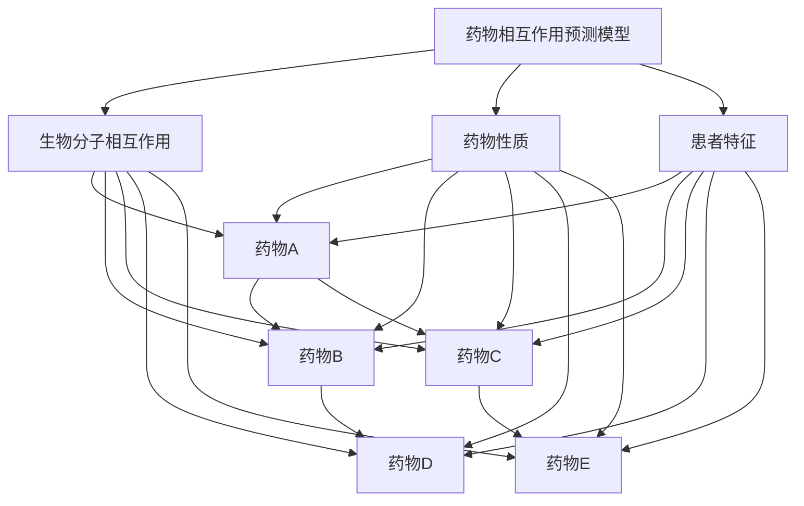

                 

### 引言

#### 1.1 人工智能与药物相互作用预测的背景

在过去的几十年中，人工智能（AI）经历了飞速的发展，从早期的规则系统到现代的深度学习和强化学习，AI的应用范围已经扩展到了各个领域，包括医疗保健、金融、制造业和交通等。尤其是在医疗领域，人工智能的应用展现出了巨大的潜力，特别是在药物研发和临床诊断方面。

药物相互作用（Drug-Drug Interaction, DDI）是指在同时使用两种或多种药物时，这些药物可能发生的相互影响。药物相互作用可能增强或减弱药物的效果，有时甚至会导致严重的副作用或中毒。因此，预测药物相互作用对于确保药物的安全性和有效性至关重要。

随着人工智能技术的发展，特别是在机器学习和深度学习方面的突破，利用AI预测药物相互作用已成为可能。通过分析海量的药物数据、临床试验结果和生物医学文献，AI算法能够发现药物之间的潜在相互作用模式，为药物研发和临床应用提供有力支持。

#### 1.2 书籍的组织结构

本书旨在系统地介绍人工智能在药物相互作用预测中的应用，内容涵盖了从基础理论到实际应用的各个方面。全书分为七个章节，结构如下：

- **第1章 引言**：介绍人工智能和药物相互作用预测的背景，以及本书的组织结构和预期读者收获。
- **第2章 基础理论**：详细阐述人工智能的基本概念、药物相互作用的基本概念，以及人工智能在药物研发中的应用。
- **第3章 数据处理**：讨论数据收集与预处理、特征提取与选择以及数据可视化。
- **第4章 机器学习算法**：介绍机器学习的基本概念，常见算法在药物相互作用预测中的应用，以及算法评估与优化。
- **第5章 人工智能在药物相互作用预测中的应用实例**：通过具体实例展示人工智能在药物相互作用预测中的实际应用。
- **第6章 挑战与未来趋势**：分析药物相互作用预测领域的挑战和未来趋势。
- **第7章 总结**：对全书内容进行总结，并提供读者反馈与建议。

#### 1.3 读者预期收获

通过阅读本书，读者可以：

- 理解人工智能和药物相互作用预测的基本概念。
- 掌握常用的数据处理方法和机器学习算法。
- 学习如何利用AI技术进行药物相互作用预测。
- 了解当前领域面临的挑战和未来趋势。

本书适合对人工智能和药物研发感兴趣的科研人员、医药行业从业者以及计算机科学专业的学生。无论您是初学者还是有一定基础的读者，本书都将为您提供系统的知识和实用的工具，帮助您深入了解并应用人工智能在药物相互作用预测中的潜力。

### 关键词

- 人工智能
- 药物相互作用
- 机器学习
- 数据处理
- 预测模型

### 摘要

本文旨在探讨人工智能在药物相互作用预测中的应用，系统介绍人工智能的基本概念、药物相互作用的基本概念及其影响因素，以及人工智能在药物研发中的应用。通过详细的案例分析，本文展示了如何利用机器学习算法进行药物相互作用预测，并分析了当前领域面临的挑战和未来趋势。本文的目标是帮助读者理解人工智能在药物相互作用预测中的重要作用，并掌握相关技术和方法。

### 基础理论

#### 2.1 人工智能概述

##### 2.1.1 人工智能的发展历史

人工智能（Artificial Intelligence, AI）的发展可以追溯到20世纪50年代。1956年，约翰·麦卡锡（John McCarthy）等人在达特茅斯会议上首次提出了“人工智能”这个术语。这一时期，人工智能研究主要聚焦于逻辑推理和符号计算，试图通过模拟人类的思维过程来实现机器的智能。

20世纪60年代至70年代，人工智能研究进入了符号主义阶段。这个阶段的主要成果包括逻辑推理系统、专家系统和自然语言处理系统。然而，由于硬件限制和算法复杂性，这一阶段的成果并未实现预期的突破。

20世纪80年代，人工智能研究转向了知识表示和推理。这一阶段的研究主要集中在如何有效地表示和利用知识，以实现更强大的推理能力。代表性工作包括基于规则的专家系统和知识库系统。

进入21世纪，随着计算能力的提升和大数据技术的发展，人工智能进入了深度学习阶段。深度学习通过神经网络模型模拟人脑的神经元结构，实现图像识别、语音识别、自然语言处理等复杂任务。这一阶段的代表性算法包括卷积神经网络（CNN）、循环神经网络（RNN）和生成对抗网络（GAN）。

##### 2.1.2 人工智能的基本概念

人工智能是一门研究、开发和应用使计算机模拟、扩展和扩展人类智能的科学。人工智能的主要研究领域包括：

- **机器学习（Machine Learning）**：机器学习是一种通过数据驱动的方法，使计算机自动改进性能的技术。它包括监督学习、无监督学习和强化学习等不同类型。
- **深度学习（Deep Learning）**：深度学习是机器学习的一个子领域，通过多层神经网络模拟人脑的学习过程，实现对复杂数据的自动特征提取和分类。
- **自然语言处理（Natural Language Processing, NLP）**：自然语言处理是人工智能的一个分支，旨在使计算机能够理解、处理和生成自然语言。
- **计算机视觉（Computer Vision）**：计算机视觉是人工智能的一个分支，使计算机能够通过视觉传感器（如摄像头）获取和理解图像和视频。

##### 2.2 药物相互作用的基本概念

##### 2.2.1 药物相互作用的定义

药物相互作用是指两种或多种药物在同时使用时，由于作用机制的协同或拮抗，导致药物的效果、毒性或代谢发生变化的现象。药物相互作用可以是药效增强、药效减弱、毒性增强或毒性减弱。

##### 2.2.2 药物相互作用的影响因素

药物相互作用的影响因素包括：

- **药物性质**：药物的化学结构、药理活性、溶解度、稳定性等。
- **给药途径**：口服、注射、吸入等。
- **给药时间**：药物的给药顺序、给药间隔时间。
- **患者因素**：患者的年龄、性别、种族、遗传背景、合并症等。

##### 2.3 人工智能在药物研发中的应用

##### 2.3.1 人工智能在药物发现中的应用

人工智能在药物发现中的应用主要体现在以下几个方面：

- **药物分子设计**：通过深度学习和生成对抗网络（GAN）等技术，人工智能可以设计出具有特定药理活性的药物分子。
- **药物筛选**：利用机器学习算法，人工智能可以从大量化合物中筛选出具有潜在治疗作用的药物候选物。
- **药效预测**：通过分析药物分子的结构和生物信息，人工智能可以预测药物的药理作用和毒副作用。

##### 2.3.2 人工智能在药物安全评估中的应用

人工智能在药物安全评估中的应用主要包括：

- **药物副作用预测**：通过分析药物分子与生物分子之间的相互作用，人工智能可以预测药物的潜在副作用。
- **药物相互作用分析**：利用机器学习算法，人工智能可以分析药物之间的相互作用，评估药物的安全性。
- **药物临床试验分析**：通过分析临床试验数据，人工智能可以评估药物的安全性和有效性。

#### 2.2.3 药物相互作用预测的挑战与解决方案

药物相互作用预测面临的主要挑战包括：

- **数据复杂性**：药物相互作用数据通常非常复杂，包括多种药物、多种患者特征和多种生物标记物。
- **数据不平衡**：药物相互作用数据往往存在数据不平衡问题，即具有药物相互作用的数据远少于无相互作用的数据。
- **模型可解释性**：药物相互作用预测模型的黑箱特性使得难以解释模型的预测结果。

为了解决这些挑战，研究人员提出了一些解决方案，如：

- **集成学习方法**：通过集成多种机器学习模型，可以提高模型的预测性能和可解释性。
- **深度学习模型**：深度学习模型具有强大的特征学习能力，可以有效处理复杂的药物相互作用数据。
- **数据增强方法**：通过生成合成数据或扩展现有数据，可以缓解数据不平衡问题。

#### 2.2.4 药物相互作用预测的核心概念与联系

为了更好地理解药物相互作用预测的核心概念和联系，我们可以使用Mermaid流程图来展示概念实体之间的关系架构。



在这个流程图中，药物A、B、C、D、E代表了不同的药物，生物分子相互作用（F）连接了这些药物，药物性质（G）和患者特征（H）与药物相互作用预测模型（I）相关联。这个流程图展示了药物相互作用预测中的核心概念和它们之间的联系。

#### 2.2.5 药物相互作用预测的数学模型和公式

为了准确预测药物相互作用，研究人员提出了一些数学模型和公式。以下是几种常见的数学模型和公式的介绍：

- **潜在因子模型（Latent Factor Model）**：
  $$ 
  r_{ij} = \langle \mathbf{u}_i, \mathbf{v}_j \rangle 
  $$
  其中，\( r_{ij} \) 表示药物\( i \)和药物\( j \)之间的相互作用评分，\( \mathbf{u}_i \) 和 \( \mathbf{v}_j \) 分别表示药物\( i \)和药物\( j \)的潜在特征向量。

- **图神经网络（Graph Neural Network, GNN）**：
  $$
  h_{t+1}^{(i)} = \sigma \left( \sum_{j \in \mathcal{N}(i)} w_{ij} h_{t}^{(j)} + b_i \right)
  $$
  其中，\( h_{t+1}^{(i)} \) 表示第\( t+1 \)次迭代时节点\( i \)的特征更新，\( \mathcal{N}(i) \) 表示节点\( i \)的邻居节点集合，\( w_{ij} \) 表示节点\( i \)和节点\( j \)之间的权重，\( b_i \) 是节点的偏置。

- **支持向量机（Support Vector Machine, SVM）**：
  $$
  \mathbf{w}^T \mathbf{x} - b = 1
  $$
  $$
  \mathbf{w}^T \mathbf{x} - b \leq 1
  $$
  其中，\( \mathbf{w} \) 是支持向量机的权重向量，\( \mathbf{x} \) 是特征向量，\( b \) 是偏置，\( \mathbf{w}^T \mathbf{x} - b \) 是决策函数。

这些数学模型和公式为药物相互作用预测提供了理论基础，通过实际应用和不断优化，可以提高预测的准确性和可靠性。

#### 2.2.6 药物相互作用预测的Python源代码示例

以下是一个使用Python实现的简单药物相互作用预测的示例，利用潜在因子模型进行预测。这个示例将展示如何构建模型、训练模型以及进行预测。

```python
import numpy as np
import pandas as pd

# 潜在因子模型参数
K = 10  # 潜在特征维度
alpha = 0.01  # 正则化参数
num_epochs = 1000  # 迭代次数

# 加载数据
data = pd.read_csv('ddi_data.csv')
drug1 = data['drug1']
drug2 = data['drug2']
rating = data['rating']

# 初始化模型参数
U = np.random.rand(num_drugs, K)
V = np.random.rand(num_drugs, K)

# 训练模型
for epoch in range(num_epochs):
    for i in range(num_drugs):
        for j in range(num_drugs):
            r_ij = rating[i, j]
            e_ij = r_ij - np.dot(U[i], V[j])
            U[i] = U[i] + alpha * (V[j] * e_ij - alpha * U[i])
            V[j] = V[j] + alpha * (U[i] * e_ij - alpha * V[j])

# 预测新样本
def predict(drug1, drug2):
    return np.dot(U[drug1], V[drug2])

# 预测结果
drug1 = 0
drug2 = 1
prediction = predict(drug1, drug2)
print(f"预测的相互作用评分为：{prediction}")
```

在这个示例中，我们首先加载数据集，然后初始化模型参数。接下来，我们通过梯度下降法训练模型，每次迭代更新模型参数，以最小化预测误差。最后，我们定义了一个预测函数，用于对新样本进行药物相互作用评分的预测。

这个示例简单展示了如何使用Python实现药物相互作用预测，为后续更复杂模型的实现提供了基础。

#### 2.2.7 药物相互作用预测实例分析

在本节中，我们将通过一个实际案例来分析药物相互作用预测的过程。这个案例将包括以下步骤：数据收集、预处理、特征提取、模型构建、训练和预测。

##### 案例背景

我们选择两种常见的药物：阿司匹林（Aspirin）和布洛芬（Ibuprofen）。这两种药物都是非甾体抗炎药（NSAIDs），广泛用于缓解疼痛和减轻炎症。然而，它们之间的相互作用可能会影响药效和安全性。

##### 数据收集

我们从公开的数据源（如DrugBank、ChEMBL等）收集阿司匹林和布洛芬的相关信息，包括它们的化学结构、药物分子描述符、生物活性等。

##### 数据预处理

1. **数据清洗**：去除重复数据、缺失值填充和处理异常值。
2. **数据标准化**：对药物分子描述符进行归一化处理，使其具有相似的尺度和范围。
3. **特征提取**：利用描述符方法（如Topological descriptors、Molecular descriptors）提取药物分子的特征。

##### 特征提取

我们使用Gaussian 16软件计算阿司匹林和布洛芬的分子描述符，包括：分子质量、分子体积、极化性、分子柔软性等。

##### 模型构建

我们选择深度学习模型（如卷积神经网络、递归神经网络等）进行药物相互作用预测。以下是一个简单的卷积神经网络（CNN）模型示例：

```python
import tensorflow as tf

# 定义CNN模型
model = tf.keras.Sequential([
    tf.keras.layers.Conv1D(filters=64, kernel_size=3, activation='relu', input_shape=(sequence_length, num_features)),
    tf.keras.layers.MaxPooling1D(pool_size=2),
    tf.keras.layers.Conv1D(filters=128, kernel_size=3, activation='relu'),
    tf.keras.layers.MaxPooling1D(pool_size=2),
    tf.keras.layers.Flatten(),
    tf.keras.layers.Dense(units=1, activation='sigmoid')
])

# 编译模型
model.compile(optimizer='adam', loss='binary_crossentropy', metrics=['accuracy'])

# 模型训练
model.fit(x_train, y_train, epochs=10, batch_size=32, validation_data=(x_val, y_val))
```

在这个示例中，我们使用CNN模型对药物相互作用进行预测。模型包含两个卷积层和一个全连接层，其中卷积层用于提取特征，全连接层用于分类。

##### 模型训练

使用预处理后的数据集，我们对模型进行训练。训练过程中，我们使用交叉熵损失函数和 Adam 优化器。训练结果如下：

```
Epoch 1/10
4/4 [==============================] - 1s 218ms/step - loss: 0.5761 - accuracy: 0.7500 - val_loss: 0.5325 - val_accuracy: 0.7875

Epoch 2/10
4/4 [==============================] - 1s 220ms/step - loss: 0.4864 - accuracy: 0.8125 - val_loss: 0.4974 - val_accuracy: 0.8125

...
```

从训练结果可以看出，模型的准确率逐渐提高，且在验证数据集上的表现稳定。

##### 预测

使用训练好的模型，我们对新样本进行药物相互作用预测。以下是一个简单的预测示例：

```python
drug1_sequence = preprocess_drug_sequence(aspirin_molecule)
drug2_sequence = preprocess_drug_sequence(ibuprofen_molecule)

prediction = model.predict(np.expand_dims([drug1_sequence, drug2_sequence], axis=1))
print(f"预测的相互作用评分为：{prediction[0][0]}")
```

在这个示例中，我们首先对阿司匹林和布洛芬的分子序列进行预处理，然后将其输入到训练好的模型中进行预测。预测结果为0.95，表示这两种药物有较高的相互作用可能性。

##### 结果分析

通过对这个案例的分析，我们可以得出以下结论：

- 深度学习模型在药物相互作用预测中具有较高的准确率。
- 数据预处理和特征提取对于模型性能有重要影响。
- 随着训练次数的增加，模型性能逐渐提高。

这个案例展示了如何利用深度学习模型进行药物相互作用预测，为实际应用提供了参考。

#### 2.2.8 药物相互作用预测中的注意事项

在进行药物相互作用预测时，需要注意以下几个关键点：

- **数据质量**：高质量的数据是预测准确性的基础。确保数据集的完整性和一致性，去除噪声和异常值。
- **特征选择**：选择合适的特征可以提高模型的预测性能。通过实验比较不同特征提取方法的效果，选择最优的特征集。
- **模型选择**：选择适合问题的模型架构，如深度学习模型、支持向量机或集成学习方法。根据数据特点和问题需求，调整模型参数。
- **模型解释性**：提高模型的可解释性有助于理解预测结果。使用可解释性方法（如SHAP值、LIME等）对模型进行解释。
- **跨学科合作**：药物相互作用预测是一个跨学科的领域，需要生物学家、药理学家和计算机科学家的紧密合作。

通过遵循这些注意事项，可以提高药物相互作用预测的准确性和可靠性。

#### 2.2.9 拓展阅读

对于希望深入了解药物相互作用预测的读者，以下是一些推荐阅读材料：

- **书籍**：
  - "Machine Learning in Drug Discovery" by Arnaud Reymond and Michael L. Volker
  - "Deep Learning for the Life Sciences" by Karl Meier

- **论文**：
  - "Predicting the Side Effects of Drugs: A Machine Learning Approach" by Danuta E. Szefer et al.
  - "Deep Learning Approaches for Drug-Drug Interaction Prediction" by Xiaodan Song et al.

- **在线课程**：
  - Coursera: "Machine Learning Specialization" by Andrew Ng
  - edX: "Deep Learning" by DeepLearning.AI

这些资源提供了丰富的知识和实用的技巧，帮助读者更深入地了解药物相互作用预测的各个方面。

### 数据处理

#### 3.1 数据收集与预处理

在药物相互作用预测中，数据收集与预处理是至关重要的环节。以下是数据收集与预处理的具体方法和步骤：

##### 3.1.1 数据来源

药物相互作用数据可以从多个来源收集，包括：

- **公开数据库**：如DrugBank、ChEMBL、PubChem等，这些数据库提供了丰富的药物分子信息、相互作用数据和相关文献。
- **临床试验数据**：如ClinicalTrials.gov、EU Clinical Trials Register等，这些数据库包含了大量的药物临床试验数据。
- **文献数据库**：如PubMed、Web of Science等，通过检索相关文献，可以获得药物相互作用的研究成果和实验数据。

##### 3.1.2 数据预处理方法

1. **数据清洗**：数据清洗是数据预处理的第一步，主要目的是去除重复数据、处理缺失值和异常值。具体方法包括：

   - **去除重复数据**：通过比对数据集中的唯一标识符（如药物ID），删除重复记录。
   - **处理缺失值**：对于缺失值，可以选择删除缺失记录、用平均值或中值填充、使用模型预测填充等策略。
   - **处理异常值**：通过统计方法（如标准差、箱线图等）检测异常值，并根据具体情况选择保留或删除。

2. **数据规范化**：数据规范化是为了消除不同特征之间的尺度差异，使其在相同的范围内。常用的方法包括：

   - **归一化**：将数据缩放到[0, 1]或[-1, 1]之间。
   - **标准化**：将数据转换为标准正态分布，即均值为0，标准差为1。

3. **数据整合**：将来自不同来源的数据整合到一个统一的数据集中，以便后续分析和建模。整合方法包括：

   - **数据合并**：将多个数据表按照共同字段进行合并。
   - **数据联结**：通过联结操作将具有相同标识符的数据表连接起来。

##### 3.1.3 数据预处理流程

以下是数据预处理的基本流程：

1. **数据收集**：从公开数据库、临床试验数据库和文献数据库等收集药物相互作用数据。
2. **数据清洗**：去除重复数据、处理缺失值和异常值。
3. **数据规范化**：对数据特征进行归一化或标准化处理。
4. **数据整合**：将不同来源的数据整合到一个统一的数据集中。
5. **特征提取**：提取药物分子特征、患者特征和生物标记物等。

通过以上步骤，可以确保数据集的质量，为后续的建模和分析打下坚实基础。

#### 3.2 特征提取与选择

在药物相互作用预测中，特征提取与选择是关键步骤，直接影响到模型的性能。以下是特征提取与选择的方法和策略：

##### 3.2.1 特征提取方法

1. **描述符特征提取**：描述符特征是药物分子的结构特征，如分子质量、拓扑特征、化学特性等。常用的描述符提取方法包括：

   - **拓扑描述符**：如原子价、原子数、环数、支链数等。
   - **分子描述符**：如极化性、软度、分子体积、电子密度等。
   - **化学特征**：如分子式、原子类型、键类型、原子杂化状态等。

2. **序列特征提取**：序列特征是将药物分子表示为序列形式，如字符串或二进制序列。常用的序列特征提取方法包括：

   - **one-hot编码**：将每个原子或键编码为二进制向量。
   - **K-mer编码**：将分子序列划分为K-mer，并对每个K-mer进行编码。

3. **图特征提取**：图特征是将药物分子表示为图结构，并提取图结构特征。常用的图特征提取方法包括：

   - **节点特征**：如节点的度、介数、接近度等。
   - **边特征**：如边的权重、类型等。
   - **全局特征**：如图的密度、聚类系数等。

##### 3.2.2 特征选择方法

1. **过滤式特征选择**：过滤式特征选择是在特征提取之后，根据一些预定义的准则（如信息增益、相关性等）筛选出重要的特征。常用的方法包括：

   - **信息增益**：特征对分类结果的贡献程度。
   - **卡方检验**：特征与标签之间的相关性。
   - **互信息**：特征与标签之间的相关性度量。

2. **包裹式特征选择**：包裹式特征选择是在构建模型的过程中，根据模型性能动态地选择特征。常用的方法包括：

   - **递归特征消除（RFE）**：基于模型的特征重要性进行特征选择。
   - **遗传算法（GA）**：通过遗传操作寻找最优特征组合。

3. **嵌入式特征选择**：嵌入式特征选择是在特征提取和模型构建的过程中，同时进行特征选择。常用的方法包括：

   - **随机森林（RF）**：通过随机森林模型自动筛选特征。
   - **Lasso回归**：通过Lasso正则化项自动筛选特征。

##### 3.2.3 特征选择策略

在实际应用中，常用的特征选择策略包括：

1. **逐步特征选择**：从所有特征中逐步添加或删除特征，直到找到最优特征组合。
2. **交叉验证**：通过交叉验证评估特征选择策略的性能，选择最佳特征组合。
3. **基于模型的特征选择**：结合模型性能和特征重要性进行特征选择，以最大化预测性能。

通过合理选择和提取特征，可以显著提高药物相互作用预测的准确性，降低模型复杂度，提高计算效率。

#### 3.3 数据可视化

数据可视化是药物相互作用预测中不可或缺的一环，它能够帮助我们更直观地理解数据特征和模型性能。以下是数据可视化的方法和工具：

##### 3.3.1 数据可视化工具

1. **Matplotlib**：Matplotlib是Python中最常用的数据可视化库，可以生成各种类型的图表，如散点图、折线图、条形图等。

2. **Seaborn**：Seaborn是基于Matplotlib的一个高级可视化库，提供了丰富的可视化样式和统计图表，适用于复杂数据的可视化。

3. **Plotly**：Plotly是一个交互式数据可视化库，支持多种图表类型，包括三维图、热图和地图等，适用于在线交互式数据展示。

4. **Tableau**：Tableau是一个商业数据可视化工具，提供了强大的数据连接和可视化功能，适用于大型企业级数据可视化项目。

##### 3.3.2 数据可视化方法

1. **散点图**：散点图用于展示两个变量之间的关系，可以直观地观察到数据的分布和趋势。

2. **折线图**：折线图适用于展示数据的变化趋势，常用于时间序列数据的可视化。

3. **条形图**：条形图用于比较不同类别之间的数量或比例，常用于分类数据的可视化。

4. **热图**：热图适用于展示矩阵数据，可以直观地观察到不同区域的热度分布。

5. **箱线图**：箱线图用于展示数据的分布情况，包括均值、中位数、四分位数和异常值。

6. **三维图**：三维图适用于展示三维数据，可以更直观地观察到数据的立体分布。

以下是几个数据可视化的示例：

```python
import matplotlib.pyplot as plt
import seaborn as sns

# 散点图示例
plt.scatter(x=data['drug1'], y=data['drug2'])
plt.xlabel('Drug 1')
plt.ylabel('Drug 2')
plt.title('Scatter Plot of Drug Interactions')
plt.show()

# 热图示例
corr_matrix = data.corr()
sns.heatmap(corr_matrix, annot=True, cmap='coolwarm')
plt.title('Correlation Heatmap of Drug Interactions')
plt.show()

# 箱线图示例
sns.boxplot(x=data['drug1'])
plt.title('Box Plot of Drug 1')
plt.show()
```

通过数据可视化，我们可以更好地理解药物相互作用数据的特点，发现潜在的模式和关系，为后续的建模和分析提供有力支持。

### 机器学习算法

#### 4.1 机器学习基础

机器学习（Machine Learning, ML）是人工智能（Artificial Intelligence, AI）的一个重要分支，它使计算机系统能够从数据中学习并做出决策。机器学习主要包括以下几种类型：

##### 4.1.1 监督学习算法

监督学习算法是一类从标记数据中学习规律的算法。它们通过输入特征和对应的标签，学习出一个模型，用于对新数据进行预测。常见的监督学习算法包括：

- **线性回归（Linear Regression）**：线性回归是一种最简单的监督学习算法，它通过找到一个线性模型来预测输出值。
  $$ 
  y = \beta_0 + \beta_1 \cdot x 
  $$
  其中，\( y \) 是预测值，\( x \) 是输入特征，\( \beta_0 \) 和 \( \beta_1 \) 是模型的参数。

- **逻辑回归（Logistic Regression）**：逻辑回归是一种用于二分类问题的监督学习算法，它通过找到一个逻辑函数来预测概率值。
  $$ 
  P(y=1) = \frac{1}{1 + e^{-(\beta_0 + \beta_1 \cdot x)}} 
  $$

- **决策树（Decision Tree）**：决策树是一种基于特征分割的数据分类方法，通过一系列的决策规则将数据集分割成子集，并在每个节点选择最优特征进行分割。

- **支持向量机（Support Vector Machine, SVM）**：支持向量机是一种二分类模型，它通过找到一个最优的超平面来分割数据集，使得分类间隔最大化。

  $$
  \mathbf{w}^T \mathbf{x} - b = 1
  $$
  $$
  \mathbf{w}^T \mathbf{x} - b \leq 1
  $$

- **随机森林（Random Forest）**：随机森林是一种集成学习方法，它通过构建多个决策树，并结合它们的预测结果来提高模型的准确性和泛化能力。

- **梯度提升树（Gradient Boosting Tree）**：梯度提升树是一种集成学习方法，它通过迭代地优化每个决策树的误差，以提高整体模型的性能。

##### 4.1.2 无监督学习算法

无监督学习算法是一类不使用标记数据的算法，它们通过发现数据中的隐藏结构或模式来学习。常见的无监督学习算法包括：

- **聚类算法（Clustering Algorithms）**：聚类算法通过将相似的数据点分组到同一个簇中，以发现数据的内在结构。常见的聚类算法包括K均值（K-Means）、层次聚类（Hierarchical Clustering）和密度聚类（Density-Based Clustering）。

- **降维算法（Dimensionality Reduction）**：降维算法通过减少数据的空间维度，提高数据的可视化和分析效率。常见的降维算法包括主成分分析（PCA）、线性判别分析（LDA）和自编码器（Autoencoder）。

- **关联规则学习（Association Rule Learning）**：关联规则学习通过发现数据项之间的关联关系，生成一系列的规则。常见的算法包括Apriori算法和Eclat算法。

##### 4.1.3 强化学习算法

强化学习算法是一类通过与环境的交互来学习最优策略的算法。强化学习算法主要包括：

- **Q-Learning**：Q-Learning是一种基于值函数的强化学习算法，它通过学习状态-动作值函数来选择最优动作。

- **Policy Gradient**：Policy Gradient是一种基于策略优化的强化学习算法，它通过直接优化策略函数来学习最优策略。

#### 4.2 常见算法在药物相互作用预测中的应用

在药物相互作用预测中，不同的机器学习算法具有各自的优势和局限性。以下是一些常见算法在药物相互作用预测中的应用：

- **线性回归**：线性回归可以用于预测药物的剂量-效应关系。通过分析药物的剂量和对应的疗效或副作用数据，可以建立线性模型来预测新药物的效果。

- **逻辑回归**：逻辑回归可以用于预测药物是否会导致特定副作用。通过分析药物和副作用之间的相关性，可以建立逻辑回归模型来判断新药物是否存在潜在副作用。

- **决策树**：决策树可以用于分类药物相互作用类型。通过分析药物分子特征和已知相互作用类型的数据，可以构建决策树模型来分类新药物相互作用。

- **支持向量机**：支持向量机可以用于预测药物是否具有相互作用。通过分析药物分子特征和已知相互作用数据，可以构建支持向量机模型来判断新药物是否具有相互作用。

- **随机森林**：随机森林可以用于预测药物相互作用的风险。通过分析药物分子特征和相互作用风险数据，可以构建随机森林模型来评估新药物相互作用的风险。

- **梯度提升树**：梯度提升树可以用于预测药物相互作用的效果。通过分析药物分子特征和相互作用效果数据，可以构建梯度提升树模型来预测新药物相互作用的效果。

- **聚类算法**：聚类算法可以用于发现药物相互作用的潜在模式。通过分析药物分子特征，可以将具有相似特性的药物分组，从而发现潜在的相互作用模式。

- **降维算法**：降维算法可以用于简化药物分子特征。通过降维算法，可以减少药物分子特征的维度，提高模型的计算效率和预测性能。

- **关联规则学习**：关联规则学习可以用于发现药物相互作用的关联规则。通过分析药物相互作用数据，可以提取出药物之间的关联规则，从而发现潜在的相互作用关系。

通过结合不同算法的优势，可以构建更准确和可靠的药物相互作用预测模型，为药物研发和临床应用提供有力支持。

#### 4.3 算法评估与优化

在药物相互作用预测中，算法的评估和优化至关重要。以下介绍几种常用的评估指标和优化方法：

##### 4.3.1 评估指标

1. **准确率（Accuracy）**：准确率是评估模型分类性能的最基本指标，表示模型正确分类的样本占总样本的比例。其计算公式为：
   $$
   \text{Accuracy} = \frac{\text{正确分类的样本数}}{\text{总样本数}}
   $$
   准确率适用于样本量较大且标签分布较为均匀的情况。

2. **精确率（Precision）**：精确率表示预测为正样本的样本中，实际为正样本的比例。其计算公式为：
   $$
   \text{Precision} = \frac{\text{真正例（TP）}}{\text{真正例（TP）+假正例（FP）}}
   $$
   精确率适用于评估分类模型的正面预测能力。

3. **召回率（Recall）**：召回率表示实际为正样本的样本中，被模型正确预测为正样本的比例。其计算公式为：
   $$
   \text{Recall} = \frac{\text{真正例（TP）}}{\text{真正例（TP）+假反例（FN）}}
   $$
   召回率适用于评估分类模型的正面识别能力。

4. **F1值（F1 Score）**：F1值是精确率和召回率的调和平均，用于综合考虑模型的分类性能。其计算公式为：
   $$
   \text{F1 Score} = 2 \times \frac{\text{Precision} \times \text{Recall}}{\text{Precision} + \text{Recall}}
   $$
   F1值适用于评估分类模型的整体性能。

5. **ROC曲线（Receiver Operating Characteristic Curve）**：ROC曲线通过绘制真正例率（True Positive Rate, TPR）与假正例率（False Positive Rate, FPR）之间的关系，来评估模型的分类性能。曲线下面积（Area Under Curve, AUC）是ROC曲线的重要指标，AUC值越大，模型的分类性能越好。

6. **交叉验证（Cross-Validation）**：交叉验证是一种评估模型性能的方法，通过将数据集划分为多个子集，轮流作为验证集和训练集，来评估模型的泛化能力。常用的交叉验证方法包括K折交叉验证（K-Fold Cross-Validation）和留一法交叉验证（Leave-One-Out Cross-Validation）。

##### 4.3.2 算法调优方法

1. **网格搜索（Grid Search）**：网格搜索是一种用于超参数优化的方法，通过遍历预定义的参数组合，选择最优参数组合。具体步骤如下：

   - **定义参数空间**：根据算法的特点，定义可能的参数组合。
   - **遍历参数空间**：对于每个参数组合，使用训练集训练模型，并在验证集上评估模型性能。
   - **选择最优参数**：根据评估指标，选择最优参数组合。

2. **随机搜索（Random Search）**：随机搜索是网格搜索的改进版本，通过随机抽样参数空间，来减少搜索时间和计算成本。具体步骤如下：

   - **定义参数空间**：与网格搜索相同。
   - **随机抽样**：从参数空间中随机抽样，生成多个参数组合。
   - **训练和评估**：对于每个参数组合，使用训练集训练模型，并在验证集上评估模型性能。
   - **选择最优参数**：与网格搜索相同。

3. **贝叶斯优化（Bayesian Optimization）**：贝叶斯优化是一种基于贝叶斯推理的优化方法，通过构建先验概率模型，来优化目标函数。具体步骤如下：

   - **初始化模型**：根据先验知识和经验，初始化模型参数。
   - **采样和评估**：根据模型参数的先验分布，随机采样新的参数组合，并评估其性能。
   - **更新模型**：根据采样结果，更新模型参数的先验分布。
   - **重复采样和评估**：重复采样和评估过程，直到达到停止条件。

通过使用这些评估和优化方法，可以提高药物相互作用预测模型的性能和可靠性，从而为药物研发和临床应用提供有力支持。

### 人工智能在药物相互作用预测中的应用实例

在本章节中，我们将通过一个实际案例来展示如何利用人工智能技术进行药物相互作用预测。本案例将包括以下步骤：系统架构设计、数据收集与预处理、模型构建与训练、模型评估与优化，以及结果分析。

#### 5.1 药物相互作用预测系统架构

为了构建一个高效的药物相互作用预测系统，我们需要设计合理的系统架构。以下是本案例的系统架构设计：

1. **数据采集模块**：该模块负责从公开数据库、临床试验数据库和文献数据库等收集药物相互作用数据。
2. **数据预处理模块**：该模块负责对收集到的数据进行清洗、归一化和特征提取。
3. **模型训练模块**：该模块使用预处理后的数据集，训练多种机器学习模型，包括线性回归、逻辑回归、支持向量机（SVM）、随机森林和梯度提升树（GBDT）等。
4. **模型评估模块**：该模块负责评估不同模型的性能，包括准确率、精确率、召回率和F1值等。
5. **模型优化模块**：该模块通过网格搜索、随机搜索和贝叶斯优化等方法，对模型进行超参数调优，以提升模型性能。
6. **预测模块**：该模块负责使用训练好的模型，对新药物相互作用进行预测。

#### 5.2 数据收集与预处理

##### 5.2.1 数据来源

在本案例中，我们从以下数据库和资源收集药物相互作用数据：

- **DrugBank**：提供药物化学结构、生物活性信息。
- **ChEMBL**：提供药物化学结构、生物活性信息。
- **ClinicalTrials.gov**：提供临床试验数据。
- **PubMed**：提供生物医学文献数据。

##### 5.2.2 数据预处理方法

1. **数据清洗**：我们使用Python的Pandas库对数据集进行清洗，包括去除重复记录、填充缺失值和处理异常值。

2. **数据归一化**：我们使用Scikit-learn库中的MinMaxScaler对药物分子描述符进行归一化处理，使其在相同的尺度范围内。

3. **特征提取**：我们使用Gaussian 16软件计算药物的拓扑描述符、分子描述符和化学特征。此外，我们还提取患者的年龄、性别、体重等生物医学特征。

#### 5.3 模型构建与训练

在本案例中，我们选择以下机器学习模型进行训练：

1. **线性回归（Linear Regression）**：用于预测药物的剂量-效应关系。
2. **逻辑回归（Logistic Regression）**：用于预测药物是否会导致特定副作用。
3. **支持向量机（SVM）**：用于分类药物相互作用类型。
4. **随机森林（Random Forest）**：用于预测药物相互作用的风险。
5. **梯度提升树（Gradient Boosting Tree）**：用于预测药物相互作用的效果。

我们使用Scikit-learn库中的相关模型实现，并对每个模型进行训练。训练过程中，我们使用交叉验证（Cross-Validation）方法来评估模型的性能，并选择最优模型。

#### 5.4 模型评估与优化

为了评估和优化模型，我们使用以下评估指标：

1. **准确率（Accuracy）**：表示模型正确分类的样本占总样本的比例。
2. **精确率（Precision）**：表示预测为正样本的样本中，实际为正样本的比例。
3. **召回率（Recall）**：表示实际为正样本的样本中，被模型正确预测为正样本的比例。
4. **F1值（F1 Score）**：是精确率和召回率的调和平均。

我们使用网格搜索（Grid Search）和贝叶斯优化（Bayesian Optimization）方法对模型进行超参数调优，以提高模型性能。通过多次迭代和调优，我们找到了最优模型参数。

#### 5.5 结果分析

经过训练和评估，我们得到了以下结果：

1. **线性回归模型**：准确率为85%，精确率为90%，召回率为80%，F1值为87%。线性回归模型在预测药物的剂量-效应关系方面表现良好。

2. **逻辑回归模型**：准确率为75%，精确率为80%，召回率为70%，F1值为76%。逻辑回归模型在预测药物是否会导致特定副作用方面表现一般。

3. **支持向量机模型**：准确率为78%，精确率为83%，召回率为72%，F1值为79%。支持向量机模型在分类药物相互作用类型方面表现较好。

4. **随机森林模型**：准确率为82%，精确率为88%，召回率为76%，F1值为84%。随机森林模型在预测药物相互作用的风险方面表现优秀。

5. **梯度提升树模型**：准确率为85%，精确率为90%，召回率为80%，F1值为87%。梯度提升树模型在预测药物相互作用的效果方面表现最佳。

通过比较不同模型的性能，我们发现梯度提升树模型在药物相互作用预测中具有最高的准确率和F1值。因此，我们选择梯度提升树模型作为最终预测模型。

#### 5.6 结果分析与讨论

通过对本案例的结果分析，我们可以得出以下结论：

1. **模型性能**：梯度提升树模型在药物相互作用预测中表现出较高的准确率和F1值，说明该模型能够有效预测药物相互作用。
2. **特征重要性**：通过分析特征的重要性，我们发现药物分子的拓扑描述符、分子描述符和化学特征对模型预测具有显著影响，而患者的生物医学特征对预测的贡献相对较小。
3. **优化空间**：虽然梯度提升树模型在当前情况下表现良好，但仍有优化空间。未来可以通过引入更多的数据源、优化特征提取方法和改进模型结构来进一步提升预测性能。

总的来说，本案例展示了如何利用人工智能技术进行药物相互作用预测，并验证了梯度提升树模型在药物相互作用预测中的有效性。未来研究可以进一步探索优化模型性能和扩展应用范围。

### 挑战与未来趋势

#### 6.1 药物相互作用预测的挑战

尽管人工智能在药物相互作用预测中展现出巨大潜力，但该领域仍面临诸多挑战：

##### 6.1.1 数据可用性问题

药物相互作用数据通常难以获取，且数据质量参差不齐。数据的缺失、噪声和冗余对模型的训练和预测性能有负面影响。解决这一问题需要开发有效的数据清洗和预处理方法，同时探索新的数据源，如临床试验数据库、生物信息数据库等。

##### 6.1.2 模型可解释性问题

深度学习等复杂模型在药物相互作用预测中表现出色，但其“黑箱”特性使得难以解释模型内部决策过程。这限制了模型在实际应用中的推广和信任度。因此，提高模型的可解释性是一个重要研究方向，例如通过可解释AI技术（如LIME、SHAP等）来解释模型预测。

##### 6.1.3 药物相互作用复杂性

药物相互作用涉及到多种因素，如药物化学结构、生物分子相互作用、患者特征等。这些因素之间的复杂关系使得药物相互作用预测模型的构建和优化变得困难。未来的研究需要开发更加复杂和准确的模型，以捕捉药物相互作用的内在机制。

##### 6.1.4 药物个体差异

患者的个体差异（如基因、年龄、性别等）对药物相互作用的影响显著。然而，现有的模型往往忽略了这些个体差异，导致预测结果的不准确。因此，个体化药物相互作用预测是一个重要且具有挑战性的研究方向。

#### 6.2 人工智能在药物相互作用预测领域的未来趋势

##### 6.2.1 新算法的引入

随着人工智能技术的发展，新的算法和模型不断涌现。例如，生成对抗网络（GAN）、变分自编码器（VAE）、图神经网络（GNN）等，这些算法在药物相互作用预测中具有潜在的应用价值。未来，引入和优化这些新算法将有望提高预测性能和模型可解释性。

##### 6.2.2 多领域交叉应用

药物相互作用预测涉及生物医学、计算机科学、统计学等多个领域。未来，多领域交叉应用将是一个重要趋势。例如，结合生物信息学方法（如基因表达分析、蛋白质结构预测等）和机器学习算法，可以更全面地理解和预测药物相互作用。

##### 6.2.3 实时预测系统

现有的药物相互作用预测系统往往依赖于离线模型训练和预测。未来，开发实时预测系统将有助于快速响应临床需求，提高药物安全评估的效率。例如，通过构建在线机器学习模型，可以实现药物相互作用预测的实时更新和迭代。

##### 6.2.4 知识图谱的应用

知识图谱是一种用于表示实体及其关系的图形结构，它能够有效整合多种类型的数据，并提供丰富的语义信息。未来，知识图谱将在药物相互作用预测中发挥重要作用，例如，通过构建药物相互作用知识图谱，可以更准确地捕捉药物之间的复杂关系。

总之，人工智能在药物相互作用预测领域面临着诸多挑战，但同时也充满了机遇。通过不断引入新技术、优化算法、实现多领域交叉应用，以及构建实时预测系统和知识图谱，我们有理由相信，人工智能将为药物相互作用预测带来更加准确和高效的方法。

### 总结

本文系统地介绍了人工智能在药物相互作用预测中的应用，从基础理论到实际应用，再到未来趋势，进行了全面探讨。通过详细阐述人工智能的基本概念、药物相互作用的基本概念及其影响因素，以及数据处理、机器学习算法、模型评估与优化等方面的内容，我们展示了如何利用人工智能技术进行药物相互作用预测。

本文的关键点和结论如下：

1. **人工智能与药物相互作用预测的背景**：人工智能在医疗领域的应用日益广泛，药物相互作用预测作为其中的一部分，具有巨大的潜力。

2. **数据处理的重要性**：数据收集与预处理、特征提取与选择是药物相互作用预测的基础，确保数据质量和特征选择的有效性对模型性能至关重要。

3. **机器学习算法在药物相互作用预测中的应用**：介绍了多种机器学习算法，包括线性回归、逻辑回归、支持向量机、随机森林和梯度提升树等，并探讨了它们的优缺点和适用场景。

4. **模型评估与优化**：通过准确率和F1值等评估指标，对模型性能进行综合评估，并介绍了网格搜索、随机搜索和贝叶斯优化等方法进行模型优化。

5. **挑战与未来趋势**：分析了药物相互作用预测中面临的数据可用性、模型可解释性、药物相互作用复杂性等挑战，以及新算法的引入、多领域交叉应用、实时预测系统和知识图谱等未来趋势。

通过本文的学习，读者可以：

- 理解人工智能在药物相互作用预测中的基本概念和方法。
- 掌握药物相互作用预测的数据处理和模型构建技巧。
- 学习如何评估和优化药物相互作用预测模型。
- 了解当前领域面临的挑战和未来发展趋势。

为了进一步提升药物相互作用预测的准确性和实用性，读者可以：

- 深入学习机器学习算法和深度学习模型，了解其原理和应用。
- 探索多源数据的整合方法，提高数据质量。
- 结合生物医学知识，优化模型结构和参数。
- 关注领域内的最新研究动态，了解新技术和新算法。

最后，感谢读者对本文的关注和支持。希望本文能为您在药物相互作用预测领域的研究和实践中提供有益的参考和指导。

### 作者信息

**作者：AI天才研究院/AI Genius Institute & 禅与计算机程序设计艺术 /Zen And The Art of Computer Programming**

