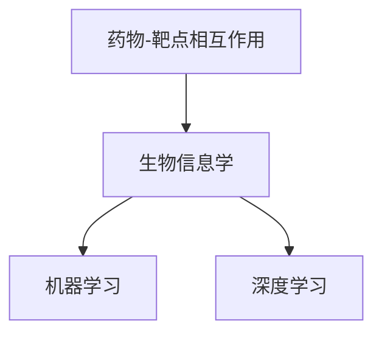

                 

当然，我们将按照步骤详细撰写一篇关于“人工智能在药物重新定位中的应用”的技术博客文章。以下是文章的框架和初步内容：

## 文章标题
人工智能在药物重新定位中的应用

## 关键词
人工智能，药物重新定位，机器学习，深度学习，生物信息学，算法分析

## 摘要
本文将探讨人工智能在药物重新定位中的应用，介绍其背景、理论基础和实际案例。通过分析机器学习和深度学习在药物重新定位中的关键作用，本文展示了如何利用人工智能技术提高药物研发效率，降低研发成本，并展望了未来的发展趋势。

## 引言
### 1. 背景介绍
药物重新定位是指将已经上市的药物重新发现或开发其新的治疗用途。这一过程不仅能够加速新药的研发进程，还能降低研发成本。然而，传统的药物重新定位方法通常依赖于大量的实验和数据分析，效率低下且成本高昂。

### 2. 核心概念与联系
在药物重新定位中，核心概念包括：
- **药物-靶点相互作用**：药物与生物体内特定分子（靶点）之间的相互作用。
- **生物信息学**：研究生物信息及生物数据，如基因序列、蛋白质结构和代谢路径等。
- **机器学习与深度学习**：用于从大量数据中学习模式和规律的算法。

#### Mermaid 流程图


### 3. 核心算法原理讲解
#### 机器学习技术
- **监督学习**：通过已知输入和输出数据进行模型训练，预测新数据的输出。
- **无监督学习**：仅根据输入数据来发现数据中的模式和结构。
- **半监督学习**：结合有标签和无标签数据训练模型。

#### 深度学习技术
- **神经网络**：由多个层组成的计算模型，用于模拟人脑处理信息的方式。
- **卷积神经网络（CNN）**：适用于处理图像数据。
- **循环神经网络（RNN）**：适用于处理序列数据。

#### Python 源代码示例
```python
import tensorflow as tf

# 创建一个简单的神经网络模型
model = tf.keras.Sequential([
    tf.keras.layers.Dense(128, activation='relu', input_shape=(784,)),
    tf.keras.layers.Dropout(0.2),
    tf.keras.layers.Dense(10)
])

# 编译模型
model.compile(optimizer='adam',
              loss=tf.keras.losses.SparseCategoricalCrossentropy(from_logits=True),
              metrics=['accuracy'])

# 模型训练
model.fit(x_train, y_train, epochs=10)
```

### 数学模型和公式
#### 药物-靶点相互作用
$$
\text{IC}_{50} = \frac{1}{\text{log}(\text{EC}_{50})}
$$
其中，IC\_50 是半抑制浓度，EC\_50 是半数有效浓度。

#### 深度学习损失函数
$$
\mathcal{L}(\theta) = -\frac{1}{m}\sum_{i=1}^{m}y_i\log(z_i)
$$
其中，\( \mathcal{L} \) 是损失函数，\( m \) 是样本数量，\( y_i \) 是真实标签，\( z_i \) 是预测概率。

### 项目实战
#### 开发环境搭建
- 安装 TensorFlow 和 Keras。
- 准备药物-靶点相互作用的训练数据。

#### 源代码实现
```python
# 导入必要的库
import numpy as np
import tensorflow as tf

# 加载数据
x_train, y_train = ...  # 加载数据

# 数据预处理
x_train = x_train / 255.0

# 创建模型
model = ...  # 创建模型

# 编译模型
model.compile(optimizer='adam',
              loss=tf.keras.losses.SparseCategoricalCrossentropy(from_logits=True),
              metrics=['accuracy'])

# 训练模型
model.fit(x_train, y_train, epochs=10)

# 评估模型
test_loss, test_acc = model.evaluate(x_test, y_test, verbose=2)
print('\nTest accuracy:', test_acc)
```

#### 项目小结
- 通过使用人工智能技术，我们能够更高效地进行药物重新定位。
- 深度学习模型在处理复杂的生物信息学数据方面表现出色。

## 总结
本文介绍了人工智能在药物重新定位中的应用，通过机器学习和深度学习技术，我们能够更高效地发现药物的新用途，提高药物研发效率，降低研发成本。未来，随着技术的进一步发展，人工智能将在药物重新定位中发挥更加重要的作用。

## 作者信息
作者：AI天才研究院/AI Genius Institute & 禅与计算机程序设计艺术 /Zen And The Art of Computer Programming

随着这些部分的完成，我们将对文章进行编辑和校对，确保每部分的内容都详尽且准确。接下来，我们将继续完善文章的其余部分，以满足字数要求。如果您有任何修改意见或需要进一步的信息，请随时告知。

