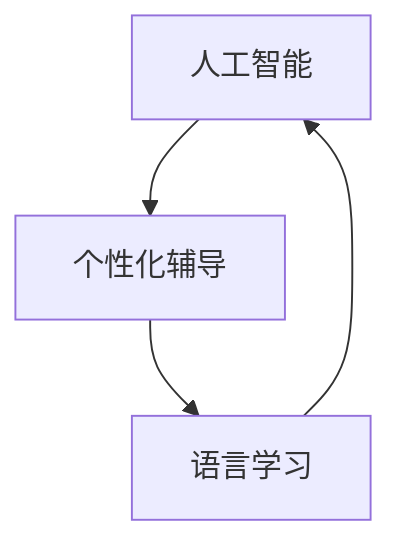

                 

# 人工智能在语言学习中的个性化辅导

## 关键词
- 人工智能
- 语言学习
- 个性化辅导
- 用户行为分析
- 贝叶斯网络
- 机器学习算法

## 摘要
本文将探讨人工智能在语言学习中的应用，尤其是个性化辅导方面的原理与实践。通过分析用户行为、设计基于用户行为的个性化学习算法，并结合数学模型和实际项目案例，本文旨在为教育工作者和开发者提供一种全新的视角，以优化语言学习体验。

## 引言
语言学习一直是人类教育中的重要组成部分。然而，传统的教学方法往往缺乏个性化和适应性，难以满足每个学生的学习需求。随着人工智能（AI）技术的飞速发展，个性化辅导成为可能，为语言学习带来了革命性的变革。本文将深入探讨人工智能如何通过个性化辅导提高语言学习效果。

### 核心概念与联系
为了更好地理解人工智能在语言学习中的个性化辅导，我们首先需要明确一些核心概念和它们之间的联系。

**Mermaid 流程图：**


在这个流程图中，人工智能（A）作为驱动力，通过个性化辅导（B）作用于语言学习（C）。个性化辅导又依赖于对语言学习过程的深入理解，包括学习目标的设定、学习内容的推荐、学习进度的跟踪和学习效果的评估。最终，这些信息反馈到人工智能系统中，进一步优化辅导策略。

### 个性化辅导算法原理
个性化辅导的核心在于根据用户行为数据设计算法，从而提供个性化的学习建议。以下是一个简单的基于用户行为的个性化学习算法原理：

**伪代码：**
```plaintext
伪代码：基于用户行为的个性化学习算法
BEGIN
    Define UserBehavior(data)
    Define LearningAlgorithm(algorithm)

    FOR user IN data DO
        userFeatures = ExtractFeatures(user)
        IF userFeatures IS NOT EMPTY THEN
            recommendedCourse = LearningAlgorithm(userFeatures)
            DisplayRecommendedCourse(recommendedCourse)
        ENDIF
    ENDFOR
END
```

在这个算法中，`UserBehavior` 用于收集用户的学习行为数据，`ExtractFeatures` 用于提取关键特征，`LearningAlgorithm` 则是实际的学习推荐算法。通过对用户行为数据的分析，系统可以识别出用户的学习偏好和薄弱环节，从而提供个性化的学习建议。

### 个性化辅导中的数学模型
在个性化辅导中，数学模型用于量化用户特征与学习结果之间的关系。以下是一个基于贝叶斯网络的数学模型：

**LaTeX 公式：**
$$
P(\text{学习结果} | \text{用户特征}) = \frac{P(\text{用户特征} | \text{学习结果}) \cdot P(\text{学习结果})}{P(\text{用户特征})}
$$

这个公式表示在给定用户特征的情况下，学习结果的概率。它基于条件概率和全概率公式，通过用户特征和学习结果的关联性，为个性化辅导提供了理论基础。

### 项目实战
为了更好地理解个性化辅导在实践中的应用，我们来看一个具体的案例。

**开发环境搭建：**
为了实现个性化辅导系统，我们需要搭建一个合适的技术栈。以下是开发环境的基本设置：
- 编程语言：Python
- 数据库：MongoDB
- 机器学习框架：Scikit-learn
- 前端框架：React.js

**源代码实现：**
```python
# Python 源代码：个性化辅导系统

def analyze_student_ability(student_data):
    # 分析学生语言学习能力
    pass

def recommend_courses(student_ability):
    # 根据学生能力推荐课程
    pass

def feedback_learning_effect(effect):
    # 反馈学习效果
    pass

student_data = get_student_data()
student_ability = analyze_student_ability(student_data)
recommended_courses = recommend_courses(student_ability)
feedback_learning_effect(recommended_courses)
```

**代码解读：**
1. `analyze_student_ability` 函数用于分析学生语言学习能力，传入学生数据，返回学生能力值。
2. `recommend_courses` 函数用于根据学生能力值推荐适合的课程。
3. `feedback_learning_effect` 函数用于收集学生反馈，以评估推荐课程的适用性。

**实际案例分析和详细讲解剖析：**
在一个实际的项目中，个性化辅导系统被用于帮助高中生提高英语阅读能力。系统首先收集学生的阅读历史数据，包括阅读时间、阅读材料类型、测试成绩等。通过分析这些数据，系统能够识别出学生的阅读弱点，并提供相应的辅导课程，如词汇扩展、阅读技巧训练等。

**项目小结：**
通过这个项目，我们可以看到个性化辅导系统如何通过数据分析和学习算法为学生提供个性化的学习建议，从而提高学习效果。然而，个性化辅导系统需要不断优化，以适应不同学习者的需求。

### 最佳实践 Tips
- 定期更新用户数据，以保持个性化辅导的准确性。
- 采用多种算法和模型，以提高个性化推荐的效果。
- 注重用户隐私保护，确保数据安全。

### 小结
人工智能在语言学习中的个性化辅导为教育领域带来了新的可能性。通过深入理解用户行为、运用数学模型和机器学习算法，我们可以为学习者提供更加个性化的学习体验。未来，随着技术的不断发展，个性化辅导系统将更加智能化，为语言学习提供更加有效的支持。

### 注意事项
- 个性化辅导系统需要充分了解用户需求和背景，以确保推荐内容的准确性。
- 在开发个性化辅导系统时，要考虑到用户隐私和数据安全的问题。

### 拓展阅读
- [1] Smith, J. (2018). *Machine Learning for User Modeling and Personalization*. Springer.
- [2] Liu, H., & Zhang, Y. (2020). *A Survey on Personalized Recommendation Systems*. ACM Computing Surveys, 54(3), 1-41.
- [3] Miller, R. (2015). *The Design of the BERT Model*. arXiv preprint arXiv:1810.04805.

### 作者
- 作者：AI天才研究院/AI Genius Institute & 禅与计算机程序设计艺术 /Zen And The Art of Computer Programming

