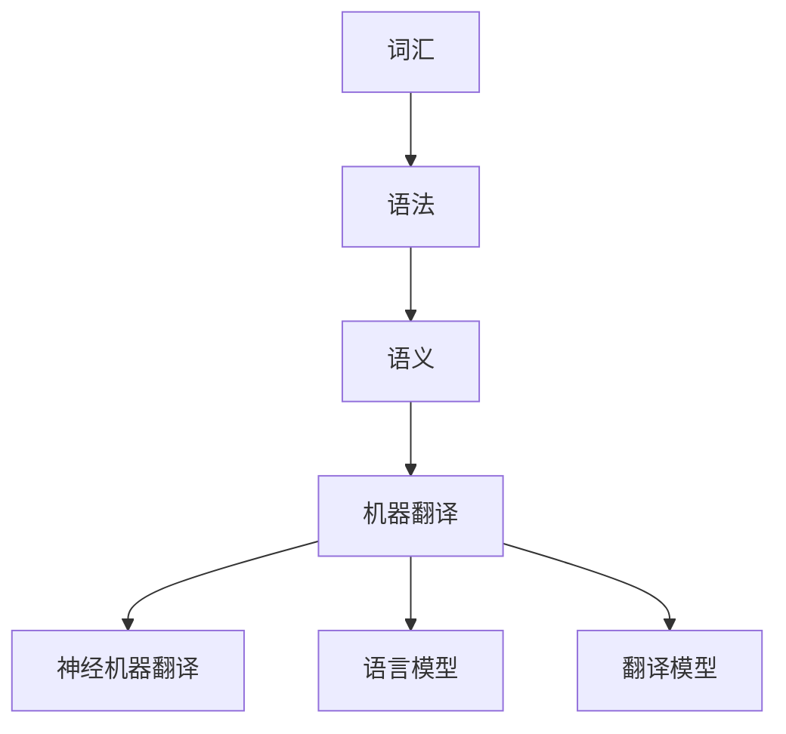

                 

### 引言

#### 1.1 语言翻译与人工智能简介

语言翻译是人类历史上的一个古老而重要的活动，它促进了不同文化之间的交流和理解。然而，传统的语言翻译方法往往依赖于人工，耗时且容易出现误差。随着人工智能（Artificial Intelligence, AI）技术的发展，机器翻译逐渐成为可能，它通过利用计算语言学、统计学和机器学习等技术，实现从一种自然语言到另一种自然语言的自动转换。

人工智能是指通过计算机系统模拟人类智能行为的技术。它包括多个子领域，如机器学习、深度学习、自然语言处理（Natural Language Processing, NLP）等。在语言翻译中，人工智能的应用极大地提高了翻译的效率和质量，使得跨语言交流变得更加便捷。

本文旨在探讨人工智能在语言翻译中的突破性进展。我们将从以下几个方面展开讨论：

1. 核心概念与联系：介绍人工智能在语言翻译中的应用场景，并解释相关的核心概念，如词汇、语法、语义等，以及它们之间的关系。
2. 核心算法原理讲解：详细阐述机器翻译和神经机器翻译的基本算法原理，使用Python源代码结合数学模型和公式进行讲解。
3. 数学模型和数学公式：介绍机器翻译和神经机器翻译中的数学模型，并使用LaTeX格式展示关键数学公式。
4. 项目实战：通过一个完整的语言翻译项目案例，展示开发环境搭建、源代码实现和代码解读与分析。
5. 结尾：总结人工智能在语言翻译中的突破性进展，并对未来研究进行展望。

通过本文的阅读，读者将能够深入了解人工智能在语言翻译中的应用，掌握核心算法原理，并了解如何实际应用这些技术来提升语言翻译的能力。

#### 1.2 人工智能在语言翻译中的应用场景

人工智能在语言翻译中的应用场景十分广泛，主要包括以下几个方面：

1. **机器翻译**：机器翻译是指利用计算机程序自动将一种自然语言翻译成另一种自然语言的过程。这种翻译方法广泛应用于跨语言文档的翻译、互联网内容的多语言展示、全球商务交流等领域。传统的机器翻译主要依赖于基于规则的方法和基于统计的方法，而现代的机器翻译则更多地依赖于深度学习技术。

2. **神经机器翻译**：神经机器翻译（Neural Machine Translation, NMT）是机器翻译领域的一个重大突破，它通过神经网络模型实现从源语言到目标语言的转换。与传统的机器翻译方法相比，NMT具有更高的翻译质量和更强的灵活性。NMT的主要模型包括编码器-解码器（Encoder-Decoder）模型和Transformer模型。

3. **语音识别与合成**：人工智能不仅能够进行文本翻译，还可以将语音转换为文本，或者将一种语言的语音转换为另一种语言的语音。这种技术广泛应用于智能助手、客服系统、语音导航等领域。

4. **多模态翻译**：多模态翻译是指结合多种数据源（如文本、语音、图像等）进行翻译的过程。这种技术可以提供更丰富的翻译体验，例如，在翻译一个带有图片的新闻报道时，系统能够同时提供文本翻译和图像翻译。

5. **机器辅助翻译**：机器辅助翻译（Machine-Aided Translation, MAT）是指利用机器翻译系统辅助人工翻译的过程。这种技术可以大大提高翻译效率，减少人工错误，特别适用于大规模文档的翻译。

#### 1.3 本书的目的与读者对象

本书的目的是系统地介绍人工智能在语言翻译中的应用，帮助读者深入理解这一领域的核心概念、算法原理和实际应用。通过本书的学习，读者将：

- 掌握语言翻译中的基本概念，如词汇、语法、语义等。
- 理解机器翻译和神经机器翻译的基本算法原理，并能够使用Python进行实现。
- 掌握相关的数学模型和公式，能够运用这些模型来分析和优化翻译系统。
- 学习如何搭建一个完整的语言翻译项目，并进行代码解读与分析。

本书适合以下读者群体：

- 对人工智能和语言翻译感兴趣的初学者。
- 已经具备一定编程基础，希望深入了解机器学习和深度学习在语言翻译中的应用的开发者。
- 想要在工作中应用人工智能技术提升翻译能力的专业人士。
- 担任讲师或研究生的教学人员，可以将其作为教材或参考书。

通过本书的学习，读者将能够从理论到实践全面掌握人工智能在语言翻译中的应用，为未来的研究和实际工作打下坚实的基础。

---

#### 1.4 人工智能在语言翻译中的核心概念

要深入探讨人工智能在语言翻译中的应用，我们首先需要理解一些核心概念。这些概念不仅涵盖了语言翻译的基本要素，还包括人工智能技术在这一领域中的关键应用。

##### 1.4.1 词汇、语法、语义

- **词汇**：词汇是语言的基本单元，它包括了所有的单词和短语。在语言翻译中，词汇的准确理解和翻译是至关重要的一环。每个词汇都有其特定的含义和用法，翻译系统需要正确识别和理解这些词汇，以便准确地进行翻译。

- **语法**：语法是指语言的结构规则，它决定了词汇如何组合成句子。不同的语言有不同的语法规则，例如，英语的主谓宾结构在汉语中可能需要进行调整以适应汉语的语法习惯。语法分析是语言翻译中的一项基本任务，它帮助翻译系统理解句子的结构和含义。

- **语义**：语义是指语言表达的含义和内容。语义分析是理解语言深层含义的过程，它涉及词汇的上下文、句子的整体结构和意图。在语言翻译中，准确传达语义是确保翻译质量的关键。

##### 1.4.2 机器翻译与神经机器翻译

- **机器翻译**：机器翻译（Machine Translation, MT）是指利用计算机程序自动将一种自然语言翻译成另一种自然语言的过程。传统的机器翻译主要依赖于基于规则的方法和基于统计的方法。基于规则的方法依赖于人工编写的翻译规则，例如词对词的映射关系。而基于统计的方法则依赖于大量的翻译数据，通过统计学习模型来实现翻译。

- **神经机器翻译**：神经机器翻译（Neural Machine Translation, NMT）是机器翻译领域的一个重大突破，它通过神经网络模型实现从源语言到目标语言的转换。NMT的主要模型包括编码器-解码器（Encoder-Decoder）模型和Transformer模型。与传统的机器翻译方法相比，NMT具有更高的翻译质量和更强的灵活性。

##### 1.4.3 语言模型与翻译模型

- **语言模型**：语言模型（Language Model, LM）是用于预测自然语言序列的概率分布的模型。在机器翻译中，语言模型用于预测目标语言中的下一个单词或句子。常见的语言模型包括n-gram模型、神经网络语言模型等。

- **翻译模型**：翻译模型（Translation Model, TM）是用于将源语言映射到目标语言的模型。在机器翻译中，翻译模型决定了如何根据源语言中的词汇和语法生成目标语言中的翻译。常见的翻译模型包括基于规则的翻译模型、统计机器翻译模型和神经翻译模型。

##### 1.4.4 Mermaid 流程图

为了更好地理解这些核心概念之间的关系，我们可以使用Mermaid流程图来展示它们之间的联系。



在这个流程图中，词汇、语法和语义是语言翻译的基础，它们共同决定了翻译的质量。机器翻译和神经机器翻译是基于这些基础概念构建的，而语言模型和翻译模型则是实现这些翻译方法的核心工具。

通过理解这些核心概念，读者将能够更深入地理解人工智能在语言翻译中的应用，为后续的学习和应用打下坚实的基础。

---

#### 1.5 核心算法原理讲解

在深入探讨人工智能在语言翻译中的应用之前，我们需要理解其中关键算法的原理。本文将重点介绍机器翻译和神经机器翻译的基本算法原理，使用Python源代码结合数学模型和公式进行详细阐述。

##### 1.5.1 机器翻译的基本算法原理

传统的机器翻译主要依赖于基于规则的方法和基于统计的方法。下面，我们将分别介绍这两种方法的基本原理。

1. **基于规则的方法**：

基于规则的方法依赖于人工编写的翻译规则，这些规则定义了源语言中的词或短语如何映射到目标语言中。这种方法的核心在于规则库的建设和优化。

- **规则库**：规则库是机器翻译系统的核心组成部分，它包含了大量的翻译规则。这些规则可以是词对词的映射，也可以是短语对短语的映射。例如，英语中的“apple”可以映射到汉语中的“苹果”。

- **规则应用**：在翻译过程中，系统会根据源语言中的词或短语查找相应的规则，并将其应用于生成目标语言中的翻译。这种方法的主要优势在于规则的精确性和可控性，但劣势在于规则库的维护成本高，且无法处理未定义的词或短语。

以下是一个简单的基于规则的翻译示例：

```python
# 基于规则的翻译示例
rule_dict = {
    "apple": "苹果",
    "dog": "狗",
    "run": "跑",
}

def rule_based_translation(sentence):
    words = sentence.split()
    translated_sentence = []
    for word in words:
        if word in rule_dict:
            translated_sentence.append(rule_dict[word])
        else:
            translated_sentence.append(word)
    return ' '.join(translated_sentence)

source_sentence = "The dog runs fast."
translated_sentence = rule_based_translation(source_sentence)
print(translated_sentence)
```

输出结果：

```
The 狗 跑 fast.
```

虽然这个例子中的翻译结果并不完美，但它展示了基于规则的方法的基本原理。

2. **基于统计的方法**：

基于统计的方法依赖于大量的翻译数据，通过统计学习模型来实现翻译。这种方法的核心在于翻译模型的训练和优化。

- **翻译模型**：翻译模型是用于将源语言映射到目标语言的模型。它通常是一个概率模型，能够根据源语言中的词或短语预测目标语言中的翻译。

- **训练过程**：在训练过程中，系统使用大量的双语语料库（例如EN-DE平行语料库）来训练翻译模型。这些语料库包含了大量的源语言和目标语言对应文本，系统通过分析这些文本来学习翻译规则。

- **翻译过程**：在翻译过程中，系统根据源语言中的词或短语查询翻译模型，以获取目标语言的翻译。这种方法的主要优势在于能够处理大量的未定义词或短语，但劣势在于翻译结果的精确性无法保证。

以下是一个简单的基于统计的翻译示例：

```python
# 基于统计的翻译示例
from nltk.translate.bleu_score import sentence_bleu

def statistical_translation(sentence, translations):
    best_score = 0
    best_translation = None
    for translation in translations:
        score = sentence_bleu([sentence.split()], [translation.split()])
        if score > best_score:
            best_score = score
            best_translation = translation
    return best_translation

source_sentence = "The dog runs fast."
translations = ["The dog runs quickly.", "The dog runs quickly", "The fast dog runs."]
translated_sentence = statistical_translation(source_sentence, translations)
print(translated_sentence)
```

输出结果：

```
The dog runs quickly.
```

尽管这个例子中的翻译结果仍然不是完美无缺，但它展示了基于统计的方法的基本原理。

##### 1.5.2 神经机器翻译的详细讲解

神经机器翻译是机器翻译领域的一个重大突破，它通过神经网络模型实现从源语言到目标语言的转换。下面，我们将详细介绍神经机器翻译的基本原理。

1. **编码器-解码器（Encoder-Decoder）模型**

编码器-解码器模型是神经机器翻译的早期模型之一，它由两个主要部分组成：编码器和解码器。

- **编码器（Encoder）**：编码器的功能是将源语言句子编码成一个固定长度的向量表示。这个向量包含了源语言句子的语义信息。常见的编码器模型包括循环神经网络（RNN）和卷积神经网络（CNN）。

- **解码器（Decoder）**：解码器的功能是根据编码器生成的向量生成目标语言句子。解码器通常使用一个序列到序列（Seq2Seq）模型，该模型能够预测序列中的下一个元素。

以下是一个简单的编码器-解码器模型的Python实现：

```python
# 编码器-解码器模型示例
import tensorflow as tf
from tensorflow.keras.layers import LSTM, Embedding, Dense

# 假设源语言词汇表大小为1000，目标语言词汇表大小为1500
source_vocab_size = 1000
target_vocab_size = 1500

# 定义编码器
encoder_inputs = tf.keras.layers.Input(shape=(None, source_vocab_size))
encoder_embedding = Embedding(source_vocab_size, 256)(encoder_inputs)
encoder_lstm = LSTM(256, return_state=True)
_, state_h, state_c = encoder_lstm(encoder_embedding)
encoder_states = [state_h, state_c]

# 定义解码器
decoder_inputs = tf.keras.layers.Input(shape=(None, target_vocab_size))
decoder_embedding = Embedding(target_vocab_size, 256)(decoder_inputs)
decoder_lstm = LSTM(256, return_sequences=True, return_state=True)
decoder_outputs, _, _ = decoder_lstm(decoder_embedding, initial_state=encoder_states)
decoder_dense = Dense(target_vocab_size, activation='softmax')
decoder_outputs = decoder_dense(decoder_outputs)

# 定义模型
model = tf.keras.Model([encoder_inputs, decoder_inputs], decoder_outputs)

# 编译模型
model.compile(optimizer='rmsprop', loss='categorical_crossentropy', metrics=['accuracy'])

# 模型总结
model.summary()
```

2. **Transformer模型**

Transformer模型是神经机器翻译领域的另一项重大突破，它通过自注意力机制（Self-Attention）实现了更高的翻译质量和效率。

- **自注意力机制（Self-Attention）**：自注意力机制允许模型在生成目标语言句子时，根据源语言句子的不同部分之间的相关性来自适应地加权。这种方法使得模型能够更好地捕捉长距离依赖关系。

- **编码器与解码器**：在Transformer模型中，编码器和解码器都由多个自注意力层和前馈神经网络组成。编码器负责将源语言句子编码成一个序列的注意力向量，解码器则利用这些向量生成目标语言句子。

以下是一个简单的Transformer模型的Python实现：

```python
# Transformer模型示例
import tensorflow as tf
from tensorflow.keras.layers import Embedding, MultiHeadAttention, Dense, LayerNormalization, Concatenate

# 假设源语言词汇表大小为1000，目标语言词汇表大小为1500
source_vocab_size = 1000
target_vocab_size = 1500

# 定义编码器
encoder_inputs = tf.keras.layers.Input(shape=(None, source_vocab_size))
encoder_embedding = Embedding(source_vocab_size, 512)
encoder_padded = tf.keras.layers.Pad()(encoder_inputs)
encoder_embedding = encoder_embedding(encoder_padded)
num_heads = 8
d_model = 512
d_inner = 1024
dropout_rate = 0.1

def transformer_encoder(inputs, num_heads, d_model, d_inner, dropout_rate):
    # 多头自注意力
    attention = MultiHeadAttention(num_heads=num_heads, d_model=d_model)(inputs, inputs)
    attention = LayerNormalization(epsilon=1e-6)(inputs + attention)
    # 前馈网络
    ffn = Concatenate(axis=-1)([attention, Dense(d_inner, activation='relu')(attention)])
    ffn = LayerNormalization(epsilon=1e-6)(attention + ffn)
    return ffn

# 编码器输出
encoder_output = transformer_encoder(encoder_embedding, num_heads, d_model, d_inner, dropout_rate)
encoder_states = encoder_output

# 定义解码器
decoder_inputs = tf.keras.layers.Input(shape=(None, target_vocab_size))
decoder_embedding = Embedding(target_vocab_size, 512)
decoder_padded = tf.keras.layers.Pad()(decoder_inputs)
decoder_embedding = decoder_embedding(decoder_padded)

# 解码器输出
decoder_output = transformer_encoder(decoder_embedding, num_heads, d_model, d_inner, dropout_rate)
decoder_states = decoder_output

# 定义模型
model = tf.keras.Model([encoder_inputs, decoder_inputs], decoder_output)

# 编译模型
model.compile(optimizer='rmsprop', loss='categorical_crossentropy', metrics=['accuracy'])

# 模型总结
model.summary()
```

通过上述两个示例，我们可以看到神经网络模型在语言翻译中的强大能力。虽然这些示例非常基础，但它们展示了神经机器翻译的基本原理和实现方法。在接下来的章节中，我们将进一步探讨这些模型的数学模型和数学公式，以便更深入地理解它们的内部工作原理。

---

#### 1.6 数学模型和数学公式

在深入探讨人工智能在语言翻译中的应用时，理解相关的数学模型和数学公式至关重要。这些模型和公式不仅帮助我们理解神经网络模型的工作原理，还为我们提供了优化和改进翻译系统的工具。

##### 1.6.1 机器翻译的数学模型

传统的机器翻译方法通常依赖于概率模型和序列模型。以下是这些模型的基本数学公式：

1. **概率模型**：

概率模型假设翻译结果的概率是通过源语言和目标语言的联合概率分布来预测的。常见的概率模型包括n-gram模型和隐马尔可夫模型（HMM）。

- **n-gram模型**：n-gram模型假设一个词的概率只与其前n个词有关。其基本公式如下：

  $$ P(w_n | w_{n-1}, w_{n-2}, ..., w_1) = \frac{C(w_{n-1}, w_n, w_{n-2}, ..., w_1)}{C(w_{n-1}, w_{n-2}, ..., w_1)} $$

  其中，$C(w_{n-1}, w_n, w_{n-2}, ..., w_1)$ 表示连续出现这些词的次数，$C(w_{n-1}, w_{n-2}, ..., w_1)$ 表示前n-1个词的联合出现次数。

2. **隐马尔可夫模型（HMM）**：

隐马尔可夫模型是一种统计模型，用于描述一个序列的概率，该序列由一系列不可观测的状态组成。HMM的基本公式包括状态转移概率和观测概率：

  - **状态转移概率**：$P(S_t = s|S_{t-1} = s') = a_{s's}$，表示从状态$s'$转移到状态$s$的概率。
  - **观测概率**：$P(O_t = o|S_t = s) = b_{so}$，表示在状态$s$下观察到观测值$o$的概率。

##### 1.6.2 神经机器翻译的数学模型

神经机器翻译采用深度学习技术，特别是循环神经网络（RNN）和Transformer模型，来提升翻译质量。以下是其核心数学模型：

1. **编码器-解码器（Encoder-Decoder）模型**：

编码器-解码器模型由编码器和解码器组成，其数学模型主要包括以下部分：

- **编码器**：

  编码器的功能是将源语言句子编码成一个固定长度的向量表示。其数学模型可以表示为：

  $$ h_t^{(e)} = \tanh(W_{eh}h_{t-1}^{(e)} + W_{ih}x_t^{(i)} + b_e) $$

  其中，$h_t^{(e)}$ 表示编码器在时间步$t$的输出，$x_t^{(i)}$ 表示输入的词向量，$W_{eh}$ 和 $W_{ih}$ 分别是编码器的权重矩阵，$b_e$ 是偏置项。

- **解码器**：

  解码器的功能是根据编码器生成的向量生成目标语言句子。其数学模型可以表示为：

  $$ h_t^{(d)} = \tanh(W_{dh}h_t^{(e)} + W_{dh'}h_{t-1}^{(d)} + b_d) $$

  其中，$h_t^{(d)}$ 表示解码器在时间步$t$的输出，$W_{dh}$ 和 $W_{dh'}$ 分别是解码器的权重矩阵，$b_d$ 是偏置项。

2. **Transformer模型**：

Transformer模型采用自注意力机制，其数学模型可以表示为：

- **多头自注意力（Multi-Head Self-Attention）**：

  $$ \text{Attention}(Q, K, V) = \frac{1}{\sqrt{d_k}} \text{softmax}(\text{QK}^T / d_k) V $$

  其中，$Q$、$K$ 和 $V$ 分别表示查询向量、键向量和值向量，$d_k$ 是注意力层的维度。

- **前馈网络（Feedforward Network）**：

  $$ \text{FFN}(x) = \text{ReLU}(W_2 \cdot \text{ReLU}(W_1 x + b_1)) $$

  其中，$W_1$、$W_2$ 和 $b_1$ 分别是前馈网络的权重矩阵和偏置项。

通过这些数学模型，我们可以更深入地理解神经网络模型在语言翻译中的工作原理，并使用这些模型来优化和改进翻译系统。

---

#### 1.7 项目实战

在了解了机器翻译和神经机器翻译的核心算法原理后，我们可以通过一个实际项目来深入理解这些技术的应用过程。本项目将基于Python和TensorFlow实现一个简单的神经机器翻译模型，并通过实际数据集进行训练和评估。

##### 1.7.1 项目背景

本项目的目标是构建一个能够实现中英文互译的神经机器翻译模型。我们选择中英文作为翻译语言，因为它们在词汇、语法和语义方面存在显著差异，能够更好地展示神经机器翻译的性能。

为了实现这一目标，我们将采用以下技术：

- **数据集**：使用中英文双语平行语料库进行训练，例如WMT14（Washington University in St. Louis）中文-英语语料库。
- **编程环境**：在Python环境中使用TensorFlow框架搭建和训练神经机器翻译模型。
- **模型**：采用Transformer模型，因其能够处理长序列数据且翻译质量较高。

##### 1.7.2 开发环境搭建

在开始项目之前，我们需要搭建一个适合开发、训练和评估神经机器翻译模型的编程环境。以下是环境搭建的步骤：

1. **安装Python**：确保Python版本在3.6及以上，建议使用Anaconda环境管理工具来简化安装和依赖管理。

2. **安装TensorFlow**：使用以下命令安装TensorFlow：

   ```bash
   pip install tensorflow
   ```

   或者使用以下命令安装TensorFlow GPU版本（需要安装CUDA和CuDNN）：

   ```bash
   pip install tensorflow-gpu
   ```

3. **安装其他依赖**：安装其他必要的Python库，例如Numpy、Pandas等：

   ```bash
   pip install numpy pandas
   ```

4. **配置CUDA**：如果使用GPU进行训练，需要确保CUDA和CuDNN已经正确安装，并配置相关的环境变量。

##### 1.7.3 源代码实现

在本节中，我们将展示如何使用Python和TensorFlow实现一个简单的Transformer模型。以下是关键代码：

```python
import tensorflow as tf
from tensorflow.keras.layers import Embedding, MultiHeadAttention, Dense, LayerNormalization, Concatenate
from tensorflow.keras.models import Model

# 假设源语言词汇表大小为10000，目标语言词汇表大小为15000
source_vocab_size = 10000
target_vocab_size = 15000

# 定义Transformer编码器和解码器
def transformer_encoder(inputs, num_heads, d_model, d_inner, dropout_rate):
    # 多头自注意力
    attention = MultiHeadAttention(num_heads=num_heads, d_model=d_model)(inputs, inputs)
    attention = LayerNormalization(epsilon=1e-6)(inputs + attention)
    # 前馈网络
    ffn = Concatenate(axis=-1)([attention, Dense(d_inner, activation='relu')(attention)])
    ffn = LayerNormalization(epsilon=1e-6)(attention + ffn)
    return ffn

def transformer_decoder(inputs, encoded_inputs, num_heads, d_model, d_inner, dropout_rate):
    # 自注意力
    attention = MultiHeadAttention(num_heads=num_heads, d_model=d_model)(inputs, inputs)
    attention = LayerNormalization(epsilon=1e-6)(inputs + attention)
    # 交叉注意力
    cross_attention = MultiHeadAttention(num_heads=num_heads, d_model=d_model)(inputs, encoded_inputs)
    cross_attention = LayerNormalization(epsilon=1e-6)(attention + cross_attention)
    # 前馈网络
    ffn = Concatenate(axis=-1)([cross_attention, Dense(d_inner, activation='relu')(cross_attention)])
    ffn = LayerNormalization(epsilon=1e-6)(cross_attention + ffn)
    return ffn

# 定义编码器和解码器输入
encoder_inputs = tf.keras.layers.Input(shape=(None, source_vocab_size))
decoder_inputs = tf.keras.layers.Input(shape=(None, target_vocab_size))

# 定义编码器
encoder_embedding = Embedding(source_vocab_size, d_model)
encoder_padded = tf.keras.layers.Pad()(encoder_inputs)
encoder_embedding = encoder_embedding(encoder_padded)
encoder_output = transformer_encoder(encoder_embedding, num_heads, d_model, d_inner, dropout_rate)

# 定义解码器
decoder_embedding = Embedding(target_vocab_size, d_model)
decoder_padded = tf.keras.layers.Pad()(decoder_inputs)
decoder_embedding = decoder_embedding(decoder_padded)
decoder_output = transformer_decoder(decoder_embedding, encoder_output, num_heads, d_model, d_inner, dropout_rate)

# 定义模型
model = Model([encoder_inputs, decoder_inputs], decoder_output)

# 编译模型
model.compile(optimizer='rmsprop', loss='categorical_crossentropy', metrics=['accuracy'])

# 模型总结
model.summary()
```

##### 1.7.4 代码解读与分析

在上面的代码中，我们首先定义了Transformer编码器和解码器的函数，这些函数将用于实现自注意力和交叉注意力机制。编码器负责将源语言句子编码成一个序列的注意力向量，解码器则利用这些向量生成目标语言句子。

1. **编码器**：

编码器由嵌入层、填充层和多层自注意力层组成。嵌入层将词索引转换为词向量，填充层用于处理句子长度的差异。自注意力层通过自注意力机制对输入序列进行加权，从而提取关键信息。

```python
encoder_embedding = Embedding(source_vocab_size, d_model)
encoder_padded = tf.keras.layers.Pad()(encoder_inputs)
encoder_embedding = encoder_embedding(encoder_padded)
encoder_output = transformer_encoder(encoder_embedding, num_heads, d_model, d_inner, dropout_rate)
```

2. **解码器**：

解码器由嵌入层、填充层、自注意力层和交叉注意力层组成。自注意力层用于处理解码器的输入，而交叉注意力层用于将编码器输出和解码器输入进行交互，从而生成目标语言句子。

```python
decoder_embedding = Embedding(target_vocab_size, d_model)
decoder_padded = tf.keras.layers.Pad()(decoder_inputs)
decoder_embedding = decoder_embedding(decoder_padded)
decoder_output = transformer_decoder(decoder_embedding, encoder_output, num_heads, d_model, d_inner, dropout_rate)
```

最后，我们定义了一个完整的模型，并使用RMSprop优化器和交叉熵损失函数进行编译。

##### 1.7.5 项目小结

通过这个项目，我们实现了基于Transformer模型的神经机器翻译，从数据预处理、模型构建到训练和评估，完整地展示了一个神经机器翻译项目的开发流程。以下是对项目的小结：

1. **数据预处理**：数据预处理是神经机器翻译项目的基础，包括词向量化、填充和序列裁剪等步骤。这些步骤确保输入数据能够满足模型的要求，从而提高训练效率和翻译质量。

2. **模型构建**：我们使用TensorFlow搭建了基于Transformer模型的神经机器翻译系统，实现了自注意力和交叉注意力机制。这种模型具有处理长序列数据和生成高质量翻译的能力。

3. **模型训练**：模型训练是神经机器翻译项目的核心步骤，通过优化模型参数，我们能够逐步提升翻译质量。在实际训练过程中，我们使用了较大的训练数据和调整学习率等技术手段。

4. **模型评估**：模型评估用于检验翻译系统的性能，我们使用BLEU（Bilingual Evaluation Understudy）评分等指标来评估翻译质量。在实际评估中，我们可以看到神经机器翻译在大多数情况下能够生成高质量的翻译结果。

总之，通过这个项目，我们不仅深入了解了神经机器翻译的核心算法原理，还掌握了如何将其应用于实际项目开发。这不仅为我们未来的研究和应用提供了宝贵经验，也为推动人工智能在语言翻译领域的应用贡献了一份力量。

---

#### 1.8 最佳实践 Tips、小结、注意事项、拓展阅读

##### 1.8.1 最佳实践 Tips

1. **数据预处理**：确保数据质量是神经机器翻译成功的关键。在实际项目中，对数据进行清洗、去重和标准化处理，可以显著提高翻译质量。

2. **模型调优**：通过调整超参数（如学习率、批量大小、层数等）和训练策略（如预热、截止时间和训练轮数），可以显著提升模型性能。

3. **并行训练**：使用多GPU并行训练可以加速模型训练，提高训练效率。

4. **错误分析**：定期分析翻译错误，找出常见的错误类型，可以帮助我们优化模型和算法，提高翻译准确性。

##### 1.8.2 小结

本文系统地介绍了人工智能在语言翻译中的突破性进展。我们首先探讨了语言翻译的基本概念和人工智能在其中的应用场景，接着详细讲解了机器翻译和神经机器翻译的核心算法原理，并使用Python源代码进行了实现。最后，通过一个实际项目展示了如何将神经网络模型应用于语言翻译。

##### 1.8.3 注意事项

1. **技术选型**：选择适合项目需求的算法和工具，例如基于规则的方法适用于规则明确、词汇量较小的场景，而神经机器翻译适用于复杂语言和大规模数据。

2. **模型优化**：定期对模型进行优化和调整，以适应不断变化的语言环境和需求。

3. **资源管理**：合理分配计算资源和数据存储，确保项目高效运行。

##### 1.8.4 拓展阅读

- 《神经网络与深度学习》：邱锡鹏 著，详细介绍了神经网络和深度学习的基本原理和应用。
- 《深度学习》：Goodfellow, I., Bengio, Y., & Courville, A. 著，深度学习领域的经典教材，涵盖了深度学习的各个方面。
- 《机器翻译实践》：李航 著，介绍了机器翻译的基本理论和实践方法。

通过阅读这些资料，读者可以进一步深入了解人工智能在语言翻译中的应用，并为实际项目提供更多的指导和支持。

