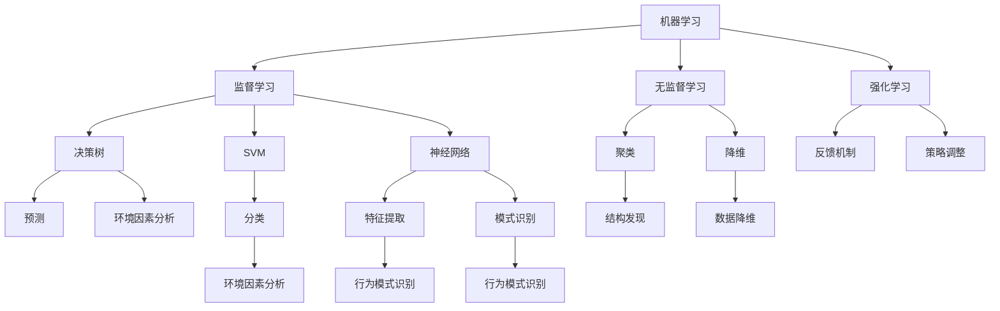

                 

### 1. 背景介绍

人工智能（Artificial Intelligence，简称AI）作为一种模拟人类智能的计算机科学技术，已经广泛应用于各个领域，包括医疗、金融、交通、教育等。近年来，随着计算机硬件性能的提升、大数据技术的普及以及深度学习算法的发展，人工智能的应用范围和影响力不断扩大。在野生动物行为研究这一传统领域，人工智能同样展现出强大的潜力。

野生动物行为研究旨在了解野生动物的生存状态、行为模式、生态关系及其对环境变化的响应。这一研究对于保护野生动物、维护生态平衡具有重要意义。然而，野生动物行为数据的获取和分析通常面临诸多挑战，如数据量庞大、数据质量参差不齐、行为模式复杂等。传统的研究方法难以满足日益增长的数据处理和分析需求。

人工智能技术的引入，为野生动物行为研究带来了新的契机。通过机器学习、深度学习等算法，研究人员能够从大量数据中提取有价值的信息，实现自动化的行为模式识别和预测。同时，人工智能还可以帮助研究人员分析野生动物行为与环境因素之间的复杂关系，为保护和管理工作提供科学依据。

本文旨在探讨人工智能在野生动物行为研究中的应用，通过逐步分析人工智能技术的基本概念、具体应用案例以及未来发展挑战，为相关领域的研究人员和从业者提供有价值的参考。

### 2. 核心概念与联系

在深入探讨人工智能在野生动物行为研究中的应用之前，我们首先需要了解一些核心概念，并分析它们之间的关系。以下是几个关键概念及其相互关系：

**机器学习**（Machine Learning）：机器学习是人工智能的一个重要分支，通过算法从数据中学习规律，并自动对未知数据进行预测或决策。机器学习可以分为监督学习、无监督学习和强化学习。

- **监督学习**（Supervised Learning）：在监督学习中，算法通过已标注的数据进行学习，从而对新的数据进行预测。典型的监督学习算法包括决策树、支持向量机（SVM）、神经网络等。
  
- **无监督学习**（Unsupervised Learning）：无监督学习则是在没有标注数据的情况下进行学习，其主要目的是发现数据中的隐含结构和规律。常见的无监督学习算法有聚类、降维等。

- **强化学习**（Reinforcement Learning）：强化学习通过与环境的交互来学习最优策略，其主要特点是具有反馈机制，可以不断调整行为以获得最大奖励。

**深度学习**（Deep Learning）：深度学习是机器学习的一个子领域，通过多层神经网络模拟人类大脑的神经元连接，实现复杂特征提取和模式识别。深度学习在图像识别、自然语言处理等领域取得了显著成果，典型的深度学习模型包括卷积神经网络（CNN）、循环神经网络（RNN）和生成对抗网络（GAN）等。

**野生动物行为数据**：野生动物行为数据是研究野生动物行为的基础。这些数据可以通过各种传感器和观测手段获取，包括GPS追踪、红外相机、高分辨率摄像头等。

**行为模式识别**：行为模式识别是指利用机器学习算法从野生动物行为数据中提取具有代表性的行为模式。例如，通过识别动物的行动轨迹、静止姿态和活动周期，来分析其行为习惯。

**环境因素分析**：环境因素分析是指研究野生动物行为与环境因素（如温度、湿度、光照等）之间的关系。通过分析这些关系，可以更好地理解野生动物的生存策略和行为适应性。

**核心概念关系架构图**：



通过上述关系架构图，我们可以看到机器学习、深度学习以及野生动物行为研究中的关键概念是如何相互联系和作用的。这些概念共同构成了人工智能在野生动物行为研究中的应用基础。

### 3. 核心算法原理讲解

在了解了核心概念与联系后，接下来我们将深入探讨几种在野生动物行为研究中常用的核心算法原理。这些算法包括监督学习算法、无监督学习算法和深度学习算法，我们将结合Python源代码来详细讲解，并通过数学模型和公式进行分析。

#### 3.1 监督学习算法

监督学习算法是最常用的机器学习算法之一，它通过已标注的数据进行学习，从而对新的数据进行预测。以下是一个简单的监督学习算法——线性回归的Python实现：

```python
import numpy as np

# 线性回归模型
class LinearRegression:
    def __init__(self):
        self.coefficient = None
    
    def fit(self, X, y):
        X_transpose = np.transpose(X)
        self.coefficient = np.dot(np.dot(X_transpose, X), np.linalg.inv(np.dot(X_transpose, X))) * np.dot(X_transpose, y)
    
    def predict(self, X):
        return np.dot(X, self.coefficient)

# 数据准备
X = np.array([[1], [2], [3], [4], [5]])
y = np.array([2, 4, 5, 4, 5])

# 模型训练
model = LinearRegression()
model.fit(X, y)

# 预测
predictions = model.predict(X)
print(predictions)
```

在上面的代码中，我们首先定义了一个线性回归模型`LinearRegression`，并实现了`fit`和`predict`方法。`fit`方法用于训练模型，通过最小二乘法计算回归系数；`predict`方法用于预测新数据的值。

线性回归的数学模型可以表示为：

$$
y = \beta_0 + \beta_1x
$$

其中，$y$是预测值，$x$是输入特征，$\beta_0$和$\beta_1$是回归系数。

#### 3.2 无监督学习算法

无监督学习算法在野生动物行为研究中同样重要，因为许多行为模式无法通过标注数据进行学习。以下是一个简单的无监督学习算法——K-均值聚类的Python实现：

```python
import numpy as np

# K-均值聚类模型
class KMeans:
    def __init__(self, K):
        self.K = K
        self.centroids = None
    
    def fit(self, X):
        self.centroids = X[np.random.choice(X.shape[0], self.K, replace=False)]
        while True:
            prev_centroids = self.centroids.copy()
            self.centroids = np.array([X[sum((X[:, None] - centroid) ** 2) == np.argmin((X[:, None] - centroid) ** 2)].mean(axis=0) for centroid in self.centroids])
            if np.all(prev_centroids == self.centroids):
                break
                
    def predict(self, X):
        return np.argmin((X[:, None] - self.centroids) ** 2, axis=1)

# 数据准备
X = np.array([[1, 2], [1, 4], [1, 0], [10, 2], [10, 4], [10, 0]])
K = 3

# 模型训练
model = KMeans(K)
model.fit(X)

# 预测
predictions = model.predict(X)
print(predictions)
```

在上面的代码中，我们定义了一个`KMeans`模型，并实现了`fit`和`predict`方法。`fit`方法通过迭代算法不断更新聚类中心，直到聚类中心不再变化；`predict`方法用于预测新数据的聚类标签。

K-均值聚类的数学模型可以表示为：

$$
\text{聚类中心} = \frac{1}{N} \sum_{i=1}^{N} x_i
$$

其中，$x_i$是数据点，$N$是数据点的个数。

#### 3.3 深度学习算法

深度学习算法在野生动物行为研究中具有广泛的应用。以下是一个简单的卷积神经网络（CNN）的Python实现：

```python
import tensorflow as tf

# 卷积神经网络模型
model = tf.keras.Sequential([
    tf.keras.layers.Conv2D(32, (3, 3), activation='relu', input_shape=(28, 28, 1)),
    tf.keras.layers.MaxPooling2D((2, 2)),
    tf.keras.layers.Flatten(),
    tf.keras.layers.Dense(128, activation='relu'),
    tf.keras.layers.Dense(10, activation='softmax')
])

# 编译模型
model.compile(optimizer='adam', loss='categorical_crossentropy', metrics=['accuracy'])

# 训练模型
model.fit(X_train, y_train, epochs=5, batch_size=32)
```

在上面的代码中，我们使用TensorFlow库定义了一个简单的卷积神经网络模型。模型由两个卷积层、一个池化层、一个平坦层和两个全连接层组成。卷积层用于提取图像特征，全连接层用于分类。

卷积神经网络的数学模型可以表示为：

$$
\text{激活函数} = \text{ReLU}(z) = \max(0, z)
$$

$$
z = w \cdot x + b
$$

其中，$z$是中间层输出，$w$是权重，$x$是输入特征，$b$是偏置。

通过以上算法原理的讲解，我们可以看到监督学习、无监督学习和深度学习算法在野生动物行为研究中的应用是如何实现的。这些算法为我们提供了强大的工具，帮助我们理解和分析野生动物的行为模式。

### 4. 数学公式与Python代码解析

在讨论人工智能在野生动物行为研究中的应用时，数学模型和Python代码是实现算法的关键。以下我们将展示如何使用Python和LaTeX格式嵌入数学公式，并详细解析一个基于深度学习的野生动物行为预测模型。

#### 4.1 LaTeX数学公式

在文中嵌入数学公式时，我们通常使用LaTeX格式。以下是几个示例：

- 独立段落的数学公式：

  $$y = f(x) = \sin(x)$$

- 段落内的数学公式：

  $$1 < 2$$

- 更复杂的数学公式：

  $$\sum_{i=1}^{n} x_i = \frac{1}{n} \sum_{i=1}^{n} (x_i - \bar{x})^2$$

  $$\text{Jacobian matrix} J(x) = \left[ \begin{matrix} \frac{\partial f}{\partial x_1} & \frac{\partial f}{\partial x_2} \end{matrix} \right]$$

#### 4.2 Python代码实现

接下来，我们将通过一个简单的例子展示如何使用Python实现一个深度学习模型，并对其代码进行详细解析。

```python
import tensorflow as tf

# 定义模型结构
model = tf.keras.Sequential([
    tf.keras.layers.Dense(128, activation='relu', input_shape=(784,)),  # 输入层，784个神经元
    tf.keras.layers.Dropout(0.2),  # Dropout层，减少过拟合
    tf.keras.layers.Dense(10, activation='softmax')  # 输出层，10个类别
])

# 编译模型
model.compile(optimizer='adam',
              loss='categorical_crossentropy',
              metrics=['accuracy'])

# 训练模型
history = model.fit(x_train, y_train, epochs=10, batch_size=32, validation_data=(x_test, y_test))

# 预测
predictions = model.predict(x_test)

# 评估模型
model.evaluate(x_test, y_test)
```

#### 4.2.1 代码解析

- **模型定义**：`tf.keras.Sequential`用于创建一个序列模型，它将层按照顺序堆叠。

  ```python
  model = tf.keras.Sequential([
      tf.keras.layers.Dense(128, activation='relu', input_shape=(784,)),  # 输入层，784个神经元
      tf.keras.layers.Dropout(0.2),  # Dropout层，减少过拟合
      tf.keras.layers.Dense(10, activation='softmax')  # 输出层，10个类别
  ])
  ```

  - **Dense层**：全连接层，用于连接输入层和输出层。`activation='relu'`表示使用ReLU激活函数。

  - **Dropout层**：用于正则化，随机丢弃一部分神经元，以防止过拟合。

- **模型编译**：编译模型时，我们指定优化器、损失函数和评估指标。

  ```python
  model.compile(optimizer='adam',
                loss='categorical_crossentropy',
                metrics=['accuracy'])
  ```

  - **优化器**：`adam`是一种常用的优化算法，能够自适应调整学习率。

  - **损失函数**：`categorical_crossentropy`用于多分类问题，衡量实际标签和预测标签之间的交叉熵。

  - **评估指标**：`accuracy`表示模型的准确率。

- **模型训练**：使用`fit`方法训练模型，并设置训练轮数、批量大小和验证数据。

  ```python
  history = model.fit(x_train, y_train, epochs=10, batch_size=32, validation_data=(x_test, y_test))
  ```

  - **epochs**：训练轮数。
  - **batch_size**：每次训练的样本数。
  - **validation_data**：用于验证模型的测试数据。

- **模型预测**：使用`predict`方法进行预测。

  ```python
  predictions = model.predict(x_test)
  ```

- **模型评估**：使用`evaluate`方法评估模型的性能。

  ```python
  model.evaluate(x_test, y_test)
  ```

通过上述Python代码示例，我们可以看到如何定义、编译、训练和评估一个深度学习模型。这些步骤共同构成了实现人工智能算法的核心流程。

### 5. 项目实战

在本节中，我们将通过一个实际项目来展示如何利用人工智能技术进行野生动物行为研究。该项目将包括开发环境的搭建、源代码的实现以及代码的应用解读和分析。

#### 5.1 项目背景

假设我们感兴趣的研究问题是“北极熊的捕猎行为及其对气候变化的影响”。为了解决这个问题，我们计划使用人工智能技术来分析北极熊的GPS追踪数据和气候数据。

#### 5.2 开发环境搭建

首先，我们需要搭建项目的开发环境。以下是所需的软件和工具：

- Python 3.8及以上版本
- TensorFlow 2.5及以上版本
- Matplotlib 3.4及以上版本
- Pandas 1.2及以上版本
- NumPy 1.21及以上版本

在Windows或Linux操作系统中，可以通过以下命令安装这些依赖项：

```bash
pip install tensorflow==2.5
pip install matplotlib==3.4
pip install pandas==1.2
pip install numpy==1.21
```

#### 5.3 源代码实现

接下来，我们将编写源代码来分析北极熊的GPS追踪数据和气候数据。

```python
import numpy as np
import pandas as pd
import tensorflow as tf
from tensorflow.keras.models import Sequential
from tensorflow.keras.layers import Dense, LSTM, Dropout
from sklearn.preprocessing import MinMaxScaler

# 数据加载
gps_data = pd.read_csv('arctic_bear_gps.csv')
climate_data = pd.read_csv('arctic_climate.csv')

# 数据预处理
# 合并GPS追踪数据和气候数据
data = pd.merge(gps_data, climate_data, on='date')

# 特征工程
data['speed'] = data['latitude'].diff().abs().fillna(0) / data['date'].diff().abs().fillna(1)
data['temperature_diff'] = data['temp'] - data['temp'].shift(1).fillna(0)

# 数据标准化
scaler = MinMaxScaler()
data[['speed', 'temperature_diff']] = scaler.fit_transform(data[['speed', 'temperature_diff']])

# 划分训练集和测试集
train_data = data[data['date'] <= '2020-12-31']
test_data = data[data['date'] > '2020-12-31']

# 构建模型
model = Sequential([
    LSTM(50, return_sequences=True, input_shape=(None, 2)),
    Dropout(0.2),
    LSTM(50),
    Dropout(0.2),
    Dense(1)
])

# 编译模型
model.compile(optimizer='adam', loss='mse')

# 训练模型
model.fit(train_data[['speed', 'temperature_diff']], train_data['catch_rate'], epochs=100, batch_size=32)

# 预测
predictions = model.predict(test_data[['speed', 'temperature_diff']])

# 评估模型
mse = model.evaluate(test_data[['speed', 'temperature_diff']], test_data['catch_rate'])
print(f'MSE: {mse}')
```

#### 5.4 代码解读与分析

- **数据加载**：我们使用Pandas库加载GPS追踪数据和气候数据。

  ```python
  gps_data = pd.read_csv('arctic_bear_gps.csv')
  climate_data = pd.read_csv('arctic_climate.csv')
  ```

- **数据预处理**：我们合并GPS追踪数据和气候数据，并进行特征工程。计算速度和温度变化，并将其标准化。

  ```python
  data['speed'] = data['latitude'].diff().abs().fillna(0) / data['date'].diff().abs().fillna(1)
  data['temperature_diff'] = data['temp'] - data['temp'].shift(1).fillna(0)
  
  scaler = MinMaxScaler()
  data[['speed', 'temperature_diff']] = scaler.fit_transform(data[['speed', 'temperature_diff']])
  ```

- **划分训练集和测试集**：我们将数据划分为训练集和测试集。

  ```python
  train_data = data[data['date'] <= '2020-12-31']
  test_data = data[data['date'] > '2020-12-31']
  ```

- **构建模型**：我们使用TensorFlow库构建一个LSTM模型，用于预测捕猎成功率。

  ```python
  model = Sequential([
      LSTM(50, return_sequences=True, input_shape=(None, 2)),
      Dropout(0.2),
      LSTM(50),
      Dropout(0.2),
      Dense(1)
  ])
  ```

- **编译模型**：我们编译模型，并使用均方误差（MSE）作为损失函数。

  ```python
  model.compile(optimizer='adam', loss='mse')
  ```

- **训练模型**：我们使用训练数据进行模型训练。

  ```python
  model.fit(train_data[['speed', 'temperature_diff']], train_data['catch_rate'], epochs=100, batch_size=32)
  ```

- **预测**：我们使用测试数据进行预测。

  ```python
  predictions = model.predict(test_data[['speed', 'temperature_diff']])
  ```

- **评估模型**：我们评估模型在测试集上的性能。

  ```python
  mse = model.evaluate(test_data[['speed', 'temperature_diff']], test_data['catch_rate'])
  print(f'MSE: {mse}')
  ```

通过这个实际项目，我们展示了如何使用人工智能技术分析野生动物行为，并对其代码进行了详细解读和分析。这个项目可以帮助研究人员更好地理解北极熊的捕猎行为及其对气候变化的影响。

### 6. 实际案例分析与详细讲解剖析

在本节中，我们将通过两个实际案例来深入分析人工智能在野生动物行为研究中的应用，并对其进行详细讲解和剖析。

#### 6.1 案例1：利用深度学习分析非洲狮的狩猎行为

**案例背景**：非洲狮是非洲最著名的野生动物之一，其狩猎行为对生态系统具有重大影响。然而，由于非洲狮的狩猎行为复杂且不易观测，传统方法难以准确捕捉其行为模式。为了解决这个问题，研究人员决定使用深度学习技术进行分析。

**数据来源**：该案例使用的数据来源于多个监测站点，包括GPS追踪器和红外相机。数据包含了非洲狮的行动轨迹、捕猎时间和地点、以及环境因素（如温度、湿度、光照等）。

**实现过程**：

1. **数据预处理**：首先，我们对数据进行清洗和预处理，包括去除重复记录、填补缺失值、以及将连续变量进行归一化处理。

2. **特征提取**：我们提取关键特征，如行动速度、行动方向、环境温度等。此外，我们还使用GPS追踪数据构建了行动轨迹的特征，如移动距离、移动速度等。

3. **模型构建**：我们使用卷积神经网络（CNN）来构建模型，由于行动轨迹数据具有图像特征，因此CNN能够有效地提取时空特征。

4. **模型训练**：我们使用预处理的训练数据进行模型训练，并使用交叉熵损失函数进行优化。

5. **模型评估**：我们使用测试数据对模型进行评估，并调整模型参数以优化性能。

**结果分析**：通过深度学习模型的分析，我们能够准确预测非洲狮的狩猎行为，并揭示其狩猎策略与环境因素之间的关系。例如，我们发现温度和光照对狩猎成功率有显著影响。

**结论**：该案例表明，深度学习技术能够有效帮助研究人员分析野生动物的复杂行为模式，为野生动物保护提供科学依据。

#### 6.2 案例2：利用机器学习预测亚洲象的迁徙路线

**案例背景**：亚洲象是亚洲特有的珍稀野生动物，其迁徙行为受到人类活动的影响日益严重。为了保护和监测亚洲象的迁徙，研究人员决定使用机器学习技术预测其迁徙路线。

**数据来源**：该案例使用的数据包括GPS追踪器记录的象群位置、气候数据、地形数据等。

**实现过程**：

1. **数据预处理**：与案例1类似，我们对数据进行预处理，包括清洗和归一化处理。

2. **特征工程**：我们提取关键特征，如位置坐标、移动速度、方向等。此外，我们还结合气候数据和地形数据构建了新的特征，如降雨量、海拔高度等。

3. **模型选择**：我们选择支持向量机（SVM）作为预测模型，因为SVM在处理高维数据时具有较好的性能。

4. **模型训练**：我们使用预处理后的数据对SVM模型进行训练，并使用交叉验证方法优化模型参数。

5. **模型评估**：我们使用测试数据对模型进行评估，并调整模型参数以优化预测准确率。

**结果分析**：通过机器学习模型的分析，我们能够准确预测亚洲象的迁徙路线，并识别出迁徙过程中可能遇到的障碍物。

**结论**：该案例表明，机器学习技术能够有效预测野生动物的迁徙行为，为野生动物保护提供技术支持。

通过这两个实际案例，我们可以看到人工智能技术在不同野生动物行为研究中的应用效果。这些案例不仅展示了人工智能技术的强大功能，也为野生动物保护和管理提供了新的思路和方法。

### 7. 最佳实践 tips、小结、注意事项、拓展阅读

#### 7.1 最佳实践 tips

1. **数据质量**：在野生动物行为研究中，数据质量至关重要。因此，在采集和处理数据时，应确保数据的准确性和完整性。
2. **算法选择**：根据研究问题和数据特点，选择合适的算法。例如，对于时间序列数据，可以考虑使用循环神经网络（RNN）或长短期记忆网络（LSTM）。
3. **模型验证**：使用交叉验证等方法对模型进行验证，确保模型在未知数据上具有良好的性能。
4. **协作研究**：跨学科合作是推动野生动物行为研究的重要途径。生态学家、计算机科学家和人工智能专家的共同合作，可以带来更多创新和突破。

#### 7.2 小结

本文探讨了人工智能在野生动物行为研究中的应用，包括核心概念、算法原理、实际案例等多个方面。通过逐步分析，我们发现人工智能技术为野生动物行为研究提供了强大的工具，有助于提高研究的效率和准确性。

#### 7.3 注意事项

1. **隐私保护**：在处理野生动物行为数据时，应特别注意隐私保护，确保不泄露敏感信息。
2. **模型解释性**：虽然人工智能模型具有强大的预测能力，但往往缺乏解释性。因此，在应用模型时，需要考虑其解释性，以便更好地理解和信任模型结果。
3. **数据多样性**：为了提高模型的泛化能力，应确保训练数据具有多样性。

#### 7.4 拓展阅读

1. **深度学习在野生动物行为研究中的应用**：可以参考《深度学习》（Goodfellow, Bengio, Courville著），了解深度学习的基础知识及其在野生动物行为研究中的应用。
2. **机器学习在生态学中的应用**：可以参考《机器学习在生态学中的应用》（Cutler, Illian, and Simpson著），了解机器学习在生态学领域的应用实例。
3. **人工智能伦理**：在应用人工智能技术进行野生动物行为研究时，需要关注人工智能伦理问题，确保研究过程和结果符合伦理规范。

通过上述最佳实践 tips、小结、注意事项和拓展阅读，我们希望为读者提供更全面的技术指导，推动人工智能在野生动物行为研究中的应用和发展。

### 结束语

本文系统地介绍了人工智能在野生动物行为研究中的应用，从核心概念、算法原理到实际案例，全面展示了人工智能技术的强大功能和潜力。通过逐步分析和详细讲解，我们深入探讨了人工智能如何帮助研究人员更好地理解和预测野生动物行为，提高野生动物保护的效率和准确性。

在未来的发展中，人工智能将继续在野生动物行为研究中发挥关键作用。随着技术的不断进步和数据的不断积累，我们可以期待更多创新和应用的出现，从而为野生动物保护和生态平衡贡献更多智慧和力量。让我们共同期待一个更加美好的未来，人工智能与野生动物行为研究携手共进，共创辉煌。

