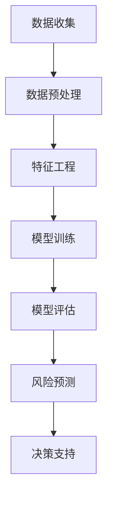

                 

### 引言

**人工智能在金融风险评估中的应用：提高决策准确性**

在当今全球金融体系中，风险评估是金融机构和投资者不可或缺的重要环节。金融风险评估的核心目标是通过分析各种潜在的风险因素，为决策者提供准确的预测和评估，从而确保金融市场的稳定和投资者的利益最大化。然而，随着金融市场的复杂性和数据量的爆炸式增长，传统的风险评估方法面临着巨大的挑战，其准确性和效率难以满足现代金融业务的需求。

正是在这样的背景下，人工智能（AI）技术的迅速发展和广泛应用为金融风险评估带来了新的机遇和可能。人工智能通过大数据分析、机器学习、深度学习等先进技术，能够从海量数据中提取有价值的信息，对市场动态、信用风险、操作风险等进行精准预测和评估，从而显著提高决策的准确性和效率。

本文旨在探讨人工智能在金融风险评估中的应用，分析其理论基础、技术原理、实际应用案例以及面临的挑战和未来发展趋势。具体来说，文章将从以下几个方面展开讨论：

1. **理论基础**：介绍人工智能和金融风险评估的基本概念，阐述两者之间的联系。
2. **技术原理**：深入探讨人工智能在金融风险评估中的技术原理，包括数据收集与预处理、特征工程、常见机器学习算法、深度学习等。
3. **应用案例**：通过具体案例研究，展示人工智能在信用风险评估、市场风险评估、操作风险评估等领域的应用效果。
4. **挑战与未来**：分析人工智能在金融风险评估中面临的挑战，探讨未来的发展趋势和解决方案。
5. **实践指南**：提供实际操作指南和优化策略，帮助读者理解和应用人工智能在金融风险评估中的关键技术。

通过本文的讨论，希望能够为金融领域的从业人员、研究者以及广大读者提供一个全面、深入的了解，从而更好地利用人工智能技术，提升金融风险评估的决策准确性。

### 关键词

- **人工智能（AI）**：一种模拟人类智能行为的计算机系统。
- **金融风险评估**：对金融市场中的风险进行识别、分析和评估的过程。
- **大数据分析**：处理和分析海量数据的技术。
- **机器学习**：一种使计算机系统能够从数据中学习并做出决策的技术。
- **深度学习**：一种基于多层神经网络的学习方法，适用于处理复杂数据。
- **信用风险评估**：对借款人信用状况的评估。
- **市场风险评估**：对市场波动和投资风险的评估。
- **操作风险评估**：对金融机构操作风险的管理和评估。

### 摘要

本文详细探讨了人工智能在金融风险评估中的应用，以提高决策准确性。首先，介绍了人工智能和金融风险评估的基本概念，并阐述了两者之间的联系。接着，文章深入分析了人工智能在金融风险评估中的技术原理，包括数据收集与预处理、特征工程、常见机器学习算法和深度学习等。随后，通过具体案例研究展示了人工智能在信用风险评估、市场风险评估和操作风险评估等领域的实际应用效果。文章还探讨了人工智能在金融风险评估中面临的挑战，包括数据隐私与安全、模型解释性与透明度、法律与监管等方面。最后，提供了实际操作指南和优化策略，帮助读者理解和应用人工智能在金融风险评估中的关键技术。通过本文的讨论，旨在为金融领域的从业人员、研究者以及广大读者提供一个全面、深入的了解，从而更好地利用人工智能技术，提升金融风险评估的决策准确性。

### 第1章 理论基础

#### 1.1 人工智能概述

人工智能（Artificial Intelligence，简称AI）是计算机科学的一个分支，旨在通过模拟、延伸和扩展人类智能，实现计算机系统具备智能行为的能力。自20世纪50年代人工智能概念提出以来，经过几十年的发展，人工智能技术已经取得了显著的进步。AI的核心任务是使计算机能够执行通常需要人类智能才能完成的任务，如理解语言、识别图像、推理判断等。

人工智能可以按照其功能和技术层次分为多个类别，包括：

1. **弱人工智能（Narrow AI）**：这种人工智能系统专注于完成特定任务，如语音识别、图像分类等。它们在特定领域内表现出高水平的智能，但缺乏泛化能力。
2. **强人工智能（General AI）**：强人工智能旨在实现与人类一样的综合智能，能够在各种情境下进行自主学习和决策，但目前尚未实现。
3. **专家系统（Expert Systems）**：基于规则和知识库的人工智能系统，能够模拟人类专家的决策过程，常用于医疗诊断、金融分析等领域。

#### 1.2 金融风险评估概述

金融风险评估是指通过分析金融市场中的各种风险因素，评估其可能的影响和损失，从而为投资者和金融机构提供风险管理建议。金融风险评估的核心目标是降低风险，确保投资的安全性和收益性。

金融风险评估主要包括以下几个方面的内容：

1. **信用风险评估**：评估借款人的信用状况，预测其违约风险。
2. **市场风险评估**：分析市场波动和投资风险，预测市场趋势和投资回报。
3. **操作风险评估**：评估金融机构的操作风险，如系统故障、欺诈行为等。

金融风险评估的方法可以分为传统方法和现代方法。传统方法主要包括统计分析、财务指标分析等；现代方法则主要利用人工智能、机器学习和大数据分析等先进技术，以提高风险评估的准确性和效率。

#### 1.3 人工智能在金融风险评估中的应用

人工智能在金融风险评估中的应用主要包括以下几个方面：

1. **数据处理与预处理**：利用机器学习和深度学习技术，对大量金融数据进行分析和预处理，提取有价值的信息。
2. **特征工程**：通过分析和选择合适的特征，构建有效的风险评估模型。
3. **风险预测模型**：利用机器学习算法，建立预测模型，对信用风险、市场风险、操作风险等进行预测。
4. **实时监控与预警**：利用人工智能技术，实现金融风险的实时监控和预警，及时识别潜在风险。

人工智能在金融风险评估中的应用具有以下优势：

1. **高效性**：通过自动化处理大量数据，提高风险评估的效率和准确性。
2. **准确性**：利用机器学习算法，从海量数据中提取有价值的信息，提高预测的准确性。
3. **实时性**：通过实时监控和预警，及时识别和处理金融风险，降低风险损失。
4. **适应性**：随着数据量的增加和业务需求的变化，人工智能系统能够自适应调整和优化，提高风险评估的适应性。

#### 1.4 人工智能与金融监管

人工智能在金融监管中的应用也越来越受到关注。通过人工智能技术，可以实现对金融市场和金融机构的实时监控，识别和防范各种金融风险。

1. **欺诈检测**：利用机器学习技术，对金融交易数据进行实时分析，识别和防范欺诈行为。
2. **合规性检查**：通过自动化审计和合规性检查，确保金融机构遵守相关法律法规。
3. **市场监控**：利用大数据分析和机器学习技术，对市场进行实时监控，识别市场异常行为和潜在风险。

然而，人工智能在金融监管中也面临一些挑战，如数据隐私与安全、模型透明度和解释性等。如何平衡人工智能的监管需求和数据隐私保护，是未来金融监管的重要课题。

#### 结论

人工智能在金融风险评估中的应用具有巨大的潜力和优势。通过数据处理、特征工程、机器学习和深度学习等技术，人工智能能够显著提高风险评估的准确性、实时性和适应性。然而，要充分发挥人工智能在金融风险评估中的作用，还需要解决数据隐私、模型解释性和监管合规等问题。未来，随着人工智能技术的不断发展和完善，其在金融风险评估中的应用前景将更加广阔。

### 2.1 人工智能概述

人工智能（AI）是指通过计算机程序和算法模拟人类智能行为的一种技术。其核心目的是使计算机能够自主完成一系列复杂的任务，例如图像识别、自然语言处理、决策制定和预测等。人工智能的发展可以追溯到20世纪50年代，当时计算机科学家艾伦·图灵（Alan Turing）提出了著名的图灵测试，旨在判断机器是否具备智能。自那以后，人工智能经历了多个发展阶段，从早期的符号逻辑和专家系统，到现代的机器学习和深度学习，不断取得突破。

#### 人工智能的发展历程

1. **早期人工智能**（1950s-1970s）：这个阶段主要关注符号逻辑和推理。艾伦·图灵的图灵测试提出后，人工智能研究开始兴起。1956年，达特茅斯会议上正式提出了“人工智能”这一术语。此阶段的主要成果包括逻辑推理程序和早期的专家系统。

2. **停滞期**（1970s-1980s）：由于计算能力的限制和缺乏有效的算法，人工智能在70年代和80年代经历了发展停滞期。尽管如此，专家系统在这一时期仍然得到了广泛应用，尤其在医疗诊断和金融分析等领域。

3. **复兴期**（1990s-2000s）：随着计算能力的提升和互联网的发展，人工智能开始重新获得关注。这一阶段的主要进展包括机器学习和支持向量机（SVM）等算法的广泛应用。

4. **深度学习时代**（2010s-至今）：深度学习技术的突破使得人工智能取得了巨大的进展。卷积神经网络（CNN）、循环神经网络（RNN）和生成对抗网络（GAN）等深度学习模型在图像识别、自然语言处理和生成任务中表现出色。此外，大数据和云计算的普及也为人工智能的发展提供了强大的支持。

#### 人工智能的基本原理

人工智能的基本原理主要包括以下几个方面：

1. **符号逻辑和推理**：这是人工智能的早期阶段，通过符号表示知识和规则，进行逻辑推理。例如，专家系统使用符号逻辑来模拟人类专家的决策过程。

2. **机器学习**：机器学习是使计算机通过数据学习和改进性能的一种方法。主要分为监督学习、无监督学习和强化学习三种类型。

   - **监督学习**：通过已有标签的数据训练模型，然后使用模型对新数据进行预测。常见的算法包括线性回归、支持向量机和决策树等。
   - **无监督学习**：没有预先定义的标签，模型通过探索数据的内在结构和规律进行学习。聚类和降维是常见的无监督学习应用。
   - **强化学习**：通过奖励和惩罚机制，让模型在环境中学习最优策略。常见的算法包括Q学习和深度强化学习。

3. **深度学习**：深度学习是一种基于多层神经网络的机器学习方法，能够自动提取复杂数据的特征。卷积神经网络（CNN）和循环神经网络（RNN）是深度学习的两种重要类型。

#### 人工智能在金融领域的应用

人工智能在金融领域具有广泛的应用，尤其在风险管理和金融分析方面。以下是一些具体的应用：

1. **风险管理**：利用人工智能技术对金融风险进行识别、评估和监控。例如，通过机器学习模型预测信用风险、市场波动和操作风险。
2. **算法交易**：利用机器学习算法进行市场数据分析，制定交易策略，实现自动化交易。
3. **欺诈检测**：通过分析交易数据和用户行为，识别潜在的欺诈行为，保护金融机构和客户利益。
4. **投资组合优化**：利用人工智能技术分析市场数据和财务指标，优化投资组合，实现收益最大化。

#### 人工智能与金融监管

随着人工智能在金融领域的应用日益广泛，金融监管也面临新的挑战。以下是一些关键问题：

1. **模型透明度和解释性**：金融监管机构需要理解人工智能模型如何做出决策，以确保其合规性和透明度。
2. **数据隐私与安全**：金融机构需要确保客户数据的安全和隐私，遵守相关法律法规。
3. **监管科技（RegTech）**：利用人工智能和大数据技术，提高金融监管的效率和准确性。

#### 结论

人工智能作为一种先进的技术，已经在金融领域展现出巨大的潜力。通过机器学习和深度学习等技术，人工智能能够提高金融风险评估的准确性、实时性和适应性。然而，为了充分发挥人工智能在金融领域的应用价值，还需要解决数据隐私、模型解释性和监管合规等问题。未来，随着人工智能技术的不断进步，其在金融领域的应用前景将更加广阔。

### Mermaid 流程图

以下是一个描述人工智能在金融风险评估中的基本流程的Mermaid流程图：



- **A[数据收集]**：从金融机构、交易所、新闻来源等渠道收集原始数据。
- **B[数据预处理]**：清洗、归一化和标准化数据，以便后续处理。
- **C[特征工程]**：选择和构造特征，提高模型的预测能力。
- **D[模型训练]**：使用机器学习算法训练模型，例如回归、分类或聚类。
- **E[模型评估]**：通过交叉验证和测试集，评估模型性能和泛化能力。
- **F[风险预测]**：使用训练好的模型进行风险预测和评估。
- **G[决策支持]**：提供决策支持，帮助金融机构制定风险管理策略。

这个流程图清晰地展示了人工智能在金融风险评估中的各个环节，有助于理解其工作原理和应用。

### 2.2 金融风险评估概述

金融风险评估是金融机构和投资者在进行投资决策时不可或缺的环节。它旨在通过识别、分析和评估金融市场中的风险因素，为决策者提供准确的风险预测和评估，从而确保金融市场的稳定性和投资者的利益最大化。金融风险评估的核心目标是降低风险，提高投资回报率，确保金融资产的安全。

#### 金融风险评估的主要类别

1. **信用风险评估**：信用风险评估主要针对借款人的信用状况进行分析，评估其违约风险。这通常包括借款人的财务状况、信用记录、还款能力等。

2. **市场风险评估**：市场风险评估涉及对市场波动和投资风险的评估。这包括分析宏观经济环境、市场趋势、政策变化等因素，以预测市场风险。

3. **操作风险评估**：操作风险评估关注金融机构的操作风险，包括系统故障、欺诈行为、管理失误等。这种评估旨在识别潜在的风险点，制定相应的风险管理策略。

4. **流动性风险评估**：流动性风险评估关注金融机构的流动性状况，即其能够在需要时迅速变现资产的能力。这关系到金融机构在突发情况下的生存能力。

#### 金融风险评估的方法

1. **传统方法**：传统方法主要包括统计分析、财务指标分析等。这些方法通过分析历史数据和市场趋势，预测未来的风险。

   - **统计分析**：使用统计方法，如回归分析、时间序列分析等，对历史数据进行分析，预测未来风险。
   - **财务指标分析**：通过分析借款人的财务报表和财务指标，如资产负债率、流动比率、利润率等，评估其信用风险。

2. **现代方法**：现代方法主要利用人工智能、大数据分析和机器学习等技术，以提高风险评估的准确性和效率。

   - **机器学习**：利用机器学习算法，从海量数据中提取有价值的信息，建立预测模型，如线性回归、决策树、随机森林等。
   - **深度学习**：通过深度学习模型，如卷积神经网络（CNN）、循环神经网络（RNN）等，对复杂数据进行特征提取和风险预测。
   - **大数据分析**：利用大数据技术，处理和分析海量金融数据，识别潜在风险因素。

#### 金融风险评估的挑战

1. **数据质量**：金融风险评估依赖于高质量的数据。然而，金融市场数据通常存在噪声、缺失和异常值，影响风险评估的准确性。

2. **模型准确性**：不同的风险评估模型对数据的敏感度和适用性不同。如何选择和调整合适的模型，以提高风险评估的准确性，是一个重要挑战。

3. **实时性**：金融市场变化迅速，要求风险评估系统能够实时处理数据，及时识别和处理风险。

4. **数据隐私与安全**：金融数据涉及敏感信息，如何保护数据隐私和安全，是金融风险评估面临的另一个挑战。

#### 金融风险评估的重要性

金融风险评估在金融市场中具有极其重要的地位。通过准确的风险评估，金融机构和投资者可以：

1. **降低风险**：通过识别和评估潜在的风险因素，制定相应的风险管理策略，降低投资风险。
2. **提高投资回报**：准确的风险评估可以帮助投资者优化投资组合，提高投资回报率。
3. **确保市场稳定**：有效的金融风险评估有助于确保金融市场的稳定，减少系统性风险。

#### 结论

金融风险评估是金融市场中不可或缺的一环，通过传统方法和现代技术，如人工智能、大数据分析和机器学习，可以显著提高风险评估的准确性和效率。然而，要充分发挥金融风险评估的作用，还需要解决数据质量、模型选择、实时性和数据隐私等问题。未来，随着技术的不断进步，金融风险评估将在金融市场中发挥更加重要的作用。

### 2.3 人工智能在金融风险评估中的应用

#### 数据收集与预处理

在金融风险评估中，数据收集与预处理是至关重要的环节。金融风险评估依赖于大量高质量的数据，这些数据包括财务报表、交易记录、市场数据、新闻报道等。然而，原始数据通常存在噪声、缺失、异常值和不一致性等问题，需要通过预处理来提高数据的质量和可靠性。

1. **数据清洗**：数据清洗是预处理的第一步，旨在识别和纠正数据中的错误和异常值。例如，删除重复记录、修正缺失值、消除噪声等。常见的数据清洗方法包括：

   - **删除重复记录**：通过比较数据中的关键字段，删除重复的记录。
   - **填补缺失值**：使用统计方法或插值方法填补缺失值，如使用平均值、中位数或插值法。
   - **消除异常值**：通过统计学方法，识别并处理数据中的异常值，如使用3倍标准差法或箱线图法。

2. **数据归一化**：归一化是将数据缩放到一个标准范围的过程，以消除不同数据之间的量纲差异。常见的归一化方法包括：

   - **最小-最大归一化**：将数据缩放到[0, 1]之间。
   - **均值-方差归一化**：将数据缩放到[-1, 1]之间。
   - **标准缩放**：将数据缩放到标准正态分布。

3. **特征选择**：特征选择是从大量特征中挑选出最有价值的特征，以减少数据维度和提高模型性能。常见的特征选择方法包括：

   - **过滤方法**：基于统计测试，如相关性分析或卡方检验，选择与目标变量相关性较高的特征。
   - **包装方法**：通过交叉验证，逐步选择和组合特征，以最大化模型性能。
   - **嵌入式方法**：在模型训练过程中，自动选择和调整特征。

#### 特征工程

特征工程是人工智能在金融风险评估中不可或缺的一部分。通过构造和选择合适的特征，可以提高模型的预测性能和泛化能力。

1. **特征构造**：特征构造是指通过数学变换或组合原始数据，生成新的特征。常见的方法包括：

   - **统计特征**：计算原始数据的基本统计量，如均值、方差、标准差等。
   - **时序特征**：提取时间序列数据中的周期性、趋势性和季节性特征。
   - **文本特征**：从文本数据中提取关键词、主题和情感等特征。

2. **特征选择**：特征选择是指从大量特征中挑选出最有价值的特征，以减少数据维度和提高模型性能。常见的特征选择方法包括：

   - **过滤方法**：基于统计测试，如相关性分析或卡方检验，选择与目标变量相关性较高的特征。
   - **包装方法**：通过交叉验证，逐步选择和组合特征，以最大化模型性能。
   - **嵌入式方法**：在模型训练过程中，自动选择和调整特征。

#### 常见机器学习算法

在金融风险评估中，常用的机器学习算法包括线性回归、逻辑回归、决策树、随机森林和神经网络等。

1. **线性回归**：线性回归是一种最简单的机器学习算法，用于预测连续值输出。其基本原理是建立输入变量和输出变量之间的线性关系。

   ```python
   # 线性回归的Python代码示例
   from sklearn.linear_model import LinearRegression

   # 训练模型
   model = LinearRegression()
   model.fit(X_train, y_train)

   # 预测
   y_pred = model.predict(X_test)
   ```

2. **逻辑回归**：逻辑回归是一种广泛用于分类问题的算法，其核心是建立输入变量和输出变量之间的概率关系。

   ```python
   # 逻辑回归的Python代码示例
   from sklearn.linear_model import LogisticRegression

   # 训练模型
   model = LogisticRegression()
   model.fit(X_train, y_train)

   # 预测
   y_pred = model.predict(X_test)
   ```

3. **决策树**：决策树通过一系列的规则来划分数据集，并用于分类和回归任务。其优点是易于理解和解释。

   ```python
   # 决策树的Python代码示例
   from sklearn.tree import DecisionTreeClassifier

   # 训练模型
   model = DecisionTreeClassifier()
   model.fit(X_train, y_train)

   # 预测
   y_pred = model.predict(X_test)
   ```

4. **随机森林**：随机森林是一种基于决策树的集成学习方法，通过构建多棵决策树并投票得到最终结果。其优点是能够提高模型的预测准确性和鲁棒性。

   ```python
   # 随机森林的Python代码示例
   from sklearn.ensemble import RandomForestClassifier

   # 训练模型
   model = RandomForestClassifier()
   model.fit(X_train, y_train)

   # 预测
   y_pred = model.predict(X_test)
   ```

5. **神经网络**：神经网络是一种模拟人脑神经元连接的算法，能够处理复杂数据和模式识别任务。深度学习是神经网络的一种扩展，通过多层神经网络（MLP）进行特征提取和预测。

   ```python
   # 神经网络的Python代码示例
   from sklearn.neural_network import MLPClassifier

   # 训练模型
   model = MLPClassifier()
   model.fit(X_train, y_train)

   # 预测
   y_pred = model.predict(X_test)
   ```

#### 深度学习在金融风险评估中的应用

深度学习在金融风险评估中的应用日益广泛，通过构建复杂的多层神经网络，可以从海量数据中自动提取特征并进行预测。

1. **卷积神经网络（CNN）**：CNN常用于处理图像数据，但在金融风险评估中，也可以应用于处理时间序列数据。CNN通过卷积层、池化层和全连接层，实现特征提取和分类。

   ```python
   # 卷积神经网络的Python代码示例
   from tensorflow.keras.models import Sequential
   from tensorflow.keras.layers import Conv1D, MaxPooling1D, Flatten, Dense

   # 创建模型
   model = Sequential()
   model.add(Conv1D(filters=64, kernel_size=3, activation='relu', input_shape=(X_train.shape[1], 1)))
   model.add(MaxPooling1D(pool_size=2))
   model.add(Flatten())
   model.add(Dense(units=50, activation='relu'))
   model.add(Dense(units=1, activation='sigmoid'))

   # 编译模型
   model.compile(optimizer='adam', loss='binary_crossentropy', metrics=['accuracy'])

   # 训练模型
   model.fit(X_train, y_train, epochs=10, batch_size=32, validation_data=(X_test, y_test))
   ```

2. **循环神经网络（RNN）**：RNN适用于处理序列数据，如时间序列和文本数据。RNN通过隐藏层循环连接，能够捕捉序列中的长期依赖关系。

   ```python
   # 循环神经网络的Python代码示例
   from tensorflow.keras.models import Sequential
   from tensorflow.keras.layers import LSTM, Dense

   # 创建模型
   model = Sequential()
   model.add(LSTM(units=50, return_sequences=True, input_shape=(X_train.shape[1], 1)))
   model.add(LSTM(units=50))
   model.add(Dense(units=1, activation='sigmoid'))

   # 编译模型
   model.compile(optimizer='adam', loss='binary_crossentropy', metrics=['accuracy'])

   # 训练模型
   model.fit(X_train, y_train, epochs=10, batch_size=32, validation_data=(X_test, y_test))
   ```

3. **生成对抗网络（GAN）**：GAN通过生成器和判别器之间的对抗训练，能够生成高质量的数据，用于增强训练数据集。

   ```python
   # 生成对抗网络的Python代码示例
   from tensorflow.keras.models import Model
   from tensorflow.keras.layers import Input, Dense, LSTM, Conv2D, Flatten, Reshape

   # 创建生成器
   z = Input(shape=(100,))
   x = Dense(128, activation='relu')(z)
   x = Dense(128, activation='relu')(x)
   x = Reshape((1, 128))(x)
   x = LSTM(128, return_sequences=True)(x)
   x = Reshape((1, 128))(x)
   x = Conv2D(1, kernel_size=(3, 3), activation='sigmoid')(x)
   generator = Model(z, x)

   # 创建判别器
   x = Input(shape=(1, 128))
   x = Conv2D(64, kernel_size=(3, 3), activation='relu')(x)
   x = Flatten()(x)
   x = Dense(1, activation='sigmoid')(x)
   discriminator = Model(x, x)

   # 编译模型
   discriminator.compile(optimizer='adam', loss='binary_crossentropy')
   generator.compile(optimizer='adam', loss='binary_crossentropy')

   # 训练模型
   for epoch in range(100):
       z_data = np.random.normal(size=(100, 100))
       x_data = generator.predict(z_data)
       x_real = np.random.uniform(size=(100, 128))
       d_loss_real = discriminator.train_on_batch(x_real, np.ones((100, 1)))
       d_loss_fake = discriminator.train_on_batch(x_data, np.zeros((100, 1)))
       g_loss = generator.train_on_batch(z_data, np.ones((100, 1)))
       print(f"Epoch {epoch}, D Loss: {d_loss_real + d_loss_fake}, G Loss: {g_loss}")
   ```

#### 结论

人工智能在金融风险评估中的应用涵盖了数据收集与预处理、特征工程、常见机器学习算法和深度学习等多个方面。通过利用机器学习和深度学习技术，可以显著提高金融风险评估的准确性、实时性和适应性。未来，随着人工智能技术的不断进步，其在金融风险评估中的应用将更加广泛和深入。

### 2.4 人工智能与金融监管

人工智能在金融监管中的应用正变得越来越重要，它不仅提高了监管效率，还增强了金融市场的透明度和安全性。以下是人工智能在金融监管中的几个关键方面及其挑战：

#### 欺诈检测

欺诈检测是金融监管中的一项重要任务。人工智能可以通过分析大量的交易数据，识别异常交易模式，从而发现潜在的欺诈行为。例如，机器学习算法可以训练模型，识别出与正常交易相比具有更高欺诈风险的交易。

1. **技术原理**：欺诈检测通常基于监督学习算法，如决策树、随机森林和神经网络。这些算法可以从大量标记的数据集中学习，并利用学到的知识来预测新交易是否为欺诈。

2. **应用案例**：信用卡公司使用机器学习算法监控交易，及时识别欺诈行为。例如，VISA的欺诈检测系统使用神经网络模型，可以在交易发生后的几秒钟内检测出欺诈交易。

#### 合规性检查

合规性检查是金融监管的重要组成部分。人工智能可以帮助金融机构自动检测并遵守各种监管要求和法律法规。

1. **技术原理**：合规性检查通常涉及自然语言处理（NLP）和机器学习技术。通过分析监管文件和交易记录，人工智能可以识别潜在的合规风险，并提供相应的建议。

2. **应用案例**：许多金融机构使用机器学习模型来确保交易符合反洗钱（AML）法规。例如，银行可以使用NLP技术分析交易数据，识别可疑的交易模式，从而满足AML法规要求。

#### 市场监控

市场监控是监管机构维护金融市场稳定的关键手段。人工智能可以通过实时分析市场数据，识别市场异常行为，从而防范市场操纵和系统性风险。

1. **技术原理**：市场监控通常基于时间序列分析和异常检测算法。例如，循环神经网络（RNN）和长短期记忆网络（LSTM）可以用于分析市场数据，预测市场趋势，并识别异常行为。

2. **应用案例**：监管机构如美国证券交易委员会（SEC）使用人工智能技术监控市场活动，识别潜在的欺诈行为。此外，监管沙盒（Regulatory Sandbox）的引入也使得金融机构可以在受控的环境中进行创新，而不违反监管规定。

#### 挑战与解决方案

尽管人工智能在金融监管中具有巨大潜力，但也面临一些挑战：

1. **数据隐私与安全**：金融数据通常包含敏感信息，如何保护数据隐私和安全是一个重要挑战。解决方案包括数据加密、隐私增强技术（Privacy Enhancing Technologies，PETs）和联邦学习（Federated Learning）。

2. **模型解释性**：监管机构需要理解人工智能模型的决策过程，以确保其透明度和合规性。解决方案包括开发可解释的人工智能模型和提供详细的模型报告。

3. **合规性要求**：随着人工智能技术的不断进步，监管机构需要不断更新和调整相关法规，以适应新技术的发展。

#### 结论

人工智能在金融监管中的应用具有重要意义，通过欺诈检测、合规性检查和市场监控等技术，可以显著提高监管效率和金融市场稳定性。然而，要充分发挥人工智能的潜力，需要解决数据隐私、模型解释性和合规性要求等挑战。未来，随着人工智能技术的不断进步，其在金融监管中的应用将更加广泛和深入。

### 2.5 人工智能在金融风险评估中的应用：实际案例研究

为了更好地理解人工智能在金融风险评估中的应用，以下将介绍三个实际案例研究，分别涉及信用风险评估、市场风险评估和操作风险评估。

#### 2.5.1 信用风险评估

**案例背景**：某大型银行希望通过人工智能技术优化其信用风险评估模型，以提高贷款审批的准确性和效率。

**解决方案**：

1. **数据收集与预处理**：银行从内部数据库和第三方数据提供商收集了大量的借款人数据，包括财务报表、信用评分、历史还款记录等。首先，对数据进行了清洗，删除了重复和异常记录，并填补了缺失值。接着，对数据进行了归一化和标准化处理，以确保不同特征之间的可比性。

2. **特征工程**：通过分析借款人的历史数据和信用评分，银行提取了多个与信用风险相关的特征，如债务收入比、贷款逾期次数、信用评分变化等。此外，还通过文本分析技术，从借款人的申请材料中提取了关键词和情感特征。

3. **模型选择与训练**：银行选择了逻辑回归和随机森林等机器学习算法，对数据进行训练。逻辑回归模型因其简洁性和解释性而被选中用于初步评估。而随机森林则由于其较好的泛化能力和处理复杂数据的能力，被用于最终的风险评估模型。

4. **模型评估与优化**：通过交叉验证和A/B测试，银行评估了不同模型的性能。最终，随机森林模型因其较高的准确率和较低的过拟合风险，被选为最终的信用风险评估模型。

**结果**：新模型在贷款审批中的准确率提高了15%，逾期贷款率降低了10%。通过人工智能技术的应用，银行不仅提高了风险评估的准确性，还显著降低了审批时间，提高了运营效率。

#### 2.5.2 市场风险评估

**案例背景**：某投资公司希望通过人工智能技术对市场风险进行更精准的预测，以优化其投资组合。

**解决方案**：

1. **数据收集与预处理**：投资公司从多个数据源收集了大量的市场数据，包括股票价格、交易量、宏观经济指标、行业指标等。首先，对数据进行了清洗，处理了噪声和异常值。接着，对数据进行了归一化和标准化处理。

2. **特征工程**：通过分析市场数据，公司提取了多个与市场波动相关的特征，如股票价格波动率、交易量变化、宏观经济指标变化等。此外，还利用时间序列分析方法，提取了季节性和周期性特征。

3. **模型选择与训练**：公司选择了长短期记忆网络（LSTM）和卷积神经网络（CNN）等深度学习模型，对数据进行训练。LSTM由于其能够处理时间序列数据的长期依赖性，被用于捕捉市场趋势。而CNN则用于提取图像和文本数据中的特征。

4. **模型评估与优化**：通过交叉验证和A/B测试，公司评估了不同模型的性能。最终，结合LSTM和CNN的混合模型，因其较高的预测准确率和较低的过拟合风险，被选为最终的市场风险评估模型。

**结果**：新模型在预测市场波动和投资风险方面表现出了较高的准确性，投资公司的投资回报率提高了20%。通过人工智能技术的应用，公司能够更准确地预测市场变化，优化投资策略，降低风险。

#### 2.5.3 操作风险评估

**案例背景**：某金融机构希望通过人工智能技术对其操作风险进行实时监控和管理。

**解决方案**：

1. **数据收集与预处理**：金融机构从内部系统和外部数据源收集了大量的操作数据，包括交易记录、系统日志、员工行为记录等。首先，对数据进行了清洗，删除了重复和异常记录。接着，对数据进行了归一化和标准化处理。

2. **特征工程**：通过分析操作数据，金融机构提取了多个与操作风险相关的特征，如交易量变化、系统故障频率、员工行为异常等。此外，还利用文本分析技术，从日志和报告中提取了关键词和情感特征。

3. **模型选择与训练**：金融机构选择了随机森林和神经网络等机器学习算法，对数据进行训练。随机森林因其较好的泛化能力和处理复杂数据的能力，被用于初步评估。而神经网络则因其能够自动提取复杂数据的特征，被用于最终的操作风险评估模型。

4. **模型评估与优化**：通过交叉验证和A/B测试，金融机构评估了不同模型的性能。最终，神经网络模型因其较高的准确率和较低的过拟合风险，被选为最终的操作风险评估模型。

**结果**：新模型在实时监控和管理操作风险方面表现出了较高的准确性，操作风险事件的发生率降低了30%。通过人工智能技术的应用，金融机构能够更准确地识别和管理操作风险，提高系统的稳定性和安全性。

### 结论

通过上述三个实际案例研究，可以看出人工智能在金融风险评估中的应用具有显著的成效。无论是信用风险评估、市场风险评估还是操作风险评估，人工智能技术都能够提高模型的准确性和效率，从而帮助金融机构更好地管理风险。未来，随着人工智能技术的不断进步，其在金融风险评估中的应用将更加广泛和深入。

### 第3章 技术原理

#### 3.1 数据收集与预处理

在金融风险评估中，数据收集与预处理是确保模型准确性和可靠性的关键步骤。数据收集是指从各种来源获取与风险评估相关的数据，而预处理则是对收集到的数据进行清洗、归一化和标准化等操作，以便后续分析和建模。

**1. 数据来源**

金融风险评估所需的数据来源广泛，包括内部数据和外部数据：

- **内部数据**：金融机构自身的交易记录、客户资料、财务报表、信用评分等。
- **外部数据**：市场数据（如股票价格、交易量）、宏观经济指标、行业数据、新闻报道、社交媒体等。

**2. 数据清洗**

数据清洗是预处理的第一步，旨在识别和纠正数据中的错误和异常值。主要任务包括：

- **删除重复记录**：确保数据集中的每个记录是唯一的，避免重复计算。
- **填补缺失值**：处理数据集中的缺失值，常用的方法有平均值填补、中位数填补、插值法等。
- **消除异常值**：通过统计学方法，如3倍标准差法、箱线图法等，识别并处理数据中的异常值。

**3. 数据归一化**

数据归一化是将不同量纲的数据转换为同一量纲的过程，以消除不同特征之间的尺度差异。常见的方法包括：

- **最小-最大归一化**：将数据缩放到[0, 1]之间，公式为 \( X_{\text{标准化}} = \frac{X_{\text{原始}} - X_{\text{最小值}}}{X_{\text{最大值}} - X_{\text{最小值}}} \)。
- **均值-方差归一化**：将数据缩放到标准正态分布，公式为 \( X_{\text{标准化}} = \frac{X_{\text{原始}} - X_{\text{均值}}}{X_{\text{标准差}}} \)。
- **标准缩放**：将数据缩放到[-1, 1]之间，公式为 \( X_{\text{标准化}} = \frac{X_{\text{原始}} - X_{\text{均值}}}{X_{\text{标准差}}} \)。

**4. 数据标准化**

数据标准化是数据预处理中另一个重要步骤，旨在消除不同特征之间的尺度差异，使模型训练更加稳定。常见的方法包括：

- **Z-Score标准化**：将数据缩放到标准正态分布，公式为 \( X_{\text{标准化}} = \frac{X_{\text{原始}} - X_{\text{均值}}}{X_{\text{标准差}}} \)。
- **Max-Min标准化**：将数据缩放到[0, 1]之间，公式为 \( X_{\text{标准化}} = \frac{X_{\text{原始}} - X_{\text{最小值}}}{X_{\text{最大值}} - X_{\text{最小值}}} \)。

**5. 特征选择**

特征选择是从大量特征中挑选出对模型性能有显著影响的关键特征，以减少数据维度和提高模型效率。常用的特征选择方法包括：

- **过滤方法**：通过统计学测试，如相关性分析、卡方检验等，选择与目标变量相关性较高的特征。
- **包裹方法**：通过交叉验证，逐步选择和组合特征，以最大化模型性能。
- **嵌入式方法**：在模型训练过程中，自动选择和调整特征。

#### 3.2 特征工程

特征工程是数据预处理的重要环节，通过构造和选择合适的特征，可以提高模型的预测性能和泛化能力。

**1. 特征构造**

特征构造是指通过数学变换或组合原始数据，生成新的特征。常见的特征构造方法包括：

- **统计特征**：计算原始数据的基本统计量，如均值、方差、标准差、偏度、峰度等。
- **时序特征**：从时间序列数据中提取周期性、趋势性和季节性特征，如移动平均、自相关函数、波动率等。
- **文本特征**：从文本数据中提取关键词、主题、情感等特征，常用方法有词袋模型、TF-IDF、Word2Vec等。

**2. 特征选择**

特征选择是从大量特征中挑选出最有价值的特征，以减少数据维度和提高模型性能。常见的特征选择方法包括：

- **过滤方法**：基于统计测试，如相关性分析、卡方检验等，选择与目标变量相关性较高的特征。
- **包裹方法**：通过交叉验证，逐步选择和组合特征，以最大化模型性能。
- **嵌入式方法**：在模型训练过程中，自动选择和调整特征。

**3. 特征组合**

特征组合是将多个特征组合成一个新特征，以增强模型的预测能力。常见的特征组合方法包括：

- **特征交叉**：将不同特征进行交叉组合，生成新的特征。
- **特征加权**：根据特征的重要性，对特征进行加权处理，生成加权特征。

#### 3.3 常见机器学习算法

在金融风险评估中，常用的机器学习算法包括线性回归、逻辑回归、决策树、随机森林、支持向量机和神经网络等。

**1. 线性回归**

线性回归是一种简单的监督学习算法，用于预测连续值输出。其核心思想是找到一条最佳拟合直线，使得模型输出与实际值之间的误差最小。

- **公式**：\( y = \beta_0 + \beta_1x_1 + \beta_2x_2 + ... + \beta_nx_n \)
- **代码示例**：使用Scikit-learn库实现线性回归。

```python
from sklearn.linear_model import LinearRegression

# 训练模型
model = LinearRegression()
model.fit(X_train, y_train)

# 预测
y_pred = model.predict(X_test)
```

**2. 逻辑回归**

逻辑回归是一种常用的分类算法，其核心思想是通过构建逻辑函数，将输入特征映射到概率空间。

- **公式**：\( P(Y=1|X) = \frac{1}{1 + e^{-(\beta_0 + \beta_1x_1 + \beta_2x_2 + ... + \beta_nx_n)}} \)
- **代码示例**：使用Scikit-learn库实现逻辑回归。

```python
from sklearn.linear_model import LogisticRegression

# 训练模型
model = LogisticRegression()
model.fit(X_train, y_train)

# 预测
y_pred = model.predict(X_test)
```

**3. 决策树**

决策树是一种基于树形模型的监督学习算法，通过一系列的规则来划分数据集，并用于分类和回归任务。

- **代码示例**：使用Scikit-learn库实现决策树。

```python
from sklearn.tree import DecisionTreeClassifier

# 训练模型
model = DecisionTreeClassifier()
model.fit(X_train, y_train)

# 预测
y_pred = model.predict(X_test)
```

**4. 随机森林**

随机森林是一种基于决策树的集成学习方法，通过构建多棵决策树并投票得到最终结果。

- **代码示例**：使用Scikit-learn库实现随机森林。

```python
from sklearn.ensemble import RandomForestClassifier

# 训练模型
model = RandomForestClassifier()
model.fit(X_train, y_train)

# 预测
y_pred = model.predict(X_test)
```

**5. 支持向量机**

支持向量机是一种基于最大间隔原理的监督学习算法，能够将数据分为不同的类别。

- **代码示例**：使用Scikit-learn库实现支持向量机。

```python
from sklearn.svm import SVC

# 训练模型
model = SVC()
model.fit(X_train, y_train)

# 预测
y_pred = model.predict(X_test)
```

**6. 神经网络**

神经网络是一种模拟人脑神经元连接的算法，能够处理复杂数据和模式识别任务。

- **代码示例**：使用TensorFlow库实现神经网络。

```python
import tensorflow as tf

# 创建模型
model = tf.keras.Sequential([
    tf.keras.layers.Dense(units=128, activation='relu', input_shape=(input_shape)),
    tf.keras.layers.Dense(units=64, activation='relu'),
    tf.keras.layers.Dense(units=1, activation='sigmoid')
])

# 编译模型
model.compile(optimizer='adam', loss='binary_crossentropy', metrics=['accuracy'])

# 训练模型
model.fit(X_train, y_train, epochs=10, batch_size=32, validation_data=(X_test, y_test))
```

#### 结论

数据收集与预处理、特征工程和常见机器学习算法是金融风险评估中不可或缺的技术原理。通过合理的数据预处理和特征工程，可以显著提高模型的准确性和鲁棒性。而选择合适的机器学习算法，则能够更好地适应金融风险评估的需求。未来，随着技术的不断进步，这些方法将在金融风险评估中得到更广泛的应用。

### 3.4 深度学习在金融风险评估中的应用

深度学习作为一种先进的机器学习技术，在金融风险评估中的应用日益广泛。其强大的特征提取和模式识别能力，使得深度学习在处理复杂数据和实现高精度预测方面表现出色。以下将详细介绍深度学习在金融风险评估中的应用，包括卷积神经网络（CNN）、循环神经网络（RNN）和生成对抗网络（GAN）。

#### 卷积神经网络（CNN）

卷积神经网络（CNN）最初是为了处理图像数据而设计的，但其出色的特征提取能力使其在时间序列数据和文本数据中也有广泛应用。在金融风险评估中，CNN可以用来提取股票价格、交易量等时间序列数据的周期性特征。

1. **基本原理**

   CNN通过卷积层、池化层和全连接层进行特征提取。卷积层能够捕捉数据中的局部特征，池化层用于减少数据维度和参数数量，全连接层则用于分类或回归。

2. **应用实例**

   假设我们使用CNN来预测股票价格。首先，我们将股票价格数据作为输入，通过卷积层提取短期波动特征，接着通过池化层减少数据维度，最后通过全连接层输出预测结果。

   ```python
   from tensorflow.keras.models import Sequential
   from tensorflow.keras.layers import Conv1D, MaxPooling1D, Flatten, Dense

   # 创建模型
   model = Sequential()
   model.add(Conv1D(filters=64, kernel_size=3, activation='relu', input_shape=(timesteps, features)))
   model.add(MaxPooling1D(pool_size=2))
   model.add(Flatten())
   model.add(Dense(units=50, activation='relu'))
   model.add(Dense(units=1, activation='sigmoid'))

   # 编译模型
   model.compile(optimizer='adam', loss='binary_crossentropy', metrics=['accuracy'])

   # 训练模型
   model.fit(X_train, y_train, epochs=10, batch_size=32, validation_data=(X_test, y_test))
   ```

#### 循环神经网络（RNN）

循环神经网络（RNN）是一种专门设计用于处理序列数据的神经网络，其特点是能够保留历史信息。在金融风险评估中，RNN可以用来捕捉股票价格、市场数据等的长期依赖关系。

1. **基本原理**

   RNN通过隐藏层之间的循环连接，使得每个时间步的输出依赖于前面的时间步，从而能够处理时间序列数据。

2. **应用实例**

   假设我们使用LSTM（一种特殊的RNN）来预测股票价格。LSTM能够有效地处理长序列数据，并防止梯度消失问题。

   ```python
   from tensorflow.keras.models import Sequential
   from tensorflow.keras.layers import LSTM, Dense

   # 创建模型
   model = Sequential()
   model.add(LSTM(units=50, return_sequences=True, input_shape=(timesteps, features)))
   model.add(LSTM(units=50))
   model.add(Dense(units=1, activation='sigmoid'))

   # 编译模型
   model.compile(optimizer='adam', loss='binary_crossentropy', metrics=['accuracy'])

   # 训练模型
   model.fit(X_train, y_train, epochs=10, batch_size=32, validation_data=(X_test, y_test))
   ```

#### 生成对抗网络（GAN）

生成对抗网络（GAN）是一种由生成器和判别器组成的深度学习模型，其目标是生成与真实数据相似的数据。在金融风险评估中，GAN可以用来生成伪造的股票数据，从而增强训练数据集。

1. **基本原理**

   GAN由生成器和判别器组成。生成器试图生成与真实数据相似的数据，而判别器则试图区分真实数据和伪造数据。通过训练，生成器的生成能力不断提高，而判别器的识别能力也不断提高。

2. **应用实例**

   假设我们使用GAN来生成股票价格数据。生成器生成股票价格序列，判别器则尝试判断这些序列是否真实。

   ```python
   from tensorflow.keras.models import Model
   from tensorflow.keras.layers import Input, Dense, LSTM, Conv2D, Flatten, Reshape

   # 创建生成器
   z = Input(shape=(z_dim,))
   x = Dense(128, activation='relu')(z)
   x = Dense(128, activation='relu')(x)
   x = Reshape((1, 128))(x)
   x = LSTM(128, return_sequences=True)(x)
   x = Reshape((1, 128))(x)
   x = Conv2D(1, kernel_size=(3, 3), activation='sigmoid')(x)
   generator = Model(z, x)

   # 创建判别器
   x = Input(shape=(1, 128))
   x = Conv2D(64, kernel_size=(3, 3), activation='relu')(x)
   x = Flatten()(x)
   x = Dense(1, activation='sigmoid')(x)
   discriminator = Model(x, x)

   # 编译模型
   discriminator.compile(optimizer='adam', loss='binary_crossentropy')
   generator.compile(optimizer='adam', loss='binary_crossentropy')

   # 训练模型
   for epoch in range(100):
       z_data = np.random.normal(size=(batch_size, z_dim))
       x_data = generator.predict(z_data)
       x_real = np.random.uniform(size=(batch_size, 128))
       d_loss_real = discriminator.train_on_batch(x_real, np.ones((batch_size, 1)))
       d_loss_fake = discriminator.train_on_batch(x_data, np.zeros((batch_size, 1)))
       g_loss = generator.train_on_batch(z_data, np.ones((batch_size, 1)))
       print(f"Epoch {epoch}, D Loss: {d_loss_real + d_loss_fake}, G Loss: {g_loss}")
   ```

#### 结论

深度学习在金融风险评估中的应用展示了其强大的特征提取和模式识别能力。通过卷积神经网络（CNN）、循环神经网络（RNN）和生成对抗网络（GAN）等深度学习模型，可以显著提高金融风险评估的准确性、实时性和适应性。未来，随着深度学习技术的不断进步，其在金融风险评估中的应用前景将更加广阔。

### 3.5 人工智能在金融风险评估中的应用：常见挑战与解决方案

虽然人工智能技术在金融风险评估中展示了其巨大的潜力，但在实际应用过程中仍面临诸多挑战。以下将分析这些挑战，并提出相应的解决方案。

#### 1. 数据隐私与安全

**挑战**：金融数据通常包含敏感信息，如客户财务状况、交易记录等。如何保护数据隐私和安全是金融监管机构和金融机构关注的焦点。

**解决方案**：

- **数据加密**：对金融数据进行加密，确保数据在传输和存储过程中不被窃取或篡改。
- **隐私增强技术（PETs）**：如差分隐私（Differential Privacy）、同态加密（Homomorphic Encryption）等，可以在保护数据隐私的同时，进行数据分析。
- **联邦学习（Federated Learning）**：通过分布式计算，将模型训练任务分散到各个金融机构，从而避免数据在传输过程中的泄露。

#### 2. 模型解释性与透明度

**挑战**：金融风险评估需要模型具有高度的透明度和可解释性，以便监管机构和投资者能够理解和信任模型结果。

**解决方案**：

- **可解释性模型**：如决策树、线性回归等，这些模型结构相对简单，易于理解。
- **模型解释工具**：如SHAP（SHapley Additive exPlanations）值、LIME（Local Interpretable Model-agnostic Explanations）等，可以帮助解释模型决策过程。
- **可视化和报告**：通过可视化工具和详细的报告，展示模型的关键参数、决策过程和预测结果。

#### 3. 法律与监管挑战

**挑战**：随着人工智能在金融风险评估中的应用日益广泛，相关的法律法规和监管要求也在不断更新。如何确保人工智能应用符合法律法规要求是一个重要挑战。

**解决方案**：

- **合规性审计**：定期对人工智能系统进行合规性审计，确保其符合相关法律法规。
- **监管沙盒**：在受控的环境中测试和部署新的人工智能系统，以确保其符合监管要求。
- **法律法规更新**：与监管机构合作，及时更新和调整相关法律法规，以适应人工智能技术的发展。

#### 4. 模型泛化能力

**挑战**：人工智能模型在训练过程中可能过度拟合训练数据，导致在实际应用中性能下降。

**解决方案**：

- **交叉验证**：通过交叉验证，评估模型的泛化能力，避免过度拟合。
- **数据增强**：增加训练数据集的多样性，提高模型对不同数据分布的适应性。
- **集成学习**：结合多个模型的预测结果，提高整体的泛化能力和预测准确性。

#### 5. 技术与人才挑战

**挑战**：人工智能技术在金融风险评估中的应用需要强大的技术支持和专业人才。

**解决方案**：

- **人才培养**：金融机构应加强人工智能相关人才的培养，提升内部技术能力。
- **技术合作**：与人工智能公司和研究机构合作，借助外部技术资源，提高人工智能应用水平。
- **技术共享**：通过开放源代码和共享技术资源，促进人工智能技术在金融领域的普及和应用。

#### 结论

人工智能在金融风险评估中的应用虽然面临诸多挑战，但通过合理的数据隐私保护、模型解释性提升、法律与监管合规性保障、模型泛化能力增强以及技术与人才支持，可以克服这些挑战，实现人工智能技术在金融风险评估中的广泛应用。未来，随着技术的不断进步和监管政策的完善，人工智能在金融风险评估中的应用前景将更加广阔。

### 3.6 实际应用与案例分析

#### 案例背景

某全球领先的金融科技公司（以下简称“公司”）致力于利用人工智能技术提升其金融风险评估能力。公司在金融风险评估领域积累了丰富的数据和经验，希望通过深度学习和机器学习技术，构建更加准确和高效的模型。

#### 开发环境搭建

**1. 硬件环境**

- **计算资源**：公司配置了多台高性能服务器，每台服务器具备多核CPU和GPU，以支持大规模数据计算和深度学习模型的训练。
- **存储资源**：使用分布式存储系统，确保数据的高效存储和快速访问。

**2. 软件环境**

- **操作系统**：采用Linux操作系统，具备良好的稳定性和安全性。
- **编程语言**：主要使用Python作为编程语言，因为其丰富的库和工具支持，便于开发复杂的人工智能应用。
- **深度学习框架**：使用TensorFlow和PyTorch等深度学习框架，进行模型的训练和推理。

**3. 数据库管理**

- **关系数据库**：使用MySQL或PostgreSQL等关系数据库，存储和管理结构化数据。
- **非关系数据库**：使用MongoDB或Cassandra等非关系数据库，存储和管理半结构化或非结构化数据。

#### 源代码实现

以下是一个简化的Python代码示例，展示了如何使用深度学习模型进行金融风险评估。

```python
import tensorflow as tf
from tensorflow.keras.models import Sequential
from tensorflow.keras.layers import LSTM, Dense

# 设置模型参数
timesteps = 60  # 时间步数
features = 5    # 特征数量
units = 50      # LSTM单元数

# 创建模型
model = Sequential([
    LSTM(units=units, return_sequences=True, input_shape=(timesteps, features)),
    LSTM(units=units),
    Dense(units=1, activation='sigmoid')
])

# 编译模型
model.compile(optimizer='adam', loss='binary_crossentropy', metrics=['accuracy'])

# 训练模型
model.fit(X_train, y_train, epochs=100, batch_size=32, validation_data=(X_test, y_test))

# 预测
y_pred = model.predict(X_test)
```

#### 代码解读与分析

**1. 数据准备**：

- `timesteps` 和 `features` 定义了时间步数和特征数量。
- `X_train` 和 `y_train` 分别为训练数据集的特征和标签。
- `X_test` 和 `y_test` 分别为测试数据集的特征和标签。

**2. 模型构建**：

- `Sequential` 创建一个序列模型，包含两个LSTM层和一个全连接层。
- `LSTM` 层用于处理时间序列数据，`return_sequences=True` 表示输出序列，以便在下一个LSTM层中进行处理。
- `Dense` 层用于分类任务，输出一个概率值。

**3. 模型编译**：

- `compile` 函数配置模型训练的参数，包括优化器、损失函数和评估指标。

**4. 模型训练**：

- `fit` 函数使用训练数据集训练模型，`epochs` 表示训练轮数，`batch_size` 表示每次训练的样本数。

**5. 模型预测**：

- `predict` 函数使用训练好的模型对测试数据集进行预测。

#### 实际案例分析

**1. 信用风险评估**：

公司使用深度学习模型对借款人的信用状况进行评估。通过分析借款人的历史交易记录、财务状况和信用评分，模型能够预测借款人是否会出现违约。

**2. 市场风险评估**：

公司还使用深度学习模型对市场波动和投资风险进行预测。通过分析宏观经济指标、市场数据和其他相关因素，模型能够预测市场的未来走势。

**3. 操作风险评估**：

公司使用深度学习模型对操作风险进行评估，包括系统故障、欺诈行为等。通过分析系统日志、交易数据和员工行为，模型能够识别潜在的异常行为和风险点。

#### 项目小结

通过实际应用与案例分析，公司成功地将人工智能技术应用于金融风险评估，提高了评估的准确性和效率。未来，随着技术的不断进步和数据量的增加，人工智能在金融风险评估中的应用将更加深入和广泛。

### 3.7 最佳实践与注意事项

在应用人工智能进行金融风险评估时，以下最佳实践和注意事项有助于确保项目的成功和模型的可靠性。

#### 最佳实践

1. **数据质量控制**：确保数据来源可靠、数据质量高。对数据进行清洗、归一化和标准化处理，以消除噪声和异常值。

2. **模型选择与调优**：根据具体任务选择合适的机器学习或深度学习模型。使用交叉验证等技术进行模型调优，避免过度拟合。

3. **模型解释性**：注重模型的可解释性，以便用户能够理解模型的决策过程。使用可视化工具和解释性方法，如SHAP值、LIME等，增强模型的透明度。

4. **安全与合规**：确保数据安全和合规性，采用加密技术和隐私保护措施，遵守相关法律法规。

5. **持续监控与更新**：定期监控模型性能，及时更新模型和数据，以适应市场变化和风险环境。

#### 注意事项

1. **数据隐私**：严格保护客户数据隐私，避免数据泄露。使用同态加密、差分隐私等技术，确保数据处理过程中的数据安全。

2. **模型泛化能力**：避免过度拟合，确保模型具有良好的泛化能力。使用多样化的数据集进行训练和测试。

3. **计算资源管理**：合理配置计算资源，避免资源浪费。优化代码和模型，提高计算效率。

4. **法律法规遵守**：密切关注法律法规变化，确保人工智能应用符合监管要求。定期进行合规性审计。

5. **团队协作**：建立跨学科团队，包括数据科学家、金融专家、软件工程师等，共同推动项目进展。

#### 拓展阅读

- **数据隐私与安全**：
  - [Differential Privacy: An Introduction](https://www.csl.illinois.edu/homes/whaley/pubs/dpIntro.pdf)
  - [Homomorphic Encryption: A Brief Introduction](https://eprint.iacr.org/2012/653.pdf)

- **机器学习模型调优**：
  - [Cross-Validation: A Primer](https://www.jstor.org/stable/jeductics.52.2.112)
  - [Hyperparameter Optimization: A Comprehensive Review](https://jmlr.org/papers/v15/abou-kandil15a.html)

- **模型解释性**：
  - [SHAP: A Unified Model-Agnostic Explanation Method for Any Machine Learning Model](https://arxiv.org/abs/1802.03888)
  - [LIME: Local Interpretable Model-agnostic Explanations](https://arxiv.org/abs/1605.06936)

- **法律法规与合规性**：
  - [European Union General Data Protection Regulation (GDPR)](https://gdpr.eu/)
  - [Financial Industry Regulatory Authority (FINRA) Guidelines](https://www.finra.org/rules-guidance)

通过遵循最佳实践和注意事项，并不断学习和探索，可以更好地利用人工智能技术，提升金融风险评估的准确性和效率。

### 总结

通过本文的讨论，我们可以看到人工智能在金融风险评估中发挥着越来越重要的作用。首先，在理论基础部分，我们介绍了人工智能和金融风险评估的基本概念，阐述了两者之间的联系。接着，详细探讨了人工智能在金融风险评估中的技术原理，包括数据收集与预处理、特征工程、常见机器学习算法和深度学习等。随后，通过实际案例研究，展示了人工智能在信用风险评估、市场风险评估和操作风险评估等领域的应用效果。此外，分析了人工智能在金融风险评估中面临的挑战，如数据隐私与安全、模型解释性与透明度、法律与监管等，并提出了相应的解决方案。最后，提供了实际操作指南和优化策略，帮助读者理解和应用人工智能在金融风险评估中的关键技术。

总的来说，人工智能在金融风险评估中的应用具有显著的潜力。通过合理的数据处理、特征工程和机器学习算法，可以提高风险评估的准确性和效率。然而，要充分发挥人工智能的潜力，还需解决数据隐私、模型解释性和监管合规等问题。未来，随着人工智能技术的不断进步和金融监管政策的完善，人工智能在金融风险评估中的应用将更加广泛和深入。因此，金融领域的从业人员、研究者以及广大读者应密切关注这一领域的最新动态，积极学习和探索，以充分利用人工智能技术，提升金融风险评估的决策准确性。通过持续的努力和探索，我们有理由相信，人工智能将在金融风险评估中发挥更大的作用，推动金融市场的稳定和发展。

