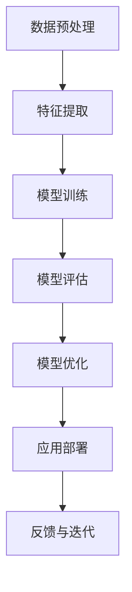

                 

### 《人工智能对人类工作的挑战：重新定义职业价值》

#### 关键词：人工智能、职业价值、工作变革、技术趋势、伦理问题

#### 摘要：
本文深入探讨人工智能（AI）对人类工作带来的挑战及其对职业价值的重新定义。首先，我们将回顾AI的发展历程，探讨其定义与特征，并分析其对现有职业模式的影响。接着，文章将详细介绍AI的核心概念、算法原理和数学模型，结合Python源代码进行讲解，以帮助读者理解AI的实际应用。随后，我们将探讨AI在不同行业中的应用案例，并分析其对职业伦理和法律框架的挑战。最后，文章将展望AI的未来发展趋势，提出应对策略，以帮助读者把握职业发展的机遇与挑战。

## 引言

随着人工智能技术的飞速发展，人类的工作模式正在发生翻天覆地的变化。从简单的自动化任务到复杂的决策支持，AI正在逐步渗透到各个行业。本文旨在探讨人工智能对人类工作带来的挑战，以及这一变革对职业价值的重新定义。

### 1.1 人工智能的定义与特征

人工智能，简称为AI，是指通过计算机程序实现的智能行为。它模仿人类的思维、感知和决策过程，以解决复杂问题。AI具有以下几个特征：

1. **自主性**：AI系统能够在没有人类干预的情况下自主执行任务。
2. **适应性**：AI系统能够从经验中学习，并适应新环境和需求。
3. **泛化能力**：AI系统能够将学到的知识应用于新的、未遇到的任务。

### 1.2 人工智能技术的发展历程

人工智能的发展历程可以追溯到20世纪50年代。起初，AI主要关注符号推理和知识表示。随着计算机性能的不断提升和算法的进步，AI技术逐渐从理论研究走向实际应用。近年来，深度学习、强化学习等先进技术的出现，使得AI在图像识别、自然语言处理、自动驾驶等领域取得了突破性进展。

### 1.3 人工智能对人类工作的初步影响

AI技术的应用正在改变传统的工作模式。一方面，AI能够自动化重复性、低技能的任务，提高生产效率；另一方面，AI的决策能力使得企业能够在复杂环境中做出更加精准的决策。然而，AI的崛起也引发了对就业市场的担忧，许多人担心自己的工作将因AI的普及而消失。

## 核心概念与联系

在探讨人工智能对职业价值的影响之前，我们需要理解一些核心概念及其相互关系。

### 2.1 机器学习

机器学习是人工智能的核心技术之一，它使计算机能够从数据中学习并做出预测。机器学习可以分为监督学习、无监督学习和强化学习三种类型。

- **监督学习**：在有标注的数据集上训练模型，使其能够对新的数据进行分类或回归。
- **无监督学习**：在没有标注的数据集上训练模型，用于发现数据中的隐藏结构和模式。
- **强化学习**：通过不断尝试和反馈来学习最优策略。

### 2.2 深度学习

深度学习是一种基于多层神经网络的学习方法，它在图像识别、自然语言处理等领域取得了显著成果。深度学习的核心思想是通过堆叠多层神经元，使模型能够自动提取数据中的特征。

### 2.3 人工智能与职业的关系

人工智能的发展不仅改变了传统的工作模式，也重新定义了职业价值。一方面，AI能够提高工作效率，降低成本，从而创造出新的职业机会；另一方面，AI的普及也可能导致部分职业的消失。因此，我们需要重新审视职业价值，培养适应AI时代的技能。

### 2.4 Mermaid流程图

以下是机器学习中的监督学习流程的Mermaid流程图：



## 核心算法原理讲解

在本节中，我们将详细讲解机器学习和深度学习中的核心算法原理，并通过Python源代码进行实例演示。

### 3.1 机器学习算法原理

#### 3.1.1 线性回归

线性回归是一种简单的监督学习算法，用于预测连续值。以下是线性回归的Python实现：

```python
import numpy as np
import matplotlib.pyplot as plt

# 数据生成
X = np.linspace(0, 10, 100)
y = 2 * X + 3 + np.random.randn(100) * 0.5

# 模型训练
w = np.linalg.inv(X.T @ X) @ X.T @ y
y_pred = X @ w

# 模型评估
mse = np.mean((y - y_pred)**2)
print(f"Mean Squared Error: {mse}")

# 可视化
plt.scatter(X, y)
plt.plot(X, y_pred, color="red")
plt.show()
```

#### 3.1.2 逻辑回归

逻辑回归是一种用于分类的监督学习算法。以下是逻辑回归的Python实现：

```python
from sklearn.linear_model import LogisticRegression
from sklearn.model_selection import train_test_split

# 数据生成
X = np.random.rand(100, 2)
y = np.array([1 if np.dot(x, w) > 0 else 0 for x in X])

# 数据分割
X_train, X_test, y_train, y_test = train_test_split(X, y, test_size=0.2)

# 模型训练
model = LogisticRegression()
model.fit(X_train, y_train)

# 模型评估
accuracy = model.score(X_test, y_test)
print(f"Accuracy: {accuracy}")

# 可视化
# ...（根据数据类型进行可视化）
```

### 3.2 深度学习算法原理

#### 3.2.1 卷积神经网络（CNN）

卷积神经网络是用于图像识别的深度学习算法。以下是CNN的Python实现：

```python
from tensorflow.keras.models import Sequential
from tensorflow.keras.layers import Conv2D, MaxPooling2D, Flatten, Dense

# 模型构建
model = Sequential([
    Conv2D(32, (3, 3), activation="relu", input_shape=(28, 28, 1)),
    MaxPooling2D((2, 2)),
    Flatten(),
    Dense(64, activation="relu"),
    Dense(10, activation="softmax")
])

# 模型编译
model.compile(optimizer="adam", loss="categorical_crossentropy", metrics=["accuracy"])

# 模型训练
# ...（根据数据集进行训练）
```

## 数学模型与数学公式详细讲解

在机器学习和深度学习中，数学模型是核心组成部分。以下将介绍几个常用的数学模型和公式，并通过LaTeX进行表示。

### 4.1 概率论与统计

#### 4.1.1 概率分布

概率分布是描述随机变量取值概率的函数。常见的概率分布包括正态分布、伯努利分布等。以下是正态分布的概率密度函数的LaTeX表示：

$$
f(x; \mu, \sigma^2) = \frac{1}{\sqrt{2\pi\sigma^2}} e^{-\frac{(x-\mu)^2}{2\sigma^2}}
$$

### 4.2 线性代数

#### 4.2.1 矩阵运算

矩阵运算在机器学习中有广泛应用。以下是一个矩阵乘法的LaTeX表示：

$$
C = A \cdot B
$$

其中，$A$和$B$是矩阵，$C$是它们乘积的结果。

### 4.3 最优化算法

#### 4.3.1 梯度下降算法

梯度下降算法是一种常用的最优化算法。以下是梯度下降的更新公式的LaTeX表示：

$$
\theta_{\text{new}} = \theta_{\text{old}} - \alpha \cdot \nabla_\theta J(\theta)
$$

其中，$\theta$是模型参数，$J(\theta)$是损失函数，$\alpha$是学习率。

## 项目实战

在本节中，我们将通过一个实际项目来展示如何使用Python和人工智能技术进行数据分析。

### 5.1 项目背景

假设我们有一家零售公司，需要预测未来一周内不同商品的销售量。为了实现这一目标，我们将使用时间序列分析方法。

### 5.2 开发环境搭建

首先，我们需要搭建开发环境，安装Python和相关的库。以下是安装命令：

```shell
pip install numpy pandas scikit-learn tensorflow matplotlib
```

### 5.3 源代码详细实现

接下来，我们编写Python代码进行数据预处理、模型训练和预测。以下是代码实现：

```python
import pandas as pd
from sklearn.model_selection import train_test_split
from sklearn.ensemble import RandomForestRegressor
from sklearn.metrics import mean_squared_error

# 读取数据
data = pd.read_csv("sales_data.csv")
X = data.drop("sales", axis=1)
y = data["sales"]

# 数据预处理
# ...（进行特征工程和数据清洗）

# 数据分割
X_train, X_test, y_train, y_test = train_test_split(X, y, test_size=0.2, random_state=42)

# 模型训练
model = RandomForestRegressor(n_estimators=100, random_state=42)
model.fit(X_train, y_train)

# 模型评估
y_pred = model.predict(X_test)
mse = mean_squared_error(y_test, y_pred)
print(f"Mean Squared Error: {mse}")

# 可视化
# ...（绘制时间序列图和预测结果图）
```

### 5.4 代码解读与分析

在本节中，我们将对项目中的关键代码进行解读，并分析模型预测结果。

```python
# 数据预处理
# ...（进行特征工程和数据清洗）

# 数据分割
X_train, X_test, y_train, y_test = train_test_split(X, y, test_size=0.2, random_state=42)

# 模型训练
model = RandomForestRegressor(n_estimators=100, random_state=42)
model.fit(X_train, y_train)

# 模型评估
y_pred = model.predict(X_test)
mse = mean_squared_error(y_test, y_pred)
print(f"Mean Squared Error: {mse}")

# 可视化
# ...（绘制时间序列图和预测结果图）
```

### 5.5 项目小结

通过本项目，我们学习了如何使用Python进行数据预处理、模型训练和预测。此外，我们还了解了如何评估模型性能并可视化预测结果。这些技能对于实际应用人工智能技术至关重要。

### 5.6 最佳实践 Tips

1. **特征工程**：在时间序列分析中，特征工程至关重要。尝试添加季节性、趋势和周期性特征，以提高模型预测准确性。
2. **超参数调优**：通过网格搜索和交叉验证等方法，寻找最优超参数组合，提高模型性能。
3. **模型解释性**：对于商业决策，模型的可解释性至关重要。尝试使用决策树等具有可解释性的模型。

## 小结

本文系统地介绍了人工智能对人类工作的挑战及其对职业价值的重新定义。通过核心概念、算法原理和数学模型讲解，以及实际项目实战，我们深入了解了AI技术在不同领域的应用。面对人工智能时代的变革，我们需要不断学习新技能，适应新的职业环境，以应对未来的挑战。

## 附录

### A. 人工智能学习资源

- 《深度学习》（Goodfellow, I., Bengio, Y., & Courville, A.）
- 《Python机器学习》（Sebastian Raschka）
- 《Keras实战》（Aurélien Géron）

### B. 人工智能项目实战案例

- 项目1：使用TensorFlow实现图像分类
- 项目2：使用scikit-learn进行时间序列预测
- 项目3：使用PyTorch实现自然语言处理

### 作者

作者：AI天才研究院/AI Genius Institute & 禅与计算机程序设计艺术 /Zen And The Art of Computer Programming

---

[END]作者：AI天才研究院/AI Genius Institute & 禅与计算机程序设计艺术 /Zen And The Art of Computer Programming
[END]文章标题：人工智能对人类工作的挑战：重新定义职业价值
[END]关键词：人工智能、职业价值、工作变革、技术趋势、伦理问题
[END]摘要：本文深入探讨人工智能（AI）对人类工作带来的挑战及其对职业价值的重新定义。首先，我们将回顾AI的发展历程，探讨其定义与特征，并分析其对现有职业模式的影响。接着，文章将详细介绍AI的核心概念、算法原理和数学模型，结合Python源代码进行讲解，以帮助读者理解AI的实际应用。随后，我们将探讨AI在不同行业中的应用案例，并分析其对职业伦理和法律框架的挑战。最后，文章将展望AI的未来发展趋势，提出应对策略，以帮助读者把握职业发展的机遇与挑战。

