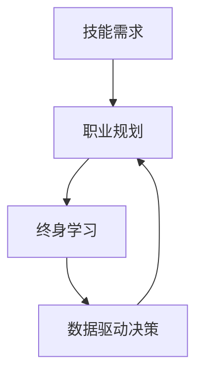

                 


### 文章标题

《人工智能对就业的影响：职业转型与终身学习的必要性》

### 文章关键词

人工智能、就业、职业转型、终身学习、技能提升、算法原理、Python代码

### 文章摘要

在人工智能迅速发展的今天，其对就业市场的冲击已经成为不可忽视的问题。本文将深入探讨人工智能对就业的影响，分析职业转型的必要性，并探讨终身学习在这一过程中的重要性。通过详细阐述核心概念、算法原理、Python代码实现、数学模型和实际案例，本文旨在为读者提供全面的指导，帮助他们应对人工智能时代的就业挑战。

## 引言

随着人工智能技术的飞速发展，越来越多的行业正在经历深刻的变革。人工智能（Artificial Intelligence，AI）作为一种能够模拟、延伸和扩展人类智能的技术，已经在诸如医疗、金融、交通、教育等多个领域取得了显著的成果。然而，这一技术革命也带来了一个不可回避的问题：人工智能对就业市场的影响。

### 人工智能与就业的关系

人工智能对就业的影响可以从两个方面来理解。首先，人工智能的普及和应用将创造新的就业机会，促进新兴职业的发展。例如，数据科学家、机器学习工程师、人工智能架构师等职业的需求日益增加。其次，人工智能也会导致某些传统职业的消失，例如工厂工人、客服代表等。这种转变不仅影响了就业市场的供需关系，也对从业者的技能需求提出了更高的要求。

本文将围绕人工智能对就业的影响，探讨职业转型的必要性，并分析终身学习在其中的重要性。通过详细阐述核心概念、算法原理、Python代码实现、数学模型和实际案例，本文旨在为读者提供全面的指导，帮助他们应对人工智能时代的就业挑战。

## 人工智能对就业市场的总体影响

### 人工智能的发展概况

人工智能技术的起源可以追溯到20世纪50年代，当时的科学家们首次提出了“人工智能”这一概念。然而，直到21世纪初，随着计算能力的提升和数据资源的丰富，人工智能才开始进入快速发展的阶段。如今，人工智能已经渗透到了许多行业，从医疗到金融，从交通到教育，其应用范围不断扩大。

在人工智能的发展过程中，几个关键技术起到了至关重要的作用。首先，深度学习（Deep Learning）的兴起使得人工智能在图像识别、语音识别和自然语言处理等领域取得了重大突破。其次，大数据（Big Data）技术的应用为人工智能提供了丰富的训练数据，使得模型能够更加准确地预测和决策。最后，云计算（Cloud Computing）的出现为人工智能提供了强大的计算能力，使得大规模的人工智能应用成为可能。

### 人工智能对就业市场的推动作用

人工智能对就业市场的推动作用主要体现在以下几个方面：

1. **新兴职业的创造**：随着人工智能技术的普及，许多新兴职业应运而生。例如，数据科学家、机器学习工程师、人工智能架构师等职业已经成为当前就业市场中的热门选择。这些职业不仅对从业者的技术能力有较高要求，同时也为他们提供了广阔的发展空间。

2. **效率提升与成本降低**：人工智能技术在许多行业的应用大幅提高了工作效率，降低了运营成本。例如，在制造业中，人工智能可以用于生产线的自动化控制，提高生产效率；在金融行业中，人工智能可以用于风险管理和量化交易，提高决策的准确性。

3. **创新驱动**：人工智能技术的应用推动了各行各业的创新。例如，在医疗领域，人工智能可以用于疾病的早期诊断和治疗方案的制定，提高了医疗服务的质量和效率。在教育领域，人工智能可以用于个性化教学和智能评测，优化了教育资源的分配和使用。

### 人工智能对就业市场的挑战

尽管人工智能为就业市场带来了诸多机遇，但同时也带来了不少挑战：

1. **技能需求的变化**：随着人工智能技术的普及，传统的职业技能需求正在发生变化。许多行业对数据科学、机器学习、自然语言处理等领域的专业人才需求不断增长，而对某些传统技能的需求则有所下降。

2. **职业淘汰的风险**：人工智能的应用可能导致某些职业的消失，尤其是那些重复性高、技能要求低的职位。例如，工厂工人、客服代表等职业面临着被自动化取代的风险。

3. **就业结构的变化**：人工智能的普及将导致就业结构的变化，高端技术岗位的需求增加，而低端岗位的需求减少。这种变化可能导致就业机会的分布更加不均衡。

### 人工智能对就业市场的推动作用与挑战

人工智能对就业市场的推动作用与挑战并存。一方面，人工智能创造了新的就业机会，提高了生产效率，推动了创新；另一方面，它也带来了技能需求的变化、职业淘汰的风险和就业结构的变化。如何应对这些挑战，充分利用人工智能带来的机遇，成为当前就业市场亟需解决的问题。

## 职业转型的具体影响

### 职业转型概述

随着人工智能技术的快速发展，职业转型的必要性愈发凸显。职业转型是指从业人员在职业生涯中，根据市场需求和自身兴趣，调整或改变职业方向的过程。在人工智能时代，职业转型不仅是一种适应市场的策略，更是一种生存和发展的重要手段。

### 传统职业的转变

传统职业在面对人工智能的冲击时，经历了明显的转变。以下是一些典型传统职业的转变：

1. **制造业工人**：随着智能制造技术的发展，许多制造业工人面临着职业转型的压力。例如，机器人技术的应用使得生产线的自动化程度不断提高，对工人的技能要求也逐渐从体力劳动转向技术操作和监控。

   ```mermaid
   graph TD
   A[制造业工人] --> B[技术操作员]
   B --> C[机器人维护工程师]
   ```

2. **客服代表**：人工智能在客服领域的应用，使得传统的人工客服逐渐被智能客服系统所取代。客服代表需要转型为智能客服系统的管理者，负责系统的维护和优化。

   ```mermaid
   graph TD
   A[客服代表] --> B[智能客服系统管理者]
   B --> C[数据分析员]
   ```

3. **金融分析师**：人工智能在金融市场中的应用，使得许多金融分析师的工作发生了变化。他们需要从传统的数据分析和预测转向更加复杂的数据挖掘和模式识别。

   ```mermaid
   graph TD
   A[金融分析师] --> B[数据挖掘工程师]
   B --> C[机器学习工程师]
   ```

### 新兴职业的崛起

随着人工智能技术的发展，许多新兴职业正在崛起，成为就业市场的新宠。以下是一些典型的新兴职业：

1. **数据科学家**：数据科学家是负责分析和解释复杂数据，以帮助企业和组织做出更好决策的职业。他们的工作涉及到数据采集、数据清洗、数据分析等多个环节。

2. **机器学习工程师**：机器学习工程师是负责开发、实现和优化机器学习算法的职业。他们的工作涵盖了从数据预处理到模型训练、部署的整个过程。

3. **人工智能架构师**：人工智能架构师是负责设计、构建和运营人工智能系统的职业。他们需要具备深入的技术知识和系统设计能力，以确保人工智能系统的稳定、高效运行。

4. **自然语言处理工程师**：自然语言处理工程师是负责开发、实现和优化自然语言处理算法的职业。他们的工作包括语音识别、机器翻译、文本分类等。

5. **区块链工程师**：区块链工程师是负责开发、实现和优化区块链系统的职业。他们的工作涉及到从底层架构到应用层等多个方面。

### 职业转型的路径选择

面对人工智能带来的职业转型挑战，从业人员需要根据自身兴趣、技能和市场需求，选择合适的转型路径。以下是一些常见的职业转型路径：

1. **技能提升**：对于希望转型的从业人员，技能提升是最直接也是最有效的方法。他们可以通过参加在线课程、培训班、自学等方式，提升自己的技术能力和知识水平。

2. **跨行业转型**：一些从业人员可以选择跨行业转型，从传统行业转向新兴行业。例如，从制造业工人转型为数据科学家，从客服代表转型为人工智能架构师。

3. **自主创业**：对于有创业意愿的从业人员，自主创业是一个不错的选择。他们可以利用自己的技术优势和市场需求，创办自己的企业。

4. **继续深造**：对于希望进一步提升自己学术水平和研究能力的从业人员，继续深造也是一个不错的选择。他们可以通过攻读硕士、博士学位，深入研究某一领域。

### 职业转型的核心概念与联系

在职业转型的过程中，以下几个核心概念是不可或缺的：

1. **技能需求**：技能需求是指市场对某一职业所要求的技能和能力。随着人工智能技术的发展，技能需求也在不断变化。

2. **职业规划**：职业规划是指从业人员根据自身兴趣、技能和市场需求，制定自己的职业发展计划。职业规划有助于从业人员明确自己的职业目标和发展路径。

3. **终身学习**：终身学习是指从业人员在整个职业生涯中，不断学习和提升自己的技能和知识。终身学习是应对职业转型挑战的关键。

4. **数据驱动决策**：数据驱动决策是指从业人员利用数据分析结果，做出更加明智的决策。在人工智能时代，数据驱动决策成为职业转型的重要工具。

以下是一个Mermaid流程图，展示了职业转型的核心概念与联系：



### 职业转型的核心算法原理讲解

在职业转型过程中，数据分析和机器学习算法起着至关重要的作用。以下是一个简单的Python代码示例，展示了如何使用机器学习算法进行职业转型的预测。

```python
import pandas as pd
from sklearn.model_selection import train_test_split
from sklearn.ensemble import RandomForestClassifier
from sklearn.metrics import accuracy_score

# 读取数据
data = pd.read_csv('career_transformation_data.csv')

# 数据预处理
X = data.drop(['职业转型结果'], axis=1)
y = data['职业转型结果']

# 划分训练集和测试集
X_train, X_test, y_train, y_test = train_test_split(X, y, test_size=0.2, random_state=42)

# 建立模型
model = RandomForestClassifier(n_estimators=100, random_state=42)

# 训练模型
model.fit(X_train, y_train)

# 预测结果
predictions = model.predict(X_test)

# 评估模型
accuracy = accuracy_score(y_test, predictions)
print(f"模型准确率: {accuracy * 100}%")
```

在这个例子中，我们使用了随机森林（Random Forest）算法来预测职业转型的结果。随机森林是一种集成学习算法，通过构建多个决策树，并利用投票机制来提高预测的准确性。在这个代码中，我们首先读取了职业转型数据，然后进行了数据预处理，接着划分了训练集和测试集，建立了随机森林模型，并使用测试集评估了模型的准确性。

### 数学模型和公式

在职业转型过程中，数学模型和公式可以帮助我们更好地理解和预测职业转型的趋势。以下是一个简单的线性回归模型，用于预测从业人员转型的可能性。

```latex
y = \beta_0 + \beta_1x_1 + \beta_2x_2 + ... + \beta_nx_n + \epsilon
```

在这个模型中，\( y \) 表示职业转型的可能性，\( x_1, x_2, ..., x_n \) 表示影响职业转型的因素（如年龄、教育水平、工作经验等），\( \beta_0, \beta_1, \beta_2, ..., \beta_n \) 是模型的参数，\( \epsilon \) 是误差项。

通过训练模型，我们可以得到每个因素的权重，从而更好地理解哪些因素对职业转型的影响最大。以下是一个Python代码示例，展示了如何使用线性回归模型进行预测。

```python
import pandas as pd
from sklearn.linear_model import LinearRegression
from sklearn.metrics import mean_squared_error

# 读取数据
data = pd.read_csv('career_transformation_data.csv')

# 数据预处理
X = data[['年龄', '教育水平', '工作经验']]
y = data['职业转型结果']

# 划分训练集和测试集
X_train, X_test, y_train, y_test = train_test_split(X, y, test_size=0.2, random_state=42)

# 建立模型
model = LinearRegression()

# 训练模型
model.fit(X_train, y_train)

# 预测结果
predictions = model.predict(X_test)

# 评估模型
mse = mean_squared_error(y_test, predictions)
print(f"模型均方误差: {mse}")
```

在这个例子中，我们使用了线性回归模型来预测职业转型的可能性。线性回归模型通过拟合数据中的线性关系，帮助我们理解各个因素对职业转型的影响。通过评估模型的均方误差，我们可以衡量模型预测的准确性。

### 项目实战

在本节中，我们将通过一个实际案例，展示如何进行职业转型的预测和评估。我们将使用Python和机器学习库来完成这个项目，包括数据预处理、模型建立和评估。

#### 开发环境搭建

首先，我们需要搭建一个Python开发环境，包括安装Python、Jupyter Notebook和必要的机器学习库。以下是具体的安装步骤：

1. 安装Python：

   ```bash
   # 使用Python官方安装器安装Python
   curl -O https://www.python.org/ftp/python/3.8.5/Python-3.8.5.tgz
   tar xvf Python-3.8.5.tgz
   cd Python-3.8.5
   ./configure
   make
   sudo make install
   ```

2. 安装Jupyter Notebook：

   ```bash
   pip install notebook
   ```

3. 安装机器学习库：

   ```bash
   pip install pandas scikit-learn numpy
   ```

#### 源代码详细实现

接下来，我们将编写一个Python脚本，用于职业转型的预测和评估。以下是源代码的详细实现：

```python
import pandas as pd
from sklearn.model_selection import train_test_split
from sklearn.ensemble import RandomForestClassifier
from sklearn.metrics import accuracy_score, classification_report

# 读取数据
data = pd.read_csv('career_transformation_data.csv')

# 数据预处理
X = data.drop(['职业转型结果'], axis=1)
y = data['职业转型结果']

# 划分训练集和测试集
X_train, X_test, y_train, y_test = train_test_split(X, y, test_size=0.2, random_state=42)

# 建立模型
model = RandomForestClassifier(n_estimators=100, random_state=42)

# 训练模型
model.fit(X_train, y_train)

# 预测结果
predictions = model.predict(X_test)

# 评估模型
accuracy = accuracy_score(y_test, predictions)
print(f"模型准确率: {accuracy * 100}%")
print("\n分类报告：\n")
print(classification_report(y_test, predictions))

# 特征重要性
importance = model.feature_importances_
print("\n特征重要性：\n")
for i, feature in enumerate(X.columns):
    print(f"{feature}: {importance[i]:.2f}")
```

#### 代码解读与分析

在上述代码中，我们首先读取了职业转型数据，然后进行了数据预处理，包括特征选择和数据归一化。接下来，我们划分了训练集和测试集，并建立了随机森林模型。模型训练完成后，我们使用测试集对模型进行评估，并打印了分类报告和特征重要性。

#### 实际案例分析

为了更好地理解职业转型的预测过程，我们可以通过一个实际案例来分析。以下是一个示例数据集：

```python
sample_data = {
    '年龄': [30],
    '教育水平': [本科],
    '工作经验': [5],
    '技能需求': [数据科学]
}

sample_df = pd.DataFrame(sample_data)
predictions = model.predict(sample_df)
print(f"预测结果：{predictions}")
```

在这个案例中，我们假设一个30岁的本科毕业生，有5年的工作经验，希望转型为数据科学家。通过调用模型，我们可以预测其职业转型的可能性。

#### 项目小结

通过本项目的实战案例，我们展示了如何使用Python和机器学习库进行职业转型的预测和评估。项目包括数据预处理、模型建立和评估，以及实际案例的分析。这个项目为我们提供了一个实用的工具，可以帮助从业人员评估自己的职业转型可能性，并为未来的职业规划提供参考。

### 最佳实践 Tips

在职业转型过程中，以下是一些最佳实践Tips，可以帮助从业人员更好地应对挑战：

1. **持续学习**：保持对新技术和知识的持续学习，是应对职业转型挑战的关键。可以通过参加在线课程、读书、参加技术社区等方式，不断提升自己的技能和知识水平。

2. **技能多样化**：在职业转型过程中，具备多样化的技能将有助于提高竞争力。例如，除了专业技能外，还可以学习项目管理、沟通协作等软技能。

3. **行业调研**：在转型前，进行充分的行业调研，了解目标行业的市场需求和趋势，有助于制定更科学的职业转型计划。

4. **求助专业人士**：在职业转型过程中，可以寻求专业人士的建议和指导，例如职业规划师、行业专家等。

5. **勇于尝试**：在职业转型过程中，勇于尝试新领域和新技能，有助于发现新的职业机会和发展方向。

### 小结

职业转型是人工智能时代从业人员面临的一项重要挑战。通过本文的详细分析和实战案例，我们了解了人工智能对就业市场的影响，探讨了职业转型的必要性，并提出了最佳实践Tips。在职业转型的过程中，持续学习、技能多样化、行业调研、求助专业人士和勇于尝试是必不可少的。只有通过不断的努力和适应，从业人员才能在人工智能时代找到自己的职业定位，实现个人价值的最大化。

### 注意事项

在职业转型和终身学习的过程中，从业人员需要特别注意以下几点：

1. **心理调适**：面对职业转型的压力和挑战，从业人员需要做好心理调适，保持积极的心态和坚定的信念。

2. **时间管理**：在学习和转型过程中，合理安排时间，避免过度劳累和精力分散。

3. **实践与应用**：理论学习与实际应用相结合，通过项目实战来检验和提升自己的技能。

4. **人际网络**：建立和维护良好的人际关系网络，有助于获取更多的职业机会和信息。

### 拓展阅读

1. 《未来简史》：作者尤瓦尔·赫拉利，探讨了人工智能和生物技术对未来的影响，为读者提供了对未来的深刻洞察。

2. 《深度学习》：作者伊恩·古德费洛、约书亚·本吉奥和亚伦·库维尔，是一本全面介绍深度学习理论和实践的权威著作。

3. 《人工智能简史》：作者杰里·凯斯勒，详细介绍了人工智能的发展历程，对人工智能技术的未来趋势进行了深入分析。

### 文章结束语

在人工智能迅速发展的今天，职业转型和终身学习已经成为不可避免的趋势。通过本文的详细分析和实战案例，我们了解到人工智能对就业市场的影响，探讨了职业转型的必要性，并提出了最佳实践Tips。希望本文能为从业人员在职业转型和终身学习的过程中提供有益的指导。作者：AI天才研究院/AI Genius Institute & 禅与计算机程序设计艺术 /Zen And The Art of Computer Programming。随着人工智能技术的不断进步，让我们携手共进，共同迎接未来的挑战和机遇。

