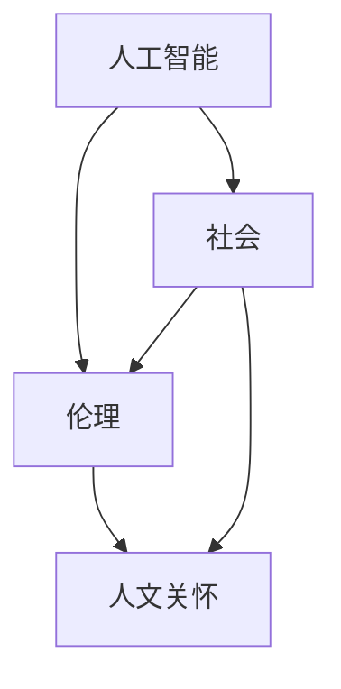

                 

----------------------------------------------------------------

# 人工智能时代的人文关怀：技术进步中的伦理守护

> 关键词：人工智能、伦理、人文关怀、技术进步、伦理审查

> 摘要：本文探讨了人工智能时代的人文关怀问题，分析了技术进步中伦理守护的重要性，阐述了人工智能伦理原则和框架，并通过案例分析，提出了数据隐私与安全、人机交互与算法偏见、人工智能对就业影响等问题的应对策略，最终提出了伦理守护的实践路径和未来展望。

----------------------------------------------------------------

# 目录大纲

## 第一部分：引言与核心概念

### 1.1 人工智能时代的背景与挑战

- 人工智能的发展历程
- 人工智能技术的主要突破
- 人工智能时代带来的机遇与挑战

### 1.2 人文关怀的概念解析

- 人文关怀的定义
- 人文关怀的基本原则
- 人文关怀在人工智能领域的应用意义

### 1.3 技术进步中的伦理守护

- 技术进步与伦理问题的关系
- 伦理守护的重要性
- 伦理守护的基本原则与实践路径

## 第二部分：伦理守护的理论与实践

### 2.1 核心概念与联系

- Mermaid 流程图展示人工智能、伦理、人文关怀之间的关系

### 2.2 伦理原则与伦理框架

- 国际伦理框架对比分析
- 技术伦理原则的内涵与应用

### 2.3 技术伦理案例分析

- 典型案例介绍
- 案例分析与讨论

## 第三部分：人工智能伦理问题及其应对策略

### 3.1 数据隐私与安全

- 数据隐私保护的重要性
- 人工智能系统中的数据安全问题及对策

### 3.2 人机交互与算法偏见

- 人机交互的伦理问题
- 算法偏见的原因与缓解方法

### 3.3 人工智能对就业的影响

- 自动化与失业的关系
- 对未来就业市场的伦理思考

## 第四部分：伦理守护的实践路径

### 4.1 伦理审查机制的设计与实施

- 伦理审查机制的基本原则
- 伦理审查机制的运作流程

### 4.2 教育与培训

- 人工智能伦理教育的重要性
- 伦理意识培养的方法与路径

### 4.3 法律法规与政策引导

- 人工智能伦理立法的现状与趋势
- 政府在伦理守护中的作用

## 第五部分：未来展望与挑战

### 5.1 人工智能伦理的可持续发展

- 人工智能伦理的长期目标
- 可持续发展的路径与策略

### 5.2 伦理守护中的国际合作

- 国际合作的重要性
- 伦理守护的国际经验与启示

### 5.3 未来人工智能伦理的挑战

- 新兴技术带来的伦理问题
- 面向未来的伦理思考与应对

## 附录

### 5.1 相关政策法规汇编

- 国内人工智能伦理法规
- 国际人工智能伦理法规

### 5.2 参考文献

- 引用的相关书籍、论文、报告等

----------------------------------------------------------------

## 第一部分：引言与核心概念

### 1.1 人工智能时代的背景与挑战

随着大数据、云计算、物联网等技术的迅速发展，人工智能（Artificial Intelligence，简称AI）已经从理论研究阶段迈向了实际应用阶段。从最早的机器学习算法到深度学习、强化学习等先进技术的应用，人工智能在图像识别、语音识别、自然语言处理等领域取得了显著的成果。如今，人工智能已经深入到我们的日常生活和工作中，如智能助手、自动驾驶、医疗诊断等。

然而，人工智能的快速发展也带来了诸多挑战和伦理问题。首先，人工智能在数据处理和决策过程中可能涉及隐私和数据安全问题。其次，人工智能算法的偏见和歧视问题也日益引起关注。此外，人工智能对就业市场的影响也是一个不容忽视的挑战。自动化和智能化技术的广泛应用可能导致某些行业和职位的失业风险。

面对这些挑战，如何在技术进步中守护伦理，保持人文关怀，成为了一个亟待解决的问题。本文将从人工智能时代的背景与挑战、人文关怀的概念解析、技术进步中的伦理守护等多个方面展开讨论，以期对人工智能伦理问题提供一些有益的思考和应对策略。

### 1.2 人文关怀的概念解析

人文关怀（Humanistic Concern）是指一种关注人的全面发展、尊重人的价值和尊严的理念。它强调在技术应用过程中，不仅要追求技术的创新和进步，还要充分考虑技术对人类生活、社会伦理的影响，保障人的基本权利和利益。

人文关怀的基本原则包括：

1. 尊重个人权利与尊严：在人工智能技术的应用中，尊重个人的隐私权、知情权、选择权等基本权利，保障个人尊严不受侵害。
2. 保障社会公平与正义：人工智能技术的发展应促进社会的公平与正义，避免因技术而导致的贫富差距、社会不公等问题。
3. 强调道德伦理：在人工智能技术的研发和应用过程中，要遵循道德伦理原则，确保技术的正向发展，避免对人类造成负面影响。

在人工智能领域，人文关怀的应用意义主要体现在以下几个方面：

1. 技术伦理的引导：人文关怀为人工智能技术的发展提供了伦理指导，帮助研发者、应用者在技术设计和应用过程中考虑伦理问题，避免出现道德风险。
2. 人类价值的守护：人文关怀关注人的全面发展，强调技术在满足人类需求、提高生活质量方面的作用，避免技术异化对人类造成伤害。
3. 社会和谐的促进：人文关怀倡导技术与社会、人与自然的和谐发展，有助于构建一个公平、正义、可持续的社会环境。

### 1.3 技术进步中的伦理守护

技术进步对人类社会的影响深远，而伦理守护则是确保技术正向发展的关键。在人工智能时代，伦理守护显得尤为重要。以下将从技术进步与伦理问题的关系、伦理守护的重要性以及伦理守护的基本原则与实践路径三个方面进行探讨。

#### 技术进步与伦理问题的关系

技术进步往往伴随着伦理问题的出现。一方面，技术的创新和应用在改变人们生活方式的同时，也可能带来新的伦理挑战。例如，人工智能技术的发展使得大数据和算法决策变得普遍，但这也引发了数据隐私、算法偏见等问题。另一方面，技术进步也可能加剧现有伦理问题的复杂性和严重性。例如，人工智能在医疗领域的应用虽然提高了诊断和治疗的效率，但也可能导致医疗资源分配不均，加剧社会不公。

#### 伦理守护的重要性

伦理守护在技术进步中具有重要意义。首先，伦理守护有助于确保技术发展的正当性和合法性。在人工智能领域，遵守伦理规范可以避免技术研发和应用过程中出现法律纠纷和道德风险。其次，伦理守护有助于促进技术的可持续发展。通过关注技术对人类生活、社会环境的影响，研发者可以更好地设计出符合人类价值观的技术产品。最后，伦理守护有助于构建一个公平、正义、可持续的社会。在人工智能时代，伦理守护有助于实现技术与社会、人与自然的和谐发展。

#### 伦理守护的基本原则与实践路径

伦理守护的基本原则主要包括：

1. 尊重个人权利与尊严：在技术应用过程中，尊重个人的隐私权、知情权、选择权等基本权利，保障个人尊严不受侵害。
2. 保障社会公平与正义：技术发展应促进社会的公平与正义，避免因技术而导致的贫富差距、社会不公等问题。
3. 强调道德伦理：在技术研发和应用过程中，要遵循道德伦理原则，确保技术的正向发展，避免对人类造成负面影响。

伦理守护的实践路径包括：

1. 建立伦理审查机制：通过设立专门的伦理审查委员会，对技术研发和应用进行伦理评估，确保技术符合伦理规范。
2. 开展伦理教育：加强对技术研发者、应用者的伦理教育，提高他们的伦理意识和道德素质，促使他们在技术设计和应用过程中自觉遵守伦理规范。
3. 加强法律法规建设：通过完善相关法律法规，规范技术研发和应用行为，确保技术发展在法治轨道上运行。
4. 促进国际合作：加强国际间的伦理交流与合作，借鉴各国在伦理守护方面的经验和做法，共同应对人工智能等新兴技术的伦理挑战。

综上所述，技术进步中的伦理守护是确保人工智能等新兴技术正向发展的重要保障。通过遵循伦理守护的基本原则和实践路径，我们可以更好地应对人工智能时代的伦理挑战，实现技术与人、社会、自然的和谐发展。接下来，本文将深入探讨人工智能伦理守护的理论与实践，以期为相关领域提供有益的参考。

## 第二部分：伦理守护的理论与实践

### 2.1 核心概念与联系

在探讨人工智能伦理守护的理论与实践之前，有必要先明确几个核心概念及其相互关系。以下是使用Mermaid绘制的流程图，展示人工智能、伦理、人文关怀之间的关系：

从流程图中可以看出，人工智能（AI）作为技术核心，其发展与伦理（E）和人文关怀（HC）密切相关。伦理不仅是人工智能技术的内在规范，也是其社会应用的基础；而人文关怀则为人工智能的发展提供了价值导向，确保技术进步符合人类的整体利益。此外，社会（S）作为人工智能应用的场景，既受到伦理和人文关怀的影响，也是两者共同作用的对象。

#### 人工智能与伦理的关系

人工智能技术的快速进步，使得算法、数据、模型等成为影响人类生活的重要要素。伦理在这里扮演着双重角色：

1. **规范角色**：伦理规范为人工智能技术提供了行为准则，确保其在研发和应用过程中不违背道德底线，如保护个人隐私、避免算法偏见等。
2. **指导角色**：伦理观念引导技术研发方向，促使人工智能技术朝着符合社会需求和价值的目标发展，例如在医疗、教育等领域的应用。

#### 人文关怀与人工智能的关系

人文关怀关注的是技术对人类生活质量的提升和道德价值的实现。在人工智能领域，人文关怀体现在以下几个方面：

1. **价值导向**：人文关怀为人工智能技术的发展提供了价值框架，使其不仅追求技术创新，更关注人的尊严、权利和福祉。
2. **伦理监督**：人文关怀通过伦理审视，监督人工智能技术的应用，防止技术异化，确保其在为社会带来便利的同时，不损害人类的基本权益。

#### 社会与人工智能、伦理、人文关怀的关系

社会是人工智能技术应用的最终场景，也是伦理和人文关怀的实践平台。社会对人工智能技术的接受程度、规范要求和文化导向，直接影响到伦理和人文关怀的实现效果。因此，在人工智能时代，社会应积极扮演以下角色：

1. **引导角色**：社会通过政策法规引导人工智能技术发展，使其符合伦理和人文关怀的要求。
2. **反馈角色**：社会对人工智能技术的反馈，为伦理和人文关怀的调整提供了依据，促使技术不断优化和进步。
3. **协调角色**：社会在技术进步和伦理守护之间寻求平衡，确保技术发展既能满足人类需求，又能维护社会稳定和公平。

### 2.2 伦理原则与伦理框架

在人工智能伦理守护的理论建设中，确立伦理原则和框架是关键。以下将介绍一些国际通用的伦理原则，并分析其内涵与应用。

#### 国际通用伦理原则

1. **尊重个人隐私**：确保个人隐私得到保护，不允许未经授权的数据收集和利用。
2. **公正与公平**：确保人工智能系统的决策过程和结果公平公正，避免算法偏见和歧视。
3. **透明与可解释性**：提高人工智能系统的透明度，使其决策过程可被理解和解释。
4. **责任与问责**：明确人工智能系统的责任归属，确保在出现问题时能够追溯和问责。
5. **可持续性**：促进人工智能技术的可持续发展，关注其对环境和社会的长远影响。

#### 伦理框架的内涵与应用

1. **欧洲伦理指南**：欧洲委员会发布的《人工智能伦理指南》提出了五大核心原则，包括尊重人权、民主与透明度、可持续性、公平性、保障人类安全等。该框架为人工智能技术的伦理审查提供了具体的操作指南，被广泛引用和遵循。

2. **美国国家人工智能战略**：美国政府发布的《国家人工智能战略》强调了伦理和人文关怀在人工智能发展中的重要性，提出了确保透明度、公平性、责任性和隐私保护的措施，为人工智能的伦理监管提供了政策支持。

3. **中国人工智能伦理框架**：中国科技部发布的《新一代人工智能治理原则——发展负责任的人工智能》提出了六个方面原则，包括和谐共生、公平公正、安全可控、包容共享、创新驱动和合作共赢。这些原则为我国人工智能伦理治理提供了理论依据和实践指导。

#### 伦理原则的应用案例

1. **算法透明化**：在金融、医疗等领域的应用中，确保算法透明化，使其决策过程能够被监管和审查，防止算法偏见和歧视。

2. **隐私保护**：在个人数据收集和使用过程中，严格遵守隐私保护法规，对用户数据进行加密存储和处理，防止数据泄露和滥用。

3. **责任追究**：明确人工智能系统的责任归属，建立责任追究机制，确保在出现技术失误或伦理问题时，能够及时纠正和解决。

4. **社会影响评估**：在人工智能技术应用前，进行社会影响评估，分析其对就业、教育、医疗等领域的影响，制定相应的应对措施。

通过伦理原则与框架的应用，可以有效地指导人工智能技术的研发和应用，确保其发展符合伦理和人文关怀的要求。在接下来的部分，本文将结合具体案例，进一步探讨人工智能伦理问题的应对策略。

### 2.3 技术伦理案例分析

在探讨人工智能伦理问题时，案例分析是一种有效的途径，可以帮助我们理解伦理原则在具体应用中的挑战和解决方案。以下将介绍几个具有代表性的国际人工智能伦理案例，并结合中国的人工智能伦理实践，进行深入分析和讨论。

#### 案例一：欧洲伦理指南案例

**案例背景**：欧洲委员会发布的《人工智能伦理指南》提供了一个全面的伦理框架，旨在指导人工智能的应用和发展。该指南提出的五大核心原则包括尊重人权、民主与透明度、可持续性、公平性和保障人类安全。

**案例分析**：在一个涉及自动驾驶车辆的案例中，一个配备了高级人工智能系统的车辆在复杂的城市交通环境中发生了事故，导致多名行人受伤。此案例引发了关于责任归属、隐私保护和技术透明性的讨论。根据《人工智能伦理指南》，该案例中需要考虑以下几个方面：

1. **责任归属**：明确责任主体，包括车辆制造商、软件开发商和最终用户。指南建议建立明确的责任追究机制，确保在发生事故时，各方能够承担相应的责任。

2. **隐私保护**：自动驾驶车辆需要收集大量的环境数据，包括行人和车辆的位置、速度等信息。指南强调必须确保这些数据在收集、存储和处理过程中得到充分保护，防止隐私泄露。

3. **技术透明度**：指南要求提高自动驾驶系统的透明度，使其决策过程能够被监管和理解。这包括公开算法设计、数据来源和决策机制，以便外部评估和审查。

**案例启示**：该案例表明，尽管伦理指南为人工智能的应用提供了指导，但在实际操作中仍面临诸多挑战。需要进一步完善法律法规，确保伦理原则能够得到有效执行。

#### 案例二：美国国家人工智能战略案例

**案例背景**：美国政府的《国家人工智能战略》强调了伦理和人文关怀在人工智能发展中的重要性。该战略提出了确保透明度、公平性、责任性和隐私保护的措施。

**案例分析**：在一个涉及医疗诊断人工智能系统的案例中，一个基于深度学习的诊断系统被用于辅助医生进行疾病诊断。然而，该系统在某些特定情况下表现不佳，导致误诊。此案例引发了关于算法偏见、数据质量和责任归属的讨论。

1. **算法偏见**：指南建议在算法开发过程中，充分考虑数据集的多样性和代表性，避免因数据偏差导致的算法偏见。

2. **数据质量**：指南要求在数据收集和处理过程中，确保数据的准确性和完整性，以便算法能够做出更可靠的决策。

3. **责任归属**：指南建议明确算法开发者和使用者的责任，确保在出现误诊等情况下，各方能够承担相应的责任。

**案例启示**：该案例表明，尽管技术进步为医疗诊断带来了巨大潜力，但伦理问题依然存在。需要加强伦理审查，确保技术发展符合道德标准，保障患者权益。

#### 中国人工智能伦理实践探索

**案例背景**：中国科技部发布的《新一代人工智能治理原则——发展负责任的人工智能》提出了六个方面的原则，包括和谐共生、公平公正、安全可控、包容共享、创新驱动和合作共赢。

**案例分析**：在中国，人工智能伦理实践主要体现在以下几个方面：

1. **伦理审查**：中国科技部设立了人工智能伦理审查委员会，对人工智能项目进行伦理评估，确保项目符合伦理原则。

2. **隐私保护**：《个人信息保护法》为个人隐私保护提供了法律依据，要求在数据收集、存储和使用过程中严格遵守隐私保护规定。

3. **责任追究**：中国正在建立人工智能责任追究机制，明确算法开发者和使用者的责任，确保在出现问题时能够及时纠正。

**案例启示**：中国的人工智能伦理实践表明，通过政策法规、伦理审查和责任追究等手段，可以有效应对人工智能伦理挑战。

通过上述案例分析，可以看出，尽管各国在人工智能伦理实践方面存在差异，但伦理原则的指导作用是共通的。在未来的发展中，需要进一步加强国际合作，借鉴各国经验，共同应对人工智能伦理挑战。

## 第三部分：人工智能伦理问题及其应对策略

### 3.1 数据隐私与安全

数据隐私与安全是人工智能伦理的核心问题之一。在人工智能技术的应用过程中，大量的个人数据被收集、存储和处理，这些数据包括但不限于个人身份信息、行为记录、生物特征等。因此，确保数据隐私与安全至关重要。

#### 数据隐私保护的重要性

数据隐私保护的重要性体现在以下几个方面：

1. **个人权利保障**：个人隐私权是基本人权之一，保护个人隐私有助于维护个人尊严和自由。
2. **社会稳定与和谐**：未经授权的数据收集和使用可能导致社会不信任，影响社会稳定。
3. **商业竞争与市场秩序**：数据泄露可能导致商业秘密泄露，破坏市场竞争秩序。

#### 人工智能系统中的数据安全问题及对策

在人工智能系统中，数据安全面临以下问题：

1. **数据泄露**：未经授权的访问可能导致数据泄露，造成严重后果。
2. **数据滥用**：数据在收集、存储和处理过程中可能被滥用，用于不正当目的。
3. **数据完整性**：数据在传输和存储过程中可能被篡改，影响系统的准确性。

针对上述问题，可以采取以下对策：

1. **数据加密**：对敏感数据进行加密处理，防止未经授权的访问。
2. **访问控制**：实施严格的访问控制机制，确保只有授权人员才能访问特定数据。
3. **数据脱敏**：对敏感数据进行脱敏处理，降低数据泄露风险。
4. **安全审计**：定期进行安全审计，发现并修复潜在的安全漏洞。
5. **法律法规**：完善相关法律法规，明确数据隐私保护的要求和责任。

### 3.2 人机交互与算法偏见

人机交互是人工智能技术应用的重要组成部分，但同时也带来了伦理问题。算法偏见是其中一个关键问题，它指的是人工智能系统在决策过程中表现出对某些群体或特征的不公平倾向。

#### 人机交互的伦理问题

人机交互中的伦理问题主要包括：

1. **用户隐私**：在交互过程中，系统可能收集用户的个人信息，需要确保这些数据得到保护。
2. **用户体验**：系统设计应充分考虑用户体验，避免因设计缺陷导致用户受到伤害。
3. **透明度与可解释性**：系统决策过程应具备透明度和可解释性，使用户能够理解和信任系统。

#### 算法偏见的原因与缓解方法

算法偏见的原因主要包括：

1. **数据偏差**：训练数据集的不均衡可能导致算法在特定群体上的表现不佳。
2. **模型缺陷**：算法模型设计不合理，可能导致某些特征被过度强调或忽视。
3. **社会偏见**：人类社会存在的偏见可能被算法放大，导致系统表现出偏见。

缓解算法偏见的方法包括：

1. **数据多样性**：确保训练数据集的多样性，避免因数据偏差导致的算法偏见。
2. **模型优化**：设计合理的算法模型，减少对特定特征的过度依赖，提高模型的公平性。
3. **伦理审查**：对算法进行伦理审查，确保其设计和应用符合道德原则。
4. **透明度与解释性**：提高算法的透明度和解释性，使决策过程更容易被监督和纠正。

### 3.3 人工智能对就业的影响

人工智能技术的发展对就业市场产生了深远影响。一方面，人工智能提高了生产效率，推动了产业升级和经济增长；另一方面，自动化和智能化技术的广泛应用可能导致某些行业和职位的失业风险。

#### 自动化与失业的关系

自动化与失业的关系可以从以下几个方面进行分析：

1. **替代效应**：自动化技术可以替代部分劳动力，导致某些行业和职位的需求减少。
2. **创造效应**：自动化技术也创造了新的就业机会，但可能需要不同技能的劳动力。
3. **结构调整**：就业市场的变化可能引发行业和职位的调整，需要劳动力进行技能转换。

#### 对未来就业市场的伦理思考

在面对人工智能对就业市场的影响时，需要从伦理角度进行思考：

1. **公平就业**：确保人工智能技术的应用不会加剧社会不平等，避免对特定群体造成更大的失业风险。
2. **技能培训**：政府和企业应加大对劳动力的技能培训投入，帮助失业者重新就业。
3. **社会责任**：企业和政府应承担起社会责任，确保技术发展对劳动力市场产生积极影响。
4. **就业保障**：完善就业保障体系，为失业者提供必要的支持和援助。

通过上述分析，可以看出，人工智能伦理问题涉及多个方面，需要综合应对。在技术进步的过程中，我们既要充分发挥人工智能的优势，又要积极解决其带来的伦理挑战，确保技术发展符合人类价值观和社会需求。

## 第四部分：伦理守护的实践路径

### 4.1 伦理审查机制的设计与实施

伦理审查机制是确保人工智能技术发展符合伦理要求的重要手段。其设计与实施涉及多个环节，以下将从基本原则、运作流程和评估方法三个方面进行详细探讨。

#### 基本原则

伦理审查机制的基本原则包括：

1. **尊重个人权利**：确保个人隐私和数据安全，尊重个人的知情权和选择权。
2. **公平公正**：确保审查过程的透明度和公正性，避免因个人利益或偏见影响审查结果。
3. **社会责任**：关注技术对社会的长期影响，确保人工智能技术的应用符合社会需求和价值。
4. **持续改进**：定期评估审查机制的效果，及时调整和完善，以应对新兴技术的挑战。

#### 运作流程

伦理审查机制的运作流程通常包括以下几个步骤：

1. **项目申请**：项目团队提交伦理审查申请，包括项目概述、技术方案、预期影响等内容。
2. **初步审查**：伦理审查委员会对申请材料进行初步审查，确定项目是否符合审查范围和伦理原则。
3. **深入审查**：伦理审查委员会对项目进行深入审查，包括技术可行性、数据隐私、公平公正等方面。
4. **公开讨论**：在必要时，伦理审查委员会组织公开讨论，邀请利益相关方参与，以确保审查过程的透明度和公正性。
5. **审查决定**：伦理审查委员会根据审查结果，作出批准、修改或否决的决定。
6. **持续监督**：在项目实施过程中，伦理审查委员会进行定期监督，确保项目符合伦理要求。

#### 评估方法

伦理审查机制的评估方法主要包括：

1. **定性评估**：通过专家访谈、案例分析等方式，对伦理审查机制的效果进行定性评估。
2. **定量评估**：通过数据分析和绩效指标，对伦理审查机制的运行效果进行定量评估。
3. **比较评估**：与国内外同类审查机制进行比较，找出优势与不足，为改进提供参考。
4. **利益相关方反馈**：收集利益相关方的反馈意见，了解伦理审查机制在实际应用中的效果和问题。

通过设计科学合理的伦理审查机制，并不断完善和优化，可以确保人工智能技术的发展在伦理框架内进行，为社会带来更多福祉。

### 4.2 教育与培训

人工智能伦理的教育与培训是培养具备伦理意识和道德素质的专业人才的重要途径。随着人工智能技术的迅速发展，伦理问题日益突出，因此，加强人工智能伦理教育和培训具有重要意义。

#### 人工智能伦理教育的重要性

1. **提升专业素养**：通过伦理教育，使人工智能领域的研究者、开发者和应用者具备扎实的伦理理论基础和实际操作能力，能够更好地应对技术挑战。
2. **引导技术创新**：伦理教育有助于引导人工智能技术的研发方向，确保技术发展符合道德标准，减少潜在的伦理风险。
3. **增强社会信任**：伦理教育有助于提升公众对人工智能技术的信任度，降低技术争议，促进技术与社会和谐发展。

#### 伦理意识培养的方法与路径

1. **课程设置**：在高等教育和职业教育中，设置人工智能伦理相关课程，让学生系统学习伦理知识，包括伦理原则、案例分析等。
2. **案例教学**：通过分析实际案例，使学生了解人工智能伦理问题的复杂性和多样性，培养解决实际问题的能力。
3. **实践项目**：组织学生参与伦理审查、社会调研等实践活动，提高其实际操作能力和伦理意识。
4. **跨学科合作**：鼓励不同学科领域的教师和研究人员合作，共同探讨人工智能伦理问题，形成多层次、多维度的教育体系。
5. **持续学习**：建立人工智能伦理培训体系，为在职人员提供持续学习和进修的机会，确保其知识体系与时俱进。

通过系统的教育和培训，可以培养出具备高度伦理意识和道德素养的人工智能专业人才，为人工智能技术的发展提供有力支持。

### 4.3 法律法规与政策引导

人工智能伦理的发展离不开法律法规与政策引导。通过建立完善的法律法规体系，明确人工智能技术研发和应用中的伦理要求，可以有效地规范技术行为，保障社会公共利益。同时，政府政策引导在伦理守护中发挥着重要作用，以下将从人工智能伦理立法的现状与趋势、政府的角色与措施两个方面进行探讨。

#### 人工智能伦理立法的现状与趋势

1. **国际立法动态**：在全球范围内，多个国家和地区已经出台了与人工智能伦理相关的法律法规。例如，欧盟通过了《人工智能法案》，旨在建立全面的人工智能监管框架；美国则发布了《国家人工智能战略》，强调通过政策法规保障人工智能的伦理发展。此外，日本、韩国等亚洲国家也在积极推进人工智能伦理立法。

2. **国内立法进展**：中国在人工智能伦理立法方面也取得了一定进展。2017年，国务院发布了《新一代人工智能发展规划》，明确了人工智能发展的目标和伦理要求。2021年，全国人大常委会通过了《数据安全法》，对数据隐私保护和数据安全提出了具体规定。此外，相关部门正在研究制定《人工智能法》等法律法规，旨在全面规范人工智能的应用和发展。

#### 政府在伦理守护中的作用

1. **制定政策法规**：政府应制定明确的政策法规，对人工智能技术研发和应用中的伦理问题进行规范。例如，明确数据隐私保护的要求、算法偏见和歧视的防范措施等。

2. **建立监管机制**：政府应建立专门的人工智能伦理监管机构，负责对人工智能技术的研发和应用进行伦理审查和监督。监管机构应具备专业性和独立性，确保审查过程的公正性和透明度。

3. **推动国际合作**：政府应积极参与国际人工智能伦理治理，借鉴国际经验，推动建立全球范围内的人工智能伦理标准和规范。通过国际合作，共同应对人工智能带来的伦理挑战。

4. **提供政策支持**：政府应提供政策支持，鼓励企业和社会力量参与人工智能伦理研究和实践。例如，设立专项基金支持人工智能伦理研究项目，鼓励企业建立内部伦理审查机制等。

5. **加强公众教育**：政府应加强公众教育，提高公众对人工智能伦理问题的认识和理解。通过宣传、培训和普及活动，增强公众的伦理意识，推动形成全社会共同参与的人工智能伦理守护氛围。

通过完善的法律法规体系和政策引导，政府可以在人工智能伦理守护中发挥关键作用，确保技术发展符合道德标准和社会需求，为人工智能技术的可持续发展提供坚实保障。

## 第五部分：未来展望与挑战

### 5.1 人工智能伦理的可持续发展

在人工智能伦理的可持续发展方面，需要从长期目标和路径两个方面进行思考和规划。首先，人工智能伦理的长期目标应包括：

1. **保障人类权益**：确保人工智能技术的应用不损害人类的尊严、权利和福祉。
2. **促进社会公平**：通过技术手段减少贫富差距和社会不公，实现社会公平与正义。
3. **实现可持续发展**：在人工智能技术的研发和应用过程中，关注环境和社会的长远影响，推动可持续技术发展。

实现这些目标需要以下路径：

1. **法律法规完善**：建立完善的法律法规体系，为人工智能伦理提供法律保障。
2. **伦理教育普及**：通过教育和培训，提高公众和从业者的伦理意识，培养专业的伦理人才。
3. **技术创新导向**：鼓励技术创新，推动人工智能技术朝着符合伦理标准和社会需求的方向发展。
4. **国际合作**：加强国际间的伦理交流与合作，共同应对全球性的伦理挑战。

### 5.2 伦理守护中的国际合作

国际合作在人工智能伦理守护中具有重要意义。首先，国际合作有助于建立全球统一的人工智能伦理标准和规范，减少各国在人工智能伦理管理上的分歧和冲突。以下是从国际合作的重要性、国际经验与启示两个方面进行探讨：

#### 国际合作的重要性

1. **解决全球性问题**：人工智能技术的应用跨越国界，许多伦理问题具有全球性，需要国际合作共同解决。
2. **促进技术进步**：国际间的合作可以促进技术的交流和共享，推动人工智能技术的快速发展。
3. **增强信任与理解**：国际合作有助于增强各国间的信任，减少误解和冲突，为技术发展创造良好的外部环境。

#### 国际经验与启示

1. **欧盟**：欧盟在人工智能伦理方面取得了显著进展，其《人工智能法案》为全球提供了重要的参考。欧盟的经验表明，建立全面的伦理框架、加强立法和监管是确保人工智能技术可持续发展的重要途径。
2. **美国**：美国通过《国家人工智能战略》强调了伦理和人文关怀在人工智能发展中的重要性。美国的经验表明，政策引导和政府主导在推动人工智能伦理发展方面具有重要作用。
3. **联合国**：联合国下属的“人工智能全球契约”倡议为全球各国提供了一个合作平台，旨在推动人工智能的可持续发展。这一倡议的经验表明，通过多边合作，可以更好地应对全球性的伦理挑战。

通过借鉴国际经验，各国可以共同制定符合全球利益的人工智能伦理标准和规范，推动人工智能技术的可持续发展，实现全球范围内的伦理守护。

### 5.3 未来人工智能伦理的挑战

未来人工智能伦理将面临诸多挑战，以下将从新兴技术带来的伦理问题、面向未来的伦理思考与应对三个方面进行探讨。

#### 新兴技术带来的伦理问题

1. **增强学习与自主性**：随着人工智能技术的进步，增强学习和自主性将成为重要趋势。这可能导致人工智能系统在决策过程中脱离人类控制，引发伦理问题，如责任归属、透明度等。
2. **量子计算与安全**：量子计算在处理复杂问题和加速算法方面具有巨大潜力，但同时也带来新的安全挑战，如量子破解、隐私泄露等。
3. **人工智能与生物技术融合**：人工智能与生物技术的融合将带来许多新兴应用，如基因编辑、智能医疗等，但这也可能引发伦理争议，如基因歧视、生物安全等。

#### 面向未来的伦理思考与应对

1. **责任与透明度**：在新兴技术背景下，需要进一步探讨责任归属和透明度问题，确保人工智能系统的决策过程可被监督和解释。
2. **隐私保护与数据安全**：随着数据量的爆炸性增长，隐私保护和数据安全问题将更加严峻。需要加强数据加密、访问控制和数据匿名化等技术的应用，确保数据安全。
3. **跨学科合作与伦理教育**：面对复杂多变的伦理问题，需要加强跨学科合作，推动伦理学、计算机科学、社会学等多个领域的学者共同探讨解决方案。同时，加强伦理教育，提高公众和从业者的伦理意识。
4. **国际协调与合作**：在全球化的背景下，国际协调与合作在人工智能伦理方面具有重要意义。各国应加强交流与合作，共同制定全球性的伦理标准和规范，共同应对未来伦理挑战。

通过上述思考与应对，可以更好地应对未来人工智能伦理的挑战，推动人工智能技术的可持续发展。

## 附录

### 5.1 相关政策法规汇编

#### 国内人工智能伦理法规

1. 《新一代人工智能发展规划》（国务院，2017年）
2. 《数据安全法》（中华人民共和国全国人民代表大会常务委员会，2021年）
3. 《个人信息保护法》（中华人民共和国全国人民代表大会常务委员会，2021年）
4. 《人工智能法》（草案，正在制定中）

#### 国际人工智能伦理法规

1. 《人工智能法案》（欧盟，2021年）
2. 《国家人工智能战略》（美国，2022年）
3. 《人工智能伦理指南》（日本，2019年）
4. 《人工智能伦理框架》（韩国，2020年）

### 5.2 参考文献

1. European Commission. (2021). The AI Act: Artificial Intelligence Act for a Europe fit for the digital age. Retrieved from https://ec.europa.eu/ai
2. White House. (2022). National AI Strategy. Retrieved from https://www.whitehouse.gov
3. Chinese Government. (2017). New Generation Artificial Intelligence Development Plan. Retrieved from https://www.mait.gov.cn/
4. National People's Congress of the People's Republic of China. (2021). Data Security Law. Retrieved from https://www.npc.gov.cn
5. National People's Congress of the People's Republic of China. (2021). Personal Information Protection Law. Retrieved from https://www.npc.gov.cn
6. Legislative Yuan. (2021). Artificial Intelligence Law (draft). Retrieved from https://www.ly.gov.tw

作者：AI天才研究院/AI Genius Institute & 禅与计算机程序设计艺术 /Zen And The Art of Computer Programming

----------------------------------------------------------------

## 结语

人工智能时代的到来，不仅带来了前所未有的技术革命，也带来了诸多伦理挑战。人文关怀作为技术进步中的重要维度，关乎人类社会的未来发展和福祉。本文从人工智能时代的背景与挑战、人文关怀的概念解析、技术进步中的伦理守护等多个方面，对人工智能伦理问题进行了深入探讨。

通过分析伦理原则与伦理框架，我们认识到伦理审查机制、教育与培训、法律法规与政策引导在伦理守护中的关键作用。同时，通过案例分析，我们了解了数据隐私与安全、人机交互与算法偏见、人工智能对就业影响等具体问题的应对策略。

展望未来，人工智能伦理的可持续发展、国际合作以及应对新兴技术带来的挑战，将是我们必须持续关注和努力的方向。我们呼吁社会各界共同参与，以人文关怀为引领，推动人工智能技术的正向发展，确保技术进步造福人类，而非成为社会分裂的根源。

让我们携手前行，为构建一个公平、公正、可持续的人工智能时代贡献力量。在技术创新的道路上，不忘人文关怀，守护我们的伦理底线，共同迎接智能时代的未来。作者：AI天才研究院/AI Genius Institute & 禅与计算机程序设计艺术 /Zen And The Art of Computer Programming。

