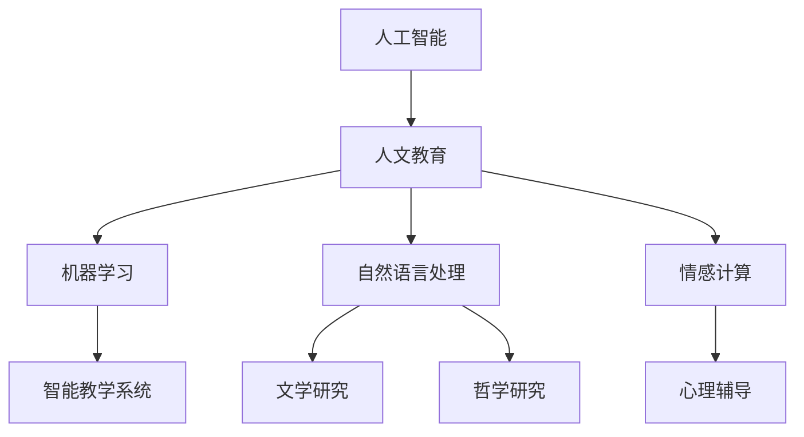

                 

# 《人工智能时代的人文教育：培养批判性思维与创造力》

> 关键词：人工智能，人文教育，批判性思维，创造力，教育体系，算法设计，项目实战

> 摘要：本文旨在探讨人工智能时代的人文教育，重点分析如何在教育体系中培养批判性思维与创造力。通过阐述人工智能的基本概念和人文教育的重要性，结合实例和数学模型，本文将展示如何通过技术创新和实践，实现人文教育与人工智能的有机结合。

## 引言

随着人工智能（AI）技术的飞速发展，其对教育领域的影响日益显著。从传统的教学方式到现代的智能教学系统，AI在教育中的应用正在改变教育的面貌。然而，在追求技术进步的同时，我们也需要关注教育的本质——培养具有批判性思维和创造力的人才。

人文教育作为一种关注个体全面发展、培养综合素质的教育模式，在人工智能时代面临着新的挑战和机遇。本文将围绕以下核心问题展开讨论：

1. 人工智能与人文教育的结合点是什么？
2. 如何在教育体系中培养批判性思维与创造力？
3. 人文教育与人工智能的平衡策略是什么？

通过以上问题的探讨，本文旨在为人工智能时代的人文教育提供一些有益的思考和方向。

## 核心概念与联系

### 人工智能的基本概念

人工智能是指通过计算机程序模拟人类智能行为的技术。它包括机器学习、深度学习、自然语言处理等多个子领域。其中，机器学习是AI的核心，它通过算法从数据中学习规律，从而实现智能决策。

### 人文教育的基本概念

人文教育是一种关注个体全面发展、培养综合素质的教育模式。它包括文学、历史、哲学、艺术等多个领域，旨在培养学生的批判性思维、创造力、沟通能力等。

### 人工智能与人文教育的交叉点

人工智能与人文教育的交叉点主要体现在以下几个方面：

1. **智能教学系统**：利用AI技术个性化定制教学方案，提高教学效果。
2. **自然语言处理**：应用于文学、语言等领域，辅助学术研究。
3. **情感计算**：通过分析学生的情绪和行为，提供个性化的心理辅导。

### Mermaid流程图：人工智能与人文教育的关系



## 教育体系与AI结合

### AI在教育中的应用

AI在教育中的应用主要体现在以下几个方面：

1. **智能教学系统**：通过数据分析，个性化定制教学方案，提高教学效果。
2. **学习辅助工具**：利用自然语言处理技术，提供智能问答、作业批改等服务。
3. **情感计算**：通过分析学生的情绪和行为，提供个性化的心理辅导。

### AI辅助教学的优势与挑战

**优势：**

1. 提高教学效率。
2. 个性化学习。
3. 拓展教育资源的获取。

**挑战：**

1. 数据安全和隐私保护。
2. 教师角色的转变。
3. 技术的普及与培训。

### AI在教育评估中的应用

AI技术可以应用于教育评估，如自动批改作业、分析考试数据等。这有助于教育机构更准确地评估学生的学习情况，提供针对性的辅导。

## 批判性思维的培养

### 批判性思维的定义与重要性

批判性思维是指对信息进行深入分析、评估和推理的过程。它的重要性在于：

1. 提高解决问题的能力。
2. 增强判断力和决策力。
3. 促进创新思维。

### AI工具在批判性思维培养中的应用

AI工具可以辅助学生进行批判性思维训练，如智能问答系统、数据分析工具等。这些工具可以帮助学生更好地理解问题，培养逻辑推理能力。

### 伪代码：批判性思维培养的算法设计

```python
def critical_thinking(question):
    # 输入问题，进行数据分析
    data = analyze_data(question)

    # 提取关键信息
    key_info = extract_key_info(data)

    # 进行逻辑推理
    reasoning_results = logical_reasoning(key_info)

    # 输出结论
    return reasoning_results
```

## 创造力的发展

### 创造力的定义与特征

创造力是指产生新想法、新方法的能力。它具有以下特征：

1. 奇特性。
2. 实用性。
3. 独特性。

### AI在创造力培养中的应用

AI可以应用于创造力培养，如提供创意生成工具、进行创意评分等。这些工具可以帮助学生更好地挖掘潜能，培养创造力。

### 伪代码：创造力培养的算法设计

```python
def creativity_training(idea):
    # 输入创意，进行创新评分
    score = innovate_score(idea)

    # 提出改进建议
    suggestions = generate_suggestions(score)

    # 输出改进后的创意
    return suggestions
```

## 人文教育与AI的平衡

### 人文教育与AI的平衡原则

1. **尊重教育本质**：在追求技术进步的同时，不能忽视教育的核心目标。
2. **多元发展**：注重学生全面素质的培养，不仅仅是技术能力的提升。
3. **伦理道德**：在AI应用中，重视伦理道德问题，确保技术的正向影响。

### AI对人文教育的影响

AI技术的应用可以提升人文教育的效果，但同时也带来了一些负面影响，如信息过载、隐私泄露等。因此，在教育中需要平衡AI的利与弊。

### 实现人文教育与AI平衡的策略

1. **教师培训**：提高教师对AI技术的理解和应用能力。
2. **课程设计**：将AI技术与人文教育相结合，设计出既有趣又具有挑战性的课程。
3. **伦理教育**：加强对学生的伦理道德教育，培养学生的责任感。

## 项目实战

### AI辅助人文教育项目案例

以“智能文学助手”为例，该项目旨在利用AI技术辅助文学创作和教育。

### 开发环境搭建与工具介绍

1. **开发环境**：Python、Jupyter Notebook
2. **工具**：自然语言处理库（如NLTK）、文本生成模型（如GPT-2）

### 源代码实现与代码解读

```python
import nltk
from nltk.tokenize import word_tokenize
from transformers import GPT2LMHeadModel, GPT2Tokenizer

# 加载预训练模型
tokenizer = GPT2Tokenizer.from_pretrained('gpt2')
model = GPT2LMHeadModel.from_pretrained('gpt2')

# 输入文本
input_text = "人工智能时代的人文教育："

# 分词
tokens = word_tokenize(input_text)

# 生成文本
generated_text = model.generate(tokens, max_length=50, num_return_sequences=1)

# 输出结果
print(generated_text)
```

### 代码应用解读与分析

该代码通过加载预训练的GPT-2模型，对输入文本进行分词，然后生成新的文本。这可以帮助学生进行文学创作，提供灵感。

### 实际案例分析和详细讲解剖析

通过实际案例，如利用AI助手生成短篇小说，分析其创作过程和结果。从中可以发现AI在文学创作中的应用潜力。

### 项目小结

AI技术在人文教育中的应用具有巨大的潜力，但需要平衡技术的影响，确保人文教育的本质不被忽视。

## 最佳实践 tips、小结、注意事项、拓展阅读

### 最佳实践 tips

1. 结合实际教学需求，合理使用AI工具。
2. 关注学生反馈，及时调整教学策略。
3. 加强教师培训，提高对AI技术的理解与应用能力。

### 小结

本文探讨了人工智能时代的人文教育，重点分析了如何培养批判性思维与创造力。通过实例和算法设计，展示了AI技术在人文教育中的应用潜力。

### 注意事项

1. 在使用AI工具时，注意保护学生隐私。
2. 避免过度依赖AI，确保人文教育的本质得到体现。

### 拓展阅读

1. 《教育技术学导论》
2. 《人工智能在教育中的应用》
3. 《机器学习与数据挖掘》

## 作者信息

作者：AI天才研究院/AI Genius Institute & 禅与计算机程序设计艺术 /Zen And The Art of Computer Programming

