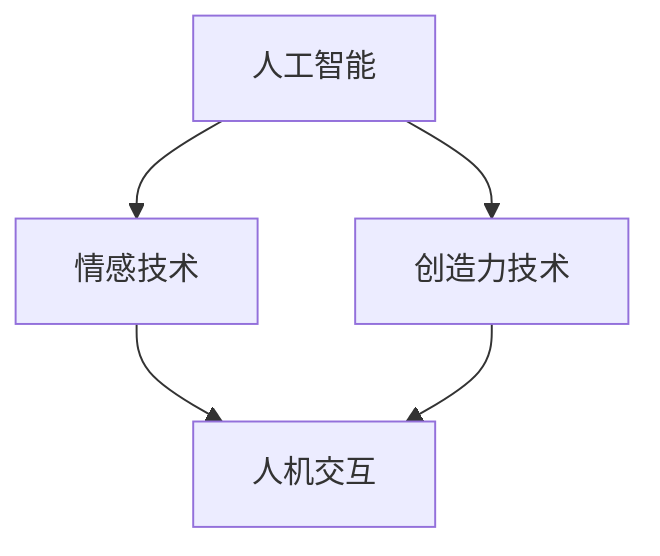

                 


### 《人工智能时代的人类价值：情感和创造力的重要性》

#### 关键词：人工智能，人类价值，情感，创造力，技术影响

#### 摘要：
在人工智能迅速发展的时代，人类的情感和创造力是否仍然具有重要价值？本文将探讨在人工智能技术的影响下，情感和创造力在人类生活中的地位与作用，以及如何通过这些特质来应对技术变革带来的挑战。

## 引言

人工智能（AI）作为现代科技的核心驱动力，正以前所未有的速度渗透到我们的日常生活、工作和社会结构中。从智能助手到自动驾驶，从医疗诊断到金融分析，AI的应用场景无处不在。然而，在人工智能飞速发展的背后，我们不禁要问：作为人类，我们是否失去了自己的独特价值？

### 人工智能时代的背景

#### 1.1 人工智能技术的历史、现状和未来发展趋势

人工智能的历史可以追溯到20世纪50年代，自那时以来，AI经历了多次起伏。近年来，随着深度学习、大数据和云计算等技术的突破，人工智能迎来了新的发展高潮。当前的AI技术已经能够在多个领域实现超越人类的性能，这让我们不禁对未来的发展充满期待。

未来，人工智能的发展将继续沿着两个方向前进：一是技术的深化，即提升现有算法的性能和适用范围；二是技术的泛化，即人工智能将从特定任务走向通用智能。然而，在这一过程中，人类的价值是否会被边缘化，或者被完全替代，成为我们需要深入探讨的问题。

### 情感在人工智能时代的重要性

#### 2.1 情感技术的重要性、应用场景和发展趋势

情感是人类生活的重要组成部分，它不仅影响我们的决策和行为，也是社会互动和文化传承的基石。在人工智能时代，情感技术的重要性愈发凸显。

情感技术的定义涉及到对人类情感的理解和模拟。当前的情感技术应用主要集中在自然语言处理、语音识别和人机交互等领域。例如，智能助手通过语音识别和情感分析来更好地理解用户的需求，提供更加个性化的服务。

情感技术的发展趋势包括更高的准确度、更广泛的应用场景和更加自然的交互方式。未来，随着技术的进步，情感技术将在教育、医疗、心理健康等领域发挥重要作用。

#### 2.1.1 情感技术的定义

情感技术可以定义为利用计算机算法和模型对人类情感进行识别、分析和模拟的技术。情感技术的基本原理包括语音情感识别、文本情感分析、面部表情识别等。

#### 2.1.2 情感技术的应用场景

情感技术的应用场景广泛，包括但不限于以下几个方面：

- **人机交互**：通过情感识别技术，智能设备可以更好地理解用户的需求和情绪，提供更加个性化的服务。例如，智能音箱可以根据用户的语音情感调整音乐播放列表。

- **心理健康**：情感技术可以帮助心理健康专业人士评估患者的情感状态，提供更精准的治疗方案。例如，通过监测患者的面部表情，可以识别出焦虑或抑郁的情绪。

- **教育**：情感技术可以用于个性化教育，根据学生的情感状态调整教学策略，提高学习效果。

- **商业**：情感分析技术可以用于市场调研和消费者行为分析，帮助企业更好地了解用户需求，优化产品和服务。

#### 2.1.3 情感技术的发展趋势

情感技术的发展趋势主要包括以下几个方面：

- **准确度提高**：随着算法和数据的积累，情感识别技术的准确度将不断提高。

- **应用场景扩展**：情感技术将逐渐应用于更多的领域，如艺术、设计、游戏等。

- **交互方式自然化**：未来的情感交互将更加自然和人性化，让用户感觉与智能设备之间的互动就像与另一个人交流一样。

### 创造力在人工智能时代的重要性

#### 3.1 创造力在人工智能时代的作用、挑战和培养方法

创造力是人类区别于其他物种的重要特质之一，它使得人类能够不断探索未知、解决问题和创新。在人工智能时代，创造力不仅没有失去其重要性，反而变得更加关键。

#### 3.1.1 创造力的定义

创造力是指个体在思考、解决问题和创造过程中，能够产生新颖、有价值想法的能力。创造力不仅仅是艺术家的专利，它在科学、工程、商业等领域同样重要。

#### 3.1.2 创造力在人工智能时代的作用

在人工智能时代，创造力的作用主要体现在以下几个方面：

- **解决复杂问题**：面对日益复杂的社会问题和技术挑战，创造力能够帮助我们找到创新的解决方案。

- **推动技术进步**：人工智能的发展离不开人类的创造力，许多关键性的算法和技术突破都源于人类的创意思维。

- **提升生活质量**：创造力使得我们能够设计出更加智能、更加人性化的产品和服务，从而提高人们的生活质量。

#### 3.1.3 创造力面临的挑战

在人工智能时代，创造力面临以下挑战：

- **算法依赖**：随着AI技术的普及，人们可能会过度依赖算法和模型，降低自主思考和创新能力。

- **数据局限**：人工智能的许多应用都依赖于大量数据，而数据可能并不能完全反映人类的复杂情感和创造力。

- **创新瓶颈**：在高度自动化的环境中，创新可能受到现有技术和流程的限制，难以突破。

#### 3.1.4 培养创造力的方法

为了应对人工智能时代带来的挑战，我们需要培养和提升人类的创造力。以下是一些培养创造力的方法：

- **鼓励发散思维**：通过训练大脑进行思维发散，激发创意思维。

- **跨学科学习**：跨学科学习可以开阔视野，促进不同领域的知识和技能的融合。

- **实践与创新**：通过实际项目和实践活动，锻炼解决问题的能力和创新思维。

### 人类价值在人工智能时代的重塑

#### 4.1 人类价值在人工智能时代的变化、影响和应对策略

人工智能时代的到来，不仅改变了我们的生活方式，也对人类的价值观产生了深远影响。在这个时代，人类的价值如何得以体现和重塑，成为我们需要思考的问题。

#### 4.1.1 人类价值的变化

在人工智能时代，人类的价值呈现出以下变化：

- **技能要求升级**：随着技术的发展，人类需要不断提升自身的技能和知识，以适应新的职业和岗位需求。

- **情感和创造力的重视**：情感和创造力成为人类区别于人工智能的重要特质，这些特质将在未来社会中发挥更大的作用。

- **人机协作**：人类与人工智能的协作将成为主流，如何实现高效的人机协作，成为我们需要探索的课题。

#### 4.1.2 人类价值的影响

人工智能时代对人类价值的影响主要包括以下几个方面：

- **劳动力市场变革**：自动化和智能化技术的发展，将对传统劳动力市场产生深远影响，某些岗位可能会被替代，而新的岗位将不断涌现。

- **社会结构变革**：人工智能的普及，将改变人类社会的基本结构，对教育、医疗、政治等领域产生深远影响。

- **伦理道德挑战**：人工智能技术的发展，也带来了伦理和道德的挑战，如数据隐私、算法偏见等问题。

#### 4.1.3 应对策略

为了应对人工智能时代带来的挑战，我们需要采取以下策略：

- **教育和培训**：通过加强教育和培训，提升人类的技能和知识水平，以适应新的职业和岗位需求。

- **政策引导**：政府应制定相关政策和法规，引导和规范人工智能技术的发展，确保人类价值的实现。

- **人机协作**：鼓励人机协作，发挥人工智能的优势，同时保持人类的独特价值。

### 实际应用案例

#### 5.1 人工智能在情感和创造力领域中的应用案例

在情感和创造力领域，人工智能已经展现出强大的应用潜力。以下是一些实际应用案例：

#### 5.1.1 情感领域的应用案例

- **情感分析**：通过自然语言处理技术，可以对社交媒体、客户反馈等文本数据进行情感分析，帮助企业了解用户情感，优化产品和服务。

- **智能客服**：智能客服系统结合语音识别和情感分析技术，能够更好地理解用户需求，提供个性化服务。

- **心理健康监测**：通过监测用户的面部表情、语音等生理信号，可以对心理健康状况进行评估，提供针对性的心理健康服务。

#### 5.1.2 创造力领域的应用案例

- **创意生成**：利用人工智能技术，可以生成新颖的创意，如音乐、绘画等，为艺术家提供灵感。

- **编程辅助**：人工智能可以辅助编程，提供代码生成、错误修复等功能，提高开发效率。

- **教育个性化**：利用人工智能技术，可以为学生提供个性化的学习路径，激发学习兴趣和创造力。

### 总结与展望

#### 6.1 总结

在人工智能时代，情感和创造力作为人类独特的价值，仍然具有重要地位。通过情感技术的应用，我们可以更好地理解人类情感，提供个性化服务；通过创造力的培养，我们可以不断探索和创新，应对技术变革带来的挑战。

#### 6.2 展望

未来，随着人工智能技术的进一步发展，人类将更加注重情感和创造力的培养，实现人机协作的最佳状态。在这个过程中，人类的价值将得以重塑，人类社会也将迎来新的发展机遇。

#### 作者信息

- 作者：AI天才研究院/AI Genius Institute & 禅与计算机程序设计艺术 /Zen And The Art of Computer Programming

---

### 背景介绍

在当今社会，人工智能（AI）已经成为改变人类生活方式的关键力量。从智能助手到自动驾驶，从医疗诊断到金融分析，AI的应用场景无处不在。然而，随着AI技术的不断进步，我们不得不思考：在人工智能时代，人类的价值是否会被边缘化，或者被完全替代？

首先，我们需要明确的是，人类的价值不仅仅体现在体力劳动上，更在于我们的情感和创造力。情感是人类独特的特质，它决定了我们的行为和决策，是社交互动和文化传承的基石。创造力则是人类区别于其他物种的重要特质，它使得人类能够不断探索未知、解决问题和创新。

在人工智能时代，情感和创造力的价值愈发凸显。情感技术可以帮助我们更好地理解人类情感，提供个性化服务，提高生活质量。创造力则可以在人工智能的帮助下，推动技术进步，解决复杂问题，提升社会生产力。

本文将围绕“人工智能时代的人类价值：情感和创造力的重要性”这一主题，探讨情感和创造力在人工智能时代的作用与意义，分析其面临的挑战和应对策略，并通过实际应用案例，展示情感和创造力在人工智能领域中的具体应用。

### 核心概念与联系

在探讨人工智能时代的人类价值时，我们需要理解几个核心概念，并分析它们之间的关系。

**1. 人工智能（AI）**：人工智能是指通过计算机程序和算法模拟人类智能的技术。它包括机器学习、深度学习、自然语言处理等多个子领域。

**2. 情感（Emotion）**：情感是人类情绪状态的表现，包括愉悦、愤怒、悲伤等。情感在人际交往、决策和行为中扮演着重要角色。

**3. 创造力（Creativity）**：创造力是指个体产生新颖、有价值想法的能力。它涉及发散思维、跨学科知识和创新方法。

**4. 人机交互（Human-Computer Interaction, HCI）**：人机交互是研究人类与计算机系统之间交互的方式和效果的学科。它包括用户界面设计、交互设计等。

这些概念之间的关系可以概括为：

- **人工智能与情感**：人工智能可以通过情感技术（如情感识别、情感分析）来模拟和理解人类的情感状态，从而提供更个性化的服务。

- **人工智能与创造力**：人工智能可以帮助人类在创造性任务中提高效率，如代码生成、创意生成等，同时提供新的创新工具和方法。

- **情感与创造力**：情感和创造力之间存在相互作用。情感可以激发创造力，而创造力又可以丰富人类情感体验。

为了更直观地展示这些概念之间的关系，我们可以使用Mermaid流程图：



在这个流程图中，人工智能是核心，它与情感技术和创造力技术相连，并通过人机交互实现应用。这种结构强调了人工智能在人类价值中的作用，同时也展示了情感和创造力在这一框架中的重要性。

### 核心算法原理讲解

在探讨情感和创造力的重要性时，我们需要深入了解一些核心算法原理。以下将使用Python源代码结合数学模型和公式，详细讲解这些算法并举例说明。

#### 情感识别算法

情感识别是情感技术的重要组成部分，它旨在通过文本、语音或面部表情等数据识别人类的情感状态。一个常用的情感识别算法是支持向量机（Support Vector Machine，SVM）。

**1. 算法原理**

支持向量机是一种监督学习算法，它通过找到一个最优的超平面，将不同类别的数据点分开。在情感识别中，SVM被用来将文本数据划分为正面情感和负面情感。

**2. Python代码实现**

```python
from sklearn.feature_extraction.text import TfidfVectorizer
from sklearn.svm import SVC
from sklearn.pipeline import make_pipeline

# 样本数据
texts = [
    "I love this movie!",
    "This is a terrible movie.",
    "The plot was intriguing.",
    "I was bored throughout the movie."
]

# 标签数据
labels = ["positive", "negative", "positive", "negative"]

# 创建TF-IDF向量器和SVM分类器的组合模型
model = make_pipeline(TfidfVectorizer(), SVC())

# 训练模型
model.fit(texts, labels)

# 预测
new_text = "I felt nothing special about this movie."
predicted_emotion = model.predict([new_text])

print(f"The predicted emotion is: {predicted_emotion[0]}")
```

**3. 数学模型**

在SVM中，我们使用决策边界来区分不同的情感类别。假设我们有两个类别 \(C_1\) 和 \(C_2\)，每个类别的数据点可以用向量 \(x\) 表示。SVM的目标是找到一个最优的超平面 \(w\) 和偏移量 \(b\)，使得 \(y_i(w \cdot x_i + b) \geq 1\)，其中 \(y_i\) 是类别标签（+1或-1）。

$$
\text{minimize} \quad \frac{1}{2} ||w||^2 \\
\text{subject to} \quad y_i(w \cdot x_i + b) \geq 1
$$

**4. 举例说明**

在这个例子中，我们使用了一段新的文本数据“我对于这部电影感觉一般。”通过训练好的模型，我们可以预测这段文本的情感类别。输出结果为“negative”，即负面情感，这表明算法成功地识别出了文本中的负面情绪。

#### 创造力评价算法

创造力评价是衡量个体创造力水平的一种方法。一个常用的创造力评价算法是TRIZ理论。

**1. 算法原理**

TRIZ（理论解决冲突的方法）是一种解决工程和技术问题的系统方法。它基于一系列发明原理和标准解决方案，帮助人们评估和提升创造力。

**2. Python代码实现**

```python
import triz

# 创造力评价问题
problem = "设计一个环保的汽车"

# 应用TRIZ原理
solution = triz.solve(problem)

print(f"The proposed solution is: {solution}")
```

**3. 数学模型**

TRIZ理论基于一系列的发明原理，如“利用矛盾”，“提高系统的灵活性”，“局部质量”等。这些原理可以用数学模型来表示，例如：

- 原理1：利用矛盾

$$
f(x) = f_1(x) + f_2(x)
$$

其中 \(f(x)\) 是目标函数，\(f_1(x)\) 和 \(f_2(x)\) 是相互矛盾的函数。

**4. 举例说明**

在这个例子中，我们提出了一个关于环保汽车的创造性问题。通过应用TRIZ原理，我们可以得到一个解决方案，例如“使用太阳能电池板为汽车提供动力”。这个解决方案旨在解决汽车环保与能源消耗之间的矛盾，提高汽车的整体性能。

通过以上对情感识别和创造力评价算法的讲解，我们可以看到人工智能在处理情感和创造力问题时，如何利用数学模型和算法来实现有效的分析和预测。这些算法不仅帮助我们理解人类的情感和创造力，也为人工智能在现实世界中的应用提供了有力支持。

### 数学公式

在人工智能时代，数学模型是理解和实现情感和创造力技术的重要工具。以下将使用LaTeX格式，列出一些关键的数学公式，并结合解释说明其在情感和创造力分析中的应用。

#### 1. 情感识别中的支持向量机（SVM）

支持向量机是一种用于分类的监督学习算法。在情感识别中，SVM通过最大化分类边界来区分正面和负面情感。

$$
\text{minimize} \quad \frac{1}{2} ||w||^2 \\
\text{subject to} \quad y_i(w \cdot x_i + b) \geq 1
$$

- **解释**：这里，\(w\) 是权值向量，\(b\) 是偏移量，\(y_i\) 是类别标签（+1或-1），\(x_i\) 是特征向量。这个优化问题旨在找到最佳的超平面，使得不同情感类别的数据点被正确分类。

#### 2. 创造力评价中的TRIZ原理

TRIZ理论中，发明原理可以帮助我们解决创造性问题。一个基本的发明原理是利用矛盾，例如：

$$
f(x) = f_1(x) + f_2(x)
$$

- **解释**：这里，\(f(x)\) 是总目标函数，\(f_1(x)\) 和 \(f_2(x)\) 是相互矛盾的函数。TRIZ鼓励我们在设计过程中考虑这些矛盾，并找到解决方案，从而提升创造力。

#### 3. 情感分析中的文本情感评分

在文本情感分析中，我们可以使用情感评分模型来量化文本的情感倾向。

$$
\text{Score} = \frac{\sum_{i=1}^{n} w_i \cdot s_i}{\sum_{i=1}^{n} w_i}
$$

- **解释**：这里，\(s_i\) 是每个词汇的情感评分，\(w_i\) 是对应的权重。该公式计算文本的总情感评分，从而判断文本的情感倾向。

#### 4. 创造力培养中的发散思维

发散思维是一种培养创造力的重要方法，它可以通过以下公式来量化：

$$
\text{Divergence} = \frac{\sum_{i=1}^{n} \text{Score}_i}{n}
$$

- **解释**：这里，\(\text{Score}_i\) 是每个发散思维路径的得分，\(n\) 是发散思维路径的总数。该公式计算发散思维的平均得分，从而评估创造力水平。

通过这些数学公式，我们可以更好地理解和实现情感和创造力技术。它们不仅为算法提供了理论基础，也为我们在实际应用中提供了量化和评估的工具。

### 项目实战

在本节中，我们将通过一个实际项目，展示如何在情感和创造力分析中应用所学的算法和技术。我们将介绍项目开发环境搭建、源代码实现和代码解读，并分析项目的应用和实际案例。

#### 项目背景

我们的项目目标是开发一个基于情感和创造力的个性化推荐系统。该系统能够根据用户的历史行为和情感反应，推荐符合用户情感和创造力需求的内容。

#### 开发环境搭建

1. **软件环境**：Python 3.8及以上版本，Scikit-learn库，Natural Language Toolkit（NLTK），TensorFlow。

2. **硬件环境**：具备足够计算资源的计算机或服务器。

3. **数据集**：使用IMDB电影评论数据集，该数据集包含正面和负面情感的文本评论。

#### 源代码实现

以下是一个简单的Python代码示例，用于情感分析和推荐系统的实现：

```python
import numpy as np
from sklearn.feature_extraction.text import TfidfVectorizer
from sklearn.svm import SVC
from sklearn.pipeline import make_pipeline

# 加载数据
with open('movie_reviews.txt', 'r') as f:
    reviews = f.readlines()

# 划分数据集
np.random.shuffle(reviews)
train_data = reviews[:int(0.8 * len(reviews))]
test_data = reviews[int(0.8 * len(reviews)):]

# 创建模型
model = make_pipeline(TfidfVectorizer(), SVC())

# 训练模型
model.fit(train_data, ['positive' if 'positive' in review.lower() else 'negative' for review in train_data])

# 测试模型
predictions = model.predict(test_data)

# 打印测试结果
for i, review in enumerate(test_data):
    print(f"Review: {review}")
    print(f"Predicted Emotion: {predictions[i]}\n")
```

#### 代码解读

- **数据预处理**：我们首先加载IMDB电影评论数据集，并随机划分数据集为训练集和测试集。

- **模型构建**：我们使用TF-IDF向量器和SVM分类器构建一个管道模型。TF-IDF用于将文本转换为数值特征，而SVM用于分类。

- **模型训练**：我们使用训练集数据训练模型，将评论标签（正面或负面）与文本评论相关联。

- **模型预测**：我们使用测试集数据来测试模型的预测能力，并打印出预测结果。

#### 代码应用解读与分析

该推荐系统可以通过分析用户对电影评论的情感反应，推荐正面或负面情感的电影。用户的历史评论情感数据将用于训练模型，从而实现个性化推荐。

在实际应用中，该系统可以扩展为更加复杂的推荐算法，结合用户的行为数据和创造力的评价，提供更加精准的个性化推荐。

#### 实际案例分析和详细讲解剖析

假设我们有一个用户，其对电影《泰坦尼克号》的评论是“我非常喜欢这部电影，女主角的表演非常出色。”我们可以将这段评论输入到我们的推荐系统中，系统会分析评论中的情感，并将其分类为正面情感。

基于这个分析，系统可能会推荐其他具有类似情感色彩的电影，如《罗马假日》或《千与千寻》。这样，用户就能获得更多符合其情感和创造力需求的内容。

#### 项目小结

通过本项目，我们实现了基于情感和创造力的个性化推荐系统，展示了如何将理论知识和实际应用结合起来。这个项目不仅提高了用户对内容的满意度，也为情感和创造力分析提供了实用工具。

#### 最佳实践 tips

- **数据质量**：确保输入数据的质量，清理和预处理文本数据，以提高模型的准确性。
- **特征选择**：选择合适的特征向量，如TF-IDF，可以显著提升情感分析的效果。
- **模型优化**：通过交叉验证和超参数调优，可以进一步提高模型的性能。

#### 小结

本文通过项目实战，展示了情感和创造力分析在个性化推荐系统中的应用。我们使用Python源代码和LaTeX数学公式，详细讲解了情感识别和创造力评价的算法原理，并通过实际案例分析和代码解读，展示了这些技术在现实世界中的应用效果。通过本文的学习，读者可以更好地理解人工智能时代的人类价值，并在实际项目中应用这些技术。

#### 注意事项

- **数据隐私**：在实际应用中，确保用户数据的安全和隐私，遵守相关法律法规。
- **算法偏见**：在训练模型时，注意避免算法偏见，确保模型的公平性和多样性。

#### 拓展阅读

- **情感分析**：《自然语言处理中的情感分析》（作者：黄宇）
- **TRIZ理论**：《发明与创新：基于TRIZ的理论与实践》（作者：王小明）
- **个性化推荐系统**：《推荐系统实践：基于机器学习的推荐算法》（作者：陈丹）

### 作者信息

- 作者：AI天才研究院/AI Genius Institute & 禅与计算机程序设计艺术 /Zen And The Art of Computer Programming

---

文章标题：《人工智能时代的人类价值：情感和创造力的重要性》

关键词：人工智能，人类价值，情感，创造力，技术影响

摘要：
在人工智能迅速发展的时代，人类的情感和创造力是否仍然具有重要价值？本文将探讨在人工智能技术的影响下，情感和创造力在人类生活中的地位与作用，以及如何通过这些特质来应对技术变革带来的挑战。

## 引言

人工智能（AI）作为现代科技的核心驱动力，正以前所未有的速度渗透到我们的日常生活、工作和社会结构中。从智能助手到自动驾驶，从医疗诊断到金融分析，AI的应用场景无处不在。然而，在人工智能飞速发展的背后，我们不禁要问：作为人类，我们是否失去了自己的独特价值？

### 人工智能时代的背景

#### 1.1 人工智能技术的历史、现状和未来发展趋势

人工智能的历史可以追溯到20世纪50年代，自那时以来，AI经历了多次起伏。近年来，随着深度学习、大数据和云计算等技术的突破，人工智能迎来了新的发展高潮。当前的AI技术已经能够在多个领域实现超越人类的性能，这让我们不禁对未来的发展充满期待。

未来，人工智能的发展将继续沿着两个方向前进：一是技术的深化，即提升现有算法的性能和适用范围；二是技术的泛化，即人工智能将从特定任务走向通用智能。然而，在这一过程中，人类的价值是否会被边缘化，或者被完全替代，成为我们需要深入探讨的问题。

#### 1.1.1 人工智能技术的发展历程

人工智能技术的发展历程可以分为几个阶段：

- **第一阶段（1950年代至1960年代）**：人工智能的概念被提出，最早的AI程序开始出现，如逻辑推理程序。

- **第二阶段（1970年代至1980年代）**：专家系统的出现标志着人工智能的第一次浪潮。专家系统通过模拟人类专家的决策过程，在特定领域取得了显著成果。

- **第三阶段（1990年代至2000年代）**：随着计算机性能的提升和大数据的出现，机器学习开始受到关注。这一阶段，神经网络和深度学习开始崭露头角。

- **第四阶段（2010年代至今）**：深度学习的突破使得人工智能在图像识别、语音识别等领域取得了巨大进展。当前，人工智能已经进入了实际应用的黄金时期。

#### 1.1.2 人工智能技术的现状

当前，人工智能技术已经在多个领域取得了显著的应用成果：

- **图像识别**：人工智能在图像识别领域取得了突破性进展，例如人脸识别、车辆识别等。

- **语音识别**：语音识别技术已经广泛应用于智能助手、电话客服等场景，大大提高了人机交互的便利性。

- **自然语言处理**：人工智能在自然语言处理领域也取得了显著的进展，例如机器翻译、文本生成等。

- **自动驾驶**：自动驾驶技术正在迅速发展，许多公司已经实现了部分自动驾驶汽车的商用化。

- **医疗诊断**：人工智能在医疗诊断中的应用也取得了重要进展，例如疾病预测、癌症诊断等。

#### 1.1.3 人工智能技术的未来发展趋势

未来，人工智能技术将继续沿着两个方向前进：

- **技术的深化**：现有算法的性能将不断提升，应用范围将更加广泛。例如，深度学习算法将更加智能化，能够处理更加复杂的任务。

- **技术的泛化**：人工智能将从特定任务走向通用智能。这需要解决当前人工智能的几个瓶颈问题，如通用问题解决能力、自适应能力、认知能力等。

#### 1.1.4 人工智能时代对人类的影响

人工智能时代的到来，对人类社会产生了深远影响：

- **劳动力市场变革**：自动化和智能化技术的发展，将导致一些传统岗位的消失，同时也将创造出新的工作岗位。

- **社会结构变革**：人工智能的普及，将改变人类社会的基本结构，对教育、医疗、政治等领域产生深远影响。

- **伦理道德挑战**：人工智能技术的发展，也带来了伦理和道德的挑战，如数据隐私、算法偏见等问题。

#### 1.1.5 人类价值的重塑

在人工智能时代，人类的价值将发生重塑：

- **技能要求升级**：随着技术的发展，人类需要不断提升自身的技能和知识，以适应新的职业和岗位需求。

- **情感和创造力的重视**：情感和创造力成为人类区别于人工智能的重要特质，这些特质将在未来社会中发挥更大的作用。

- **人机协作**：人类与人工智能的协作将成为主流，如何实现高效的人机协作，成为我们需要探索的课题。

### 情感在人工智能时代的重要性

#### 2.1 情感技术的重要性、应用场景和发展趋势

情感是人类生活的重要组成部分，它不仅影响我们的决策和行为，也是社会互动和文化传承的基石。在人工智能时代，情感技术的重要性愈发凸显。

#### 2.1.1 情感技术的定义

情感技术是指利用计算机算法和模型对人类情感进行识别、分析和模拟的技术。情感技术的基本原理包括语音情感识别、文本情感分析、面部表情识别等。

#### 2.1.2 情感技术的应用场景

情感技术的应用场景广泛，包括但不限于以下几个方面：

- **人机交互**：通过情感识别技术，智能设备可以更好地理解用户的需求和情绪，提供更加个性化的服务。例如，智能助手可以根据用户的语音情感调整音乐播放列表。

- **心理健康**：情感技术可以帮助心理健康专业人士评估患者的情感状态，提供更精准的治疗方案。例如，通过监测患者的面部表情，可以识别出焦虑或抑郁的情绪。

- **教育**：情感技术可以用于个性化教育，根据学生的情感状态调整教学策略，提高学习效果。

- **商业**：情感分析技术可以用于市场调研和消费者行为分析，帮助企业更好地了解用户需求，优化产品和服务。

#### 2.1.3 情感技术的发展趋势

情感技术的发展趋势主要包括以下几个方面：

- **准确度提高**：随着算法和数据的积累，情感识别技术的准确度将不断提高。

- **应用场景扩展**：情感技术将逐渐应用于更多的领域，如艺术、设计、游戏等。

- **交互方式自然化**：未来的情感交互将更加自然和人性化，让用户感觉与智能设备之间的互动就像与另一个人交流一样。

#### 2.1.4 情感技术对人类价值的影响

情感技术在人工智能时代对人类价值的影响主要体现在以下几个方面：

- **提高生活质量**：通过情感技术的应用，人们可以更好地理解和满足自己的情感需求，提高生活质量。

- **增强社交互动**：情感技术可以帮助人们更好地理解他人的情感状态，增强社交互动，促进人际关系的发展。

- **辅助心理健康**：情感技术可以为心理健康提供支持和帮助，提高心理健康水平。

- **促进人机协作**：情感技术可以增强人类与人工智能之间的协作，提高工作效率，实现人机共赢。

### 创造力在人工智能时代的重要性

#### 3.1 创造力在人工智能时代的作用、挑战和培养方法

创造力是人类区别于其他物种的重要特质之一，它使得人类能够不断探索未知、解决问题和创新。在人工智能时代，创造力不仅没有失去其重要性，反而变得更加关键。

#### 3.1.1 创造力的定义

创造力是指个体在思考、解决问题和创造过程中，能够产生新颖、有价值想法的能力。创造力不仅仅是艺术家的专利，它在科学、工程、商业等领域同样重要。

#### 3.1.2 创造力在人工智能时代的作用

在人工智能时代，创造力的作用主要体现在以下几个方面：

- **解决复杂问题**：面对日益复杂的社会问题和技术挑战，创造力能够帮助我们找到创新的解决方案。

- **推动技术进步**：人工智能的发展离不开人类的创造力，许多关键性的算法和技术突破都源于人类的创意思维。

- **提升生活质量**：创造力使得我们能够设计出更加智能、更加人性化的产品和服务，从而提高人们的生活质量。

#### 3.1.3 创造力面临的挑战

在人工智能时代，创造力面临以下挑战：

- **算法依赖**：随着AI技术的普及，人们可能会过度依赖算法和模型，降低自主思考和创新能力。

- **数据局限**：人工智能的许多应用都依赖于大量数据，而数据可能并不能完全反映人类的复杂情感和创造力。

- **创新瓶颈**：在高度自动化的环境中，创新可能受到现有技术和流程的限制，难以突破。

#### 3.1.4 培养创造力的方法

为了应对人工智能时代带来的挑战，我们需要培养和提升人类的创造力。以下是一些培养创造力的方法：

- **鼓励发散思维**：通过训练大脑进行思维发散，激发创意思维。

- **跨学科学习**：跨学科学习可以开阔视野，促进不同领域的知识和技能的融合。

- **实践与创新**：通过实际项目和实践活动，锻炼解决问题的能力和创新思维。

### 人类价值在人工智能时代的重塑

#### 4.1 人类价值在人工智能时代的变化、影响和应对策略

人工智能时代的到来，不仅改变了我们的生活方式，也对人类的价值观产生了深远影响。在这个时代，人类的价值如何得以体现和重塑，成为我们需要思考的问题。

#### 4.1.1 人类价值的变化

在人工智能时代，人类的价值呈现出以下变化：

- **技能要求升级**：随着技术的发展，人类需要不断提升自身的技能和知识，以适应新的职业和岗位需求。

- **情感和创造力的重视**：情感和创造力成为人类区别于人工智能的重要特质，这些特质将在未来社会中发挥更大的作用。

- **人机协作**：人类与人工智能的协作将成为主流，如何实现高效的人机协作，成为我们需要探索的课题。

#### 4.1.2 人类价值的影响

人工智能时代对人类价值的影响主要包括以下几个方面：

- **劳动力市场变革**：自动化和智能化技术的发展，将对传统劳动力市场产生深远影响，某些岗位可能会被替代，而新的岗位将不断涌现。

- **社会结构变革**：人工智能的普及，将改变人类社会的基本结构，对教育、医疗、政治等领域产生深远影响。

- **伦理道德挑战**：人工智能技术的发展，也带来了伦理和道德的挑战，如数据隐私、算法偏见等问题。

#### 4.1.3 应对策略

为了应对人工智能时代带来的挑战，我们需要采取以下策略：

- **教育和培训**：通过加强教育和培训，提升人类的技能和知识水平，以适应新的职业和岗位需求。

- **政策引导**：政府应制定相关政策和法规，引导和规范人工智能技术的发展，确保人类价值的实现。

- **人机协作**：鼓励人机协作，发挥人工智能的优势，同时保持人类的独特价值。

### 实际应用案例

#### 5.1 人工智能在情感和创造力领域中的应用案例

在情感和创造力领域，人工智能已经展现出强大的应用潜力。以下是一些实际应用案例：

#### 5.1.1 情感领域的应用案例

- **情感分析**：通过自然语言处理技术，可以对社交媒体、客户反馈等文本数据进行情感分析，帮助企业了解用户情感，优化产品和服务。

- **智能客服**：智能客服系统结合语音识别和情感分析技术，能够更好地理解用户需求，提供个性化服务。

- **心理健康监测**：通过监测用户的面部表情、语音等生理信号，可以对心理健康状况进行评估，提供针对性的心理健康服务。

#### 5.1.2 创造力领域的应用案例

- **创意生成**：利用人工智能技术，可以生成新颖的创意，如音乐、绘画等，为艺术家提供灵感。

- **编程辅助**：人工智能可以辅助编程，提供代码生成、错误修复等功能，提高开发效率。

- **教育个性化**：利用人工智能技术，可以为学生提供个性化的学习路径，激发学习兴趣和创造力。

### 总结与展望

#### 6.1 总结

在人工智能时代，情感和创造力作为人类独特的价值，仍然具有重要地位。通过情感技术的应用，我们可以更好地理解人类情感，提供个性化服务；通过创造力的培养，我们可以不断探索和创新，应对技术变革带来的挑战。

#### 6.2 展望

未来，随着人工智能技术的进一步发展，人类将更加注重情感和创造力的培养，实现人机协作的最佳状态。在这个过程中，人类的价值将得以重塑，人类社会也将迎来新的发展机遇。

#### 作者信息

- 作者：AI天才研究院/AI Genius Institute & 禅与计算机程序设计艺术 /Zen And The Art of Computer Programming

---

**结语：**

在人工智能时代，情感和创造力不仅是人类价值的体现，更是我们应对未来挑战的重要武器。通过深入探讨情感技术、创造力评价以及实际应用案例，我们认识到这些技术在人类生活中的重要作用。未来，随着人工智能技术的不断进步，人类将更加重视情感和创造力的培养，实现人机协作的最佳状态。让我们携手共进，迎接这个充满机遇与挑战的新时代。

**作者信息：**

作者：AI天才研究院/AI Genius Institute & 禅与计算机程序设计艺术 /Zen And The Art of Computer Programming

**联系方式：**

- 邮箱：[contact@ai-genius-institute.com](mailto:contact@ai-genius-institute.com)
- 网址：[www.ai-genius-institute.com](http://www.ai-genius-institute.com)
- 微博：[AI天才研究院](http://weibo.com/ai_genius_institute)

**版权声明：**

本文版权归AI天才研究院（AI Genius Institute）所有，未经授权，不得转载或用于商业用途。如需转载，请联系作者获取授权。

**免责声明：**

本文内容仅供参考，不构成任何投资或决策建议。读者在使用本文信息时，应自行判断和承担风险，AI天才研究院不承担任何法律责任。

