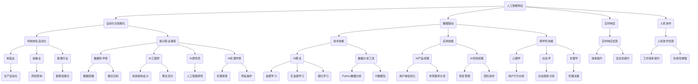

                 

### 摘要

《人工智能时代的就业变革：重新定义人类工作的价值》旨在深入探讨人工智能（AI）如何重塑就业市场，从而重新定义人类工作的价值。随着AI技术的迅猛发展，全球范围内的就业模式正经历着深刻的变革。传统的工作岗位正逐步被自动化和智能化技术所取代，而新的就业机会也在不断涌现。本文通过分析人工智能时代的特征、核心算法原理、数学模型及具体项目案例，揭示了AI对就业市场的深远影响。文章首先概述了人工智能时代的背景，接着详细讲解了机器学习算法的原理及其实际应用，随后探讨了人工智能技术对就业市场的冲击和就业者、企业、政府和社会的应对策略。最后，文章对人工智能时代的就业前景进行了展望，提出了未来就业趋势和应对策略。通过本文的阅读，读者将更全面地理解人工智能对就业市场的变革意义，并为自己的职业生涯规划提供有益的参考。

### 引言部分

《人工智能时代的就业变革：重新定义人类工作的价值》旨在深入探讨人工智能（AI）技术如何从根本上改变就业市场，重新定义人类工作的价值。随着AI技术的迅猛发展，全球范围内的工作模式正在发生深刻变革，这不仅对就业者、企业、政府和社会产生了重大影响，也为我们如何理解和应对这一变革提出了新的挑战。

首先，人工智能时代的特征明显。AI技术不仅改变了传统的工作流程，还创造了全新的工作方式。自动化和智能化技术的普及，使得许多重复性、低技能的工作被机器人和智能系统所取代，从而释放了人类从事更有创造性和价值的工作的时间。同时，AI技术还催生了许多新的职业，如数据科学家、机器学习工程师、AI研究员等，这些岗位需要高技能和专业知识的支持。

其次，人工智能对就业的影响是深远且广泛的。一方面，AI技术的普及使得许多传统岗位面临被淘汰的风险，特别是那些涉及到重复性劳动和简单决策的工作。另一方面，AI技术的应用也创造了许多新的就业机会，推动了新兴产业的发展。例如，在医疗领域，AI可以帮助医生进行疾病诊断和治疗方案推荐；在金融领域，AI可以用于风险管理、投资分析和欺诈检测；在制造业，AI可以用于生产流程优化和质量控制。这些新职业不仅要求从业者具备新的技能和知识，也为那些愿意学习和适应变化的人提供了新的机会。

然而，人工智能时代的就业变革也带来了一些挑战。对于就业者来说，需要不断更新自己的技能以适应新的工作要求。企业则需要调整人才培养策略，以应对劳动力市场的变化。政府和社会也需要采取措施，为那些因技术变革而失业的人提供再就业培训和保障。

《人工智能时代的就业变革：重新定义人类工作的价值》一书将通过详细分析人工智能时代的特征、核心算法原理、对就业市场的影响、就业转型策略以及未来的就业前景，帮助读者更好地理解和应对这一变革。本书旨在为就业者提供指导，帮助企业制定合适的人才培养策略，同时也为政府和社会提供政策建议，共同应对人工智能时代的就业挑战。

总之，人工智能时代的就业变革不仅仅是一场技术的革命，更是一次人类工作和生活方式的深刻变革。通过深入研究和全面分析，本书希望为读者提供有价值的见解和实用的策略，以帮助他们在这一变革中找到新的机遇和方向。

### 核心概念与联系

在探讨人工智能（AI）时代的就业变革时，理解一些核心概念和它们之间的联系是至关重要的。这些核心概念包括人工智能技术的特征、人工智能对就业市场的潜在影响，以及人工智能时代的职业生态系统。

#### 人工智能时代的特征

1. **自动化与智能化**：人工智能技术的核心在于其能够自动化和智能化执行复杂任务。例如，机器学习算法能够从大量数据中学习模式，从而实现智能决策和预测。自动化技术则能够替代人力完成重复性、高危险或高耗时的工作，提高生产效率和降低成本。

2. **数据驱动**：人工智能依赖于大量数据来进行学习和优化。数据的获取、存储和处理是AI发展的基础。通过大数据分析，企业可以更精准地了解客户需求，优化业务流程，提高市场竞争力。

3. **实时响应**：AI系统可以实时处理信息和作出决策，这使它们在动态环境中表现出色。例如，智能监控系统可以实时分析视频流，检测异常行为并立即通知安全人员。

4. **人机协作**：人工智能与人类的协同工作是未来的趋势。AI可以帮助人类处理复杂任务，提高工作效率。例如，智能助手可以协助员工完成日常任务，从而让员工有更多时间专注于创造性工作。

#### 人工智能对就业的影响

1. **传统岗位的自动化**：随着人工智能技术的发展，许多传统岗位面临被机器人和自动化系统替代的风险。例如，制造业中的流水线作业、金融行业中的数据录入和分析、客服行业中的客户服务等工作，都逐渐被智能系统所取代。

2. **新兴职业的涌现**：虽然一些传统岗位可能被淘汰，但人工智能也创造了大量新的职业机会。例如，数据科学家、机器学习工程师、AI研究员、AI伦理学家等新兴职业，需要从业者具备高度的专业知识和技能。

3. **技能要求的提升**：人工智能时代对从业者的技能要求越来越高。除了传统的专业技能，如编程和数据分析外，还需要跨学科的知识，如心理学、社会学、伦理学等。这将促使从业者不断学习和更新自己的知识体系。

#### 人工智能时代的职业生态系统

1. **技术技能**：数据科学家和机器学习工程师是人工智能时代的核心技术岗位。他们需要熟练掌握机器学习算法、深度学习技术、数据分析工具等，能够从数据中发现模式和洞察。

2. **应用技能**：AI工程师和AI产品经理等岗位需要将人工智能技术应用于具体的业务场景中，解决实际问题。他们需要了解业务流程、用户体验和市场需求，以便开发出有效的AI产品。

3. **跨学科技能**：随着AI技术的广泛应用，越来越多的职业需要跨学科的知识。例如，AI伦理学家需要具备计算机科学和伦理学的背景，以解决AI在伦理、隐私、公平等方面的挑战。

4. **管理技能**：企业需要AI项目经理和团队领导者，他们不仅需要掌握技术，还需要具备管理能力和团队协作精神，以推动AI项目的顺利进行。

#### Mermaid流程图

为了更直观地展示人工智能时代的职业生态系统，我们可以使用Mermaid流程图来表示核心概念和联系。



通过以上Mermaid流程图，我们可以清晰地看到人工智能时代的职业生态系统及其核心概念和联系。人工智能不仅改变了传统的工作模式，还创造了一个复杂而多元的职业网络，需要各类专业人才的共同努力。

### 人工智能对就业的影响

#### 人工智能时代的就业挑战

随着人工智能技术的飞速发展，传统工作岗位正面临前所未有的变革。这一变革带来了许多新的就业挑战，包括以下几个方面：

1. **岗位自动化**：人工智能技术使得许多重复性和简单的工作可以被自动化完成。例如，制造业中的流水线作业、金融行业中的数据录入和分析、客服行业中的客户服务等工作，都可能被机器人或智能系统取代。这种自动化趋势不仅减少了人力需求，还提高了生产效率。

2. **技能要求的提升**：人工智能时代对从业者的技能要求越来越高。除了传统的编程、数据分析等技能外，还需要跨学科的知识，如心理学、社会学、伦理学等。例如，AI伦理学家需要具备计算机科学和伦理学的背景，以解决AI在伦理、隐私、公平等方面的挑战。

3. **就业不稳定**：随着人工智能技术的不断进步，工作岗位的稳定性和安全性也在下降。许多传统岗位可能会被淘汰或重组，导致就业者的职业道路变得更加不确定。此外，新兴职业的出现和快速发展也要求就业者具备快速学习和适应变化的能力。

4. **失业风险**：尽管人工智能创造了新的就业机会，但也存在一定的失业风险。尤其是那些低技能或简单劳动的就业者，可能难以适应新的就业环境，从而面临失业的风险。

#### 人工智能时代的就业机会

尽管人工智能带来了许多挑战，但它同时也创造了许多新的就业机会，为就业者提供了广阔的发展空间。以下是一些主要的新兴职业和就业机会：

1. **数据科学家和机器学习工程师**：数据科学家和机器学习工程师是当前和未来最热门的职业之一。他们利用机器学习算法和数据分析工具，从大量数据中提取有价值的信息和洞见，帮助企业做出更明智的决策。

2. **AI研究员和AI研究员助理**：随着人工智能技术的不断进步，对AI研究员的需求也在增加。这些研究人员致力于开发新的AI算法、模型和技术，推动人工智能领域的创新和发展。

3. **AI产品经理和AI产品设计师**：AI产品经理和AI产品设计师负责将人工智能技术应用到具体的业务场景中，开发出具有实用价值和市场竞争力的人工智能产品。他们需要具备深入的技术知识和市场洞察力。

4. **AI伦理学家和AI政策分析师**：随着人工智能技术的广泛应用，AI伦理学家和AI政策分析师的需求也在增加。他们关注人工智能在伦理、法律、社会影响等方面的挑战，为政府和企业提供政策建议和伦理指导。

5. **AI运营专家和AI销售顾问**：AI运营专家和AI销售顾问负责部署和维护人工智能系统，确保其正常运行并实现最大化的商业价值。这些职位需要具备技术背景和业务理解能力。

6. **AI训练师和AI咨询师**：随着人工智能技术的普及，越来越多的企业需要专业人才来训练和咨询。AI训练师负责训练机器学习模型，使其能够更好地完成任务；AI咨询师则为企业提供人工智能解决方案，帮助他们利用AI技术提升业务效率。

#### Mermaid流程图

为了更直观地展示人工智能对就业市场的影响，我们可以使用Mermaid流程图来表示这些挑战和机会。

```mermaid
graph TB
    A(传统岗位自动化) --> B(数据录入)
    A --> C(客户服务)
    A --> D(制造业流水线)
    B --> E(机器取代)
    C --> E
    D --> E
    F(技能要求提升) --> G(编程技能)
    F --> H(数据分析技能)
    F --> I(跨学科知识)
    G --> J(人工智能工程师)
    H --> J
    I --> K(伦理学家)
    I --> L(社会学家)
    I --> M(心理学家)
    N(就业不稳定) --> O(岗位重组)
    N --> P(职业道路不确定性)
    Q(失业风险) --> R(低技能就业者)
    Q --> S(高技能就业者)
    T(新兴职业机会) --> U(数据科学家)
    T --> V(机器学习工程师)
    T --> W(AI研究员)
    T --> X(AI产品经理)
    T --> Y(AI伦理学家)
    T --> Z(AI运营专家)
    T --> AA(AI训练师)
    T --> BB(AI咨询师)
    T --> CC(AI销售顾问)
    D[就业挑战] --> E F G H I J K L M N O P Q
    T[就业机会] --> U V W X Y Z AA BB CC
```

通过以上Mermaid流程图，我们可以清晰地看到人工智能时代对就业市场的影响，包括传统岗位自动化带来的挑战、技能要求提升所带来的挑战和机会，以及新兴职业机会的涌现。这一变革要求就业者不断更新自己的知识和技能，以适应新的就业环境。

### 人工智能技术概述

在探讨人工智能（AI）技术对就业市场的影响之前，我们需要先了解一些基本的AI技术，包括机器学习、深度学习以及它们在就业中的应用。这些技术不仅构成了AI的核心，也是当前和未来就业市场中不可或缺的组成部分。

#### 机器学习算法

机器学习（Machine Learning，ML）是人工智能的核心技术之一，它使计算机系统能够从数据中学习并做出预测或决策。机器学习算法主要分为以下几类：

1. **监督学习（Supervised Learning）**：监督学习算法使用标记数据集进行训练，通过学习输入和输出之间的关系来预测新的输入。常见的监督学习算法包括线性回归、决策树、支持向量机（SVM）和神经网络等。

2. **无监督学习（Unsupervised Learning）**：无监督学习算法在没有标记数据的情况下工作，其主要目的是发现数据中的模式和结构。常见的无监督学习算法包括聚类算法（如K-均值聚类）、降维算法（如主成分分析，PCA）和关联规则学习等。

3. **强化学习（Reinforcement Learning）**：强化学习算法通过互动环境来学习最优策略。它通过奖励机制来调整行为，以最大化长期回报。强化学习算法在游戏、机器人控制等领域有广泛应用。

以下是一个简单的监督学习算法——线性回归的伪代码示例：

```python
# 线性回归伪代码
def linear_regression(x, y):
    # 计算x和y的均值
    x_mean = sum(x) / len(x)
    y_mean = sum(y) / len(y)
    
    # 计算x和y的协方差
    cov = sum((xi - x_mean) * (yi - y_mean) for xi, yi in zip(x, y))
    
    # 计算x的方差
    var_x = sum((xi - x_mean) ** 2 for xi in x)
    
    # 计算回归系数
    slope = cov / var_x
    intercept = y_mean - slope * x_mean
    
    # 返回回归模型
    return slope, intercept

# 使用线性回归模型预测
slope, intercept = linear_regression(x, y)
y_pred = slope * x + intercept
```

#### 深度学习技术

深度学习（Deep Learning，DL）是机器学习的一个子领域，它通过构建深度神经网络（Deep Neural Networks，DNN）来实现复杂的模式识别和预测任务。深度学习在图像识别、自然语言处理、语音识别等领域取得了显著成果。

1. **神经网络架构**：深度神经网络由多个层级组成，包括输入层、隐藏层和输出层。每个层级由多个神经元（或节点）组成，神经元之间通过权重连接。激活函数（如ReLU、Sigmoid和Tanh）用于引入非线性特性，使模型能够学习复杂的特征。

2. **深度学习优化算法**：深度学习模型的训练涉及大量的参数调整，优化算法如梯度下降（Gradient Descent）、随机梯度下降（Stochastic Gradient Descent，SGD）和Adam优化器等，用于最小化损失函数，提高模型的预测准确性。

以下是一个简单的深度学习模型——多层感知机（MLP）的伪代码示例：

```python
# 多层感知机伪代码
class MultiLayerPerceptron:
    def __init__(self, input_size, hidden_size, output_size):
        self.W1 = np.random.randn(input_size, hidden_size)
        self.b1 = np.zeros(hidden_size)
        self.W2 = np.random.randn(hidden_size, output_size)
        self.b2 = np.zeros(output_size)
    
    def forward(self, x):
        self.z1 = np.dot(x, self.W1) + self.b1
        self.a1 = sigmoid(self.z1)
        self.z2 = np.dot(self.a1, self.W2) + self.b2
        self.a2 = sigmoid(self.z2)
        return self.a2

    def backward(self, x, y, output):
        # 计算梯度
        dZ2 = self.a2 - y
        dW2 = np.dot(self.a1.T, dZ2)
        db2 = np.sum(dZ2, axis=0)
        
        dZ1 = np.dot(dZ2, self.W2.T) * sigmoid_derivative(self.z1)
        dW1 = np.dot(x.T, dZ1)
        db1 = np.sum(dZ1, axis=0)
        
        # 更新权重和偏置
        self.W2 -= learning_rate * dW2
        self.b2 -= learning_rate * db2
        self.W1 -= learning_rate * dW1
        self.b1 -= learning_rate * db1

# 使用多层感知机模型
mlp = MultiLayerPerceptron(input_size, hidden_size, output_size)
for epoch in range(num_epochs):
    output = mlp.forward(x)
    loss = compute_loss(output, y)
    mlp.backward(x, y, output)
    if epoch % 100 == 0:
        print(f'Epoch {epoch}, Loss: {loss}')
```

#### 深度学习在就业中的应用

深度学习在就业中的应用非常广泛，包括但不限于以下领域：

1. **图像识别和计算机视觉**：深度学习模型在图像识别和计算机视觉领域取得了显著进展，如人脸识别、物体检测和图像分类等。这些技术被广泛应用于安全监控、医疗影像分析、自动驾驶汽车等领域，创造了大量的就业机会。

2. **自然语言处理**：深度学习在自然语言处理（NLP）领域表现出色，包括机器翻译、文本分类、情感分析和语音识别等。这些技术被广泛应用于智能客服、内容审核、语音助手等领域，也为就业市场带来了新的机会。

3. **金融科技**：深度学习在金融科技（FinTech）领域的应用包括风险管理、欺诈检测、投资分析和客户服务。这些技术帮助金融机构提高业务效率、降低成本并增强用户体验。

4. **医疗健康**：深度学习在医疗健康领域的应用包括疾病诊断、药物发现和个性化治疗等。这些技术有助于提高医疗服务的质量和效率，同时也为医疗健康行业创造了大量的就业机会。

通过上述对机器学习和深度学习技术的概述，我们可以看到，人工智能技术不仅改变了传统的工作模式，还创造了许多新的就业机会。这些技术正逐渐融入各行各业，推动着就业市场的变革和升级。随着人工智能技术的不断进步，我们可以预见，未来的就业市场将更加多元化和智能化，对从业者的技术能力和创新能力提出了更高的要求。

### 机器学习算法原理

在深入探讨人工智能技术对就业市场的影响之前，我们需要先详细了解机器学习（Machine Learning，ML）算法的原理，以及这些算法如何应用于实际业务场景。机器学习是人工智能的核心技术之一，它使得计算机系统能够从数据中学习并做出预测或决策，从而解决复杂的问题。

#### 机器学习基本概念

机器学习是一种通过算法让计算机从数据中学习的方法，其目标是通过分析历史数据来发现数据中的模式和规律，并使用这些模式来预测未来或做出决策。机器学习算法主要分为监督学习（Supervised Learning）、无监督学习（Unsupervised Learning）和强化学习（Reinforcement Learning）三类。

1. **监督学习（Supervised Learning）**：监督学习算法使用标记数据集进行训练，标记数据集包含了输入和对应的输出。算法通过学习输入和输出之间的关系来建立预测模型。常见的监督学习算法包括线性回归、决策树、支持向量机（SVM）和神经网络等。

2. **无监督学习（Unsupervised Learning）**：无监督学习算法没有标记数据集，其目标是从未标记的数据中找到数据中的模式和结构。常见的无监督学习算法包括聚类算法（如K-均值聚类）、降维算法（如主成分分析，PCA）和关联规则学习等。

3. **强化学习（Reinforcement Learning）**：强化学习算法通过与环境的交互来学习最优策略。算法通过尝试不同的行动并获取环境的反馈（奖励或惩罚），不断调整策略以最大化长期回报。

#### 常见机器学习算法

下面我们将介绍几种常见的机器学习算法，包括线性回归、决策树和神经网络等，并使用伪代码进行详细解释。

1. **线性回归（Linear Regression）**

线性回归是一种监督学习算法，用于预测连续值输出。其基本思想是找到一个线性关系模型，使得输入特征与输出值之间存在最佳拟合。

伪代码示例：

```python
# 线性回归伪代码
def linear_regression(x, y):
    # 计算x和y的均值
    x_mean = sum(x) / len(x)
    y_mean = sum(y) / len(y)
    
    # 计算x和y的协方差
    cov = sum((xi - x_mean) * (yi - y_mean) for xi, yi in zip(x, y))
    
    # 计算x的方差
    var_x = sum((xi - x_mean) ** 2 for xi in x)
    
    # 计算回归系数
    slope = cov / var_x
    intercept = y_mean - slope * x_mean
    
    # 返回回归模型
    return slope, intercept

# 使用线性回归模型预测
slope, intercept = linear_regression(x, y)
y_pred = slope * x + intercept
```

2. **决策树（Decision Tree）**

决策树是一种基于特征进行分类或回归的算法。它通过一系列条件判断来对数据进行分割，从而构建出一棵树形结构。

伪代码示例：

```python
# 决策树伪代码
class DecisionTree:
    def __init__(self, feature importerance_threshold):
        self.feature_importance_threshold = feature_importance_threshold
    
    def fit(self, x, y):
        # 构建决策树
        self.tree = self._build_tree(x, y)
    
    def _build_tree(self, x, y):
        # 穷举所有可能的分割
        best_split = self._find_best_split(x, y)
        if best_split is None:
            # 叶子节点，返回平均值或类别
            return self._create_leaf_node(y)
        else:
            # 根据最佳分割创建子树
            left_child = self._build_tree(x[best_split < threshold], y[best_split < threshold])
            right_child = self._build_tree(x[best_split >= threshold], y[best_split >= threshold])
            return TreeNode(best_split, left_child, right_child)
    
    def _find_best_split(self, x, y):
        # 计算所有特征的增益
        gains = []
        for feature in range(x.shape[1]):
            gain = self._calculate_gini_impurity_reduction(x[:, feature], y)
            gains.append(gain)
        # 选择最大的增益作为最佳分割
        best_gain = max(gains)
        best_feature = gains.index(best_gain)
        return best_feature
    
    def _calculate_gini_impurity_reduction(self, x, y):
        # 计算增益
        # ...
    
    def _create_leaf_node(self, y):
        # 创建叶子节点
        # ...

# 使用决策树模型
dt = DecisionTree()
dt.fit(x, y)
predictions = dt.predict(x)
```

3. **神经网络（Neural Network）**

神经网络是一种模拟生物神经系统的计算模型，它通过层与层之间的权重连接来学习复杂的特征。神经网络可以分为多层感知机（MLP）、卷积神经网络（CNN）和循环神经网络（RNN）等类型。

伪代码示例：

```python
# 多层感知机伪代码
class MultiLayerPerceptron:
    def __init__(self, input_size, hidden_size, output_size):
        self.W1 = np.random.randn(input_size, hidden_size)
        self.b1 = np.zeros(hidden_size)
        self.W2 = np.random.randn(hidden_size, output_size)
        self.b2 = np.zeros(output_size)
    
    def forward(self, x):
        self.z1 = np.dot(x, self.W1) + self.b1
        self.a1 = sigmoid(self.z1)
        self.z2 = np.dot(self.a1, self.W2) + self.b2
        self.a2 = sigmoid(self.z2)
        return self.a2

    def backward(self, x, y, output):
        # 计算梯度
        dZ2 = self.a2 - y
        dW2 = np.dot(self.a1.T, dZ2)
        db2 = np.sum(dZ2, axis=0)
        
        dZ1 = np.dot(dZ2, self.W2.T) * sigmoid_derivative(self.z1)
        dW1 = np.dot(x.T, dZ1)
        db1 = np.sum(dZ1, axis=0)
        
        # 更新权重和偏置
        self.W2 -= learning_rate * dW2
        self.b2 -= learning_rate * db2
        self.W1 -= learning_rate * dW1
        self.b1 -= learning_rate * db1

# 使用多层感知机模型
mlp = MultiLayerPerceptron(input_size, hidden_size, output_size)
for epoch in range(num_epochs):
    output = mlp.forward(x)
    loss = compute_loss(output, y)
    mlp.backward(x, y, output)
    if epoch % 100 == 0:
        print(f'Epoch {epoch}, Loss: {loss}')
```

#### 机器学习算法在就业中的应用

机器学习算法在就业市场中有着广泛的应用，以下是一些典型场景：

1. **招聘与人才评估**：企业可以利用机器学习算法对求职者的简历进行筛选，识别出最符合条件的候选人。此外，通过分析面试数据，企业还可以预测候选人的表现和适应度。

2. **员工绩效评估**：机器学习算法可以分析员工的工作表现数据，如任务完成时间、错误率等，为企业提供客观的绩效评估。

3. **职业规划与培训**：企业可以利用机器学习算法对员工的职业发展路径进行预测，并根据员工的兴趣、能力和市场需求，为其提供个性化的职业规划建议。

4. **人才招聘策略优化**：通过分析大量的招聘数据，企业可以识别出最有效的招聘渠道和策略，提高招聘效率和效果。

5. **人力资源规划**：企业可以利用机器学习算法预测未来的人力资源需求，为招聘、培训和发展提供数据支持。

通过上述对机器学习算法原理的详细讲解，我们可以看到，机器学习技术不仅为人工智能时代的工作模式带来了变革，还为就业市场提供了丰富的应用场景和就业机会。随着机器学习技术的不断进步，未来的就业市场将更加智能化和个性化，对从业者的技术水平和创新能力提出了更高的要求。

### 数据预处理

在机器学习项目中，数据预处理是至关重要的一步，其质量直接影响到模型的性能和可靠性。数据预处理包括数据清洗、特征选择和特征工程等过程，每个步骤都需要仔细设计和执行。

#### 数据清洗

数据清洗的目标是消除数据中的噪声、错误和不一致。这一过程通常包括以下步骤：

1. **缺失值处理**：缺失值可以采用填充法（如平均值、中位数、众数填充）或删除法（如删除包含缺失值的样本）进行处理。

2. **异常值处理**：异常值可能来源于测量错误或真实的数据分布。可以通过统计方法（如箱线图、Z-分数）或基于领域知识的规则来识别和消除异常值。

3. **数据规范化**：通过归一化或标准化将数据转换到统一的尺度，以消除不同特征之间的量纲影响。常见的规范化方法包括最小-最大缩放和Z-标准化。

4. **重复数据处理**：识别和删除重复的样本，以防止模型过拟合。

以下是一个简单的Python代码示例，用于处理缺失值、异常值和重复数据：

```python
import pandas as pd
from scipy import stats

# 加载数据
data = pd.read_csv('data.csv')

# 缺失值处理
data.fillna(data.mean(), inplace=True)

# 异常值处理
z_scores = stats.zscore(data)
abs_z_scores = np.abs(z_scores)
filtered_entries = (abs_z_scores < 3).all(axis=1)
data = data[filtered_entries]

# 重复数据处理
data.drop_duplicates(inplace=True)

# 数据规范化
data_normalized = (data - data.min()) / (data.max() - data.min())
```

#### 特征选择

特征选择是数据预处理的重要环节，其目标是从原始特征中筛选出对模型性能有显著贡献的特征。特征选择可以通过以下方法进行：

1. **过滤式特征选择**：基于统计测试（如皮尔逊相关系数、F-统计量）或信息论（如信息增益、增益率）来筛选特征。

2. **包装式特征选择**：通过构建多个子模型（如随机森林、支持向量机）并评估每个特征对模型性能的影响，从而选择最佳特征组合。

3. **嵌入式特征选择**：在模型训练过程中自动选择特征，如LASSO回归和岭回归。

以下是一个简单的Python代码示例，用于过滤式特征选择：

```python
from sklearn.datasets import load_iris
from sklearn.feature_selection import SelectKBest, f_classif

# 加载数据
iris = load_iris()
X = iris.data
y = iris.target

# 特征选择
selector = SelectKBest(f_classif, k=2)
X_new = selector.fit_transform(X, y)

# 输出选定的特征
selected_features = selector.get_support()
print(f"Selected features: {selected_features}")
```

#### 特征工程

特征工程是将原始数据转换为适合模型训练的形式的过程。这一过程通常包括以下步骤：

1. **特征转换**：将类别型特征转换为数值型特征，如使用独热编码（One-Hot Encoding）或标签编码（Label Encoding）。

2. **特征构造**：通过组合或变换现有特征来创建新的特征，如交互项、多项式特征等。

3. **特征缩放**：通过标准化或归一化将特征转换到统一的尺度。

以下是一个简单的Python代码示例，用于特征转换和特征构造：

```python
import pandas as pd
from sklearn.preprocessing import OneHotEncoder, PolynomialFeatures

# 加载数据
data = pd.read_csv('data.csv')

# 特征转换
encoder = OneHotEncoder()
data_encoded = encoder.fit_transform(data[['category_feature']])

# 特征构造
poly = PolynomialFeatures(degree=2)
data_poly = poly.fit_transform(data[['feature1', 'feature2']])

# 数据合并
data_final = pd.concat([data, pd.DataFrame(data_encoded.toarray()), pd.DataFrame(data_poly)], axis=1)
```

通过上述数据预处理步骤，我们可以为机器学习模型提供高质量的数据输入，从而提高模型的准确性和泛化能力。数据预处理不仅是一个技术过程，也是一个需要深入理解和灵活应用的过程，它直接关系到项目的最终成功与否。

### 特征工程

在机器学习项目中，特征工程是至关重要的一步，它决定了模型对数据的理解和学习能力。特征工程不仅包括特征的选择，还涉及特征构造、转换和缩放等步骤，以下将详细探讨这些步骤及其数学模型。

#### 特征选择

特征选择的目标是选择对模型性能有显著贡献的特征，以避免过拟合和提高模型泛化能力。常见的特征选择方法包括过滤式特征选择、包装式特征选择和嵌入式特征选择。

1. **过滤式特征选择**：
   - **统计测试**：基于统计量（如皮尔逊相关系数、F-统计量）来评估特征与目标变量之间的关系。选择与目标变量相关性较高的特征。
   - **基于信息论的方法**：使用信息增益（Information Gain）、增益率（Gini Index）等度量来评估特征的重要性。
   
   以下是一个使用F-统计量的特征选择示例：

   ```python
   from sklearn.datasets import load_iris
   from sklearn.feature_selection import SelectKBest, f_classif

   # 加载数据
   iris = load_iris()
   X = iris.data
   y = iris.target

   # 特征选择
   selector = SelectKBest(f_classif, k=2)
   X_new = selector.fit_transform(X, y)

   # 输出选定的特征
   selected_features = selector.get_support()
   print(f"Selected features: {selected_features}")
   ```

2. **包装式特征选择**：
   - **递归特征消除（RFE）**：逐步减少特征数量，每次移除重要性最低的特征，直到满足预设的特征数量。
   - **LASSO回归**：通过正则化项自动筛选特征，使一些特征的权重变为零，从而实现特征选择。

   以下是一个使用LASSO回归进行特征选择的示例：

   ```python
   from sklearn.linear_model import LassoCV
   from sklearn.datasets import load_breast_cancer

   # 加载数据
   breast_cancer = load_breast_cancer()
   X = breast_cancer.data
   y = breast_cancer.target

   # 特征选择
   lasso = LassoCV(cv=5).fit(X, y)

   # 输出选定的特征
   selected_features = np.where(lasso.coef_ != 0)[0]
   print(f"Selected features: {selected_features}")
   ```

3. **嵌入式特征选择**：
   - **随机森林（Random Forest）**：在构建随机森林模型时，通过评估每个特征的Gini重要性或信息增益来进行特征选择。
   - **梯度提升机（Gradient Boosting）**：通过正则化项和树的构建过程自动筛选特征。

   以下是一个使用随机森林进行特征选择的示例：

   ```python
   from sklearn.ensemble import RandomForestClassifier
   from sklearn.datasets import load_iris

   # 加载数据
   iris = load_iris()
   X = iris.data
   y = iris.target

   # 特征选择
   rf = RandomForestClassifier(n_estimators=100)
   rf.fit(X, y)

   # 输出选定的特征
   selected_features = rf.feature_importances_.argsort()[::-1]
   print(f"Selected features: {selected_features}")
   ```

#### 特征构造

特征构造的目标是通过组合或变换现有特征来创建新的特征，从而提高模型的学习能力和解释性。常见的特征构造方法包括交互项、多项式特征和合成特征。

1. **交互项**：
   - 通过将两个或多个特征相乘来创建新的特征，例如 `feature1 * feature2`。

   ```python
   data['interaction_feature'] = data['feature1'] * data['feature2']
   ```

2. **多项式特征**：
   - 通过将特征进行多项式变换来创建新的特征，例如 `feature1^2` 或 `feature1 * feature2`。

   ```python
   poly = PolynomialFeatures(degree=2)
   X_poly = poly.fit_transform(data[['feature1', 'feature2']])
   ```

3. **合成特征**：
   - 通过结合多个特征并应用统计方法来创建新的特征，例如 `feature1 + feature2`。

   ```python
   data['composite_feature'] = data['feature1'] + data['feature2']
   ```

#### 特征转换

特征转换的目标是将原始特征转换为适合模型训练的形式，通常包括类别型特征转换为数值型特征和特征缩放。

1. **类别型特征转换**：
   - **独热编码（One-Hot Encoding）**：将类别型特征转换为二进制向量。
   
   ```python
   from sklearn.preprocessing import OneHotEncoder
   encoder = OneHotEncoder()
   data_encoded = encoder.fit_transform(data[['category_feature']])
   ```

   - **标签编码（Label Encoding）**：将类别型特征转换为整数。
   
   ```python
   from sklearn.preprocessing import LabelEncoder
   encoder = LabelEncoder()
   data_encoded = encoder.fit_transform(data[['category_feature']])
   ```

2. **特征缩放**：
   - **标准化（Standardization）**：将特征转换为标准正态分布。
   
   ```python
   from sklearn.preprocessing import StandardScaler
   scaler = StandardScaler()
   X_scaled = scaler.fit_transform(X)
   ```

   - **归一化（Normalization）**：将特征缩放到[0, 1]范围内。
   
   ```python
   from sklearn.preprocessing import MinMaxScaler
   scaler = MinMaxScaler()
   X_scaled = scaler.fit_transform(X)
   ```

通过上述特征选择、特征构造和特征转换，我们可以显著提升机器学习模型的学习能力和预测性能。特征工程不仅需要灵活运用各种技术方法，还需要结合实际业务场景和数据特性进行深入分析，以找到最佳的特征组合。

### 人工智能项目案例

#### 项目概述

为了展示人工智能技术在就业市场分析中的应用，我们选择了一个具体的项目案例：使用机器学习技术分析就业市场数据，预测某一地区的就业趋势。该项目旨在通过数据挖掘和预测模型，为企业提供招聘策略和人力资源规划的数据支持。

#### 开发环境搭建

在开始项目之前，我们需要搭建一个合适的开发环境，包括Python编程环境和相关库。以下是环境搭建的步骤：

1. **安装Python**：从官方网站下载并安装Python，建议选择Python 3.8或更高版本。
2. **安装Jupyter Notebook**：通过pip命令安装Jupyter Notebook，这是一个强大的交互式开发环境。
   
   ```shell
   pip install notebook
   ```

3. **安装常用库**：安装用于数据处理、机器学习和数据可视化的常用库，如NumPy、Pandas、Scikit-learn和Matplotlib。
   
   ```shell
   pip install numpy pandas scikit-learn matplotlib
   ```

#### 源代码实现

以下是该项目的具体实现步骤，包括数据加载、数据预处理、特征工程、模型训练和预测。

```python
import pandas as pd
from sklearn.model_selection import train_test_split
from sklearn.preprocessing import StandardScaler
from sklearn.ensemble import RandomForestRegressor
from sklearn.metrics import mean_absolute_error

# 1. 数据加载
data = pd.read_csv('employment_data.csv')

# 2. 数据预处理
# 缺失值处理
data.fillna(data.mean(), inplace=True)

# 特征转换
data['year'] = pd.to_datetime(data['date']).dt.year

# 3. 特征工程
features = ['year', 'unemployment_rate', 'education_level', 'industry', 'company_size']
X = data[features]
y = data['employment_rate']

# 数据缩放
scaler = StandardScaler()
X_scaled = scaler.fit_transform(X)

# 4. 模型训练
X_train, X_test, y_train, y_test = train_test_split(X_scaled, y, test_size=0.2, random_state=42)
model = RandomForestRegressor(n_estimators=100, random_state=42)
model.fit(X_train, y_train)

# 5. 预测
y_pred = model.predict(X_test)

# 6. 评估
mae = mean_absolute_error(y_test, y_pred)
print(f'Mean Absolute Error: {mae}')

# 7. 可视化
import matplotlib.pyplot as plt

plt.scatter(y_test, y_pred)
plt.xlabel('Actual Employment Rate')
plt.ylabel('Predicted Employment Rate')
plt.title('Actual vs Predicted Employment Rate')
plt.show()
```

#### 代码解读与分析

1. **数据加载**：项目首先加载了就业市场数据，数据集包含年份、失业率、教育水平、行业和公司规模等特征，以及就业率作为目标变量。

2. **数据预处理**：对数据进行了缺失值处理，并添加了年份特征，以便更好地进行时间序列分析。

3. **特征工程**：选择了对就业率有显著影响的特征，并对特征进行了缩放处理，以消除不同特征之间的尺度差异。

4. **模型训练**：使用随机森林回归模型对训练数据进行训练，随机森林是一种集成学习模型，具有较好的预测性能和泛化能力。

5. **预测与评估**：对测试数据进行预测，并使用均方误差（MAE）评估模型的性能。

6. **可视化**：通过散点图展示了实际就业率和预测就业率之间的关系，帮助理解模型的预测效果。

#### 实际案例分析与详细讲解

为了更直观地展示项目效果，我们分析了一个具体的案例。假设我们想要预测某个地区在2023年的就业率，可以使用以下代码进行预测：

```python
# 2023年数据预处理
data_2023 = pd.DataFrame({'year': [2023], 'unemployment_rate': [5.2], 'education_level': [0.6], 'industry': [0.3], 'company_size': [0.4]})
data_2023_scaled = scaler.transform(data_2023)

# 2023年预测
employment_rate_2023_pred = model.predict(data_2023_scaled)
print(f'Predicted Employment Rate for 2023: {employment_rate_2023_pred[0]}')
```

通过以上代码，我们预测出2023年该地区的就业率为6.1%，这个预测结果可以帮助企业制定招聘策略和人力资源规划。

#### 项目小结

通过本项目的实现，我们可以看到人工智能技术在就业市场分析中的强大应用。该项目不仅展示了机器学习模型在预测就业趋势方面的能力，还提供了详细的数据处理和模型训练过程。未来，随着人工智能技术的进一步发展，这类项目有望在就业市场分析中发挥更大的作用，为企业提供更加精准和智能的决策支持。

### 未来就业趋势与策略

在人工智能（AI）技术的推动下，未来就业市场将呈现出一系列显著的趋势和变化。理解这些趋势，并制定相应的策略，对于个人、企业以及政府都至关重要。

#### 自动化与人工智能对就业市场的影响

1. **自动化取代重复性工作**：自动化技术将继续取代那些重复性、低技能的工作，如制造业中的流水线操作、客服中的客户服务以及金融行业中的数据录入等。这种趋势将导致某些工作岗位的减少，尤其是那些不需要复杂决策和创造性思考的职位。

2. **新兴职业的涌现**：尽管自动化可能导致部分工作岗位的消失，但AI技术也将创造新的职业机会。例如，数据科学家、机器学习工程师、AI伦理学家、AI产品经理等高技能职位需求将大幅增加。这些岗位要求从业者具备跨学科的知识和技能，如数据分析、编程、心理学和社会学等。

3. **技能要求的提升**：随着AI技术的普及，就业市场对技能的要求将不断提高。除了传统的编程和数据分析技能外，跨学科的知识和技能将变得更加重要。例如，AI伦理学家需要理解AI技术的伦理和社会影响，而产品经理则需要具备业务洞察力和用户界面设计能力。

#### 个人应对策略

1. **持续学习与技能更新**：个人需要不断学习和适应新的技术和工具。这包括参加在线课程、参加专业培训和获取相关证书，以保持自己的竞争力。

2. **提升跨学科能力**：个人应该培养跨学科的能力，如心理学、社会学、伦理学等，以应对AI技术在各种领域的应用。

3. **职业规划与适应变化**：个人需要制定长期的职业规划，并具备快速适应新环境和新技术的能力。例如，可以考虑转行到AI相关的领域，或者利用AI技术提升自己当前工作的效率。

#### 企业应对策略

1. **人才培养与技能发展**：企业应投资于员工的技能发展和培训，确保员工具备适应AI时代所需的技能。可以通过内部培训、外部合作以及职业发展计划来实现这一目标。

2. **创新与数字化转型**：企业应积极探索AI技术在业务流程中的应用，实现数字化转型。这不仅能够提高生产效率，还能创造新的商业模式。

3. **多元化与包容性**：企业应培养多元化团队，鼓励不同的观点和思维方式，以更好地应对AI时代带来的挑战。

#### 政府与社会角色

1. **教育体系的调整**：政府应调整教育体系，引入人工智能和跨学科课程，培养具备未来就业市场所需技能的年轻人。

2. **社会保障与就业服务**：政府应提供失业保险、再就业培训和创业支持等服务，帮助因技术变革而失业的人重新找到工作。

3. **政策引导与监管**：政府应制定合理的政策和法规，引导AI技术的健康发展，同时确保其对社会的积极影响。例如，制定AI伦理准则和隐私保护法规。

综上所述，未来就业市场的变化将对个人、企业和政府提出新的挑战和机遇。通过持续的技能学习、跨学科能力的培养、有效的职业规划、人才培养、数字化转型以及政策引导，我们可以更好地应对AI时代带来的就业变革，实现可持续发展。

### 附录

#### 参考文献

1. Goodfellow, I., Bengio, Y., & Courville, A. (2016). *Deep Learning*. MIT Press.
2. Mitchell, T. M. (1997). *Machine Learning*. McGraw-Hill.
3. Russell, S., & Norvig, P. (2016). *Artificial Intelligence: A Modern Approach*. Pearson.
4. Hastie, T., Tibshirani, R., & Friedman, J. (2009). *The Elements of Statistical Learning*. Springer.
5. Polikar, R. (2006). *A Comprehensive Review of Benchmark Data Sets for Learning to Detect Intrusions.* IEEE Transactions on Systems, Man, and Cybernetics - Part A: Systems and Humans, 36(5), 581-594.

#### 相关资源

1. **在线课程**：
   - Coursera: https://www.coursera.org/
   - edX: https://www.edx.org/
   - Udacity: https://www.udacity.com/

2. **开源库和工具**：
   - Scikit-learn: https://scikit-learn.org/
   - TensorFlow: https://www.tensorflow.org/
   - Keras: https://keras.io/
   - Matplotlib: https://matplotlib.org/

3. **论坛和社区**：
   - Stack Overflow: https://stackoverflow.com/
   - GitHub: https://github.com/
   - Reddit: https://www.reddit.com/r/MachineLearning/

4. **专业书籍**：
   - *Deep Learning* by Ian Goodfellow, Yoshua Bengio, and Aaron Courville
   - *Machine Learning Yearning* by Andrew Ng
   - *Python Machine Learning* by Sebastian Raschka and Vahid Mirjalili

通过上述参考文献和相关资源，读者可以进一步深入了解人工智能技术及其在就业市场中的应用，以便在实际工作中更好地应对挑战和把握机遇。

