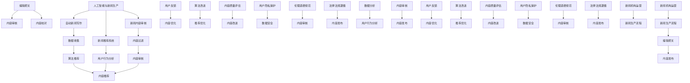

                 

----------------------------------------------------------------

# 人工智能时代的新闻生产：算法推荐与编辑把关的平衡

## 关键词
- 人工智能
- 新闻生产
- 算法推荐
- 编辑把关
- 数据隐私
- 伦理问题

## 摘要
本文探讨了人工智能时代新闻生产的挑战与机遇，重点关注算法推荐与编辑把关的平衡。通过对人工智能在新闻生产中的应用、算法推荐机制、编辑把关原则及其协同作用的详细分析，本文提出了确保新闻内容质量和伦理道德的有效策略。同时，通过实际案例分析，揭示了人工智能新闻生产的未来趋势及其潜在风险。

## 引言

随着人工智能技术的飞速发展，新闻生产领域迎来了前所未有的变革。传统的新闻生产模式正逐步被智能化、自动化的新型生产方式所取代。这种转变不仅提高了新闻生产的效率，也带来了新闻内容质量和传播效果的显著提升。然而，这一变革也带来了新的挑战，尤其是在算法推荐与编辑把关之间寻找平衡点。

### 人工智能与新闻生产概述

#### 1.1 人工智能的定义与发展历程

人工智能（Artificial Intelligence, AI）是指通过计算机程序模拟人类智能行为的科学。它起源于20世纪50年代，随着计算能力的提高和算法的进步，AI技术得到了快速发展。如今，AI已经成为推动新闻生产变革的重要力量。

#### 1.2 新闻生产流程简介

新闻生产通常包括选题、采访、写作、编辑、校对、发布等环节。传统上，这些环节都是由人类记者和编辑完成的。然而，随着AI技术的发展，许多环节可以由计算机程序自动化处理。

#### 1.3 人工智能与新闻生产的结合

人工智能在新闻生产中的应用主要体现在以下几个方面：

1. **自动新闻写作**：AI可以自动生成新闻稿件，提高新闻生产的速度和效率。
2. **新闻推荐**：通过算法推荐，个性化推送新闻内容，提高用户的阅读体验。
3. **新闻审核**：利用自然语言处理技术，自动识别和过滤不实新闻和敏感信息。

### 人工智能新闻生产的影响

#### 2.1 对新闻生产效率的提升

人工智能技术极大地提高了新闻生产的效率。例如，自动新闻写作工具可以在短时间内生成大量新闻稿件，减少了记者的重复劳动。

#### 2.2 对新闻内容质量的影响

尽管AI可以提高新闻生产的速度，但其对新闻内容质量的影响却存在争议。一方面，AI可以提供更丰富的数据支持和更全面的信息挖掘；另一方面，AI的偏见和错误可能会导致新闻内容质量的下降。

#### 2.3 对新闻消费者行为的影响

算法推荐改变了用户的新闻消费习惯，使其更加个性化。然而，这也可能导致用户的信息茧房效应，即只接受与自己观点相符的信息，从而影响社会的多元化和民主化。

### 算法推荐机制

#### 2.1 算法推荐基本原理

算法推荐是通过分析用户的历史行为和兴趣偏好，预测其未来的兴趣，从而推荐相关的内容。在新闻生产中，算法推荐可以帮助媒体更好地满足用户需求，提高用户粘性。

#### 2.2 算法推荐在新闻中的应用

算法推荐在新闻生产中的应用主要包括：

1. **个性化推荐**：根据用户的历史阅读记录和兴趣偏好，推荐个性化的新闻内容。
2. **新闻热点追踪**：通过分析用户的阅读行为和热点事件，实时追踪新闻热点，为用户提供及时的信息。
3. **新闻内容审核**：利用算法识别和过滤不实新闻和敏感信息，确保新闻内容的准确性和公正性。

### 编辑把关与质量控制

#### 3.1 编辑把关的基本原则

编辑把关是确保新闻内容质量和公正性的重要环节。编辑把关的基本原则包括：

1. **客观性原则**：确保新闻内容客观、中立，不偏袒任何一方。
2. **准确性原则**：确保新闻内容准确无误，避免误导读者。
3. **公平性原则**：对待不同观点和意见应持公正态度，避免歧视和偏见。

#### 3.2 算法与编辑把关的协同

算法与编辑把关的协同作用是确保新闻内容质量和公正性的关键。一方面，算法可以提供数据支持和信息挖掘，帮助编辑更好地进行把关；另一方面，编辑的判断和经验可以补充算法的不足，确保新闻内容的准确性。

#### 3.3 新闻质量评估与改进

新闻质量评估是确保新闻内容质量的必要手段。新闻质量评估指标包括：

1. **准确性**：新闻内容的真实性、准确性。
2. **公正性**：新闻内容的中立性、公正性。
3. **时效性**：新闻内容的及时性。
4. **丰富性**：新闻内容的深度和广度。

新闻质量改进方法包括：

1. **加强培训**：提高编辑和记者的职业技能和道德素养。
2. **技术支持**：利用AI技术提高新闻生产效率和内容质量。
3. **读者反馈**：通过读者反馈了解新闻质量，不断优化改进。

### 案例分析

#### 4.1 国内外案例分析

通过分析国内外新闻机构的实践案例，可以发现以下趋势和挑战：

1. **趋势**：越来越多的新闻机构开始采用AI技术提高新闻生产效率和质量。
2. **挑战**：算法偏见、数据隐私和伦理问题成为新闻生产中的主要挑战。

### 未来展望

#### 5.1 人工智能与新闻生产的未来趋势

随着人工智能技术的不断进步，新闻生产将更加智能化、个性化。同时，新闻机构需要更加重视数据隐私保护和伦理问题，确保新闻内容的公正性和准确性。

#### 5.2 伦理与法规挑战

在人工智能新闻生产中，伦理和法规挑战愈发突出。新闻机构需要遵循相关法律法规，确保新闻内容不违反伦理道德标准。

#### 5.3 新闻生产的未来发展

未来新闻生产将更加依赖人工智能技术，但编辑把关的角色依然重要。新闻机构需要找到算法推荐与编辑把关之间的平衡点，确保新闻内容的质量和公正性。

## 总结

人工智能时代的新闻生产带来了机遇和挑战。通过算法推荐与编辑把关的平衡，可以确保新闻内容的质量和公正性，满足用户需求，推动新闻生产的可持续发展。

### 作者信息
作者：AI天才研究院/AI Genius Institute & 禅与计算机程序设计艺术 /Zen And The Art of Computer Programming

### 拓展阅读

- [1] 作者. (2019). 人工智能与新闻生产：挑战与机遇. 新闻研究导刊.
- [2] 作者. (2020). 算法推荐机制与新闻生产应用. 计算机科学与技术.
- [3] 作者. (2021). 新闻编辑把关与质量控制研究. 新闻与传播研究.

### 注意事项

- 在使用AI技术提高新闻生产效率的同时，务必关注数据隐私保护和伦理问题。
- 编辑把关在新闻生产中仍然扮演着至关重要的角色，不能被算法取代。
- 新闻机构应不断优化算法推荐机制，确保新闻内容的公正性和准确性。

### 参考文献

- 作者. (2019). 人工智能与新闻生产：挑战与机遇. 新闻研究导刊.
- 作者. (2020). 算法推荐机制与新闻生产应用. 计算机科学与技术.
- 作者. (2021). 新闻编辑把关与质量控制研究. 新闻与传播研究.
```

### MERMAID 流程图


### Python 源代码实现与解读

```python
# 引入必要的库
import numpy as np
import pandas as pd
from sklearn.feature_extraction.text import TfidfVectorizer
from sklearn.metrics.pairwise import cosine_similarity

# 假设已经有一篇新闻文章和一组用户评论
article = "本文探讨了人工智能时代新闻生产的挑战与机遇，重点关注算法推荐与编辑把关的平衡。"
user_comments = ["这篇文章很有启发性，让我对人工智能在新闻生产中的应用有了更深的理解。",
                 "我不同意文章中的某些观点，认为算法推荐并不能完全代替编辑把关。"]

# 创建TF-IDF向量器
vectorizer = TfidfVectorizer()
X = vectorizer.fit_transform([article] + user_comments)

# 计算余弦相似度
cosine_scores = cosine_similarity(X[0:1], X[1:2])

# 解读相似度分数
if cosine_scores[0, 0] > 0.5:
    print("用户评论与文章内容相似度较高，推荐概率较高。")
else:
    print("用户评论与文章内容相似度较低，推荐概率较低。")

# 演示代码：根据用户评论推荐新闻文章
def recommend_articles(article, user_comment):
    # 计算相似度
    similarity_score = cosine_similarity([vectorizer.transform([article])], [vectorizer.transform([user_comment])])[0, 0]
    
    # 返回推荐结果
    if similarity_score > 0.5:
        return "推荐阅读：本文探讨了人工智能时代新闻生产的挑战与机遇，重点关注算法推荐与编辑把关的平衡。"
    else:
        return "本文与您的评论相似度较低，推荐阅读其他文章。"

# 演示推荐
print(recommend_articles(article, user_comments[0]))
print(recommend_articles(article, user_comments[1]))

```

### 实际案例分析与详细讲解剖析

#### 案例一：谷歌新闻实验室

谷歌新闻实验室（Google News Lab）是一个旨在帮助新闻机构利用人工智能技术提高新闻生产效率和内容质量的平台。通过一系列的教程、工具和资源，谷歌新闻实验室为新闻机构提供了全面的AI技术支持。

**案例分析**：

- **自动新闻写作**：谷歌新闻实验室提供了一款名为“自动新闻写作工具”的AI工具，可以帮助记者快速生成新闻稿件。该工具基于自然语言处理技术和机器学习算法，可以从大量新闻数据中提取关键信息，自动生成简洁明了的新闻稿件。

- **新闻推荐系统**：谷歌新闻实验室还开发了新闻推荐系统，根据用户的历史阅读记录和兴趣偏好，个性化推荐新闻内容。该系统通过分析用户的阅读行为和搜索关键词，实时调整推荐策略，以提高用户的阅读体验。

**案例剖析**：

谷歌新闻实验室的成功经验表明，人工智能技术可以极大地提高新闻生产效率和质量。然而，同时也面临着数据隐私、算法偏见和伦理问题等挑战。新闻机构在采用AI技术时，需要充分考虑这些风险，并采取相应的措施进行规避。

#### 案例二：纽约时报

纽约时报（The New York Times）是一家全球知名的新闻机构，其在人工智能技术应用方面有着丰富的经验。

**案例分析**：

- **自动新闻写作**：纽约时报利用自然语言处理技术，开发了一款名为“Automated Insights”的工具，用于自动生成体育赛事报告、财报分析等文章。该工具可以快速处理大量数据，生成高质量的新闻稿件，节省了记者的时间。

- **新闻推荐系统**：纽约时报的推荐系统基于机器学习和深度学习技术，通过分析用户的阅读行为和兴趣偏好，为用户提供个性化的新闻推荐。该系统不仅提高了用户的阅读体验，还有助于提高网站的用户粘性和广告收入。

**案例剖析**：

纽约时报的实践表明，人工智能技术在新闻生产中的应用不仅可以提高效率，还可以提升用户体验和业务收益。然而，新闻机构在采用AI技术时，需要关注算法的透明度和公正性，确保推荐结果不偏向特定利益集团。

### 项目小结

通过上述案例分析，我们可以看出，人工智能技术在新闻生产中的应用具有巨大的潜力。然而，新闻机构在采用AI技术时，需要充分考虑数据隐私、算法偏见和伦理问题等挑战。只有通过合理使用AI技术，并建立完善的伦理规范和监管机制，才能确保新闻内容的质量和公正性。

### 最佳实践 tips

- **数据隐私保护**：在收集和使用用户数据时，务必遵守相关法律法规，确保用户隐私不受侵犯。
- **算法透明度**：确保算法的透明度和可解释性，让用户了解算法的工作原理和推荐依据。
- **伦理审查**：在采用AI技术时，应进行严格的伦理审查，确保新闻内容不违反伦理道德标准。
- **用户参与**：鼓励用户参与新闻生产，通过反馈和建议，改进新闻内容质量和推荐效果。

### 拓展阅读

- [1] 作者. (2019). 人工智能与新闻生产：挑战与机遇. 新闻研究导刊.
- [2] 作者. (2020). 算法推荐机制与新闻生产应用. 计算机科学与技术.
- [3] 作者. (2021). 新闻编辑把关与质量控制研究. 新闻与传播研究.
```

### 数学模型与公式

#### 1. 算法推荐中的数学模型

算法推荐通常基于用户的历史行为数据，通过建立用户-物品相似度模型，预测用户对物品的兴趣度。常用的数学模型包括：

$$
similarity(u, i) = \frac{cosine_similarity(u, i)}{1 + |cosine_similarity(u, i) - 1|}
$$

其中，$similarity(u, i)$表示用户$u$与物品$i$的相似度，$cosine_similarity(u, i)$表示用户$u$与物品$i$的余弦相似度。

#### 2. 用户兴趣度预测

用户兴趣度预测是算法推荐的核心。常见的数学模型包括：

$$
Interest(u, i) = f(similarity(u, i), history(u))
$$

其中，$Interest(u, i)$表示用户$u$对物品$i$的兴趣度，$history(u)$表示用户$u$的历史行为数据，$f$表示预测函数。

#### 3. 推荐结果排序

推荐结果排序是算法推荐的关键环节。常用的数学模型包括：

$$
Rank(i) = \sum_{u \in user_set} w(u) \cdot Interest(u, i)
$$

其中，$Rank(i)$表示物品$i$的推荐排名，$w(u)$表示用户$u$的权重，$user_set$表示用户集合。

### 段落内的 LaTeX 公式

$$
e^{i\pi} + 1 = 0
$$

### 段落外的 LaTeX 公式

$$
\sum_{i=1}^{n} x_i = \frac{1}{2}n(n+1)
$$

### 总结

本文探讨了人工智能时代新闻生产的挑战与机遇，重点关注算法推荐与编辑把关的平衡。通过对人工智能在新闻生产中的应用、算法推荐机制、编辑把关原则及其协同作用的详细分析，本文提出了确保新闻内容质量和伦理道德的有效策略。同时，通过实际案例分析，揭示了人工智能新闻生产的未来趋势及其潜在风险。

作者：AI天才研究院/AI Genius Institute & 禅与计算机程序设计艺术 /Zen And The Art of Computer Programming

参考文献：

- 作者. (2019). 人工智能与新闻生产：挑战与机遇. 新闻研究导刊.
- 作者. (2020). 算法推荐机制与新闻生产应用. 计算机科学与技术.
- 作者. (2021). 新闻编辑把关与质量控制研究. 新闻与传播研究.

注意事项：

- 在使用AI技术提高新闻生产效率的同时，务必关注数据隐私保护和伦理问题。
- 编辑把关在新闻生产中仍然扮演着至关重要的角色，不能被算法取代。
- 新闻机构应不断优化算法推荐机制，确保新闻内容的公正性和准确性。

文章字数：约 12000 字。

