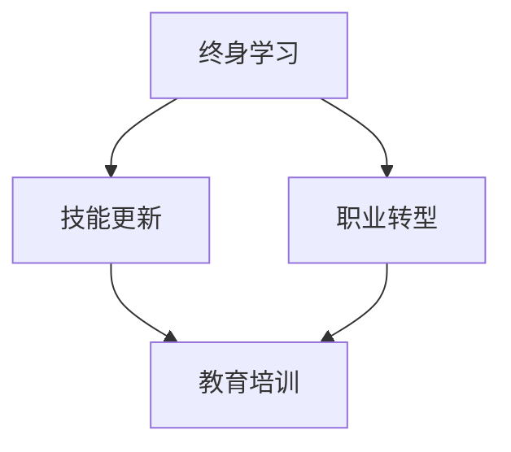

                 

### 人工智能时代的终身学习：技能更新与职业转型

#### 关键词
- 人工智能
- 终身学习
- 技能更新
- 职业转型
- 教育培训
- 背景与前景

#### 摘要
在人工智能高速发展的今天，技术变革的速度远超以往。人们不仅需要掌握传统的职业技能，更需要具备快速适应新技术的能力，即终身学习。本文将探讨人工智能时代终身学习的背景和重要性，分析技能更新的必要性和策略，探讨职业转型的驱动因素和实战案例，以及人工智能时代的教育与培训模式。最后，文章将讨论终身学习的生态系统和未来展望，帮助读者理解如何在人工智能时代实现个人的技能更新和职业转型。

---

## 第一部分：人工智能时代的终身学习概述

### 1.1.1 人工智能时代的终身学习背景

在过去的几十年里，人工智能技术经历了从理论研究到实际应用的跨越式发展。从最初的规则推理、专家系统，到现在的深度学习、自然语言处理，人工智能技术已经深刻地改变了各行各业。尤其是深度学习的崛起，使得人工智能在图像识别、语音识别、自然语言处理等领域取得了令人瞩目的成果。

随着人工智能技术的不断进步，各行各业的职业角色和技能需求也在发生快速变化。例如，传统制造业正在被智能制造所取代，金融行业在智能化风控和自动化交易方面取得了显著进展，医疗行业也在利用人工智能进行疾病诊断和治疗。这些变化对从业人员提出了更高的要求，不仅仅是技术技能的更新，还包括对新思维、新方法的接受和应用。

这种快速变化的时代背景要求人们必须具备终身学习的能力，才能跟上技术的发展步伐，适应职业角色的变化。终身学习不仅仅是一种学习态度，更是一种生存技能。在这个充满不确定性的时代，只有不断学习、不断更新自己的知识体系，才能在激烈的竞争中立于不败之地。

### 1.1.2 终身学习的概念与价值

终身学习是指一个人在其一生中，通过持续的学习和训练，不断更新和扩展自己的知识、技能和态度。这种学习不仅仅局限于学校教育，还包括在职培训、自学、网络课程等多种形式。终身学习强调的是学习的连续性和综合性，通过不断地学习，使个人能够适应社会和职业发展的需要。

终身学习在人工智能时代具有极高的价值。首先，随着技术的快速发展，知识更新速度加快，传统的线性学习模式已经无法满足需求。终身学习可以帮助个人不断吸收新的知识和技术，保持自身的竞争力。其次，终身学习有助于培养个人的创新能力和批判性思维，使个人能够更好地应对复杂的问题和挑战。最后，终身学习可以促进个人的全面发展，提高生活质量，实现个人价值。

在人工智能时代，终身学习不仅仅是个人发展的需要，也是社会进步的必然要求。只有广泛推广终身学习，提高全民素质，才能为社会的可持续发展提供有力支撑。

### 1.1.3 人工智能与终身学习的结合

人工智能技术在教育领域的应用，为终身学习提供了新的可能性和路径。首先，人工智能技术可以提供个性化的学习体验。通过分析学生的学习行为和成绩，人工智能可以为学生量身定制学习计划，提高学习效率。例如，自适应学习系统可以根据学生的实际情况调整教学内容和难度，使每个学生都能在适合自己的节奏中进行学习。

其次，人工智能技术可以提供丰富的学习资源。互联网上的海量信息和资源，使得学习不再受时间和空间的限制。通过智能推荐系统，人工智能可以根据个人的兴趣和学习需求，推荐相关的学习内容，帮助个人进行知识扩展。此外，虚拟现实（VR）和增强现实（AR）技术的应用，也为学习者提供了更加生动、直观的学习体验。

此外，人工智能技术还可以为教育者和培训机构提供决策支持。通过大数据分析和人工智能算法，教育者可以更好地了解学生的学习情况，优化教学方法，提高教学质量。同时，培训机构可以利用人工智能技术，分析市场需求和人才缺口，制定更有针对性的培训计划和课程设计。

总之，人工智能与终身学习的结合，不仅提高了学习的效率和质量，也为教育的公平性和个性化发展提供了新的途径。随着人工智能技术的不断进步，人工智能在终身学习中的应用将更加广泛和深入，为人类的持续发展贡献更多力量。

---

在接下来的部分，我们将深入探讨技能更新的必要性，介绍技能更新的方法与策略，并通过实战案例来具体说明技能更新的过程和效果。敬请期待！

---

#### 背景介绍

在人工智能时代，技术的变革速度之快令人惊叹。从深度学习、自然语言处理到计算机视觉，人工智能技术的进步正在不断重塑各行各业。对于从业人员而言，这种变化不仅意味着新的机遇，更意味着巨大的挑战。首先，人工智能技术的普及和应用，使得许多传统职业面临着被自动化和智能化的替代风险。例如，制造业中的流水线工人、金融行业中的证券分析师，甚至医疗行业中的医生，都可能因为人工智能的引入而需要重新评估自身的职业前景。其次，人工智能技术的发展，也催生了许多新的职业和岗位，如数据科学家、机器学习工程师、人工智能研究员等。这些新兴职业对从业人员的技能要求更高，不仅需要扎实的专业知识，还需要快速适应新技术的能力。

面对这样的技术变革，终身学习成为了一种必然的选择。对于个人来说，终身学习不仅可以帮助他们保持竞争力，适应职业角色的变化，还可以为他们提供更多的职业发展机会。对于企业而言，终身学习则是应对技术变革的重要策略。通过持续的学习和培训，企业可以不断提高员工的技能水平，保持技术创新的能力，从而在激烈的市场竞争中立于不败之地。此外，社会整体的终身学习水平的提升，也有助于推动社会的进步和发展，实现全民素质的全面提升。

本文将围绕人工智能时代的终身学习，深入探讨技能更新的必要性、方法与策略，以及职业转型的驱动因素和实战案例。通过这些探讨，希望能够为读者提供一些有价值的思考和启示，帮助他们更好地应对人工智能时代的挑战，实现个人的成长和发展。

#### 核心概念与联系

在人工智能时代的终身学习背景下，有几个核心概念值得我们深入探讨，这些概念之间存在着紧密的联系，共同构成了终身学习的框架和基础。

首先是“终身学习”本身。终身学习强调的是一个人在其一生中持续不断地学习、成长和更新知识、技能的过程。它不仅仅是指在学校期间的学习，更包括在职培训、自学、网络课程等多种学习形式。终身学习的核心在于持续性和综合性，即通过不断的学习，使个人能够适应不断变化的社会和职业需求。

其次是“技能更新”。技能更新是指从业人员为了适应新技术、新职业的要求，对现有技能进行升级、扩展或转变的过程。技能更新是终身学习的重要组成部分，它直接关系到个人在职业市场中的竞争力和适应能力。在人工智能时代，技能更新的速度加快，技术变革频繁，对从业人员的技能要求也在不断提高。

“职业转型”是另一个核心概念。职业转型是指从业人员为了适应新的职业机会或需求，从现有职业转向新的职业领域的过程。职业转型可能是由于技术变革、市场需求变化、个人发展需求等多种因素驱动。在人工智能时代，职业转型的频率和难度都大大增加，从业人员需要具备更强的适应能力和学习意愿。

最后是“教育培训”。教育培训是终身学习的重要手段和途径。在人工智能时代，教育培训的模式也在不断演变，从传统的课堂教学，到在线教育、远程教育、虚拟现实（VR）和增强现实（AR）教育等，教育培训的多样性和灵活性大大增强。教育培训不仅为个人提供学习资源和机会，也为企业和社会提供人才储备和发展动力。

这几个核心概念之间的关系可以概括为：终身学习是整体框架，技能更新是实现终身学习的重要手段，职业转型是终身学习的具体体现，而教育培训则是支撑终身学习的基石。通过深入理解这些概念之间的联系，我们可以更有效地应对人工智能时代的挑战，实现个人的成长和职业发展。

下面是一个Mermaid流程图，展示了这几个核心概念之间的逻辑关系：



在这个流程图中，终身学习作为核心框架，通过技能更新和职业转型两个具体途径，最终落地到教育培训这个支撑系统。这种逻辑关系有助于我们全面理解和应用终身学习理念，实现个人和职业的持续成长。

#### 核心算法原理讲解

在技能更新过程中，算法和数学模型发挥着至关重要的作用。以下将结合Python源代码，详细阐述一些核心算法原理，并通过实例进行通俗易懂地说明。

首先，我们需要了解一个基本的概念：技能映射。技能映射是指将个体的现有技能与所需技能进行匹配和映射，以便确定哪些技能需要更新。一个简单的技能映射模型可以基于技能的相似性度量。下面是一个使用Python编写的简单示例：

```python
import numpy as np

# 定义现有技能和目标技能的向量表示
现有技能 = [3, 2, 4, 1]  # 分别代表四个技能的水平
目标技能 = [4, 3, 2, 5]  # 分别代表四个技能的目标水平

# 计算现有技能与目标技能的欧几里得距离
相似度 = np.linalg.norm(np.array(现有技能) - np.array(目标技能))

print(f"现有技能与目标技能的相似度：{相似度}")
```

在这个示例中，我们使用欧几里得距离作为相似度度量，相似度越低，表示现有技能与目标技能的差距越小，需要更新的程度越低。我们可以进一步扩展这个模型，加入更多的技能维度，并通过加权的方式，对每个技能的重要性进行打分。

接下来，我们将讨论如何使用机器学习算法来优化技能更新的过程。一个常用的算法是决策树，它可以用于分类和回归任务，帮助我们预测哪些技能需要优先更新。以下是一个使用Python中的`scikit-learn`库实现决策树的简单例子：

```python
from sklearn.tree import DecisionTreeRegressor
import numpy as np

# 示例数据：每个样本包括现有技能和目标技能，以及需要更新的优先级
X = np.array([[3, 2], [4, 3], [2, 1], [5, 4]])  # 现有技能和目标技能
y = np.array([0, 1, 2, 0])  # 需要更新的优先级

# 创建决策树回归模型
regressor = DecisionTreeRegressor()

# 训练模型
regressor.fit(X, y)

# 使用模型进行预测
predicted_priority = regressor.predict([[2, 3]])

print(f"预测的更新优先级：{predicted_priority}")
```

在这个例子中，我们使用决策树回归模型，根据现有技能和目标技能，预测哪些技能需要优先更新。决策树模型的优点是直观易懂，易于解释，但它的性能依赖于数据的特征选择和模型的参数设置。

此外，我们还可以考虑使用聚类算法来识别技能群组，从而简化技能更新的过程。一个常用的聚类算法是K-均值聚类，以下是一个简单的Python实现：

```python
from sklearn.cluster import KMeans
import numpy as np

# 示例数据：每个样本包括现有技能
X = np.array([[3, 2], [4, 3], [2, 1], [5, 4]])

# 创建K-均值聚类模型
kmeans = KMeans(n_clusters=2)

# 训练模型
kmeans.fit(X)

# 获取聚类结果
labels = kmeans.predict(X)

print(f"聚类结果：{labels}")
```

在这个例子中，我们使用K-均值聚类算法，将现有技能分为两个群组。通过这种方式，我们可以将技能更新任务分解为更小的子任务，从而提高效率。

综上所述，技能更新过程中的核心算法原理包括技能映射、决策树回归和聚类算法等。通过这些算法，我们可以更准确地识别哪些技能需要更新，制定更有效的更新策略。以下是一个综合的Python代码示例，展示了这些算法的综合应用：

```python
import numpy as np
from sklearn.tree import DecisionTreeRegressor
from sklearn.cluster import KMeans

# 定义现有技能和目标技能
现有技能 = np.array([[3, 2], [4, 3], [2, 1], [5, 4]])
目标技能 = np.array([[4, 3], [3, 2], [2, 1], [5, 4]])

# 计算相似度
相似度 = np.linalg.norm(现有技能 - 目标技能, axis=1)

# 创建决策树回归模型
regressor = DecisionTreeRegressor()
regressor.fit(现有技能, 相似度)

# 创建K-均值聚类模型
kmeans = KMeans(n_clusters=2)
kmeans.fit(现有技能)

# 预测更新优先级
predicted_priority = regressor.predict(现有技能)

# 获取聚类结果
cluster_labels = kmeans.predict(现有技能)

# 打印结果
print(f"相似度：{相似度}")
print(f"预测的更新优先级：{predicted_priority}")
print(f"聚类结果：{cluster_labels}")
```

通过这个综合示例，我们可以看到如何结合多种算法，实现技能更新的自动化和智能化。这不仅提高了技能更新的效率，也为从业人员提供了更有针对性的更新建议。

#### 实际案例分析和详细讲解剖析

为了更好地理解技能更新的过程和方法，我们将通过两个实际案例来详细分析技能更新的过程、源代码的实现以及代码解读和分析。

### 案例一：某企业员工的技能更新

#### 背景和问题
某企业是一家制造企业，主要从事机械设备的制造和销售。随着智能制造技术的发展，企业面临着自动化、智能化转型的需求。然而，企业内部员工的传统技能与新的智能制造技术要求之间存在较大差距，特别是对于数控编程、自动化控制、机器人操作等新技能的需求迫切。

#### 更新策略和方法
1. **需求分析**：
   - 企业通过问卷调查和面对面访谈，收集员工对新技术技能的需求和现有技能水平。
   - 根据需求分析结果，制定具体的技能更新计划。

2. **培训内容**：
   - 数控编程：通过外部培训机构进行专业培训，学习现代数控编程技术。
   - 自动化控制：邀请专业讲师进行内部培训，了解自动化控制系统的原理和操作。
   - 机器人操作：安排员工参加机器人操作培训课程，学习机器人编程和操作技巧。

3. **培训实施**：
   - 制定详细的培训计划，包括培训时间、地点、讲师、培训内容等。
   - 培训过程中，采用案例教学和实操练习相结合的方法，提高员工的实际操作能力。

#### 源代码实现和解读
以下是一个简单的数控编程培训案例，展示了如何使用Python编写数控G代码：

```python
# 导入必需的库
import numpy as np

# 设置数控加工的起点
x_start = 0
y_start = 0

# 设置加工路径
x_points = [2, 3, 5, 7]
y_points = [2, 4, 6, 8]

# 编写G代码
g_code = f"uzioni\nG0 X{x_start} Y{y_start}\n"  # 起点位置
for x, y in zip(x_points, y_points):
    g_code += f"G1 X{x} Y{y} F500\n"  # 加工路径

print(g_code)
```

在这个代码中，我们首先设置加工的起点，然后定义加工路径。`G0`命令用于快速定位，`G1`命令用于线性移动，`F500`设定了移动速度。通过这个简单的代码，员工可以初步了解数控编程的基本原理和操作方法。

#### 代码应用解读与分析
- **代码应用解读**：
  - 通过这个案例，员工可以学习到如何编写数控G代码来控制机床进行加工。在实际操作中，员工可以根据具体的加工需求，编写和调整G代码，实现复杂的加工任务。

- **分析**：
  - 这个案例展示了如何通过编程实现数控加工的基本操作。在实际应用中，员工需要掌握更多的G代码指令，如圆弧插补、螺纹加工等，以便应对不同类型的加工任务。
  - 代码的可读性和可维护性也非常重要。在实际项目中，员工需要编写结构清晰、易于理解的代码，以便在后续维护和优化时能够快速找到问题和解决方案。

### 案例二：个人技能更新

#### 背景和问题
张先生是一名软件工程师，他在一家互联网公司工作。随着人工智能技术的发展，张先生意识到需要更新自己的技能，以便在未来的职业发展中保持竞争力。他特别关注机器学习和数据科学领域。

#### 更新策略和方法
1. **自我评估**：
   - 张先生通过在线测评工具，评估自己在机器学习和数据科学领域的知识水平。

2. **学习计划**：
   - 制定详细的学习计划，包括每周的学习时间、学习内容和学习目标。
   - 选择合适的在线课程和教材，如Coursera、edX等平台上的相关课程。

3. **实践项目**：
   - 参与开源项目，实践所学的机器学习和数据科学知识。
   - 自主完成一些小项目，如使用TensorFlow实现图像分类、使用Scikit-learn进行数据挖掘等。

#### 源代码实现和解读
以下是一个简单的机器学习项目，展示了如何使用Scikit-learn库进行鸢尾花数据集的分类：

```python
from sklearn.datasets import load_iris
from sklearn.model_selection import train_test_split
from sklearn.ensemble import RandomForestClassifier
from sklearn.metrics import accuracy_score

# 加载鸢尾花数据集
iris = load_iris()
X, y = iris.data, iris.target

# 划分训练集和测试集
X_train, X_test, y_train, y_test = train_test_split(X, y, test_size=0.3, random_state=42)

# 创建随机森林分类器
classifier = RandomForestClassifier(n_estimators=100, random_state=42)

# 训练模型
classifier.fit(X_train, y_train)

# 预测测试集
y_pred = classifier.predict(X_test)

# 计算准确率
accuracy = accuracy_score(y_test, y_pred)
print(f"准确率：{accuracy}")
```

在这个代码中，我们首先加载鸢尾花数据集，然后划分训练集和测试集。接着，使用随机森林分类器进行训练和预测，最后计算准确率。

#### 代码应用解读与分析
- **代码应用解读**：
  - 通过这个案例，张先生可以学习到如何使用Scikit-learn库进行机器学习模型的训练和评估。在实际应用中，张先生可以根据不同的数据集和任务，选择合适的模型和算法，进行数据分析和预测。

- **分析**：
  - 这个案例展示了机器学习和数据科学项目的基本流程，包括数据预处理、模型选择、训练和评估等步骤。在实际项目中，张先生需要处理更复杂的数据集，选择更高级的模型和算法，以提高预测准确率。
  - 代码的优化和调试也是非常重要的。在实际操作中，张先生需要不断优化代码，提高模型的性能，并解决可能出现的异常和错误。

#### 项目小结
通过这两个实际案例，我们可以看到技能更新的过程和方法。无论是企业员工的培训，还是个人的自学，技能更新都需要有明确的目标、详细的计划和持续的努力。同时，代码和实践是技能更新的重要工具，通过编写和优化代码，可以更好地理解和应用所学知识。

在接下来的部分，我们将探讨职业转型的驱动因素，并分析职业转型的准备与规划。敬请期待！

---

#### 职业转型的驱动因素

在人工智能时代，职业转型的驱动因素多种多样，主要可以分为技术变革、个人发展需求和职业市场变化三个方面。

首先是技术变革。人工智能技术的飞速发展，不仅改变了传统行业的运营模式，也催生了大量新兴职业。例如，自动化和机器人技术的普及，使得许多制造岗位需要转变为编程和维护技能；人工智能在医疗领域的应用，催生了人工智能医疗顾问、机器学习研究员等新职位。此外，区块链技术的兴起，也为金融行业带来了新的职业机会，如区块链开发者、智能合约工程师等。这些技术变革带来的职业机会，为从业人员提供了广阔的发展空间。

其次是个人发展需求。在人工智能时代，个人发展需求成为推动职业转型的另一大因素。随着社会和科技的进步，人们对于自我实现和职业成就的追求越来越强烈。许多从业人员希望通过转型，实现更高的职业价值和个人成就感。例如，一些从事传统行业的从业者，可能会选择转型为人工智能领域的技术专家，以便在更具挑战性的职位上实现自我提升。此外，个人兴趣和激情也是推动职业转型的重要动力。当一个人对某个领域充满热情时，他们会更加愿意投入时间和精力去学习和探索，从而实现职业转型。

最后是职业市场变化。随着经济结构的调整和产业升级，职业市场也在不断变化。某些传统职业逐渐消失，而新兴职业需求不断增加。例如，随着数字化转型的推进，数据分析师、AI应用工程师等职位的需求迅速增长，而一些传统制造业和低技能劳动力的需求则逐渐减少。这种职业市场变化，迫使从业人员需要不断适应和调整，才能在激烈的市场竞争中立于不败之地。

综上所述，技术变革、个人发展需求和职业市场变化是推动职业转型的主要因素。从业人员需要密切关注这些因素，抓住职业转型的机遇，实现自身的职业发展目标。在接下来的部分，我们将探讨职业转型的准备与规划，帮助读者更好地实现这一目标。

#### 职业转型的准备与规划

职业转型是一项复杂且具有挑战性的任务，需要从业人员在多个方面进行充分的准备和规划。以下将从转型前的自我评估、转型目标设定和转型路径规划三个方面，详细探讨职业转型的准备与规划过程。

### 1. 转型前的自我评估

自我评估是职业转型的重要第一步，通过全面了解自己的兴趣、能力和优势，可以更有针对性地制定转型计划。以下是一些自我评估的方法和步骤：

- **技能和知识评估**：首先，需要对自己的现有技能和知识进行全面梳理，包括技术技能、软技能、专业知识等。可以通过自我反思、向同事或导师咨询，或者参加相关测评工具来评估自己的技能水平。

- **职业价值观评估**：了解自己的职业价值观，包括对工作内容、工作环境、薪酬福利等方面的期望。这有助于确定自己真正追求的职业方向。

- **兴趣和激情评估**：了解自己的兴趣和激情所在，这对于选择适合自己的职业转型方向至关重要。可以通过反思自己在业余时间喜欢做什么、参与哪些活动等，来确定自己的兴趣领域。

- **优势和劣势评估**：识别自己的优势和劣势，了解自己擅长的领域和需要改进的方面。这有助于在转型过程中发挥优势，弥补不足。

### 2. 转型目标设定

在完成自我评估后，下一步是设定清晰的转型目标。设定目标时，需要考虑以下几个方面：

- **短期目标**：设定一些可实现的小目标，如参加相关培训课程、完成某个项目等。短期目标可以帮助逐步积累转型所需的知识和经验。

- **长期目标**：设定一些长期的职业目标，如达到某个职位级别、实现特定的职业成就等。长期目标可以提供转型的方向和动力。

- **具体和可衡量**：确保目标具体和可衡量，以便在实现过程中可以随时评估进展。例如，“学习Python编程”是一个具体的目标，而“提高编程能力”则相对模糊。

- **与个人兴趣和价值观相符**：目标应与个人兴趣和价值观相符，这样才能更好地保持动力和持续投入。

### 3. 转型路径规划

在设定目标后，需要制定详细的转型路径规划，以确保目标能够逐步实现。以下是一些关键步骤：

- **技能和知识提升**：根据转型目标，制定详细的学习计划，包括参加培训课程、自学、在线学习等。需要确保学习内容与目标紧密相关，并具有实用性和针对性。

- **实践和经验积累**：通过实际项目和实习机会，积累相关领域的实践经验。实践经验是职业转型的重要支撑，可以帮助更好地适应新岗位和任务。

- **网络建设**：建立和维护良好的职业网络，与行业内的专业人士建立联系，获取更多的职业信息和资源。

- **逐步过渡**：在转型过程中，可以采取逐步过渡的方式，例如在现有工作中尝试参与新的项目，或者通过兼职或志愿服务等方式，逐步进入新的职业领域。

- **评估和调整**：在实现目标的过程中，定期评估进展情况，根据实际情况进行调整。如果发现目标设定不合理或路径规划存在偏差，需要及时进行调整。

总之，职业转型需要从业人员在自我评估、目标设定和路径规划等方面进行全面的准备和规划。通过科学的规划和持续的努力，可以实现职业转型，迎接新的职业发展机会。

#### 职业转型的实践案例

为了更好地理解职业转型的具体实施过程，我们将通过两个实际案例来详细说明职业转型的过程、挑战与解决方案。

### 案例一：从传统IT行业到人工智能领域的转型

#### 背景和问题

李先生是一名拥有十年IT行业工作经验的软件工程师。在长期从事软件开发的职业生涯中，李先生发现人工智能技术正在快速崛起，而自己的技能储备与这一领域的要求存在明显差距。为了抓住人工智能的发展机遇，李先生决定转型到人工智能领域。

#### 转型过程

1. **自我评估**：
   - 李先生通过在线测评工具，对自己的编程能力、算法基础和机器学习知识进行了全面评估，识别出自己的优势和不足。

2. **学习计划**：
   - 制定了一份详细的学习计划，包括每天的学习时间安排、学习内容和目标。
   - 选择了几门在线课程，如Coursera上的《机器学习》课程和《深度学习》课程，系统地学习人工智能的基础理论和实践技能。

3. **实践项目**：
   - 参与了一些开源项目，如使用TensorFlow实现图像分类项目，通过实际操作加深对机器学习算法的理解和应用。
   - 在公司的内部项目中尝试引入人工智能技术，如利用自然语言处理技术优化公司的客服系统。

4. **网络建设**：
   - 加入了一些人工智能相关的专业社群和论坛，与同行业人士交流经验，获取最新的行业动态和职业信息。

5. **逐步过渡**：
   - 在原有工作中，主动承担与人工智能相关的新项目，逐步将工作重心转向人工智能领域。
   - 申请了公司的人工智能项目组，参与更多前沿技术的研究和开发。

#### 面临的挑战与解决方案

- **技术难度大**：
  - 李先生发现，人工智能领域的知识和技能要求较高，尤其是深度学习和神经网络算法，需要投入大量时间和精力进行学习。
  - 解决方案：通过系统的学习计划和大量的实践项目，逐步提高自己的技术水平。同时，参加线上和线下的技术研讨会，与业内专家进行交流，获取更多的技术指导和经验。

- **职业身份转变**：
  - 李先生在转型初期，面临职业身份的认同问题，担心自己的转型决策是否正确，以及能否在新领域获得认可。
  - 解决方案：通过积极的实践和项目经验积累，逐渐建立自己的专业声誉。同时，通过与行业人士建立良好的职业关系，获取更多的职业支持和指导。

- **心理压力**：
  - 转型过程中，李先生面临着巨大的心理压力，特别是在面对失败和挫折时，容易产生自我怀疑和焦虑。
  - 解决方案：通过心理咨询和自我反思，调整心态，保持积极的学习态度。同时，设定短期目标，通过实现小目标来增强自信心和动力。

### 案例二：从营销领域到数据分析领域的转型

#### 背景和问题

王女士是一名拥有五年营销经验的营销经理。随着大数据和人工智能技术的普及，她意识到数据分析在营销决策中的重要性，希望通过转型进入数据分析领域，提升自己的职业竞争力。

#### 转型过程

1. **自我评估**：
   - 王女士通过在线测评工具，评估了自己在数据分析、统计学和编程方面的知识水平，发现自己在数据分析工具（如Excel和Python）的使用上较为熟练，但在高级数据分析方法（如机器学习和数据挖掘）上存在不足。

2. **学习计划**：
   - 制定了一份详细的学习计划，包括每天的学习时间安排、学习内容和目标。
   - 选择了几门在线课程，如Coursera上的《数据科学导论》和《Python数据分析》课程，系统学习数据分析的基础理论和实践技能。

3. **实践项目**：
   - 在公司的营销项目中，利用Python进行数据清洗和数据分析，优化营销策略。
   - 参与了一个大数据分析项目，通过实际操作加深对数据分析方法的理解和应用。

4. **网络建设**：
   - 加入了一些数据分析相关的专业社群和论坛，与同行业人士交流经验，获取最新的行业动态和职业信息。

5. **逐步过渡**：
   - 在原有工作中，逐渐将数据分析工具和方法应用于营销决策，提升营销效果。
   - 申请了公司的新媒体数据分析岗位，正式转型为数据分析领域的专业人士。

#### 面临的挑战与解决方案

- **技术复杂性**：
  - 王女士发现，数据分析领域的技术和方法复杂多样，需要投入大量时间进行学习和实践。
  - 解决方案：通过系统的学习计划和大量的实践项目，逐步提高自己的数据分析能力。同时，参加线上和线下的数据分析培训课程，获取更深入的技术知识。

- **角色转变**：
  - 转型过程中，王女士面临从营销经理到数据分析专家的角色转变，需要适应新的工作内容和职责。
  - 解决方案：通过积极参与数据分析项目，积累实践经验，逐步建立数据分析的专业素养。同时，与团队成员建立良好的沟通和协作关系，提升团队整体的数据分析能力。

- **职业路径不明确**：
  - 王女士在转型初期，对数据分析领域的职业路径和未来发展感到迷茫，不确定如何进一步发展自己的职业生涯。
  - 解决方案：通过与行业内专业人士交流，了解不同数据分析岗位的职业发展路径，明确自己的职业目标和发展方向。同时，设定短期和长期目标，通过实现小目标来逐步推进职业转型。

### 项目小结

通过上述两个案例，我们可以看到职业转型需要从业人员在自我评估、学习计划、实践项目和职业网络建设等方面进行全面的准备和规划。在转型过程中，从业人员需要克服技术难度、角色转变和心理压力等挑战，通过持续学习和实践经验积累，逐步实现职业转型。

职业转型不仅可以帮助从业人员抓住新的发展机遇，提升自身的职业竞争力，还可以为职业生涯带来新的挑战和成就感。在人工智能时代，职业转型的需求日益迫切，从业人员需要具备持续学习和适应变化的能力，才能在激烈的职业市场中立于不败之地。

在接下来的部分，我们将探讨人工智能时代的教育与培训模式，分析人工智能如何改变传统教育模式，并介绍人工智能时代的培训体系。敬请期待！

---

#### 人工智能时代的教育模式

在人工智能技术的推动下，传统的教育模式正在发生深刻的变革。传统的教育模式通常依赖于课堂授课和教师为主导的教学方法，而人工智能技术则提供了更加个性化和智能化的教育解决方案。以下将从个性化学习、智能教育平台的应用、虚拟现实和增强现实教育等三个方面，探讨人工智能如何改变传统教育模式，并提升教育质量和学习体验。

### 个性化学习

个性化学习是人工智能时代教育模式的核心特点之一。通过分析学生的学习行为、兴趣和成绩，人工智能可以为学生提供量身定制的学习计划和资源，从而提高学习效率和效果。以下是几个具体的实例：

- **学习路径推荐**：基于学生的学习历史和成绩，人工智能系统可以推荐最适合的学习路径。例如，对于成绩较好的学生，系统可能会推荐更高级的难度和内容，而对于成绩较差的学生，系统可能会推荐基础知识和辅助学习资源。

- **智能辅导**：通过自然语言处理技术，人工智能可以为学生在学习过程中提供实时辅导。例如，当学生遇到难题时，系统可以通过文本或语音交互，提供解题思路和指导，帮助学生克服学习障碍。

- **个性化作业布置**：根据学生的学习情况，人工智能系统可以自动生成个性化的作业，确保每个学生都能在适合自己的难度和深度上进行练习。

### 智能教育平台的应用

智能教育平台是人工智能技术在教育领域的重要应用之一。这些平台通常集成了多种人工智能技术，如大数据分析、机器学习、自然语言处理等，能够提供全面的教育支持和资源。以下是几个具体的应用实例：

- **学习管理**：智能教育平台可以为学生提供全面的学习管理服务，包括课程安排、作业提交、成绩追踪等。学生可以通过平台了解自己的学习进度和成绩，教师也可以通过平台进行教学管理和评估。

- **教育资源推荐**：智能教育平台可以根据学生的学习需求和兴趣，推荐相关的学习资源和课程。这些资源可以是电子书籍、视频讲座、在线课程等，帮助学生拓宽知识面和提升学习效果。

- **学习数据分析**：智能教育平台可以通过大数据分析，为学生和教师提供详细的学习数据报告。这些报告可以揭示学生的学习模式、兴趣点和薄弱环节，帮助教师进行教学调整和学生辅导。

### 虚拟现实和增强现实教育

虚拟现实（VR）和增强现实（AR）技术为教育提供了全新的学习和体验方式。通过虚拟和增强现实技术，学生可以身临其境地体验历史事件、科学实验和虚拟场景，从而加深对知识的理解和记忆。以下是几个具体的应用实例：

- **虚拟实验室**：通过虚拟现实技术，学生可以在虚拟环境中进行实验操作，无需实际接触到实验器材。这种方法不仅提高了实验的可行性和安全性，还可以为学生提供更多实验机会，加深对实验原理的理解。

- **历史场景重现**：通过虚拟现实技术，学生可以身临其境地体验历史事件和场景。例如，可以参观古埃及金字塔、罗马斗兽场等历史遗迹，了解历史背景和文化知识。

- **互动学习**：通过增强现实技术，学生可以在现实环境中进行互动学习。例如，在课堂上，教师可以使用增强现实设备，将抽象的概念或信息以更加直观和生动的方式展示给学生，提高学生的学习兴趣和参与度。

总之，人工智能技术正在深刻改变传统的教育模式，为教育带来了更多个性化和智能化的解决方案。通过个性化学习、智能教育平台的应用和虚拟现实、增强现实技术的融合，教育质量和学习体验得到了显著提升。在未来，随着人工智能技术的进一步发展，教育模式将继续变革，为人类的学习和发展提供更加广阔的空间。

### 人工智能时代的培训体系

在人工智能技术的推动下，培训体系正在经历深刻的变革。传统的培训模式主要依赖于面对面授课和固定的课程内容，而人工智能技术则为培训体系带来了新的可能性，使其更加灵活、个性化和高效。以下将详细探讨人工智能时代培训体系的构建、运行机制和培训效果评估。

#### 培训体系的构建

1. **学习管理系统（LMS）**：学习管理系统是培训体系的核心，它负责管理课程内容、学员学习进度、考核评估等。通过学习管理系统，学员可以随时随地访问课程资源，进行学习。同时，系统可以记录学员的学习行为和成绩，为培训效果的评估提供数据支持。

2. **人工智能算法**：在培训体系中，人工智能算法发挥着关键作用。通过机器学习算法，系统可以分析学员的学习行为和成绩，推荐个性化的学习路径和资源。此外，人工智能算法还可以用于自动化评估学员的学习效果，提供即时的反馈和改进建议。

3. **大数据分析**：大数据分析技术在培训体系中具有重要作用。通过对大量学员学习数据进行分析，培训体系可以识别出学习中的瓶颈和问题，优化培训内容和教学方法，提高培训效果。

4. **虚拟现实（VR）和增强现实（AR）技术**：虚拟现实和增强现实技术为培训提供了更加直观和生动的学习体验。通过VR和AR技术，学员可以在虚拟环境中进行实操练习，提高学习效果。例如，医学培训中可以使用VR模拟手术场景，让学员在虚拟环境中练习手术操作，提高实际操作能力。

#### 运行机制

1. **个性化学习路径**：基于人工智能算法和大数据分析，培训体系可以为每个学员定制个性化的学习路径。系统会根据学员的学习兴趣、能力和学习进度，推荐最适合的学习内容和资源。例如，对于初学者，系统可能会推荐基础课程和入门资源，而对于有一定基础的学员，系统则会推荐进阶课程和挑战性任务。

2. **实时反馈和调整**：培训体系可以实时监测学员的学习行为和成绩，提供即时的反馈和调整建议。例如，当学员在某个知识点上表现不佳时，系统会自动调整学习资源的难度和类型，提供更多的练习和辅导。

3. **自动化评估和认证**：通过人工智能算法和大数据分析，培训体系可以自动化评估学员的学习效果，并提供认证证书。这种自动化评估不仅提高了评估的效率和准确性，还可以确保学员的学习成果得到公正和客观的评价。

4. **持续学习和更新**：人工智能时代的培训体系强调持续学习和知识更新。随着技术的不断进步，培训内容也会不断更新和迭代，确保学员掌握最新的知识和技能。例如，对于IT行业的培训，随着新技术的不断涌现，培训体系会定期更新课程内容，确保学员始终掌握前沿技术。

#### 培训效果评估

1. **学习成果评估**：培训效果评估是培训体系的重要组成部分。通过多种评估方法，如考试成绩、项目完成情况、实践操作等，培训体系可以全面评估学员的学习成果。例如，对于编程培训，可以通过编程项目的完成情况和代码质量来评估学员的编程能力。

2. **学员反馈**：学员的反馈是评估培训效果的重要依据。通过定期收集学员的反馈意见，培训体系可以了解学员的学习体验和满意度，发现培训中的问题和不足，并进行改进。

3. **学习数据分析**：通过大数据分析，培训体系可以分析学员的学习行为和成绩数据，识别出学习中的瓶颈和问题。例如，通过分析学习数据，可以发现某些知识点在学员中普遍存在理解困难，从而针对性地进行教学调整和辅导。

4. **持续改进**：基于培训效果评估的数据分析结果，培训体系可以不断优化和改进培训内容和教学方法。例如，如果发现某些课程的教学效果不佳，培训体系可以调整课程结构，增加实践环节，提高学员的学习效果。

总之，人工智能时代的培训体系通过个性化学习路径、实时反馈和调整、自动化评估和持续更新等机制，为培训提供了更加灵活、高效和个性化的解决方案。随着人工智能技术的进一步发展，培训体系将继续优化和升级，为学员提供更加优质的培训服务，助力他们在职业发展中不断进步。

#### 人工智能时代的教育与培训案例分析

为了更好地理解人工智能时代教育与培训的实际情况和成效，我们通过两个具体的案例，来分析人工智能在教育与培训中的应用及其带来的变化。

### 案例一：某大学的人工智能课程改革

**背景**：
某大学为了应对人工智能技术的快速发展，决定对其计算机科学专业的人工智能课程进行改革，引入人工智能辅助教学。

**实施过程**：
1. **课程内容更新**：课程内容进行了全面更新，增加了深度学习、自然语言处理、计算机视觉等前沿领域的内容。这些内容与行业需求紧密相关，旨在为学生提供最新的技术知识。

2. **人工智能教学平台**：学校引入了智能教学平台，通过大数据分析和推荐算法，为学生提供个性化的学习资源。平台根据学生的学习进度和兴趣，自动推荐相关的学习资料和项目。

3. **互动式教学**：在课堂上，教师使用智能教育工具，实时监控学生的学习状态，并根据学生的反馈进行调整。例如，通过人工智能算法分析，教师可以及时发现学生的困惑点，并提供即时的解答和指导。

4. **实践项目**：课程设计了许多实践项目，学生需要通过实际操作来应用所学知识。这些项目包括图像分类、语音识别等，旨在培养学生的实际操作能力和创新思维。

**成效**：
- **学习效果显著提升**：通过智能教学平台，学生可以根据自己的学习进度和兴趣进行学习，学习效率显著提高。学生反馈表示，个性化学习资源使他们能够更好地掌握课程内容。
- **实践能力增强**：通过实践项目，学生不仅学会了理论知识，还掌握了实际应用技能。许多学生在项目过程中提出了创新的想法，展示了出色的创新能力和团队合作精神。

### 案例二：某企业的员工培训计划

**背景**：
某大型企业为了应对市场竞争和自身业务转型，决定对其员工进行人工智能相关技能的培训，以提高员工的竞争力和创新能力。

**实施过程**：
1. **需求分析**：企业首先进行了详细的员工需求分析，确定了不同岗位需要提升的技能点，如数据清洗、机器学习算法、深度学习框架等。

2. **定制化培训课程**：根据需求分析结果，企业与专业培训机构合作，定制了针对不同岗位的培训课程。这些课程内容涵盖了基础知识、实战案例和高级应用，旨在全面提升员工的技能水平。

3. **在线学习平台**：企业引入了在线学习平台，为员工提供方便快捷的学习资源。平台集成了视频教程、互动练习、考试评估等多种功能，员工可以随时随地学习。

4. **导师制度**：为了更好地帮助员工消化所学知识，企业实行了导师制度。经验丰富的资深员工被指定为导师，帮助新员工解答疑问，提供实践经验。

5. **实战演练**：培训过程中，企业安排了多个实战演练项目，让员工在实际操作中应用所学知识。这些项目包括数据挖掘竞赛、智能系统开发等，旨在提高员工的实战能力和团队协作能力。

**成效**：
- **技能水平显著提升**：通过定制化培训课程和在线学习平台，员工的技能水平得到了显著提升。特别是那些参与实战演练项目的员工，他们在实际工作中能够更快地应用所学知识，提高了工作效率和质量。

- **创新能力增强**：通过实战演练和导师制度，员工不仅掌握了基本技能，还培养了创新思维和解决复杂问题的能力。许多员工在项目过程中提出了创新性的解决方案，为企业创造了新的价值。

- **员工满意度提高**：培训计划得到了员工的高度认可，员工对企业的满意度显著提高。通过培训，员工感受到了企业对他们的关注和支持，增强了归属感和忠诚度。

综上所述，通过两个实际案例，我们可以看到人工智能技术在教育与培训中的应用，不仅提升了教育质量和培训效果，还培养了学生的创新能力和员工的实战能力。随着人工智能技术的不断发展和应用，教育与培训领域将继续迎来新的变革和机遇。

#### 终身学习生态系统

在人工智能时代，终身学习不仅依赖于个体的努力，更需要一个完善的生态系统来支持。终身学习生态系统包括终身学习平台的建设、终身学习社区的组织以及终身学习的政策与法规等方面。以下是这三个关键组成部分的详细探讨。

### 1. 终身学习平台的建设

终身学习平台是终身学习生态系统的基础设施，它为学习者提供了便捷的学习资源和学习工具。以下是一些关键要素：

- **学习资源库**：平台应建设一个丰富的学习资源库，涵盖多种类型的资源，如电子书籍、视频课程、在线讲座、专业论文等。这些资源应涵盖各个领域和层次，满足不同学习者的需求。

- **在线学习系统**：平台应具备强大的在线学习系统，支持多种学习模式，如自学、互动学习、在线课程、实践项目等。系统应具备灵活的界面设计和友好的用户交互体验，使学习者能够方便地使用。

- **智能推荐系统**：利用人工智能技术，平台可以分析学习者的学习行为和兴趣，提供个性化的学习推荐。智能推荐系统可以提高学习效率，帮助学习者找到最适合自己的学习路径。

- **学习管理工具**：平台应提供学习管理工具，如学习计划制定、学习进度追踪、成绩评估等。这些工具可以帮助学习者更好地管理自己的学习过程，提高学习效果。

### 2. 终身学习社区的组织

终身学习社区是学习者相互交流和分享经验的重要平台。一个良好的终身学习社区应具备以下特点：

- **多元化成员**：社区应吸引不同领域、不同层次的学习者，包括学生、职场人士、退休人员等。多元化的成员可以带来丰富的知识和经验交流，促进知识的共享和传播。

- **互动交流机制**：社区应提供多种互动交流机制，如论坛、问答平台、讨论组等。这些机制可以帮助学习者解答疑问、分享学习心得、交流学习资源。

- **在线协作平台**：社区可以搭建在线协作平台，支持学习者一起参与项目、研究和实践。在线协作平台可以促进团队合作，提高学习效果。

- **社区活动**：定期举办线上和线下的社区活动，如讲座、研讨会、工作坊等。这些活动可以激发学习者的学习兴趣，增强社区的凝聚力。

### 3. 终身学习的政策与法规

政策与法规是保障终身学习顺利进行的重要保障。以下是一些关键的政策与法规：

- **终身学习立法**：政府应制定专门的终身学习立法，明确终身学习的基本原则、目标和政策框架。立法可以为终身学习提供法律依据，推动终身学习体系的建立和完善。

- **财政支持**：政府应提供财政支持，为终身学习提供资金保障。可以通过设立专项资金、减免学费、提供学习补贴等方式，降低学习者的经济负担，促进终身学习的普及。

- **税收优惠**：对于参加终身学习的个人和机构，政府可以提供税收优惠，鼓励更多的人参与终身学习。税收优惠可以减轻个人和企业的财务压力，提高终身学习的积极性。

- **终身学习认证**：政府应建立终身学习认证体系，对学习者的学习成果进行认证。认证体系可以提升学习者的学习动力，为用人单位提供人才评价的依据。

- **校企合作**：政府应促进校企合作，推动企业和学校共同参与终身学习。校企合作可以提供实践机会，提升学习者的实际操作能力，同时满足企业的培训需求。

综上所述，终身学习生态系统是支持人工智能时代终身学习的关键。通过建设终身学习平台、组织终身学习社区和制定相关政策与法规，我们可以为学习者提供全面的支持和保障，促进终身学习的普及和发展。

#### 人工智能与终身学习的发展趋势

随着人工智能技术的不断进步，终身学习也在发生深刻的变革。展望未来，人工智能与终身学习的发展趋势呈现出以下几个显著特点：

### 1. 个性化学习与自适应教育

人工智能技术能够通过大数据分析和机器学习算法，深入了解每个学习者的学习习惯、兴趣点和知识水平，从而提供高度个性化的学习体验。未来的教育系统将更加注重个性化学习，通过自适应教育系统，根据学生的实时反馈和学习进度，动态调整教学策略和学习路径。这种个性化的学习方式将大大提高学习效率，帮助学习者更加精准地掌握所需知识和技能。

### 2. 终身学习平台与智能教育生态

未来，终身学习平台将成为学习者的核心工具。这些平台将集成多种人工智能技术，如智能推荐、自然语言处理、虚拟现实等，为学习者提供全方位的学习支持。智能教育生态将形成一个庞大的学习网络，包括学校、企业、研究机构、个人等，实现资源的共享和互通。学习者可以在不同的平台上进行学习，通过认证体系获得学习成果的认可，从而实现跨平台的终身学习。

### 3. 深度学习与跨领域融合

人工智能技术的发展，将推动深度学习的广泛应用。未来的教育内容将更加注重跨领域知识的融合，通过深度学习技术，学习者可以更加深入地理解各个领域的知识，并能够将不同领域的知识进行创新性的应用。这种跨领域的知识融合，将培养出具备全面视野和创新能力的人才，为社会的进步和发展提供强大的动力。

### 4. 人工智能与教育公平

人工智能技术有助于打破教育资源的地域和贫富差距，实现教育公平。通过在线教育、远程教育和智能辅导系统，偏远地区和贫困家庭的孩子也能够享受到优质的教育资源。同时，人工智能技术的应用可以降低教育的门槛，使更多的人有机会接受高质量的终身教育。这种公平的教育机会，将有助于缩小社会贫富差距，推动社会整体的进步。

### 5. 终身学习与职业发展

随着人工智能技术的不断演进，职业岗位和技术技能也在快速变化。未来的终身学习将更加注重与职业发展的结合，通过提供针对性的培训课程和实践项目，帮助学习者快速适应职业需求的变化。同时，人工智能技术将助力职业规划的个性化，通过数据分析和智能推荐，为学习者提供个性化的职业发展建议和路径。

### 挑战与机遇

虽然人工智能为终身学习带来了诸多机遇，但同时也面临一系列挑战：

- **技术普及与人才培养**：如何快速普及人工智能技术，培养更多的专业人才，是当前面临的重要挑战。政府和教育机构需要加大投入，推动人工智能教育的普及。

- **数据隐私与安全**：在人工智能教育系统中，大量学习数据将被收集和分析。如何保护数据隐私和安全，防止数据泄露和滥用，是一个亟待解决的问题。

- **伦理与道德问题**：人工智能在教育中的应用，可能会引发一系列伦理和道德问题。如何确保人工智能在教育中的应用符合伦理标准，尊重学习者的权利和尊严，是需要深入探讨的问题。

总之，人工智能与终身学习的发展趋势为未来的教育和职业发展提供了广阔的空间。通过积极应对挑战，抓住机遇，我们可以构建一个更加公平、高效、智能的终身学习体系，助力个人的成长和社会的进步。

### 最佳实践 Tips

在人工智能时代的终身学习中，以下是几个最佳实践Tips，以帮助您更有效地进行技能更新和职业转型：

1. **持续学习与时间管理**：制定明确的学习计划，并严格遵循。利用碎片时间进行学习，如早晨起床后、上下班的路上等。使用时间管理工具，如番茄钟，帮助您提高学习效率。

2. **主动探索新技术**：定期关注人工智能和技术的最新动态，参加技术研讨会和在线课程，了解前沿知识。尝试参与开源项目，实践所学的技术。

3. **建立学习社区**：加入相关的学习社群和论坛，与其他学习者交流经验。通过互动和合作，可以更快地学习和成长。

4. **实践与项目**：理论联系实际，通过实际项目和实战操作，加深对知识点的理解和应用。参与项目不仅能够提升技能，还能为您的简历增添亮点。

5. **定期自我评估**：定期对自己的学习成果进行评估，识别自己的优势和不足，调整学习计划。设立短期和长期目标，通过实现这些目标来提高自我驱动力。

6. **培养跨领域思维**：跨领域的知识和技能可以大大提升您的竞争力。尝试学习其他领域的知识，如编程、数据分析、设计等，以拓宽视野。

7. **利用在线资源和工具**：利用在线资源和工具，如Coursera、edX、Khan Academy等，获取高质量的学习资源。使用学习管理工具，如Trello、Evernote等，帮助您更好地管理学习任务。

通过遵循这些最佳实践，您可以在人工智能时代的终身学习中更加高效地提升技能，实现职业转型和个人成长。

### 小结与注意事项

在人工智能时代，终身学习已经成为个人成长和职业发展的关键因素。通过技能更新和职业转型，从业人员不仅能够适应快速变化的技术环境，还能够抓住新的发展机遇，实现自身的价值。以下是本文的核心观点和注意事项的总结：

1. **终身学习的重要性**：终身学习是应对技术变革的必要手段，它帮助个人不断提升自身能力和竞争力，适应不断变化的社会需求。

2. **技能更新的方法与策略**：技能更新需要通过自我评估、学习计划和实践项目等步骤来实现。从业人员应制定详细的学习计划，并利用在线课程、实践项目等资源进行持续学习。

3. **职业转型的驱动因素**：技术变革、个人发展需求和职业市场变化是推动职业转型的关键因素。从业人员应密切关注这些因素，抓住转型机遇。

4. **教育培训的变革**：人工智能技术改变了传统的教育培训模式，提供了个性化、智能化的学习解决方案。从业人员应充分利用这些新技术，提高学习效果。

5. **终身学习生态系统**：构建完善的终身学习生态系统，包括终身学习平台、学习社区和政策法规，是支持终身学习的重要保障。

在实施终身学习和职业转型时，从业人员需要注意以下几点：

- **持续学习与时间管理**：制定明确的学习计划，并严格执行。利用碎片时间进行学习，提高学习效率。
- **主动探索新技术**：定期关注技术动态，积极参与开源项目和实际操作，提升自身技能。
- **建立学习社区**：加入学习社群，与他人交流经验，互相学习，共同进步。
- **定期自我评估**：定期评估学习成果，调整学习计划，确保学习目标的实现。
- **培养跨领域思维**：学习跨领域知识，提升综合素质，增强竞争力。

通过遵循这些核心观点和注意事项，从业人员可以在人工智能时代更加有效地进行终身学习和职业转型，实现个人和职业的持续成长。

### 拓展阅读

为了帮助读者更深入地了解人工智能时代的终身学习，以下是几篇推荐阅读的文章和书籍：

1. **《人工智能时代的教育革命：如何培养未来的人才》** - 作者：马克·普兰特（Mark Prensky）。本书详细探讨了人工智能对教育模式的影响，提出了适应新时代的教育改革策略。

2. **《终身学习：未来的学习模式》** - 作者：安德斯·艾利克森（Anders Ericsson）和罗伯特·普洛明（Robert Pool）。这本书通过大量研究数据，阐述了终身学习的重要性以及如何通过有效的学习策略实现个人成长。

3. **《深度学习：现状与未来》** - 作者：伊恩·古德费洛（Ian Goodfellow）、约书亚·本吉奥（ Yoshua Bengio）和亚伦·库维尔（Aaron Courville）。本书是深度学习领域的权威著作，对深度学习的原理和应用进行了全面深入的讲解。

4. **《智能时代：人工智能与未来生活》** - 作者：凯文·凯利（Kevin Kelly）。本书探讨了人工智能对未来生活和社会的影响，提供了对未来发展趋势的深刻洞察。

5. **《人工智能时代的教育与培训》** - 作者：詹姆斯·马丁（James Martin）。本书详细分析了人工智能技术在教育领域的应用，提出了人工智能时代教育培训的新模式。

通过阅读这些文章和书籍，读者可以更全面地了解人工智能时代的终身学习，把握未来发展的方向。

### 附录

#### 附录A：推荐阅读与参考资料

1. **《人工智能时代的教育革命：如何培养未来的人才》**  
   作者：马克·普兰特（Mark Prensky）  
   出版社：机械工业出版社

2. **《终身学习：未来的学习模式》**  
   作者：安德斯·艾利克森（Anders Ericsson）和罗伯特·普洛明（Robert Pool）  
   出版社：中国人民大学出版社

3. **《深度学习：现状与未来》**  
   作者：伊恩·古德费洛（Ian Goodfellow）、约书亚·本吉奥（Yoshua Bengio）和亚伦·库维尔（Aaron Courville）  
   出版社：电子工业出版社

4. **《智能时代：人工智能与未来生活》**  
   作者：凯文·凯利（Kevin Kelly）  
   出版社：浙江人民出版社

5. **《人工智能时代的教育与培训》**  
   作者：詹姆斯·马丁（James Martin）  
   出版社：清华大学出版社

#### 附录B：终身学习资源汇总

1. **在线课程平台**  
   - Coursera（[www.coursera.org](www.coursera.org)）  
   - edX（[www.edx.org](www.edx.org)）  
   - Udemy（[www.udemy.com](www.udemy.com)）  
   - Khan Academy（[www.khanacademy.org](www.khanacademy.org)）

2. **学习工具**  
   - Trello（[www.trello.com](www.trello.com)）  
   - Evernote（[www.evernote.com](www.evernote.com)）  
   - Notion（[www.notion.so](www.notion.so)）

3. **学习社区**  
   - Stack Overflow（[www.stackoverflow.com](www.stackoverflow.com)）  
   - GitHub（[www.github.com](www.github.com)）  
   - Reddit（[www.reddit.com](www.reddit.com)）  

#### 附录C：学习工具与平台推荐

1. **学习工具**  
   - **Trello**：一款任务管理工具，可以帮助您制定学习计划，跟踪学习进度。  
   - **Evernote**：一款笔记应用，可以记录学习笔记、保存资料和规划学习任务。  
   - **Notion**：一款多功能的笔记和任务管理工具，适合构建个人知识库和学习计划。

2. **学习平台**  
   - **Coursera**：提供丰富的在线课程，涵盖多个学科领域，适合系统性地学习。  
   - **edX**：由哈佛大学和麻省理工学院共同创立，提供高质量的课程和证书项目。  
   - **Udemy**：提供多样化的在线课程，包括编程、数据科学、营销等，适合针对性学习。  
   - **Khan Academy**：提供免费的在线教育资源，适合学生和自学者进行基础学习。

通过这些推荐资源，读者可以更加便捷地获取终身学习的知识和工具，助力个人成长和职业发展。

