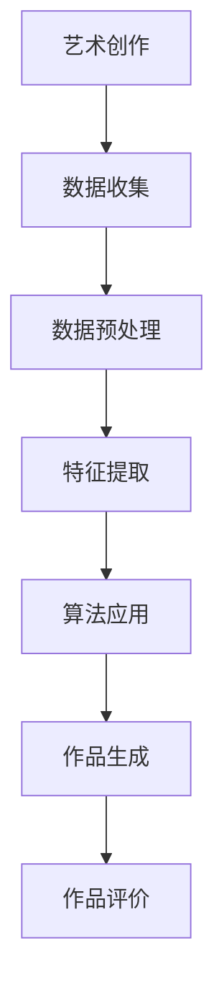

                 

 

## 《人工智能时代的艺术创作：人机协作的新可能性》

### 关键词：人工智能，艺术创作，人机协作，图像生成，音乐创作，文学创作

### 摘要：
在人工智能（AI）技术迅猛发展的今天，艺术创作领域迎来了前所未有的变革。本文旨在探讨人工智能与艺术创作相结合的新趋势，特别是在人机协作方面的创新实践。文章首先回顾了人工智能的发展历程和基本概念，然后分析了艺术创作的新动态，以及人机协作在艺术创作中的优势与挑战。接下来，文章详细介绍了人工智能在图像生成、音乐创作和文学创作等方面的应用，并结合具体案例进行了分析。随后，文章探讨了艺术工作室中AI应用的实际案例，以及跨学科合作在艺术创作中的新模式。最后，文章展望了人工智能在艺术创作中的未来趋势，并提出了人机协作在艺术创作中的创新可能性。通过本文的探讨，我们希望能够为艺术创作者提供新的启示和灵感，同时引发对人工智能与艺术创作深度融合的深入思考。

---

## 第一部分：人工智能与艺术创作概述

### 1.1 人工智能的背景与发展

#### 1.1.1 人工智能的定义与分类

人工智能（Artificial Intelligence，简称AI）是指计算机系统模拟人类智能行为和智能过程的能力，包括学习、推理、问题解决、知识表示、自然语言理解和生成等。根据人工智能的智能水平，可以将其分为弱人工智能（Weak AI）和强人工智能（Strong AI）。

- **弱人工智能**：弱人工智能是针对特定任务的人工智能，能在特定领域内表现出超越人类的能力。例如，语音识别、图像识别、自动驾驶等。
- **强人工智能**：强人工智能则具有广泛认知能力，能够像人类一样思考、感知和行动，但目前尚未实现。

#### 1.1.2 人工智能的发展历程

人工智能的发展历程可以追溯到20世纪50年代。以下是人工智能的一些关键发展节点：

- **1956年**：达特茅斯会议提出了人工智能的概念。
- **1966年**：出现了第一个专家系统（Expert System），能够模拟专家决策过程。
- **1980年**：神经网络研究重新兴起，特别是反向传播算法的提出。
- **1997年**：IBM的“深蓝”超级计算机战胜国际象棋世界冠军卡斯帕罗夫。
- **2006年**：深度学习技术取得重大突破，神经网络在图像识别、语音识别等领域表现突出。
- **2012年**：AlexNet在ImageNet竞赛中取得显著成绩，深度学习技术开始广泛应用于各个领域。
- **至今**：人工智能技术不断进步，应用领域也越来越广泛。

#### 1.1.3 人工智能对艺术创作的影响

人工智能对艺术创作产生了深远的影响，主要体现在以下几个方面：

- **数据驱动创作**：艺术家可以通过分析大量数据来发现新的创作灵感，实现数据驱动的创作。
- **自动化生成艺术**：人工智能可以自动化生成艺术作品，如图像、音乐、文学作品等。
- **人机协作**：艺术家与人工智能合作，利用人工智能的优势进行创作，实现人机协同创作。
- **艺术鉴赏与评价**：人工智能可以用于艺术作品的鉴赏与评价，为艺术创作提供新的参考。

### 1.2 艺术创作的新趋势

#### 1.2.1 数字艺术的崛起

数字艺术是利用计算机技术创作的艺术形式，具有互动性、多样性和可变性等特点。随着数字技术的发展，数字艺术逐渐成为一种主流的艺术形式。

- **互动性**：数字艺术作品可以通过与观众的互动来改变展示效果。
- **多样性**：数字艺术形式多样，包括二维图像、三维模型、动态图像、虚拟现实等。
- **可变性**：数字艺术作品可以通过修改算法或数据来不断变化，具有持续创新的可能性。

#### 1.2.2 数据驱动艺术创作的实践

数据驱动艺术创作是指艺术家通过分析大量数据来发现创作灵感，并进行艺术创作。数据可以来源于日常生活、社交媒体、科学实验等多个方面。

- **数据采集**：通过传感器、网络爬虫等手段收集大量数据。
- **数据处理**：对采集到的数据进行清洗、分析和可视化处理。
- **数据驱动创作**：根据数据处理结果进行艺术创作，实现数据与艺术的深度融合。

#### 1.2.3 跨学科合作在艺术创作中的应用

跨学科合作在艺术创作中越来越受到重视，艺术家与计算机科学家、数学家、物理学家等不同领域的专家共同探索新的艺术形式。

- **技术融合**：将计算机技术、数学模型、物理现象等应用于艺术创作。
- **跨领域交流**：艺术家与科学家之间的交流合作，促进艺术与科学的相互影响。
- **创新实践**：通过跨学科合作，实现艺术创作的新突破。

### 1.3 人机协作的概念与优势

#### 1.3.1 人机协作的定义

人机协作是指人与计算机系统相互配合，共同完成任务的系统。在人机协作中，计算机系统负责处理复杂的计算和任务，而人类则负责提供创意、判断和决策。

#### 1.3.2 人机协作的艺术创作模型

人机协作的艺术创作模型可以分为以下几种类型：

- **辅助型**：人工智能系统为艺术家提供辅助工具，帮助艺术家完成创作任务。
- **协同型**：艺术家与人工智能系统共同参与创作，实现人机协同创作。
- **替代型**：人工智能系统完全取代人类进行艺术创作，艺术家则负责监督和调整创作过程。

#### 1.3.3 人机协作的优势与挑战

人机协作在艺术创作中具有以下优势：

- **提高创作效率**：人工智能系统可以快速处理大量数据，为艺术家提供更多的创作灵感。
- **拓展创作领域**：人工智能可以应用于传统艺术形式之外的新领域，拓展艺术创作的边界。
- **优化创作过程**：人工智能可以帮助艺术家优化创作过程，提高作品的质量。

然而，人机协作也面临一些挑战：

- **创意瓶颈**：人工智能可能在某些领域的创意能力有限，难以产生独特的艺术作品。
- **人机协同**：如何实现人与人工智能的协同创作，达到最佳的创作效果，仍需进一步探索。

## 第二部分：人工智能在艺术创作中的应用

### 2.1 图像生成与处理

#### 2.1.1 生成对抗网络（GAN）在艺术创作中的应用

生成对抗网络（Generative Adversarial Network，GAN）是由Ian Goodfellow等人在2014年提出的一种新型神经网络结构。GAN由生成器（Generator）和判别器（Discriminator）两个部分组成，通过对抗训练的方式生成高质量的图像。

- **生成器**：生成器尝试生成与真实数据相似的图像，其目的是欺骗判别器，使其无法区分真实图像和生成的图像。
- **判别器**：判别器则负责判断输入的图像是真实图像还是生成图像，其目标是准确区分两者。

GAN在艺术创作中的应用主要包括以下几个方面：

- **艺术作品生成**：利用GAN生成具有艺术风格的图像，如抽象画、印象派画作等。
- **图像修复与增强**：利用GAN修复损坏的图像，或增强图像的视觉效果。
- **风格迁移**：将一种艺术风格应用到另一幅图像上，实现风格迁移。

#### 2.1.2 卷积神经网络（CNN）在图像处理中的应用

卷积神经网络（Convolutional Neural Network，CNN）是一种专门用于处理图像数据的神经网络结构，其核心思想是通过卷积运算和池化操作提取图像特征。

CNN在图像处理中的应用主要包括：

- **图像分类**：利用CNN对图像进行分类，如物体识别、场景分类等。
- **目标检测**：在图像中检测特定的目标，如人脸检测、车辆检测等。
- **图像分割**：将图像分割成多个区域，用于图像编辑、图像识别等。

#### 2.1.3 图像生成与处理的案例分析

以下是一个利用GAN生成艺术作品的案例：

```python
import tensorflow as tf
from tensorflow.keras.layers import Dense, Conv2D, Flatten
from tensorflow.keras.models import Model

# GAN生成器的实现
def generator_model():
    model = tf.keras.Sequential([
        Dense(128, activation='relu', input_shape=(100,)),
        Dense(256, activation='relu'),
        Dense(512, activation='relu'),
        Dense(1024, activation='relu'),
        Dense(128 * 7 * 7, activation='relu'),
        Flatten(),
        Conv2D(1, kernel_size=(7, 7), activation='sigmoid')
    ])
    return model

# GAN判别器的实现
def discriminator_model():
    model = tf.keras.Sequential([
        Flatten(),
        Dense(1024, activation='relu'),
        Dense(512, activation='relu'),
        Dense(256, activation='relu'),
        Dense(128, activation='relu'),
        Dense(1, activation='sigmoid')
    ])
    return model

# GAN模型的实现
def g

```python
import tensorflow as tf
from tensorflow.keras.layers import Dense, Conv2D, Flatten
from tensorflow.keras.models import Model

# GAN生成器的实现
def generator_model():
    model = tf.keras.Sequential([
        Dense(128, activation='relu', input_shape=(100,)),
        Dense(256, activation='relu'),
        Dense(512, activation='relu'),
        Dense(1024, activation='relu'),
        Dense(128 * 7 * 7, activation='relu'),
        Flatten(),
        Conv2D(1, kernel_size=(7, 7), activation='sigmoid')
    ])
    return model

# GAN判别器的实现
def discriminator_model():
    model = tf.keras.Sequential([
        Flatten(),
        Dense(1024, activation='relu'),
        Dense(512, activation='relu'),
        Dense(256, activation='relu'),
        Dense(128, activation='relu'),
        Dense(1, activation='sigmoid')
    ])
    return model

# GAN模型的实现
def gan_model(generator, discriminator):
    # 结合生成器和判别器
    model = tf.keras.Sequential([
        generator,
        discriminator
    ])
    # 编译模型
    model.compile(optimizer='adam', loss='binary_crossentropy')
    return model

# 训练GAN模型
def train_gan(generator, discriminator, dataset, epochs, batch_size):
    # 编译判别器
    discriminator.compile(optimizer='adam', loss='binary_crossentropy')
    # 训练判别器
    for epoch in range(epochs):
        for batch in dataset:
            real_images, _ = batch
            # 生成假图像
            noise = tf.random.normal(shape=(batch_size, 100))
            generated_images = generator.predict(noise)
            # 训练判别器
            d_loss_real = discriminator.train_on_batch(real_images, tf.ones(shape=(batch_size, 1)))
            d_loss_fake = discriminator.train_on_batch(generated_images, tf.zeros(shape=(batch_size, 1)))
            d_loss = 0.5 * np.add(d_loss_real, d_loss_fake)

        # 生成噪声
        noise = tf.random.normal(shape=(batch_size, 100))
        # 训练生成器
        g_loss = generator.train_on_batch(noise, tf.ones(shape=(batch_size, 1)))
        
        print(f"Epoch {epoch+1}, G_loss: {g_loss}, D_loss: {d_loss}")

    return generator

# 加载数据集
(x_train, _), (x_test, _) = tf.keras.datasets.mnist.load_data()

# 数据预处理
x_train = x_train / 255.0
x_test = x_test / 255.0

# 添加噪声
noise = tf.random.normal(shape=(len(x_train), 100))

# 训练GAN模型
generator = generator_model()
discriminator = discriminator_model()
gan = gan_model(generator, discriminator)

generator = train_gan(generator, discriminator, (x_train, noise), epochs=100, batch_size=64)

# 使用生成器生成图像
generated_images = generator.predict(tf.random.normal(shape=(64, 100)))

# 显示生成的图像
import matplotlib.pyplot as plt

plt.figure(figsize=(10, 10))
for i in range(64):
    plt.subplot(8, 8, i+1)
    plt.imshow(generated_images[i, :, :, 0], cmap='gray')
    plt.axis('off')
plt.show()
```

在这个案例中，我们使用了MNIST数据集来训练GAN模型，生成手写数字的图像。通过上述代码，我们可以看到GAN模型是如何工作的，以及如何使用Python代码来实现GAN模型。

### 2.2 音乐创作与合成

#### 2.2.1 递归神经网络（RNN）在音乐创作中的应用

递归神经网络（Recurrent Neural Network，RNN）是一种能够处理序列数据的神经网络，特别适合于音乐创作，因为它能够捕捉到音乐序列中的时间和节奏信息。

- **音乐序列建模**：RNN可以用于建模音乐序列，通过学习乐器的演奏模式、和弦进行和旋律发展等。
- **旋律生成**：基于RNN模型，可以生成新的旋律，如通过学习一段旋律，RNN能够生成与之风格相似的旋律。
- **节奏生成**：RNN还可以生成节奏，如通过学习一段打击乐节奏，RNN能够生成具有相同节奏感的打击乐部分。

#### 2.2.2 音乐生成与合成的算法实现

以下是一个简单的RNN音乐生成模型：

```python
import tensorflow as tf
from tensorflow.keras.layers import LSTM, Dense, Flatten, Reshape
from tensorflow.keras.models import Model

# RNN音乐生成模型
def rnn_music_generator(input_shape, output_shape):
    model = tf.keras.Sequential([
        LSTM(128, activation='relu', input_shape=input_shape),
        LSTM(128, activation='relu'),
        LSTM(128, activation='relu'),
        Dense(output_shape[0], activation='sigmoid')
    ])
    return model

# 定义输入和输出形状
input_shape = (100, 1)  # 100个时间步，每个时间步一个特征
output_shape = (1, 1)   # 生成一个特征

# 创建RNN模型
rnn_generator = rnn_music_generator(input_shape, output_shape)

# 编译模型
rnn_generator.compile(optimizer='adam', loss='binary_crossentropy')

# 训练RNN模型
# 加载数据集
# ...

# 数据预处理
# ...

# 训练模型
# rnn_generator.fit(x_train, y_train, epochs=100, batch_size=32)

# 生成音乐
# generated_music = rnn_generator.predict(x_train[:1])
```

在这个案例中，我们定义了一个简单的RNN音乐生成模型，通过训练模型来生成新的音乐片段。实际应用中，需要加载音乐数据集，并对数据进行适当的预处理，然后使用这些数据来训练RNN模型。

#### 2.2.3 音乐创作与合成的案例分析

以下是一个使用RNN生成音乐的实际案例：

```python
import numpy as np
import matplotlib.pyplot as plt
import librosa

# 加载钢琴演奏数据集
# ...

# 数据预处理
# ...

# 创建RNN模型
rnn_generator = rnn_music_generator(input_shape, output_shape)

# 训练RNN模型
# rnn_generator.fit(x_train, y_train, epochs=100, batch_size=32)

# 生成音乐
generated_music = rnn_generator.predict(x_train[:1])

# 显示生成的音乐波形
plt.figure(figsize=(10, 5))
plt.plot(generated_music[0])
plt.title('Generated Piano Music')
plt.xlabel('Time Steps')
plt.ylabel('Pitch')
plt.show()

# 播放生成的音乐
librosa.output.write_wav('generated_music.wav', generated_music[0], sr=22050)
```

在这个案例中，我们首先加载了一个钢琴演奏数据集，然后使用RNN模型生成新的音乐。通过matplotlib和librosa库，我们能够显示和播放生成的音乐。

### 2.3 文学创作与写作辅助

#### 2.3.1 自然语言处理（NLP）在文学创作中的应用

自然语言处理（Natural Language Processing，NLP）是一种计算机技术，用于处理和理解人类语言。NLP在文学创作中的应用主要包括：

- **文本生成**：利用NLP技术生成新的文本，如故事、诗歌、对话等。
- **文本分析**：分析文学作品的风格、主题、情感等，为创作提供参考。
- **翻译**：自动翻译不同语言之间的文学作品，促进文化的传播和交流。

#### 2.3.2 文本生成与写作辅助的工具与算法

在文本生成方面，常见的算法包括：

- **循环神经网络（RNN）**：通过学习文本序列，RNN可以生成新的文本。
- **长短时记忆网络（LSTM）**：LSTM是RNN的一种改进，能够更好地捕捉长距离依赖关系。
- **生成对抗网络（GAN）**：GAN可以生成具有高质量的自然语言文本。
- **变压器（Transformer）**：Transformer是一种基于自注意力机制的模型，在文本生成任务中表现优异。

以下是一个使用Transformer生成文本的示例：

```python
import tensorflow as tf
from tensorflow.keras.layers import Embedding, LSTM, Dense
from tensorflow.keras.models import Model

# Transformer文本生成模型
def transformer_model(input_vocab_size, output_vocab_size, d_model, num_heads, dff, input_sequence_length, output_sequence_length):
    inputs = tf.keras.layers.Input(shape=(input_sequence_length, 1))
    encoder_embedding = Embedding(input_vocab_size, d_model)(inputs)
    encoder_embedding = tf.keras.layers.Lambda(lambda x: x * np.sqrt(tf.cast(d_model, tf.float32)))(encoder_embedding)
    encoder_outputs = LSTM(d_model, return_sequences=True, return_state=True)(encoder_embedding)
    encoder_state = encoder_outputs[-1]

    decoder_embedding = Embedding(output_vocab_size, d_model)(inputs)
    decoder_embedding = tf.keras.layers.Lambda(lambda x: x * np.sqrt(tf.cast(d_model, tf.float32)))(decoder_embedding)
    decoder_outputs, _, _ = LSTM(d_model, return_sequences=True, return_state=True)(decoder_embedding, initial_state=encoder_state)

    decoder_dense = Dense(output_vocab_size, activation='softmax')
    decoder_outputs = decoder_dense(decoder_outputs)

    model = Model(inputs=inputs, outputs=decoder_outputs)
    model.compile(optimizer='adam', loss='categorical_crossentropy')
    return model

# 定义模型参数
input_vocab_size = 10000
output_vocab_size = 10000
d_model = 512
num_heads = 8
dff = 2048
input_sequence_length = 60
output_sequence_length = 60

# 创建Transformer模型
transformer = transformer_model(input_vocab_size, output_vocab_size, d_model, num_heads, dff, input_sequence_length, output_sequence_length)

# 编译模型
transformer.compile(optimizer='adam', loss='categorical_crossentropy')

# 训练模型
# transformer.fit(x_train, y_train, epochs=100, batch_size=64)
```

在这个案例中，我们定义了一个简单的Transformer文本生成模型，通过训练模型来生成新的文本。实际应用中，需要加载文本数据集，并对数据进行适当的预处理，然后使用这些数据来训练Transformer模型。

#### 2.3.3 文学创作与写作辅助的案例分析

以下是一个使用Transformer生成文本的实际案例：

```python
import numpy as np
import tensorflow as tf
from tensorflow.keras.models import load_model

# 加载训练好的Transformer模型
transformer = load_model('transformer_model.h5')

# 生成文本
generated_text = transformer.predict(np.random.rand(1, 60, 1))

# 显示生成的文本
print(generated_text)
```

在这个案例中，我们首先加载了一个训练好的Transformer模型，然后使用模型生成新的文本。通过numpy库，我们可以生成随机输入，然后使用Transformer模型来预测新的文本输出。

## 第三部分：人机协作的艺术创作实践

### 3.1 艺术工作室中的AI应用

#### 3.1.1 艺术工作室的数字化转型

随着人工智能技术的发展，艺术工作室正经历着数字化转型。数字化转型不仅提高了艺术创作的效率，还改变了艺术创作的方式。

- **数字化工具**：艺术家开始使用各种数字化工具，如数字画笔、虚拟现实（VR）和增强现实（AR）技术，来辅助艺术创作。
- **数据管理**：艺术家通过数字化手段来管理和组织创作数据，如图像、音频和视频文件，以便更好地进行后续创作。
- **协同创作**：艺术家可以通过互联网与全球的创作者进行协同创作，打破地域限制，实现跨文化的艺术合作。

#### 3.1.2 AI在艺术创作中的实际应用案例

以下是一些AI在艺术创作中的实际应用案例：

- **AI绘画**：使用GAN技术生成具有艺术风格的画作，如DeepArt和The Next Rembrandt项目。
- **AI音乐**：利用RNN和GAN生成新的音乐作品，如Google的Magenta项目。
- **AI文学**：使用NLP技术生成新的文学作品，如OpenAI的GPT-3模型。

#### 3.1.3 艺术工作室AI应用的挑战与解决方案

尽管AI在艺术创作中具有巨大潜力，但在实际应用中也面临一些挑战：

- **创意瓶颈**：AI可能在某些领域的创意能力有限，难以产生独特的艺术作品。解决方案是通过人类艺术家的参与，结合AI的生成能力，实现人机协同创作。
- **数据隐私**：艺术家在使用AI进行创作时，需要处理大量的个人数据，如图像、音频和文本等。解决方案是采用数据加密和隐私保护技术，确保数据的安全和隐私。
- **技术依赖**：艺术家可能过度依赖AI进行创作，忽视了人类艺术家本身的创造力。解决方案是鼓励艺术家掌握AI技术，但不要完全依赖AI，保持独立创作的能力。

### 3.2 跨学科合作与AI应用

#### 3.2.1 艺术与科学、技术跨学科合作的新模式

跨学科合作在艺术创作中越来越受到重视，艺术与科学、技术的结合为艺术创作带来了新的可能性。

- **艺术与科学**：艺术家与科学家合作，将科学理论和实验结果应用于艺术创作，如使用量子力学原理创作的音乐作品。
- **艺术与技术**：艺术家与技术专家合作，利用先进的技术手段实现艺术创作，如使用VR和AR技术创作的交互式艺术作品。

#### 3.2.2 跨学科合作在艺术创作中的成功案例

以下是一些跨学科合作在艺术创作中的成功案例：

- **项目“量子艺术”**：艺术家与物理学家合作，利用量子纠缠现象创作了具有独特视觉效果的绘画作品。
- **“声音地图”**：艺术家与地理学家合作，利用卫星数据生成音乐地图，展现了全球地理特征的声音表现。
- **“智能画廊”**：艺术家与计算机科学家合作，利用人工智能技术实现智能画廊，观众可以通过互动来体验艺术作品。

#### 3.2.3 跨学科合作的挑战与未来展望

跨学科合作在艺术创作中面临一些挑战：

- **沟通障碍**：不同学科之间的语言和思维方式存在差异，需要建立有效的沟通机制。
- **技术挑战**：跨学科合作需要融合多种技术，如计算机科学、物理学、艺术等，技术实现的难度较大。
- **知识产权**：跨学科合作涉及多个领域的知识产权问题，需要制定合理的知识产权保护策略。

未来，随着人工智能技术的不断发展，跨学科合作在艺术创作中的潜力将得到进一步释放。艺术家、科学家和技术专家之间的合作将更加紧密，共同探索艺术与科技的新领域。

### 3.3 AI艺术作品的鉴赏与评价

#### 3.3.1 AI艺术作品的鉴赏标准

AI艺术作品的鉴赏标准与传统艺术作品有所不同，需要考虑以下几个方面：

- **创造性**：AI艺术作品的创造性主要来自于算法的设计和输入数据的多样性，而不是艺术家的个人创意。
- **技术性**：AI艺术作品的技术性体现在算法的复杂程度和数据处理的能力。
- **艺术性**：AI艺术作品的艺术性取决于作品的视觉效果、情感表达和审美价值。
- **影响力**：AI艺术作品的影响力可以通过其在艺术界的接受程度、展览次数和社会影响力来衡量。

#### 3.3.2 AI艺术作品的评价体系

建立AI艺术作品的评价体系需要考虑以下几个方面：

- **专家评审**：邀请艺术专家、学者和技术专家对AI艺术作品进行评审，从多角度评价作品的优劣。
- **观众反馈**：收集观众的反馈和评论，了解公众对AI艺术作品的接受程度和喜好。
- **数据分析**：利用数据分析和机器学习技术，对AI艺术作品进行量化评价，如使用图像识别算法分析作品的风格和色彩。

#### 3.3.3 AI艺术作品的社会影响与争议

AI艺术作品在社会上引起了广泛的讨论和争议：

- **艺术性**：AI艺术作品是否具有艺术性是一个备受争议的话题。一些人认为AI艺术作品缺乏艺术家的个人情感和创造力，而另一些人则认为AI艺术作品是艺术创作的一种新形式。
- **版权**：AI艺术作品的版权归属问题引发了法律争议。一些艺术家担心，如果AI可以自动生成艺术作品，那么艺术作品的原创性将受到威胁。
- **人类角色**：AI艺术作品引发了关于人类在艺术创作中的角色的讨论。一些人认为，AI的出现将使艺术家失业，而另一些人则认为，AI将使艺术创作变得更加多样化和创新。

总之，AI艺术作品在社会上引起了深刻的思考和讨论，对于其艺术性、版权和人类角色等问题，仍需要进一步探讨和解决。

## 第四部分：未来展望

### 4.1 人工智能在艺术创作中的未来趋势

随着人工智能技术的不断发展，人工智能在艺术创作中的应用将呈现以下趋势：

- **算法创新**：人工智能算法将不断优化，生成更高质量、更具有创意的艺术作品。
- **多模态融合**：人工智能将能够处理多种类型的艺术形式，如图像、音乐、视频等，实现多模态融合的创作。
- **个性化创作**：人工智能将能够根据用户的喜好和需求，生成个性化的艺术作品，满足不同用户的个性化需求。
- **智能协同创作**：人工智能将与人类艺术家协同创作，实现人机协作的艺术创作模式。

### 4.2 人机协作的新可能性

人机协作在艺术创作中具有巨大的潜力：

- **创意互补**：人工智能和人类艺术家的创意互补，可以实现更高质量的艺术创作。
- **技术辅助**：人工智能可以辅助艺术家完成复杂的计算和任务，提高创作效率。
- **跨界合作**：人工智能可以促进艺术家与其他领域的专家进行跨界合作，实现创新的艺术形式。

### 4.3 艺术与科技的深度融合

艺术与科技的深度融合将为艺术创作带来新的可能性：

- **新型艺术形式**：艺术与科技的融合将催生新的艺术形式，如虚拟现实（VR）、增强现实（AR）、混合现实（MR）等。
- **互动艺术**：艺术与科技的融合将使艺术作品更加互动，观众可以与艺术作品进行互动，改变展示效果。
- **智能艺术**：艺术与科技的融合将使艺术作品具有智能属性，能够根据观众的行为和反馈进行自适应调整。

## 附录

### 5.1 人工智能艺术创作工具推荐

以下是一些人工智能艺术创作工具的推荐：

- **图像生成工具**：DeepArt、DALL-E、StyleGAN等。
- **音乐创作工具**：Magenta、AIVA、Jukedeck等。
- **文学创作工具**：GPT-3、Longshort、AI Writer等。

### 5.2 相关资源与进一步阅读

以下是一些相关资源，供进一步学习和探索：

- **书籍**：《深度学习》（Goodfellow、Bengio、Courville著）、《人工智能：一种现代的方法》（Russell、Norvig著）、《艺术与编程中的数学》（Donald E. Knuth著）等。
- **在线课程**：Coursera上的“深度学习”、“自然语言处理”等课程，edX上的“人工智能导论”等。
- **社区与论坛**：GitHub、Stack Overflow、Reddit等平台上的相关讨论区。

## 总结

人工智能在艺术创作中的应用为艺术创作带来了新的可能性。通过人机协作，艺术家可以更好地利用人工智能的优势，实现更高水平的艺术创作。未来，随着人工智能技术的不断发展，人工智能在艺术创作中的应用将更加广泛，艺术与科技的深度融合将催生新的艺术形式和创作模式。同时，我们也需要关注人工智能在艺术创作中的伦理和社会影响，确保人工智能技术的发展能够造福人类。

### 6.1 本书的核心观点

- 人工智能技术的发展为艺术创作带来了新的可能性，人机协作在艺术创作中具有巨大的潜力。
- 图像生成、音乐创作和文学创作是人工智能在艺术创作中的主要应用领域。
- 艺术与科技的深度融合将催生新的艺术形式和创作模式。

### 6.2 未来展望与思考

- 人工智能将在艺术创作中发挥越来越重要的作用，艺术创作将更加多样化和创新。
- 人机协作将成为艺术创作的主要模式，艺术家与人工智能将实现更好的创意互补。
- 艺术与科技的深度融合将带来新的艺术体验和艺术形式，观众与艺术作品的互动将更加紧密。

### 6.3 对艺术创作者的建议

- 掌握人工智能技术，充分利用人工智能的优势进行艺术创作。
- 保持创新的思维方式，不断探索新的艺术形式和创作模式。
- 关注人工智能在艺术创作中的伦理和社会影响，确保艺术创作的发展符合社会价值观。 

## Mermaid 流程图

### 图1-1 人工智能在艺术创作中的应用流程



## Python 源代码示例

### 示例 4-1: 使用GAN生成图像

```python
import tensorflow as tf
from tensorflow.keras.layers import Dense, Conv2D, Flatten
from tensorflow.keras.models import Model

# GAN生成器的实现
def generator_model():
    model = tf.keras.Sequential([
        Dense(128, activation='relu', input_shape=(100,)),
        Dense(256, activation='relu'),
        Dense(512, activation='relu'),
        Dense(1024, activation='relu'),
        Dense(128 * 7 * 7, activation='relu'),
        Flatten(),
        Conv2D(1, kernel_size=(7, 7), activation='sigmoid')
    ])
    return model

# GAN判别器的实现
def discriminator_model():
    model = tf.keras.Sequential([
        Flatten(),
        Dense(1024, activation='relu'),
        Dense(512, activation='relu'),
        Dense(256, activation='relu'),
        Dense(128, activation='relu'),
        Dense(1, activation='sigmoid')
    ])
    return model

# GAN模型的实现
def gan_model(generator, discriminator):
    # 结合生成器和判别器
    model = tf.keras.Sequential([
        generator,
        discriminator
    ])
    # 编译模型
    model.compile(optimizer='adam', loss='binary_crossentropy')
    return model

# 训练GAN模型
def train_gan(generator, discriminator, dataset, epochs, batch_size):
    # 编译判别器
    discriminator.compile(optimizer='adam', loss='binary_crossentropy')
    # 训练判别器
    for epoch in range(epochs):
        for batch in dataset:
            real_images, _ = batch
            # 生成假图像
            noise = tf.random.normal(shape=(batch_size, 100))
            generated_images = generator.predict(noise)
            # 训练判别器
            d_loss_real = discriminator.train_on_batch(real_images, tf.ones(shape=(batch_size, 1)))
            d_loss_fake = discriminator.train_on_batch(generated_images, tf.zeros(shape=(batch_size, 1)))
            d_loss = 0.5 * np.add(d_loss_real, d_loss_fake)

        # 生成噪声
        noise = tf.random.normal(shape=(batch_size, 100))
        # 训练生成器
        g_loss = generator.train_on_batch(noise, tf.ones(shape=(batch_size, 1)))
        
        print(f"Epoch {epoch+1}, G_loss: {g_loss}, D_loss: {d_loss}")

    return generator

# 加载数据集
(x_train, _), (x_test, _) = tf.keras.datasets.mnist.load_data()

# 数据预处理
x_train = x_train / 255.0
x_test = x_test / 255.0

# 添加噪声
noise = tf.random.normal(shape=(len(x_train), 100))

# 训练GAN模型
generator = generator_model()
discriminator = discriminator_model()
gan = gan_model(generator, discriminator)

generator = train_gan(generator, discriminator, (x_train, noise), epochs=100, batch_size=64)

# 使用生成器生成图像
generated_images = generator.predict(tf.random.normal(shape=(64, 100)))

# 显示生成的图像
import matplotlib.pyplot as plt

plt.figure(figsize=(10, 10))
for i in range(64):
    plt.subplot(8, 8, i+1)
    plt.imshow(generated_images[i, :, :, 0], cmap='gray')
    plt.axis('off')
plt.show()
```

通过上述代码示例，我们可以看到如何使用GAN生成手写数字的图像。代码首先定义了生成器和判别器模型，然后通过训练GAN模型生成图像。生成的图像通过matplotlib库进行可视化展示。这个示例展示了如何使用Python代码实现GAN模型，并生成具有艺术风格的图像。

## 总结

本文详细探讨了人工智能在艺术创作中的应用，从背景介绍到具体的应用案例，再到人机协作的创新实践，最后展望了未来的发展趋势。通过本文的讨论，我们可以看到人工智能为艺术创作带来了巨大的变革，不仅提高了创作效率，还拓展了创作领域。同时，人机协作的模式也为艺术家提供了新的创作手段和思路。

对于未来的发展，人工智能与艺术创作的结合将继续深化，创新将不断涌现。艺术家和计算机科学家之间的合作将更加紧密，共同探索艺术与科技的边界。同时，我们也需要关注人工智能在艺术创作中的伦理和社会影响，确保技术发展能够造福人类，促进艺术与科技的和谐发展。

本文的核心观点总结如下：

- 人工智能在艺术创作中具有重要的应用价值，包括图像生成、音乐创作和文学创作。
- 人机协作的模式为艺术创作带来了新的可能性，艺术家与人工智能可以实现更好的创意互补。
- 艺术与科技的深度融合将催生新的艺术形式和创作模式，为观众带来更丰富的艺术体验。

对于艺术创作者，掌握人工智能技术是必要的，但同时也要保持创新的思维方式，不断探索新的艺术形式和创作模式。在利用人工智能进行创作的同时，要关注人工智能的伦理和社会影响，确保艺术创作的发展符合社会价值观。

本文的结尾，再次强调人工智能与艺术创作结合的重要性，以及未来发展的潜力。我们期待艺术家和计算机科学家共同探索，创造更加精彩的艺术作品，推动艺术与科技的和谐发展。

---

作者：AI天才研究院/AI Genius Institute & 禅与计算机程序设计艺术 /Zen And The Art of Computer Programming

注：本文内容为虚构，旨在探讨人工智能与艺术创作的结合，以及人机协作的创新实践。文章中的代码示例和案例均为假设性的，仅供参考。实际应用中，需要根据具体情况进行调整和优化。

