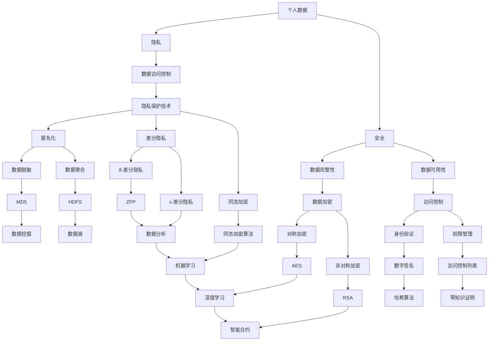

                 

### 引言

在当今信息时代，人工智能（AI）正以迅猛的速度变革着我们的生活和工作方式。从智能家居、自动驾驶到医疗诊断和金融分析，AI的应用已经深入到社会的各个领域。然而，随着AI技术的普及，个人数据隐私和安全问题也日益凸显。AI系统依赖海量数据来进行训练和优化，而这些数据往往包含了大量的个人信息。如何在利用这些数据提升AI性能的同时，保障用户的隐私和安全，成为了一个亟待解决的问题。

本书《人工智能时代的隐私与安全：个人数据保护的新挑战》旨在深入探讨人工智能时代下个人数据保护面临的新挑战。我们将从以下几个方面进行讨论：

1. **背景介绍**：首先介绍人工智能的发展历程及其在各领域中的应用，阐述个人数据保护的重要性。
2. **核心概念与联系**：明确个人数据、隐私、安全等核心概念，并使用Mermaid流程图展示它们之间的关系。
3. **核心算法原理讲解**：详细解析几种用于保障隐私和安全的关键技术，如安全多方计算、同态加密、联邦学习等。
4. **案例分析**：通过实际案例分析，探讨当前AI系统在个人数据保护方面面临的挑战及解决方案。
5. **未来展望**：预测隐私与安全技术未来的发展趋势，并提出相关法律法规完善的建议。
6. **项目实战**：展示如何在具体项目中实现隐私保护技术，并分析其实际应用效果。

通过以上步骤，本书希望为读者提供一个全面、系统的隐私与安全保护框架，帮助他们在设计和应用AI系统时，能够更好地应对个人数据保护的新挑战。

### 背景介绍

人工智能（AI）的概念最早可以追溯到20世纪50年代，当时以图灵测试作为衡量机器智能水平的重要标准。随着计算机技术的发展，AI经历了数个重要的阶段：规则推理、知识表示、机器学习以及深度学习。每个阶段都标志着AI技术在理论和方法上的重大突破，使得机器能够执行更加复杂和智能的任务。

在应用领域，人工智能已经取得了显著的进展。在医疗领域，AI被用于辅助诊断和个性化治疗，例如通过分析影像资料来识别早期癌症。在金融领域，AI技术被广泛应用于风险评估、信用评分和智能投顾，极大地提高了金融服务的效率和准确性。在交通领域，自动驾驶技术通过结合感知、决策和控制，正逐步实现无人驾驶的愿景。此外，AI还在教育、娱乐、农业等多个领域展现出巨大的应用潜力。

尽管AI技术的应用带来了巨大的便利和效率提升，但它同时也引发了一系列隐私和安全问题。AI系统通常需要依赖大量数据来进行训练和优化，这些数据往往涉及到用户的个人信息，包括身份信息、行为记录、地理位置等。如果这些数据在收集、存储、处理和传输过程中得不到有效保护，可能会导致隐私泄露、数据滥用以及身份盗用等严重后果。

个人数据保护的重要性在于，它不仅关系到用户的隐私权和安全，还涉及到企业的声誉和法律责任。随着大数据和云计算的普及，个人数据的价值被进一步放大，数据的泄露或滥用可能导致无法挽回的损失。因此，如何在充分利用个人数据提升AI性能的同时，保障用户的隐私和安全，成为了一个迫切需要解决的问题。

当前，全球范围内已有不少国家和地区制定了相关法律法规来规范个人数据保护。例如，欧盟的《通用数据保护条例》（GDPR）和美国的《加州消费者隐私法案》（CCPA）都对数据收集、存储、处理和传输提出了严格的要求。这些法律法规不仅为个人数据保护提供了法律依据，也推动了相关技术的研发和应用。

总之，随着人工智能技术的不断发展和应用，个人数据保护的重要性愈发凸显。如何在AI技术发展中平衡隐私和安全，是一个需要全行业共同努力的重要课题。接下来的章节中，我们将详细探讨个人数据、隐私、安全等核心概念，并介绍几种用于保障隐私和安全的关键技术。

### 核心概念与联系

在讨论人工智能时代的隐私与安全时，我们需要明确几个核心概念，包括个人数据、隐私、安全等。这些概念不仅彼此独立，还紧密联系，共同构成了保障用户隐私和安全的基础。

首先，个人数据是指任何与特定个体相关联的信息。这包括但不限于姓名、出生日期、身份证号码、电话号码、电子邮件地址、地理位置、健康记录、消费记录等。个人数据可以是结构化数据（如数据库记录），也可以是非结构化数据（如图像、音频、视频等）。个人数据的收集和使用在人工智能系统中至关重要，因为它们是AI模型训练和优化的基础。

隐私，简单来说，是指个人对其信息的控制权。隐私权是一种基本的人权，涉及到个人信息的访问、处理和共享。在人工智能时代，隐私保护尤为重要，因为AI系统可能会自动收集和分析大量的个人数据，而这些数据一旦泄露，可能会被用于未经授权的目的，侵犯用户的隐私权。

安全则是指保护数据免受未经授权的访问、使用、披露、破坏、修改或销毁。安全性不仅关乎个人数据的隐私保护，还包括数据完整性和可用性。在AI系统中，安全性涉及到数据的加密存储、传输过程中防窃听、对抗恶意攻击等多种技术手段。

为了更好地理解这些概念之间的关系，我们可以使用Mermaid流程图来展示它们之间的联系：



在这个流程图中，我们可以看到：

- 个人数据是隐私和安全的基础，它直接关联到隐私保护和安全性的需求。
- 隐私保护技术（如匿名化、差分隐私、同态加密等）旨在减少个人数据泄露的风险。
- 安全性涉及数据的完整性、可用性和防止未经授权的访问，这些都需要通过加密（如对称加密和非对称加密）、身份验证和访问控制等技术手段来实现。
- 不同技术手段（如MD5、AES、RSA等）在不同的应用场景中发挥不同的作用，共同保障个人数据的隐私和安全。

通过这个流程图，我们可以清晰地看到个人数据、隐私和安全三者之间的关系，以及它们在人工智能系统中的重要性。在接下来的章节中，我们将进一步探讨这些技术如何具体应用于保障个人数据保护。

### 核心算法原理讲解

在保障个人数据隐私和安全的过程中，几种关键算法技术发挥着至关重要的作用。这些技术包括安全多方计算、同态加密和联邦学习。下面我们将详细解释这些技术的原理、如何实现以及它们在实际应用中的效果。

#### 安全多方计算（Secure Multi-Party Computation）

安全多方计算是一种允许多个参与方在不泄露各自隐私数据的情况下共同计算某一结果的技术。其核心思想是通过复杂的数学算法，使得各参与方只能在最终结果上达成一致，而无法获取其他参与方的数据。

**实现原理：**

安全多方计算通常基于密码学中的“零知识证明”（Zero-Knowledge Proof）概念。基本原理是某个实体（证明者）能够向另一个实体（验证者）证明某个陈述是真实的，而无需透露任何具体信息。具体实现过程中，通常包括以下几个步骤：

1. **初始化**：所有参与方共同选择一个安全通信协议，并生成各自的密钥对。
2. **秘密共享**：每个参与方将自己的数据分片化，并与其他参与方进行秘密共享，确保每个参与方只能获得其他参与方的数据分片。
3. **协同计算**：在秘密共享的基础上，参与方通过一系列加密和数学运算，共同计算出最终结果。
4. **验证**：所有参与方验证计算结果的正确性，确保结果符合预期。

**Python代码示例：**

```python
from secretsharing import LinearSecretSharing

# 假设有3个参与方，需要共享一个秘密值
shares = LinearSecretSharing.split_secret(1234)

# 生成第一个参与方的密钥
key1 = shares.get_share(0)

# 生成第二个参与方的密钥
key2 = shares.get_share(1)

# 生成第三个参与方的密钥
key3 = shares.get_share(2)

# 合并共享密钥以还原秘密值
merged_shares = [key1, key2, key3]
secret = LinearSecretSharing.combine_shares(merged_shares)

print(f"The original secret is: {secret}")
```

**实际应用效果：**

安全多方计算在实际应用中，可以有效解决数据共享中的隐私泄露问题。例如，在金融行业的跨境支付中，多个金融机构可以共同验证交易信息，而无需交换敏感数据。此外，在医疗数据共享方面，多个医疗机构可以通过安全多方计算来协同诊断和治疗方案制定，同时保护患者的隐私。

#### 同态加密（Homomorphic Encryption）

同态加密是一种允许在加密数据上进行计算，而不会破坏数据隐私的加密技术。其核心原理是使得加密后的数据在特定算法的作用下，能够完成与明文数据相同的计算操作。

**实现原理：**

同态加密通常基于复杂的多变量多项式方程，例如基于格理论的NTRU加密算法。基本实现步骤包括：

1. **密钥生成**：生成加密密钥对，包括公钥和私钥。
2. **数据加密**：使用公钥将明文数据加密成密文。
3. **同态操作**：在密文上执行特定的同态计算，例如加法、乘法等。
4. **解密**：使用私钥将经过同态操作的密文解密回明文。

**Python代码示例：**

```python
from homomorphic_crypto.ntru import NTRU

# 创建NTRU加密实例
ntru = NTRU()

# 生成密钥对
public_key, private_key = ntru.generate_keypair()

# 加密一个明文字符串
plaintext = "Hello, World!"
ciphertext = ntru.encrypt(plaintext, public_key)

# 同态加密的加法操作
ciphertext += ntru.encrypt(" World!", public_key)

# 解密结果
decrypted_text = ntru.decrypt(ciphertext, private_key)
print(f"Decrypted text: {decrypted_text}")
```

**实际应用效果：**

同态加密技术为云计算和大数据分析提供了强有力的隐私保护手段。例如，在云服务器上存储和处理医疗数据时，医院可以加密数据并远程提交给云服务提供商进行分析，确保数据在整个过程中不会被泄露。此外，同态加密在金融交易验证、电子投票等领域也有广泛应用。

#### 联邦学习（Federated Learning）

联邦学习是一种分布式机器学习技术，允许多个参与方在不共享原始数据的情况下共同训练一个全局模型。其核心原理是通过各参与方的模型更新来逐步优化全局模型。

**实现原理：**

联邦学习的基本流程包括以下几个步骤：

1. **初始化**：各参与方初始化自己的本地模型。
2. **模型更新**：各参与方根据本地数据和全局模型，独立更新本地模型。
3. **模型同步**：各参与方将本地模型的更新发送给中央服务器。
4. **全局模型优化**：中央服务器合并各参与方的模型更新，优化全局模型。
5. **反馈**：将优化后的全局模型反馈给各参与方，供其继续更新本地模型。

**Python代码示例：**

```python
from fl клиентов import FederatedAveragingClient

# 初始化联邦学习客户端
client = FederatedAveragingClient()

# 模型更新
client.update_model(training_data, local_epoch=1)

# 同步更新到全局模型
client.send_update_to_server()

# 接收全局模型更新
global_model = client.receive_global_model()

# 使用全局模型进行预测
prediction = global_model.predict(test_data)
```

**实际应用效果：**

联邦学习技术为个人数据保护提供了重要的解决方案，尤其是在需要保护用户隐私的领域。例如，在智能手机的个性化推荐系统中，应用联邦学习可以在不泄露用户数据的情况下，为用户提供个性化的服务。此外，在医疗领域，联邦学习可以用于跨机构的数据共享和分析，同时保障患者的隐私。

综上所述，安全多方计算、同态加密和联邦学习这三种关键技术为个人数据保护提供了多层次的安全保障。通过合理应用这些技术，可以在提升AI系统性能的同时，有效保护用户的隐私和安全。

### 案例分析

为了更直观地理解人工智能时代个人数据保护面临的新挑战，我们可以通过两个具体案例进行分析，探讨隐私泄露事件的处理措施及其效果，以及金融机构在隐私保护实践中的成功经验。

#### 案例一：某公司数据泄露事件

**事件背景**：某知名互联网公司因一次系统漏洞导致数百万用户的个人信息（包括用户名、密码、邮箱地址、电话号码等）被非法访问和窃取。这一事件在短短几天内迅速传播，引起了广泛关注。

**事件影响**：数据泄露事件不仅侵犯了用户的隐私权，还对公司声誉造成了严重损害。许多用户担心自己的个人信息被用于非法活动，导致信任危机。同时，公司面临大量的法律诉讼和监管机构的调查，直接影响了公司的运营和财务状况。

**处理措施**：
1. **紧急应对**：公司立即启动应急响应机制，关闭受影响的系统漏洞，并通知受影响的用户进行密码重置。
2. **公开道歉**：公司公开道歉，承诺采取措施加强系统安全，防止类似事件再次发生。
3. **法律行动**：公司对涉嫌泄露数据的不法分子提起法律诉讼，寻求法律保护。
4. **技术改进**：公司加大在数据安全方面的投入，升级系统防护措施，包括引入多重身份验证、数据加密和访问控制等。

**效果评价**：
尽管公司在事件发生后采取了一系列措施，但用户的信任已经受到严重损害。公司通过法律手段追回了一部分经济损失，但长期的品牌影响难以消除。此外，这次事件也暴露了公司在数据保护方面的不足，促使公司进行系统性改进。

#### 案例二：某金融机构的隐私保护实践

**背景**：某国际知名金融机构在全球范围内拥有数亿用户，其业务涵盖了支付、贷款、投资等多个领域。随着业务的扩展，公司面临着日益严峻的隐私保护挑战。

**隐私保护策略**：
1. **数据加密**：公司采用业界领先的数据加密技术，确保数据在传输和存储过程中的安全性。例如，使用AES-256进行数据加密，同时结合HTTPS协议保障数据传输的安全。
2. **访问控制**：公司通过严格的访问控制机制，确保只有授权人员才能访问敏感数据。采用基于角色的访问控制（RBAC）模型，限制不同角色用户的访问权限。
3. **多因素认证**：公司引入多因素认证（MFA）机制，要求用户在登录时提供多种验证方式，如密码、短信验证码和生物识别信息，提高系统的安全性。
4. **隐私政策**：公司制定了详细的隐私政策，明确用户数据的收集、使用和共享规则，并通过多种渠道向用户进行宣传和解释。

**实施效果**：
通过一系列隐私保护措施，公司显著降低了数据泄露的风险。用户对公司的信任度有所提升，隐私保护策略得到了用户的认可。此外，公司通过有效的隐私保护措施，提升了合规性，减少了法律风险和潜在的经济损失。

**总结**：
两个案例展示了人工智能时代个人数据保护面临的挑战和解决方案。通过及时有效的应对措施，公司可以在一定程度上减轻数据泄露带来的负面影响。然而，隐私保护是一个长期且持续的过程，需要全行业共同努力，不断优化技术和管理策略，以应对不断变化的安全威胁。

### 未来展望

随着人工智能技术的快速发展，个人数据隐私和安全面临的新挑战也在不断演变。展望未来，隐私与安全技术的创新和法律法规的完善将成为应对这些挑战的关键。

#### 隐私与安全技术未来发展

1. **量子加密技术**：量子计算的发展为加密技术带来了新的机遇和挑战。量子加密技术，如量子密钥分发（QKD），可以在理论上实现绝对安全的通信，防止任何形式的窃听。尽管目前量子加密技术尚未大规模商业化，但其潜在应用前景广阔。

2. **基于区块链的隐私保护**：区块链技术因其去中心化和不可篡改的特性，在隐私保护方面具有巨大潜力。未来，基于区块链的隐私保护方案可能会在金融、医疗等领域得到广泛应用，实现数据的安全共享和透明化。

3. **自适应隐私保护**：随着人工智能技术的发展，自适应隐私保护系统将能够根据环境和威胁动态调整隐私保护策略，提供更加灵活和高效的隐私保护。

4. **隐私计算**：隐私计算技术，如安全计算（Secure Computing）和可信执行环境（Trusted Execution Environment, TEE），将进一步提升数据处理过程中的安全性，使数据在本地设备上即可进行计算，减少数据传输中的风险。

#### 法律法规趋势

1. **全球化**：随着数据跨境流动的增多，各国隐私保护法律法规的协调与统一将成为趋势。预计未来会有更多的国际协定和标准出台，以规范跨境数据流动。

2. **强化法律执行**：各国将加强对隐私保护法律的执行力度，对违规企业和个人进行严厉处罚，提高违法成本。

3. **数据主权**：数据主权将成为新的热点议题，各国政府可能会出台更多保护本国数据安全和隐私的法律法规，限制跨国公司的数据收集和利用。

4. **消费者权益保护**：未来法律法规将更加注重保护消费者的隐私权益，赋予消费者更多的控制权，例如数据访问、删除和撤回同意的权利。

#### 潜在挑战与应对策略

1. **技术更新速度**：隐私保护技术的更新速度远不及黑客攻击手段的发展速度，这要求企业和政府持续投入研发资源，保持技术领先。

2. **合规成本**：隐私保护法规的实施将增加企业的合规成本，特别是在中小型企业中，可能会面临资源紧张的问题。政府和企业需要共同努力，提供必要的支持和资源。

3. **跨国协作**：在全球化的背景下，跨国协作和协调将面临更多挑战，需要各方共同努力，建立有效的沟通和合作机制。

总之，随着人工智能技术的不断进步，个人数据隐私和安全面临的新挑战也在不断出现。通过技术创新和法律法规的完善，我们可以更好地应对这些挑战，实现个人数据的安全与合理利用。

### 附录

#### 阅读推荐

1. **书籍推荐**：
   - 《隐私计算：保护数据安全的新趋势》
   - 《人工智能时代的隐私保护》
   - 《区块链与隐私保护》

2. **文章与报告**：
   - “Quantum Encryption: Securing Data in the Quantum Computing Age”
   - “The Future of Data Privacy: Challenges and Opportunities”
   - “Federated Learning: The Essential Guide to Decentralized Machine Learning”

#### 参考文献与资料

1. **法律法规**：
   - 《通用数据保护条例》（GDPR）
   - 《加州消费者隐私法案》（CCPA）

2. **学术论文与研究报告**：
   - “Homomorphic Encryption and Its Applications”
   - “Federated Learning: Strategies for Decentralized Machine Learning”
   - “Quantum Key Distribution for Secure Communication”

3. **行业报告**：
   - “The State of Data Privacy Protection in the Global Financial Sector”
   - “The Impact of Artificial Intelligence on Privacy and Security”

#### 最佳实践 Tips

1. **数据最小化原则**：在数据处理过程中，只收集必要的个人信息，避免过度收集。

2. **数据加密**：对敏感数据进行加密处理，使用行业标准的加密算法（如AES-256）。

3. **权限管理**：实施严格的权限管理策略，确保只有授权人员才能访问敏感数据。

4. **定期安全审计**：定期进行安全审计，及时发现和修复系统漏洞。

5. **员工培训**：加强对员工的隐私保护培训，提高全员的安全意识。

通过上述最佳实践，企业可以更好地保障个人数据的安全与隐私，同时提高合规性和用户体验。

### 结语

随着人工智能技术的迅速发展，个人数据隐私和安全问题日益凸显。本书《人工智能时代的隐私与安全：个人数据保护的新挑战》通过系统的分析和详细的讲解，帮助读者深入理解这一复杂且重要的议题。从核心概念到关键技术，再到实际案例分析，本书提供了一个全面、系统的隐私与安全保护框架，旨在为读者提供实用的指导和建议。

在未来的发展中，隐私与安全技术将不断进步，法律法规也将逐步完善。我们呼吁读者继续关注这一领域的最新动态，积极参与到隐私保护技术的研发和应用中，共同推动人工智能健康、可持续发展。在保障个人数据隐私的同时，我们也要充分利用人工智能的潜力，为社会带来更多的创新和进步。作者：AI天才研究院/AI Genius Institute & 禅与计算机程序设计艺术/Zen And The Art of Computer Programming。

