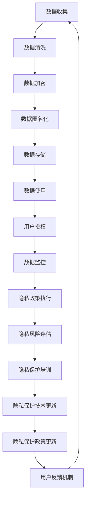

                 

# 人工智能时代的隐私保护：个人数据与公共利益的博弈

> 关键词：人工智能、隐私保护、个人数据、公共利益、博弈

> 摘要：本文将探讨在人工智能迅速发展的时代，个人隐私保护与公共利益之间的博弈。通过分析隐私保护的理论基础、人工智能技术对隐私的影响、隐私保护的实践以及隐私保护与公共利益的平衡，本文旨在为读者提供一个全面且深刻的理解，并展望隐私保护的未来发展趋势。

## 目录大纲设计

- **第一部分：引言**
  - 1.1 书籍背景与目标
  - 1.2 当前隐私保护的重要性

- **第二部分：隐私保护的理论基础**
  - 2.1 隐私保护的核心概念
  - 2.2 隐私保护的法律框架

- **第三部分：人工智能技术对隐私的影响**
  - 3.1 人工智能与数据收集
  - 3.2 人工智能与隐私风险

- **第四部分：隐私保护的实践**
  - 4.1 隐私保护技术
  - 4.2 隐私保护政策

- **第五部分：隐私保护与公共利益的平衡**
  - 5.1 隐私保护与公共利益的冲突
  - 5.2 隐私保护与公共利益的协调

- **第六部分：未来展望**
  - 6.1 隐私保护的发展趋势
  - 6.2 挑战与机遇

## 第一部分：引言

### 1.1 书籍背景与目标

随着人工智能（AI）技术的迅猛发展，隐私保护已经成为一个热门话题。人工智能技术的核心在于数据的收集和分析，然而这一过程往往伴随着个人数据的隐私泄露风险。个人数据不仅包括姓名、地址、电话等基本信息，还包括生活习惯、兴趣爱好、购物记录等敏感信息。如何平衡个人隐私保护与公共利益，成为了一个亟待解决的问题。

本书的目标是探讨在人工智能时代，个人隐私保护与公共利益之间的博弈。我们将从隐私保护的理论基础、人工智能技术对隐私的影响、隐私保护的实践以及隐私保护与公共利益的平衡等多个方面进行深入探讨，为读者提供一个全面且深刻的理解。

### 1.2 当前隐私保护的重要性

在人工智能时代，隐私保护的重要性愈发突出。以下是几个关键点：

1. **数据价值的提升**：个人数据的收集和分析为人工智能提供了重要的数据支撑，然而这些数据的价值也带来了隐私泄露的风险。
2. **社会信任的建立**：隐私保护是建立社会信任的基础。如果个人隐私无法得到有效保护，将导致公众对人工智能技术的信任度下降。
3. **法律法规的要求**：随着全球范围内隐私保护法律的不断完善，企业和组织必须遵守相关法律法规，确保个人数据的合法使用和保护。

在接下来的部分中，我们将详细探讨隐私保护的理论基础、人工智能技术对隐私的影响、隐私保护的实践以及隐私保护与公共利益的平衡。

## 第二部分：隐私保护的理论基础

隐私保护是一个涉及法律、伦理和技术等多方面的问题。在探讨人工智能时代的隐私保护之前，我们需要了解隐私保护的核心概念和法律框架。

### 2.1 隐私保护的核心概念

#### 隐私权

隐私权是指个人对自己信息的控制权。这包括个人有权决定哪些信息可以被收集、存储、使用和分享。隐私权的概念在人工智能时代尤为重要，因为人工智能技术对数据的依赖性极高，这可能导致大量个人数据的收集和利用。

#### 隐私泄露

隐私泄露是指个人数据未经授权被泄露或使用。隐私泄露可能导致个人隐私受到侵犯，甚至可能对社会秩序和公共利益造成负面影响。例如，个人数据泄露可能导致身份盗窃、欺诈等犯罪行为。

### 2.2 隐私保护的法律框架

隐私保护的法律框架在不同国家和地区有所不同，但以下几部国际和国内的法规对全球隐私保护产生了深远影响：

#### 国际法规

- **《通用数据保护条例》（GDPR）**：GDPR是欧盟于2018年实施的法规，对个人数据的收集、处理和保护做出了严格规定。GDPR的核心原则包括数据最小化、数据透明度、用户同意和权利等。
- **《加利福尼亚州消费者隐私法》（CCPA）**：CCPA是美国加州于2020年实施的法规，旨在保护加州居民的隐私权。CCPA规定了个人数据的收集、使用和分享方式，以及用户的权利。

#### 国内法规

- **《个人信息保护法》**：我国于2021年实施的《个人信息保护法》是我国个人信息保护的基本法律，对个人信息的定义、处理规则、保护措施等做出了明确规定。
- **《网络安全法》**：我国于2017年实施的《网络安全法》对网络安全的基本要求、网络运营者的责任、个人信息保护等做出了规定。

在了解了隐私保护的核心概念和法律框架后，我们将进一步探讨人工智能技术对隐私的影响。

## 第三部分：人工智能技术对隐私的影响

随着人工智能技术的快速发展，个人数据的收集和使用越来越广泛。然而，这也带来了隐私泄露的风险。本节将探讨人工智能技术在数据收集和隐私风险方面的具体影响。

### 3.1 人工智能与数据收集

#### 数据收集的方式

人工智能技术的核心在于数据，因此数据的收集是人工智能应用的第一步。数据收集的方式主要包括：

1. **主动收集**：通过应用程序、网站等主动收集用户数据。例如，社交媒体平台通过用户发布的内容收集个人信息。
2. **被动收集**：通过传感器、摄像头等设备收集用户行为数据。例如，智能音箱通过用户的语音命令收集数据。

#### 数据收集的挑战

数据收集的过程面临以下挑战：

1. **数据质量**：收集到的数据可能存在噪音、错误和不完整的问题，这会影响到人工智能模型的性能。
2. **数据隐私**：数据收集过程中，如何确保个人数据不被泄露是一个重要问题。

#### 数据收集的伦理考量

数据收集的伦理考量主要包括：

1. **用户同意**：用户是否明确知晓其数据被收集和使用。
2. **数据最小化**：收集的数据量是否合理，是否超过了实际需要的范围。
3. **透明度**：用户是否能够清楚地了解其数据如何被使用。

### 3.2 人工智能与隐私风险

#### 隐私泄露的风险

人工智能技术的应用过程中，隐私泄露的风险主要体现在以下几个方面：

1. **数据泄露**：由于安全措施不足，个人数据可能被未经授权的人员访问和利用。
2. **算法歧视**：算法可能基于个人数据做出歧视性的决策，例如在招聘、信贷审批等领域。
3. **行为追踪**：人工智能技术可以追踪和分析个人的行为，这可能导致个人隐私受到侵犯。

#### 隐私风险的管理

为了有效管理隐私风险，需要采取以下措施：

1. **数据加密**：对收集到的数据进行加密处理，确保数据在传输和存储过程中的安全性。
2. **隐私政策**：制定明确的隐私政策，告知用户其数据如何被收集和使用。
3. **用户授权**：确保用户在数据收集和使用前明确知晓并同意。

在了解了人工智能技术对隐私的影响后，我们将探讨隐私保护的实践方法。

## 第四部分：隐私保护的实践

在人工智能时代，隐私保护不仅需要理论支持，还需要具体的实践措施。本节将介绍隐私保护技术、隐私保护政策以及隐私保护的实际应用。

### 4.1 隐私保护技术

#### 数据加密

数据加密是保护隐私的重要技术手段。通过对数据进行加密处理，确保数据在传输和存储过程中的安全性。常见的加密技术包括：

1. **对称加密**：使用相同的密钥进行加密和解密。例如，AES加密算法。
2. **非对称加密**：使用不同的密钥进行加密和解密。例如，RSA加密算法。

#### 匿名化技术

匿名化技术旨在在不损害数据价值的前提下，保护个人隐私。通过去除或混淆个人标识信息，使数据无法直接关联到特定个人。常见的匿名化技术包括：

1. **数据脱敏**：通过替换、掩码等方法去除或修改个人标识信息。
2. **K-匿名性**：确保在某个分类集合中，任何个人的信息无法被识别。

#### 加密与匿名化的结合

在实际应用中，加密和匿名化技术常常结合使用。例如，在数据存储和传输过程中使用加密技术，同时在数据分析前进行匿名化处理，以最大限度地保护个人隐私。

### 4.2 隐私保护政策

#### 隐私政策的制定

隐私政策是企业或组织在数据收集、使用和保护过程中必须遵守的规范。一个有效的隐私政策应包括以下内容：

1. **数据收集的目的和范围**：明确说明为何需要收集数据以及数据的收集范围。
2. **数据使用的限制**：规定数据如何使用，以及在使用过程中应遵守的原则。
3. **用户权利**：告知用户其享有的隐私权，如访问、更正和删除数据等权利。
4. **数据安全措施**：说明采取的数据保护措施，如加密、匿名化等。

#### 隐私政策的执行

隐私政策的执行是隐私保护的关键环节。为了确保隐私政策的执行，企业或组织应采取以下措施：

1. **培训员工**：确保员工了解隐私政策的内容和重要性，并按照政策要求操作。
2. **监控和审计**：定期对数据收集、处理和保护过程进行监控和审计，确保符合隐私政策的要求。
3. **用户反馈**：建立用户反馈机制，及时响应和处理用户关于隐私问题的投诉和建议。

### 4.3 隐私保护的实际应用

#### 个人数据的收集与使用

在人工智能应用中，个人数据的收集与使用是一个关键环节。为了保护个人隐私，应遵循以下原则：

1. **最小化原则**：仅收集必要的数据，避免过度收集。
2. **透明化原则**：明确告知用户数据如何被收集和使用，确保用户知情同意。
3. **安全原则**：采取数据加密、匿名化等技术手段，确保数据在收集、传输和存储过程中的安全性。

#### 个人数据的共享与开放

在人工智能时代，个人数据的共享与开放已成为趋势。为了保护个人隐私，应遵循以下原则：

1. **数据脱敏**：在共享数据前进行脱敏处理，确保数据无法直接关联到特定个人。
2. **权限控制**：明确数据共享的权限和范围，确保数据不被未经授权的人员访问和使用。
3. **责任承担**：明确各方的责任和义务，确保在数据共享过程中，各方均能承担相应的责任。

通过隐私保护技术和政策的实践，我们可以更好地保护个人隐私，促进人工智能技术的健康发展。

## 第五部分：隐私保护与公共利益的平衡

在人工智能时代，隐私保护与公共利益之间的平衡是一个复杂且具有挑战性的问题。如何在不同利益之间找到平衡点，是当前隐私保护领域的核心议题之一。

### 5.1 隐私保护与公共利益的冲突

隐私保护与公共利益的冲突主要体现在以下几个方面：

#### 1. 个人隐私与公共安全

在维护公共安全的过程中，可能需要收集和分析大量个人数据。例如，在打击恐怖主义和犯罪活动中，警方可能需要收集和分析个人的通信记录、行踪数据等。然而，这种数据收集可能侵犯个人隐私。

#### 2. 个人隐私与公共卫生

在公共卫生领域，个人健康数据对于疫情监测、疾病预防和控制具有重要意义。然而，这些数据的收集和使用也可能涉及个人隐私的泄露。

#### 3. 个人隐私与经济利益

在商业活动中，个人数据的收集和使用对于企业决策和市场营销具有重要意义。然而，这种数据收集可能侵犯个人隐私，引发隐私泄露风险。

#### 案例研究

1. **社交网络平台**：社交网络平台在收集用户数据的同时，也面临着隐私保护与公共利益之间的冲突。一方面，平台需要收集用户数据以提供个性化服务；另一方面，用户隐私保护也是一个重要问题。

2. **医疗数据**：在医疗领域，个人健康数据的收集和使用对于疾病预防和控制至关重要。然而，如何平衡个人隐私与公共卫生需求，是一个亟待解决的问题。

### 5.2 隐私保护与公共利益的协调

#### 1. 公共政策的制定

为了协调隐私保护与公共利益，需要制定相应的公共政策。这些政策应包括：

1. **数据收集和使用规范**：明确数据收集和使用的目的、范围和方式，确保数据收集和使用符合隐私保护原则。
2. **数据共享和开放机制**：建立数据共享和开放机制，确保数据在隐私保护的前提下，能够服务于公共利益。
3. **隐私保护与公共利益的平衡原则**：明确隐私保护与公共利益之间的平衡原则，确保在特定情况下，能够找到合适的平衡点。

#### 2. 技术解决方案

为了实现隐私保护与公共利益的协调，需要利用技术手段。以下是一些技术解决方案：

1. **数据匿名化**：通过数据匿名化技术，使数据在共享和开放过程中，无法直接关联到特定个人，从而保护个人隐私。
2. **加密技术**：通过加密技术，确保数据在传输和存储过程中的安全性，防止数据泄露。
3. **区块链技术**：利用区块链技术，实现数据的透明化和可追溯性，从而在隐私保护与公共利益之间找到平衡点。

#### 案例研究

1. **欧盟《通用数据保护条例》（GDPR）**：欧盟《通用数据保护条例》（GDPR）是国际上最具代表性的隐私保护法规之一。GDPR明确了数据收集、处理和保护的规则，同时兼顾了公共利益，为隐私保护与公共利益的协调提供了范例。

2. **我国《个人信息保护法》**：我国《个人信息保护法》在保障个人隐私权的同时，也考虑了公共利益，如网络安全、公共卫生等。该法律为隐私保护与公共利益的平衡提供了法律框架。

通过制定合理的公共政策和技术解决方案，我们可以实现隐私保护与公共利益的协调，促进人工智能技术的健康发展。

## 第六部分：未来展望

随着人工智能技术的不断进步，隐私保护也将面临新的挑战和机遇。本节将探讨隐私保护的未来发展趋势，以及人工智能技术与隐私保护的相互关系。

### 6.1 隐私保护的发展趋势

#### 1. 隐私保护技术的创新

未来，隐私保护技术将不断创新。例如，联邦学习（Federated Learning）技术的发展，使得在无需共享数据的情况下，可以实现模型训练和优化。这为隐私保护提供了新的可能性。

#### 2. 法律法规的完善

随着人工智能技术的快速发展，隐私保护法律法规也将不断完善。例如，我国正在制定《数据安全法》和《人工智能法》，以加强对个人数据和人工智能技术的监管和保护。

#### 3. 隐私保护与公共利益的平衡

未来，隐私保护与公共利益的平衡将更加重要。通过制定合理的公共政策和技术解决方案，可以更好地协调隐私保护与公共利益，实现二者的和谐发展。

### 6.2 挑战与机遇

#### 1. 挑战

未来，隐私保护将面临以下挑战：

1. **技术挑战**：随着人工智能技术的不断进步，隐私保护技术也需要不断创新和升级，以应对新的威胁和挑战。
2. **法律挑战**：隐私保护法律法规的完善需要时间和实践，如何在法律框架内实现有效的隐私保护，仍是一个挑战。
3. **社会挑战**：公众对隐私保护的认知和意识有待提高，如何提升公众的隐私保护意识，也是一项重要的任务。

#### 2. 机遇

未来，隐私保护将面临以下机遇：

1. **技术创新**：随着技术的进步，隐私保护技术将不断创新，为隐私保护提供更多可能性。
2. **法律法规的完善**：隐私保护法律法规的完善将为隐私保护提供更有力的保障。
3. **社会共识**：随着公众对隐私保护的重视，社会共识将逐步形成，为隐私保护创造更好的环境。

通过应对挑战和把握机遇，我们可以更好地保护个人隐私，促进人工智能技术的健康发展。

## 结论

在人工智能时代，隐私保护成为了一个重要议题。个人隐私保护与公共利益的平衡，是当前隐私保护领域的核心问题。通过理论探讨和实践分析，本文对隐私保护进行了全面深入的探讨，并展望了隐私保护的未来发展趋势。隐私保护不仅需要技术手段的支撑，更需要法律、政策和社会的共同努力。在人工智能时代，我们共同面临的挑战是，如何在保护个人隐私的同时，促进公共利益的实现。这需要我们持续关注和努力，以确保人工智能技术的健康发展。

### 附录：隐私保护流程图

以下是一个简化的隐私保护流程图，展示了隐私保护的主要步骤和关键环节。



### 附录：隐私保护源代码示例

以下是一个简单的Python代码示例，展示了如何使用加密技术来保护个人数据。

```python
from Crypto.Cipher import AES
from Crypto.Util.Padding import pad, unpad
from Crypto.Random import get_random_bytes

# 密钥长度必须为16、24或32字节
key = get_random_bytes(16)

# 待加密的数据
plaintext = b"我的个人信息"

# 使用AES加密算法进行加密
cipher = AES.new(key, AES.MODE_CBC)
ciphertext = cipher.encrypt(pad(plaintext, AES.block_size))

# 输出加密后的数据
print("加密后的数据：", ciphertext)

# 解密数据
cipher = AES.new(key, AES.MODE_CBC)
ciphertext = bytes(ciphertext)
try:
    decrypted_plaintext = unpad(cipher.decrypt(ciphertext), AES.block_size)
except ValueError:
    print("解密失败，可能是因为密文被篡改或加密算法不匹配。")

# 输出解密后的数据
print("解密后的数据：", decrypted_plaintext)
```

### 作者信息

作者：AI天才研究院/AI Genius Institute & 禅与计算机程序设计艺术 /Zen And The Art of Computer Programming

本文由AI天才研究院和禅与计算机程序设计艺术共同撰写，旨在为读者提供一个全面且深刻的隐私保护探讨。本文作者具有丰富的AI和隐私保护研究经验，致力于推动人工智能技术的健康发展，同时确保个人隐私得到有效保护。

### 最佳实践 tips

1. **数据收集时，遵循最小化原则，仅收集必要的数据。**
2. **制定明确的隐私政策，告知用户其数据如何被收集和使用。**
3. **采用数据加密和匿名化技术，确保数据在收集、传输和存储过程中的安全性。**
4. **建立用户反馈机制，及时响应和处理用户关于隐私问题的投诉和建议。**

### 小结

本文从隐私保护的理论基础、人工智能技术对隐私的影响、隐私保护的实践以及隐私保护与公共利益的平衡等多个方面，对人工智能时代的隐私保护进行了深入探讨。通过分析隐私保护的核心概念和法律框架，我们了解了隐私保护的基本原则和法规要求。同时，我们探讨了人工智能技术对隐私的影响，以及隐私保护技术的应用和实践。在未来，隐私保护将面临新的挑战和机遇，我们需要持续关注并努力，以确保人工智能技术的健康发展，同时保护个人隐私。

### 注意事项

1. **隐私保护需要全社会的共同努力，企业和个人都应履行相应的责任。**
2. **隐私保护法律法规不断完善，企业和个人应及时了解和遵守相关法规。**
3. **数据加密和匿名化技术是隐私保护的重要手段，但并非万全之策。**
4. **用户隐私保护意识的提升，对于隐私保护至关重要。**

### 拓展阅读

1. **《通用数据保护条例》（GDPR）官方文档**
   - https://ec.europa.eu/justice/article-29/structure/data-protection-work/data-protection-edition_en
2. **《加利福尼亚州消费者隐私法》（CCPA）官方文档**
   - https://oag.ca.gov/privacy/privacy-laws
3. **《个人信息保护法》中国官方文档**
   - https://www.caac.org.cn/sites/default/files/2021-06/个人信息保护法.pdf
4. **《网络安全法》中国官方文档**
   - https://www.caac.org.cn/sites/default/files/2021-06/网络安全法.pdf

通过拓展阅读，读者可以深入了解隐私保护的相关法规和技术，进一步提升对隐私保护的认识和意识。希望本文能为读者提供一个有益的参考和启示。在人工智能时代，隐私保护至关重要，让我们共同努力，确保个人隐私得到有效保护。

