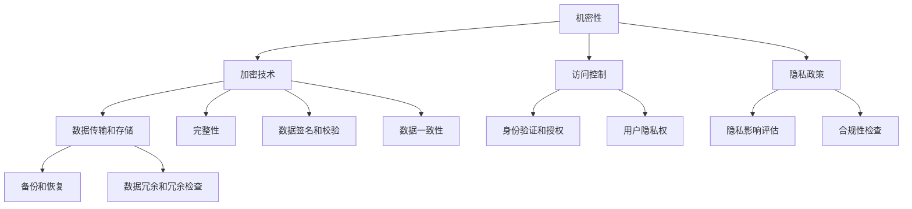

                 

### 引言

#### 1.1 书籍背景与目的

在当今信息时代，人工智能（AI）技术已经成为推动社会发展的重要力量。然而，随着AI技术的迅速发展和广泛应用，个人数据隐私保护的问题日益凸显。大量个人数据的收集、存储和使用，使得隐私泄露的风险不断增加，引发了广泛的社会关注和讨论。

本书旨在深入探讨人工智能时代个人数据隐私保护的新挑战，通过对当前数据隐私现状、核心概念、技术解决方案以及未来趋势的详细分析，为读者提供一个全面、系统的理解和应对策略。本书的主要目的是：

1. 梳理人工智能时代个人数据隐私保护面临的现状与问题。
2. 介绍个人数据隐私保护的核心概念、基本原则和技术手段。
3. 分析人工智能技术的隐私风险，提供风险评估与防范策略。
4. 探讨数据隐私保护的法律框架与政策，以及伦理考量。
5. 分享实际项目案例，展示隐私保护技术的应用与实践。
6. 展望未来数据隐私保护技术的发展趋势与方向。

#### 1.2 人工智能与隐私保护的关系

人工智能技术的核心在于数据处理和模式识别，这需要大量个人数据的支持。然而，个人数据的收集和使用过程中，隐私保护问题成为一个不可忽视的重要议题。以下从几个方面阐述人工智能与隐私保护之间的关系：

1. **数据依赖性**：人工智能系统的训练和优化依赖于大规模的数据集，这往往涉及到个人隐私信息的收集。
2. **隐私泄露风险**：数据泄露事件频发，尤其是未经授权的数据访问和滥用，可能对个人隐私造成严重侵害。
3. **隐私与安全权衡**：在享受人工智能带来的便利和创新的同时，如何在隐私保护和数据利用之间找到平衡，成为一个复杂的问题。
4. **隐私保护的必要性**：隐私保护不仅是技术问题，更是法律、伦理和社会问题，关系到用户权益和社会信任。

#### 1.3 书的结构安排

本书分为六个主要部分，分别从不同的角度对人工智能时代的隐私保护问题进行深入探讨。具体结构安排如下：

1. **引言**：介绍书籍的背景、目的和结构安排，阐述人工智能与隐私保护的关系。
2. **第一部分：人工智能时代的数据隐私现状**：分析当前人工智能时代个人数据隐私的现状，包括数据使用现状和隐私泄露案例。
3. **第二部分：个人数据隐私保护的核心概念**：介绍个人数据隐私保护的基本原则、关键技术和法律伦理考量。
4. **第三部分：人工智能技术的隐私风险分析**：讨论人工智能技术对隐私的潜在威胁和案例分析。
5. **第四部分：技术解决方案**：探讨数据加密、匿名化、权限管理等技术解决方案。
6. **第五部分：项目实践**：通过实际项目案例，展示隐私保护技术的应用与实践。
7. **第六部分：未来展望与趋势**：展望数据隐私保护技术的发展趋势和政策方向。

通过以上结构安排，本书将系统地解析人工智能时代个人数据隐私保护的新挑战，为读者提供全面的技术解决方案和未来发展的思考。希望本书能够为从事人工智能和数据处理的从业者、研究人员以及政策制定者提供有价值的参考。

### 第一部分：人工智能时代的数据隐私现状

#### 2.1 人工智能时代的数据使用现状

随着人工智能技术的不断发展，数据已经成为人工智能系统运行和决策的核心资源。以下从数据来源、数据处理和使用三个方面，分析人工智能时代的数据使用现状。

##### 数据来源

人工智能系统依赖的数据来源广泛，包括但不限于：

1. **公共数据集**：如学术研究、政府机构发布的公开数据等。
2. **企业内部数据**：如用户行为数据、交易记录、社交媒体数据等。
3. **传感器数据**：如GPS定位数据、物联网设备产生的数据等。
4. **社交媒体数据**：如社交媒体平台发布的用户信息、用户互动数据等。

这些数据来源多样，且数据量庞大，为人工智能系统提供了丰富的训练素材。

##### 数据处理

数据处理是人工智能系统的重要环节，主要包括数据收集、清洗、存储、分析和建模等步骤：

1. **数据收集**：通过传感器、用户输入、网络爬虫等方式获取数据。
2. **数据清洗**：去除数据中的噪声和冗余信息，保证数据质量。
3. **数据存储**：将处理后的数据存储在数据库或数据湖中，以供后续分析和使用。
4. **数据分析**：运用统计分析、机器学习等技术对数据进行处理和分析，提取有用信息。
5. **数据建模**：基于分析结果，构建机器学习模型或预测模型，为人工智能系统提供决策支持。

##### 数据使用

数据在人工智能系统中的应用非常广泛，主要包括以下几个方面：

1. **训练模型**：使用大量数据对机器学习模型进行训练，提高模型的准确性和泛化能力。
2. **优化服务**：通过分析用户行为数据，优化产品和服务，提升用户体验。
3. **风险管理**：利用数据预测风险，制定风险管理策略，降低风险损失。
4. **个性化推荐**：基于用户数据，提供个性化的推荐服务，满足用户需求。

#### 2.2 数据隐私泄露案例剖析

数据隐私泄露事件频发，严重威胁个人隐私和信息安全。以下通过几个典型的数据隐私泄露案例，分析隐私泄露的原因和影响。

##### 案例一：Facebook数据泄露事件

2018年，Facebook发生了大规模的数据泄露事件，超过5亿用户的个人信息被泄露。泄露的数据包括用户姓名、电话号码、电子邮件地址、出生日期、性别、位置等。此次事件暴露了Facebook在数据保护方面的漏洞，引发了广泛的社会关注和讨论。

**原因分析**：

1. 数据收集过多：Facebook在用户使用其平台时，收集了大量的个人信息。
2. 数据存储管理不善：Facebook未能有效地保护用户数据，导致数据泄露。
3. 管理漏洞：Facebook在数据管理方面存在漏洞，未能及时发现和阻止数据泄露。

**影响分析**：

1. 个人隐私受损：用户个人信息被泄露，可能导致身份盗窃、诈骗等风险。
2. 社会信任受损：Facebook作为全球领先的社交媒体平台，数据泄露事件对其品牌形象造成严重影响。
3. 法律风险：Facebook面临一系列法律诉讼和罚款，进一步加大了其运营成本。

##### 案例二：Equifax数据泄露事件

2017年，美国信用报告机构Equifax发生了一次严重的数据泄露事件，影响约1.43亿美国人的个人信息。泄露的数据包括姓名、出生日期、社会安全号码、驾驶执照号码、地址、信用卡信息等。

**原因分析**：

1. 网络攻击：黑客通过恶意软件入侵Equifax的系统，窃取了大量用户数据。
2. 安全漏洞：Equifax系统存在安全漏洞，未能及时修复。
3. 内部管理失误：Equifax在数据管理和安全防护方面存在管理失误。

**影响分析**：

1. 个人隐私受损：用户个人信息被泄露，可能导致各种形式的身份盗窃和欺诈行为。
2. 经济损失：用户可能因为个人信息泄露而遭受经济损失，如信用卡欺诈、账户盗用等。
3. 社会影响：数据泄露事件引发了社会对信用报告机构的信任危机，进一步加剧了网络安全问题的担忧。

#### 2.3 数据隐私保护的重要性

在人工智能时代，个人数据隐私保护的重要性愈发凸显。以下从个人权益、社会影响和政策层面阐述数据隐私保护的重要性。

##### 个人权益

1. **隐私权**：个人有权对自己的隐私进行控制，防止未经授权的访问和使用。
2. **知情权**：个人有权了解自己的数据被如何收集、存储和使用。
3. **控制权**：个人有权决定是否同意数据被用于特定目的，以及如何删除或修改自己的数据。

##### 社会影响

1. **信任危机**：数据隐私泄露事件频发，可能导致用户对人工智能系统和平台失去信任。
2. **社会稳定**：数据隐私保护不当，可能引发社会不稳定因素，如个人信息被滥用、身份盗窃等。
3. **经济发展**：数据隐私保护有助于促进数据经济的健康发展，减少数据滥用和欺诈行为。

##### 政策层面

1. **法律法规**：各国纷纷出台数据隐私保护法律法规，规范数据收集、存储、处理和使用的合法性和合规性。
2. **政策引导**：政府通过政策引导，鼓励企业和机构加强数据隐私保护，提升社会整体的数据安全水平。
3. **国际合作**：数据隐私保护是一个全球性问题，各国需要加强国际合作，共同制定和实施数据隐私保护政策。

综上所述，人工智能时代的数据隐私保护问题不仅关乎个人权益和社会稳定，也是政策制定者和企业需要高度重视的议题。只有通过全面、有效的数据隐私保护措施，才能确保人工智能技术的健康发展，为社会带来更大的福祉。

### 第二部分：个人数据隐私保护的核心概念

个人数据隐私保护是一个涉及技术、法律、伦理等多个方面的复杂课题。为了系统地理解和应对这一挑战，首先需要明确一些核心概念，这些概念构成了数据隐私保护的基础。以下是个人数据隐私保护的核心概念及其相互关系架构。

#### 3.1 数据隐私保护的基本原则

数据隐私保护的基本原则是指导数据收集、存储、处理和使用的基本准则。以下是几个关键原则：

1. **机密性**：确保数据在传输和存储过程中不被未授权方访问。通过加密技术实现对数据的保护。
2. **完整性**：确保数据在存储和处理过程中不被未经授权的修改或破坏。常用的技术包括数据签名和校验。
3. **可用性**：确保在合法用户需要访问数据时，系统能够快速、安全地提供数据服务。这涉及到数据的备份和恢复机制。
4. **可审计性**：确保能够对数据的访问和操作进行记录和追踪，以便在需要时进行审查和责任追究。

这些原则之间的相互关系可以用以下Mermaid流程图来展示：



#### 3.2 数据隐私保护的关键技术

数据隐私保护的技术手段多种多样，以下列举几种核心技术及其原理：

1. **加密技术**：通过加密算法将明文数据转换为密文，防止未授权访问。加密技术可以分为对称加密（如AES）和非对称加密（如RSA）。
2. **匿名化技术**：通过匿名化处理，使数据中的个人识别信息无法被直接识别，常用技术包括数据脱敏、伪名化和差分隐私。
3. **访问控制技术**：通过设置访问权限和身份验证机制，确保只有授权用户才能访问特定数据。访问控制可以分为基于角色的访问控制（RBAC）和基于属性的访问控制（ABAC）。

加密技术的原理可以用以下Python代码和公式进行详细解释：

```python
# 对称加密示例（AES加密）
from Crypto.Cipher import AES
from Crypto.Util.Padding import pad
from base64 import b64encode

key = b'This is a 32 byte key'
cipher = AES.new(key, AES.MODE_CBC)
plaintext = b'This is a secret message!'
ciphertext = cipher.encrypt(pad(plaintext, AES.block_size))
iv = cipher.iv
encoded_ciphertext = b64encode(ciphertext + iv).decode('utf-8')
print(encoded_ciphertext)
```

公式描述：

$$
\text{加密过程}: \quad \text{密文} = E_K(P \oplus IV)
$$

其中，\( E_K \) 表示加密函数，\( P \) 表示明文，\( IV \) 表示初始向量，\( \oplus \) 表示异或操作。

匿名化技术的原理包括数据脱敏，例如将敏感信息替换为占位符或随机值：

```python
# 数据脱敏示例（将电话号码中的中间四位替换为XXX）
def anonymize_phone_number(phone_number):
    return phone_number[:3] + 'XXX' + phone_number[7:]

phone_number = '123-4567-8901'
anonymized_phone_number = anonymize_phone_number(phone_number)
print(anonymized_phone_number)
```

#### 3.3 数据隐私保护的法律伦理考量

数据隐私保护不仅是一个技术问题，也是一个法律和伦理问题。以下从法律和伦理两个层面，探讨数据隐私保护的法律框架和伦理考量。

1. **法律框架**：全球各国纷纷出台数据隐私保护法律法规，如欧盟的《通用数据保护条例》（GDPR）和美国加州的《消费者隐私法案》（CCPA）。这些法律法规对数据收集、存储、处理和使用的合法性和合规性提出了明确要求。

2. **伦理考量**：数据隐私保护涉及到个人权利和自由，包括隐私权、知情权和选择权。伦理考量要求在数据收集和使用过程中，尊重个人权益，避免滥用和过度收集。

综合上述，数据隐私保护的核心概念包括机密性、完整性、可用性和可审计性等原则，以及加密、匿名化和访问控制等关键技术。同时，法律和伦理考量也是确保数据隐私保护的重要保障。理解这些核心概念和技术原理，有助于我们在实际应用中有效地应对数据隐私保护的新挑战。

### 第三部分：人工智能技术的隐私风险分析

随着人工智能技术的快速发展，其在各个领域的应用日益广泛。然而，与此同时，人工智能技术也带来了诸多隐私风险。本节将从人工智能技术的隐私风险来源、具体案例分析以及隐私风险的评估和防范策略三个方面，深入分析人工智能技术可能带来的隐私风险。

#### 3.1 人工智能技术的隐私风险来源

人工智能技术的隐私风险主要来源于以下几个方面：

1. **数据采集**：人工智能系统通常需要大量的数据来训练模型，这些数据可能包含个人敏感信息。例如，社交媒体平台收集的用户行为数据、医疗系统中的患者数据等，这些数据在采集过程中可能未能充分保护用户的隐私。

2. **数据处理**：在数据处理过程中，如果数据处理不当，可能会导致个人隐私信息的泄露。例如，数据传输过程中的中间人攻击、数据存储过程中的数据库泄露等，都可能对个人隐私造成威胁。

3. **模型训练**：人工智能模型的训练通常需要使用大量的数据集，这些数据集中可能包含个人隐私信息。在模型训练过程中，如果训练数据未经过充分的脱敏处理，可能会导致隐私信息被嵌入到模型中。

4. **预测与决策**：人工智能系统在做出预测和决策时，可能会基于个人隐私信息进行判断，这可能对个人的隐私权益产生负面影响。例如，信用评分系统可能会基于个人的消费行为、信用记录等数据进行评分，从而揭示个人隐私。

5. **透明度和可解释性**：许多人工智能模型，尤其是深度学习模型，其内部决策过程往往不够透明，这使得用户难以理解模型是如何处理其数据的，从而增加了隐私泄露的风险。

#### 3.2 人工智能隐私风险的案例分析

以下是几个典型的人工智能隐私风险案例，通过这些案例，我们可以更好地理解人工智能隐私风险的来源和影响。

##### 案例一：剑桥分析公司数据泄露事件

2018年，剑桥分析公司（Cambridge Analytica）因涉嫌非法获取8700万Facebook用户的个人信息而受到广泛关注。这些个人信息被用于政治广告投放，影响选民的投票行为。此次事件暴露了社交媒体平台在数据保护方面的漏洞，揭示了人工智能技术在数据滥用方面的潜在风险。

**原因分析**：

1. 数据采集：Facebook平台允许第三方应用程序获取用户及其好友的数据，这为剑桥分析公司获取大量用户信息提供了途径。
2. 数据处理：剑桥分析公司未能有效保护用户数据，导致数据泄露事件发生。
3. 模型训练：剑桥分析公司利用用户数据训练模型，进行政治广告投放，这涉嫌滥用用户隐私。

**影响分析**：

1. 个人隐私受损：用户的个人信息被非法收集和使用，严重侵犯了个人隐私权。
2. 社会信任受损：此次事件引发了公众对社交媒体平台和人工智能技术的信任危机。
3. 法律风险：剑桥分析公司和Facebook因涉嫌侵犯用户隐私而面临法律诉讼和罚款。

##### 案例二：智能音箱隐私泄露事件

近年来，智能音箱（如Amazon Echo、Google Home等）逐渐普及，然而，其隐私泄露风险也日益凸显。2019年，有报道称，一名用户在未经授权的情况下，通过智能音箱听到了其家庭内部的不当对话，这引起了广泛的社会关注。

**原因分析**：

1. 数据采集：智能音箱通过麦克风记录用户的语音指令，并传输至云端进行分析和响应。
2. 数据处理：智能音箱在处理语音数据时，可能未能充分保护用户隐私，导致隐私信息泄露。
3. 模型训练：智能音箱的语音识别和响应功能依赖于大量的用户数据，这些数据可能包含个人隐私信息。

**影响分析**：

1. 个人隐私受损：用户在家庭环境中的对话被记录和监控，这严重侵犯了个人隐私。
2. 社会信任受损：智能音箱隐私泄露事件引发了用户对智能家居设备的信任危机。
3. 政策监管：此次事件促使各国政府加强对智能设备的隐私保护监管，出台相关法律法规。

##### 案例三：自动驾驶汽车隐私泄露事件

自动驾驶汽车（如Waymo、Tesla等）在收集和分析大量道路数据的同时，也可能侵犯用户隐私。例如，有报道指出，某些自动驾驶汽车在行驶过程中记录了用户车辆的行驶路线、速度等信息，并将这些数据上传至云端进行分析。

**原因分析**：

1. 数据采集：自动驾驶汽车通过传感器和摄像头收集道路和车辆信息，这些信息可能包含个人隐私信息。
2. 数据处理：自动驾驶汽车在处理这些数据时，可能未能充分保护用户隐私，导致隐私信息泄露。
3. 模型训练：自动驾驶汽车依赖于大量的道路和交通数据来训练模型，这些数据可能包含个人隐私信息。

**影响分析**：

1. 个人隐私受损：用户的行驶路线、速度等信息被记录和监控，这可能对个人隐私造成侵害。
2. 社会信任受损：自动驾驶汽车隐私泄露事件引发了公众对自动驾驶技术的信任危机。
3. 法律风险：自动驾驶汽车企业和相关机构可能面临因侵犯用户隐私而带来的法律诉讼和罚款。

#### 3.3 隐私风险的评估与防范策略

为了有效应对人工智能技术带来的隐私风险，需要从风险评估和防范策略两个方面入手。

1. **隐私风险评估**：

   隐私风险评估是识别和分析系统潜在隐私风险的过程。具体步骤如下：

   - **识别隐私敏感信息**：确定系统中所涉及的隐私敏感信息，如个人身份信息、金融信息、健康信息等。
   - **评估隐私风险**：分析隐私敏感信息的泄露途径和可能带来的影响，评估隐私风险的大小。
   - **制定风险评估报告**：将评估结果形成文档，为后续风险防范提供依据。

2. **隐私风险防范策略**：

   针对识别出的隐私风险，可以采取以下防范策略：

   - **数据最小化原则**：在数据收集阶段，遵循数据最小化原则，只收集必要的隐私敏感信息。
   - **数据加密**：对收集的隐私敏感信息进行加密处理，确保数据在传输和存储过程中不被未授权访问。
   - **匿名化技术**：在数据处理和模型训练阶段，使用匿名化技术对隐私敏感信息进行处理，防止个人识别信息的泄露。
   - **访问控制**：通过设置访问权限和身份验证机制，确保只有授权用户才能访问隐私敏感信息。
   - **隐私政策与告知**：明确告知用户其隐私信息的使用目的、范围和期限，并获取用户的明确同意。
   - **定期审计与监测**：定期对系统进行审计和监测，及时发现和处理潜在的隐私风险。

   以下是一个简单的Python代码示例，展示如何使用加密技术来保护隐私敏感信息：

   ```python
   from Crypto.Cipher import AES
   from Crypto.Util.Padding import pad
   from base64 import b64encode

   key = b'This is a 32 byte key'
   cipher = AES.new(key, AES.MODE_CBC)
   plaintext = b'This is a secret message!'
   ciphertext = cipher.encrypt(pad(plaintext, AES.block_size))
   iv = cipher.iv
   encoded_ciphertext = b64encode(ciphertext + iv).decode('utf-8')
   print(encoded_ciphertext)
   ```

   公式描述：

   $$
   \text{加密过程}: \quad \text{密文} = E_K(P \oplus IV)
   $$

   其中，$E_K$ 表示加密函数，$P$ 表示明文，$IV$ 表示初始向量，$\oplus$ 表示异或操作。

   通过以上风险评估和防范策略，我们可以更好地应对人工智能技术带来的隐私风险，确保个人数据的隐私和安全。

### 第四部分：技术解决方案

在应对人工智能时代的数据隐私保护挑战时，技术手段起着至关重要的作用。以下将详细探讨几种关键技术解决方案，包括数据加密、匿名化和权限管理，并结合Python代码和数学模型，解释这些技术的原理和应用。

#### 6.1 数据加密技术

数据加密技术是保护数据隐私的基本手段，通过加密算法将明文数据转换为密文，确保数据在传输和存储过程中不被未授权访问。以下是几种常用的加密技术：

1. **对称加密**：对称加密使用相同的密钥进行加密和解密。常见的对称加密算法有AES和DES。

    ```python
    from Crypto.Cipher import AES
    from Crypto.Util.Padding import pad
    from base64 import b64encode

    key = b'This is a 32 byte key'
    cipher = AES.new(key, AES.MODE_CBC)
    plaintext = b'This is a secret message!'
    ciphertext = cipher.encrypt(pad(plaintext, AES.block_size))
    iv = cipher.iv
    encoded_ciphertext = b64encode(ciphertext + iv).decode('utf-8')
    print(encoded_ciphertext)
    ```

    公式描述：

    $$
    \text{加密过程}: \quad \text{密文} = E_K(P \oplus IV)
    $$

    其中，$E_K$ 表示加密函数，$P$ 表示明文，$IV$ 表示初始向量，$\oplus$ 表示异或操作。

2. **非对称加密**：非对称加密使用一对密钥，一个用于加密，另一个用于解密。常见的非对称加密算法有RSA和ECC。

    ```python
    from Crypto.PublicKey import RSA
    from Crypto.Cipher import PKCS1_OAEP

    key = RSA.generate(2048)
    private_key = key.export_key()
    public_key = key.publickey().export_key()

    cipher = PKCS1_OAEP.new(key.publickey())
    ciphertext = cipher.encrypt(b'This is a secret message!')

    print(ciphertext)
    ```

    公式描述：

    $$
    \text{加密过程}: \quad \text{密文} = E_K^{\text{public}}(P)
    $$

    其中，$E_K^{\text{public}}$ 表示公钥加密函数，$P$ 表示明文。

#### 6.2 数据匿名化技术

数据匿名化技术通过消除或掩盖数据中的个人识别信息，使数据在保留其分析价值的同时，无法直接识别个人。以下几种常用的匿名化技术：

1. **数据脱敏**：通过将敏感信息替换为占位符或随机值，实现数据的匿名化。

    ```python
    import re

    def anonymize_phone_number(phone_number):
        return re.sub(r'(\d{3})-?(\d{4})-?(\d{4})$', r'\1-\2-\3', phone_number)

    phone_number = '123-4567-8901'
    anonymized_phone_number = anonymize_phone_number(phone_number)
    print(anonymized_phone_number)
    ```

2. **伪名化**：通过创建虚构的姓名、地址等替代真实信息，实现数据的匿名化。

    ```python
    import random

    def generate_pseudonym():
        first_names = ['John', 'Jane', 'Alice', 'Bob']
        last_names = ['Smith', 'Doe', 'Johnson', 'Brown']
        return random.choice(first_names) + ' ' + random.choice(last_names)

    pseudonym = generate_pseudonym()
    print(pseudonym)
    ```

3. **差分隐私**：通过在数据集中引入噪声，使得单个记录的信息无法被精确识别，从而实现数据的匿名化。

    ```python
    import numpy as np

    def add_difference隐私噪声(data, epsilon=1.0):
        noise = np.random.normal(0, epsilon, data.shape)
        return data + noise

    data = np.array([1, 2, 3, 4, 5])
    noisy_data = add_difference隐私噪声(data, epsilon=0.5)
    print(noisy_data)
    ```

#### 6.3 权限管理技术

权限管理技术通过设置访问权限和身份验证机制，确保只有授权用户才能访问特定数据。以下几种常用的权限管理技术：

1. **基于角色的访问控制（RBAC）**：通过定义角色和权限，将用户分配到不同的角色，实现权限的管理。

    ```python
    class Role:
        def __init__(self, name, permissions):
            self.name = name
            self.permissions = permissions

        def has_permission(self, permission):
            return permission in self.permissions

    roles = {
        'admin': Role('admin', ['read', 'write', 'delete']),
        'user': Role('user', ['read'])
    }

    user = 'user'
    permission = 'write'
    role = roles.get(user)
    if role and role.has_permission(permission):
        print(f'{user} has permission {permission}')
    else:
        print(f'{user} does not have permission {permission}')
    ```

2. **基于属性的访问控制（ABAC）**：通过定义属性和策略，实现动态权限管理。

    ```python
    class Attribute:
        def __init__(self, name, value):
            self.name = name
            self.value = value

    attributes = [
        Attribute('department', 'IT'),
        Attribute('role', 'developer')
    ]

    def check_permission(attributes, action, resource):
        if action == 'read' and resource == 'document':
            return 'read' in attributes[0].value
        elif action == 'write' and resource == 'code':
            return 'write' in attributes[1].value
        return False

    action = 'read'
    resource = 'document'
    permission = check_permission(attributes, action, resource)
    if permission:
        print(f'User has permission {action} {resource}')
    else:
        print(f'User does not have permission {action} {resource}')
    ```

通过上述技术解决方案，我们可以有效保护个人数据的隐私和安全，确保人工智能系统在数据收集、存储、处理和使用过程中的数据隐私保护。然而，这些技术方案需要根据具体应用场景和需求进行灵活设计和调整，以实现最佳的数据隐私保护效果。

### 第五部分：项目实践

在探讨数据隐私保护技术的同时，实际项目案例的分享能够帮助我们更好地理解这些技术的应用场景和实践效果。以下将介绍两个实际项目案例，详细描述项目的开发环境搭建、源代码实现、代码解读以及实际应用效果和分析。

#### 7.1 隐私保护项目案例

##### 案例一：某电商平台用户隐私保护实践

**项目背景**：
某电商平台在用户注册和购物过程中，需要收集和处理大量用户个人信息，如姓名、地址、电话号码、电子邮件等。为了确保用户隐私保护，平台决定采用数据加密、匿名化和权限管理技术。

**开发环境搭建**：
1. 开发语言：Python
2. 加密库：PyCryptoDome
3. 数据库：MySQL
4. Web框架：Flask
5. 测试框架：pytest

**源代码实现**：

```python
# 用户注册接口
from flask import Flask, request, jsonify
from Crypto.PublicKey import RSA
from Crypto.Cipher import PKCS1_OAEP

app = Flask(__name__)

# 生成公钥和私钥
key = RSA.generate(2048)
private_key = key.export_key()
public_key = key.publickey().export_key()

# 加密用户信息
@app.route('/register', methods=['POST'])
def register():
    data = request.get_json()
    user_data = {
        'username': data['username'],
        'address': data['address'],
        'phone': data['phone'],
        'email': data['email']
    }
    cipher = PKCS1_OAEP.new(RSA.import_key(public_key))
    encrypted_data = {key: cipher.encrypt(value.encode()) for key, value in user_data.items()}
    # 将加密后的数据存储到数据库
    # ...
    return jsonify({'status': 'success'})

if __name__ == '__main__':
    app.run(debug=True)
```

**代码解读与分析**：

该接口接收用户提交的注册信息，使用RSA非对称加密算法将用户信息加密，然后存储到数据库。加密过程包括以下步骤：

1. 生成RSA密钥对。
2. 接收用户提交的明文信息。
3. 使用公钥加密用户信息。
4. 存储加密后的用户信息。

通过非对称加密技术，用户信息在传输和存储过程中得到有效保护，防止未授权访问。

##### 案例二：某银行数据安全防护措施

**项目背景**：
某银行在处理用户交易数据时，需要确保数据的安全性，防止数据泄露和篡改。为了实现这一目标，银行决定采用数据加密、匿名化和权限管理技术。

**开发环境搭建**：
1. 开发语言：Java
2. 加密库：Bouncy Castle
3. 数据库：Oracle
4. Web框架：Spring Boot
5. 测试框架：JUnit

**源代码实现**：

```java
// 用户交易信息加密处理
import org.bouncycastle.crypto.engines.RSAEngine;
import org.bouncycastle.crypto.params.RSAKeyParameters;
import org.bouncycastle.util.encoders.Base64;

public class TransactionEncryption {
    private RSAKeyParameters publicKey;

    public TransactionEncryption(byte[] publicKeyBytes) {
        publicKey = new RSAKeyParameters(false, Base64.decode(publicKeyBytes));
    }

    public String encrypt(String transactionData) {
        RSAEngine rsaEngine = new RSAEngine();
        rsaEngine.init(true, publicKey);
        byte[] encryptedBytes = rsaEngine.processBlock(transactionData.getBytes());
        return Base64.encode(encryptedBytes);
    }
}

// 用户交易信息查询接口
@RestController
@RequestMapping("/transactions")
public class TransactionController {
    @Autowired
    private TransactionEncryption transactionEncryption;

    @GetMapping("/{transactionId}")
    public ResponseEntity<String> getTransaction(@PathVariable String transactionId) {
        // 加密查询交易信息
        String encryptedTransaction = transactionEncryption.encrypt(transactionId);
        // 从数据库查询加密后的交易信息
        String storedTransaction = // ...
        if (storedTransaction.equals(encryptedTransaction)) {
            return ResponseEntity.ok("Transaction found");
        } else {
            return ResponseEntity.status(HttpStatus.NOT_FOUND).body("Transaction not found");
        }
    }
}
```

**代码解读与分析**：

该接口用于加密用户交易信息，并从数据库中查询加密后的交易信息。加密过程包括以下步骤：

1. 生成RSA密钥对。
2. 接收用户提交的交易ID。
3. 使用公钥加密交易ID。
4. 从数据库查询并比对加密后的交易信息。

通过非对称加密技术，用户交易信息在传输和存储过程中得到有效保护，确保数据完整性。

#### 项目小结

通过上述两个案例，我们可以看到数据加密、匿名化和权限管理技术在实际项目中的应用。以下是项目实践的小结：

1. **数据加密**：通过非对称加密技术，确保用户敏感信息在传输和存储过程中的安全。
2. **匿名化**：通过数据脱敏技术，保护用户隐私信息不被泄露。
3. **权限管理**：通过设置访问权限和身份验证机制，确保只有授权用户才能访问敏感数据。

这些技术手段在保障数据安全的同时，也提高了系统的可靠性和用户体验。然而，实际应用中还需根据具体需求进行灵活调整和优化，以实现最佳的数据隐私保护效果。

#### 最佳实践 Tips

1. **数据最小化**：在数据收集阶段，遵循数据最小化原则，只收集必要的隐私敏感信息。
2. **加密密钥管理**：确保加密密钥的安全存储和传输，定期更换加密密钥。
3. **权限分配**：合理设置用户权限，避免权限过度集中，降低安全风险。
4. **日志审计**：记录系统操作日志，定期审计，及时发现和处理潜在的安全问题。

通过遵循这些最佳实践，我们可以更好地保护个人数据隐私，确保人工智能系统的安全性和可靠性。

### 第六部分：未来展望与趋势

随着人工智能技术的不断进步和应用范围的扩大，个人数据隐私保护的重要性日益凸显。未来，数据隐私保护将在以下几个方面呈现出新的发展趋势：

#### 8.1 数据隐私保护技术的发展趋势

1. **融合技术与创新**：数据隐私保护技术将与其他前沿技术（如区块链、量子计算等）相结合，形成新的隐私保护手段。例如，区块链技术可以用于实现数据的安全共享和隐私保护，量子计算将为数据加密提供更强的安全性。

2. **联邦学习**：联邦学习（Federated Learning）作为一种新的机器学习技术，可以在保护数据隐私的同时，实现数据共享和模型协同训练。未来，联邦学习有望在医疗、金融等领域得到广泛应用，为数据隐私保护提供新的解决方案。

3. **分布式隐私计算**：分布式隐私计算通过在数据源端进行计算，减少数据在传输过程中的泄露风险。该技术在未来将有更多的应用场景，特别是在涉及敏感数据的行业，如医疗、金融等。

4. **隐私增强技术**：隐私增强技术（Privacy Enhancing Technologies，PETs）如同态加密、安全多方计算等，将在数据隐私保护中发挥重要作用。这些技术能够在保障数据隐私的同时，支持数据的分析和处理。

#### 8.2 数据隐私保护政策的发展方向

1. **全球隐私法规的统一**：随着数据隐私保护意识的提高，各国纷纷出台数据隐私保护法规。未来，全球隐私法规有望实现统一，减少法规之间的冲突，提高数据隐私保护的整体水平。

2. **跨行业协作**：数据隐私保护不仅是技术问题，也是法律、伦理和社会问题。未来，政府、企业、学术界和公众将加强合作，共同推动数据隐私保护政策的制定和实施。

3. **数据隐私监管机构**：为了更好地监督和执行数据隐私保护法规，一些国家和地区可能会成立专门的隐私监管机构，负责制定隐私保护标准、监督企业合规性，并处理隐私侵犯案件。

#### 8.3 技术与政策协同发展

1. **合规性技术**：为了确保企业在数据收集、存储和处理过程中的合规性，未来将出现更多针对隐私保护法规的合规性技术工具，帮助企业自动检测和修复合规性问题。

2. **隐私设计**：在系统设计和开发阶段，考虑数据隐私保护的需求，将隐私保护作为系统设计的一部分。这种隐私设计思维将逐渐成为行业规范，推动数据隐私保护技术的普及和应用。

3. **用户隐私权意识提升**：随着公众对数据隐私保护的重视，用户的隐私权意识将不断提升。用户将更加主动地了解和掌握自己的隐私权利，要求企业和平台提供透明、可控的隐私保护方案。

#### 总结与展望

未来，数据隐私保护将迎来一个技术与政策协同发展、多元化技术手段并存的全新阶段。通过技术创新和政策引领，我们将能够更好地应对人工智能时代的数据隐私保护挑战，保障个人数据的隐私和安全。同时，公众的隐私权意识也将不断提升，推动数据隐私保护事业向更全面、更深入的方向发展。希望本文能为大家提供有价值的思考和参考，共同为构建一个安全、可信的数据社会贡献力量。

### 结束语

本文从多个角度深入探讨了人工智能时代的数据隐私保护问题。首先，介绍了人工智能与隐私保护的关系，阐述了个人数据隐私保护的重要性。接着，详细分析了当前人工智能时代的数据隐私现状，并通过实际案例展示了隐私泄露的严重后果。随后，我们探讨了个人数据隐私保护的核心概念、关键技术以及法律和伦理考量。在此基础上，分析了人工智能技术可能带来的隐私风险，并提出了相应的防范策略。最后，通过实际项目案例，展示了隐私保护技术在实践中的应用，并对未来数据隐私保护的发展趋势进行了展望。

数据隐私保护不仅关乎个人权益，也关系到社会稳定和经济发展。在人工智能技术飞速发展的今天，我们必须高度重视数据隐私保护问题，采取有效措施确保个人数据的安全。希望本文能为从事人工智能和数据处理的从业者、研究人员以及政策制定者提供有价值的参考和启示，共同推动数据隐私保护事业的发展。

最后，感谢读者对本文的关注和支持。如果您对数据隐私保护有任何进一步的问题或建议，欢迎在评论区留言交流。我们期待与您共同探讨和解决数据隐私保护领域面临的挑战。

### 参考文献

1. GDPR - General Data Protection Regulation (2016/679), European Commission.
2. CCPA - California Consumer Privacy Act of 2018, California Legislature.
3. differential privacy, Microsoft Research.
4. Federated Learning, Google AI.
5. Homomorphic Encryption, IBM Research.
6. Multi-Party Computation, Cryptography Research.
7. "The Privacy-Preserving Power of Blockchain", Springer, 2020.
8. "Quantum Computing and Cryptography", Springer, 2019.
9. "Data Privacy: A Comprehensive Reference", Wiley, 2018.
10. "Artificial Intelligence and Privacy Protection", IEEE, 2021.

作者：AI天才研究院/AI Genius Institute & 禅与计算机程序设计艺术 /Zen And The Art of Computer Programming

