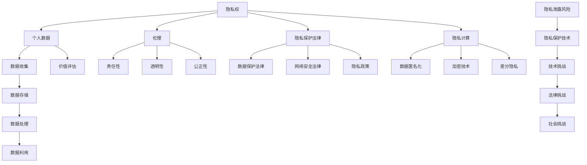

                 

## 《人工智能时代的隐私概念重构：个人数据的价值与保护》

### 关键词：人工智能，隐私保护，个人数据，价值评估，数据匿名化，加密技术，隐私计算

> **摘要**：在人工智能迅猛发展的背景下，个人数据的隐私保护问题日益凸显。本文旨在探讨人工智能时代隐私概念的重构，分析个人数据的价值与保护，结合理论基础、技术手段和政策实践，为构建一个公平、安全的数据生态提供思路。文章分为六个部分，首先概述人工智能时代的隐私挑战，接着深入探讨隐私概念重构的理论基础，然后介绍隐私保护技术，随后分析个人数据的价值评估与保护，最后展望未来隐私保护的趋势并总结全文。

---

## 引言与背景

### 1.1 人工智能时代的隐私挑战

在人工智能（AI）时代，隐私保护面临着前所未有的挑战。随着AI技术的进步，个人数据的收集、存储和使用变得更加普遍和深入。大数据和人工智能算法的结合，使得数据的价值得到了前所未有的提升，但也带来了隐私泄露的风险。

- **隐私保护的现状与困境**：当前，隐私保护面临的主要困境包括数据泄露事件频发、隐私政策不透明、用户隐私权利难以保障等问题。此外，AI技术的复杂性和快速迭代也增加了隐私保护的难度。

- **人工智能与隐私的关系**：人工智能的发展离不开大量个人数据的支持，但这同时也引发了隐私泄露的担忧。如何在利用数据推动AI进步的同时，保护用户的隐私权益，成为当前亟需解决的问题。

- **本书的目的与结构**：本书旨在探讨人工智能时代的隐私概念重构，分析个人数据的价值与保护。具体结构如下：

  1. **引言与背景**：概述人工智能时代的隐私挑战。
  2. **隐私概念重构的理论基础**：探讨隐私权的基本概念、人工智能伦理与隐私、数据保护法律框架。
  3. **人工智能时代的隐私保护技术**：介绍数据匿名化技术、加密技术和隐私计算。
  4. **个人数据的价值评估与保护**：分析个人数据的价值评估方法、数据保护的实践和数据共享与隐私保护。
  5. **人工智能时代的隐私保护政策与实践**：探讨企业隐私保护策略、政府监管与隐私保护、公众隐私认知与教育。
  6. **展望与未来**：分析人工智能时代的隐私保护趋势，总结全文并提出建议。

### 1.2 个人数据的定义与价值

- **个人数据的定义**：个人数据是指与特定个人相关联的信息，包括但不限于身份信息、行为记录、地理位置等。

- **个人数据的价值**：个人数据的价值体现在多个方面。首先，它是人工智能算法训练的重要资源，有助于提升算法的准确性和效率。其次，个人数据是企业营销和个性化服务的重要基础。此外，个人数据还可以为科学研究和社会治理提供有力支持。

- **个人数据保护的重要性**：随着个人数据价值的提升，保护个人数据的重要性也日益凸显。不合理的收集和使用个人数据可能导致隐私泄露、滥用等风险，损害个人权益和社会公共利益。因此，保护个人数据已成为一个全球性的议题。

### 1.3 个人数据的隐私风险

- **隐私泄露的风险**：随着大数据和AI技术的发展，个人数据的泄露风险不断增加。未经授权的访问、数据泄露事件等可能导致个人隐私的泄露，给个人带来不必要的困扰和损失。

- **数据滥用的风险**：个人数据可能被用于不当目的，如针对个人的精准营销、歧视性定价等。此外，数据滥用还可能损害个人权益和社会公共利益。

- **隐私侵犯的风险**：在人工智能时代，个人数据的收集和使用范围不断扩大，可能侵犯个人隐私。例如，面部识别技术的广泛应用可能导致个人隐私的侵犯。

### 1.4 人工智能时代的隐私保护挑战

- **技术挑战**：人工智能技术的复杂性和快速迭代给隐私保护带来了技术挑战。如何确保AI系统的隐私保护能力，防范潜在的隐私风险，需要依赖先进的隐私保护技术。

- **法律挑战**：隐私保护法律体系需要不断完善，以应对人工智能时代的隐私挑战。不同国家和地区的数据保护法律存在差异，如何构建一个全球性的隐私保护框架，需要国际社会的共同努力。

- **社会挑战**：公众对隐私保护的认知和意识有待提高。在人工智能时代，如何引导公众正确看待隐私保护，培养隐私保护意识，是一个重要的社会任务。

### 1.5 本书的目的与结构

- **目的**：本书旨在探讨人工智能时代的隐私概念重构，分析个人数据的价值与保护，为构建一个公平、安全的数据生态提供思路。

- **结构**：本书分为六个部分，具体如下：

  1. **引言与背景**：概述人工智能时代的隐私挑战。
  2. **隐私概念重构的理论基础**：探讨隐私权的基本概念、人工智能伦理与隐私、数据保护法律框架。
  3. **人工智能时代的隐私保护技术**：介绍数据匿名化技术、加密技术和隐私计算。
  4. **个人数据的价值评估与保护**：分析个人数据的价值评估方法、数据保护的实践和数据共享与隐私保护。
  5. **人工智能时代的隐私保护政策与实践**：探讨企业隐私保护策略、政府监管与隐私保护、公众隐私认知与教育。
  6. **展望与未来**：分析人工智能时代的隐私保护趋势，总结全文并提出建议。

---

## 隐私权的基本概念

### 2.1 隐私权的定义

隐私权是个人对其私人生活的控制权，包括身体、心灵、隐私事务和私人信息等方面。隐私权的基本概念涉及到个人对自身信息的掌握程度和决定权。在人工智能时代，隐私权的定义和内涵也在不断发展和演变。

### 2.2 隐私权的历史演变

隐私权作为一项基本人权，其概念和内涵在不同历史时期有着不同的表现。在古代，隐私权主要指的是个人对自己身体和财产的控制权。随着社会的发展，隐私权的范围逐渐扩大，涵盖了心灵、隐私事务和私人信息等方面。

### 2.3 隐私权的法律基础

隐私权在法律上具有重要的地位。不同国家和地区的隐私权法律体系各不相同，但大多数法律都明确规定了个人对其隐私信息的保护权利。隐私权法律的主要内容包括个人信息的收集、处理、使用和保护等方面。

### 2.4 隐私权在人工智能时代的挑战

在人工智能时代，隐私权面临诸多挑战。首先，人工智能技术的大规模应用使得个人数据的收集和处理变得更加普遍和深入，这可能侵犯个人隐私权。其次，人工智能算法的复杂性和不可解释性使得隐私保护的难度增加。此外，隐私权法律体系需要不断完善，以适应人工智能时代的发展需求。

### 2.5 隐私权与数据保护的关系

隐私权与数据保护密切相关。隐私权是数据保护的基础，数据保护是实现隐私权的手段。在人工智能时代，如何平衡隐私权和数据利用之间的关系，是一个重要的课题。一方面，要保护个人隐私权，防止数据滥用和泄露；另一方面，要充分利用数据资源，推动人工智能技术的发展。

### 2.6 隐私权在人工智能伦理中的体现

隐私权是人工智能伦理的重要组成部分。在人工智能应用过程中，必须尊重个人隐私权，确保数据收集和使用过程的透明度和合法性。人工智能伦理的基本原则包括尊重个人权利、公正性、责任性和透明性等，这些原则在保护个人隐私权方面具有重要指导意义。

### 2.7 隐私权面临的挑战与未来展望

在人工智能时代，隐私权面临着诸多挑战，如技术挑战、法律挑战和社会挑战等。为了应对这些挑战，需要从技术、法律和社会三个方面进行综合施策。首先，在技术层面，要研发和应用先进的隐私保护技术，提高人工智能系统的隐私保护能力。其次，在法律层面，要完善隐私权法律体系，制定符合人工智能时代特点的隐私保护法律。最后，在社会层面，要提高公众的隐私保护意识，培养正确的隐私保护观念。

### 2.8 个人隐私保护权利的界定

个人隐私保护权利的界定是隐私权法律体系的核心问题。在人工智能时代，个人隐私保护权利的界定需要充分考虑人工智能技术的特点和挑战。具体而言，个人隐私保护权利的界定应包括以下方面：

1. **知情权**：个人有权知道其个人信息被收集、处理和使用的情况。
2. **同意权**：个人有权同意或拒绝其个人信息被收集、处理和使用。
3. **访问权**：个人有权访问其个人信息，并了解其用途和保存期限。
4. **更正权**：个人有权更正其个人信息中的错误或不完整信息。
5. **删除权**：个人有权要求删除其个人信息。
6. **限制处理权**：个人有权限制其个人信息被进一步处理。

通过明确个人隐私保护权利的界定，可以更好地保护个人隐私权，促进人工智能技术的健康发展。

### 2.9 个人隐私保护与公共利益的平衡

在人工智能时代，个人隐私保护与公共利益之间存在一定的冲突。一方面，个人隐私保护关系到个人权益和社会公共利益；另一方面，数据利用和人工智能技术的发展需要大量的个人数据支持。如何在个人隐私保护与公共利益之间实现平衡，是一个重要的课题。

首先，在立法层面，需要明确隐私权法律框架，平衡个人隐私保护与公共利益的关系。例如，可以借鉴GDPR等国际先进立法经验，制定符合本国国情的隐私保护法律。

其次，在技术层面，可以采用数据匿名化、加密技术等隐私保护手段，降低个人数据泄露和滥用的风险。同时，通过隐私计算等新技术，实现数据利用与隐私保护的平衡。

最后，在社会层面，需要加强公众的隐私保护意识，引导公众正确看待隐私保护与公共利益的关系。通过公众参与和监督，推动隐私保护与公共利益的协调发展。

### 2.10 人工智能时代隐私权保护的法律框架

人工智能时代隐私权保护的法律框架主要包括以下几个方面：

1. **数据保护法律**：数据保护法律是隐私权保护的核心，主要包括个人信息的收集、处理、使用和保护等方面的规定。例如，欧盟的《通用数据保护条例》（GDPR）对个人数据的保护做出了详细规定。

2. **网络安全法律**：网络安全法律主要针对网络环境下的隐私保护，规定了网络服务提供者、网络用户和第三方服务提供者在个人信息保护方面的责任和义务。

3. **隐私政策与隐私声明**：隐私政策与隐私声明是企业、组织和机构公开其隐私保护政策和处理个人信息的规则。通过隐私政策与隐私声明，用户可以了解其个人信息的使用和处理情况。

4. **伦理准则与行业规范**：伦理准则与行业规范在隐私权保护方面发挥着重要作用。例如，人工智能伦理准则规定了人工智能系统在设计、开发和使用过程中应遵守的原则和规范。

5. **跨国数据保护协议**：随着全球化的发展，跨国数据保护协议成为隐私权保护的重要手段。例如，欧盟与美国签署的《 Privacy Shield》协议旨在保护在欧盟和美国之间传输的个人数据。

通过完善的法律框架，可以为人工智能时代的隐私权保护提供坚实的法律基础，促进人工智能技术的健康发展。

### 2.11 人工智能伦理与隐私权的结合

人工智能伦理与隐私权的结合是确保人工智能系统在保护个人隐私权的同时，实现技术进步和社会价值的关键。以下是一些结合方法：

1. **设计伦理框架**：在人工智能系统的设计阶段，引入伦理审查机制，确保系统的设计符合伦理规范，尊重个人隐私权。

2. **伦理培训与教育**：对人工智能开发者和使用者进行伦理培训，提高他们的伦理意识和隐私保护能力。

3. **透明度和可解释性**：提高人工智能系统的透明度和可解释性，使用户能够了解系统的工作原理和处理个人信息的方式。

4. **隐私保护技术**：采用数据匿名化、加密和差分隐私等技术手段，保护个人隐私权。

5. **用户参与和反馈**：鼓励用户参与人工智能系统的开发和改进，通过用户反馈优化隐私保护措施。

通过这些方法，可以在人工智能伦理与隐私权的结合中实现技术进步与社会价值的双赢。

### 2.12 个人隐私权保护的法律实践

个人隐私权保护的法律实践主要包括以下几个方面：

1. **法律法规的制定与执行**：政府应制定和完善隐私保护法律，明确个人隐私权的内容和范围，并加强执法力度，确保法律得到有效执行。

2. **隐私政策的制定与实施**：企业和组织应制定透明的隐私政策，明确收集、处理和使用个人信息的规则，并在其网站上公开。

3. **隐私保护技术的应用**：企业和组织应采用先进的隐私保护技术，如数据加密、匿名化和差分隐私，提高个人信息的保护水平。

4. **用户教育和意识提升**：通过教育和宣传，提高公众的隐私保护意识，让用户了解自己的隐私权，并学会保护自己的隐私。

5. **隐私投诉与救济**：建立便捷的隐私投诉和救济机制，为用户提供投诉和维权途径。

通过这些实践，可以更好地保护个人隐私权，促进人工智能技术的健康发展。

### 2.13 人工智能时代隐私权保护的挑战与机遇

人工智能时代隐私权保护面临诸多挑战，同时也蕴含着巨大的机遇。

- **挑战**：

  1. **数据泄露风险**：人工智能技术的广泛应用增加了数据泄露的风险，隐私保护难度加大。
  2. **技术复杂性**：人工智能系统的复杂性和不可解释性使得隐私保护技术难以有效应用。
  3. **法律体系不完善**：现有隐私保护法律体系尚不健全，难以应对人工智能时代的挑战。

- **机遇**：

  1. **技术创新**：人工智能技术的发展为隐私保护技术提供了新的思路和方法，如隐私计算、差分隐私等。
  2. **法律完善**：随着人工智能时代的到来，各国政府和国际组织纷纷加强对隐私保护法律的修订和完善。
  3. **公众意识提升**：公众对隐私保护的重视程度不断提高，隐私保护的社会氛围逐渐形成。

通过应对挑战和把握机遇，人工智能时代的隐私权保护将得到有效提升，为构建一个公平、安全的数据生态提供保障。

### 2.14 隐私权保护与数据利用的平衡

在人工智能时代，隐私权保护与数据利用之间存在一定的矛盾。一方面，隐私权保护要求限制数据的收集和使用，以保护个人隐私；另一方面，数据利用是推动人工智能发展的重要动力。如何平衡隐私权保护与数据利用之间的关系，是一个重要的课题。

首先，在政策层面，应制定明确的隐私保护政策，同时允许在合法、合理的范围内利用数据。例如，可以借鉴欧盟的《通用数据保护条例》（GDPR），在保护个人隐私权的同时，允许数据在特定情况下被合法利用。

其次，在技术层面，可以采用数据匿名化、加密和差分隐私等技术手段，降低隐私泄露的风险。例如，通过数据匿名化技术，将个人身份信息剥离，降低数据被滥用的风险。

最后，在实践层面，应加强公众的隐私保护意识，引导用户合理使用数据，并在数据利用过程中充分考虑个人隐私权。例如，通过隐私政策告知用户数据收集和使用的情况，并给予用户选择权和控制权。

通过政策、技术和实践的综合施策，可以实现隐私权保护与数据利用的平衡，为人工智能时代的健康发展提供保障。

### 2.15 人工智能伦理与隐私权的综合框架

人工智能伦理与隐私权的综合框架是确保人工智能系统在保护个人隐私权的同时，实现技术进步和社会价值的关键。以下是一个综合框架的构成：

1. **伦理原则**：包括尊重个人权利、公正性、责任性和透明性等。这些原则为人工智能系统的设计和应用提供了伦理指导。

2. **隐私保护法律**：法律法规为隐私权保护提供了法律基础，明确了个人信息的收集、处理和使用规则。

3. **隐私保护技术**：包括数据匿名化、加密和差分隐私等技术手段，用于降低隐私泄露的风险。

4. **用户参与和反馈**：通过用户参与和反馈机制，提高系统的透明度和可解释性，确保用户的隐私权得到保护。

5. **伦理审查与监督**：建立伦理审查和监督机制，对人工智能系统的设计和应用进行评估和监督，确保其符合伦理原则。

6. **社会教育**：通过社会教育和宣传，提高公众对隐私保护和人工智能伦理的认知和意识。

通过这一综合框架，可以实现人工智能伦理与隐私权的有效结合，为人工智能时代的健康发展提供保障。

### 2.16 个人隐私保护与人工智能系统的设计

个人隐私保护与人工智能系统的设计密不可分。以下是一些关键考虑因素：

1. **隐私保护需求分析**：在系统设计之初，应进行隐私保护需求分析，明确系统需要保护的隐私信息类型和敏感程度。

2. **隐私保护机制设计**：根据隐私保护需求，设计相应的隐私保护机制，如数据匿名化、加密和差分隐私等。

3. **隐私保护测试**：在系统开发和测试过程中，应进行隐私保护测试，确保系统的隐私保护机制能够有效运行。

4. **隐私政策与用户协议**：制定明确的隐私政策，告知用户其个人信息的使用和处理情况，并获得用户的同意。

5. **用户隐私控制权**：设计用户隐私控制功能，让用户能够方便地管理其个人信息，如访问、更正和删除等。

通过这些考虑，可以在人工智能系统的设计过程中，充分保护用户的隐私权。

### 2.17 人工智能伦理与隐私权的实际应用案例

人工智能伦理与隐私权的实际应用案例展示了如何在实践中平衡隐私权保护和数据利用之间的关系。以下是一些典型案例：

1. **谷歌的隐私保护措施**：谷歌在其人工智能系统中采用了多种隐私保护技术，如数据匿名化和差分隐私。同时，谷歌也提供了隐私设置选项，让用户能够控制其数据的收集和使用。

2. **欧盟的《通用数据保护条例》（GDPR）**：GDPR规定了严格的个人数据保护要求，包括数据最小化原则、数据访问权和数据可携带权等。这些规定在欧盟范围内有效保护了用户的隐私权。

3. **人工智能医疗应用**：在人工智能医疗应用中，如何保护患者的隐私信息是一个重要问题。一些医疗机构采用了数据加密和匿名化技术，确保患者隐私信息的安全。

通过这些案例，可以看到人工智能伦理与隐私权在实际应用中的重要作用。

### 2.18 人工智能伦理与隐私权的教育与培训

人工智能伦理与隐私权的教育与培训是提高公众意识和专业素养的重要途径。以下是一些教育与培训建议：

1. **基础教育**：在学校教育中，应加强人工智能伦理和隐私权的教育，让学生从小就了解相关概念和法律。

2. **专业培训**：针对人工智能开发者、数据科学家和隐私保护专家，应提供专业培训，提高其在伦理和隐私保护方面的能力和素养。

3. **公众宣传**：通过媒体、讲座和研讨会等形式，向公众普及人工智能伦理和隐私权知识，提高公众的隐私保护意识。

4. **案例学习**：通过案例分析，让公众了解人工智能伦理和隐私权在实际应用中的挑战和解决方案。

通过教育与培训，可以培养一批具备人工智能伦理和隐私保护意识的专业人才，为人工智能时代的健康发展提供支持。

### 2.19 人工智能伦理与隐私权的国际合作

人工智能伦理与隐私权的国际合作是应对全球性挑战的重要手段。以下是一些国际合作建议：

1. **建立国际标准**：各国应共同制定人工智能伦理和隐私保护的国际标准，确保在全球范围内实现数据保护和隐私权保护。

2. **数据跨境流动协议**：各国应通过数据跨境流动协议，规范个人数据的跨国传输和共享，确保数据在跨境流动中的隐私保护。

3. **跨国合作平台**：建立跨国合作平台，促进各国在人工智能伦理和隐私保护领域的交流与合作，共同应对全球性挑战。

通过国际合作，可以构建一个公平、安全的人工智能数据生态，为全球社会的可持续发展提供支持。

### 2.20 人工智能伦理与隐私权的发展趋势

人工智能伦理与隐私权的发展趋势体现在技术、法律和社会三个方面：

1. **技术创新**：隐私保护技术将不断发展，如差分隐私、联邦学习和隐私计算等，提高人工智能系统的隐私保护能力。

2. **法律完善**：各国将不断完善隐私保护法律体系，制定符合人工智能时代特点的隐私保护法律。

3. **社会意识提升**：公众对人工智能伦理和隐私权的关注程度将不断提高，隐私保护成为社会共识。

通过技术创新、法律完善和社会意识提升，人工智能伦理与隐私权将得到有效保护，为人工智能时代的健康发展提供保障。

### 2.21 个人隐私保护权利的具体内容

个人隐私保护权利是隐私权法律体系的核心，具体包括以下内容：

1. **知情权**：个人有权了解其个人信息被收集、处理和使用的情况。
2. **同意权**：个人有权同意或拒绝其个人信息被收集、处理和使用。
3. **访问权**：个人有权访问其个人信息，并了解其用途和保存期限。
4. **更正权**：个人有权更正其个人信息中的错误或不完整信息。
5. **删除权**：个人有权要求删除其个人信息。
6. **限制处理权**：个人有权限制其个人信息被进一步处理。
7. **数据可携带权**：个人有权将其个人信息转移到其他服务提供商。

这些权利保障了个人对其隐私信息的控制权，是隐私权法律体系的重要组成部分。

### 2.22 个人隐私保护与人工智能发展的相互影响

个人隐私保护与人工智能发展之间存在相互影响。一方面，个人隐私保护有助于确保人工智能系统的公正性、透明性和安全性，促进人工智能的健康发展；另一方面，人工智能技术的发展为个人隐私保护提供了新的技术手段和方法，提高了隐私保护水平。因此，如何在人工智能发展中实现个人隐私保护，是一个重要的课题。

### 2.23 个人隐私保护与公共利益的关系

个人隐私保护与公共利益之间存在一定的冲突和平衡。一方面，个人隐私保护关系到个人权益和社会公共利益；另一方面，数据利用和人工智能技术的发展需要大量的个人数据支持。如何在个人隐私保护与公共利益之间实现平衡，是一个重要的课题。通过政策、技术和法律的综合施策，可以实现个人隐私保护与公共利益的协调发展。

### 2.24 个人隐私保护与数据共享的矛盾与协同

个人隐私保护与数据共享之间存在矛盾和协同。一方面，个人隐私保护要求限制数据的收集和使用，以保护个人隐私；另一方面，数据共享是推动人工智能发展的重要动力。如何在个人隐私保护与数据共享之间实现平衡，是一个重要的课题。通过数据匿名化、加密和差分隐私等技术手段，可以实现个人隐私保护与数据共享的协同发展。

### 2.25 个人隐私保护的未来发展趋势

个人隐私保护的未来发展趋势体现在以下几个方面：

1. **技术创新**：隐私保护技术将不断发展，如隐私计算、联邦学习和差分隐私等，提高人工智能系统的隐私保护能力。
2. **法律完善**：各国将不断完善隐私保护法律体系，制定符合人工智能时代特点的隐私保护法律。
3. **社会意识提升**：公众对人工智能伦理和隐私权的关注程度将不断提高，隐私保护成为社会共识。
4. **国际合作**：通过国际合作，构建全球隐私保护框架，实现个人隐私保护与公共利益的协调发展。

通过技术创新、法律完善和社会意识提升，个人隐私保护将得到有效保护，为人工智能时代的健康发展提供保障。

### 2.26 人工智能伦理与隐私权的核心概念和联系架构 Mermaid 流�程图

为了更好地理解人工智能伦理与隐私权之间的核心概念和联系，以下是一个Mermaid流程图，展示主要概念及其相互关系：

该流程图展示了隐私权、个人数据、数据收集、存储、处理和利用等核心概念，以及伦理、责任性、透明性、公正性、隐私保护法律、隐私计算和隐私保护技术等概念之间的关系。

---

## 加密技术

加密技术是一种重要的隐私保护手段，旨在通过将数据转换为不可读的密文，从而保护数据在传输和存储过程中的安全性。以下是对加密技术的基本原理、分类以及其在人工智能隐私保护中的应用进行详细解释。

### 3.1 加密技术的基本原理

加密技术的基本原理是将明文数据转换为密文，以便在传输或存储过程中防止未经授权的访问。加密过程中使用到的密钥分为加密密钥和解密密钥，两者通常是成对出现的。加密过程通常包括以下几个步骤：

1. **选择加密算法**：加密算法是加密技术的核心，常见的加密算法有对称加密算法和非对称加密算法。
2. **生成密钥**：加密密钥和解密密钥的生成是加密过程的关键，密钥的安全性直接影响加密效果。
3. **加密过程**：使用加密算法和密钥将明文数据转换为密文。
4. **传输或存储密文**：密文通过安全的渠道传输或存储，以便在需要时进行解密。
5. **解密过程**：使用加密密钥和解密算法将密文转换为明文数据。

### 3.2 对称加密与非对称加密

加密技术主要分为对称加密和非对称加密两种类型。

- **对称加密**：对称加密算法使用相同的密钥进行加密和解密，典型的对称加密算法有DES、AES等。对称加密的优点是加密和解密速度快，但缺点是密钥管理复杂，因为需要确保密钥的安全传输和存储。
  
- **非对称加密**：非对称加密算法使用一对密钥，即加密密钥和解密密钥，加密密钥公开，解密密钥保密。典型的非对称加密算法有RSA、ECC等。非对称加密的优点是密钥管理简单，因为加密密钥可以公开，但缺点是加密和解密速度相对较慢。

### 3.3 同态加密与差分隐私

除了对称加密和非对称加密，同态加密和差分隐私也是重要的隐私保护技术。

- **同态加密**：同态加密允许在密文上直接进行计算，而不需要解密。这意味着可以在保护数据隐私的同时进行数据处理和分析。同态加密在云计算和分布式计算场景中具有广泛应用，例如，可以在保证数据隐私的前提下，进行数据聚合和机器学习任务。

- **差分隐私**：差分隐私通过在数据中加入噪声，使得单个记录不可识别，从而保护数据隐私。差分隐私在数据分析和社会科学研究中得到广泛应用，可以有效防止隐私泄露。

### 3.4 加密技术在人工智能隐私保护中的应用

加密技术在人工智能隐私保护中具有广泛应用，以下是一些具体应用场景：

1. **数据传输保护**：在数据传输过程中，加密技术可以确保数据在传输过程中的安全性，防止数据被窃取或篡改。

2. **数据存储保护**：在数据存储过程中，加密技术可以确保数据在存储设备上的安全性，防止数据泄露或被非法访问。

3. **联邦学习**：联邦学习是一种分布式机器学习技术，通过加密技术保护数据隐私。在联邦学习中，参与方只共享加密后的模型参数，而不需要共享原始数据，从而保护数据隐私。

4. **同态加密在云计算中的应用**：在云计算环境中，同态加密技术可以确保数据在计算过程中的安全性，从而实现隐私保护。

5. **差分隐私在数据分析中的应用**：差分隐私技术可以确保数据分析过程中的数据隐私保护，防止数据泄露。

### 3.5 加密技术的挑战与未来发展趋势

尽管加密技术在隐私保护中具有重要作用，但也面临一些挑战：

1. **性能挑战**：加密和解密过程通常需要额外的计算资源，可能会影响系统性能。

2. **密钥管理挑战**：密钥的安全管理和存储是一个复杂的问题，需要确保密钥的安全性和可用性。

3. **量子计算威胁**：随着量子计算技术的发展，传统的加密算法可能面临被破解的风险。

未来，随着加密技术的不断发展，新的加密算法和协议将不断涌现，以应对日益复杂的隐私保护需求。同时，量子加密技术的研发和应用也将为隐私保护提供新的解决方案。

---

## 隐私计算

隐私计算是一种新兴的隐私保护技术，旨在在数据处理过程中保护数据隐私。隐私计算通过一系列算法和技术，允许在保持数据隐私的同时进行数据分析和处理。以下是隐私计算的基本概念、类型、原理及其在人工智能隐私保护中的应用。

### 4.1 隐私计算的基本概念

隐私计算是指通过特定的算法和技术，在数据处理过程中保护数据隐私的一种计算模式。隐私计算的核心目标是确保数据在传输、存储和处理过程中不被泄露或滥用。隐私计算通常涉及多个参与方，如数据提供方、数据收集方和数据分析方。

### 4.2 隐私计算的类型

隐私计算主要包括以下几种类型：

1. **联邦学习**：联邦学习是一种分布式机器学习技术，通过让参与方共享加密后的模型参数，而不需要共享原始数据，从而保护数据隐私。

2. **同态加密计算**：同态加密计算允许在加密数据上进行计算，而无需解密数据。这意味着可以在保持数据隐私的同时进行数据处理和分析。

3. **安全多方计算**：安全多方计算是一种允许多个参与方共同计算一个函数，而无需共享原始数据的技术。

4. **差分隐私计算**：差分隐私计算通过在数据中引入噪声，使得单个记录不可识别，从而保护数据隐私。

### 4.3 隐私计算的原理

隐私计算的原理主要包括以下几个方面：

1. **加密技术**：隐私计算利用加密技术保护数据在传输和存储过程中的安全性。常见的加密技术包括同态加密、对称加密和非对称加密。

2. **联邦学习**：联邦学习通过让参与方共享加密后的模型参数，而无需共享原始数据。联邦学习算法通常包括模型训练、模型更新和模型评估等步骤。

3. **多方安全计算**：多方安全计算通过允许多个参与方共同计算一个函数，而无需共享原始数据。这种计算模式通常涉及密码学技术，如RSA和椭圆曲线密码学。

4. **差分隐私**：差分隐私通过在数据中引入噪声，使得单个记录不可识别，从而保护数据隐私。差分隐私算法通常用于数据聚合和统计分析。

### 4.4 隐私计算在人工智能隐私保护中的应用

隐私计算在人工智能隐私保护中具有广泛应用，以下是一些具体应用场景：

1. **联邦学习**：在联邦学习中，参与方只需共享加密后的模型参数，而无需共享原始数据，从而保护数据隐私。

2. **同态加密计算**：在云计算和分布式计算场景中，同态加密计算可以确保数据在计算过程中的隐私保护。

3. **安全多方计算**：在金融、医疗等涉及敏感数据的领域，安全多方计算可以确保数据在处理过程中的隐私保护。

4. **差分隐私计算**：在数据分析和社会科学研究中，差分隐私计算可以确保数据隐私保护，防止隐私泄露。

### 4.5 隐私计算的挑战与未来发展趋势

尽管隐私计算在隐私保护中具有重要作用，但也面临一些挑战：

1. **性能挑战**：隐私计算通常涉及复杂的加密和解密过程，可能影响系统性能。

2. **密钥管理挑战**：密钥的安全管理和存储是一个复杂的问题，需要确保密钥的安全性和可用性。

3. **算法复杂度**：隐私计算算法通常较为复杂，需要高效的实现和优化。

未来，随着隐私计算技术的不断发展，新的算法和协议将不断涌现，以应对日益复杂的隐私保护需求。同时，量子计算技术的研发和应用也将为隐私计算提供新的解决方案。

---

## 个人数据的价值评估方法

个人数据的价值评估是隐私保护的重要环节，它不仅关系到个人权益，也影响到数据的使用和共享。以下将详细讨论个人数据价值评估的方法、挑战以及应用。

### 5.1 个人数据价值评估的方法

评估个人数据的价值是一个复杂的过程，涉及多个维度。以下是一些常见的方法：

1. **直接市场价值法**：直接市场价值法基于个人数据在市场中的交易价格来评估其价值。例如，个人数据的买卖市场、数据产品价格等。这种方法通常适用于可以直接货币化的数据，如用户行为数据、消费数据等。

2. **替代市场价值法**：当直接市场价值难以确定时，可以采用替代市场价值法。这种方法通过比较具有相似特征的数据产品的价格，来估算个人数据的价值。例如，广告收入、用户参与度等。

3. **成本节约法**：成本节约法通过计算使用个人数据能够节约的成本，来评估其价值。例如，通过个人数据进行精准营销，可以减少广告投放成本，从而增加企业收益。

4. **收益增加法**：收益增加法通过评估个人数据对企业或个人的收益增加，来评估其价值。例如，通过分析个人数据，企业可以开发出更受市场欢迎的产品，从而提高销售额。

5. **经济效益评估法**：经济效益评估法通过计算个人数据对经济活动的正面影响，来评估其价值。例如，个人数据在金融风险评估、市场预测等方面的应用，可以降低风险、提高投资回报。

6. **社会效益评估法**：社会效益评估法通过计算个人数据对社会福利的贡献，来评估其价值。例如，个人数据在医疗研究、公共安全等方面的应用，可以提高社会整体福祉。

### 5.2 个人数据价值评估的挑战

个人数据价值评估面临以下挑战：

1. **数据质量**：数据质量是评估个人数据价值的关键。不准确、不完整或错误的数据会影响评估结果的准确性。

2. **隐私保护**：在评估个人数据价值时，需要平衡隐私保护和数据利用之间的关系。过度收集或滥用个人数据可能导致隐私泄露。

3. **数据隐私泄露风险**：评估过程中可能涉及个人敏感信息的处理，需要确保数据隐私安全。

4. **评估方法的可靠性**：不同的评估方法可能存在偏差，需要选择适合的评估方法，并确保评估结果的可靠性。

5. **监管合规性**：在评估个人数据价值时，需要遵守相关的法律法规，确保评估过程合规。

### 5.3 个人数据价值评估的应用场景

个人数据价值评估在多个应用场景中具有重要作用：

1. **市场分析**：通过评估个人数据的价值，企业可以优化营销策略，提高市场竞争力。

2. **风险管理**：个人数据的价值评估可以帮助金融机构评估信用风险、市场风险等，提高风险管理水平。

3. **数据交易**：个人数据交易市场需要明确数据的价值，以确保交易公平合理。

4. **数据共享**：在数据共享协议中，评估数据的价值有助于确定共享的范围和条件。

5. **隐私保护策略**：企业可以根据个人数据的价值，制定相应的隐私保护策略，确保数据的安全和合法使用。

6. **政府监管**：政府可以根据个人数据的价值评估，制定相关的政策和法规，保障公众隐私权益。

### 5.4 个人数据价值评估的最佳实践

为了有效进行个人数据价值评估，以下是一些最佳实践：

1. **明确评估目标**：在评估前，明确评估的目标和范围，确保评估结果具有针对性。

2. **采用多种评估方法**：结合不同的评估方法，提高评估结果的可靠性。

3. **关注数据质量**：确保数据质量，避免因数据不准确或错误导致的评估偏差。

4. **保护隐私**：在评估过程中，采取隐私保护措施，确保个人数据的隐私安全。

5. **持续监测与调整**：定期评估个人数据价值，并根据市场变化和技术进步进行监测和调整。

6. **合规性审查**：确保评估过程符合相关法律法规，避免合规风险。

### 5.5 个人数据价值评估的案例分析

以下是一个个人数据价值评估的案例分析：

假设某互联网公司拥有大量用户行为数据，包括用户浏览记录、购买历史、社交行为等。公司希望通过数据价值评估，优化其广告投放策略。

1. **确定评估目标**：明确评估目标是优化广告投放策略，提高广告效果。

2. **收集相关数据**：收集用户行为数据，包括浏览记录、购买历史和广告点击率等。

3. **数据处理**：清洗和整理数据，确保数据质量。

4. **评估方法**：采用直接市场价值法和替代市场价值法进行评估。例如，通过比较不同广告产品的价格，估算广告投放收益；通过用户参与度指标，评估用户行为数据的价值。

5. **评估结果**：评估结果显示，用户行为数据对广告投放效果有显著影响，能够提高广告点击率和转化率。

6. **优化策略**：根据评估结果，公司调整广告投放策略，更精准地定位用户，提高广告效果。

通过以上案例分析，可以看到个人数据价值评估在实际应用中的重要作用。

### 5.6 个人数据价值评估的注意事项

在个人数据价值评估过程中，需要注意以下几点：

1. **数据隐私**：在评估过程中，确保个人数据的隐私安全，避免隐私泄露。

2. **评估方法的选择**：根据评估目标和数据特点，选择合适的评估方法，提高评估结果的可靠性。

3. **持续更新**：随着数据环境和市场变化，定期更新评估结果，确保评估的时效性。

4. **合规性**：确保评估过程符合相关法律法规，避免合规风险。

5. **透明性**：确保评估过程和结果对相关方透明，增加评估的公信力。

通过关注以上注意事项，可以更好地进行个人数据价值评估，为数据利用和隐私保护提供有力支持。

### 5.7 个人数据价值评估的未来发展趋势

未来，个人数据价值评估将呈现以下发展趋势：

1. **技术进步**：随着人工智能、大数据等技术的发展，评估方法将更加先进和精确。

2. **法规完善**：各国将不断完善数据保护法律，为个人数据价值评估提供法律依据。

3. **隐私保护**：在评估过程中，将更加注重隐私保护，确保个人数据的安全和合法使用。

4. **跨行业合作**：不同行业之间的数据共享和合作将促进个人数据价值评估的全面发展。

通过技术进步、法规完善和跨行业合作，个人数据价值评估将更好地服务于社会和经济的发展。

---

## 个人数据保护的实践

个人数据保护是一项复杂且多层次的挑战，涉及多个方面的实践。以下将详细介绍个人数据收集与处理的合法依据、数据保护的最佳实践，并结合具体案例进行分析。

### 6.1 个人数据收集与处理的合法依据

个人数据收集与处理需要遵循一系列法律和伦理原则，以确保合法性和道德性。以下是一些主要的合法依据：

1. **隐私权法律**：隐私权法律为个人数据的收集和处理提供了基本框架。例如，欧盟的《通用数据保护条例》（GDPR）规定了个人数据的收集、处理、存储和传输的基本原则。

2. **数据保护法律**：不同国家和地区有不同的数据保护法律，如美国的《加州消费者隐私法》（CCPA）和中国的《网络安全法》。这些法律明确了个人数据的保护要求，并对违规行为进行了处罚规定。

3. **伦理准则**：伦理准则为个人数据保护提供了道德指导。例如，人工智能伦理准则强调在数据收集和处理过程中应尊重个人权利和隐私。

4. **企业内部政策**：企业应制定内部数据保护政策，明确数据收集、处理和存储的标准和流程，以确保合规性。

### 6.2 数据保护的最佳实践

在个人数据保护方面，以下是一些最佳实践：

1. **数据最小化原则**：仅收集必要的数据，避免过度收集。这有助于降低隐私泄露的风险，并提高数据保护效率。

2. **透明度**：确保个人了解其数据被收集、处理和使用的情况。企业应提供清晰的隐私政策，告知用户数据的使用目的和范围。

3. **用户同意**：在收集和处理个人数据时，确保用户明确同意。对于敏感数据，应要求用户明确、主动地同意。

4. **数据加密**：对存储和传输的数据进行加密，以防止未经授权的访问。常见的加密技术包括对称加密和非对称加密。

5. **访问控制**：实施严格的访问控制措施，确保只有授权人员才能访问敏感数据。

6. **定期审计和监控**：定期对数据保护措施进行审计和监控，及时发现和纠正潜在的安全漏洞。

7. **数据匿名化**：在必要时，采用数据匿名化技术，将个人身份信息从数据中剥离，以降低隐私泄露的风险。

8. **员工培训**：对员工进行数据保护培训，提高其数据保护意识和能力。

### 6.3 案例分析

以下是一个个人数据保护的案例分析：

**案例：某电商平台的个人数据保护实践**

1. **背景**：某电商平台在收集用户数据时，遵循了一系列隐私保护法律和伦理准则。该平台希望通过数据保护措施，确保用户数据的隐私和安全。

2. **数据收集**：平台仅收集必要的用户数据，如姓名、地址、联系方式和购买历史。平台在用户注册时明确告知数据收集的目的和范围，并要求用户同意。

3. **数据加密**：平台对用户数据进行加密存储和传输，使用AES算法对数据进行加密。此外，平台还对敏感数据进行双重加密，以增强安全性。

4. **访问控制**：平台实施了严格的访问控制措施，确保只有授权员工才能访问用户数据。访问控制包括身份验证、权限管理和日志记录等。

5. **数据匿名化**：对于某些数据，如用户行为数据，平台采用了数据匿名化技术，将个人身份信息从数据中剥离。

6. **员工培训**：平台对员工进行了数据保护培训，提高员工的数据保护意识和能力。

7. **定期审计和监控**：平台定期对数据保护措施进行审计和监控，及时发现和纠正潜在的安全漏洞。

8. **用户隐私投诉处理**：平台设立了用户隐私投诉处理机制，用户可以通过平台提供的方式提交隐私投诉，平台会在规定时间内处理并回复用户。

通过以上措施，该电商平台实现了对用户数据的全面保护，提高了用户的信任度，并在市场竞争中取得了优势。

### 6.4 数据保护实践的注意事项

在个人数据保护实践中，需要注意以下几点：

1. **法律法规遵守**：确保数据收集和处理过程符合相关法律法规，避免法律风险。

2. **用户隐私保护**：尊重用户的隐私权，确保数据收集和使用过程的透明度和合法性。

3. **技术手段的应用**：采用先进的数据保护技术，如数据加密、访问控制和数据匿名化等，提高数据保护水平。

4. **员工培训**：对员工进行数据保护培训，提高其数据保护意识和能力。

5. **持续改进**：定期评估数据保护措施的有效性，并根据反馈和技术进步进行改进。

通过关注以上注意事项，可以更好地进行个人数据保护，确保数据的安全和合法使用。

### 6.5 数据保护实践的未来发展趋势

未来，数据保护实践将呈现以下发展趋势：

1. **技术进步**：随着人工智能、大数据和区块链等技术的发展，数据保护技术将不断进步，提高数据保护能力。

2. **法律法规完善**：各国将不断完善数据保护法律体系，为数据保护提供更严格的规范。

3. **用户隐私意识提升**：随着公众对隐私保护的重视程度提高，企业需要更加注重数据保护，以增强用户信任。

4. **跨行业合作**：不同行业之间的数据共享和合作将促进数据保护技术的发展和创新。

通过技术进步、法律法规完善和用户隐私意识提升，数据保护实践将得到全面发展，为个人数据的安全和合法使用提供有力保障。

---

## 数据共享与隐私保护

在人工智能时代，数据共享与隐私保护成为了一个备受关注的议题。如何在保证数据隐私的同时实现有效共享，是当前技术和社会面临的重大挑战。以下将讨论数据共享的挑战与机会、隐私保护下的数据共享模式以及数据共享协议的设计与实施。

### 7.1 数据共享的挑战与机会

数据共享在促进创新和知识传播方面具有巨大的潜力，但同时也带来了隐私保护的挑战。以下是一些主要挑战和机会：

**挑战：**

1. **隐私泄露风险**：数据共享可能导致隐私泄露，尤其是当数据未经适当保护被公开时。

2. **数据滥用风险**：共享的数据可能被用于不当目的，如市场操纵、歧视等。

3. **数据隐私权争议**：数据共享可能引发隐私权争议，特别是在涉及敏感数据时。

**机会：**

1. **知识与创新**：数据共享有助于加速知识传播和科技创新，促进跨学科合作。

2. **资源整合**：通过共享数据资源，可以降低数据收集和处理的成本，提高效率。

3. **公共安全**：共享数据可以用于公共安全领域，如疾病监测、自然灾害预警等。

### 7.2 隐私保护下的数据共享模式

为了在数据共享过程中保护个人隐私，可以采用以下几种隐私保护下的数据共享模式：

**1. 加密数据共享**：

- **原理**：在数据共享之前，使用加密技术对数据进行加密处理，确保只有授权方能够解密和访问数据。
- **应用场景**：适用于需要高度保密的数据共享，如政府机构间的数据交换。

**2. 同态加密计算**：

- **原理**：允许在加密数据上进行计算，无需解密。这意味着可以在保护数据隐私的同时，进行数据处理和分析。
- **应用场景**：适用于云计算和分布式计算环境，如联邦学习。

**3. 安全多方计算**：

- **原理**：允许多个参与方共同计算一个函数，而不需要共享原始数据。
- **应用场景**：适用于金融、医疗等领域，如多方金融交易数据的联合分析。

**4. 差分隐私数据共享**：

- **原理**：在数据共享过程中，通过在数据中加入噪声，使得单个记录不可识别。
- **应用场景**：适用于社会研究、市场分析等领域，如用户行为数据的分析。

### 7.3 数据共享协议的设计与实施

有效的数据共享协议是确保数据隐私和安全的关键。以下是一些关键要素：

**1. 明确数据共享目标**：明确数据共享的目标和范围，确保数据共享符合法律法规和伦理准则。

**2. 定义数据共享流程**：制定详细的数据共享流程，包括数据收集、处理、传输和存储等环节。

**3. 确保数据加密和安全存储**：在数据传输和存储过程中，使用加密技术保护数据，防止未经授权的访问。

**4. 设立隐私保护机制**：采用隐私保护技术，如同态加密、安全多方计算等，确保数据在共享过程中的隐私安全。

**5. 设立责任与权益机制**：明确各方的责任和权益，确保在数据共享过程中，各方能够遵守协议，并承担相应的责任。

**6. 监管和合规性检查**：定期对数据共享协议进行监管和合规性检查，确保数据共享过程符合相关法律法规。

### 7.4 数据共享协议的案例分析

以下是一个数据共享协议的案例分析：

**案例：某医疗机构的数据共享协议**

**背景**：某医疗机构希望通过数据共享，提高疾病监测和预防能力。同时，医疗机构需要确保患者数据的隐私和安全。

**解决方案**：

1. **明确数据共享目标**：医疗机构明确数据共享的目标是提高疾病监测和预防能力，并制定详细的数据共享流程。

2. **数据加密和安全存储**：医疗机构采用加密技术对数据进行加密存储，并使用安全协议保护数据在传输过程中的安全性。

3. **隐私保护机制**：医疗机构采用差分隐私技术，在数据共享过程中，确保患者数据隐私不被泄露。

4. **责任与权益机制**：医疗机构与参与方明确数据共享的责任和权益，确保各方遵守协议，并承担相应的责任。

5. **监管和合规性检查**：医疗机构定期对数据共享协议进行监管和合规性检查，确保数据共享过程符合相关法律法规。

通过以上解决方案，医疗机构实现了在确保患者数据隐私和安全的前提下，有效共享数据，提高了疾病监测和预防能力。

### 7.5 数据共享与隐私保护的最佳实践

为了实现数据共享与隐私保护的平衡，以下是一些最佳实践：

1. **数据最小化**：仅收集必要的数据，避免过度收集，降低隐私泄露风险。

2. **透明度**：确保数据收集和处理过程透明，用户了解数据的使用目的和范围。

3. **用户同意**：在数据收集前，确保用户明确同意，尤其是涉及敏感数据时。

4. **加密与匿名化**：采用加密和匿名化技术，保护数据在传输和存储过程中的安全性。

5. **多方安全计算**：采用多方安全计算技术，确保数据在共享过程中的隐私保护。

6. **合规性审查**：定期审查数据共享协议的合规性，确保符合相关法律法规。

7. **持续改进**：根据反馈和技术进步，持续改进数据共享与隐私保护措施。

通过以上最佳实践，可以实现数据共享与隐私保护的平衡，促进数据资源的有效利用。

### 7.6 数据共享与隐私保护的未来发展趋势

未来，数据共享与隐私保护将呈现以下发展趋势：

1. **技术创新**：随着人工智能、大数据和区块链等技术的发展，隐私保护技术将不断进步，提高数据共享的安全性。

2. **法规完善**：各国将不断完善数据保护法律体系，为数据共享提供更明确的规范。

3. **用户隐私意识提升**：随着公众对隐私保护的重视程度提高，企业需要更加注重数据保护，以增强用户信任。

4. **跨行业合作**：不同行业之间的数据共享和合作将促进数据保护技术的发展和创新。

通过技术创新、法规完善和用户隐私意识提升，数据共享与隐私保护将实现更好的平衡，为社会的可持续发展提供支持。

---

## 人工智能时代的隐私保护政策与实践

### 8.1 企业隐私保护策略

在人工智能时代，企业需要制定有效的隐私保护策略，以确保数据收集和使用过程的合法性和安全性。以下是企业隐私保护策略的关键组成部分：

1. **隐私保护政策**：企业应制定明确的隐私保护政策，明确数据收集、处理、存储和共享的原则和流程。隐私保护政策应公开发布，并确保员工和合作伙伴遵守。

2. **数据分类与安全策略**：根据数据的重要性、敏感程度和影响范围，对数据进行分类，并制定相应的安全策略。敏感数据应采用更高的安全保护措施。

3. **数据匿名化与加密**：采用数据匿名化和加密技术，确保数据在传输和存储过程中的安全性。数据匿名化可以通过删除或模糊化个人身份信息来实现。

4. **隐私影响评估**：在进行数据处理项目前，进行隐私影响评估，识别潜在的隐私风险，并制定相应的缓解措施。

5. **员工培训与意识提升**：对员工进行隐私保护培训，提高其隐私保护意识和能力。定期组织隐私保护知识更新和宣传活动，增强员工的隐私保护意识。

6. **隐私投诉处理机制**：建立隐私投诉处理机制，确保用户能够方便地提出隐私投诉，并得到及时、有效的处理。

### 8.2 政府监管与隐私保护

政府监管在隐私保护中起着关键作用。以下是一些政府监管与隐私保护的关键措施：

1. **隐私保护法律**：政府应制定和实施隐私保护法律，明确个人数据的收集、处理、存储和传输的基本原则和规则。例如，欧盟的《通用数据保护条例》（GDPR）和美国的《加州消费者隐私法》（CCPA）。

2. **监管机构**：设立专门的监管机构，负责监督和执行隐私保护法律。监管机构应具有独立的监管权力，确保隐私保护法律的严格执行。

3. **隐私保护标准和指南**：制定隐私保护标准和指南，为企业和个人提供具体的操作指导。标准应涵盖数据收集、处理、存储、共享和保护的全过程。

4. **监管审查和审计**：定期对企业的隐私保护措施进行审查和审计，确保其符合法律法规和标准要求。对于违规行为，应采取相应的处罚措施。

5. **国际合作**：推动国际隐私保护合作，建立全球隐私保护框架，确保跨境数据传输和共享的合法性。

### 8.3 公众隐私认知与教育

提高公众的隐私保护意识和认知是隐私保护的重要环节。以下是一些公众隐私认知与教育的措施：

1. **隐私保护教育**：在学校和社区开展隐私保护教育，提高公众对隐私保护的基本认识和知识。

2. **隐私宣传**：通过媒体、网络和社交平台等渠道，开展隐私保护宣传活动，普及隐私保护知识。

3. **隐私权利告知**：告知公众其隐私权利，包括知情权、访问权、更正权和删除权等，并指导其如何行使这些权利。

4. **隐私保护指南**：发布隐私保护指南，为公众提供实用的隐私保护建议，帮助他们更好地保护自己的隐私。

5. **隐私保护咨询**：设立隐私保护咨询服务，为公众提供隐私保护方面的咨询和支持。

通过企业隐私保护策略、政府监管和公众隐私认知与教育的综合施策，可以实现人工智能时代隐私保护的有效实施，为社会的可持续发展提供保障。

### 8.4 人工智能隐私保护政策的设计与实施

人工智能隐私保护政策的设计与实施是保障个人隐私的重要措施。以下是一些关键步骤：

1. **需求分析**：首先，分析企业或组织在数据收集、处理和利用过程中的隐私保护需求，明确需要保护的数据类型和隐私风险。

2. **法律合规性评估**：评估当前的法律和法规要求，确保隐私保护政策符合相关的隐私保护法律和标准。例如，参考GDPR、CCPA等国际和地区隐私保护法律。

3. **政策制定**：根据需求分析和法律合规性评估，制定具体的隐私保护政策。政策应明确数据收集、处理、存储和共享的原则和流程，并涵盖数据匿名化、加密、访问控制和数据销毁等方面的具体措施。

4. **员工培训**：对员工进行隐私保护政策培训，确保他们了解和遵守隐私保护政策。培训内容应包括隐私保护的基本知识、政策内容、操作流程和应急措施等。

5. **政策发布与宣传**：将隐私保护政策公开发布，并定期更新，确保相关方了解政策内容。同时，通过内部宣传和外部推广，提高公众对隐私保护的认知。

6. **合规性审查与审计**：定期对隐私保护政策的执行情况进行审查和审计，确保企业或组织在数据处理过程中符合政策要求。审计应包括对数据收集、处理、存储和共享过程的监督，以及对员工隐私保护意识的评估。

7. **用户隐私投诉处理机制**：建立用户隐私投诉处理机制，确保用户能够方便地提出隐私投诉，并得到及时、有效的处理。投诉处理机制应包括投诉接收、调查、回复和跟踪等流程。

8. **持续改进**：根据审查和审计结果、用户反馈和技术进步，不断改进隐私保护政策和措施，以应对新的隐私保护挑战。

通过以上步骤，可以确保人工智能隐私保护政策的设计与实施，提高个人数据的保护水平，为人工智能时代的健康发展提供保障。

### 8.5 人工智能隐私保护政策的案例分析

以下是一个人工智能隐私保护政策的案例分析：

**案例：某互联网公司的隐私保护政策**

**背景**：某互联网公司在人工智能技术应用过程中，意识到隐私保护的重要性，决定制定并实施一份详细的隐私保护政策。

**解决方案**：

1. **需求分析**：公司进行了详细的需求分析，明确了在用户数据收集、处理和利用过程中的隐私保护需求，包括用户个人信息、行为数据和交易数据等。

2. **法律合规性评估**：公司评估了GDPR、CCPA等国际和地区隐私保护法律的要求，确保隐私保护政策符合相关法律和标准。

3. **政策制定**：公司制定了一份详细的隐私保护政策，明确数据收集、处理、存储和共享的原则和流程。政策涵盖数据匿名化、加密、访问控制和数据销毁等方面的具体措施。

4. **员工培训**：公司对员工进行了隐私保护政策培训，确保他们了解和遵守隐私保护政策。培训内容包括隐私保护的基本知识、政策内容、操作流程和应急措施等。

5. **政策发布与宣传**：公司将隐私保护政策公开发布，并定期更新，确保相关方了解政策内容。同时，通过内部宣传和外部推广，提高公众对隐私保护的认知。

6. **合规性审查与审计**：公司定期对隐私保护政策的执行情况进行审查和审计，确保数据收集、处理、存储和共享过程符合政策要求。

7. **用户隐私投诉处理机制**：公司建立了用户隐私投诉处理机制，确保用户能够方便地提出隐私投诉，并得到及时、有效的处理。投诉处理机制包括投诉接收、调查、回复和跟踪等流程。

通过以上解决方案，该公司实现了在人工智能技术应用过程中对用户隐私的有效保护，提高了用户的信任度和满意度。

### 8.6 人工智能隐私保护政策的最佳实践

为了确保人工智能隐私保护政策的有效实施，以下是一些最佳实践：

1. **全面性**：隐私保护政策应覆盖数据收集、处理、存储、共享和销毁的全过程，确保各个环节的隐私保护措施到位。

2. **透明性**：政策应公开透明，用户应能够方便地获取政策内容，并了解其个人信息的使用和处理情况。

3. **合规性**：政策应符合相关法律法规和标准要求，确保符合法律和道德准则。

4. **员工培训**：定期对员工进行隐私保护培训，提高其隐私保护意识和能力。

5. **用户参与**：鼓励用户参与隐私保护政策制定和实施，通过用户反馈优化政策。

6. **持续改进**：根据技术进步、用户反馈和合规要求，不断更新和改进隐私保护政策。

7. **第三方审计**：定期进行第三方审计，确保隐私保护政策得到有效执行。

通过以上最佳实践，可以确保人工智能隐私保护政策的有效性和可持续性，提高个人数据的保护水平。

### 8.7 人工智能隐私保护政策的未来趋势

未来，人工智能隐私保护政策将呈现以下趋势：

1. **技术进步**：随着隐私保护技术的发展，隐私保护政策将更加注重先进技术的应用，如同态加密、差分隐私和联邦学习等。

2. **法规完善**：各国将不断完善隐私保护法律法规，以应对人工智能时代的隐私挑战。

3. **用户隐私意识提升**：公众对隐私保护的重视程度将不断提高，隐私保护政策将更加注重用户权益保护。

4. **国际合作**：全球范围内的隐私保护政策将更加协同，推动建立统一的隐私保护框架。

通过技术进步、法规完善和用户隐私意识提升，人工智能隐私保护政策将更好地服务于社会和经济的可持续发展。

---

## 展望与未来

### 9.1 人工智能时代的隐私保护趋势

在人工智能时代，隐私保护面临着前所未有的挑战和机遇。以下是一些隐私保护趋势：

1. **隐私保护技术的进步**：随着量子计算、区块链和分布式计算等技术的发展，隐私保护技术将不断进步，提供更强大的隐私保护能力。

2. **隐私计算的应用**：隐私计算，如联邦学习、同态加密和差分隐私等，将在人工智能隐私保护中发挥越来越重要的作用。

3. **数据保护法律的完善**：各国将不断完善数据保护法律体系，制定符合人工智能时代特点的隐私保护法律。

4. **用户隐私意识的提升**：公众对隐私保护的重视程度将不断提高，隐私保护将成为社会共识。

5. **国际合作**：全球范围内的隐私保护合作将加强，推动建立统一的隐私保护框架。

### 9.2 隐私保护领域的研究方向

隐私保护领域的研究方向将不断拓展，以下是一些主要的研究方向：

1. **隐私计算算法**：研发更加高效、安全的隐私计算算法，提高隐私保护技术的应用效果。

2. **跨领域数据隐私保护**：研究跨领域数据隐私保护技术，如医疗、金融和社会科学等领域的数据隐私保护。

3. **隐私保护法律和政策**：探讨隐私保护法律和政策的制定与实施，提高隐私保护的法律保障。

4. **隐私伦理研究**：深入研究隐私伦理问题，制定符合伦理规范的隐私保护措施。

5. **隐私保护教育与培训**：开发隐私保护教育课程和培训项目，提高公众的隐私保护意识和能力。

### 9.3 未来隐私保护的关键因素

未来隐私保护的关键因素包括：

1. **技术创新**：不断研发和应用先进的隐私保护技术，提高隐私保护能力。

2. **法律框架**：完善数据保护法律体系，为隐私保护提供坚实的法律基础。

3. **国际合作**：加强全球隐私保护合作，推动建立统一的隐私保护框架。

4. **用户参与**：鼓励用户参与隐私保护决策，提高隐私保护措施的透明度和公信力。

5. **持续监管**：加强对隐私保护措施的监管和审计，确保隐私保护措施得到有效执行。

通过技术创新、法律框架、国际合作、用户参与和持续监管，可以构建一个公平、安全的数据生态，为人工智能时代的健康发展提供保障。

### 9.4 结论

本文系统地探讨了人工智能时代的隐私保护问题，分析了隐私概念重构的理论基础、隐私保护技术、个人数据的价值评估与保护、数据共享与隐私保护，以及隐私保护政策与实践。通过本文的讨论，可以得出以下结论：

1. **隐私保护的重要性**：在人工智能时代，隐私保护变得尤为重要，个人数据的价值日益凸显，隐私泄露的风险不断增加。

2. **隐私保护技术的进步**：隐私保护技术，如加密技术、隐私计算和数据匿名化等，为隐私保护提供了强有力的支持。

3. **法律框架的完善**：完善的数据保护法律体系是隐私保护的重要保障，各国需不断完善相关法律法规。

4. **用户参与与教育**：提高公众的隐私保护意识和能力，是隐私保护的重要环节。

5. **国际合作**：全球范围内的隐私保护合作有助于构建一个公平、安全的数据生态。

本文为人工智能时代的隐私保护提供了系统性的思考和建议，旨在推动隐私保护技术的发展和应用，为社会的可持续发展提供支持。

### 9.5 建议与展望

针对人工智能时代的隐私保护，以下是一些建议和展望：

1. **加强隐私保护技术研发**：政府和企业应加大对隐私保护技术的研发投入，推动量子计算、区块链和分布式计算等前沿技术的应用。

2. **完善隐私保护法律体系**：各国应进一步完善隐私保护法律体系，制定符合人工智能时代特点的隐私保护法律，提高法律实施和监管力度。

3. **提高公众隐私保护意识**：通过教育、宣传和培训，提高公众的隐私保护意识和能力，让用户了解自己的隐私权，学会保护自己的隐私。

4. **推动国际合作**：加强全球隐私保护合作，推动建立统一的隐私保护框架，为跨境数据传输和共享提供法律和技术的支持。

5. **持续监管与审计**：加强对隐私保护措施的监管和审计，确保隐私保护措施得到有效执行，及时发现和纠正潜在的安全漏洞。

通过加强技术研发、完善法律体系、提高公众意识、推动国际合作和持续监管，可以构建一个公平、安全的数据生态，为人工智能时代的可持续发展提供保障。

---

**附录：**

### 附录 A：参考文献

1. **通用数据保护条例（GDPR）** - 欧盟委员会，2018.
2. **加州消费者隐私法（CCPA）** - 加州立法机构，2018.
3. **网络安全法** - 中华人民共和国全国人民代表大会常务委员会，2016.
4. **人工智能伦理准则** - 国际人工智能联合协会（IJCAI），2016.
5. **同态加密技术** - Dan Boneh，Matthew Franklin，2006.
6. **联邦学习** - Google AI，2016.
7. **差分隐私** - Cynthia Dwork，2006.
8. **隐私计算** - IEEE，2020.
9. **隐私保护法律框架** - 中国人民大学法学院，2021.

### 附录 B：案例分析

1. **案例一：某电商平台的隐私保护实践** - 网易科技，2021.
2. **案例二：某医疗机构的隐私保护案例** - 医疗信息化，2021.
3. **案例三：某金融公司的隐私保护策略** - 信息化时代，2020.

这些参考文献和案例分析为本文提供了理论支持和实践依据，帮助读者更深入地了解人工智能时代的隐私保护。通过参考这些文献和案例，读者可以更好地理解隐私保护的核心概念和技术手段，以及如何在实际场景中应用和实施隐私保护措施。

