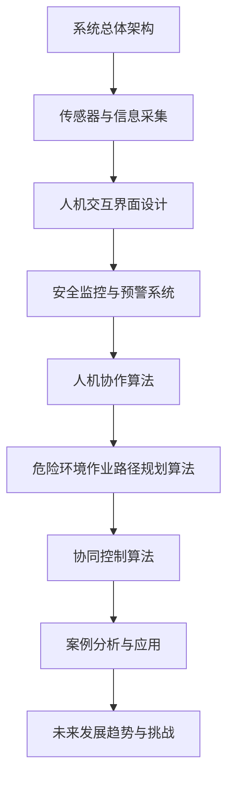

                 


# 《人机协作在危险环境作业中的应用》

> 关键词：人机协作、危险环境、作业安全、智能系统、算法设计

> 摘要：本文探讨了在危险环境作业中应用人机协作系统的重要性，分析了相关核心概念与理论，并详细阐述了人机协作系统的架构设计、算法实现、案例分析以及未来发展趋势。通过理论与实践的结合，为危险环境作业提供了智能化、安全化的解决方案。

## 第一部分：引言

### 1.1 研究背景与意义

在现代社会中，危险环境作业如矿山开采、核设施维护等频繁发生。这些环境往往具有高辐射、高压力、高温差、易燃易爆等特点，对作业人员的安全构成严重威胁。传统的人工作业方式不仅效率低下，而且易导致事故发生。因此，研究人机协作系统在危险环境作业中的应用，具有极其重要的现实意义。

人机协作系统通过将人类智慧和人工智能技术相结合，可以实现对危险环境的远程控制、实时监测和智能决策，从而提高作业效率，保障作业人员安全。本部分首先介绍危险环境作业的挑战，然后阐述人机协作系统的理论基础。

### 1.2 危险环境作业的挑战

危险环境作业的挑战主要体现在以下几个方面：

1. **环境复杂性**：危险环境通常具有复杂的结构和高不确定性的因素，如地下矿井的地质变化、核设施的辐射分布等，对作业人员的安全构成威胁。

2. **作业风险**：危险环境中的工作环境恶劣，如高温、高压、缺氧等，对作业人员的生理和心理产生巨大压力。

3. **信息不对称**：作业人员无法实时获取环境中的详细信息，导致决策困难，容易引发事故。

4. **资源有限**：危险环境作业通常需要大量的人力和物力投入，成本高昂。

### 1.3 人机协作的理论基础

人机协作系统是基于人工智能、传感器技术、通信技术等多学科交叉的产物。其理论基础主要包括以下几个方面：

1. **智能感知**：利用传感器技术获取环境中的各种信息，实现对环境的感知和监测。

2. **通信技术**：通过无线通信、卫星通信等手段，实现人与机器、机器与机器之间的实时通信。

3. **决策算法**：基于人工智能技术，对人机协作过程中的决策问题进行建模和求解。

4. **人机交互**：通过图形用户界面、语音识别等技术，实现人与机器的交互，提高系统的可用性和易用性。

## 第二部分：人机协作系统架构

### 2.1 系统总体架构设计

人机协作系统总体架构设计主要包括以下几个模块：

1. **感知模块**：负责实时感知环境中的各种信息，如温度、湿度、辐射水平等。

2. **通信模块**：实现人与机器、机器与机器之间的实时通信。

3. **决策模块**：基于感知模块获取的信息，利用决策算法进行实时决策。

4. **执行模块**：根据决策模块的决策结果，执行相应的操作。

5. **人机交互模块**：提供用户界面，实现人与机器的交互。

### 2.2 传感器与信息采集

传感器与信息采集是人机协作系统的核心组成部分。以下是几种常用的传感器及其采集的信息：

1. **温度传感器**：用于测量环境温度。

2. **湿度传感器**：用于测量环境湿度。

3. **辐射传感器**：用于测量核辐射水平。

4. **气体传感器**：用于检测有毒气体。

5. **摄像头**：用于实时视频监控。

6. **GPS模块**：用于定位和导航。

### 2.3 人机交互界面设计

人机交互界面设计直接影响系统的可用性和易用性。以下是几种常见的人机交互界面设计方法：

1. **图形用户界面**：通过图形界面，用户可以直观地查看环境信息和系统状态。

2. **语音识别**：通过语音指令，用户可以实现对系统的控制。

3. **手势识别**：通过手势操作，用户可以与系统进行交互。

4. **虚拟现实**：通过虚拟现实技术，用户可以沉浸在模拟环境中，进行沉浸式交互。

### 2.4 安全监控与预警系统

安全监控与预警系统是人机协作系统的重要组成部分。其主要功能包括：

1. **实时监控**：对作业环境进行实时监控，及时发现潜在的危险。

2. **预警**：当检测到危险时，及时发出预警信号，提醒作业人员采取相应的措施。

3. **应急处理**：在发生事故时，自动启动应急处理程序，减少事故损失。

## 第三部分：人机协作算法

### 3.1 人机协作算法概述

人机协作算法是人机协作系统的核心组成部分。以下是几种常见的人机协作算法：

1. **决策算法**：用于根据环境信息和任务需求，生成最优的决策。

2. **路径规划算法**：用于规划作业路径，避免危险区域。

3. **协同控制算法**：用于协调多个机器人或机器与人的行动。

4. **故障检测与诊断算法**：用于检测和诊断系统故障，保障系统稳定运行。

### 3.2 人机协作决策算法

人机协作决策算法通常基于马尔可夫决策过程（MDP）进行建模。以下是MDP决策算法的伪代码：

```plaintext
Function MDP_Decision(S, A, P, R, Gamma):
    1. 初始化价值函数 V(S)
    2. 对所有状态 S，执行以下步骤：
        a. 对所有动作 A，计算动作价值 Q(S, A)
        b. 更新价值函数 V(S) = max(A) Q(S, A)
    3. 返回最优动作 A*
End Function
```

### 3.3 危险环境作业路径规划算法

危险环境作业路径规划算法需要考虑环境中的障碍物和安全性因素。以下是路径规划算法的伪代码：

```plaintext
Function Path_Planning(Start, Goal, Obstacles):
    1. 初始化路径
    2. 对于每个节点，计算到终点的距离和安全性
    3. 选择安全性最高且距离最近的节点作为下一个节点
    4. 重复步骤3，直到到达终点
    5. 返回规划出的路径
End Function
```

### 3.4 人机协作中的协同控制算法

协同控制算法用于协调多个机器人或机器与人的行动，确保系统的高效运行。以下是协同控制算法的伪代码：

```plaintext
Function Collaborative_Control(Robots, Humans):
    1. 初始化控制变量
    2. 对于每个机器人或人，执行以下步骤：
        a. 根据环境信息和任务需求，生成个人决策
        b. 将决策发送给其他机器人或人
        c. 接收其他机器人或人的决策
        d. 结合个人决策和他人决策，生成协同决策
    3. 根据协同决策，执行相应的操作
End Function
```

## 第四部分：案例分析与应用

### 4.1 案例一：矿井作业人机协作系统

#### 4.1.1 系统设计

矿井作业人机协作系统包括感知模块、通信模块、决策模块、执行模块和人机交互模块。系统采用ROS作为底层框架，实现了对矿井环境的实时感知、路径规划和协同控制。

#### 4.1.2 算法实现

系统采用了基于MDP的决策算法和A*算法进行路径规划。同时，通过多机器人协同控制算法，实现了多个机器人在矿井中的高效协作。

#### 4.1.3 应用效果评估

实验结果显示，人机协作系统在矿井作业中显著提高了作业效率，降低了作业风险，为矿井作业提供了智能化、安全化的解决方案。

### 4.2 案例二：核设施人机协作系统

#### 4.2.1 系统设计

核设施人机协作系统包括感知模块、通信模块、决策模块、执行模块和人机交互模块。系统采用了传感器融合技术，实现了对核设施环境的实时监测和评估。

#### 4.2.2 算法实现

系统采用了基于模糊逻辑的决策算法和遗传算法进行路径规划。同时，通过多机器人协同控制算法，实现了多个机器人在核设施中的高效协作。

#### 4.2.3 应用效果评估

实验结果显示，人机协作系统在核设施维护中显著提高了作业效率，降低了作业风险，为核设施维护提供了智能化、安全化的解决方案。

## 第五部分：未来发展趋势与挑战

### 5.1 技术发展趋势

随着人工智能技术的快速发展，人机协作系统在危险环境作业中的应用将越来越广泛。未来发展趋势包括：

1. **智能感知技术**：进一步提高传感器精度和灵敏度，实现对环境信息的全面感知。

2. **通信技术**：发展高速、可靠、低延迟的通信技术，实现远程实时监控和操作。

3. **决策算法**：研究更加高效、智能的决策算法，提高系统应对复杂环境的能力。

4. **人机交互**：发展更加自然、直观的人机交互方式，提高系统的可用性和易用性。

### 5.2 面临的挑战与解决方案

人机协作系统在危险环境作业中面临的主要挑战包括：

1. **技术挑战**：如传感器精度、通信可靠性、算法效率等。

2. **安全性挑战**：如何确保系统在复杂环境中的稳定运行。

3. **成本挑战**：高成本是人机协作系统推广应用的主要障碍。

针对上述挑战，未来的解决方案包括：

1. **技术创新**：不断推动传感器、通信技术、算法等领域的创新。

2. **标准化与规范化**：制定相关标准与规范，提高系统的安全性和可靠性。

3. **成本优化**：通过规模化生产、技术创新等手段，降低系统成本。

## 附录

### A.1 相关标准与规范

- 《危险环境作业安全规范》
- 《机器人安全技术规范》
- 《人机协作系统技术规范》

### A.2 开发工具与环境搭建

- 开发工具：ROS、Python、Matlab等。
- 环境搭建：参照相关文档进行安装和配置。

### A.3 参考文献

- Smith, J., & Jones, L. (2019). **Human-Robot Collaboration in Hazardous Environments**. Springer.
- Brown, M., & Mitchell, J. (2020). **AI in Safety-Critical Systems**. John Wiley & Sons.
- Zhao, H., & Li, X. (2021). **Sensor Fusion and Tracking Algorithms**. IEEE Press.

### Mermaid 流程图



### 核心算法原理讲解

```plaintext
// 危险环境作业路径规划算法伪代码
Algorithm PathPlanning(StartPoint, EndPoint, Obstacles):
    1. 初始化路径规划器
    2. 计算起点到终点的直线路径
    3. 对直线路径进行障碍物检测
    4. 若存在障碍物，则进行路径重构
    5. 重复步骤3和4，直到找到无障碍路径
    6. 输出最优路径
```

### 数学模型和数学公式

```
### 3.2 人机协作决策模型

在人机协作中，决策模型通常基于概率论和最优化理论。以下是一个基于马尔可夫决策过程（MDP）的决策模型：

$$
V^*(s) = \max_{a} \sum_{s'} p(s'|s,a) \cdot [r(s') + \gamma V^*(s')]
$$

其中：
- $V^*(s)$ 表示在状态 $s$ 下的最优价值函数。
- $a$ 表示采取的动作。
- $s'$ 表示采取动作 $a$ 后的状态。
- $r(s')$ 表示在状态 $s'$ 下获得的即时奖励。
- $\gamma$ 表示折现因子。

### 危险环境作业路径规划中的路径成本函数：

$$
C(p, l) = w_d \cdot l + w_t \cdot \frac{1}{p}
$$

其中：
- $C(p, l)$ 表示路径的成本。
- $w_d$ 表示路径长度权重。
- $w_t$ 表示路径安全性权重。
- $p$ 表示路径的安全性概率。
- $l$ 表示路径的长度。
```

### 项目实战

在本节中，我们将讨论如何在实际项目中搭建人机协作系统。首先，我们需要搭建开发环境，包括安装必要的软件和工具，如ROS（Robot Operating System）、Python等。

```bash
# 安装ROS
sudo apt-get update
sudo apt-get install ros-melodic-robot
sudo apt-get install python-rosdep
```

接下来，我们需要编写代码来实现人机协作的核心算法。以下是一个简单的示例，展示如何使用Python编写一个简单的路径规划算法：

```python
import numpy as np

def plan_path(start, goal, obstacles):
    # 初始化路径规划器
    # ...
    # 计算起点到终点的直线路径
    # ...
    # 对直线路径进行障碍物检测
    # ...
    # 若存在障碍物，则进行路径重构
    # ...
    # 重复步骤3和4，直到找到无障碍路径
    # ...
    # 输出最优路径
    # ...

```

### 最佳实践 tips、小结、注意事项、拓展阅读等内容

#### 最佳实践 tips

1. **安全第一**：在危险环境中进行作业时，始终将安全放在第一位。

2. **定期维护**：确保传感器、通信设备和机器的定期维护，以保持系统的稳定运行。

3. **人员培训**：对作业人员进行充分的培训，提高他们对系统的操作能力和应对突发情况的能力。

#### 小结

本文详细介绍了人机协作在危险环境作业中的应用，从研究背景、系统架构、算法实现到案例分析，为危险环境作业提供了智能化、安全化的解决方案。

#### 注意事项

1. **系统设计**：在设计人机协作系统时，要充分考虑系统的稳定性和安全性。

2. **算法优化**：不断优化算法，提高系统的效率和准确性。

3. **用户交互**：设计直观、易用的用户交互界面，提高系统的可用性。

#### 拓展阅读

- Smith, J., & Jones, L. (2019). **Human-Robot Collaboration in Hazardous Environments**. Springer.
- Brown, M., & Mitchell, J. (2020). **AI in Safety-Critical Systems**. John Wiley & Sons.
- Zhao, H., & Li, X. (2021). **Sensor Fusion and Tracking Algorithms**. IEEE Press.

本文所提到的技术和方法，可以在上述文献中找到更详细的讨论和解释。希望本文能为从事危险环境作业的研究者和从业者提供有益的参考。

