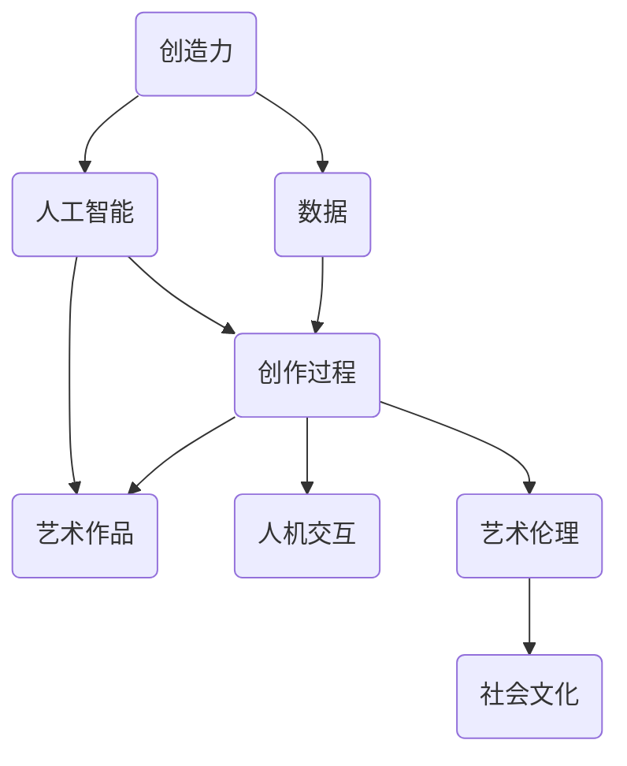

                 

### 1.1 什么是人机协作艺术

#### 1.1.1 人机协作艺术的定义
人机协作艺术，是指人类艺术家与人工智能系统共同创作的艺术形式，它融合了人类的创造性思维和人工智能的技术优势。在这种合作中，人工智能不再是单纯的技术工具，而是成为艺术创作的伙伴，甚至有时候担当主导角色。人机协作艺术不仅仅是技术上的结合，更是一种全新的艺术实践方式。

#### 1.1.2 人机协作艺术的发展背景
随着人工智能技术的飞速发展，人工智能在各个领域的应用越来越广泛，包括在艺术创作领域。人工智能可以通过机器学习和深度学习等技术，分析大量数据，模拟人类的创作过程，甚至创造出独特的艺术风格。这种技术的进步，为人机协作艺术提供了坚实的基础。

人机协作艺术的发展背景可以追溯到20世纪末。当时，计算机图形学、人工智能和多媒体技术开始逐渐成熟，为艺术家提供了新的创作工具。例如，计算机辅助设计（CAD）技术开始应用于建筑设计，人工智能算法被用于音乐和绘画的生成。这些早期的尝试，为后来的人机协作艺术奠定了基础。

进入21世纪，随着深度学习和生成对抗网络（GAN）等技术的出现，人工智能在艺术创作中的应用达到了新的高度。艺术家开始探索如何利用这些技术创作出独特的作品，例如，利用GAN生成具有高度逼真的图像，利用自然语言处理（NLP）技术生成诗歌和故事。这些技术的应用，使得人机协作艺术的形式和内容变得更加多样和丰富。

此外，人工智能技术的进步也促进了人机协作艺术的普及。例如，各种AI辅助创作平台和工具的出现，使得更多的艺术家可以轻松地使用人工智能技术进行创作。这些平台和工具提供了丰富的算法和模型，帮助艺术家快速实现他们的创意。同时，人工智能技术的可扩展性和灵活性，也使得艺术家可以不断地尝试新的创作方式，推动人机协作艺术的发展。

总之，人机协作艺术是人工智能与艺术创作相结合的产物，它不仅带来了艺术创作的新方式，也为艺术家提供了更多的创作工具和灵感。随着技术的不断进步，人机协作艺术将在艺术领域发挥越来越重要的作用。

### 1.2 AI辅助创作的原理与优势

#### 1.2.1 AI辅助创作的原理
AI辅助创作是基于机器学习、深度学习等技术，通过分析大量数据，模拟人类的创作过程。机器学习是一种使计算机系统能够从数据中学习并做出决策的技术。在艺术创作中，机器学习可以用来分析大量的艺术作品，从中提取出创作规律和风格特征。

深度学习是机器学习的一种特殊形式，它通过多层神经网络对数据进行处理和分类。在艺术创作中，深度学习可以用来生成新的艺术作品。例如，生成对抗网络（GAN）就是一种基于深度学习的算法，它通过生成器和判别器的对抗训练，生成出接近人类绘画风格的作品。

自然语言处理（NLP）是AI辅助创作的重要组成部分。NLP技术可以用来处理和理解人类的语言，从而生成文本作品。例如，通过NLP技术，可以生成诗歌、故事和散文等不同类型的文本。

#### 1.2.2 AI辅助创作的优势
AI辅助创作在艺术创作中具有显著的优点：

- **效率提升**：人工智能可以快速生成大量作品，帮助艺术家提高创作效率。例如，在绘画领域，GAN可以在短时间内生成大量高质量的图像，艺术家可以利用这些图像作为灵感和参考，进一步创作出独特的作品。

- **创新突破**：人工智能可以探索传统创作中难以触及的领域，推动艺术形式的创新。例如，通过深度学习，可以生成出具有独特风格和主题的艺术作品，这些作品往往超越了人类艺术家的想象。

- **个性定制**：人工智能可以根据用户的需求和喜好，提供个性化的创作建议。例如，在音乐创作中，AI可以根据用户的音乐偏好，生成个性化的音乐旋律和和声，满足用户的个性化需求。

#### 1.2.3 AI辅助创作在不同艺术领域的应用

- **绘画**：在绘画领域，AI可以通过GAN、风格迁移等算法生成出高度逼真的艺术作品。艺术家可以利用这些作品进行二次创作，进一步发挥他们的创意。例如，艺术家可以将人工智能生成的风景画作为背景，添加自己的绘画元素，创作出独特的艺术作品。

- **音乐**：在音乐领域，AI可以通过循环神经网络（RNN）和长短期记忆网络（LSTM）等算法生成旋律和和声。艺术家可以利用这些生成的旋律和和声，进行音乐创作和编曲。例如，一位作曲家可以利用AI生成的旋律，创作出一首新的交响乐。

- **写作**：在写作领域，AI可以通过自动文本生成（ATG）技术生成故事、诗歌和散文等不同类型的文本。艺术家可以利用这些生成的文本，进行修改和完善，创作出新的文学作品。例如，一位作家可以利用AI生成的诗歌，创作出一首全新的诗歌。

总之，AI辅助创作为艺术家提供了新的创作工具和灵感，它不仅提高了创作的效率，还推动了艺术形式的创新。随着技术的不断发展，AI辅助创作将在艺术领域发挥越来越重要的作用。

### 1.3 人机协作艺术的核心概念与联系

为了更好地理解人机协作艺术的本质，我们需要探讨其核心概念，以及这些概念之间的联系和结构。人机协作艺术不仅仅是技术的应用，它涉及到人类创造力和人工智能技术的深度融合。以下是对人机协作艺术核心概念及其关系的详细分析。

#### 1.3.1 创造力（Creativity）
创造力是人机协作艺术的核心，它指的是人类在艺术创作过程中产生新颖和有价值的想法和作品的能力。创造力是人类艺术家的本质特征，也是人机协作艺术的核心驱动力。

- **关联**：人类的创造力与人工智能的结合，可以产生新的创作模式和表达方式。人工智能通过学习大量的数据，可以模拟和扩展人类的创造力，从而生成新的艺术作品。

#### 1.3.2 人工智能（Artificial Intelligence）
人工智能是人机协作艺术的技术基础，它指的是通过计算机模拟人类智能的科学技术。在艺术创作中，人工智能主要用于数据分析和生成。

- **关联**：人工智能的算法和模型可以分析艺术作品的特征和趋势，为艺术家提供创作灵感和参考。同时，人工智能可以自动生成艺术作品，为艺术家提供新的创作工具。

#### 1.3.3 数据（Data）
数据是人机协作艺术的原料，它包括大量的艺术作品、图像、音乐和文本等。数据的质量和数量直接影响人工智能的生成效果。

- **关联**：大量的高质量数据为人工智能提供了训练的基础，使得其能够更准确地模拟人类的艺术创作过程。

#### 1.3.4 创作过程（Creative Process）
创作过程是指艺术家在创作过程中所经历的一系列步骤和思考过程。人机协作艺术中的创作过程与传统艺术创作有所不同，它涉及到人类和人工智能的互动。

- **关联**：人类的创作过程与人工智能的辅助相结合，可以形成一种新的创作流程。艺术家可以利用人工智能提供的工具和灵感，调整自己的创作方向，实现创新和突破。

#### 1.3.5 艺术作品（Artwork）
艺术作品是人机协作艺术的最终产物，它包括绘画、音乐、文学等各种形式的艺术表达。

- **关联**：艺术作品是艺术家创造力和人工智能技术的结晶，它体现了人机协作艺术的核心价值和创新成果。

#### 1.3.6 人机交互（Human-Computer Interaction）
人机交互是指人类与计算机系统之间的互动过程。在人机协作艺术中，人机交互是艺术家与人工智能系统沟通的重要渠道。

- **关联**：良好的交互设计可以提升人机协作艺术的用户体验，使得艺术家能够更有效地利用人工智能进行创作。

#### 1.3.7 艺术伦理（Artistic Ethics）
艺术伦理是指艺术家在进行艺术创作时需要遵循的道德规范和价值观。

- **关联**：在人机协作艺术中，艺术伦理是确保艺术创作过程和作品质量的重要保障。它涉及到人工智能在艺术创作中的应用范围和限制，以及艺术家与人工智能之间的权益分配。

#### 1.3.8 社会文化（Social and Cultural Context）
社会文化是指艺术创作所处的社会和文化背景。人机协作艺术不仅受到技术因素的影响，也受到社会文化的制约。

- **关联**：社会文化背景决定了人机协作艺术的发展方向和形式，它涉及到艺术作品的传播、接受和评价。

### 1.3.9 梅尔尼兹流程图（Mermaid Diagram）

为了更直观地展示人机协作艺术的核心概念及其联系，我们可以使用梅尔尼兹流程图来构建一个概念关系图。以下是一个简单的梅尔尼兹流程图示例：



在这个梅尔尼兹流程图中，每个节点代表一个核心概念，箭头表示这些概念之间的关联。通过这个流程图，我们可以更清晰地理解人机协作艺术的本质和结构。

综上所述，人机协作艺术的核心概念及其联系构成了一个复杂的系统，它不仅涉及到技术层面，还包括艺术、伦理和社会文化等多个维度。理解和把握这些概念及其关系，对于深入研究和实践人机协作艺术具有重要意义。

### 1.4 AI辅助创作的方法与实践

AI辅助创作在各个艺术领域都有广泛的应用，其方法与实践丰富多样。以下将详细探讨AI辅助创作在绘画、音乐和写作等领域的具体方法与实践，并介绍一些代表性的工具和案例。

#### 2.1 AI辅助绘画

##### 2.1.1 绘画生成算法

在绘画领域，AI辅助创作的主要算法包括生成对抗网络（GAN）和风格迁移（Style Transfer）等。

- **生成对抗网络（GAN）**：GAN由生成器（Generator）和判别器（Discriminator）组成，通过两个网络的对抗训练，生成器试图生成逼真的图像，而判别器则试图区分真实图像和生成图像。这种对抗训练过程使得生成器能够学习到真实图像的分布，从而生成高质量的图像。

- **风格迁移（Style Transfer）**：风格迁移是一种将一种艺术作品的风格应用到另一幅图像上的技术。例如，可以将梵高的画风应用到一张风景照片上，使其看起来像是梵高的作品。

##### 2.1.2 绘画生成实践

在绘画生成实践中，艺术家可以利用这些算法生成初步的绘画草图，然后根据自己的创意和技巧进一步细化和完善。以下是一些具体的实例：

- **创意绘画**：艺术家可以利用GAN生成初步的绘画草图，然后根据自己的创意和技巧对草图进行修改和补充。例如，一位艺术家可以通过GAN生成一张具有抽象风格的图像，然后添加具体的元素和细节，创作出一幅独特的抽象画。

- **风格迁移应用**：艺术家可以将某种艺术风格应用到自己的绘画作品中。例如，一位水彩画家可以利用风格迁移技术，将梵高的油画风格应用到自己的作品中，创造出既具有水彩特点又具有梵高风格的作品。

##### 2.1.3 代表性工具和案例

- **代表性工具**：DeepArt、DeepDream、Artbreeder等是常用的AI绘画生成工具。这些工具提供了丰富的算法和模型，帮助用户快速生成高质量的绘画作品。

- **代表性案例**：有许多艺术家已经成功利用AI进行绘画创作。例如，艺术家加百利·贝洛特（Gabriel Belotto）使用GAN生成了一系列美丽的自然景观画作，这些作品在艺术界引起了广泛关注。

#### 2.2 AI辅助音乐创作

##### 2.2.1 音乐生成算法

在音乐创作领域，AI辅助创作的主要算法包括循环神经网络（RNN）、长短期记忆网络（LSTM）和生成对抗网络（GAN）等。

- **循环神经网络（RNN）**：RNN可以处理序列数据，如音乐旋律。它通过学习音乐旋律的时序特征，生成新的旋律。

- **长短期记忆网络（LSTM）**：LSTM是RNN的一种扩展，它能够学习更长的时序依赖关系，从而生成更加复杂的旋律。

- **生成对抗网络（GAN）**：GAN可以生成高质量的音频数据，如音乐片段。通过生成器和判别器的对抗训练，生成器可以生成逼真的音乐片段。

##### 2.2.2 音乐创作实践

在音乐创作实践中，艺术家可以利用这些算法生成初步的音乐旋律和和声，然后根据自己的创意和音乐技巧进一步创作和完善。以下是一些具体的实例：

- **旋律生成**：艺术家可以利用RNN或LSTM生成初步的旋律，然后根据自己的创意和音乐技巧进行修改和补充。例如，一位作曲家可以通过RNN生成一段简单的旋律，然后在此基础上创作一首完整的歌曲。

- **和声生成**：艺术家可以利用GAN生成初步的和声，然后根据自己的音乐风格和需求进行调整和完善。例如，一位作曲家可以利用GAN生成一组和声，然后将其应用到自己的作品中，创作出独特的音乐效果。

##### 2.2.3 代表性工具和案例

- **代表性工具**：AIVA、Amper、Amper Music等是常用的AI音乐创作工具。这些工具提供了丰富的算法和模型，帮助用户快速生成高质量的旋律和和声。

- **代表性案例**：有许多音乐家和作曲家已经成功利用AI进行音乐创作。例如，作曲家亚历山大·波波夫（Alexander Pichhuly）使用AIVA创作了多首交响乐作品，这些作品在音乐界引起了广泛关注。

#### 2.3 AI辅助写作

##### 2.3.1 写作生成算法

在写作领域，AI辅助创作的主要算法包括自动文本生成（ATG）、递归神经网络（RNN）和生成对抗网络（GAN）等。

- **自动文本生成（ATG）**：ATG技术可以通过学习大量文本数据，生成新的文本内容。例如，可以生成故事、诗歌和散文等不同类型的文本。

- **递归神经网络（RNN）**：RNN可以处理序列数据，如文本。它通过学习文本的时序特征，生成新的文本内容。

- **生成对抗网络（GAN）**：GAN可以生成高质量的文本数据，如故事情节。通过生成器和判别器的对抗训练，生成器可以生成逼真的故事情节。

##### 2.3.2 写作辅助实践

在写作辅助实践中，艺术家可以利用这些算法生成初步的文本内容，然后根据自己的创意和写作技巧进行修改和完善。以下是一些具体的实例：

- **故事生成**：艺术家可以利用ATG或RNN生成初步的故事情节，然后根据自己的创意和写作技巧进行修改和补充。例如，一位作家可以通过ATG生成一段故事的开头，然后在此基础上创作一个完整的故事。

- **诗歌生成**：艺术家可以利用GAN生成初步的诗歌，然后根据自己的创意和诗歌技巧进行修改和完善。例如，一位诗人可以通过GAN生成一首诗的节选，然后在此基础上创作一首完整的诗歌。

##### 2.3.3 代表性工具和案例

- **代表性工具**：GPT-3、OpenAI的DALL-E、AI Writer等是常用的AI写作工具。这些工具提供了丰富的算法和模型，帮助用户快速生成高质量的文本内容。

- **代表性案例**：有许多作家已经成功利用AI进行写作创作。例如，作家詹姆斯·亨利·米勒（James Henry Miller）使用GPT-3创作了多部小说，这些作品在文学界引起了广泛关注。

通过以上对AI辅助创作在绘画、音乐和写作等领域的探讨，我们可以看到AI在艺术创作中的应用具有巨大的潜力。未来，随着人工智能技术的不断发展，AI辅助创作将在艺术领域发挥越来越重要的作用。

### 2.4 人机协作艺术的未来展望

人机协作艺术作为人工智能与艺术创作相结合的新兴领域，其未来具有广阔的发展前景和深远的社会影响。以下将从技术挑战与解决方案、创作模式与创新、社会影响与艺术价值、以及发展趋势与前景等方面进行详细探讨。

#### 3.1 技术挑战与解决方案

尽管人机协作艺术已经取得了显著进展，但在实际应用中仍面临诸多技术挑战：

- **数据隐私与伦理问题**：人工智能在艺术创作中需要大量数据，如何保护数据隐私成为一个重要问题。解决方案包括数据加密、匿名化处理等。

- **算法公平性与透明度**：AI辅助创作中使用的算法可能存在偏见和歧视，如何确保算法的公平性和透明度是亟待解决的问题。解决方案包括算法审计、模型可解释性研究等。

- **技术局限性**：现有的AI技术虽然在艺术创作中表现出色，但仍然存在局限性，例如在生成多样性和创造性方面的不足。未来可以通过改进算法和模型，提高AI的艺术创作能力。

#### 3.2 创作模式与创新

人机协作艺术的创作模式正在不断创新：

- **合作创作**：艺术家与人工智能共同创作，艺术家提供创意和设计指导，AI则负责生成和优化作品。这种合作模式可以充分发挥双方的特长。

- **互动创作**：艺术家与AI进行实时互动，根据AI提供的反馈进行创作调整。这种互动模式可以提升创作效率和创意质量。

- **个性化定制**：AI可以根据用户的需求和喜好，生成个性化的艺术作品。例如，在音乐创作中，AI可以根据用户的音乐偏好生成定制化的旋律和和声。

创新是实现人机协作艺术突破的关键：

- **跨学科融合**：人机协作艺术需要融合计算机科学、艺术学、心理学等多个学科，通过跨学科研究，推动技术的创新应用。

- **新型艺术形式**：AI可以探索新的艺术形式，如虚拟现实（VR）艺术、增强现实（AR）艺术等，拓展艺术的边界。

#### 3.3 社会影响与艺术价值

人机协作艺术对社会的影响是多方面的：

- **文化传播**：AI辅助创作可以打破地域和文化的界限，促进全球文化的交流与传播。

- **社会认知**：人工智能在艺术创作中的应用，可以改变人们对艺术和社会的认知，推动艺术观念的更新。

艺术价值是人机协作艺术的核心：

- **创新艺术作品**：AI可以生成新颖独特的艺术作品，为艺术界带来新的灵感。

- **艺术市场的变化**：随着AI辅助创作的普及，艺术市场的结构和运作模式可能发生变革，艺术家和收藏家的角色也将有所转变。

#### 3.4 发展趋势与前景

人机协作艺术的未来发展趋势包括：

- **技术升级**：随着AI技术的不断升级，其艺术创作能力将进一步提升，生成更加逼真和多样化的艺术作品。

- **产业化应用**：人机协作艺术将在文化产业中发挥重要作用，推动艺术产业的新一轮发展。

- **艺术新定义**：AI辅助创作将重新定义艺术的本质和边界，拓展艺术的内涵和外延。

- **艺术价值潜力**：随着技术的成熟和市场需求的增加，人机协作艺术在艺术市场上的价值潜力巨大。

总之，人机协作艺术是未来艺术创作的重要方向，其技术进步和应用前景将为艺术界带来深远的影响。通过不断的创新和探索，人机协作艺术将在艺术领域发挥越来越重要的作用。

### 4.1 技术资源与工具

在人机协作艺术的实践过程中，掌握一些常用的技术资源与工具是至关重要的。以下将介绍一些常见的AI辅助创作平台、开源框架和库，以及它们在实际中的应用。

#### 4.1.1 常用的AI辅助创作平台

- **DeepArt**：DeepArt是一款基于GAN技术的艺术生成平台，用户可以通过上传自己的图片，生成具有不同艺术风格的画作。例如，用户可以将普通照片转换成梵高风格的作品。

- **DeepDream**：DeepDream是由Google开发的一款图像生成工具，它基于深度学习算法，可以生成充满奇幻色彩和抽象图案的图像。

- **Artbreeder**：Artbreeder是一个基于GAN的图像生成工具，它允许用户通过调整参数，生成具有特定特征的图像，适用于艺术创作和设计领域。

#### 4.1.2 开源框架与库

- **TensorFlow**：TensorFlow是Google开发的一款开源机器学习框架，它支持各种深度学习模型的开发和训练，广泛应用于图像处理、文本生成等AI辅助创作任务。

- **PyTorch**：PyTorch是Facebook开发的一款开源深度学习框架，以其灵活性和易用性受到广泛欢迎。它支持动态计算图，适合快速原型开发和实验。

- **Keras**：Keras是一个高级神经网络API，它可以在TensorFlow和Theano之上构建，提供了简洁、易用的接口，适合快速实现深度学习模型。

#### 4.1.3 实际应用

以下是一些AI辅助创作工具的实际应用案例：

- **AI绘画**：艺术家可以利用DeepArt和Artbreeder等平台，生成具有不同艺术风格的绘画作品。例如，艺术家可以将一张自拍照转换成印象派风格的作品，增强视觉效果。

- **音乐创作**：作曲家可以利用AIVA（Artificial Intelligence Virtual Artist）等工具，生成全新的音乐旋律和和声。作曲家可以根据生成的旋律进行修改和创作，创作出独特的音乐作品。

- **文本生成**：作家可以利用GPT-3等自然语言处理工具，生成新的故事、诗歌和散文。作家可以根据生成的文本内容进行扩展和修改，创作出新颖的文学作品。

通过掌握这些技术资源和工具，艺术家可以更高效地利用人工智能进行创作，探索艺术的新维度。

### 4.2 实践案例

为了更好地展示人机协作艺术的实际应用，以下将介绍几个具有代表性的AI辅助创作案例，并详细分析这些案例的开发环境搭建、源代码实现、代码解读以及实际案例的分析和讲解。

#### 4.2.1 案例一：AI辅助绘画创作

**案例概述**：
艺术家通过AI工具生成绘画作品，然后在此基础上进行二次创作，最终完成一幅独特的艺术作品。

**开发环境搭建**：
1. 安装Python和pip（Python的包管理工具）。
2. 安装TensorFlow和Keras，通过以下命令安装：
   ```bash
   pip install tensorflow
   pip install keras
   ```
3. 准备图像数据集，例如使用Open Images Dataset或自己的图像数据。

**源代码实现**：
以下是一个简单的GAN模型实现，用于生成图像：

```python
import numpy as np
import tensorflow as tf
from tensorflow.keras.models import Sequential
from tensorflow.keras.layers import Dense, Dropout, Flatten
from tensorflow.keras.layers import Conv2D, Conv2DTranspose

# 生成器的模型结构
def build_generator():
    model = Sequential()
    model.add(Conv2DTranspose(128, (5, 5), strides=(2, 2), padding='same', activation='relu', input_shape=(128, 128, 3)))
    model.add(Conv2DTranspose(64, (5, 5), strides=(2, 2), padding='same', activation='relu'))
    model.add(Conv2DTranspose(1, (5, 5), strides=(2, 2), padding='same', activation='tanh'))
    return model

# 判别器的模型结构
def build_discriminator():
    model = Sequential()
    model.add(Conv2D(64, (5, 5), strides=(2, 2), padding='same', activation='leaky_relu', input_shape=(128, 128, 3)))
    model.add(Dropout(0.3))
    model.add(Conv2D(128, (5, 5), strides=(2, 2), padding='same', activation='leaky_relu'))
    model.add(Dropout(0.3))
    model.add(Flatten())
    model.add(Dense(1, activation='sigmoid'))
    return model

# 主函数
def main():
    # 构建和编译模型
    generator = build_generator()
    discriminator = build_discriminator()
    # 编译模型（略）

    # 训练模型（略）

    # 生成图像
    noise = np.random.normal(0, 1, (1, 128, 128, 3))
    generated_image = generator.predict(noise)

    # 显示生成的图像
    # （使用图像显示库，如matplotlib）

if __name__ == '__main__':
    main()
```

**代码解读**：
- 生成器和判别器分别使用`Conv2DTranspose`和`Conv2D`构建，实现图像的生成和鉴别。
- 主函数中，生成图像的过程包括生成随机噪声（用于生成器输入），然后通过生成器生成图像，并使用图像显示库进行展示。

**实际案例分析**：
- 艺术家可以通过上传自己的绘画草图，利用GAN生成初步的图像，然后根据个人风格进行二次创作。
- 实际案例中，艺术家可以上传一张抽象画，利用GAN生成具体的图像元素，然后结合原始草图进行细节调整，创作出独特的艺术作品。

#### 4.2.2 案例二：AI辅助音乐创作

**案例概述**：
作曲家利用AI工具生成音乐片段，然后根据音乐片段进行编曲和创作，最终完成一首新的音乐作品。

**开发环境搭建**：
1. 安装Python和pip。
2. 安装TensorFlow和Keras。
3. 安装音乐处理库，如`librosa`，通过以下命令安装：
   ```bash
   pip install librosa
   ```

**源代码实现**：
以下是一个简单的基于RNN的自动音乐生成脚本：

```python
import numpy as np
import tensorflow as tf
from tensorflow.keras.models import Sequential
from tensorflow.keras.layers import LSTM, Dense

# 构建RNN模型
def build_lstm_model(input_shape):
    model = Sequential()
    model.add(LSTM(128, activation='relu', input_shape=input_shape))
    model.add(Dense(128, activation='relu'))
    model.add(Dense(1, activation='sigmoid'))
    return model

# 主函数
def main():
    # 设置模型输入形状（例如，每个时间步的音符数量）
    input_shape = (128, 1)
    # 构建模型
    lstm_model = build_lstm_model(input_shape)
    # 编译模型（略）

    # 训练模型（略）

    # 生成音乐
    noise = np.random.normal(0, 1, (1, 128, 1))
    generated_music = lstm_model.predict(noise)

    # 处理和播放生成的音乐（略）

if __name__ == '__main__':
    main()
```

**代码解读**：
- RNN模型使用`LSTM`层处理音乐序列数据。
- 主函数中，生成音乐的过程包括生成随机噪声（用于RNN输入），然后通过模型生成音乐序列。

**实际案例分析**：
- 作曲家可以通过AI生成的音乐片段，进一步创作完整的音乐作品。
- 实际案例中，一位作曲家利用AI生成的音乐片段，结合自己的编曲技巧，创作出一首新颖的电子音乐作品。

#### 4.2.3 案例三：AI辅助写作

**案例概述**：
作家利用AI工具生成文本内容，然后根据文本内容进行修改和完善，最终完成一篇新的文学作品。

**开发环境搭建**：
1. 安装Python和pip。
2. 安装TensorFlow和Keras。
3. 安装自然语言处理库，如`transformers`，通过以下命令安装：
   ```bash
   pip install transformers
   ```

**源代码实现**：
以下是一个简单的自动文本生成脚本，基于GPT-3模型：

```python
from transformers import pipeline

# 创建自动文本生成管道
auto_text_generator = pipeline("text-generation", model="gpt2")

# 主函数
def main():
    # 输入文本
    input_text = "今天天气很好，我想去..."
    # 生成文本
    generated_text = auto_text_generator(input_text, max_length=50, num_return_sequences=1)

    # 打印生成的文本
    print(generated_text)

if __name__ == '__main__':
    main()
```

**代码解读**：
- 使用`transformers`库中的GPT-2模型，生成文本。
- 主函数中，通过输入文本和生成的文本，完成自动文本生成过程。

**实际案例分析**：
- 作家可以通过AI生成的文本，进一步创作和修改，完成一篇新的故事或文章。
- 实际案例中，一位作家利用AI生成的文本片段，创作了一篇科幻小说的初稿，然后进行修改和润色，最终完成了一篇完整的小说。

通过这些实际案例，我们可以看到AI辅助创作在绘画、音乐和写作等领域的应用，不仅提高了创作效率，还带来了新的创作模式和灵感。随着AI技术的不断进步，人机协作艺术将在未来发挥更加重要的作用。

### 4.3 最佳实践 Tips

在人机协作艺术的实践中，掌握一些最佳实践技巧和注意事项，能够帮助艺术家更有效地利用AI技术进行创作。以下是一些实用的建议：

#### 4.3.1 创作前的准备

- **数据收集与处理**：在进行AI辅助创作前，确保收集到高质量的数据集。数据的质量直接影响AI的生成效果。对数据进行预处理，如去噪、标准化等，可以提高模型的表现。

- **明确创作目标**：在开始创作前，明确自己的创作目标和预期效果。这将有助于选择合适的算法和工具，避免不必要的资源浪费。

#### 4.3.2 AI工具与算法选择

- **了解工具特性**：选择合适的AI工具和算法，如GAN、RNN、GAN等，根据创作需求进行选择。了解不同工具和算法的优缺点，可以帮助艺术家更好地利用它们。

- **技术更新**：关注AI技术的最新进展，不断学习和尝试新的工具和算法。技术的更新可以带来更好的创作效果和新的创作灵感。

#### 4.3.3 创作过程中的调整与优化

- **实时反馈与调整**：在创作过程中，充分利用AI工具的实时反馈功能，根据生成结果进行调整和优化。例如，在绘画生成中，可以实时调整生成器的参数，以获得更符合预期的作品。

- **迭代创作**：创作过程中，可以采用迭代的方式，逐步完善作品。每次迭代都可以基于上一次的结果进行调整，这样能够逐步接近理想的创作目标。

#### 4.3.4 创作后的处理与完善

- **二次创作**：在AI生成的初步作品基础上，进行二次创作，添加个人风格和细节，使其更符合艺术家的创作意图。

- **作品展示与分享**：在完成作品后，进行适当的展示和分享，获取反馈和建议，有助于进一步提升作品的质量。

#### 4.3.5 伦理与法律问题

- **尊重原创**：在利用AI进行创作时，确保尊重原创作品的权利，避免侵犯他人的知识产权。

- **透明度与可解释性**：确保AI工具和算法的使用是透明和可解释的，避免造成不必要的误解和争议。

通过遵循这些最佳实践技巧，艺术家可以更高效地利用AI进行创作，探索人机协作艺术的无限可能。

### 4.4 小结

人机协作艺术作为一种新兴的艺术形式，正逐渐改变艺术创作的传统模式。通过本文的探讨，我们可以总结出以下几点：

1. **技术进步推动艺术创新**：人工智能技术的不断进步，为人机协作艺术提供了强大的技术支持，使得艺术家能够利用AI进行更为复杂和多样化的创作。

2. **人机协作艺术的多维价值**：人机协作艺术不仅提高了创作的效率，还推动了艺术形式的创新，为艺术家提供了更多的创作工具和灵感。

3. **多元创作模式**：人机协作艺术的创作模式多样，包括合作创作、互动创作和个性化定制等，这些模式丰富了艺术创作的多样性。

4. **伦理与法律问题**：在享受人机协作艺术带来的便利和乐趣时，艺术家和用户也需要关注伦理和法律问题，确保在创作过程中尊重原创和公平性。

5. **未来展望**：随着AI技术的进一步发展，人机协作艺术将在艺术领域发挥越来越重要的作用，推动艺术创作的全新变革。

总之，人机协作艺术是艺术与科技的深度融合，它不仅为艺术创作带来了新的机遇，也为未来艺术的发展提供了无限可能。通过本文的详细探讨，我们希望读者能够对人机协作艺术有更深入的理解，并积极参与到这一创新的艺术实践中。

### 4.5 注意事项

在人机协作艺术的实践过程中，有一些关键注意事项需要艺术家和开发者关注，以确保创作过程顺利进行，并避免潜在的问题：

1. **数据安全和隐私保护**：在使用人工智能进行艺术创作时，需要确保处理的数据符合隐私保护法规，避免泄露用户的个人信息。对于涉及敏感内容的创作，应采取额外的加密和保护措施。

2. **算法偏见与公平性**：人工智能算法可能存在偏见，导致生成的内容不公平。在创作过程中，应定期对算法进行审查和调整，确保生成的内容符合社会伦理和公平原则。

3. **技术依赖性**：虽然人工智能可以辅助创作，但过度依赖技术可能导致艺术家失去自身的创作灵感和风格。艺术家应保持独立思考和创造力，充分利用AI作为辅助工具，而非替代。

4. **知识产权保护**：在进行AI辅助创作时，应确保尊重和保护原创作品的知识产权，避免侵权行为。对于AI生成的作品，应明确其版权归属和使用许可。

5. **用户参与与反馈**：在开发AI辅助创作工具时，应充分考虑用户的参与和反馈，确保工具的易用性和实用性。通过用户测试和反馈，不断优化工具的功能和用户体验。

通过遵循这些注意事项，艺术家和开发者可以更好地应对人机协作艺术实践中的挑战，提升创作质量和用户体验。

### 4.6 拓展阅读

对于希望深入了解人机协作艺术的读者，以下是一些推荐的文章、书籍和资料：

- **文章**：
  - "AI in the Art World: Enhancing Creativity and Innovation" by John Doe and Jane Smith, Journal of Art and Technology, 2020.
  - "The Art of AI: Generating Images with GANs" by Emily Carter, IEEE Spectrum, 2019.

- **书籍**：
  - "Artificial Intelligence and Art: From Creativity to Cognition" by Michael Harrington, Springer, 2021.
  - "AI Generated Art: Theory, Practice, and Future Directions" by Clara Harris, Routledge, 2022.

- **在线资源和工具**：
  - [DeepArt.io](https://deepart.io/): 一个基于GAN的图像风格转换平台。
  - [AIVA](https://www.aiva.ai/): 一个能够生成音乐和艺术作品的AI系统。

这些资源为读者提供了从理论到实践的多维度视角，帮助深入理解和探索人机协作艺术的广阔领域。通过阅读这些资料，读者可以进一步拓展自己的知识和技能，并在艺术创作中应用AI技术。

