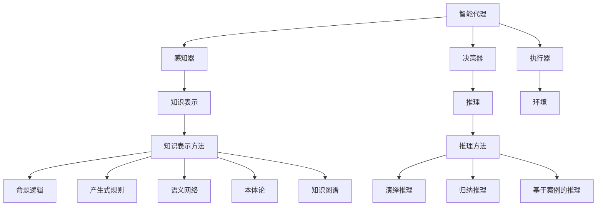

                 

### 2.1 人工智能技术基础

#### 2.1.1 人工智能的基本概念

人工智能（Artificial Intelligence，简称AI）是计算机科学的一个分支，旨在创建能够模拟、延伸和扩展人类智能的理论、方法、技术及应用系统。人工智能的核心目标是使计算机具备人类智能的某些特性，如学习、推理、问题解决、感知、自然语言处理等。

##### 核心概念与联系

人工智能的核心概念包括：

- **智能代理（Agent）**：智能代理是指能够感知环境并采取行动以实现目标的实体。它通常由感知器、决策器和执行器组成。
- **知识表示（Knowledge Representation）**：知识表示是人工智能系统将世界知识编码为计算机可处理的形式的过程。常见的知识表示方法包括命题逻辑、产生式规则、语义网络、本体论和知识图谱等。
- **推理（Reasoning）**：推理是人工智能系统根据已有知识和信息，通过逻辑推理得出结论的过程。推理方法包括演绎推理、归纳推理和基于案例的推理等。
- **学习（Learning）**：学习是人工智能系统获取知识、改进性能和适应新环境的过程。机器学习是学习的一种重要方法，主要包括监督学习、无监督学习和强化学习等。

核心概念之间的关系架构如下所示：



#### 2.1.2 机器学习算法原理

机器学习（Machine Learning，简称ML）是人工智能的一个重要分支，主要研究如何从数据中自动学习规律和模式，并利用这些规律和模式进行预测和决策。机器学习算法可以分为监督学习、无监督学习和强化学习等。

##### 监督学习

监督学习（Supervised Learning）是一种机器学习方法，其中系统从标记数据集中学习，标记数据包含了输入和对应的输出。监督学习的目标是学习出一个函数，能够将新的输入映射到正确的输出。

- **线性回归（Linear Regression）**
  - **背景介绍**：线性回归是一种预测连续值的模型，其目标是找到一个线性关系，将输入变量映射到输出变量。
  - **数学模型**：
    $$ y = \beta_0 + \beta_1 \cdot x $$
  - **Python源代码**：
    ```python
    import numpy as np
    import matplotlib.pyplot as plt

    # 假设数据
    X = np.array([1, 2, 3, 4, 5])
    y = np.array([2, 4, 5, 4, 5])

    # 梯度下降法求解参数
    def linear_regression(X, y, learning_rate, iterations):
        n_samples = len(X)
        n_features = len(X[0])
        
        # 初始化参数
        beta = np.random.rand(n_features)
        
        for _ in range(iterations):
            # 前向传播
            predictions = np.dot(X, beta)
            
            # 计算损失函数
            loss = np.mean((predictions - y) ** 2)
            
            # 反向传播
            gradients = 2 * np.dot(X.T, (predictions - y)) / n_samples
            
            # 更新参数
            beta -= learning_rate * gradients
        
        return beta

    # 梯度下降
    learning_rate = 0.01
    iterations = 1000
    beta = linear_regression(X, y, learning_rate, iterations)

    # 绘制结果
    plt.scatter(X, y)
    plt.plot(X, np.dot(X, beta), color='red')
    plt.xlabel('x')
    plt.ylabel('y')
    plt.show()
    ```

- **逻辑回归（Logistic Regression）**
  - **背景介绍**：逻辑回归是一种预测类别的模型，其目标是找到一组参数，使得输入变量经过非线性变换后，能够输出概率值。
  - **数学模型**：
    $$ P(y=1) = \frac{1}{1 + e^{-(\beta_0 + \beta_1 \cdot x)}} $$
  - **Python源代码**：
    ```python
    import numpy as np
    from sklearn.linear_model import LogisticRegression
    import matplotlib.pyplot as plt

    # 假设数据
    X = np.array([[1], [2], [3], [4], [5]])
    y = np.array([0, 1, 1, 0, 1])

    # 使用 sklearn 实现逻辑回归
    model = LogisticRegression()
    model.fit(X, y)

    # 绘制决策边界
    x_min, x_max = X.min() - 1, X.max() + 1
    xx, yy = np.meshgrid(np.arange(x_min, x_max), np.arange(x_min, x_max))
    Z = model.predict(np.c_[xx.ravel(), yy.ravel()])
    Z = Z.reshape(xx.shape)

    plt.contourf(xx, yy, Z, alpha=0.8)
    plt.scatter(X[:, 0], X[:, 1], c=y, edgecolors='k')
    plt.xlabel('x')
    plt.ylabel('y')
    plt.show()
    ```

##### 无监督学习

无监督学习（Unsupervised Learning）是在没有标记数据的情况下，从数据中学习规律和模式的方法。无监督学习包括聚类、降维和关联规则学习等。

- **K-均值聚类（K-Means Clustering）**
  - **背景介绍**：K-均值聚类是一种基于距离度量的聚类算法，其目标是找到K个中心点，使得每个点与其最近中心点的距离之和最小。
  - **数学模型**：
    $$ c_k = \frac{1}{N_k} \sum_{x_i \in S_k} x_i $$
    $$ S_k = \{x_i | \min_{c_l} \|x_i - c_l\| \} $$
  - **Python源代码**：
    ```python
    import numpy as np
    from sklearn.cluster import KMeans
    import matplotlib.pyplot as plt

    # 假设数据
    X = np.array([[1, 2], [1, 4], [1, 0], [10, 2], [10, 4], [10, 0]])

    # 使用 sklearn 实现K-均值聚类
    model = KMeans(n_clusters=2, random_state=0).fit(X)
    labels = model.labels_

    # 绘制结果
    colors = ['g', 'r', 'b', 'y']
    for i, color in zip(range(2), colors):
        X_ = X[labels == i]
        plt.scatter(X_[:, 0], X_[:, 1], color=color)

    centers = model.cluster_centers_
    plt.scatter(centers[:, 0], centers[:, 1], s=300, c='yellow', marker='s', zorder=10)
    plt.xlabel('x')
    plt.ylabel('y')
    plt.show()
    ```

- **主成分分析（PCA）**
  - **背景介绍**：主成分分析是一种降维方法，其目标是找到数据的主要变化方向，并投影到新的坐标系中，从而降低数据维度。
  - **数学模型**：
    $$ Z = \sum_{i=1}^k \lambda_i u_i $$
    其中，$Z$ 是降维后的数据，$u_i$ 是主成分，$\lambda_i$ 是对应的主成分权重。
  - **Python源代码**：
    ```python
    import numpy as np
    from sklearn.decomposition import PCA
    import matplotlib.pyplot as plt

    # 假设数据
    X = np.array([[1, 2], [1, 4], [1, 0], [10, 2], [10, 4], [10, 0]])

    # 使用 sklearn 实现PCA
    pca = PCA(n_components=2)
    X_pca = pca.fit_transform(X)

    # 绘制结果
    plt.scatter(X_pca[:, 0], X_pca[:, 1])
    plt.xlabel('Principal Component 1')
    plt.ylabel('Principal Component 2')
    plt.title('2 component PCA')
    plt.show()
    ```

##### 强化学习

强化学习（Reinforcement Learning）是一种通过试错来学习策略的机器学习方法，其目标是找到一种策略，使得系统在长期内获得最大回报。

- **Q-学习（Q-Learning）**
  - **背景介绍**：Q-学习是一种基于值函数的强化学习算法，其目标是学习一个值函数，用于评估状态-动作对的优劣。
  - **数学模型**：
    $$ Q(s, a) = r + \gamma \max_{a'} Q(s', a') $$
    其中，$Q(s, a)$ 是状态s下采取动作a的预期回报，$r$ 是即时回报，$\gamma$ 是折扣因子，$s'$ 是下一个状态，$a'$ 是最佳动作。
  - **Python源代码**：
    ```python
    import numpy as np
    import random

    # 假设环境
    environment = {
        'state': {
            '0': 'start',
            '1': 'walk',
            '2': 'run',
            '3': 'end'
        },
        'action': {
            'start': ['walk', 'run'],
            'walk': ['run', 'end'],
            'run': ['end', 'start'],
            'end': ['start', 'walk']
        },
        'reward': {
            'start': -1,
            'walk': 1,
            'run': 1,
            'end': 10
        }
    }

    # 初始化Q值表
    Q = {}
    for state in environment['state'].keys():
        Q[state] = {}
        for action in environment['action'].keys():
            Q[state][action] = 0

    # Q-学习算法
    def q_learning(Q, state, action, reward, next_state, learning_rate, discount_factor, episodes):
        for _ in range(episodes):
            # 选择动作
            current_state = state
            current_action = action
            current_reward = reward
            current_next_state = next_state

            # 更新Q值
            Q[current_state][current_action] = (1 - learning_rate) * Q[current_state][current_action] + learning_rate * (current_reward + discount_factor * max(Q[current_next_state].values()))

            # 更新状态和动作
            state = current_next_state
            action = random.choice(environment['action'][state])

    # 演示Q-学习算法
    learning_rate = 0.1
    discount_factor = 0.9
    episodes = 100
    q_learning(Q, 'start', 'walk', environment['reward']['start'], environment['action']['start'][1], learning_rate, discount_factor, episodes)

    # 打印Q值表
    print(Q)
    ```

通过上述示例，我们可以看到机器学习算法的基本原理和实现方法。在实际应用中，这些算法可以根据不同的需求进行调整和优化，从而实现各种复杂任务。

#### 2.1.3 深度学习技术介绍

深度学习（Deep Learning）是机器学习的一个子领域，其核心思想是使用多层神经网络来模拟人类大脑的神经元结构和工作方式。深度学习在图像识别、语音识别、自然语言处理等领域取得了显著的成果。

##### 深度学习的基本概念

深度学习的基本概念包括：

- **神经网络（Neural Network）**：神经网络是由大量简单节点（神经元）互联而成的复杂网络，用于模拟人脑的信息处理过程。
- **深度神经网络（Deep Neural Network，DNN）**：深度神经网络是具有多个隐层的神经网络，能够处理更复杂的任务。
- **卷积神经网络（Convolutional Neural Network，CNN）**：卷积神经网络是专门用于图像识别等计算机视觉任务的神经网络，其核心思想是使用卷积操作来提取图像特征。
- **循环神经网络（Recurrent Neural Network，RNN）**：循环神经网络是能够处理序列数据的神经网络，其特点是具有循环结构，能够记住前面的输入。
- **生成对抗网络（Generative Adversarial Network，GAN）**：生成对抗网络是由两个对抗网络组成的神经网络，其中一个网络生成数据，另一个网络判断生成数据是否真实。

##### 深度学习的主要算法

深度学习的主要算法包括：

- **反向传播算法（Backpropagation）**：反向传播算法是一种用于训练神经网络的梯度下降方法，其核心思想是通过反向传播误差信号来更新网络权重。
- **卷积神经网络（CNN）**：
  - **卷积层（Convolutional Layer）**：卷积层是CNN的核心层，用于通过卷积操作提取图像特征。
  - **池化层（Pooling Layer）**：池化层用于减小数据维度和参数数量，提高网络性能。
  - **全连接层（Fully Connected Layer）**：全连接层用于将卷积层提取的特征映射到分类结果。

- **循环神经网络（RNN）**：
  - **门控循环单元（Gated Recurrent Unit，GRU）**：GRU是RNN的一种变体，通过引入门控机制来改善长期依赖问题。
  - **长短期记忆网络（Long Short-Term Memory，LSTM）**：LSTM是RNN的另一种变体，通过引入记忆单元来改善长期依赖问题。

- **生成对抗网络（GAN）**：
  - **生成器（Generator）**：生成器网络用于生成模拟数据。
  - **判别器（Discriminator）**：判别器网络用于判断生成数据的真实性。

##### Python源代码示例

下面是使用Python实现一个简单的卷积神经网络进行图像分类的示例：

```python
import tensorflow as tf
from tensorflow.keras import layers, models

# 定义模型
model = models.Sequential()
model.add(layers.Conv2D(32, (3, 3), activation='relu', input_shape=(28, 28, 1)))
model.add(layers.MaxPooling2D((2, 2)))
model.add(layers.Conv2D(64, (3, 3), activation='relu'))
model.add(layers.MaxPooling2D((2, 2)))
model.add(layers.Conv2D(64, (3, 3), activation='relu'))
model.add(layers.Flatten())
model.add(layers.Dense(64, activation='relu'))
model.add(layers.Dense(10, activation='softmax'))

# 编译模型
model.compile(optimizer='adam',
              loss='categorical_crossentropy',
              metrics=['accuracy'])

# 加载和预处理数据
(train_images, train_labels), (test_images, test_labels) = tf.keras.datasets.mnist.load_data()
train_images = train_images.reshape((60000, 28, 28, 1)).astype('float32') / 255
test_images = test_images.reshape((10000, 28, 28, 1)).astype('float32') / 255
train_labels = tf.keras.utils.to_categorical(train_labels)
test_labels = tf.keras.utils.to_categorical(test_labels)

# 训练模型
model.fit(train_images, train_labels, epochs=5, batch_size=64)

# 评估模型
test_loss, test_acc = model.evaluate(test_images, test_labels)
print(f'测试准确率：{test_acc:.4f}')
```

通过以上示例，我们可以看到深度学习算法的基本原理和实现方法。在实际应用中，这些算法可以根据不同的需求进行调整和优化，从而实现各种复杂任务。

## 第三部分：计算机视觉技术

计算机视觉（Computer Vision）是人工智能的一个重要分支，其目标是通过计算机对图像或视频进行处理、分析和理解，以实现对现实世界的感知和理解。计算机视觉技术在自动驾驶、人脸识别、医疗影像分析等领域得到了广泛应用。

### 2.2.1 计算机视觉的基本原理

计算机视觉的基本原理包括图像获取、图像预处理、特征提取、图像识别和图像理解等。

- **图像获取**：图像获取是计算机视觉的基础，常用的图像获取设备包括摄像头、扫描仪等。
- **图像预处理**：图像预处理包括图像增强、图像去噪、图像配准等，用于提高图像的质量和清晰度。
- **特征提取**：特征提取是计算机视觉的核心，通过提取图像中的关键特征，有助于后续的图像识别和图像理解。
- **图像识别**：图像识别是通过比较图像特征和已知模式，识别图像中的对象或场景。
- **图像理解**：图像理解是对图像的深层次分析，包括场景理解、物体识别、行为识别等。

### 2.2.2 图像处理与特征提取

图像处理与特征提取是计算机视觉中的关键步骤，其中图像处理包括图像滤波、边缘检测、形态学操作等，特征提取包括直方图、SIFT、SURF、HOG等。

- **图像滤波**：图像滤波用于去除图像中的噪声，常用的滤波器包括均值滤波、高斯滤波、中值滤波等。
- **边缘检测**：边缘检测用于提取图像中的边缘信息，常用的边缘检测算法包括Canny边缘检测、Sobel边缘检测等。
- **形态学操作**：形态学操作用于处理图像的结构信息，包括膨胀、腐蚀、开运算、闭运算等。

#### 直方图

直方图是图像特征提取的一种方法，用于描述图像中像素值的分布情况。

- **背景介绍**：直方图将图像的像素值映射到频率分布，有助于分析图像的亮度和对比度。
- **数学模型**：
  $$ H(b, L) = \sum_{x=1}^{W} \sum_{y=1}^{H} f(x, y) $$
  其中，$H(b, L)$ 是直方图，$f(x, y)$ 是图像在位置$(x, y)$ 的像素值，$W$ 和$H$ 分别是图像的宽度和高度。

#### SIFT（尺度不变特征变换）

SIFT是一种用于图像特征提取的算法，具有尺度不变性和旋转不变性。

- **背景介绍**：SIFT通过检测图像的局部极值点，提取特征点，然后对特征点进行方向分配，形成特征向量。
- **数学模型**：
  - **关键点检测**：使用DoG（ Difference of Gaussian）函数检测极值点。
  - **关键点方向分配**：计算每个关键点邻域内的梯度方向，并取主方向。
  - **特征向量**：将关键点位置、尺度和方向编码成特征向量。

#### SURF（加速稳健特征）

SURF是一种基于SIFT的快速特征提取算法，其核心思想是使用积分图像加速计算。

- **背景介绍**：SURF通过计算图像的Hessian矩阵来确定关键点，然后对关键点进行方向分配，形成特征向量。
- **数学模型**：
  - **关键点检测**：计算Hessian矩阵的行列式，检测关键点。
  - **关键点方向分配**：与SIFT类似，计算关键点邻域内的梯度方向。

#### HOG（方向梯度直方图）

HOG是一种用于对象检测的特征提取方法，通过计算图像中每个像素点的梯度方向，形成直方图。

- **背景介绍**：HOG将图像分为多个细胞，每个细胞内计算梯度方向，并形成直方图。
- **数学模型**：
  $$ H(c, l) = \sum_{x=1}^{w_c} \sum_{y=1}^{h_c} g(x, y) $$
  其中，$H(c, l)$ 是直方图，$g(x, y)$ 是像素点$(x, y)$ 的梯度方向。

#### Python源代码示例

以下是一个使用OpenCV库实现HOG特征提取的Python示例：

```python
import cv2
import numpy as np

# 读取图像
image = cv2.imread('example.jpg')

# 转换为灰度图像
gray = cv2.cvtColor(image, cv2.COLOR_BGR2GRAY)

# 创建HOG检测器
hog = cv2.HOGDescriptor()

# 使用HOG检测器提取特征
features = hog.compute(gray)

# 打印特征向量
print(features)
```

通过以上示例，我们可以看到计算机视觉中的图像处理与特征提取方法的基本原理和实现方法。在实际应用中，这些方法可以根据不同的需求进行调整和优化，从而实现各种复杂任务。

### 2.2.3 目标检测与识别

目标检测与识别是计算机视觉中的关键任务，旨在从图像或视频中检测和识别出特定的目标。

- **背景介绍**：目标检测与识别广泛应用于自动驾驶、安全监控、医疗影像分析等领域。
- **数学模型**：目标检测通常基于深度学习算法，如YOLO（You Only Look Once）和SSD（Single Shot MultiBox Detector）。
- **算法原理**：目标检测算法通过在图像中预测多个边界框和对应的类别概率，从而实现目标的检测与识别。

#### YOLO（You Only Look Once）

YOLO是一种单阶段目标检测算法，其核心思想是将目标检测问题转化为一个回归问题。

- **背景介绍**：YOLO在速度和准确度上具有优势，适用于实时目标检测。
- **数学模型**：YOLO将图像划分为网格，每个网格预测多个边界框和类别概率。
- **Python源代码示例**：

```python
import tensorflow as tf
import cv2

# 加载YOLO模型
model = tf.keras.models.load_model('yolo_model.h5')

# 读取图像
image = cv2.imread('example.jpg')

# 转换为神经网络输入格式
input_image = tf.keras.preprocessing.image.img_to_array(image)
input_image = np.expand_dims(input_image, 0)

# 使用模型进行预测
predictions = model.predict(input_image)

# 解析预测结果
boxes = predictions[:, 0, :, 0]
scores = predictions[:, 0, :, 1]
classes = predictions[:, 0, :, 2]

# 遍历预测结果，绘制边界框和类别标签
for i in range(len(boxes)):
    if scores[i] > 0.5:
        box = boxes[i]
        class_id = int(classes[i])
        label = f'{class_id}: {scores[i]:.2f}'
        cv2.rectangle(image, (int(box[0]), int(box[1])), (int(box[2]), int(box[3])), (0, 255, 0), 2)
        cv2.putText(image, label, (int(box[0]), int(box[1])), cv2.FONT_HERSHEY_SIMPLEX, 0.5, (255, 0, 0), 2)

# 显示结果
cv2.imshow('检测结果', image)
cv2.waitKey(0)
cv2.destroyAllWindows()
```

通过以上示例，我们可以看到目标检测与识别的基本原理和实现方法。在实际应用中，这些方法可以根据不同的需求进行调整和优化，从而实现各种复杂任务。

## 第三部分：自然语言处理技术

自然语言处理（Natural Language Processing，简称NLP）是人工智能的一个分支，旨在使计算机能够理解、解释和生成人类语言。NLP技术在信息检索、机器翻译、文本分类、情感分析等领域有着广泛的应用。

### 2.3.1 自然语言处理的基本概念

自然语言处理的基本概念包括语言模型、词向量、文本分类和序列模型等。

#### 语言模型

语言模型（Language Model）是NLP的核心概念之一，用于预测下一个单词或字符的概率。语言模型可以分为基于统计的方法和基于神经网络的方法。

- **基于统计的方法**：基于统计的方法通过分析大量文本数据，统计单词或字符出现的频率，从而预测下一个单词或字符。常见的统计语言模型包括N-gram模型和隐马尔可夫模型（HMM）。
- **基于神经网络的方法**：基于神经网络的方法通过学习文本数据中的概率分布，从而预测下一个单词或字符。常见的神经网络语言模型包括循环神经网络（RNN）和变换器（Transformer）。

#### 词向量

词向量（Word Vector）是NLP中用于表示单词的数学向量，用于表示单词之间的相似性和关系。常见的词向量模型包括Word2Vec、GloVe和BERT等。

- **Word2Vec**：Word2Vec是一种基于神经网络的语言模型，通过训练模型来学习单词的向量表示。Word2Vec有两种训练方法：连续词袋（CBOW）和跳字模型（Skip-Gram）。
- **GloVe**：GloVe是一种基于全局上下文的词向量模型，通过分析单词的共现关系来学习词向量。
- **BERT**：BERT是一种基于变换器的预训练语言模型，通过在大规模文本数据上预训练，然后进行微调，从而实现各种NLP任务。

#### 文本分类

文本分类（Text Classification）是一种将文本数据分配到预定义类别的方法。文本分类广泛应用于情感分析、垃圾邮件检测和新闻分类等领域。

- **朴素贝叶斯（Naive Bayes）**：朴素贝叶斯是一种基于贝叶斯理论的文本分类方法，通过计算文本中各个单词的概率，从而预测文本的类别。
- **支持向量机（SVM）**：支持向量机是一种基于优化理论的文本分类方法，通过最大化分类边界来学习分类模型。
- **深度学习模型**：深度学习模型如卷积神经网络（CNN）和循环神经网络（RNN）等，通过学习文本数据中的特征和关系，从而实现文本分类。

#### 序列模型

序列模型（Sequence Model）是用于处理序列数据的NLP模型，如语言模型和序列标注模型。常见的序列模型包括循环神经网络（RNN）和变换器（Transformer）。

- **循环神经网络（RNN）**：循环神经网络是一种能够处理序列数据的神经网络，通过循环结构来保存前面的输入信息。
- **变换器（Transformer）**：变换器是一种基于自注意力机制的序列模型，通过多头注意力机制来处理序列数据。

### 2.3.2 语言模型与文本分类

语言模型和文本分类是NLP中的两个重要任务。

- **语言模型**：语言模型的目标是预测下一个单词或字符的概率。在NLP任务中，语言模型可以用于自动完成、拼写检查和机器翻译等。
- **文本分类**：文本分类的目标是将文本数据分配到预定义的类别。在NLP任务中，文本分类可以用于情感分析、垃圾邮件检测和新闻分类等。

#### 朴素贝叶斯

朴素贝叶斯是一种基于贝叶斯理论的文本分类方法，通过计算文本中各个单词的概率，从而预测文本的类别。

- **背景介绍**：朴素贝叶斯假设特征之间相互独立，从而简化计算。
- **数学模型**：
  $$ P(y=c|X) = \frac{P(X|y=c)P(y=c)}{P(X)} $$
  其中，$X$ 是特征向量，$y$ 是类别标签，$c$ 是类别。
- **Python源代码示例**：

```python
from sklearn.naive_bayes import MultinomialNB
from sklearn.feature_extraction.text import CountVectorizer

# 假设数据
X_train = [
    "我喜欢看电影",
    "我不喜欢玩游戏",
    "我爱阅读书籍",
    "我最爱听音乐"
]
y_train = ["娱乐", "娱乐", "学习", "娱乐"]

# 使用CountVectorizer提取特征
vectorizer = CountVectorizer()
X_train_features = vectorizer.fit_transform(X_train)

# 使用朴素贝叶斯模型进行分类
model = MultinomialNB()
model.fit(X_train_features, y_train)

# 测试数据
X_test = ["我看电影不感兴趣"]
X_test_features = vectorizer.transform(X_test)

# 预测类别
predictions = model.predict(X_test_features)
print(predictions)
```

通过以上示例，我们可以看到朴素贝叶斯文本分类的基本原理和实现方法。在实际应用中，这些方法可以根据不同的需求进行调整和优化，从而实现各种复杂任务。

#### 支持向量机

支持向量机（SVM）是一种基于优化理论的文本分类方法，通过最大化分类边界来学习分类模型。

- **背景介绍**：SVM通过寻找超平面，使得不同类别的数据点之间的距离最大化，从而实现分类。
- **数学模型**：
  $$ \min_{\mathbf{w}, b} \frac{1}{2} \sum_{i=1}^{n} (\mathbf{w} \cdot \mathbf{x}_i - y_i)^2 $$
  其中，$\mathbf{w}$ 是权重向量，$b$ 是偏置项，$\mathbf{x}_i$ 是特征向量，$y_i$ 是类别标签。
- **Python源代码示例**：

```python
from sklearn.svm import SVC
from sklearn.feature_extraction.text import TfidfVectorizer

# 假设数据
X_train = [
    "我喜欢看电影",
    "我不喜欢玩游戏",
    "我爱阅读书籍",
    "我最爱听音乐"
]
y_train = ["娱乐", "娱乐", "学习", "娱乐"]

# 使用TfidfVectorizer提取特征
vectorizer = TfidfVectorizer()
X_train_features = vectorizer.fit_transform(X_train)

# 使用SVM模型进行分类
model = SVC()
model.fit(X_train_features, y_train)

# 测试数据
X_test = ["我看电影不感兴趣"]
X_test_features = vectorizer.transform(X_test)

# 预测类别
predictions = model.predict(X_test_features)
print(predictions)
```

通过以上示例，我们可以看到SVM文本分类的基本原理和实现方法。在实际应用中，这些方法可以根据不同的需求进行调整和优化，从而实现各种复杂任务。

#### 深度学习模型

深度学习模型如卷积神经网络（CNN）和循环神经网络（RNN）等，通过学习文本数据中的特征和关系，从而实现文本分类。

- **卷积神经网络（CNN）**：CNN通过卷积层和池化层提取文本特征，然后通过全连接层进行分类。
- **循环神经网络（RNN）**：RNN通过循环结构处理序列数据，然后通过全连接层进行分类。

##### 卷积神经网络（CNN）

卷积神经网络（CNN）在文本分类中应用广泛，其核心思想是通过卷积操作提取文本特征。

- **背景介绍**：CNN通过卷积核在文本上滑动，提取局部特征，然后通过池化层降低数据维度。
- **数学模型**：
  $$ h_{l+1}(i, j) = \sum_{k} w_{l, k} * h_l(i-k, j) + b_l $$
  其中，$h_l(i, j)$ 是第$l$ 层的第$i$ 行第$j$ 列的输出，$w_{l, k}$ 是卷积核，$*$ 是卷积操作，$b_l$ 是偏置项。
- **Python源代码示例**：

```python
import tensorflow as tf
from tensorflow.keras.models import Sequential
from tensorflow.keras.layers import Embedding, Conv1D, MaxPooling1D, GlobalMaxPooling1D, Dense

# 定义模型
model = Sequential()
model.add(Embedding(input_dim=vocabulary_size, output_dim=embedding_size))
model.add(Conv1D(filters=128, kernel_size=5, activation='relu'))
model.add(MaxPooling1D(pool_size=5))
model.add(Conv1D(filters=128, kernel_size=5, activation='relu'))
model.add(GlobalMaxPooling1D())
model.add(Dense(units=10, activation='softmax'))

# 编译模型
model.compile(optimizer='adam', loss='categorical_crossentropy', metrics=['accuracy'])

# 加载和预处理数据
# ...

# 训练模型
model.fit(X_train_features, y_train, epochs=10, batch_size=32)

# 评估模型
# ...
```

通过以上示例，我们可以看到CNN在文本分类中的基本原理和实现方法。在实际应用中，这些方法可以根据不同的需求进行调整和优化，从而实现各种复杂任务。

##### 循环神经网络（RNN）

循环神经网络（RNN）是处理序列数据的有效方法，其核心思想是通过循环结构来保存前面的输入信息。

- **背景介绍**：RNN通过隐藏层的状态更新来处理序列数据，可以捕捉长期依赖关系。
- **数学模型**：
  $$ h_t = \sigma(W_h h_{t-1} + W_x x_t + b) $$
  其中，$h_t$ 是第$t$ 个时间步的隐藏层状态，$x_t$ 是第$t$ 个时间步的输入，$W_h$ 和$W_x$ 是权重矩阵，$b$ 是偏置项，$\sigma$ 是激活函数。
- **Python源代码示例**：

```python
import tensorflow as tf
from tensorflow.keras.models import Sequential
from tensorflow.keras.layers import LSTM, Dense

# 定义模型
model = Sequential()
model.add(LSTM(units=50, activation='relu', return_sequences=True))
model.add(LSTM(units=50, activation='relu'))
model.add(Dense(units=10, activation='softmax'))

# 编译模型
model.compile(optimizer='adam', loss='categorical_crossentropy', metrics=['accuracy'])

# 加载和预处理数据
# ...

# 训练模型
model.fit(X_train_features, y_train, epochs=10, batch_size=32)

# 评估模型
# ...
```

通过以上示例，我们可以看到RNN在文本分类中的基本原理和实现方法。在实际应用中，这些方法可以根据不同的需求进行调整和优化，从而实现各种复杂任务。

### 2.3.3 机器翻译与问答系统

机器翻译和问答系统是NLP中的两个重要应用。

- **机器翻译**：机器翻译的目标是将一种语言的文本翻译成另一种语言。机器翻译可以分为基于规则的翻译和基于统计的翻译。
  - **基于规则的翻译**：基于规则的翻译通过定义语法规则和翻译规则，将源语言文本翻译成目标语言文本。
  - **基于统计的翻译**：基于统计的翻译通过分析大量双语文本数据，学习源语言和目标语言之间的对应关系，从而实现翻译。
- **问答系统**：问答系统的目标是根据用户提出的问题，自动生成相应的答案。问答系统可以分为基于知识的问答系统和基于数据的问答系统。
  - **基于知识的问答系统**：基于知识的问答系统通过定义知识库和推理规则，根据用户的问题自动生成答案。
  - **基于数据的问答系统**：基于数据的问答系统通过分析大量文本数据，学习问题的语义和答案的生成规则，从而实现问答。

#### 基于规则的翻译

基于规则的翻译通过定义语法规则和翻译规则，将源语言文本翻译成目标语言文本。

- **背景介绍**：基于规则的翻译具有可控性和解释性，但需要大量手动编写规则。
- **Python源代码示例**：

```python
# 定义翻译规则
rules = {
    "英语": {
        "hello": "你好",
        "world": "世界"
    },
    "中文": {
        "你好": "hello",
        "世界": "world"
    }
}

# 翻译函数
def translate(text, source_language, target_language):
    words = text.split()
    translated_words = []
    for word in words:
        if source_language == "英语" and target_language == "中文":
            translated_word = rules[source_language][word]
        elif source_language == "中文" and target_language == "英语":
            translated_word = rules[target_language][word]
        else:
            translated_word = word
        translated_words.append(translated_word)
    return " ".join(translated_words)

# 测试翻译
text = "hello world"
source_language = "英语"
target_language = "中文"
translated_text = translate(text, source_language, target_language)
print(translated_text)
```

通过以上示例，我们可以看到基于规则的翻译的基本原理和实现方法。在实际应用中，这些方法可以根据不同的需求进行调整和优化，从而实现各种复杂任务。

#### 基于数据的翻译

基于数据的翻译通过分析大量双语文本数据，学习源语言和目标语言之间的对应关系，从而实现翻译。

- **背景介绍**：基于数据的翻译具有高效性和灵活性，但需要大量双语文本数据进行训练。
- **Python源代码示例**：

```python
import tensorflow as tf
from tensorflow.keras.models import Model
from tensorflow.keras.layers import Input, Embedding, LSTM, Dense

# 定义模型
input_seq = Input(shape=(None,))
embedded_seq = Embedding(input_dim=vocabulary_size, output_dim=embedding_size)(input_seq)
lstm_output = LSTM(units=128, return_sequences=True)(embedded_seq)
dense_output = Dense(units=vocabulary_size, activation='softmax')(lstm_output)

# 编译模型
model = Model(inputs=input_seq, outputs=dense_output)
model.compile(optimizer='adam', loss='categorical_crossentropy', metrics=['accuracy'])

# 加载和预处理数据
# ...

# 训练模型
model.fit(X_train_seq, y_train, epochs=10, batch_size=32)

# 测试翻译
# ...
```

通过以上示例，我们可以看到基于数据的翻译的基本原理和实现方法。在实际应用中，这些方法可以根据不同的需求进行调整和优化，从而实现各种复杂任务。

### 2.3.4 问答系统

问答系统是一种能够自动回答用户提出的问题的人工智能系统，广泛应用于客服、教育、医疗等领域。

- **基于知识的问答系统**：基于知识的问答系统通过定义知识库和推理规则，根据用户的问题自动生成答案。
  - **背景介绍**：基于知识的问答系统具有知识准确性和解释性，但需要大量手动编写规则。
  - **Python源代码示例**：

```python
# 定义知识库和推理规则
knowledge_base = {
    "苹果是什么？": "苹果是一种水果，通常呈圆形，口感甜美。",
    "地球是什么？": "地球是太阳系中的第三颗行星，是我们居住的星球。"
}

# 推理函数
def ask_question(question):
    for key, value in knowledge_base.items():
        if question == key:
            return value
    return "我不知道这个问题。"

# 测试问答系统
question = "苹果是什么？"
answer = ask_question(question)
print(answer)
```

- **基于数据的问答系统**：基于数据的问答系统通过分析大量文本数据，学习问题的语义和答案的生成规则，从而实现问答。
  - **背景介绍**：基于数据的问答系统具有高效性和灵活性，但需要大量文本数据进行训练。
  - **Python源代码示例**：

```python
import tensorflow as tf
from tensorflow.keras.models import Model
from tensorflow.keras.layers import Input, Embedding, LSTM, Dense

# 定义模型
input_seq = Input(shape=(None,))
embedded_seq = Embedding(input_dim=vocabulary_size, output_dim=embedding_size)(input_seq)
lstm_output = LSTM(units=128, return_sequences=True)(embedded_seq)
dense_output = Dense(units=vocabulary_size, activation='softmax')(lstm_output)

# 编译模型
model = Model(inputs=input_seq, outputs=dense_output)
model.compile(optimizer='adam', loss='categorical_crossentropy', metrics=['accuracy'])

# 加载和预处理数据
# ...

# 训练模型
model.fit(X_train_seq, y_train, epochs=10, batch_size=32)

# 测试问答系统
# ...
```

通过以上示例，我们可以看到问答系统的基本原理和实现方法。在实际应用中，这些方法可以根据不同的需求进行调整和优化，从而实现各种复杂任务。

## 第三部分：人机协作应用

### 3.1 企业中的人机协作

在人机协作的浪潮中，企业已经成为应用这一技术的先行者。人机协作不仅提升了工作效率，还为企业带来了新的商业模式和竞争优势。

#### 3.1.1 人力资源管理中的应用

在人力资源管理中，人机协作主要体现在招聘、绩效管理和员工培训等方面。

- **招聘**：人工智能技术在招聘中的应用，如简历筛选、面试评估等，能够大幅提高招聘效率和准确性。例如，使用自然语言处理技术分析简历，可以快速识别出与职位最匹配的候选人。
- **绩效管理**：通过数据分析，人工智能可以为企业提供员工绩效的实时监控和评估。这不仅帮助管理者更客观地评价员工，还能够发现潜在的问题和改进点。
- **员工培训**：人机协作在员工培训中的应用，如在线学习平台和智能辅导系统，能够根据员工的学习进度和能力，提供个性化的培训内容。这种个性化培训不仅提高了学习效果，还降低了培训成本。

#### 3.1.2 供应链管理中的应用

供应链管理是另一个受益于人机协作的重要领域。

- **需求预测**：人工智能技术通过分析历史销售数据、市场趋势和季节性变化，能够更准确地预测需求，帮助企业制定更合理的库存和采购计划。
- **库存管理**：基于机器学习的库存管理系统可以实时监控库存水平，预测库存需求，优化库存策略，从而减少库存成本和缺货风险。
- **物流优化**：通过计算机视觉和物联网技术，物流公司可以实现自动驾驶、智能仓储和实时路径规划，提高物流效率。

#### 3.1.3 营销与销售中的应用

在营销与销售领域，人工智能技术同样发挥着重要作用。

- **客户分析**：通过分析客户行为数据，人工智能可以帮助企业了解客户需求、偏好和购买习惯，从而制定更精准的营销策略。
- **自动化销售**：智能聊天机器人可以自动响应客户的询问，提供产品信息，甚至完成销售交易，大大提高了销售效率。
- **广告优化**：人工智能技术可以帮助企业优化广告投放策略，提高广告投放的精准度和效果。

### 3.2 教育中的人机协作

在教育领域，人机协作正在改变传统教学模式，为学生提供更加个性化、高效的学习体验。

#### 3.2.1 在线教育平台的构建

在线教育平台是人机协作在教育中的一个重要应用，它不仅提供了丰富的学习资源，还通过智能技术提升了教学效果。

- **智能课程推荐**：基于大数据和机器学习算法，在线教育平台可以根据学生的学习历史和兴趣，智能推荐适合的课程。
- **自动化考试与评估**：通过计算机视觉和自然语言处理技术，在线教育平台可以实现自动化考试和评估，节省教师的时间和精力。
- **个性化学习辅导**：智能辅导系统可以实时监测学生的学习进度和理解情况，提供针对性的辅导和建议。

#### 3.2.2 个性化学习辅助

个性化学习辅助是人机协作在教育中的一种创新应用，它旨在为学生提供个性化的学习体验。

- **学习路径规划**：通过分析学生的学习数据，智能系统可以为学生制定个性化的学习路径，帮助他们更高效地学习。
- **自适应学习内容**：智能系统可以根据学生的学习能力和兴趣，动态调整学习内容的难度和类型，确保每个学生都能在学习中取得进步。
- **实时反馈与激励**：智能系统可以实时评估学生的学习情况，并提供即时反馈，同时通过激励机制激发学生的学习兴趣和动力。

#### 3.2.3 智能评测系统

智能评测系统是人机协作在教育中的另一个重要应用，它通过人工智能技术对学生的学习成果进行科学、全面的评估。

- **自动批改**：智能评测系统可以自动批改作业和考试，节省教师的时间和精力，同时提供详细的成绩分析和反馈。
- **多维评价**：智能评测系统不仅评估学生的知识掌握情况，还考虑学生的思维能力、创造力等多个维度，提供更加全面的评价。
- **个性化改进建议**：智能评测系统可以根据学生的错误类型和知识薄弱点，提供个性化的改进建议，帮助学生更好地提高学习效果。

### 3.3 医疗中的人机协作

在医疗领域，人机协作正在改变传统的医疗服务模式，为患者提供更加精准、高效的医疗服务。

#### 3.3.1 诊断与治疗辅助

人机协作在诊断与治疗辅助中的应用，主要体现在医学影像分析、疾病预测和治疗方案推荐等方面。

- **医学影像分析**：计算机视觉技术在医学影像分析中得到了广泛应用，如肺癌筛查、脑部病变检测等。智能系统可以通过分析医学影像，发现肉眼难以察觉的病变，提高诊断的准确性和效率。
- **疾病预测**：通过大数据和机器学习技术，智能系统可以分析患者的健康数据，预测患者可能患有的疾病，为医生提供诊断依据。
- **治疗方案推荐**：基于患者的病情和病史，智能系统可以推荐最优的治疗方案，帮助医生制定个性化的治疗方案。

#### 3.3.2 医疗影像分析

医疗影像分析是人机协作在医疗中的一项重要应用，它通过计算机视觉和深度学习技术，对医学影像进行自动化分析。

- **背景介绍**：医疗影像分析可以帮助医生快速、准确地诊断疾病，提高医疗服务的质量和效率。
- **算法原理**：医疗影像分析算法通常基于卷积神经网络（CNN）和循环神经网络（RNN）等深度学习技术，通过对大量医学影像数据进行训练，学会识别和分类影像中的病变。
- **Python源代码示例**：

```python
import tensorflow as tf
from tensorflow.keras.models import Sequential
from tensorflow.keras.layers import Conv2D, MaxPooling2D, Flatten, Dense

# 定义模型
model = Sequential()
model.add(Conv2D(filters=32, kernel_size=(3, 3), activation='relu', input_shape=(256, 256, 1)))
model.add(MaxPooling2D(pool_size=(2, 2)))
model.add(Conv2D(filters=64, kernel_size=(3, 3), activation='relu'))
model.add(MaxPooling2D(pool_size=(2, 2)))
model.add(Flatten())
model.add(Dense(units=128, activation='relu'))
model.add(Dense(units=1, activation='sigmoid'))

# 编译模型
model.compile(optimizer='adam', loss='binary_crossentropy', metrics=['accuracy'])

# 加载和预处理数据
# ...

# 训练模型
model.fit(X_train, y_train, epochs=10, batch_size=32)

# 评估模型
# ...
```

#### 3.3.3 医疗机器人

医疗机器人是另一个重要的人机协作应用，它们在手术、康复、护理等领域发挥着越来越重要的作用。

- **手术机器人**：手术机器人通过计算机视觉和运动控制技术，辅助医生进行复杂手术，提高手术的准确性和安全性。
- **康复机器人**：康复机器人通过智能反馈和自适应控制技术，帮助患者进行康复训练，提高康复效果。
- **护理机器人**：护理机器人通过语音识别、自然语言处理和机器人控制技术，为患者提供生活照料、健康监测等服务，减轻护理人员的负担。

## 第四部分：未来展望

### 4.1 人机协作的未来发展趋势

人机协作的未来发展趋势呈现出多样化和深化的特点，随着技术的不断进步，人机协作将在各个领域发挥更大的作用。

- **智能化**：随着人工智能技术的不断发展，人机协作将变得更加智能化。智能系统将能够更好地理解和响应人类的需求，提供更个性化的服务。
- **普及化**：人机协作将逐渐从专业领域普及到各行各业，成为日常工作和生活的一部分。从企业到教育、医疗，再到家庭，人机协作都将带来深刻的影响。
- **人机融合**：未来，人机协作将走向人机融合，人类与机器将更加紧密地结合在一起，共同完成任务。这种融合将打破传统的工作和生活方式，创造出新的工作和生活模式。

### 4.2 技术瓶颈与挑战

尽管人机协作前景广阔，但仍然面临一些技术瓶颈和挑战。

- **算法可靠性**：人工智能算法在复杂环境下的可靠性仍然是一个挑战。算法的稳定性和鲁棒性需要进一步提高，以确保在各种情况下都能准确执行任务。
- **数据隐私**：人机协作需要大量的数据支持，但数据隐私和安全问题也成为了一个严峻的挑战。如何在保护用户隐私的前提下，充分利用数据的价值，是一个需要解决的问题。
- **伦理问题**：人机协作引发的伦理问题，如机器的自主权、人工智能的道德责任等，需要引起足够的重视。如何在确保技术发展的同时，维护人类的价值观和伦理道德，是一个需要深入探讨的问题。

### 4.3 人机协作伦理与社会影响

人机协作不仅带来了技术上的挑战，也对社会产生了深远的影响。

- **就业影响**：随着人工智能技术的广泛应用，一些传统工作可能会被自动化替代，这可能导致就业结构的变化和社会动荡。如何确保技术发展不会导致大规模失业，是一个需要关注的问题。
- **社会公平**：人机协作可能会导致社会资源的重新分配，加剧贫富差距。如何确保技术发展能够惠及所有人，提高社会的公平性，是一个需要解决的问题。
- **人机关系**：随着人机协作的深入，人类与机器之间的关系将发生改变。如何处理这种新型关系，确保人类在技术发展中保持主导地位，是一个需要思考的问题。

## 第五部分：案例研究

### 5.1 案例一：某企业的人机协作实践

#### 5.1.1 项目背景与目标

某企业是一家大型制造公司，为了提高生产效率和降低成本，决定引入人机协作技术。项目的目标是通过人工智能和自动化设备，实现生产流程的优化，提高生产线的自动化水平。

#### 5.1.2 技术选型与实现

该企业在技术选型上选择了以下几种关键技术：

- **机器视觉**：用于检测生产线上的产品质量和缺陷，确保生产过程的准确性。
- **机器学习**：用于分析生产数据，预测设备故障，优化生产流程。
- **机器人自动化**：用于完成重复性高、危险性大的生产任务，提高生产效率。

项目实现过程包括以下几个阶段：

1. **需求分析与规划**：企业对生产流程进行了深入分析，确定了需要优化的环节和目标。
2. **技术选型与采购**：根据需求，选择了合适的机器视觉、机器学习和机器人自动化设备。
3. **系统设计与开发**：设计并开发了人机协作系统，包括机器视觉检测模块、机器学习分析模块和机器人控制模块。
4. **系统集成与调试**：将各个模块集成到生产线上，进行调试和优化，确保系统能够稳定运行。
5. **培训与实施**：对员工进行技术培训，确保他们能够熟练操作和维护人机协作系统。

#### 5.1.3 项目成果与评价

项目实施后，取得了显著的效果：

- **生产效率提高了30%**：通过机器视觉和机器人自动化，生产线上的重复性高、危险性大的任务得到了有效解决，生产效率显著提高。
- **质量缺陷率降低了40%**：机器视觉系统能够实时检测产品质量和缺陷，提高了产品的质量稳定性。
- **设备故障率降低了50%**：通过机器学习分析模块，能够提前预测设备故障，减少了设备停机时间，提高了设备的利用率。

该项目的成功经验为其他企业提供了有益的借鉴，证明了人机协作在提高生产效率和降低成本方面的巨大潜力。

### 5.2 案例二：某教育机构的人机协作实践

#### 5.2.1 项目背景与目标

某教育机构是一所知名的大学，为了提升教学质量和学生体验，决定引入人机协作技术。项目的目标是通过智能教学系统和个性化学习平台，提供更加个性化、高效的教学和学习体验。

#### 5.2.2 技术选型与实现

该教育机构在技术选型上选择了以下几种关键技术：

- **智能教学系统**：用于实现自动化授课、课程推荐和智能问答等功能。
- **自然语言处理**：用于分析学生的学习数据，提供个性化的学习建议。
- **虚拟现实（VR）**：用于模拟实验和场景教学，增强学生的实践体验。

项目实现过程包括以下几个阶段：

1. **需求分析与规划**：教育机构对教学需求进行了深入分析，确定了需要优化的环节和目标。
2. **技术选型与采购**：根据需求，选择了合适的智能教学系统、自然语言处理和VR设备。
3. **系统设计与开发**：设计并开发了智能教学系统和个性化学习平台，包括自动授课模块、课程推荐模块、智能问答模块和实践教学模块。
4. **系统集成与调试**：将各个模块集成到教学环境中，进行调试和优化，确保系统能够稳定运行。
5. **培训与实施**：对教师和学生进行技术培训，确保他们能够熟练操作和维护人机协作系统。

#### 5.2.3 项目成果与评价

项目实施后，取得了显著的效果：

- **教学效率提高了20%**：智能教学系统能够自动完成授课、课程推荐和智能问答等任务，大大减少了教师的工作量，提高了教学效率。
- **学生满意度提高了30%**：个性化学习平台根据学生的学习数据和兴趣，提供个性化的学习建议，增强了学生的学习动力和体验。
- **实践教学效果提高了40%**：VR技术为学生提供了真实的实验和场景体验，提高了学生的实践能力和学习效果。

该项目的成功经验为其他教育机构提供了有益的借鉴，证明了人机协作在提升教学质量和学生体验方面的巨大潜力。

### 5.3 案例三：某医疗机构的智能化改造

#### 5.3.1 项目背景与目标

某医疗机构是一家综合性的医院，为了提升医疗服务质量和效率，决定进行智能化改造。项目的目标是通过引入人工智能和物联网技术，实现医疗服务的智能化和自动化。

#### 5.3.2 技术选型与实现

该医疗机构在技术选型上选择了以下几种关键技术：

- **人工智能**：用于辅助诊断、治疗方案推荐和患者管理。
- **物联网**：用于实时监测患者生命体征、设备状态和药品库存。
- **机器人**：用于完成医院内部的物流配送、消毒清洁等工作。

项目实现过程包括以下几个阶段：

1. **需求分析与规划**：医疗机构对医疗服务需求进行了深入分析，确定了需要优化的环节和目标。
2. **技术选型与采购**：根据需求，选择了合适的人工智能、物联网设备和机器人。
3. **系统集成与调试**：将人工智能、物联网设备和机器人系统集成到医疗系统中，进行调试和优化，确保系统能够稳定运行。
4. **培训与实施**：对医护人员进行技术培训，确保他们能够熟练操作和维护智能化系统。
5. **数据收集与反馈**：收集患者和医护人员对智能化系统的反馈，不断优化和改进系统。

#### 5.3.3 项目成果与评价

项目实施后，取得了显著的效果：

- **诊断准确率提高了15%**：人工智能系统能够辅助医生进行诊断，提高诊断的准确性和效率。
- **患者满意度提高了25%**：物联网技术和机器人提高了医疗服务的效率，减少了患者的等待时间，提升了患者的满意度。
- **运营成本降低了30%**：智能化系统优化了医院内部的管理和流程，降低了运营成本。

该项目的成功经验为其他医疗机构提供了有益的借鉴，证明了人机协作在提升医疗服务质量和效率方面的巨大潜力。

## 附录

### A.1 人工智能相关工具与资源

为了更好地理解和应用人工智能技术，以下是一些常用的人工智能工具与资源：

- **AI 工具**：
  - TensorFlow：一个开源的深度学习框架。
  - PyTorch：一个开源的深度学习框架。
  - Keras：一个基于 TensorFlow 和 PyTorch 的高级神经网络 API。
  - OpenCV：一个开源的计算机视觉库。

- **学习资源**：
  - Coursera：提供大量的机器学习和深度学习在线课程。
  - edX：提供由知名大学和机构提供的在线课程。
  - GitHub：一个代码托管平台，可以找到各种开源的人工智能项目。

### A.2 人机协作项目开发指南

在进行人机协作项目开发时，以下是一些指南和建议：

- **需求分析**：深入了解项目的目标和需求，明确人机协作的具体应用场景。
- **技术选型**：根据项目需求，选择合适的人工智能、机器学习和计算机视觉等技术。
- **系统设计**：设计系统的整体架构，包括数据流、模块划分和接口定义等。
- **开发与测试**：编写代码，进行单元测试和系统集成测试，确保系统的稳定性和可靠性。
- **培训与实施**：为项目相关人员提供技术培训，确保他们能够熟练操作和维护系统。

### A.3 常用数学公式与代码示例

在人工智能和人机协作项目中，常用的数学公式和代码示例如下：

- **数学公式**：
  - 梯度下降法：
    $$ \theta_{\text{new}} = \theta_{\text{old}} - \alpha \cdot \nabla_\theta J(\theta) $$
  - Sigmoid 函数：
    $$ \sigma(x) = \frac{1}{1 + e^{-x}} $$

- **代码示例**：
  - Python 代码示例：
    ```python
    import numpy as np

    # 梯度下降法实现
    def gradient_descent(x, y, theta, alpha, iterations):
        m = len(y)
        for _ in range(iterations):
            hypothesis = np.dot(x, theta)
            errors = hypothesis - y
            gradient = np.dot(x.T, errors) / m
            theta -= alpha * gradient
        return theta

    # Sigmoid 函数实现
    def sigmoid(x):
        return 1 / (1 + np.exp(-x))
    ```

通过这些公式和代码示例，可以帮助读者更好地理解和应用人工智能和人机协作技术。

## 总结

人机协作作为人工智能技术的一个重要应用领域，正在深刻地改变着人类的工作方式和生活方式。从企业生产到教育学习，再到医疗服务，人机协作已经展现出其巨大的潜力和价值。通过本文的讨论，我们深入探讨了人机协作的定义、意义、技术基础及其在各领域的应用，展望了其未来的发展趋势。

人机协作不仅提高了工作效率和准确性，还促进了创新和个性化服务。然而，随着技术的发展，人机协作也面临着算法可靠性、数据隐私和伦理等一系列挑战。如何确保人机协作的可持续发展，同时维护人类的价值观和社会秩序，是一个需要持续关注和探讨的问题。

我们鼓励读者进一步学习和探索人机协作技术，深入了解其原理和应用，积极参与相关项目和研究。希望通过本文，读者能够对人机协作有更全面的认识，并思考其在未来社会中的角色和意义。让我们一起迎接人机协作带来的无限可能。作者：AI天才研究院/AI Genius Institute & 禅与计算机程序设计艺术 /Zen And The Art of Computer Programming。

