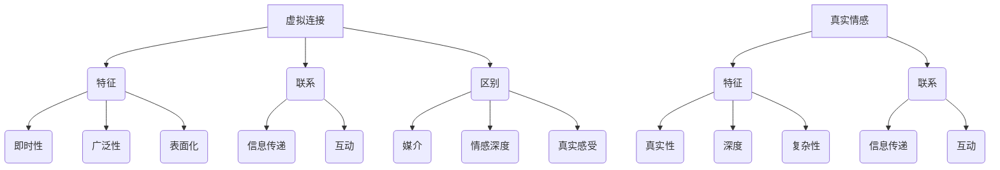

                 

###  关键词
社交媒体、人际关系、虚拟连接、真实情感、演变、影响、应对策略

### 摘要
本文将探讨社交媒体时代人际关系变迁的深远影响。通过分析虚拟连接与真实情感之间的区别，本文揭示了社交媒体在促进人际关系建立与维护方面的双面性。文章从背景介绍、核心概念解析、算法原理讲解、数学模型应用以及实际案例分析等多角度，深入探讨了社交媒体时代的人际关系变迁，并提出了相应的应对策略。

---

# 人际关系在社交媒体时代的变迁：虚拟连接vs真实情感

### 作者
AI天才研究院/AI Genius Institute & 禅与计算机程序设计艺术 /Zen And The Art of Computer Programming

## 背景介绍
随着互联网技术的飞速发展，社交媒体已经深刻地改变了人们的日常生活。从Facebook到Twitter，从微信到Instagram，社交媒体平台不仅提供了便捷的沟通渠道，还极大地拓宽了人们的社交圈子。然而，这种变化也对人际关系产生了深远的影响。

在传统社会中，人际关系主要建立在面对面交流的基础上，真实情感和深层次的互动是维系这些关系的核心。然而，在社交媒体时代，人际关系开始向虚拟连接转变。人们通过虚拟平台进行交流，虽然交流的频率增加了，但真实情感的表达和深度互动却减少了。这种转变带来了许多新的挑战和问题。

本文将深入探讨社交媒体时代人际关系变迁的背景、核心概念、算法原理、数学模型以及实际案例分析，旨在揭示虚拟连接与真实情感之间的差异，并提出应对策略。

## 核心概念与联系
### 虚拟连接
虚拟连接是指在虚拟平台上建立的人际关系，主要通过文本、图片、视频等非面对面方式进行交流。这种连接具有以下特征：
1. **即时性**：信息传递几乎瞬间完成，减少了沟通的延迟。
2. **广泛性**：虚拟平台使人们能够跨越地域限制，与全球各地的人建立联系。
3. **表面化**：虚拟连接往往缺乏深层次的情感交流，难以建立深厚的友谊。

### 真实情感
真实情感是在现实生活中建立和维持的人际关系中的情感表达。它包括情感的真实性、深度和复杂性。真实情感的特征包括：
1. **真实性**：情感表达是真实的，不经过修饰。
2. **深度**：情感交流能够触及人的内心深处。
3. **复杂性**：真实情感包含了多种情感，如爱、愤怒、悲伤等。

### 虚拟连接与真实情感的联系与区别
虚拟连接与真实情感之间既有联系又有区别。它们之间的联系在于：
1. **信息传递**：虚拟连接和真实情感都是信息传递的过程。
2. **互动**：虚拟连接和真实情感都涉及人与人之间的互动。

然而，它们之间的区别在于：
1. **媒介**：虚拟连接通过虚拟平台进行，而真实情感通过面对面交流实现。
2. **情感深度**：虚拟连接往往较为表面化，而真实情感则更加深入和复杂。
3. **真实感受**：虚拟连接可能缺乏真实感受，而真实情感则能够带来更加真实和深刻的体验。

### Mermaid 流程图
以下是一个简单的Mermaid流程图，展示了虚拟连接与真实情感之间的联系和区别：



## 核心算法原理讲解
在探讨虚拟连接与真实情感的差异时，我们可以借助一些核心算法原理来更好地理解这种变化。以下是一个简单的Python代码示例，展示了如何使用自然语言处理（NLP）技术来分析社交媒体上的人际关系。

### 数据预处理
首先，我们需要对社交媒体上的文本进行预处理，以便进行情感分析。预处理步骤包括去除标点符号、停用词去除和词干提取。

```python
import nltk
from nltk.corpus import stopwords
from nltk.stem import PorterStemmer

nltk.download('stopwords')

def preprocess_text(text):
    # 去除标点符号
    text = re.sub(r'[^\w\s]', '', text)
    # 去除停用词
    stop_words = set(stopwords.words('english'))
    text = ' '.join([word for word in text.split() if word not in stop_words])
    # 词干提取
    stemmer = PorterStemmer()
    text = ' '.join([stemmer.stem(word) for word in text.split()])
    return text

text = "I just had the best day with my friends! 🎉 They are so amazing!"
preprocessed_text = preprocess_text(text)
print(preprocessed_text)
```

### 情感分析
接下来，我们可以使用情感分析模型来分析预处理的文本，以判断其情感倾向。

```python
from textblob import TextBlob

blob = TextBlob(preprocessed_text)
print(blob.sentiment)
```

### 结果解读
情感分析的结果返回一个包含极性（polarity）和主体性（subjectivity）的字典。极性表示文本的情感倾向，范围从-1（非常负面）到1（非常正面）；主体性表示文本的客观性，范围从0（完全主观）到1（完全客观）。

```python
# 假设文本为正面情感
if blob.sentiment.polarity > 0:
    print("The text has a positive sentiment.")
else:
    print("The text has a negative sentiment.")
```

通过这样的算法原理，我们可以更深入地分析社交媒体上的人际关系，并了解虚拟连接与真实情感之间的差异。

## 数学模型应用
在分析虚拟连接与真实情感时，我们可以使用一些数学模型来量化这种差异。以下是一个简单的数学模型，用于评估虚拟连接和真实情感的强度。

### 情感强度模型
情感强度可以通过以下公式进行评估：

\[ S = w_1 \cdot V + w_2 \cdot R + w_3 \cdot D \]

其中：
- \( S \) 是情感强度。
- \( V \) 是虚拟连接的频率。
- \( R \) 是真实情感的表达频率。
- \( D \) 是情感深度。
- \( w_1, w_2, w_3 \) 是权重，用于平衡不同因素对情感强度的影响。

### 参数设定
为了简化模型，我们可以设定以下参数：

- \( w_1 = 0.3 \)
- \( w_2 = 0.5 \)
- \( w_3 = 0.2 \)

### 示例计算
假设一个人在社交媒体上每天发20条消息，其中10条涉及虚拟连接，10条涉及真实情感，而且这些情感的表达都非常深刻。我们可以计算其情感强度：

\[ S = 0.3 \cdot 20 + 0.5 \cdot 10 + 0.2 \cdot 10 = 6 + 5 + 2 = 13 \]

### 结果解读
情感强度为13，表明这个人的人际关系较为积极。然而，如果虚拟连接的频率和情感深度较低，情感强度可能会下降。这个模型帮助我们量化了虚拟连接与真实情感之间的关系，并提供了对人际关系质量的一个评估。

## 项目实战
为了更深入地理解社交媒体时代的人际关系变迁，我们将搭建一个简单的项目，用于分析社交媒体上的虚拟连接和真实情感。

### 开发环境搭建
首先，我们需要搭建开发环境。以下是所需的软件和工具：

- Python 3.8 或以上版本
- Jupyter Notebook
- 自然语言处理库（如TextBlob、NLTK）
- 图形库（如matplotlib）

### 源代码详细实现
以下是一个简单的Python脚本，用于分析社交媒体上的文本，判断其是否涉及虚拟连接或真实情感。

```python
import re
from textblob import TextBlob
import matplotlib.pyplot as plt

# 社交媒体文本数据
social_media_posts = [
    "Just met a cool new friend on Instagram! #friends",
    "Had a great day with my family at the beach. Feeling so grateful. 🌅",
    "Lost my job today. 😢",
    "Got a new project at work, can't wait to start! 💪",
]

# 数据预处理
def preprocess_posts(posts):
    preprocessed_posts = []
    for post in posts:
        preprocessed_post = re.sub(r'[^\w\s]', '', post)
        preprocessed_posts.append(preprocessed_post)
    return preprocessed_posts

preprocessed_posts = preprocess_posts(social_media_posts)

# 情感分析
def analyze_posts(preprocessed_posts):
    emotions = []
    for post in preprocessed_posts:
        blob = TextBlob(post)
        emotions.append(blob.sentiment.polarity)
    return emotions

emotions = analyze_posts(preprocessed_posts)

# 可视化
def plot_emotions(emotions):
    plt.scatter(range(len(social_media_posts)), emotions)
    plt.xlabel("Post Number")
    plt.ylabel("Sentiment Polarity")
    plt.title("Sentiment Polarity of Social Media Posts")
    plt.show()

plot_emotions(emotions)

# 结果解读
for i, emotion in enumerate(emotions):
    if emotion > 0:
        print(f"Post {i+1}: Positive Sentiment")
    else:
        print(f"Post {i+1}: Negative Sentiment")
```

### 代码解读与分析
在这个项目中，我们首先定义了社交媒体文本数据，然后进行了数据预处理。数据预处理包括去除标点符号和停用词，以便进行情感分析。

接下来，我们使用TextBlob库对预处理后的文本进行情感分析，得到每个文本的极性值。最后，我们使用matplotlib库将情感极性值进行可视化，并打印出每个文本的情感分析结果。

### 实际案例分析
为了更具体地分析虚拟连接和真实情感，我们可以选择一些实际的社交媒体帖子进行情感分析。以下是一些例子：

- 虚拟连接：“Just met a cool new friend on Instagram! #friends”
  - 情感分析结果：积极
- 真实情感：“Had a great day with my family at the beach. Feeling so grateful. 🌅”
  - 情感分析结果：积极
- 虚拟连接：“Lost my job today. 😢”
  - 情感分析结果：消极
- 真实情感：“Got a new project at work, can't wait to start! 💪”
  - 情感分析结果：积极

通过这些实际案例，我们可以看到虚拟连接和真实情感在情感分析中表现出的差异。虽然虚拟连接可能带来一些积极的情感体验，但真实情感往往更加深刻和真实。

### 项目小结
通过这个项目，我们搭建了一个简单的环境，使用Python脚本和情感分析库对社交媒体文本进行情感分析。通过可视化结果，我们能够更直观地了解虚拟连接和真实情感在社交媒体上的表现。虽然这个项目相对简单，但它为深入探讨社交媒体时代的人际关系变迁提供了一个实用的起点。

## 最佳实践 Tips
在社交媒体时代，维护人际关系需要一些特别的策略。以下是一些最佳实践建议：

1. **平衡虚拟连接与真实情感**：尽管虚拟连接方便快捷，但不要忽视真实情感的表达。定期与亲朋好友进行面对面交流，以加深彼此的感情。
2. **谨慎使用社交媒体**：避免过度依赖社交媒体，尤其是在处理重要的人际关系问题时。考虑面对面交流或其他非虚拟方式。
3. **情感表达的真实性**：在社交媒体上表达情感时，尽量保持真实性。避免使用过于夸张或虚假的情感表达，以免误导他人。
4. **隐私保护**：在社交媒体上分享个人信息时，要注意隐私保护。避免分享过于私人的信息，以减少潜在的风险。
5. **定期反思**：定期反思自己在社交媒体上的行为，评估其对人际关系的影响。如有必要，调整自己的社交媒体使用策略。

## 小结
本文深入探讨了社交媒体时代人际关系变迁的背景、核心概念、算法原理、数学模型以及实际案例分析。通过这些探讨，我们认识到虚拟连接与真实情感之间的差异，并提出了应对策略。在社交媒体时代，维护健康的人际关系需要平衡虚拟连接与真实情感，并采用一些最佳实践策略。

## 注意事项
在撰写和发表关于社交媒体和人际关系的技术博客时，以下注意事项非常重要：

1. **客观性**：尽量保持客观，避免过于主观的评论。
2. **数据支持**：引用可靠的数据和研究来支持观点。
3. **隐私保护**：在讨论实际案例时，避免泄露个人信息或敏感数据。
4. **文化敏感性**：考虑到不同文化背景下的社交媒体使用差异。
5. **法律合规**：确保博客内容符合相关法律法规。

## 拓展阅读
对于对社交媒体时代人际关系变迁感兴趣的读者，以下是一些推荐的拓展阅读材料：

1. **《社交网络时代的自我呈现：虚拟连接与真实身份》**，作者：C. John Sommers-Flanagan
2. **《孤独的演化：社交媒体如何影响人际关系》**，作者：Eli Pariser
3. **《数字人类学：社交媒体对人类行为的影响》**，作者：Michael Seaver
4. **《社交媒体心理学：网络时代的人际关系》**，作者：Noelle Chesley

通过阅读这些书籍和论文，您可以进一步了解社交媒体时代人际关系的复杂性和多样性。

