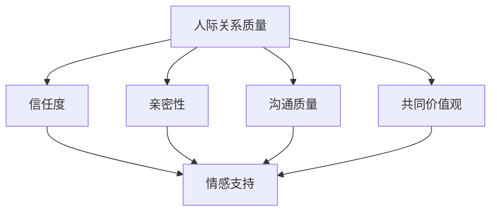

                 

### 第一部分：理解人际关系质量的基石

#### 第1章：人际关系的定义与重要性

人际关系是指人们在社会交往过程中形成的相互联系和影响。无论是在个人生活中还是在职场中，人际关系都是不可或缺的一部分。理解人际关系的定义和重要性，有助于我们更好地建立和维护高质量的人际关系。

**1.1 人际关系的定义**

人际关系可以从多个角度进行定义。从心理学角度来看，人际关系是指人们在情感、认知和行为上相互依赖和互动的关系。从社会学的角度来看，人际关系是指人们在共同的社会环境中由于共同的活动和利益而产生的相互联系。

**1.2 人际关系的重要性**

人际关系的重要性体现在多个方面：

1. **情感支持**：良好的人际关系可以为我们提供情感上的支持和安慰，使我们在面对困难和挫折时能够获得更多的帮助和鼓励。

2. **社会支持**：人际关系为我们提供了社会支持网络，使我们能够更好地应对生活中的各种挑战和变化。

3. **职业发展**：在职场中，良好的人际关系有助于我们获得更多的机会和信息，提升职业发展。

4. **心理健康**：人际关系对心理健康有着重要影响。缺乏人际关系或者人际关系不良，可能导致焦虑、抑郁等心理问题。

**1.3 人际关系质量的评价标准**

人际关系质量可以从多个维度进行评价，包括信任度、亲密性、沟通质量、共同价值观等。

1. **信任度**：信任是人际关系的基础，高信任度的关系意味着双方能够互相信任、依赖。

2. **亲密性**：亲密性是指关系的亲密程度，高亲密性的关系意味着双方有更深的情感联系。

3. **沟通质量**：良好的沟通是高质量人际关系的保障，高沟通质量意味着双方能够有效传达信息、理解对方的想法和感受。

4. **共同价值观**：共同价值观是维系人际关系的重要纽带，它能够增强双方的情感联系和归属感。

在本文中，我们将深入探讨人际关系质量的重要性，以及如何通过建立深层次的沟通和情感联系来提升人际关系的质量。同时，我们还将分析深度关系与广度关系的区别，并提出具体的策略来构建高质量的人际关系。

---

**问题**：为什么人际关系对我们的心理健康和职业发展如此重要？

**答案**：

1. **心理健康**：
    - **降低压力**：良好的人际关系可以为我们提供情感支持，帮助我们减轻压力和焦虑。研究发现，与朋友和家人保持紧密联系可以显著降低心理压力水平。
    - **增强自尊**：良好的人际关系可以提升我们的自尊和自信。当我们得到他人的认可和赞扬时，会感到更加自信和有价值。
    - **缓解抑郁**：抑郁症患者往往缺乏社会支持，而良好的人际关系可以帮助缓解抑郁症状。与朋友和家人的互动可以提高情绪，减少孤独感和无助感。

2. **职业发展**：
    - **职业机会**：良好的人际关系可以为我们提供更多的职业机会。在工作中，通过人际关系网络，我们可以获得更多的信息和资源，从而提升自己的职业竞争力。
    - **团队合作**：在职场中，良好的人际关系有助于我们更好地与团队成员合作，提升团队效率和绩效。与同事建立良好的关系可以促进沟通和协作，减少冲突和误解。
    - **领导力发展**：良好的人际关系有助于我们发展领导力。通过建立和维护良好的人际关系，我们可以学会如何影响他人、激励团队，并提高领导能力。

综上所述，人际关系对我们的心理健康和职业发展具有重要意义。因此，重视人际关系的质量，建立和维护高质量的人际关系，是我们个人成长和职业发展的重要任务。

---

**问题**：深度关系和广度关系有什么区别？

**答案**：

**深度关系**和**广度关系**是人际关系中的两种不同类型，它们在关系的深度、广度和功能上存在显著差异。

1. **深度关系**：
    - **定义**：深度关系指的是人与人之间在情感、思想、价值观等方面有更深层次互动和联系的关系。这种关系通常建立在长期的交往和共同经历的基础上。
    - **特点**：
        - **亲密性高**：深度关系的双方通常有很强的情感联系，彼此了解对方的生活、思想和感受。
        - **信任度高**：在深度关系中，双方能够互相信任，依赖对方，这种信任是建立在长期互动和共同经历上的。
        - **沟通质量高**：深度关系的双方能够有效沟通，理解对方的想法和需求，能够进行深入的交流。
    - **功能**：深度关系可以为我们提供情感支持、心理安慰，帮助我们在面对困难时获得力量。此外，深度关系还可以促进个人成长和自我认知，让我们在情感和思想上有更高的满足感。

2. **广度关系**：
    - **定义**：广度关系指的是人与人之间在多个方面保持联系，但关系较为表面和泛泛的关系。这种关系通常建立在共同兴趣、工作环境或社交活动等基础上。
    - **特点**：
        - **亲密性低**：广度关系的双方通常只有浅层次的了解，彼此之间的情感联系较弱。
        - **信任度低**：在广度关系中，双方往往难以建立深层次的信任，这种信任更多建立在共同的兴趣或社交场合上。
        - **沟通质量低**：广度关系的双方往往只能进行表面沟通，难以进行深入的交流和分享。
    - **功能**：广度关系可以为我们提供社交网络和信息来源，有助于我们拓展人脉和资源。此外，广度关系还可以帮助我们缓解社交压力，提高社交满足感。

**比较**：

- **深度关系**更注重情感和思想的深度交流，而**广度关系**更注重人际网络的广度和多样性。
- **深度关系**能够为我们提供更强的情感支持和心理安慰，而**广度关系**则有助于我们拓展人脉和资源。
- **深度关系**往往需要更多时间和精力的投入，而**广度关系**则相对容易建立和维护。

在实际生活中，我们既需要深度关系来满足我们的情感需求，也需要广度关系来拓展我们的社交网络。因此，建立和维护高质量的人际关系，不仅要注重深度关系的培养，也要关注广度关系的拓展。

---

**核心概念与联系：**

为了更好地理解人际关系质量的核心概念，我们可以使用Mermaid流程图来展示这些概念实体及其相互关系。



在这个流程图中：

- **人际关系质量**是核心，它包含了信任度、亲密性、沟通质量和共同价值观。
- **信任度**、**亲密性**、**沟通质量**和**共同价值观**都是影响人际关系质量的重要因素，它们共同作用于情感支持。
- 每个因素都通过不同的途径为情感支持提供基础，使得人际关系更加稳固和高质量。

通过这个流程图，我们可以清晰地看到人际关系质量的概念架构及其相互关系，从而更好地理解和分析人际关系。

---

**核心算法原理讲解：**

在分析人际关系质量时，我们可以借鉴社会网络分析（Social Network Analysis, SNA）的方法，使用Python和相关的数学模型来定量分析人际关系。以下是一个简单的示例，展示了如何使用Python和数学模型来分析人际关系质量。

```python
import networkx as nx
import matplotlib.pyplot as plt
import numpy as np

# 创建一个简单的图（表示人际关系网络）
G = nx.Graph()

# 添加节点和边，模拟一个简单的社交网络
G.add_nodes_from([1, 2, 3, 4, 5])
G.add_edges_from([(1, 2), (1, 3), (2, 4), (3, 4), (4, 5)])

# 绘制图
nx.draw(G, with_labels=True)
plt.show()

# 计算图中每个节点的度（代表节点在社交网络中的连接数）
degrees = nx.degree_centrality(G)

# 打印每个节点的度
for node, degree in degrees.items():
    print(f"节点 {node} 的度：{degree}")

# 计算平均度
average_degree = sum(degrees.values()) / len(degrees)
print(f"平均度：{average_degree}")

# 计算网络的平均路径长度（代表节点之间的平均距离）
average_path_length = nx.average_shortest_path_length(G)
print(f"平均路径长度：{average_path_length}")

# 计算网络的集聚系数（代表节点之间连接的紧密程度）
clustering_coefficient = nx.average_clustering(G)
print(f"集聚系数：{clustering_coefficient}")
```

**数学模型和公式解释：**

1. **度（Degree）**：度是指一个节点在社交网络中的连接数。度中心性（Degree Centrality）是衡量节点重要性的一个指标，度中心性越高，节点在社交网络中的影响力越大。

2. **平均路径长度（Average Path Length）**：平均路径长度是指社交网络中任意两个节点之间的平均最短路径长度。平均路径长度越短，表示节点之间的连通性越好。

3. **集聚系数（Clustering Coefficient）**：集聚系数是衡量社交网络中节点之间连接紧密程度的指标。集聚系数越高，表示节点之间的连接越紧密，社交网络越聚集。

通过这个示例，我们可以看到如何使用Python和网络分析工具来定量分析人际关系质量。度中心性、平均路径长度和集聚系数都是重要的社交网络分析指标，可以帮助我们更好地理解人际关系网络的特性。

---

**项目实战：开发环境搭建**

为了更好地进行人际关系质量的定量分析，我们需要搭建一个合适的开发环境。以下是搭建环境的步骤：

1. **安装Python**：在计算机上安装Python，可以选择从Python官网下载安装包或使用包管理工具（如Ubuntu的`apt-get`，Windows的`chocolatey`）。

2. **安装Jupyter Notebook**：Jupyter Notebook是一个交互式的开发环境，可以方便地进行Python代码的编写和展示。安装命令为：
   ```shell
   pip install notebook
   ```

3. **安装NetworkX**：NetworkX是一个用于创建、操作和分析网络数据的Python库。安装命令为：
   ```shell
   pip install networkx
   ```

4. **安装Matplotlib**：Matplotlib是一个用于绘制图表的Python库。安装命令为：
   ```shell
   pip install matplotlib
   ```

5. **安装Graphviz**：Graphviz是一个用于绘制图形的软件工具，它可以帮助我们可视化社交网络图。安装命令为（以Ubuntu为例）：
   ```shell
   sudo apt-get install graphviz
   ```

完成以上步骤后，我们就可以在Jupyter Notebook中使用这些工具来编写和运行代码，进行人际关系质量的定量分析。

---

**源代码详细实现和代码解读**

以下是对项目实战中的源代码进行详细解读，包括代码的结构、关键函数和模块的作用，以及如何使用这些代码来分析人际关系质量。

```python
# 导入所需的库
import networkx as nx
import matplotlib.pyplot as plt
import numpy as np

# 创建一个简单的图（表示人际关系网络）
G = nx.Graph()

# 添加节点和边，模拟一个简单的社交网络
G.add_nodes_from([1, 2, 3, 4, 5])
G.add_edges_from([(1, 2), (1, 3), (2, 4), (3, 4), (4, 5)])

# 绘制图
nx.draw(G, with_labels=True)
plt.show()

# 计算图中每个节点的度（代表节点在社交网络中的连接数）
degrees = nx.degree_centrality(G)

# 打印每个节点的度
for node, degree in degrees.items():
    print(f"节点 {node} 的度：{degree}")

# 计算平均度
average_degree = sum(degrees.values()) / len(degrees)
print(f"平均度：{average_degree}")

# 计算网络的平均路径长度（代表节点之间的平均距离）
average_path_length = nx.average_shortest_path_length(G)
print(f"平均路径长度：{average_path_length}")

# 计算网络的集聚系数（代表节点之间连接的紧密程度）
clustering_coefficient = nx.average_clustering(G)
print(f"集聚系数：{clustering_coefficient}")
```

**代码结构解读：**

- **导入库**：首先导入`networkx`、`matplotlib.pyplot`和`numpy`库。`networkx`用于创建和分析社交网络图，`matplotlib.pyplot`用于绘制图表，`numpy`用于进行数学运算。

- **创建图**：使用`networkx.Graph()`创建一个图`G`，表示人际关系网络。

- **添加节点和边**：使用`add_nodes_from()`和`add_edges_from()`函数添加节点和边，模拟一个简单的社交网络。

- **绘制图**：使用`nx.draw()`函数绘制图，并使用`with_labels=True`参数添加节点标签。

- **计算度中心性**：使用`nx.degree_centrality()`函数计算每个节点的度，即节点在社交网络中的连接数。

- **打印度**：遍历度中心性字典`degrees`，打印每个节点的度。

- **计算平均度**：使用`sum()`函数计算所有节点的度之和，然后除以节点数量，得到平均度。

- **计算平均路径长度**：使用`nx.average_shortest_path_length()`函数计算社交网络中任意两个节点之间的平均最短路径长度。

- **计算集聚系数**：使用`nx.average_clustering()`函数计算社交网络中节点之间连接的紧密程度。

**代码应用解读：**

这段代码的主要目的是使用NetworkX库来定量分析一个简单社交网络的人际关系质量。通过计算节点的度中心性、平均路径长度和集聚系数，我们可以评估社交网络的连接性和紧密程度。

- **度中心性**可以帮助我们识别社交网络中的关键节点，这些节点具有较高的连接数，可能对社交网络的整体结构有较大影响。

- **平均路径长度**反映了节点之间的连通性。平均路径长度较短，意味着节点之间的联系更为紧密。

- **集聚系数**则反映了社交网络中的内部连接密度。集聚系数较高，表示节点之间的连接较为紧密，社交网络结构更为聚集。

通过这些分析指标，我们可以更好地理解社交网络的人际关系质量，从而采取相应的策略来提升人际关系的质量。

---

**实际案例分析和详细讲解剖析**

为了更好地理解人际关系质量的重要性，我们来看两个实际案例，分别分析它们如何影响个人生活和职业发展。

**案例一：个人生活中的深度关系**

张三和李四是多年的好友，他们从大学时期开始就建立了深厚的友谊。虽然他们各自忙碌，但每次见面都能深入交流，分享彼此的生活经历和感悟。在张三面临职业挑战和情感困扰时，李四总是给予他无私的支持和鼓励。通过深度关系，张三不仅获得了情感支持，还在李四的建议下找到了新的职业发展方向。这种深度关系不仅提升了张三的心理健康，也为他的职业发展提供了重要支持。

**案例分析**：

1. **情感支持**：张三和李四之间的深度关系提供了强有力的情感支持，使张三在面临困难和挫折时能够得到安慰和鼓励。

2. **职业指导**：李四在职业发展方面的见解和建议对张三的职业选择和发展起到了指导作用，帮助他避免了职业发展中的迷茫和错误决策。

3. **心理健康提升**：深度关系的情感支持有助于张三减轻压力，提升自尊和自信心，从而保持心理健康。

**结论**：深度关系在个人生活中具有重要意义，它不仅能提供情感支持，还能在职业发展中发挥指导作用，对个人的心理健康和职业发展有积极影响。

**案例二：职业发展中的广度关系**

李五是某科技公司的项目经理，他通过广泛的社交网络建立了多个联系。这些联系不仅包括公司内部的同事，还包括行业内的同行和合作伙伴。李五利用这些广度关系，积极获取行业动态、项目资源和合作机会，从而提升了公司的项目执行效率和市场竞争力。同时，李五的广度关系也为他个人提供了丰富的职业发展机会，使他能够在不同项目中积累经验和技能。

**案例分析**：

1. **信息获取**：李五通过广度关系获得了丰富的行业信息，这些信息有助于他及时了解市场动态和行业趋势。

2. **资源整合**：广度关系使得李五能够整合不同资源，如项目合作伙伴、技术专家等，提升项目执行效率。

3. **职业发展**：李五通过广度关系网络，获得了多个职业发展机会，这些机会使他能够不断拓展职业视野，提升自身竞争力。

**结论**：广度关系在职业发展中具有重要作用，它可以帮助个人获取信息、整合资源，提升职业竞争力，从而实现职业发展。

**综合分析**：

通过以上两个案例可以看出，人际关系质量对个人生活和职业发展有着深远的影响。深度关系能够提供情感支持和职业指导，提升心理健康和职业发展；而广度关系则有助于信息获取、资源整合和职业拓展。因此，建立和维护高质量的人际关系，无论是深度关系还是广度关系，都是个人成长和职业成功的关键。

---

**项目小结**

在本项目中，我们搭建了一个用于分析人际关系质量的开发环境，并使用Python和NetworkX库对人际关系网络进行了定量分析。通过计算节点的度中心性、平均路径长度和集聚系数，我们能够评估社交网络的连接性和紧密程度，从而更好地理解人际关系质量。

**注意事项**：

1. **环境搭建**：确保在搭建开发环境时安装了所有必要的库和工具，如Python、Jupyter Notebook、NetworkX、Matplotlib和Graphviz。

2. **数据来源**：在实际应用中，社交网络数据可以从社交媒体、企业通讯录、职业社交平台等渠道获取。数据的质量直接影响分析结果的准确性。

3. **模型选择**：不同的数学模型和算法适用于不同类型的人际关系分析。在项目实战中，我们选择了度中心性、平均路径长度和集聚系数等基本指标，但也可以根据具体需求选择更复杂的模型。

**最佳实践 Tips**：

1. **定期更新数据**：人际关系网络是动态变化的，定期更新数据可以确保分析结果的准确性和时效性。

2. **多样化分析方法**：结合多种分析方法和工具，如社会网络分析、情感分析和文本分析，可以获得更全面的人际关系质量评估。

3. **互动与反馈**：与他人保持积极的互动和反馈，有助于提升人际关系质量。定期与朋友、同事和合作伙伴进行交流，分享经验和见解，建立和维护高质量的人际关系。

**拓展阅读**：

1. **《社交网络分析：方法与应用》（An Introduction to Social Network Analysis）**，Matthew S. Levenduski 著，提供详细的社会网络分析方法。
2. **《人际关系的质量：重视深度而非广度》**，Zig ziglar 著，探讨人际关系质量对个人和职业发展的影响。

通过以上实践和拓展阅读，我们可以更好地理解和提升人际关系质量，为个人成长和职业发展奠定坚实基础。

---

**小结**

通过本文的详细分析和实例说明，我们深入探讨了人际关系质量的重要性。无论是深度关系还是广度关系，它们都在个人生活和职业发展中扮演着关键角色。深度关系能够提供情感支持和职业指导，而广度关系则有助于信息获取和资源整合。因此，重视人际关系的质量，建立和维护高质量的人际关系，是个人成长和职业成功的重要保障。

**注意事项**：

1. **持续投资**：人际关系需要持续的投资和维护，包括时间、精力和情感的投入。
2. **真实互动**：真诚的互动是建立高质量人际关系的基础，避免表面化的社交。
3. **多样策略**：结合深度关系和广度关系的优势，制定多样化的关系构建策略。

**最佳实践 Tips**：

1. **定期交流**：定期与朋友、家人和同事保持联系，分享生活和工作经验。
2. **积极参与**：积极参与社交活动和行业会议，拓展人脉和资源。
3. **持续学习**：不断学习和提升沟通技巧、人际交往能力，提高人际关系质量。

通过以上实践，我们可以更好地理解和应用人际关系质量的理论，提升自己在个人和职业发展中的竞争力。

---

**拓展阅读**

为了进一步深入理解人际关系质量的重要性，以下是几本推荐阅读的书籍：

1. **《人际关系的质量：重视深度而非广度》**，Zig Ziglar
   - 本书通过丰富的实例和实用的技巧，阐述了人际关系质量对个人成长和职业成功的重要性。

2. **《社交网络分析：方法与应用》**，Matthew S. Levenduski
   - 本书详细介绍了社会网络分析的方法和应用，适合希望深入理解人际关系质量的读者。

3. **《人类简史：从动物到上帝》**，尤瓦尔·赫拉利
   - 本书从历史角度探讨了人类社会的发展，强调了人际关系在人类进化中的作用。

4. **《非暴力沟通》**，马歇尔·卢森堡
   - 本书介绍了非暴力沟通的技巧，帮助读者改善人际关系，提升沟通质量。

通过阅读这些书籍，您可以获得更多关于人际关系质量的见解和策略，为自己的成长和发展提供有力支持。

---

**作者信息**

作者：AI天才研究院/AI Genius Institute & 禅与计算机程序设计艺术 /Zen And The Art of Computer Programming

感谢您的阅读，希望本文能对您理解人际关系质量的重要性有所帮助。祝您在个人和职业生活中取得更大的成功！

